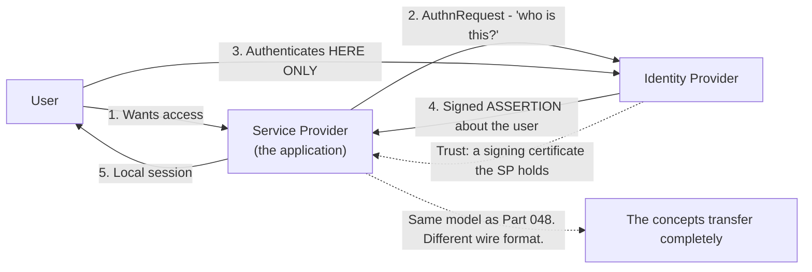
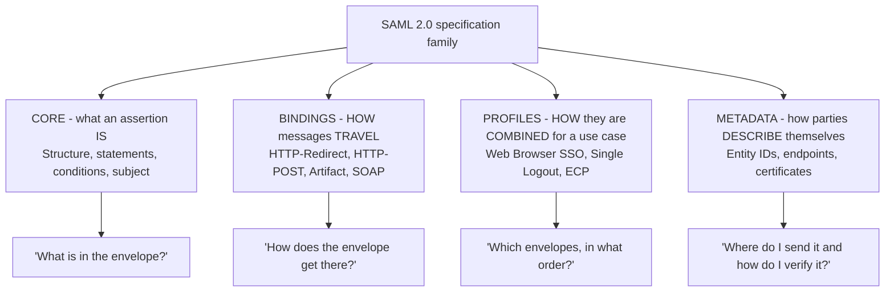
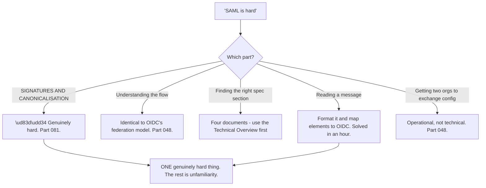
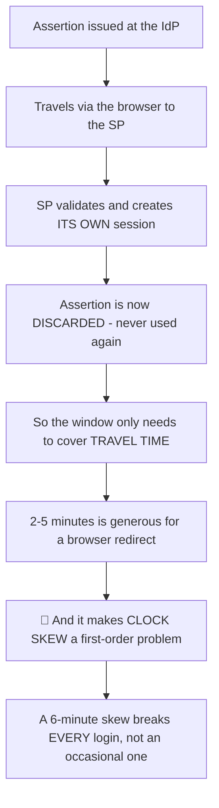
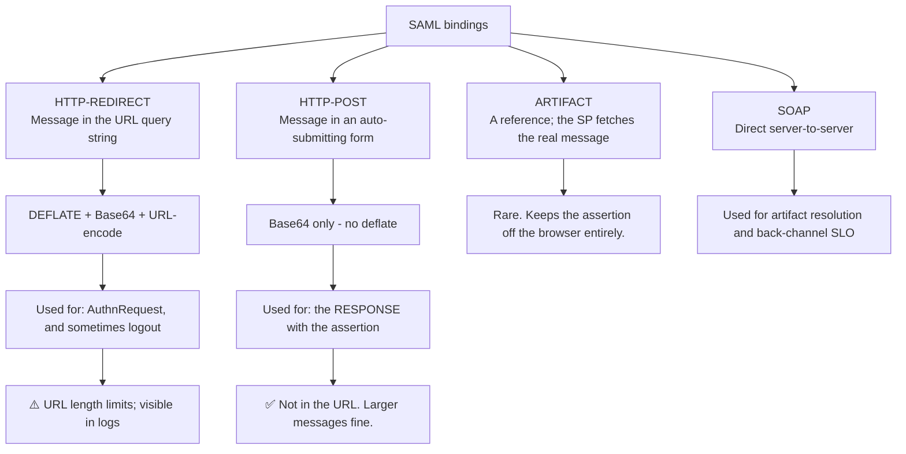
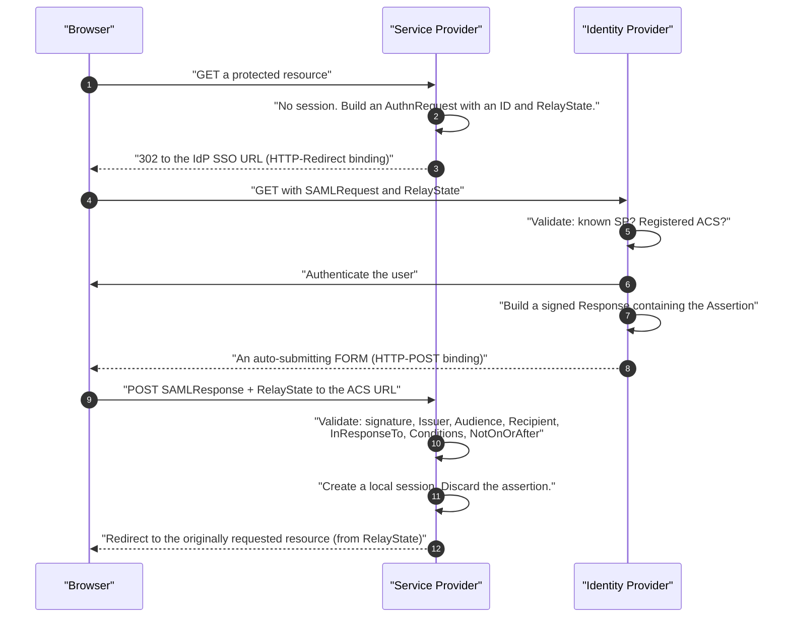
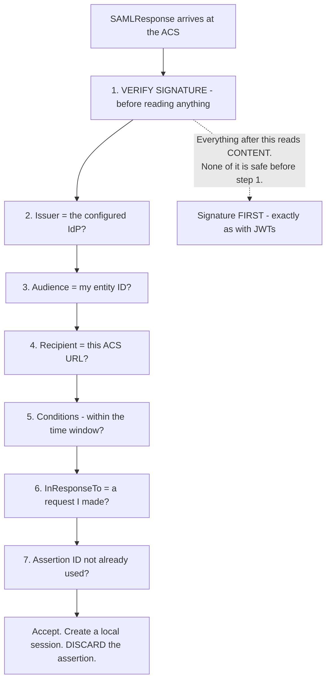
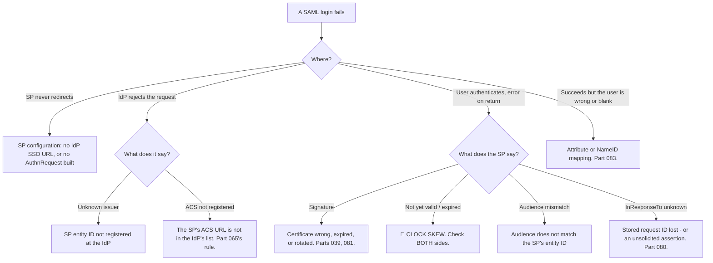

# Part 079 - SAML 2.0 From Zero: Assertions, Bindings, Profiles

> Section goal: Build SAML from first principles — what an assertion is, how it travels, and how the specification is organised — so that reading a real SAML message becomes routine. SAML looks intimidating because it is XML; the model underneath is straightforward.

Covers index item **079**. Maps to JD signals: *knowledge of SAML*, *knowledge of authentication and authorization*, *communicate technical concepts clearly*, *strong analytical and problem-solving skills*, and *basic security concepts*.

---

## 1. Start From Zero: The Same Problem, Solved Earlier

SAML 2.0 (2005) solves what OIDC solves (Part 070): letting an application trust an external party's statement about a user, without ever seeing their password.



| SAML | OIDC equivalent |
|---|---|
| Identity Provider (IdP) | OpenID Provider (OP) |
| Service Provider (SP) | Relying Party (RP) |
| **Assertion** | **ID token** |
| `AuthnRequest` | Authorization request |
| Assertion Consumer Service (ACS) | Redirect URI |
| Entity ID | Issuer / client ID |
| Attributes | Claims |
| Metadata | Discovery document |
| Single Logout (SLO) | RP-initiated / back-channel logout |

**Everything from Part 048 applies.** Only the encoding and the terminology change.

> **Analogy.** A notarised letter of introduction, versus a digitally-signed ID card. Both attest identity; one is verbose and formal, one is compact and modern.
>
> **Where it stops:** a letter is read by a person who can interpret it. XML is parsed and canonicalised by software, which is why SAML's failure modes are more often *format* problems than *logic* problems.

---

## 2. The Three Layers of the Specification

SAML is organised in a way that confuses people until it is named.



| Layer | Answers | Why it matters in support |
|---|---|---|
| **Core** | What an assertion contains | Reading and validating a message |
| **Bindings** | How it travels | Redirect versus POST changes what you see in a HAR |
| **Profiles** | Which combination for SSO | Web Browser SSO is the one you will meet |
| **Metadata** | Endpoints and certificates | Configuration and rotation (Part 048) |

**The profile you care about is Web Browser SSO.** Almost everything else is rare in practice.

### 🔍 Plain-English deep-dive: why SAML looks harder than it is

SAML has a reputation for difficulty, and the reasons are worth separating — because **only one of them is genuinely hard, and the rest are unfamiliarity.**

| Reason it feels hard | Is it actually? |
|---|---|
| XML with namespaces | ❌ Unfamiliar, not hard. Formatting tools fix readability |
| Long element names | ❌ Verbose, not complex |
| Four separate specification documents | ⚠️ Genuinely awkward to navigate the first time |
| Two different message encodings | ❌ One rule to learn (§4) |
| **XML canonicalisation and enveloped signatures** | ✅ **Genuinely hard** — and it matters (Part 081) |
| Configuration exchanged by email between two teams | ⚠️ An operational problem, not a protocol one |



**The one genuinely hard part is signatures**, and it is hard for a specific reason: an XML signature covers a *canonicalised* form of the document, so **any change that a human would consider cosmetic — whitespace, attribute order, namespace prefixes — can invalidate it.** That is unlike a JWT, where the signature covers exact bytes and the failure mode is obvious.

**The practical consequence is a rule worth learning immediately:** never reformat, pretty-print, or re-serialise a SAML message you intend to validate. **Decode a copy for reading; validate the original.**

**Why saying this to a customer helps:** developers debugging SAML routinely paste a message into a formatter, then wonder why signature validation now fails. Naming the cause early saves hours, and it makes the rest of the protocol feel manageable rather than mysterious.

**The other genuinely awkward thing is not the protocol at all** — it is that SAML configuration is an exchange between two organisations, by email, of values that must match exactly (Part 048). **That is a coordination problem wearing a technical costume**, and recognising it changes how you run the ticket.

**Analogy:** a legal document in an unfamiliar format. Most of the difficulty is layout and vocabulary; one clause genuinely requires expertise. Treating the whole thing as impenetrable means never getting to the clause that matters. **Where it stops:** a lawyer reads the whole document. Here you can safely skim most of it once the element mapping is memorised, and concentrate on signatures and configuration.

---

## 3. The Assertion

The core object. A signed XML statement about a subject.

```xml
<saml:Assertion ID="_abc123" IssueInstant="2026-08-26T10:00:00Z" Version="2.0">
  <saml:Issuer>https://idp.example.com/</saml:Issuer>
  <ds:Signature>...</ds:Signature>
  <saml:Subject>
    <saml:NameID Format="...:persistent">alice@corp.com</saml:NameID>
    <saml:SubjectConfirmation Method="...:bearer">
      <saml:SubjectConfirmationData
        NotOnOrAfter="2026-08-26T10:05:00Z"
        Recipient="https://app.example.com/acs"
        InResponseTo="_req456"/>
    </saml:SubjectConfirmation>
  </saml:Subject>
  <saml:Conditions NotBefore="2026-08-26T09:59:00Z" NotOnOrAfter="2026-08-26T10:05:00Z">
    <saml:AudienceRestriction>
      <saml:Audience>https://app.example.com</saml:Audience>
    </saml:AudienceRestriction>
  </saml:Conditions>
  <saml:AuthnStatement AuthnInstant="2026-08-26T09:59:55Z" SessionIndex="_sess789">
    <saml:AuthnContext>
      <saml:AuthnContextClassRef>...:PasswordProtectedTransport</saml:AuthnContextClassRef>
    </saml:AuthnContext>
  </saml:AuthnStatement>
  <saml:AttributeStatement>
    <saml:Attribute Name="email"><saml:AttributeValue>alice@corp.com</saml:AttributeValue></saml:Attribute>
  </saml:AttributeStatement>
</saml:Assertion>
```

| Element | OIDC equivalent | Purpose |
|---|---|---|
| **`Issuer`** | `iss` | Who issued it |
| **`Signature`** | JWS signature | Integrity and origin |
| **`NameID`** | `sub` | Who the user is |
| **`Recipient`** | — | Which ACS URL it is for |
| **`InResponseTo`** | `state`-like | Which request it answers |
| **`Audience`** | `aud` | Which SP it is for |
| **`NotBefore` / `NotOnOrAfter`** | `nbf` / `exp` | Validity window |
| **`AuthnInstant`** | `auth_time` | When authentication happened |
| **`SessionIndex`** | `sid` | Which session — used for logout (Part 085) |
| **`AuthnContextClassRef`** | `acr` | How they authenticated |
| **`Attribute`** | Claims | Everything else |

### 🔍 Plain-English deep-dive: SAML's validity window is much tighter than a token's

The `Conditions` and `SubjectConfirmationData` timestamps typically allow **five minutes or less** — far shorter than a JWT's lifetime.

**That is deliberate, and it follows from a design difference:**

| | SAML assertion | Access token |
|---|---|---|
| Used | **Once**, at the moment of login | Repeatedly, for its lifetime |
| Then | Discarded — the SP creates its own session | Held and re-presented |
| So validity needs to be | **Just long enough to arrive** | Long enough to be useful |
| Typical window | **2–5 minutes** | 15–60 minutes |



**The consequence is that clock skew matters far more in SAML than in OAuth.** A JWT with a one-hour lifetime tolerates several minutes of drift almost unnoticed. A SAML assertion with a two-minute window fails **completely** at three minutes of skew — and the error says the assertion is not yet valid, or has expired, which sounds like a timing bug rather than a clock problem.

**Two distinctive symptoms worth recognising:**

**1. "Login worked this morning and stopped this afternoon"** with no changes — a clock drifting past the tolerance threshold. **Drift is gradual; the failure is sudden**, because a threshold was crossed.

**2. "NotBefore" failures specifically** mean the SP's clock is *behind* the IdP's — the assertion is from the SP's future. That is a useful direction indicator that OAuth's expiry errors do not give you.

**The correct handling mirrors Part 043:** a small skew allowance of a minute or two, plus **NTP on both sides** — and "both sides" means two organisations, which makes it a coordination problem rather than a configuration one.

**And a caution worth carrying:** widening the tolerance is tempting and extends the replay window for an assertion designed to be short-lived. **Fix the clocks.**

**Analogy:** a courier signature valid only for the few minutes it takes to walk from the van to the door. Sensible — and if the two clocks disagree, nothing is ever delivered. **Where it stops:** a courier can check a watch. Two organisations' servers cannot compare clocks unless someone measures them deliberately.

---

## 4. Bindings: How Messages Travel



| Binding | Encoding | Typically carries |
|---|---|---|
| **HTTP-Redirect** | **Deflate** + Base64 + URL-encode | `AuthnRequest`, `LogoutRequest` |
| **HTTP-POST** | Base64 only | `Response` containing the assertion |
| Artifact | A short reference | Either, in high-security deployments |
| SOAP | XML over HTTP POST | Artifact resolution, back-channel SLO |

**The encoding difference is the practical detail** that catches people decoding messages by hand: a redirect-binding message must be **inflated** after Base64-decoding; a POST-binding message must not (Part 082).

---

## 5. Web Browser SSO Profile

The profile you will actually support.



**`RelayState` is SAML's `state`** (Part 065) — the SP generates it, the IdP returns it unchanged, and the SP uses it to restore the original destination. **The same rules apply:** opaque, unpredictable, and a key into server-side storage rather than a URL.

### 🔍 Plain-English deep-dive: the six checks an SP must perform

The validation list is where SAML security actually lives, and like OIDC's it is **routinely partial**.

| # | Check | If skipped |
|---|---|---|
| 1 | **Signature** — verified before parsing content | 🔴 Forged assertions accepted |
| 2 | **`Issuer`** matches the configured IdP | 🔴 Another IdP's assertion accepted |
| 3 | **`Audience`** matches this SP's entity ID | 🔴 Another SP's assertion accepted |
| 4 | **`Recipient`** matches this ACS URL | 🔴 Assertion redirected to a different endpoint |
| 5 | **`Conditions`** — `NotBefore` and `NotOnOrAfter` | 🔴 Expired or premature assertions accepted |
| 6 | **`InResponseTo`** matches a request this SP made | 🔴 **Unsolicited assertions accepted** (Part 080) |
| 7 | **Assertion ID not seen before** | 🔴 **Replay** within the window |



**Checks 3 and 4 are frequently confused**, and they are different: `Audience` says *which service provider* the assertion is for; `Recipient` says *which endpoint* it should be delivered to. **An SP with multiple ACS URLs needs both**, and checking only `Audience` leaves an assertion redirectable within the same SP.

**Checks 6 and 7 are the ones most often absent**, and both for the same reason as OIDC's `nonce`: everything works without them. `InResponseTo` is what makes an assertion belong to *this* flow; assertion-ID tracking is what stops the same valid assertion being submitted twice inside its window.

**Check 1's ordering is the same rule as Part 043's:** verify, then read. An SP that parses attributes and *then* verifies the signature has, for a moment, trusted unverified content — and if any decision was made in that moment, the verification was decorative.

**The support-facing question set**, which mirrors Part 071's five questions: *"Which of these six does your SP library check by default, and which did you configure?"* **Most libraries do 1–5 and leave 6 and 7 to the application.**

**Analogy:** checking a document's seal, who issued it, that it names you, that it was delivered to the right desk, that it is in date, that it answers a request you actually made, and that you have not already processed it. Skipping the last two feels harmless until someone submits the same genuine document twice. **Where it stops:** a clerk would remember seeing it before. Software remembers nothing unless it was told to.

---

## 6. Failure Modes

| Failure mode | What it looks like | Consequence | Correction |
|---|---|---|---|
| **Clock skew** | Sudden total failure | 🔴 Every login fails | NTP both sides; small tolerance |
| **Widening the time window** | Skew "fixed" | Extends the replay window | Fix the clocks |
| **`Recipient` not checked** | Works | 🔴 Assertion accepted at the wrong ACS | Validate it |
| **`Audience` not checked** | Works | 🔴 Another SP's assertion accepted | Validate it |
| **`InResponseTo` not checked** | Works | 🔴 Unsolicited assertions accepted (Part 080) | Validate against a stored request ID |
| **Assertion ID not tracked** | Works | 🔴 **Replay** within the window | Track IDs for the validity period |
| **`RelayState` predictable or reflected** | Works | 🔴 CSRF or open redirect | Opaque key into storage |
| **Inflating a POST-binding message** | Decode fails | Wasted time | POST is not deflated |
| **Not inflating a redirect message** | Decode fails | Wasted time | Redirect **is** deflated |
| **Assertion treated as a session** | Constant re-login | Poor UX | Create a local session |
| **Signature not verified before parsing** | Works | 🔴 Trusting unsigned content | Verify first (Part 081) |

---

## 7. Troubleshooting Decision Tree: SAML Basics



### Worked example

*"SSO worked fine this morning. Since about 2pm nobody can log in. Nothing changed."*

1. **"Worked, then stopped, nothing changed" has two leading candidates in SAML:** certificate expiry (Part 048) and **clock skew**.
2. **Get the exact SP-side error.** It says the assertion is not yet valid.
3. **That is decisive, and it also gives direction:** a `NotBefore` failure means the SP's clock is **behind** the IdP's — the assertion appears to be from the SP's future.
4. **Explain why it was sudden.** Drift is gradual; the failure is not. The clock crossed the tolerance threshold at 2pm, and everything before that worked. **This resolves the "nothing changed" objection**, which is true and unhelpful without this explanation.
5. **Measure both clocks** against a reference. Do not assume which side drifted.
6. **Fix with NTP**, not by widening the tolerance — widening extends the replay window on an assertion deliberately designed to be short-lived.
7. **Note the coordination reality:** if the drifted clock is the customer's IdP, this is their infrastructure team's action, and your deliverable is the evidence pack (Part 077) — the exact error, the timestamp, and the measured difference.
8. **Suggest prevention.** A monitoring check comparing both sides' time to a reference turns a recurring mystery into an alert.

---

## 8. Lab: Read a Real Assertion

**Purpose.** Perform a full SAML SSO, decode the messages by hand, and identify every element.

**Prerequisites.** Parts 040, 048, 082 tooling. A free Auth0 tenant plus a second identity source configurable as a SAML IdP.

**Steps.**

1. Create `okta-prep/labs/079-saml-basics/`.
2. **Configure a SAML connection.** Record every value exchanged and its direction (Part 048).
3. **Complete an SP-initiated login.** **Capture a HAR** (Part 021).
4. **Find the `AuthnRequest`.** It is in the redirect URL. **Decode it by hand**: URL-decode, Base64-decode, **inflate**. Save the XML.
5. **Find the `Response`.** It is in the POST body. **Decode it by hand**: Base64-decode only — **do not inflate**. Save the XML. **Record that the two encodings differ.**
6. **Annotate the assertion.** Mark every element from §3 and write its OIDC equivalent beside it. **This mapping is what makes SAML feel familiar.**
7. **Record the validity window.** Compute `NotOnOrAfter` minus `IssueInstant`. **Compare it to a typical access-token lifetime.**
8. **Find `InResponseTo`** and match it to the `AuthnRequest` ID. **Confirm they correspond.**
9. **Find `RelayState`** in both directions and confirm it round-trips unchanged.
10. **Find the `SessionIndex`** and note it for Part 085.
11. **Break the clock.** Shift your local time by ten minutes and retry. **Record the exact error** and note whether it says `NotBefore` or expired.
12. **Reverse the shift** and confirm which direction produces which error. **Record both** — this is the direction indicator from §3.
13. **Break the audience.** Change the SP entity ID on one side. Record the error.
14. **Break the recipient.** If your SP allows it, alter the expected ACS URL. Record the error.
15. **Build `saml-decode`.** A script taking either binding and printing the formatted XML plus a summary of the key elements. **This is your Part 082 tool, started here.**
16. **Write the primer.** `saml-primer.md` — one page: the four specification layers, the assertion elements with OIDC equivalents, and the two binding encodings.
17. **Failure catalog + manifest.** Complete `MANIFEST.md`.

**Expected evidence.** A working SAML login with a HAR, both messages hand-decoded with the encoding difference recorded, a fully annotated assertion with OIDC equivalents, a computed validity window, `InResponseTo` and `RelayState` correlation, two clock-skew errors in both directions, audience and recipient failures, a working decode script, and a one-page primer.

**Validation rubric.**

| Check | Pass condition |
|---|---|
| Both messages decoded | By hand, with the encoding difference noted |
| Assertion annotated | Every element mapped to its OIDC equivalent |
| Validity window | Computed and compared |
| Correlation | `InResponseTo` matched to the request ID |
| Clock skew | Both directions, distinct errors recorded |
| Audience and recipient | Both failures recorded |
| Decode script | Handles both bindings |

**Cleanup and privacy.** Lab tenants and synthetic users only. **Restore your system clock.** Assertions contain personal data — redact before saving, and delete them at the end. Delete both connections.

---

## 9. JD Mapping

| Supplied JD signal | How this Part supports it |
|---|---|
| **Knowledge of SAML** | Assertions, bindings, profiles, and metadata from first principles |
| Knowledge of authentication and authorization | The same federation model as Part 048, in a second protocol |
| **Communicate technical concepts clearly** | Mapping every SAML element to its OIDC equivalent |
| Strong analytical and problem-solving skills | Sudden total failure diagnosed as clock skew, with direction |
| **Basic security concepts** | Validity windows, replay tracking, and why widening tolerance is wrong |
| Experience troubleshooting web applications | Hand-decoding both bindings from a HAR |

---

## 10. Candidate Honesty Note

- **Claim safety:** *Learned architecture and lab experience.*
- **The strongest thing you can say:** *"SAML solves exactly what OIDC solves — an application trusting an external party's statement about a user without seeing their password. Every concept maps: assertion to ID token, NameID to `sub`, Audience to `aud`, entity ID to issuer, metadata to discovery, ACS URL to redirect URI. Once you see the mapping, the only new thing is XML."*
- **A second point, and it is a genuine protocol difference:** *"SAML's validity window is two to five minutes, not an hour, because an assertion is used once at login and then discarded — it only needs to survive the browser redirect. The consequence is that clock skew matters far more than in OAuth: a JWT with an hour's lifetime absorbs a few minutes of drift, while a SAML assertion fails completely."*
- **A third, diagnostic:** *"'Worked this morning, stopped this afternoon, nothing changed' in SAML is clock skew or certificate expiry. And a `NotBefore` failure specifically tells you the SP's clock is behind the IdP's — a direction indicator OAuth's expiry errors don't give you."*
- **A fourth, on why the failure is sudden:** *"Drift is gradual and the failure isn't — a threshold gets crossed. Saying that resolves the 'nothing changed' objection, which is true and unhelpful on its own."*
- **A fifth, on a tempting wrong fix:** *"Widening the time tolerance makes it work and extends the replay window on an assertion deliberately designed to be short-lived. Fix the clocks — and recognise that if the drifted clock is the customer's, this is a coordination problem, not a configuration one."*
- **A sixth, practical:** *"The two bindings encode differently — redirect messages are deflated and POST messages are not. Trying to inflate a POST-binding response is a classic five minutes wasted."*
- **Do not overstate:** you have not supported production SAML federations. Say you have configured SAML, decoded both bindings by hand, and reproduced the core failures in a lab.

---

## 11. Official Source Anchors

Accessed **26 August 2026**.

| Source | What it defines |
|---|---|
| OASIS SAML 2.0 Core | Assertions, statements, conditions, subject confirmation |
| OASIS SAML 2.0 Bindings | HTTP-Redirect, HTTP-POST, Artifact, SOAP, and their encodings |
| OASIS SAML 2.0 Profiles | Web Browser SSO, Single Logout, ECP |
| OASIS SAML 2.0 Metadata | Entity descriptors, endpoints, certificates (Part 081) |
| OASIS SAML 2.0 Security and Privacy Considerations | Replay, skew, and validation requirements |
| OASIS SAML 2.0 Technical Overview | The most readable introduction |
| Auth0 and Okta documentation — SAML connections | Vendor configuration surfaces |
| Microsoft Entra ID documentation — SAML applications | The most common enterprise IdP (Part 091) |

**Revalidate after 26 August 2026:** SAML 2.0 is stable and unchanged since 2005. Recheck vendor configuration surfaces only.

---

## ⭐ Likely Interview Questions for This Section

### Q1. "Explain SAML to someone who knows OIDC."
> *Model answer:* "It solves the same problem — an application trusting an external party's statement about a user without seeing their credentials — using XML instead of JSON and predating OIDC by nearly a decade. Every concept maps: the assertion is the ID token, `NameID` is `sub`, `Audience` is `aud`, the entity ID is the issuer, the Assertion Consumer Service URL is the redirect URI, attributes are claims, metadata is the discovery document, and `RelayState` is `state`. The specification is organised into Core — what an assertion contains, Bindings — how messages travel, Profiles — which combinations serve a use case, and Metadata. The profile you'll actually meet is Web Browser SSO; almost everything else is rare."

### Q2. "What's in a SAML assertion?"
> *Model answer:* "An issuer, a signature, a subject with a `NameID` identifying the user, subject confirmation data including the `Recipient` — which ACS URL it's for — and `InResponseTo`, which correlates it to a specific request. Then conditions: `NotBefore` and `NotOnOrAfter` bounding validity, and an `AudienceRestriction` naming which service provider it's for. An authentication statement with `AuthnInstant`, a `SessionIndex` used later for logout, and an authentication context describing how they authenticated. And an attribute statement carrying everything else. Each of those maps to something in an ID token, which is the fastest way to hold it if you already know OIDC."

### Q3. "Why is clock skew a bigger problem in SAML than in OAuth?"
> *Model answer:* "Because the validity window is much tighter — typically two to five minutes rather than an hour. That's deliberate: an assertion is used once, at the moment of login, and then discarded because the service provider creates its own session. So it only needs to survive a browser redirect. The consequence is that a JWT with an hour's lifetime absorbs a few minutes of drift almost unnoticed, while a SAML assertion fails completely. It also produces a distinctive symptom: 'worked this morning, stopped this afternoon, nothing changed.' Drift is gradual and the failure is sudden, because a threshold gets crossed — and saying that explicitly resolves the 'nothing changed' objection, which is true and unhelpful on its own."

### Q4. "The error says the assertion is not yet valid. What does that tell you?"
> *Model answer:* "That the service provider's clock is behind the identity provider's — the assertion looks like it's from the SP's future, so `NotBefore` hasn't been reached. That's a useful direction indicator that OAuth's expiry errors don't give you: an expired-assertion error means the opposite, the SP is ahead. I'd measure both clocks against a reference rather than assuming which drifted. The fix is NTP on both sides, not widening the time tolerance — widening makes it work and extends the replay window on something deliberately short-lived. And if the drifted clock is the customer's IdP, this becomes a coordination problem: my deliverable is the evidence pack with the exact error, the timestamp, and the measured difference."

### Q5. "What are SAML bindings?"
> *Model answer:* "How messages travel. HTTP-Redirect puts the message in a URL query string, deflated then Base64-encoded then URL-encoded — used for the `AuthnRequest` and sometimes logout, and it's subject to URL length limits and appears in logs. HTTP-POST puts it in an auto-submitting form, Base64-encoded only with no deflate — used for the response carrying the assertion, since assertions are larger and shouldn't be in a URL. There's also Artifact, where a short reference is passed and the SP fetches the real message over a back channel, and SOAP for server-to-server. The practical detail that catches people decoding by hand is the encoding difference: redirect messages must be inflated after Base64-decoding and POST messages must not."

### Q6. "What's `RelayState`?"
> *Model answer:* "SAML's equivalent of `state`. The service provider generates it before redirecting, the identity provider returns it unchanged, and the SP uses it to restore where the user was originally trying to go. The same rules apply as in OAuth: it should be opaque and unpredictable, and it should be a key into server-side storage rather than containing a URL directly — because it round-trips through the browser, so putting a destination in it creates an open redirect. It's also what makes SP-initiated flows preserve deep links, which is one of the reasons SP-initiated is preferred over IdP-initiated, where there's nothing to correlate and the deep link is usually lost."

### Q7. "How do you prevent assertion replay?"
> *Model answer:* "Three things together. The validity window is short — two to five minutes — so an intercepted assertion is useless quickly. The service provider tracks assertion IDs it has already accepted, for at least the length of that window, and rejects duplicates. And `InResponseTo` correlates the assertion to a request the SP actually made, so an assertion from someone else's flow doesn't match anything stored. The ID tracking is the one implementations skip, because everything works without it — and it's the check that actually stops a replay inside the window. `Recipient` matters too: it names which ACS URL the assertion was intended for, so an assertion can't be redirected to a different endpoint."

### Q8. "Why does SAML feel harder than OIDC?"
> *Model answer:* "Mostly the encoding rather than the concepts. XML with namespaces, canonicalisation, and enveloped signatures is genuinely harder to read and to get right than a Base64url JSON object — you can't just decode a SAML message and eyeball it the way you can a JWT, and signature validation depends on canonicalisation rules that are easy to break by reformatting. The model underneath is the same federation pattern, and mapping each element to its OIDC equivalent makes it feel familiar quickly. The other difference is operational: SAML's tight validity windows make clock skew a first-order problem, and its certificate model means expiry is a scheduled outage unless metadata URLs are used."

---

## 🧠 30-Second Memory Hooks

- **SAML solves what OIDC solves.** Different encoding, same model.
- **Mapping:** assertion↔ID token · `NameID`↔`sub` · `Audience`↔`aud` · entity ID↔issuer · **ACS↔redirect URI** · `RelayState`↔`state` · metadata↔discovery.
- **Four spec layers:** **Core** (what) · **Bindings** (how it travels) · **Profiles** (which combination) · **Metadata** (where and how to verify).
- **The profile you will meet is WEB BROWSER SSO.**
- **Validity window is 2–5 MINUTES**, because the assertion is used **once** and discarded.
- **So CLOCK SKEW is a first-order problem**, unlike in OAuth.
- **`NotBefore` failure = the SP's clock is BEHIND the IdP's.** A direction indicator.
- **Drift is gradual; the failure is SUDDEN.** A threshold was crossed.
- **Do NOT widen the tolerance.** Fix the clocks.
- **Redirect binding = DEFLATE + Base64. POST binding = Base64 ONLY.**
- **Track assertion IDs** for the validity window, or replay is possible.
- **Validate: signature · Issuer · Audience · Recipient · InResponseTo · Conditions.**

---

## ✅ Completion Checklist

- [ ] **Knowledge:** I can map every assertion element to its OIDC equivalent and explain the tight validity window.
- [ ] **Lab artifact:** `079-saml-basics/` contains a working SSO with a HAR, both messages hand-decoded, a fully annotated assertion, clock-skew errors in both directions, and a decode script.
- [ ] **Spoken:** I can explain SAML to an OIDC-literate person in 60 seconds and diagnose clock skew in 30.
- [ ] **Judgement:** I refuse to widen the time tolerance and treat a customer-side clock as a coordination problem.
- [ ] **Honesty check:** I say "configured and decoded in a lab."
- [ ] **Source check:** I have read the SAML 2.0 Technical Overview and Core §2 myself.

---

*Next suggested section:* **[Part 080 - SP-Initiated and IdP-Initiated SSO Walkthroughs](Part-080-sp-initiated-and-idp-initiated-sso-walkthroughs.md)** — the two starting points, step by step, and why one is materially safer.
