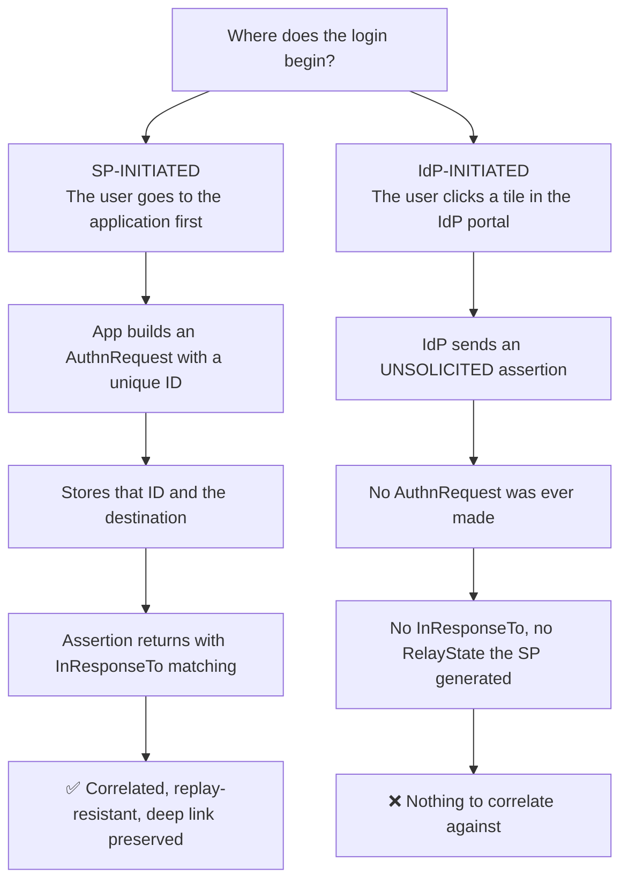
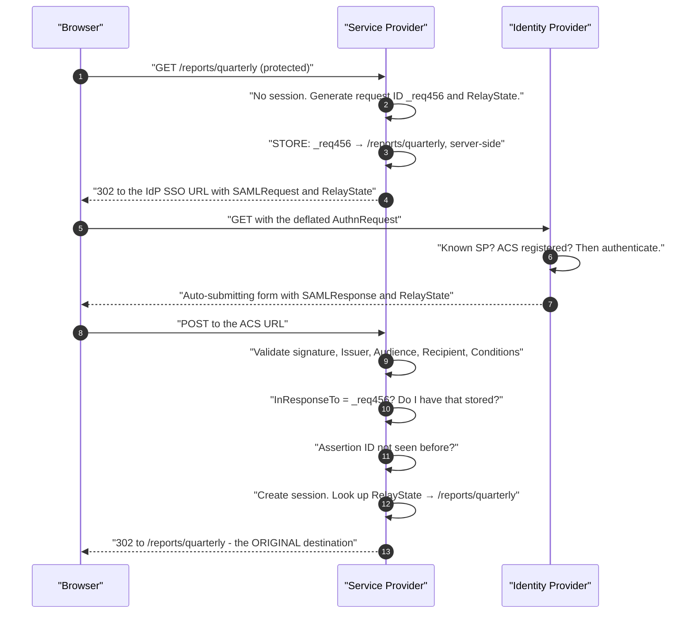
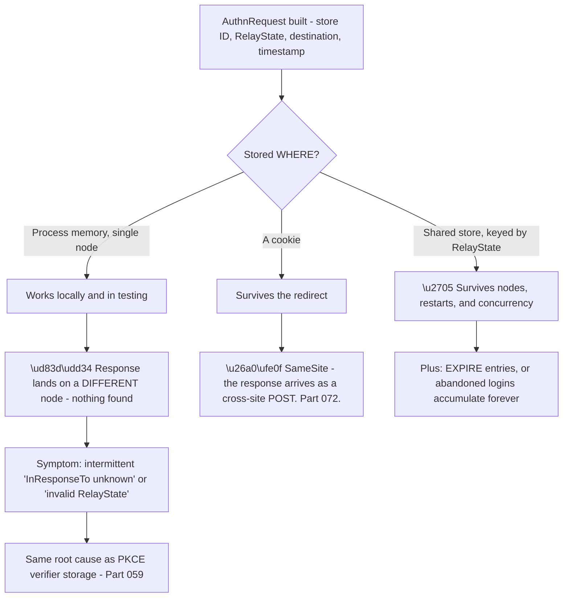
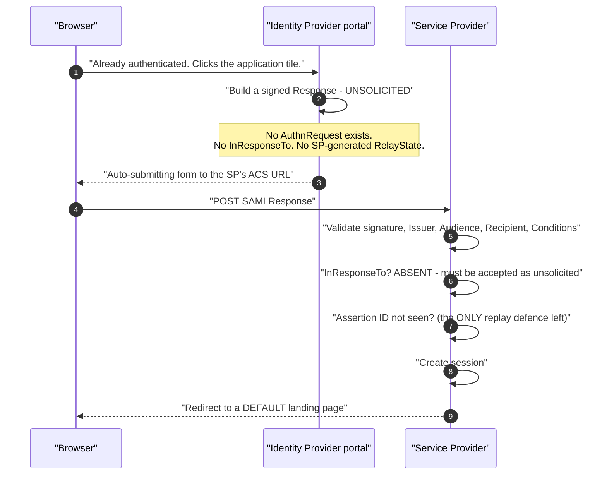
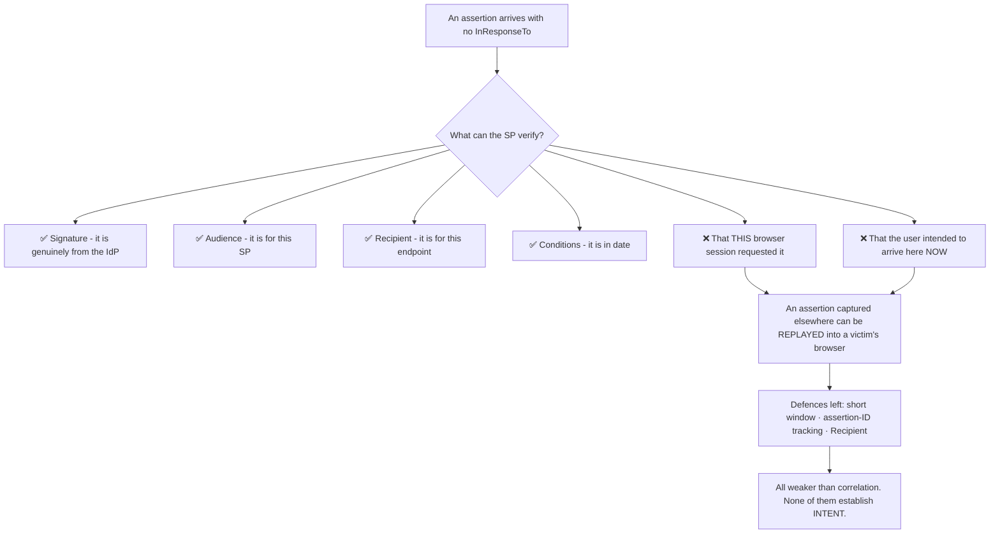
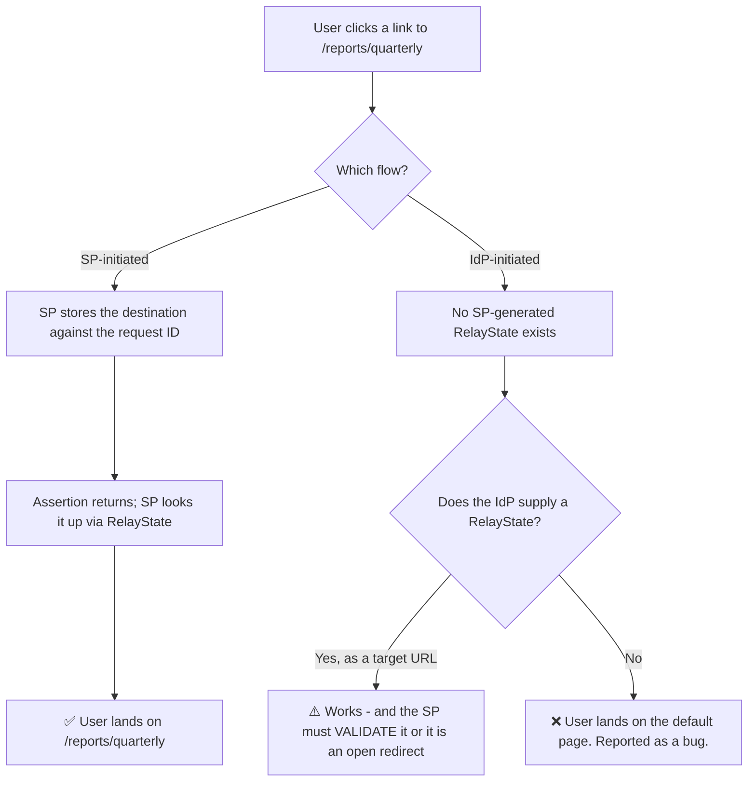
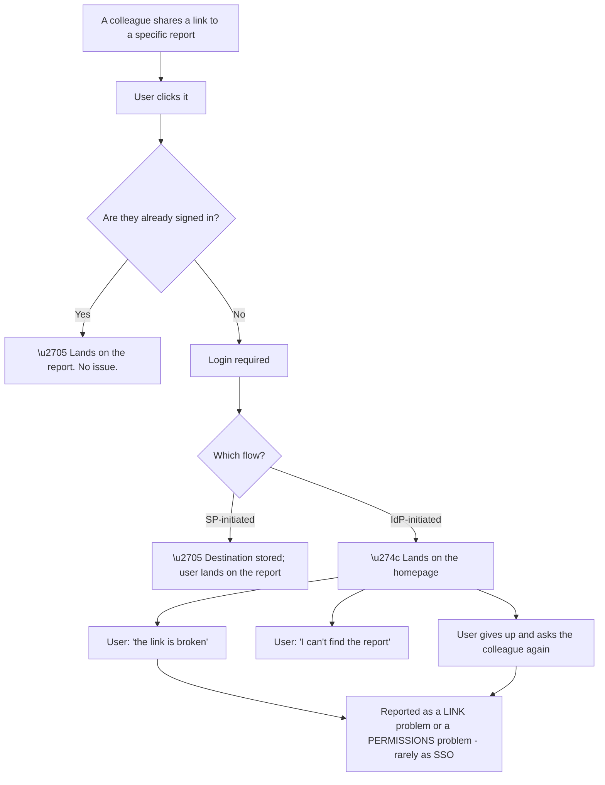
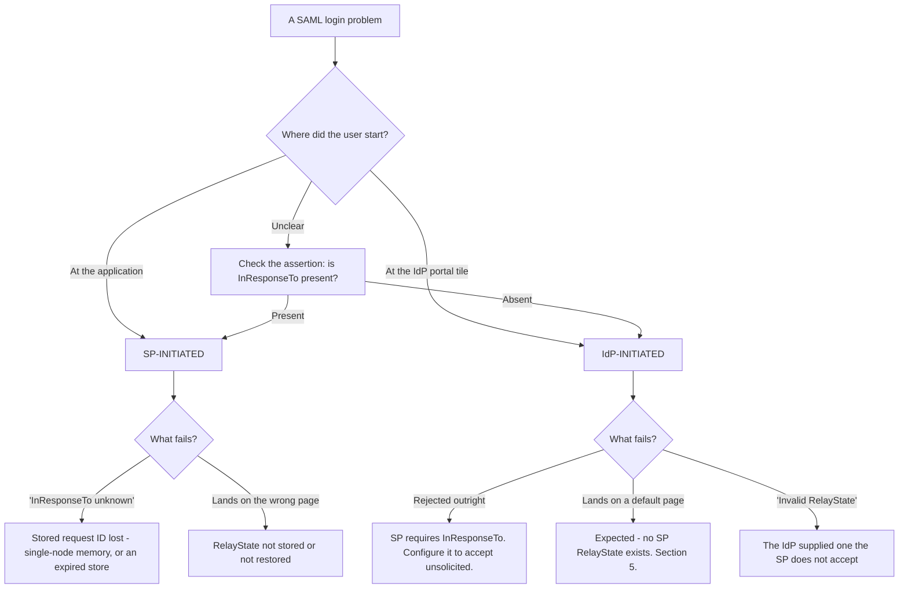

# Part 080 - SP-Initiated and IdP-Initiated SSO Walkthroughs

> Section goal: Walk both SAML starting points step by step, understand precisely why one is materially safer, and know how to handle the customers who need the unsafe one anyway. This is a decision customers make early and rarely revisit.

Covers index item **080**. Maps to JD signals: *knowledge of SAML*, *basic security concepts*, *strong analytical and problem-solving skills*, *communicate technical concepts clearly*, and *experience with troubleshooting web applications*.

---

## 1. Start From Zero: Two Starting Points

| | SP-initiated | IdP-initiated |
|---|---|---|
| Starts at | The application | The IdP portal |
| `AuthnRequest` sent | ✅ Yes | ❌ No |
| `InResponseTo` present | ✅ Yes | ❌ **No** |
| `RelayState` | SP-generated and verified | IdP-supplied, or absent |
| Deep linking | ✅ Preserved | ❌ Usually lost |
| Replay/injection resistance | ✅ Strong | ⚠️ Compensating controls only |
| OIDC equivalent | Standard flow | 🔴 **Does not exist** |

> **Analogy.** Ringing a doorbell and being answered, versus a letter arriving unprompted claiming to be a reply. The first is correlated to something you did; the second must be judged entirely on its own contents.
>
> **Where it stops:** you would notice an unexpected letter. A service provider receiving an unsolicited assertion sees exactly what a legitimate IdP-initiated login looks like — because that *is* what it looks like.

---

## 2. SP-Initiated, Step by Step

**The two things SP-initiated gives you** that IdP-initiated cannot:

1. **`InResponseTo` correlation** — the assertion answers a request this SP made and stored.
2. **The original destination** — carried in `RelayState`, restored at the end.

**The second is not merely convenience.** Users who click a link to a specific page and land on a homepage instead frequently report it as a bug, and it is a persistent low-grade source of tickets.

### 🔍 Plain-English deep-dive: what the service provider must store, and where that goes wrong

SP-initiated SSO requires the service provider to **remember something between two separate HTTP requests** — and that storage is where a distinctive class of failure lives.

| Stored at request time | Checked at response time |
|---|---|
| The `AuthnRequest` **ID** | Against `InResponseTo` |
| The **`RelayState`** value | Against the returned `RelayState` |
| The **original destination** | Looked up by `RelayState` |
| A **timestamp** | To expire abandoned requests |

**The single-node failure is the common one**, and its signature is precise: it works perfectly in development, works in a single-instance staging environment, and fails for a *fraction* of logins in production equal to roughly one minus one-over-the-node-count. **Four nodes, three in four fail** (Part 065's arithmetic).

**The cookie option carries the Part 072 caveat**: a SAML response arrives as a **cross-site form POST**, so a `SameSite=Lax` cookie is not sent. A service provider storing request state in a cookie must set `SameSite=None; Secure` on that specific cookie — and scoping it narrowly, to one short-lived flow cookie rather than the session cookie, keeps the CSRF exposure bounded.

**The expiry point is quietly important.** Users abandon logins constantly — they change their mind, the IdP times out, they close the tab. Without expiry, stored request state accumulates indefinitely. **Expiring it in line with the assertion's own validity window** (Part 079) is both tidy and correct, since a response arriving later than that would be rejected anyway.

**The pattern to recognise across the whole guide:** this is the *same* storage problem as `state` in OAuth (Part 065) and the PKCE verifier (Part 059). **Three protocols, one failure mode** — something stored between two requests, keyed wrongly or stored somewhere that does not survive.

**Analogy:** a cloakroom where each attendant keeps their own private list. It works with one attendant and fails the moment there are four and you return to a different desk. **Where it stops:** an attendant could call across the room. Server processes share nothing unless told to.

---

## 3. IdP-Initiated, Step by Step

### 🔍 Plain-English deep-dive: what IdP-initiated actually costs

The specification permits unsolicited responses. **The cost is that the service provider loses its strongest validation check** and must compensate with weaker ones.

**The attack shape:** an attacker obtains a valid assertion — from their own IdP-initiated login, from a log, from a shared machine's history — and causes a victim's browser to POST it to the SP. **The victim is logged in as the attacker** (Part 048's login CSRF, in SAML form), and then enters data into an account the attacker controls.

**Why the remaining defences are only partial:**

| Defence | Limitation |
|---|---|
| Short validity window | Reduces the window; does not close it |
| Assertion-ID tracking | Stops the *same* assertion twice; an attacker only needs it once |
| `Recipient` check | Stops delivery elsewhere; not delivery to the right place by the wrong person |

**The honest framing for a customer**, and it matters that it is proportionate rather than alarmist: *"IdP-initiated works and is widely deployed. It gives up the strongest check — that the assertion answers a request your application made — so the compensating controls have to be right: a short validity window, assertion-ID tracking, and a strict `Recipient` check. SP-initiated keeps that check, and it also preserves deep links."*

**When customers genuinely need IdP-initiated:**

| Reason | Real? |
|---|---|
| "Our IdP portal has application tiles our staff use" | ✅ Yes — a real workflow |
| "Our vendor's SP only supports IdP-initiated" | ✅ Yes — a constraint |
| "It was configured that way years ago" | ⚠️ Worth revisiting |
| "It's simpler" | ⚠️ Marginally, and it costs the correlation |

**The pattern worth suggesting**, because it satisfies the portal-tile requirement without the cost: **make the tile link to the application's own login endpoint**, which then starts a normal SP-initiated flow. The user experience is identical — click a tile, arrive logged in — and the correlation is preserved. **This is exactly the answer given to OIDC migrations in Part 048**, and it applies equally to SAML.

**Analogy:** accepting a signed delivery note that does not reference any order you placed. It may be perfectly genuine and for you — you simply cannot tell whether it belongs to *this* transaction. **Where it stops:** you would query an unexpected delivery. A service provider cannot distinguish an expected unsolicited assertion from an unexpected one, because they are identical.

---

## 4. Configuring Both

Many deployments support both, and the configuration differences are small.

| Setting | SP-initiated | IdP-initiated |
|---|---|---|
| SP entity ID registered at the IdP | ✅ Required | ✅ Required |
| ACS URL registered | ✅ Required | ✅ Required |
| IdP SSO URL configured at the SP | ✅ Required | Not used |
| SP's signing/validation certificate | ✅ Required | ✅ Required |
| **Default landing page** | Optional — `RelayState` supplies it | ✅ **Required** — nothing else supplies it |
| `InResponseTo` handling | Must be present and match | Must be **absent** — do not require it |

**The last row causes a specific and confusing failure:** an SP configured to require `InResponseTo` rejects every IdP-initiated assertion, with an error that reads like a correlation bug rather than a configuration choice.

---

## 5. Deep Linking

**The `I3` branch deserves care.** Some IdPs allow a `RelayState` containing a target URL for IdP-initiated flows. That is genuinely useful, and the SP must **validate it against an allow-list** — otherwise it is an open redirect supplied by an external party (Part 065).

### 🔍 Plain-English deep-dive: deep linking is a support issue disguised as a UX preference

Losing a deep link sounds cosmetic. **In practice it generates a steady stream of tickets that are hard to attribute**, which is why it is worth taking seriously.

**The attribution problem is the point.** Nobody reports "our SSO flow doesn't preserve deep links." They report that a link is broken, that they cannot find something, or that they think they lack permission — because from their side, clicking a link and arriving somewhere else looks like any of those.

**Three consequences worth naming to a customer:**

| Consequence | Detail |
|---|---|
| **Tickets are misattributed** | Filed against the application, sharing, or permissions |
| **Sharing is discouraged** | Users learn that links "don't work" and stop sending them |
| **It affects new users most** | They are least likely to already have a session |

**That third row matters commercially.** The people most affected are those least familiar with the product — new joiners, occasional users, anyone arriving from an email. **A first experience of "the link didn't work" is disproportionately costly.**

**And it is entirely avoidable**, which is what makes it worth raising: the tile pattern from §3 restores deep linking at no cost to the user experience. **Pointing the portal tile at the application's login endpoint is a configuration change**, and it fixes a class of tickets nobody had connected to SSO.

**The question that surfaces it:** *"When someone clicks a shared link to a specific page and isn't signed in yet, where do they end up?"* **Customers frequently do not know**, and finding out takes one test.

**Analogy:** a building where visitors following directions to a specific meeting room are always deposited in the lobby instead. Nobody complains about the doors; they complain that the directions were wrong. **Where it stops:** a receptionist would redirect them. An application has no idea where they were trying to go, because nothing carried it.

---

## 6. Failure Modes

| Failure mode | What it looks like | Consequence | Correction |
|---|---|---|---|
| **`InResponseTo` not checked (SP-initiated)** | Works | 🔴 Unsolicited assertions accepted | Match against a stored request ID |
| **`InResponseTo` required (IdP-initiated)** | Every tile login fails | Confusing configuration error | Accept its absence for this flow |
| **No assertion-ID tracking** | Works | 🔴 Replay within the window | Track IDs for the validity period |
| **`RelayState` from the IdP used unvalidated** | Deep linking works | 🔴 **Open redirect** | Allow-list |
| **No default landing page** | IdP-initiated lands nowhere | Broken tile experience | Configure one |
| **Deep links lost** | Users land on the homepage | Persistent low-grade tickets | SP-initiated, or a validated `RelayState` |
| **`RelayState` in single-node memory** | Intermittent failures | "Invalid RelayState" (Part 047) | Shared store |
| **IdP-initiated chosen by default** | Works | Correlation given up unnecessarily | Prefer SP-initiated |
| **Tile links directly to the ACS** | Forces IdP-initiated | Cost paid needlessly | Link the tile to the SP's login endpoint |
| **Assuming OIDC has IdP-initiated** | Migration blocked | Confusion (Part 048) | It does not — use the tile pattern |

---

## 7. Troubleshooting Decision Tree: Which Flow, and What Broke

### Worked example

*"Our staff click the tile in our identity portal and land on the application's homepage, not the page they wanted. Users think it's broken."*

1. **Establish the flow.** Tile in a portal means IdP-initiated. Confirm by checking whether the assertion carries `InResponseTo` — it will not.
2. **Explain the behaviour, because it is not a bug.** In IdP-initiated SSO the service provider never issued a request, so there is no stored destination — it can only send the user to a default page.
3. **Three options, in increasing order of quality:**

   | Option | Effect |
   |---|---|
   | Configure a better default landing page | Cheapest; does not solve deep linking |
   | IdP supplies `RelayState` with a target URL | Works — **the SP must validate it against an allow-list** |
   | **Tile links to the SP's own login endpoint** | ✅ SP-initiated flow, deep links preserved, correlation restored |

4. **Recommend the third**, and explain why it is not a compromise: the tile still appears in the portal, the user still clicks once and arrives logged in, and the application gains back `InResponseTo` correlation and proper deep linking.
5. **Flag the open-redirect risk on option two** explicitly, because it is the option a customer will otherwise reach for and implement without validation.
6. **Note the security improvement as a secondary benefit**, not the headline — the customer came with a usability complaint, and leading with security would sound like a deflection.
7. **Mention the migration relevance:** if they ever move this application to OIDC, IdP-initiated does not exist there, so the tile pattern is the answer either way (Part 048). **Adopting it now makes a future migration simpler.**

---

## 8. Lab: Both Flows Side by Side

**Purpose.** Run both flows against the same connection, compare the assertions, and reproduce each flow's characteristic failures.

**Prerequisites.** Part 079's artifacts and decode tooling. A free Auth0 tenant plus a SAML IdP supporting both flows.

**Steps.**

1. Create `okta-prep/labs/080-sso-flows/`.
2. **Configure the connection** to support both flows. Record what differs in configuration (§4).
3. **SP-initiated login.** Start at a deep link. Capture a HAR. **Decode the `AuthnRequest`** and record its ID.
4. **Decode the response.** **Confirm `InResponseTo` matches the request ID.** Confirm the user lands on the original deep link.
5. **IdP-initiated login.** Start from the portal tile. Capture a HAR. **Decode the response** and **confirm `InResponseTo` is absent.**
6. **Diff the two assertions.** Build a table of what is present in each. **This is §1's table, evidenced.**
7. **Deep link contrast.** Record where each flow lands. **Screenshot both.**
8. **Break SP correlation.** Modify the stored request ID between request and response. **Record the error.**
9. **Reproduce the load-balancer failure.** Run two SP instances with `RelayState` and request IDs in memory. **Reproduce intermittent "invalid RelayState" or "InResponseTo unknown"** (Part 047), then fix with a shared store.
10. **Require `InResponseTo` on the IdP-initiated flow.** **Confirm every tile login is rejected**, and record the error. This is §4's confusing failure.
11. **Assertion replay.** Capture a valid assertion and POST it a second time. **Record whether the SP rejects it.** If not, that is missing assertion-ID tracking (Part 079).
12. **Then add ID tracking** and confirm the replay is rejected.
13. **`RelayState` as a target URL.** If your IdP supports it, supply one for an IdP-initiated flow. **Then supply an external URL** and confirm whether the SP follows it. **If it does, that is an open redirect** — record it, then add an allow-list.
14. **The tile pattern.** Change the portal tile to link to the SP's own login endpoint. **Confirm the flow becomes SP-initiated** — check for `InResponseTo` — and that deep linking works.
15. **Write the guidance.** `sso-flows.md` — one page: both flows, what IdP-initiated gives up, the compensating controls, and the tile pattern.
16. **Failure catalog + manifest.** Complete `MANIFEST.md`.

**Expected evidence.** Both flows captured with decoded messages, `InResponseTo` present and absent, an assertion diff table, a deep-link contrast screenshotted, a broken-correlation error, a reproduced-then-fixed multi-node failure, the `InResponseTo`-required rejection, a replay test before and after ID tracking, an open-redirect test with a fix, and a demonstrated tile pattern.

**Validation rubric.**

| Check | Pass condition |
|---|---|
| Both flows | Captured and decoded |
| Correlation | `InResponseTo` matched, and absence confirmed |
| Assertion diff | Table complete |
| Deep link | Both destinations recorded |
| Multi-node | Failure reproduced, then fixed |
| `InResponseTo` required | Tile logins rejected, error recorded |
| Replay | Rejected only after ID tracking added |
| Open redirect | Tested; allow-list added |
| Tile pattern | Flow becomes SP-initiated, verified |

**Cleanup and privacy.** Lab tenants and synthetic users only. **Restore the SP's `InResponseTo` and `RelayState` validation** after each deliberate weakening. Delete connections and applications at the end.

---

## 9. JD Mapping

| Supplied JD signal | How this Part supports it |
|---|---|
| **Knowledge of SAML** | Both profiles walked step by step |
| **Basic security concepts** | Correlation, replay, and open redirect |
| Strong analytical and problem-solving skills | Identifying the flow from one assertion element |
| **Communicate technical concepts clearly** | Explaining that the landing page is not a bug |
| Experience troubleshooting web applications | Multi-node state failures and HAR analysis |
| Promote best practices | The tile pattern, with the security benefit framed second |
| Exceed expectations on response quality | Noting the future-migration benefit unprompted |

---

## 10. Candidate Honesty Note

- **Claim safety:** *Learned architecture and lab experience.*
- **The strongest thing you can say:** *"SP-initiated starts at the application, which sends an `AuthnRequest` with an ID it stores — so the returning assertion carries `InResponseTo` and can be correlated to a request that application actually made. IdP-initiated starts at a portal tile and produces an unsolicited assertion with nothing to correlate against. You can tell which flow produced an assertion by whether `InResponseTo` is present."*
- **A second point, and it is the substance of the difference:** *"IdP-initiated gives up the strongest validation check. The SP can still verify the signature, audience, recipient and validity window — but not that this browser session requested it or that the user intended to arrive now. So an assertion captured elsewhere can be replayed into a victim's browser and log them in as the attacker. The remaining defences — short window, assertion-ID tracking, strict recipient — reduce it rather than close it."*
- **A third, proportionate:** *"IdP-initiated is widely deployed and works. I wouldn't present it as broken — I'd say the compensating controls have to actually be in place, and assertion-ID tracking is the one that's usually missing because everything works without it."*
- **A fourth, and it is the practical recommendation:** *"The portal-tile requirement is real, and it doesn't require IdP-initiated. Point the tile at the application's own login endpoint and it starts a normal SP-initiated flow — same single click, same experience, and you get correlation and deep linking back. It's also the answer for OIDC, which has no IdP-initiated concept at all, so adopting it now makes a future migration simpler."*
- **A fifth, on how to raise it:** *"When someone reports landing on the homepage instead of the page they clicked, that's a usability complaint. I'd lead with the fix and mention the security improvement second — leading with security when they asked about a landing page sounds like a deflection."*
- **A sixth, a specific risk:** *"If an IdP supplies `RelayState` as a target URL, the SP must validate it against an allow-list. Otherwise an external party is supplying a redirect destination, which is an open redirect — and that's the option customers reach for first."*
- **Do not overstate:** you have not supported production SAML SSO. Say you have run both flows and reproduced each one's failures in a lab.

---

## 11. Official Source Anchors

Accessed **26 August 2026**.

| Source | What it defines |
|---|---|
| OASIS SAML 2.0 Profiles §4.1 | Web Browser SSO — both SP-initiated and unsolicited responses |
| OASIS SAML 2.0 Core §2.4 | `SubjectConfirmationData`, including `InResponseTo` and `Recipient` |
| OASIS SAML 2.0 Bindings | `RelayState` handling and its constraints |
| OASIS SAML 2.0 Security and Privacy Considerations | Replay, unsolicited responses, and correlation |
| IETF RFC 6749 §10.15 | Open redirect — the same risk in a different protocol |
| Auth0 and Okta documentation — SAML connections and IdP-initiated support | Vendor configuration |
| Microsoft Entra ID documentation — SAML SSO and portal tiles | The most common source of IdP-initiated deployments |

**Revalidate after 26 August 2026:** SAML is stable. Recheck vendor support for unsolicited responses and `RelayState` target URLs.

---

## ⭐ Likely Interview Questions for This Section

### Q1. "What's the difference between SP-initiated and IdP-initiated SSO?"
> *Model answer:* "Where the flow starts, and what that means for validation. SP-initiated begins at the application, which builds an `AuthnRequest` with a unique ID, stores that ID and the destination, and redirects to the identity provider. The returning assertion carries `InResponseTo` matching that ID, so the application can confirm it answers a request it actually made — and `RelayState` carries the original destination, so deep links work. IdP-initiated begins at a portal tile: the IdP sends an unsolicited assertion with no `InResponseTo` and no application-generated `RelayState`. You can tell which flow produced any assertion by whether `InResponseTo` is present."

### Q2. "Why is IdP-initiated considered less secure?"
> *Model answer:* "Because the service provider loses its strongest check. It can still verify the signature, that the issuer is the expected IdP, that the audience is itself, that the recipient is this endpoint, and that it's in date — but not that this browser session requested it, or that the user intended to arrive now. So an assertion obtained elsewhere can be replayed into a victim's browser, logging them in as the attacker, and then they enter data into an account someone else controls. That's login CSRF in SAML form. The remaining defences — a short validity window, assertion-ID tracking, and a strict recipient check — reduce the window rather than close it. I'd frame it proportionately though: it's widely deployed and works, and the point is that those compensating controls actually have to be in place."

### Q3. "A customer needs portal tiles. What do you recommend?"
> *Model answer:* "The tile pattern — point the tile at the application's own login endpoint rather than directly at the ACS URL. The user still sees a tile in their portal, still clicks once, and still arrives logged in, but the application initiates the flow so you get `InResponseTo` correlation and proper deep linking back. It's not a compromise; the experience is identical. And it's the answer for OIDC too, since OIDC has no IdP-initiated concept at all — so adopting it now means a future migration to OIDC doesn't hit this as a blocker. I'd present it as solving their deep-linking complaint, with the security benefit mentioned second, because they came with a usability problem."

### Q4. "Users land on the homepage instead of the page they clicked. Is that a bug?"
> *Model answer:* "Not in IdP-initiated SSO — it's the expected behaviour. The service provider never issued a request, so it has no stored destination and can only send the user to a default landing page. There are three options in increasing order of quality: configure a better default, which is cheapest and doesn't solve deep linking; have the IdP supply a `RelayState` containing a target URL, which works but means the SP must validate it against an allow-list or it's an open redirect supplied by an external party; or switch the tile to point at the application's login endpoint, which makes it SP-initiated and restores deep linking properly. I'd recommend the third and flag the open-redirect risk on the second explicitly, because that's the one they'll otherwise implement without validation."

### Q5. "An SP rejects every tile login. What's wrong?"
> *Model answer:* "Almost certainly it's configured to require `InResponseTo`. That's correct for SP-initiated flows — the assertion must correlate to a stored request ID — but IdP-initiated assertions are unsolicited by definition, so `InResponseTo` is legitimately absent. An SP that treats its absence as a failure rejects every tile login, and the error reads like a correlation bug rather than a configuration choice, which is what makes it confusing. The fix is configuring the SP to accept unsolicited responses for that connection. And I'd use it as a prompt to ask whether they need IdP-initiated at all, or whether the tile pattern would serve them better."

### Q6. "How do you stop assertion replay?"
> *Model answer:* "Assertion-ID tracking, primarily — the service provider records the IDs it has accepted and rejects duplicates for at least the length of the validity window. That's the check most often missing, because everything works without it. The short validity window itself helps, typically two to five minutes, so an intercepted assertion is useless quickly. The `Recipient` check stops delivery to a different endpoint. And in SP-initiated flows `InResponseTo` is the strongest defence, because a replayed assertion won't match a stored request ID. In IdP-initiated flows that last one isn't available, which is exactly why ID tracking matters more there — and it's the flow where it's most often absent."

### Q7. "How do you tell which flow an assertion came from?"
> *Model answer:* "Look for `InResponseTo` in the `SubjectConfirmationData`. Present means SP-initiated — the assertion is answering a specific request. Absent means unsolicited, so IdP-initiated. That single element tells you which flow produced it, which matters because the validation rules differ and the expected behaviours differ. It's also useful when a customer isn't sure what they've configured, which happens more often than you'd expect in deployments set up years ago by someone who has left. The corollary is that if you see `InResponseTo` absent on a flow the customer believes is SP-initiated, something is wrong — usually the entry point they think users take isn't the one users actually take."

### Q8. "Why doesn't OIDC have IdP-initiated?"
> *Model answer:* "Because the design deliberately requires the relying party to initiate, so that every response correlates to a request it made — `state` for the response and `nonce` for the ID token. An unsolicited assertion has nothing to correlate against, which is exactly the weakness IdP-initiated SAML carries. Customers migrating from SAML often raise it as a blocker, because their portal tiles depend on it. The answer is the same tile pattern: point the tile at the application's login endpoint and it starts a normal flow. Same click, same experience, and the correlation is preserved. It's worth knowing because it turns what sounds like a missing feature into a five-minute configuration change."

---

## 🧠 30-Second Memory Hooks

- **SP-initiated starts at the APP. IdP-initiated starts at the PORTAL TILE.**
- **Tell them apart by `InResponseTo`:** present = SP-initiated · absent = unsolicited.
- **SP-initiated gives you: CORRELATION + the ORIGINAL DESTINATION.**
- **IdP-initiated gives up the strongest check** — that this session requested it.
- **Remaining defences:** short window · **assertion-ID tracking** · strict `Recipient`. **All partial.**
- **Assertion-ID tracking is the one usually missing.** Everything works without it.
- **THE TILE PATTERN:** point the tile at the **app's own login endpoint** → SP-initiated, same click.
- **OIDC has NO IdP-initiated.** The tile pattern is the answer there too.
- **An SP requiring `InResponseTo` rejects EVERY tile login.** Confusing configuration error.
- **IdP-supplied `RelayState` as a target URL must be ALLOW-LISTED** or it is an open redirect.
- **"Lands on the homepage" is EXPECTED in IdP-initiated**, not a bug.
- **Lead with the usability fix; mention security second.**

---

## ✅ Completion Checklist

- [ ] **Knowledge:** I can walk both flows, identify one from an assertion, and state what IdP-initiated gives up.
- [ ] **Lab artifact:** `080-sso-flows/` contains both flows decoded, an assertion diff, a deep-link contrast, a reproduced multi-node failure, a replay test before and after ID tracking, and a demonstrated tile pattern.
- [ ] **Spoken:** I can explain the difference in 45 seconds and recommend the tile pattern in 30.
- [ ] **Judgement:** I flag the `RelayState` open-redirect risk before they implement it, and lead with usability.
- [ ] **Honesty check:** I say "both flows run in a lab."
- [ ] **Source check:** I have read SAML 2.0 Profiles §4.1 and Core §2.4 myself.

---

*Next suggested section:* **[Part 081 - SAML Metadata, Signing, and Encryption](Part-081-saml-metadata-signing-and-encryption.md)** — how trust is established and maintained, and the certificate work that causes most SAML outages.
