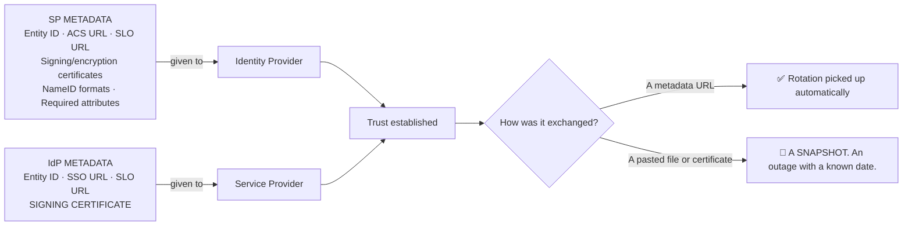
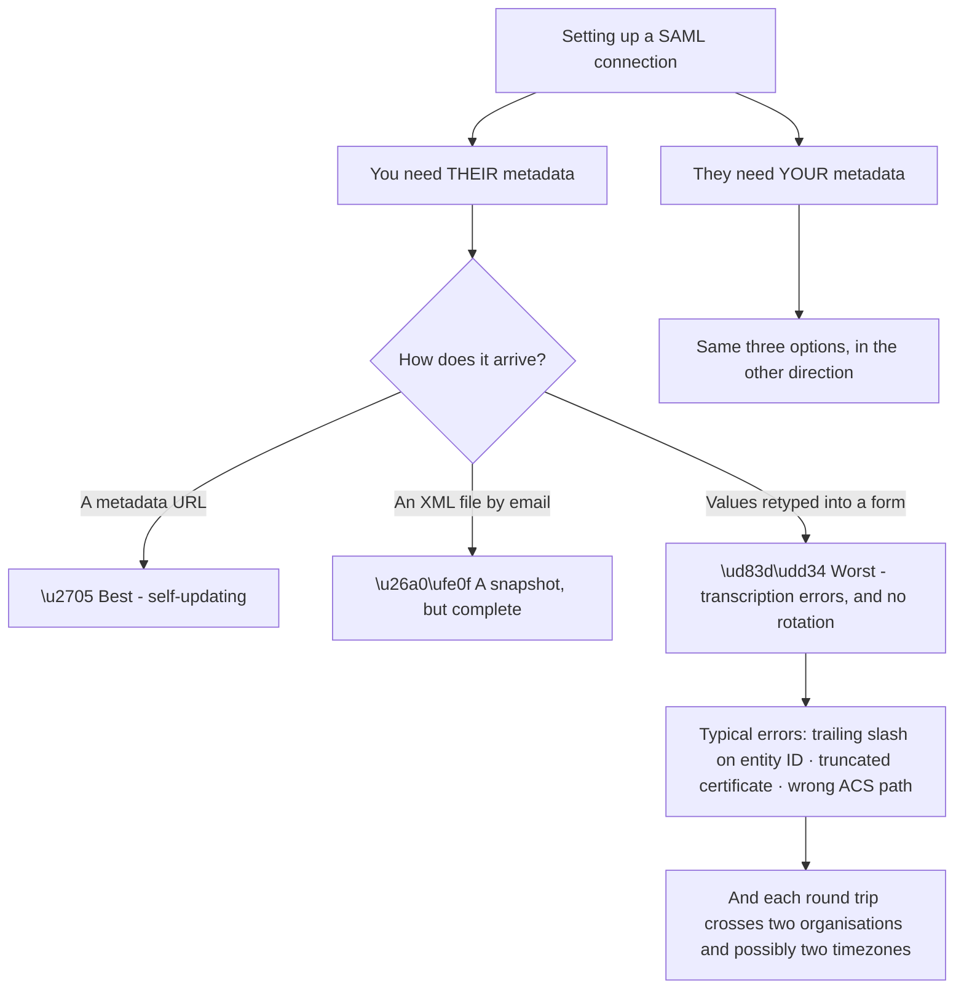
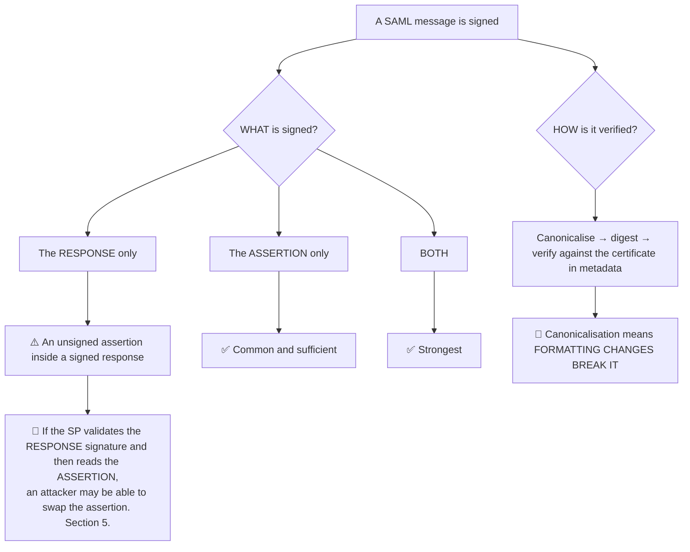
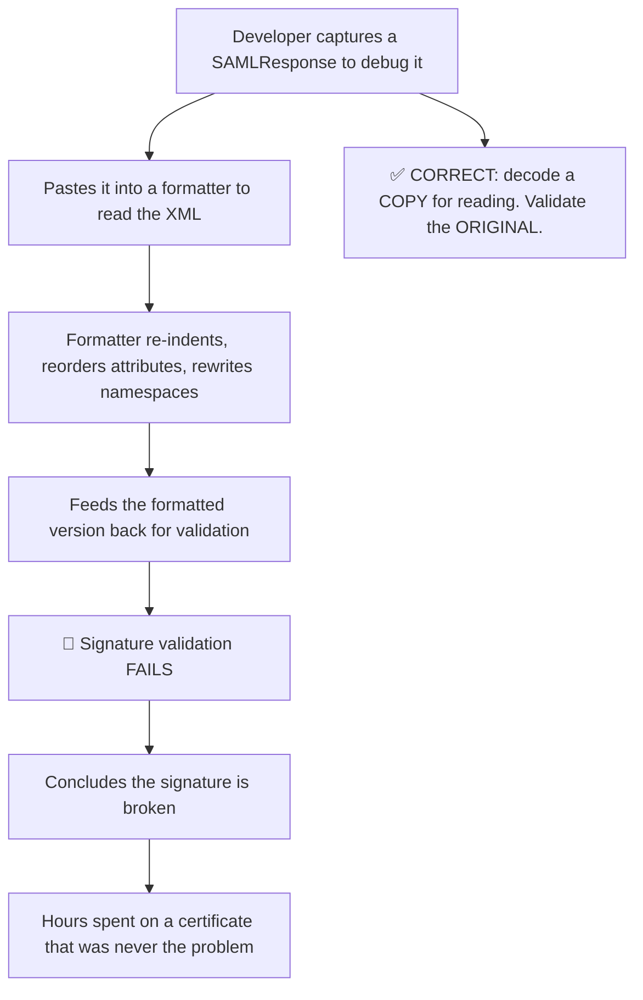
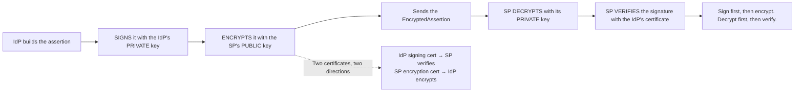
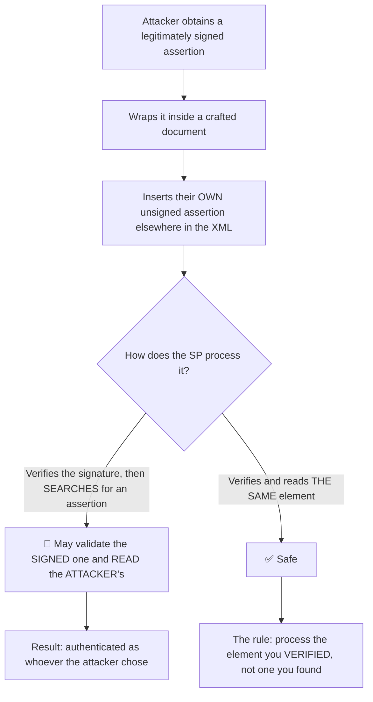
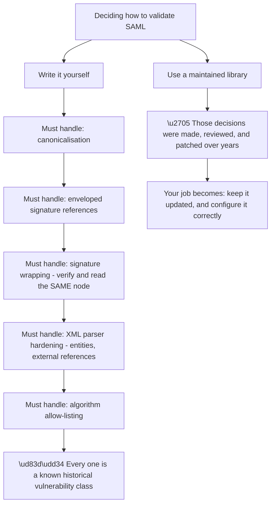
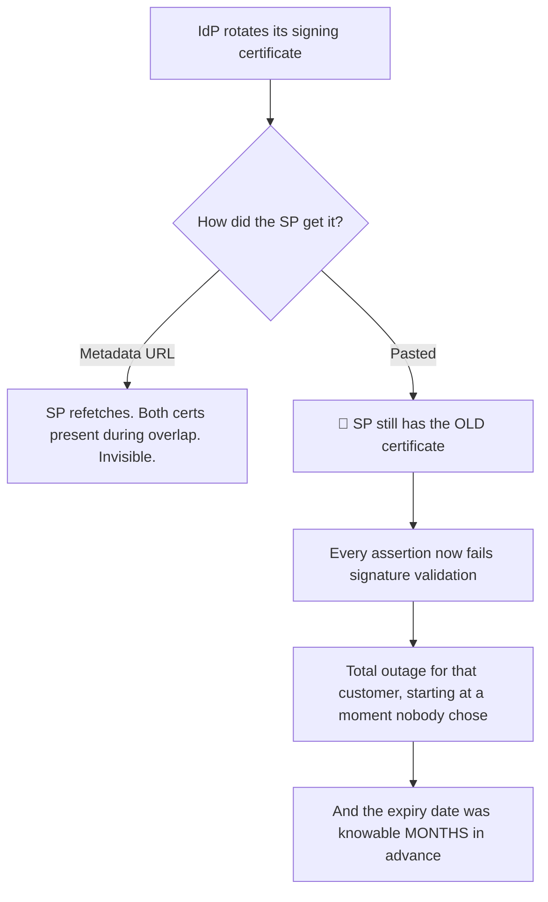
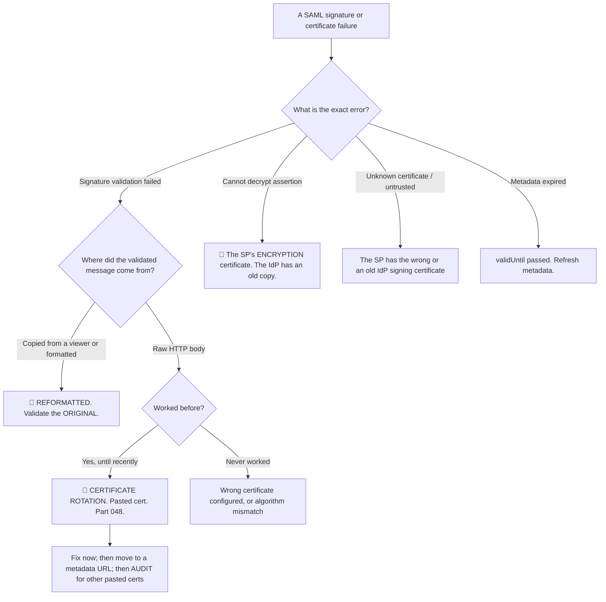

# Part 081 - SAML Metadata, Signing, and Encryption

> Section goal: Understand how SAML trust is established and maintained — metadata exchange, XML signatures, and assertion encryption — and why certificate handling causes more SAML outages than everything else combined.

Covers index item **081**. Maps to JD signals: *knowledge of SAML*, *knowledge of encryption*, *basic security concepts*, *strong analytical and problem-solving skills*, and *promote best practices*.

---

## 1. Start From Zero: Metadata Is SAML's Discovery Document

Two parties must know each other's endpoints and certificates. **Metadata is how they say so** — SAML's equivalent of the OIDC discovery document (Part 057).



**The choice in that bottom split is the single most consequential SAML configuration decision**, and it is made once, casually, at setup.

> **Analogy.** Exchanging business cards versus subscribing to a directory. The card is accurate the day it is printed; the directory is accurate today.
>
> **Where it stops:** you would notice a card looking dated. A pasted certificate looks identical the day before it expires and the day after.

---

## 2. What Metadata Contains

```xml
<EntityDescriptor entityID="https://idp.example.com/">
  <IDPSSODescriptor protocolSupportEnumeration="urn:oasis:names:tc:SAML:2.0:protocol">
    <KeyDescriptor use="signing">
      <ds:KeyInfo><ds:X509Data><ds:X509Certificate>MIID...</ds:X509Certificate></ds:X509Data></ds:KeyInfo>
    </KeyDescriptor>
    <SingleLogoutService Binding="...HTTP-Redirect" Location="https://idp.example.com/slo"/>
    <NameIDFormat>urn:oasis:names:tc:SAML:2.0:nameid-format:persistent</NameIDFormat>
    <SingleSignOnService Binding="...HTTP-Redirect" Location="https://idp.example.com/sso"/>
  </IDPSSODescriptor>
</EntityDescriptor>
```

| Element | Purpose | OIDC equivalent |
|---|---|---|
| **`entityID`** | Unique identifier | `issuer` |
| **`KeyDescriptor use="signing"`** | The certificate that verifies assertions | `jwks_uri` contents |
| `KeyDescriptor use="encryption"` | The certificate used to encrypt to this party | JWE key |
| **`SingleSignOnService`** | Where `AuthnRequest`s go | `authorization_endpoint` |
| `SingleLogoutService` | Where logout messages go (Part 085) | `end_session_endpoint` |
| **`AssertionConsumerService`** *(SP side)* | Where assertions are delivered | Redirect URI |
| `NameIDFormat` | Supported identifier formats (Part 083) | — |
| `validUntil` | When the metadata itself expires | — |

**`validUntil` is worth noticing.** Metadata can itself expire, and a strict SP will stop trusting expired metadata — producing an outage with no certificate involved at all.

### 🔍 Plain-English deep-dive: metadata exchange is a coordination problem

The technical content of metadata is simple. **Getting two organisations to exchange it correctly is where the time actually goes**, and recognising that changes how a federation ticket is run.



**The retyping row is where most setup failures originate.** An entity ID with a trailing slash, a certificate missing its final line, an ACS URL with the wrong path case — all invisible on inspection, all producing errors that look like protocol problems (Part 048).

**Three things that compress a multi-day setup into an hour:**

| Practice | Effect |
|---|---|
| **Send a metadata URL, not values** | Removes transcription entirely, and handles rotation |
| **Send everything they need in ONE message** | Avoids sequential round trips across timezones |
| **Include an example of each value** | "Entity ID (exactly, including any trailing slash): `https://…`" |

**The single message matters more than it looks.** A SAML setup requires roughly six values in each direction. Requesting them one at a time, across two organisations, turns an hour of work into a fortnight of waiting — the same dynamic as Part 069's evidence collection.

**And when only values are available**, the useful habit is to **compare lengths** as well as appearance (Part 048). A certificate that looks complete and is 40 characters short was truncated by an email client, and no amount of visual comparison will reveal it.

**The support-facing framing:** most SAML setup problems are not protocol problems. **They are two teams exchanging strings by email**, and treating them as a coordination exercise rather than a technical one gets them resolved faster.

**Analogy:** two builders working from separately transcribed measurements rather than a shared drawing. The physics is not the problem. **Where it stops:** builders can meet on site. Two identity teams frequently cannot, which is why the single-message discipline matters so much.

---

## 3. Signing

XML Signature, not JWS — and the difference matters.



| Property | JWS (OIDC) | XML Signature (SAML) |
|---|---|---|
| Covers | Exact bytes | A **canonicalised** form |
| Reformatting breaks it | ✅ Obviously | ✅ **Non-obviously** |
| What is signed | The whole token | **Response, assertion, or both** |
| Signature location | A separate segment | **Enveloped** — inside the signed document |

### 🔍 Plain-English deep-dive: canonicalisation, and the mistake it causes daily

An XML signature does not cover the literal bytes. It covers a **canonical form** — a normalised representation with standardised whitespace, attribute ordering, and namespace declarations.

**That exists for a good reason:** XML documents that are semantically identical can differ byte-for-byte, and a signature covering raw bytes would break on any legitimate re-serialisation.

**And it produces a daily support mistake:**



**The rule, stated once and worth remembering:** **never reformat a SAML message you intend to validate.** Decode a copy for reading; keep the original untouched.

**Two related traps:**

**1. Copying an assertion out of a HAR by hand.** Line wrapping in a viewer inserts characters. **Export the raw value programmatically**, not by selecting text.

**2. Re-serialising in code.** An application that parses the XML into a DOM and then re-serialises before validating has already changed it. **Validate first, then parse.**

**And the deeper reason this matters more than in JWT-land:** a JWT signature failure is unambiguous — the token was altered. An XML signature failure is ambiguous, because it could mean the message was altered, the certificate is wrong, the canonicalisation method differs, or **someone opened it in an editor.** That ambiguity is why the rule needs to be a habit rather than a lookup.

**The support-facing question:** *"Where did the message you're validating come from — the raw HTTP body, or something you copied out of a viewer?"* **It resolves a meaningful share of "signature invalid" tickets.**

**Analogy:** a wax seal that verifies the document was not disturbed. Photocopying it to read more easily and then presenting the photocopy fails — not because the original was forged, but because the copy is not the thing that was sealed. **Where it stops:** a photocopy is visibly a copy. A reformatted XML document looks like the original in every way a human would check.

---

## 4. Encryption

SAML assertions can be encrypted, and **in practice they often are** — unlike JWE (Part 042).



| Direction | Certificate | Held by | Used to |
|---|---|---|---|
| IdP → SP | **IdP signing certificate** | SP holds the **public** part | Verify assertions |
| SP → IdP | **SP encryption certificate** | IdP holds the **public** part | Encrypt assertions to the SP |
| SP → IdP | SP signing certificate | IdP holds the **public** part | Verify `AuthnRequest`s and logout |

**Two certificates in two directions is why SAML certificate management is more confusing than JWKS.** A customer saying "the certificate expired" has said almost nothing until you establish **which** one.

**The practical consequence for support:** an assertion arriving encrypted that the SP cannot decrypt means the **SP's encryption certificate** rotated and the IdP has an old copy — a different problem entirely from a signature failure, with a different owner.

---

## 5. XML Signature Wrapping

A SAML-specific attack class worth knowing by name.



**The essence:** the signature is valid, and the SP reads a *different* element than the one that was signed.

| Defence | Detail |
|---|---|
| **Process the verified element** | Not "find an assertion" — use the exact node the signature covered |
| Use a mature, maintained library | This class of bug has been found repeatedly in hand-rolled parsers |
| Require the assertion itself to be signed | Not just the response |
| Schema validation | Reject documents with unexpected structure |

**This is the strongest argument against implementing SAML validation yourself**, and it is worth saying plainly: **XML signature wrapping has been found in many independent implementations over many years.** A maintained library is not a convenience here — it is the control.

### 🔍 Plain-English deep-dive: why "use a library" is stronger advice here than elsewhere

"Use a well-maintained library" is generic advice that people nod at and ignore. **In SAML it deserves to be stated as a hard rule**, and knowing why makes the recommendation land.

| Reason | Detail |
|---|---|
| **The vulnerability class is structural** | Signature wrapping exploits the gap between *verify* and *read* — a gap that exists in any implementation that treats them as separate steps |
| **It has recurred independently** | Found repeatedly, in different products, by different researchers, over many years |
| **Correct behaviour is subtle** | "Process the node you verified" is easy to state and easy to violate accidentally |
| **Canonicalisation is genuinely hard** | Getting it wrong produces both false rejections and, worse, false acceptances |
| **XML parsers have their own history** | Entity expansion, external entity resolution, and namespace handling all have known issues |
| **There is no partial credit** | A validation bug is not a degraded feature; it is authentication bypass |



**The second column is the honest reframing:** using a library does not remove your responsibility — it **changes** it. You now own keeping it current and configuring it correctly, which are tractable, reviewable tasks. **Writing your own means owning a set of problems that have defeated well-resourced teams repeatedly.**

**Two configuration points that a library will not decide for you**, and which are worth checking explicitly:

1. **Is the assertion itself required to be signed**, or is a signed response sufficient? Requiring the assertion closes the wrapping gap more tightly.
2. **Are signature algorithms allow-listed?** The same principle as pinning `alg` in a JWT (Part 043) — never let the document specify how to verify itself.

**The support-facing version:** when a customer describes custom SAML validation, that is worth raising even when it is not the ticket. **The question that opens it without accusation is: "which library handles signature validation for you?"** — and "we wrote it ourselves" is an answer worth following up.

**Analogy:** manufacturing your own aircraft fasteners because the specification is published. The specification is genuinely public and the failure modes are genuinely subtle, and the industry standardised for reasons written in accident reports. **Where it stops:** a fastener failure is investigated afterwards. A silent authentication bypass may never be investigated at all, because nothing appears to go wrong.

---

## 6. Certificate Rotation

The most common cause of SAML outages (Part 048).

| Approach | Rotation behaviour |
|---|---|
| **Pasted certificate** | 🔴 Breaks on rotation. A scheduled outage with no alarm |
| **Metadata URL** | ✅ Fetched periodically; rotation picked up |
| **Metadata file, re-uploaded manually** | ⚠️ Better than pasting; still manual |
| **Multiple certificates in metadata** | ✅ Overlap window — both valid during rollover |



**That last box is what makes this worth raising proactively.** A pasted certificate's expiry date is visible in the certificate itself. **An outage that could have been diagnosed months earlier by reading a date is a poor outcome**, and offering to audit for pasted certificates is one of the highest-value unprompted suggestions in this whole domain.

---

## 7. Failure Modes

| Failure mode | What it looks like | Consequence | Correction |
|---|---|---|---|
| **Pasted certificate** | Works for a year | 🔴 Scheduled outage, no alarm | Metadata URL |
| **Metadata `validUntil` expired** | Sudden failure, certificate fine | Outage with a confusing cause | Refresh metadata; monitor `validUntil` |
| **Reformatting before validating** | "Signature invalid" | Hours lost on a non-problem | Validate the original |
| **Re-serialising in code** | Same | Same | Validate before parsing |
| **Response signed, assertion not** | Works | 🔴 Signature wrapping exposure | Require the assertion to be signed |
| **Reading an element other than the verified one** | Works | 🔴 **XML signature wrapping** | Process the verified node |
| **Hand-rolled XML validation** | Works | 🔴 Historically vulnerable | A maintained library |
| **Confusing which certificate** | "The certificate expired" | Wrong side investigated | Establish which, and whose |
| **SP encryption certificate rotated** | Cannot decrypt | Different problem, different owner | Update it at the IdP |
| **No overlap during rotation** | Instant cutover | Outage during rotation | Publish both in metadata |
| **Weak or deprecated algorithms** | Works | Weakened signatures | Modern algorithms; check both sides |

---

## 8. Troubleshooting Decision Tree: Signature and Certificate Failures



### Worked example

*"One customer's SSO stopped working overnight. Signature validation failed. Their IdP team says nothing changed."*

1. **"Worked, then stopped, signature failure" is certificate rotation** until proven otherwise (Part 048).
2. **Check the obvious ambiguity first.** Ask where the message being validated came from — the raw HTTP body or something copied out of a tool. **If it was reformatted, that is the answer and there is no certificate problem at all.**
3. **Assume it is genuine.** Compare the certificate in the connection configuration against the certificate currently in the IdP's metadata. **They differ.**
4. **Their IdP team is right that nothing changed** — from their perspective. Their platform rotated a signing certificate automatically, which is normal and correct behaviour. **Say this explicitly**, because otherwise the conversation becomes about who broke it.
5. **The cause is on your side:** the connection uses a pasted certificate rather than the metadata URL, so it did not follow the rotation.
6. **Restore service first** by updating the certificate, then explain.
7. **The durable fix:** switch the connection to the IdP's metadata URL so future rotations are invisible.
8. **Then widen it.** How many other connections use pasted certificates? There are usually several, with different expiry dates, and **each one is a scheduled outage nobody has diarised.** Offering to audit that is worth more than this fix.
9. **Add prevention:** a check that reads each configured certificate's expiry and alerts before it passes. **The dates are knowable months in advance**, which makes the absence of an alert the real finding.

---

## 9. Lab: Metadata, Signatures, and Rotation

**Purpose.** Exchange metadata properly, break signatures in each distinct way, and demonstrate rotation with and without a metadata URL.

**Prerequisites.** Parts 037, 039, 079, 080 artifacts. A free Auth0 tenant plus a SAML IdP you control.

**Steps.**

1. Create `okta-prep/labs/081-metadata/`.
2. **Fetch both metadata documents.** Save and annotate every element from §2, with its OIDC equivalent where one exists.
3. **Extract the certificates.** From the IdP metadata, extract the signing certificate and inspect it with `openssl` (Part 037). **Record its expiry date.**
4. **Record `validUntil`** on both documents, if present.
5. **Configure with a metadata URL.** Complete an SSO. Confirm it works.
6. **Then reconfigure with a pasted certificate.** Confirm SSO still works — **identical behaviour, different fragility.**
7. **Rotate.** Change the IdP's signing certificate. **With the pasted configuration, confirm SSO breaks.** Record the exact error.
8. **Switch back to the metadata URL** and confirm SSO recovers without any manual certificate work. **This contrast is the lab's central artifact.**
9. **Break the signature by reformatting.** Capture a valid `SAMLResponse`, pretty-print it, and validate the formatted version. **Confirm it fails.** Record the error and note that the certificate was never involved.
10. **Confirm the correct approach** — validate the raw original — and record success.
11. **Response versus assertion signing.** If your IdP allows it, configure response-only signing and record what the SP accepts. Then assertion signing. **Record the difference.**
12. **Encryption.** Enable assertion encryption. **Capture the `EncryptedAssertion`** and confirm you cannot read it without the key. Decrypt it locally with the SP's private key and confirm the plaintext.
13. **Break decryption.** Rotate the SP's encryption certificate without updating the IdP. **Record the error** and note how different it is from a signature failure.
14. **Metadata expiry.** If you can, set `validUntil` in the past. **Record the failure** and note that no certificate was involved.
15. **Build `saml-cert-check`.** A script that takes a metadata URL or a pasted certificate and prints subject, issuer, expiry, and days remaining. **Run it against every connection you have.**
16. **Write the guidance.** `saml-certificates.md` — one page: the two certificates in two directions, metadata URL versus pasted, the reformatting rule, and the rotation audit.
17. **Failure catalog + manifest.** Complete `MANIFEST.md`.

**Expected evidence.** Both metadata documents annotated, certificate details with expiry, a rotation breaking a pasted configuration and recovering with a metadata URL, a reformatting-induced signature failure, response versus assertion signing compared, an encrypted assertion captured and decrypted, a decryption failure from certificate mismatch, a metadata-expiry failure, a working certificate-check script, and one-page guidance.

**Validation rubric.**

| Check | Pass condition |
|---|---|
| Metadata annotated | Every element, with OIDC equivalents |
| Certificate inspected | Expiry recorded |
| Rotation contrast | Pasted breaks, metadata URL recovers |
| Reformatting failure | Reproduced; certificate ruled out |
| Signing scope | Response-only versus assertion compared |
| Encryption | Captured, decrypted, and a mismatch failure recorded |
| Metadata expiry | Failure reproduced |
| Certificate script | Runs against all connections |

**Cleanup and privacy.** Lab tenants and your own IdP. **Private keys must stay in a git-ignored location** (Part 040). Restore `validUntil` and all certificates at the end. Delete connections.

---

## 10. JD Mapping

| Supplied JD signal | How this Part supports it |
|---|---|
| **Knowledge of SAML** | Metadata, signing scope, encryption, and rotation |
| **Knowledge of encryption** | Two certificates in two directions; sign-then-encrypt |
| **Basic security concepts** | XML signature wrapping and why libraries matter |
| Strong analytical and problem-solving skills | Ruling out reformatting before investigating certificates |
| **Promote best practices** | Metadata URLs; expiry monitoring; auditing for pasted certificates |
| Communicate technical concepts clearly | Explaining that the IdP team is right that nothing changed |
| Exceed expectations on response quality | Offering the pasted-certificate audit unprompted |

---

## 11. Candidate Honesty Note

- **Claim safety:** *Learned architecture and lab experience*, with genuine transfer — certificate troubleshooting is existing production skill.
- **The strongest thing you can say:** *"SAML metadata is the discovery document equivalent — entity IDs, endpoints, and certificates. The single most consequential configuration decision is whether it was exchanged as a metadata URL or a pasted certificate, because a pasted certificate is a scheduled outage with no alarm attached, and the expiry date was knowable months in advance."*
- **A second point, and it saves hours regularly:** *"Before investigating a signature failure I'd ask where the message being validated came from. XML signatures cover a canonicalised form, so pretty-printing a `SAMLResponse` to read it and then validating the formatted version fails — and the certificate was never involved. The rule is: decode a copy for reading, validate the original."*
- **A third, on ambiguity:** *"A JWT signature failure is unambiguous — the token was altered. An XML signature failure could mean alteration, a wrong certificate, a canonicalisation mismatch, or someone opening it in an editor. That ambiguity is why the reformatting question has to come first."*
- **A fourth, on certificate confusion:** *"'The certificate expired' has said almost nothing in SAML, because there are two certificates in two directions — the IdP's signing certificate that the SP verifies with, and the SP's encryption certificate that the IdP encrypts to. A decryption failure and a signature failure are different problems with different owners."*
- **A fifth, on a real attack class:** *"XML signature wrapping is the strongest argument against implementing SAML validation yourself. The signature is genuinely valid and the SP reads a different element than the one that was signed. It's been found in many independent implementations over many years, so a maintained library isn't a convenience here — it's the control."*
- **A sixth, on tone in a two-party incident:** *"When a customer's IdP team says nothing changed, they're usually right — their platform rotated a certificate automatically, which is correct behaviour. Saying that explicitly stops the conversation becoming about who broke it."*
- **Do not overstate:** you have not managed production SAML certificate estates. Say the model is clear, you have demonstrated rotation both ways in a lab, and certificate troubleshooting is existing skill.

---

## 12. Official Source Anchors

Accessed **26 August 2026**.

| Source | What it defines |
|---|---|
| OASIS SAML 2.0 Metadata | Entity descriptors, key descriptors, endpoints, `validUntil` |
| OASIS SAML 2.0 Core §5 | Signature and encryption requirements |
| W3C XML Signature Syntax and Processing | Canonicalisation and enveloped signatures |
| W3C XML Encryption Syntax and Processing | `EncryptedAssertion` |
| OASIS SAML 2.0 Security and Privacy Considerations | Signature wrapping and validation requirements |
| OWASP — XML Security cheat sheet | Signature wrapping defences |
| Auth0 and Okta documentation — SAML certificates and metadata | Vendor rotation behaviour |
| Microsoft Entra ID documentation — SAML signing certificates | Rollover behaviour on the most common enterprise IdP |

**Revalidate after 26 August 2026:** the specifications are stable. Recheck vendor rotation cadence and metadata behaviour.

---

## ⭐ Likely Interview Questions for This Section

### Q1. "What is SAML metadata and why does it matter?"
> *Model answer:* "It's SAML's discovery document — an XML file describing a party's entity ID, its endpoints for SSO and logout, its certificates, and which NameID formats it supports. Both sides exchange it to establish trust. Why it matters is the exchange method: if it's configured as a metadata URL, the consuming side refetches periodically and picks up certificate rotation automatically. If someone pasted a certificate instead, that's a permanent snapshot and it becomes an outage on a date that was knowable months in advance. That single choice, made casually at setup, causes more SAML outages than anything else. Metadata itself can also carry a `validUntil`, so it can expire and cause a failure with no certificate involved at all."

### Q2. "A SAML signature is failing. Where do you start?"
> *Model answer:* "By asking where the message being validated came from — the raw HTTP body, or something copied out of a viewer or run through a formatter. XML signatures cover a canonicalised form of the document, so re-indenting, reordering attributes, or rewriting namespace prefixes invalidates the signature even though nothing meaningful changed. Developers routinely pretty-print a `SAMLResponse` to read it and then validate the formatted version, and spend hours on a certificate that was never the problem. If it genuinely came from the raw body, then I'd ask whether it worked before — 'worked, then stopped' points at certificate rotation against a pasted certificate; 'never worked' points at the wrong certificate or an algorithm mismatch."

### Q3. "Why is an XML signature failure more ambiguous than a JWT one?"
> *Model answer:* "Because a JWT signature covers exact bytes, so a failure means one thing: the token was altered. An XML signature covers a canonicalised form, so a failure could mean the message was altered, the certificate is wrong or rotated, the canonicalisation method differs between the two implementations, or someone simply opened it in an editor and saved it. Four quite different causes producing the same error. That's why the reformatting question has to come first — it's the cheapest to rule out and it's the most common. It's also why the rule needs to be a habit rather than something you look up: decode a copy for reading, validate the original, and never re-serialise before validating."

### Q4. "How many certificates are involved in SAML?"
> *Model answer:* "Usually two or three, in two directions, which is why 'the certificate expired' has said almost nothing until you establish which. The IdP's signing certificate — the SP holds the public part and uses it to verify assertions. The SP's encryption certificate, if assertion encryption is enabled — the IdP holds the public part and encrypts to it. And optionally the SP's signing certificate, if the SP signs its own `AuthnRequest`s and logout messages. The practical consequence is that a decryption failure and a signature failure are entirely different problems with different owners: a decryption failure means the SP's encryption certificate rotated and the IdP has an old copy, which is a change on the SP side that the IdP needs to apply."

### Q5. "What is XML signature wrapping?"
> *Model answer:* "An attack where the signature is genuinely valid and the service provider reads a different element than the one that was signed. The attacker takes a legitimately signed assertion, wraps it inside a crafted document, and inserts their own unsigned assertion elsewhere in the XML. If the SP verifies the signature and then separately *searches* for an assertion to read, it may validate the signed one and process the attacker's. The defence is to process the exact node the signature covered, rather than finding one by search — plus requiring the assertion itself to be signed rather than just the response, and schema validation. It's the strongest argument against hand-rolling SAML validation: this class of bug has been found in many independent implementations over many years, so a maintained library isn't a convenience, it's the control."

### Q6. "A customer's IdP team says nothing changed, but SSO is broken. What's happening?"
> *Model answer:* "They're usually right, and it's usually a certificate rotation. Their platform rotated a signing certificate automatically, which is normal and correct behaviour — from their perspective nothing changed, because nobody did anything. The problem is on the consuming side: the connection uses a pasted certificate rather than the metadata URL, so it didn't follow the rotation. I'd say that explicitly, because otherwise the conversation becomes about who broke it, and with two organisations involved that wastes real time. Restore service by updating the certificate, then move the connection to the metadata URL so it's invisible next time, then ask how many other connections were configured the same way — because there are usually several, with different dates, and none of them diarised."

### Q7. "Is SAML assertion encryption common?"
> *Model answer:* "Much more common than JWE is in the OIDC world — it's routine in enterprise deployments rather than exotic. The order matters: the IdP signs the assertion with its private key and then encrypts it with the SP's public key, so the SP decrypts first and then verifies the signature. That means the SP needs its own key pair and the IdP needs the SP's encryption certificate, which is the second certificate in the second direction. It's genuinely useful where the assertion carries sensitive attributes and passes through a browser. The support consequence worth knowing is that an assertion arriving encrypted that the SP can't decrypt is a completely different failure from a signature problem — it means the SP's encryption certificate rotated and the IdP is still encrypting to the old one."

### Q8. "How would you prevent SAML certificate outages?"
> *Model answer:* "Three things, in order of value. Use metadata URLs rather than pasted certificates, so rotation is picked up automatically and both certificates are present during an overlap window. Monitor expiry — a script that reads each configured certificate and alerts before the date passes, because those dates are knowable months in advance and an outage that could have been prevented by reading a date is a poor outcome. And audit for pasted certificates across all connections, because a team that pasted one usually pasted several, with different dates and no record of them. That last one is often the most valuable thing I can offer on a certificate ticket — the fix in front of me takes minutes, and the audit prevents the next three."

---

## 🧠 30-Second Memory Hooks

- **Metadata = SAML's discovery document.** Entity ID · endpoints · **certificates** · NameID formats · `validUntil`.
- **METADATA URL vs PASTED CERTIFICATE** is the most consequential setup decision.
- **A pasted certificate is a SCHEDULED OUTAGE with no alarm** — and the date was knowable.
- **XML signatures cover a CANONICALISED form.** Reformatting breaks them.
- **Decode a COPY for reading. Validate the ORIGINAL.** Never re-serialise first.
- **An XML signature failure is AMBIGUOUS:** altered · wrong cert · canonicalisation · **someone opened it in an editor**.
- **Ask where the validated message came from — FIRST.**
- **TWO certificates, TWO directions:** IdP signing (SP verifies) · **SP encryption (IdP encrypts to)**.
- **A decryption failure ≠ a signature failure.** Different problem, different owner.
- **XML SIGNATURE WRAPPING:** valid signature, **different element read**. Use a maintained library.
- **Sign then encrypt. Decrypt then verify.**
- **Audit for pasted certificates.** There are always more.

---

## ✅ Completion Checklist

- [ ] **Knowledge:** I can describe metadata contents, the two certificate directions, canonicalisation, and signature wrapping.
- [ ] **Lab artifact:** `081-metadata/` contains annotated metadata, a rotation breaking a pasted config and recovering with a URL, a reformatting-induced failure, an encrypted assertion decrypted, and a certificate-check script.
- [ ] **Spoken:** I can explain the reformatting trap in 30 seconds and the certificate audit recommendation in 45.
- [ ] **Judgement:** I rule out reformatting before investigating certificates, and I say the IdP team is right.
- [ ] **Honesty check:** I claim certificate troubleshooting as existing skill and SAML specifics as lab-built.
- [ ] **Source check:** I have read SAML 2.0 Metadata §2 and the XML Signature canonicalisation section myself.

---

*Next suggested section:* **[Part 082 - Decoding and Validating SAML Messages](Part-082-decoding-and-validating-saml-messages.md)** — the hands-on skill of reading any SAML message safely and quickly.
