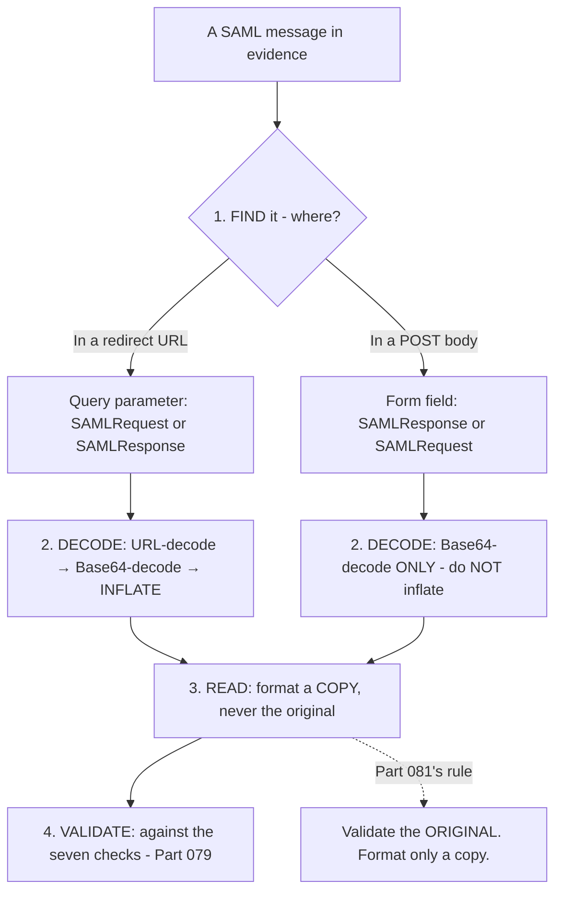
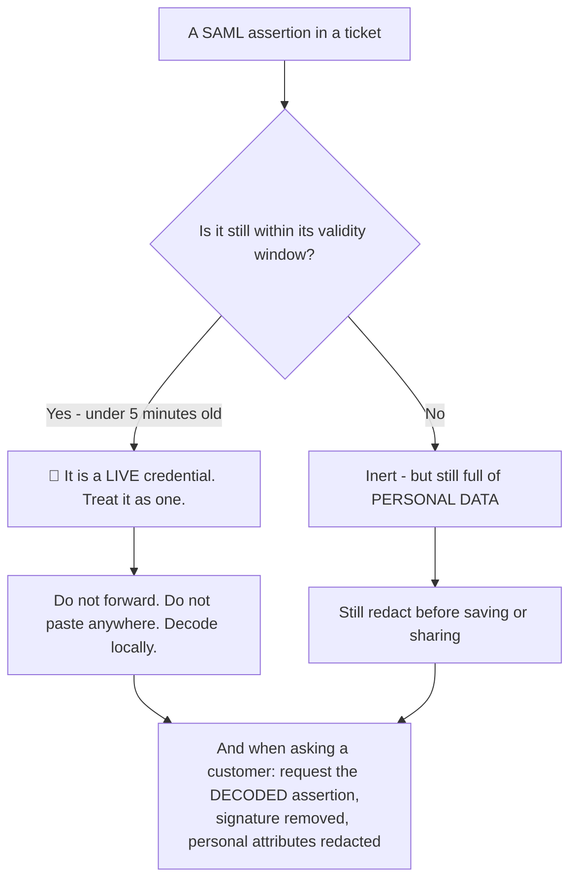
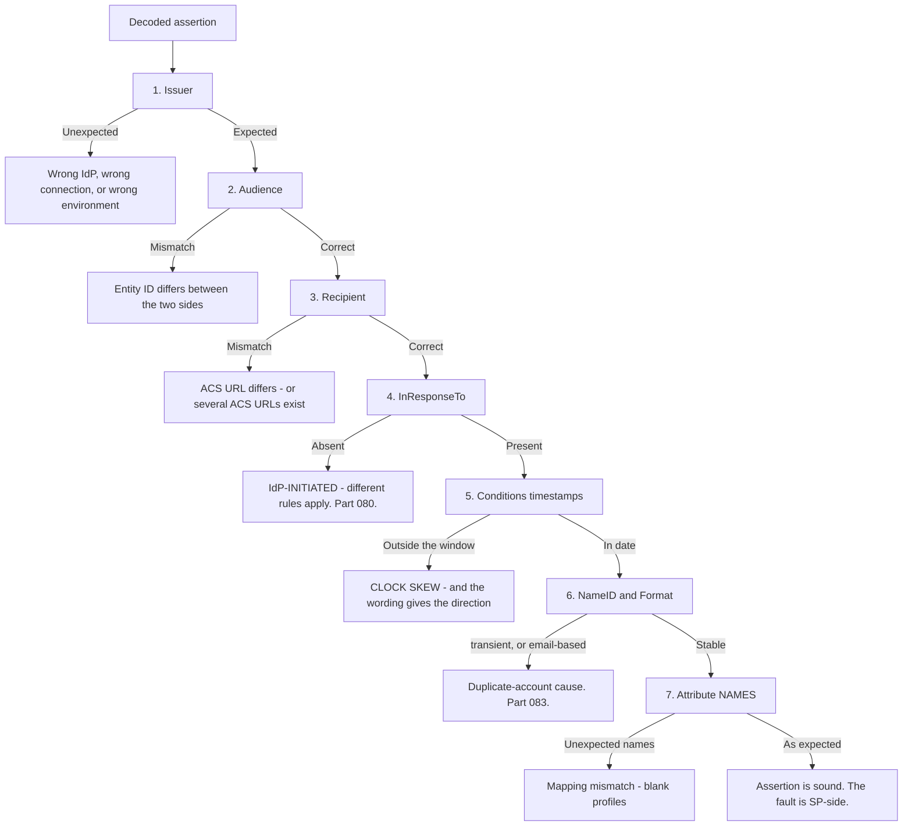
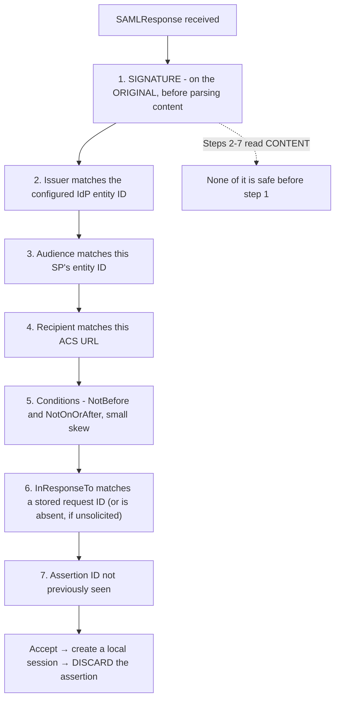
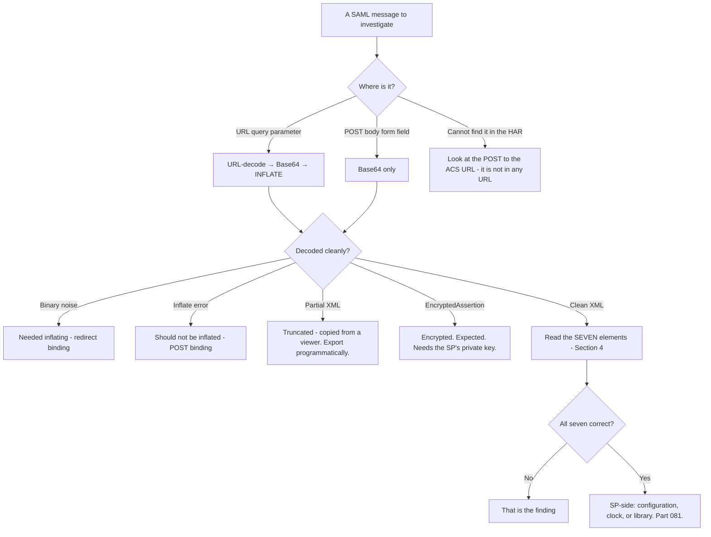

# Part 082 - Decoding and Validating SAML Messages

> Section goal: Build the hands-on skill of reading any SAML message quickly and safely, and knowing exactly which validation each element supports. This is the SAML equivalent of Part 040's decoding toolkit and Part 043's validation checklist, combined.

Covers index item **082**. Maps to JD signals: *knowledge of SAML*, *strong analytical and problem-solving skills*, *experience with troubleshooting web applications*, *basic security concepts*, and *promote best practices*.

---

## 1. Start From Zero: Find It, Decode It, Read It



**Four steps, and the second is where the binding difference lives** (Part 079): redirect-binding messages are deflated; POST-binding messages are not.

> **Analogy.** Finding a sealed document, opening the envelope correctly, photocopying it to read comfortably, and checking the seal on the original.
>
> **Where it stops:** a photocopy is obviously a copy. A formatted XML document looks like the original, which is why the discipline has to be explicit.

---

## 2. Where to Find Messages

| Location | Message | Binding |
|---|---|---|
| `/authorize`-equivalent redirect URL, `?SAMLRequest=` | `AuthnRequest` | Redirect — **deflated** |
| ACS POST body, `SAMLResponse=` | `Response` with the assertion | POST — **not deflated** |
| Logout redirect, `?SAMLRequest=` | `LogoutRequest` | Redirect — deflated |
| Logout POST body | `LogoutResponse` | POST — not deflated |
| IdP or SP logs | Either, sometimes stored decoded | Varies |

**In a HAR, the response is the one you usually want** (Part 021), and it is in the POST body of the request to the ACS URL — **not in a URL**, which is why searching the HAR's URLs finds nothing.

---

## 3. Decoding Safely

### The two decode paths

```
REDIRECT binding:   URL-decode → Base64-decode → INFLATE (raw deflate) → XML
POST binding:       Base64-decode → XML
```

**Getting this wrong produces a decode failure that looks like corruption.** Attempting to inflate a POST-binding message fails; failing to inflate a redirect-binding message produces binary noise.

| Symptom | Cause |
|---|---|
| Decodes to unreadable binary | Redirect binding, not inflated |
| Inflate throws an error | POST binding, should not be inflated |
| Decodes to partial XML | Truncated — copied from a viewer that wrapped lines |
| Base64 fails | URL-encoded characters not decoded first |

### 🔍 Plain-English deep-dive: the same safety rules as Part 040, and one more

A SAML assertion is a **credential** and it contains **personal data**. Everything from Part 040 applies, plus one SAML-specific rule.

| Rule | Why |
|---|---|
| **Decode locally** | An assertion inside its validity window is usable |
| **Never paste into an online decoder** | It contains a live credential and personal attributes |
| **Redact before saving** | Attributes typically include email, name, groups, sometimes more |
| **Strip the signature when sharing** | As with JWTs — the signature is not needed to discuss the content |
| 🔴 **NEVER validate a reformatted copy** | SAML-specific — canonicalisation (Part 081) |



**The validity-window point is genuinely different from JWTs**, and it cuts both ways. A SAML assertion is usable for two to five minutes rather than an hour, so a pasted assertion in a ticket is **usually already inert by the time you read it** — which is a small mercy. But it is still full of personal attributes, and the redaction obligation does not expire with the assertion.

**What to ask a customer for**, phrased so it is easy rather than an obstacle:

> *"Could you send the decoded assertion with the `<ds:Signature>` block removed and any personal attribute values redacted? I mainly need the `Issuer`, `Audience`, `Recipient`, `InResponseTo`, the `Conditions` timestamps, and the list of attribute **names** — the values aren't necessary."*

**Asking for attribute names rather than values is the detail that makes this work**, because a missing or misnamed attribute is the most common claim problem (Part 083) and the name alone diagnoses it.

**And the reformatting rule bears repeating here** because this is where it bites: a customer following your request to "decode and send" may pretty-print it. **That is fine for reading and useless for validating**, so if the question is about a signature, the raw original is what you need.

**Analogy:** asking for a redacted copy of a document rather than the original. Sufficient for the question, and it means nothing sensitive is travelling. **Where it stops:** a redacted paper copy is visibly redacted. An XML document with values removed still looks complete, which is why naming exactly which elements you need makes it easy for them to comply.

---

## 4. Reading an Assertion Fast

The SAML equivalent of Part 041's six-value read.

| # | Element | Question it answers |
|---|---|---|
| 1 | **`Issuer`** | Which IdP — is it the expected one? |
| 2 | **`Audience`** | Is this assertion for this SP? |
| 3 | **`Recipient`** | Is it for this ACS URL? |
| 4 | **`InResponseTo`** | SP-initiated or unsolicited? (Part 080) |
| 5 | **`Conditions`** timestamps | Is it in date? Compute the window |
| 6 | **`NameID`** and its `Format` | Who, and is the format stable? (Part 083) |
| 7 | **Attribute names** | Are the expected attributes present? |

**Seven elements, one decode, most SAML tickets answered.** If all seven are correct, the problem is on the SP side — its configuration, its clock, or its library.

### 🔍 Plain-English deep-dive: reading an assertion in order, and what each answer eliminates

The order of the seven is not arbitrary. **Each one eliminates a family of causes**, so reading them in sequence narrows fastest.



**The sequencing logic:** issuer and audience are configuration-level and cheapest to check, so they come first. `InResponseTo` determines *which set of rules apply* before you evaluate anything else, so it comes before the detailed checks. Timestamps are the most common sudden failure. And NameID and attributes only matter once the assertion is otherwise sound — those are user-quality problems rather than authentication failures.

**Two elements do double duty**, which is worth knowing:

**`InResponseTo`'s absence is not a failure** — it tells you the flow was IdP-initiated, which changes what "correct" means for everything after it (Part 080). Reading it fourth rather than last prevents diagnosing an unsolicited assertion as a broken correlation.

**The `Conditions` window length**, not just whether it is in date, is diagnostic. A two-minute window tells you this deployment is skew-sensitive **before** anything has failed — which is worth noting proactively on any SAML ticket (Part 079).

**And the final node is the one people forget to draw.** If all seven are correct, the assertion is not the problem — and that is a positive finding worth stating, because it directs the investigation to the service provider's own configuration, clock, or library rather than leaving it open.

**Analogy:** a checklist ordered so the cheapest and most eliminating questions come first — is this the right document, is it for us, is it for this office, is it answering something we asked, is it in date, and only then does it say the right things. **Where it stops:** a person would notice an obviously wrong document immediately. Software checks only what it was told to, in whatever order it was written, which is why an explicit reading order is worth having.

---

## 5. The Validation Checklist

Part 079's seven checks, with what each looks like in the XML.



| Check | Where in the XML |
|---|---|
| Signature | `<ds:Signature>` — on the `Response`, the `Assertion`, or both (Part 081) |
| Issuer | `<saml:Issuer>` |
| Audience | `<saml:Conditions><saml:AudienceRestriction><saml:Audience>` |
| Recipient | `<saml:SubjectConfirmationData Recipient="...">` |
| Conditions | `<saml:Conditions NotBefore=".." NotOnOrAfter="..">` |
| `InResponseTo` | `<saml:SubjectConfirmationData InResponseTo="...">` |
| Assertion ID | `<saml:Assertion ID="...">` |

---

## 6. Building the Toolkit

### 🔍 Plain-English deep-dive: what a good SAML decode tool actually does

A useful tool is more than "Base64-decode and print." **The value is in the summary, not the XML** — because the XML is verbose and the answer is seven elements.

```mermaid
flowchart TD
    T["saml-decode <input>"] --> A["1. Detect the binding automatically"]
    A --> A1["Contains %? URL-decode. Then try inflate; fall back if it fails."]
    A --> B["2. Print a SUMMARY first, XML second"]
    B --> B1["Issuer · Audience · Recipient · InResponseTo"]
    B --> B2["NotBefore / NotOnOrAfter, plus the WINDOW LENGTH"]
    B --> B3["Is it in date RIGHT NOW? By how much?"]
    B --> B4["NameID Format and whether the value looks stable"]
    B --> B5["Attribute NAMES - values redacted by default"]
    B --> B6["Signature present on: Response / Assertion / both"]
    B --> B7["Encrypted? Then say so clearly rather than failing"]
    B7 --> C["3. NEVER modify or re-serialise the input"]
```



**Six design decisions worth making deliberately:**

| Decision | Rationale |
|---|---|
| **Auto-detect the binding** | Removes the most common decode failure |
| **Summary before XML** | The answer is seven values; the XML is a thousand lines |
| **Humanise timestamps** | "Expired 4 minutes ago" beats an ISO string (Part 040) |
| **Show the window length** | Immediately reveals a skew-sensitive configuration |
| **Redact attribute values by default** | Personal data; names are what diagnose problems |
| **Report signature scope** | Response-only versus assertion signing matters (Part 081) |

**The "in date right now, by how much" output is the single most useful line**, because it distinguishes the two clock-skew directions instantly (Part 079): expired by three minutes means the SP's clock is ahead; not yet valid by three minutes means it is behind.

**The encryption case deserves explicit handling.** An `EncryptedAssertion` should produce a clear message — *"this assertion is encrypted and cannot be read without the SP's private key"* — rather than a parse error, exactly as the JWE case does in Part 040.

**And the non-modification rule must be enforced in the tool itself**, not left to discipline: the tool should read a copy and never write back, so that even a careless user cannot accidentally validate a reformatted document.

**Why building this is worth an afternoon:** SAML tickets arrive as a wall of XML, and a tool that reduces one to seven lines converts a twenty-minute read into a twenty-second one. **That difference compounds across every SAML ticket you will ever handle.**

**Analogy:** a summary sheet stapled to a long contract, listing the parties, the dates, and the clauses that vary. The contract is still there when you need it. **Where it stops:** a contract summary is written once by a person. This one is generated per document, which is why it must never alter the source.

---

## 7. Failure Modes

| Failure mode | What it looks like | Consequence | Correction |
|---|---|---|---|
| **Wrong decode path** | Binary noise, or an inflate error | Looks like corruption | Redirect deflates; POST does not |
| **Validating a reformatted copy** | "Signature invalid" | Hours lost (Part 081) | Validate the original |
| **Pasting into an online decoder** | Convenient | 🔴 Live credential and personal data | Decode locally |
| **Saving assertions unredacted** | Personal data at rest | Privacy exposure | Redact attribute values |
| **Reading the XML instead of a summary** | Twenty minutes per ticket | Slow | Build the tool |
| **Copying from a viewer** | Truncated at a line wrap | Partial XML | Export programmatically |
| **Missing `InResponseTo` misread** | Assumed a bug | It indicates IdP-initiated (Part 080) | Check the flow |
| **Attribute values requested from customers** | Unnecessary personal data | Privacy risk | Ask for **names** |
| **Encrypted assertion treated as an error** | "Corrupted" | Chasing a non-bug | Clear message; it is expected |
| **Signature scope not checked** | Assumed assertion-signed | Wrapping exposure (Part 081) | Report which is signed |

---

## 8. Troubleshooting Decision Tree: Reading a SAML Message



### Worked example

*"The customer sent us their SAML response and we can't decode it. It just comes out as garbage."*

1. **Ask where they got it from.** Answer: copied from the browser's network tab.
2. **Ask which part.** Answer: from the URL.
3. **That is the diagnosis.** A `SAMLResponse` is delivered in a **POST body**, not a URL — so what they copied from a URL is almost certainly the `SAMLRequest`, which is a **redirect-binding** message and therefore **deflated**.
4. **Confirm quickly.** Decoding it without inflating produces binary noise; inflating produces a readable `AuthnRequest`. **The "garbage" was a correctly-encoded message decoded the wrong way.**
5. **Explain the binding difference in one line**, because it recurs: messages in URLs are deflated; messages in POST bodies are not.
6. **Then get the message they actually need.** The `SAMLResponse` is in the POST body of the request to the ACS URL — and it will not appear if they search the HAR's URLs.
7. **Give the safe-handling ask** while you are there: decoded, `<ds:Signature>` removed, attribute values redacted, and note that you need attribute **names** rather than values.
8. **Offer the tool.** A decoder that auto-detects the binding removes this entire class of confusion permanently, and it is the kind of small thing that makes every future ticket faster.

---

## 9. Lab: Build the SAML Toolkit

**Purpose.** Build a decoding and summarising tool you will use on every SAML ticket, and reproduce every decode failure.

**Prerequisites.** Parts 040, 079, 080, 081 artifacts. A working SAML connection.

**Steps.**

1. Create `okta-prep/labs/082-saml-decode/`.
2. **Capture both messages** from a full SSO — the `AuthnRequest` from the redirect URL and the `SAMLResponse` from the POST body.
3. **Decode each by hand**, using the correct path for each binding. **Record the exact commands.**
4. **Reproduce all four decode failures** from §3: inflating a POST message, not inflating a redirect message, decoding a truncated copy, and forgetting to URL-decode first. **Record each symptom.**
5. **Build `saml-decode`.** Auto-detect the binding, print a summary before the XML, and never modify the input. Implement all six design decisions from §6.
6. **Humanise the timestamps.** Print `NotBefore`, `NotOnOrAfter`, the window length, and **whether it is currently valid and by how much.**
7. **Test the skew output.** Shift your clock and confirm the tool reports "not yet valid by N minutes" and "expired N minutes ago" correctly. **These two outputs are the direction indicator** (Part 079).
8. **Redact by default.** Print attribute **names** with values masked, and add an explicit flag to reveal values. **Confirm the default is safe.**
9. **Report signature scope.** Detect whether the signature is on the `Response`, the `Assertion`, or both. **Test against both configurations** if your IdP allows it (Part 081).
10. **Handle encryption.** Feed it an `EncryptedAssertion` and confirm it prints a clear message rather than failing.
11. **Non-modification test.** Confirm the tool leaves the input file byte-identical. **Verify with a hash before and after.**
12. **The seven-element drill.** Take three assertions and read the seven elements from §4 without the tool. **Time yourself.** Then with the tool. **Record both.**
13. **Build the customer request template.** `saml-evidence-request.md` — the §3 message, naming exactly which elements you need and asking for attribute names rather than values.
14. **Validation script.** Extend the tool to check the seven validation items from §5 against configured expected values, and report pass/fail per item.
15. **Test it** by feeding it messages with a wrong audience, a wrong recipient, an expired window, and a missing `InResponseTo`. **Confirm each is flagged correctly.**
16. **Write the guide.** `saml-decoding.md` — one page: the two decode paths, the seven-element read, the safe-handling rules, and the reformatting warning.
17. **Failure catalog + manifest.** Complete `MANIFEST.md`.

**Expected evidence.** Both messages hand-decoded with commands recorded, four reproduced decode failures, a working auto-detecting tool with humanised timestamps and default redaction, skew direction output verified, signature scope detection, graceful encryption handling, a byte-identical non-modification proof, a timed seven-element drill, a customer request template, a validation script tested against four deliberate faults, and a one-page guide.

**Validation rubric.**

| Check | Pass condition |
|---|---|
| Both bindings decoded | Correct path for each, commands recorded |
| Four failures | Each symptom recorded |
| Auto-detection | Works on both bindings without a flag |
| Timestamps | Window length and current validity, both directions |
| Redaction | Names shown, values masked by default |
| Signature scope | Reported correctly |
| Encryption | Clear message, not a crash |
| Non-modification | Hash identical before and after |
| Validation script | All four faults flagged |

**Cleanup and privacy.** Lab tenant, synthetic users. **Assertions contain personal data — redact before saving anything, and delete captured messages at the end.** Decode locally only. Restore your clock.

---

## 10. JD Mapping

| Supplied JD signal | How this Part supports it |
|---|---|
| **Knowledge of SAML** | Message structure, bindings, and validation in practice |
| **Strong analytical and problem-solving skills** | Seven elements, one decode, most tickets answered |
| **Experience troubleshooting web applications** | Finding messages in a HAR; binding-specific decoding |
| **Basic security concepts** | Assertions as credentials; redaction; non-modification |
| Promote best practices | Asking for attribute names rather than values |
| Communicate technical concepts clearly | Explaining "garbage" as a correctly-encoded message decoded wrongly |
| Exceed expectations on response quality | Offering the tool that removes the class of confusion |

---

## 11. Candidate Honesty Note

- **Claim safety:** *Learned architecture and lab experience*, with genuine transfer — HAR analysis and evidence handling are existing production skills.
- **The strongest thing you can say:** *"Reading a SAML message is four steps: find it, decode it with the right path for its binding, format a copy to read, and validate the original. The binding difference is the one that trips people — messages in URLs are deflated and messages in POST bodies are not, so decoding one as the other produces what looks like corruption."*
- **A second point, the fast-read skill:** *"There are seven elements worth reading: `Issuer`, `Audience`, `Recipient`, `InResponseTo`, the `Conditions` timestamps, `NameID` and its format, and the attribute names. Seven elements, one decode, and most SAML tickets are answered. If all seven are correct, the problem is SP-side — configuration, clock, or library."*
- **A third, on handling:** *"An assertion is a credential and it's full of personal data. Decode locally, never paste it anywhere, and when asking a customer, request the decoded assertion with the signature block removed, values redacted, and attribute **names** rather than values — because a missing or misnamed attribute is the most common claim problem and the name alone diagnoses it."*
- **A fourth, tooling:** *"I'd build a decoder that auto-detects the binding, prints a summary before the XML, humanises the timestamps to say whether it's valid right now and by how much, redacts attribute values by default, and never modifies the input. That last one matters because of canonicalisation — if the tool can't accidentally reformat the source, a careless moment can't cost hours."*
- **A fifth, a genuinely useful output:** *"'Expired four minutes ago' versus 'not yet valid by four minutes' is the clock-skew direction indicator. Printing that one line turns a confusing timestamp comparison into an immediate answer about which side's clock drifted."*
- **A sixth, diagnostic:** *"'We can't decode it, it comes out as garbage' is usually a redirect-binding message decoded without inflating — and often it's the `AuthnRequest` rather than the response, because the response is in a POST body and won't appear if you search the HAR's URLs."*
- **Do not overstate:** you have not handled production SAML evidence. Say the decoding and evidence discipline transfers directly and the SAML specifics were built in a lab.

---

## 12. Official Source Anchors

Accessed **26 August 2026**.

| Source | What it defines |
|---|---|
| OASIS SAML 2.0 Bindings §3.4, §3.5 | Redirect and POST encodings, including DEFLATE |
| OASIS SAML 2.0 Core §2 | Assertion structure and every element read in §4 |
| OASIS SAML 2.0 Profiles §4.1.4 | Response processing rules — the validation checklist |
| W3C XML Signature | Canonicalisation and why reformatting breaks validation |
| W3C XML Encryption | `EncryptedAssertion` |
| IETF RFC 1951 | The raw DEFLATE format used by the redirect binding |
| OWASP — SAML Security cheat sheet | Validation and handling guidance |
| Auth0 and Okta documentation — SAML debugging | Vendor tooling and log formats (Part 107) |

**Revalidate after 26 August 2026:** SAML is stable. Recheck vendor debugging tooling only.

---

## ⭐ Likely Interview Questions for This Section

### Q1. "How do you decode a SAML message?"
> *Model answer:* "It depends on the binding, and that's the step people get wrong. A message in a URL query parameter uses the redirect binding, so it's URL-decoded, then Base64-decoded, then inflated — raw DEFLATE. A message in a POST body uses the POST binding and is Base64-decoded only, with no inflate. Decoding one as the other looks like corruption: a redirect message not inflated is binary noise, and a POST message put through inflate throws an error. Then I'd format a copy to read it — never the original, because XML signatures cover a canonicalised form and reformatting invalidates them. And I'd do all of it locally, because an assertion is a credential and it's full of personal attributes."

### Q2. "What do you read first in an assertion?"
> *Model answer:* "Seven elements, and they answer most SAML tickets in one decode. `Issuer` — is it the expected identity provider? `Audience` — is this assertion for this service provider? `Recipient` — is it for this ACS URL? `InResponseTo` — present means SP-initiated, absent means unsolicited, which tells me which flow produced it. The `Conditions` timestamps — is it in date, and how long is the window, because a short window makes clock skew a first-order problem. `NameID` and its format — who, and is the format stable. And the attribute names — are the expected ones present. If all seven are correct, the problem is on the service provider side: its configuration, its clock, or its library."

### Q3. "A customer says they can't decode their SAML response."
> *Model answer:* "I'd ask where they got it from, because that usually is the answer. If they copied it from a URL, it's almost certainly the `AuthnRequest` rather than the response — the response is delivered in a POST body and won't appear if you search a HAR's URLs. And a message from a URL is redirect-binding, so it needs inflating after Base64-decoding; without that it's binary noise, which is exactly what 'comes out as garbage' means. So it's a correctly-encoded message decoded the wrong way. I'd give them the binding rule in one line — URLs are deflated, POST bodies aren't — point them at the POST to the ACS URL, and offer them a decoder that auto-detects, which removes the whole class of confusion permanently."

### Q4. "What would you ask a customer to send you?"
> *Model answer:* "The decoded assertion with the `<ds:Signature>` block removed and personal attribute values redacted, and I'd name exactly which elements I need — `Issuer`, `Audience`, `Recipient`, `InResponseTo`, the `Conditions` timestamps, and the attribute **names**. Asking for names rather than values is the detail that makes it work: a missing or misnamed attribute is the most common claim problem, and the name alone diagnoses it while the values are personal data I don't need. Naming the specific elements also makes it easy for them to comply, rather than leaving them to decide what's safe to send. The one exception is if the question is about the signature — then I need the raw original, because a reformatted copy won't validate."

### Q5. "Why can't you validate a formatted SAML message?"
> *Model answer:* "Because XML signatures cover a canonicalised form of the document, not the literal bytes. Canonicalisation normalises whitespace, attribute ordering, and namespace declarations — which exists for a good reason, since semantically identical XML can differ byte-for-byte. But it means that pretty-printing a message to read it, and then validating the formatted version, fails. The developer concludes the signature is broken and spends hours on a certificate that was never involved. The rule is: decode a copy for reading, validate the original, and never re-serialise before validating. I'd also build it into the tooling — a decoder that can't write back to its input means a careless moment can't cost hours."

### Q6. "What makes a good SAML decoding tool?"
> *Model answer:* "The summary, not the XML. A raw decode gives you a thousand lines when the answer is seven elements. So: auto-detect the binding so the most common failure disappears; print a summary first with issuer, audience, recipient, `InResponseTo`, the timestamps and window length, the NameID format, the attribute names with values redacted by default, and which parts are signed. Humanise the timestamps to say whether it's valid right now and by how much — 'expired four minutes ago' versus 'not yet valid by four minutes' is the clock-skew direction indicator. Handle encrypted assertions with a clear message rather than a crash. And never modify the input, enforced in the tool rather than left to discipline."

### Q7. "How do you know which validation checks a service provider is performing?"
> *Model answer:* "Test the negatives rather than trusting the configuration. I'd feed it messages that should fail each check: a wrong audience, a wrong recipient, an expired window, a missing `InResponseTo` on an SP-initiated flow, and the same valid assertion submitted twice. Each one should be rejected with a distinguishable error. The two most often missing are `InResponseTo` correlation and assertion-ID tracking, because everything works without them — so a valid assertion replayed within its window being accepted is the test that finds the second one. And I'd ask which library handles validation, because 'we wrote it ourselves' is worth following up given how many signature-wrapping bugs have been found in hand-rolled implementations."

### Q8. "An assertion arrives encrypted and can't be read. Is that a problem?"
> *Model answer:* "Not by itself — it's the system working, exactly like a five-segment JWE. The assertion is encrypted to the service provider's public key, so only the SP's private key can read it, and a tool without that key correctly cannot. The useful follow-ups are: who is supposed to read it, which is the SP; is the SP successfully decrypting it, because if not that's the SP's encryption certificate having rotated while the identity provider holds an old copy; and what were they actually trying to learn, because if it's the attribute names or the timestamps, the SP's own logs after decryption are a better source than the wire message. A decoding tool should say all that in one line rather than throwing a parse error."

---

## 🧠 30-Second Memory Hooks

- **Four steps:** find · decode (**binding-specific**) · read a **copy** · validate the **original**.
- **URL → redirect binding → URL-decode, Base64, INFLATE.**
- **POST body → POST binding → Base64 ONLY.**
- **"It comes out as garbage" = a redirect message not inflated.**
- **The `SAMLResponse` is in a POST BODY.** Searching a HAR's URLs finds nothing.
- **SEVEN elements:** `Issuer` · `Audience` · `Recipient` · **`InResponseTo`** · `Conditions` · `NameID` + format · **attribute names**.
- **NEVER validate a reformatted copy.** Canonicalisation.
- **An assertion is a CREDENTIAL and full of PERSONAL DATA.** Decode locally.
- **Ask for attribute NAMES, not values.** The name diagnoses it.
- **"Expired 4 min ago" vs "not yet valid by 4 min" = the skew DIRECTION.**
- **`EncryptedAssertion` = expected**, not corruption.
- **A tool must never modify its input.** Enforce it, do not rely on discipline.

---

## ✅ Completion Checklist

- [ ] **Knowledge:** I can state both decode paths, the seven-element read, and the reformatting rule.
- [ ] **Lab artifact:** `082-saml-decode/` contains four reproduced decode failures, an auto-detecting tool with humanised timestamps and default redaction, a non-modification proof, a timed drill, and a validation script tested against four faults.
- [ ] **Spoken:** I can explain the binding difference in 20 seconds and the seven-element read in 45.
- [ ] **Judgement:** I ask for attribute names rather than values, and I ask where a message came from before diagnosing.
- [ ] **Honesty check:** I claim evidence handling as existing skill and SAML decoding as lab-built.
- [ ] **Source check:** I have read SAML 2.0 Bindings §3.4 and Profiles §4.1.4 myself.

---

*Next suggested section:* **[Part 083 - NameID, Attribute Mapping, and Just-in-Time Provisioning](Part-083-nameid-attribute-mapping-and-just-in-time-provisioning.md)** — how a SAML user becomes a user in your system, and where that goes wrong.
