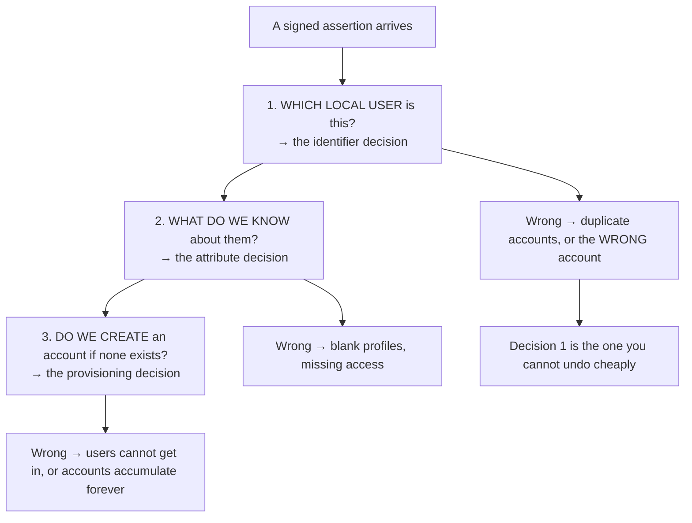
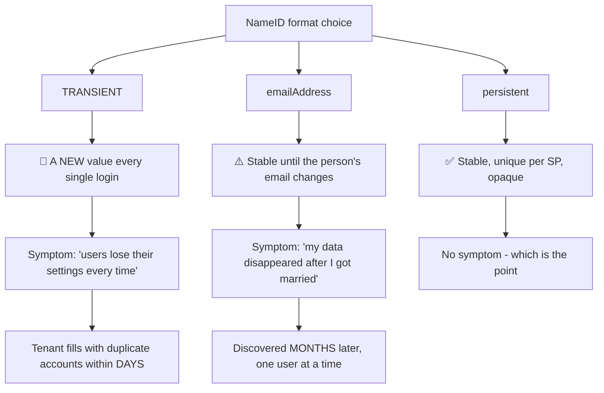
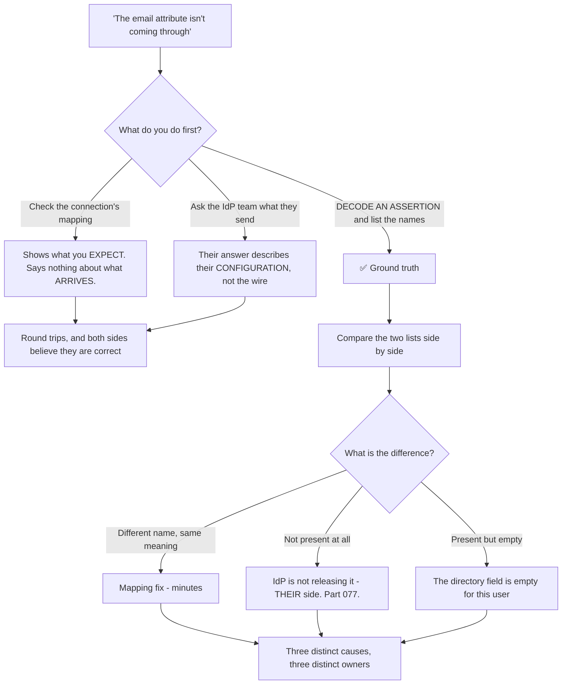
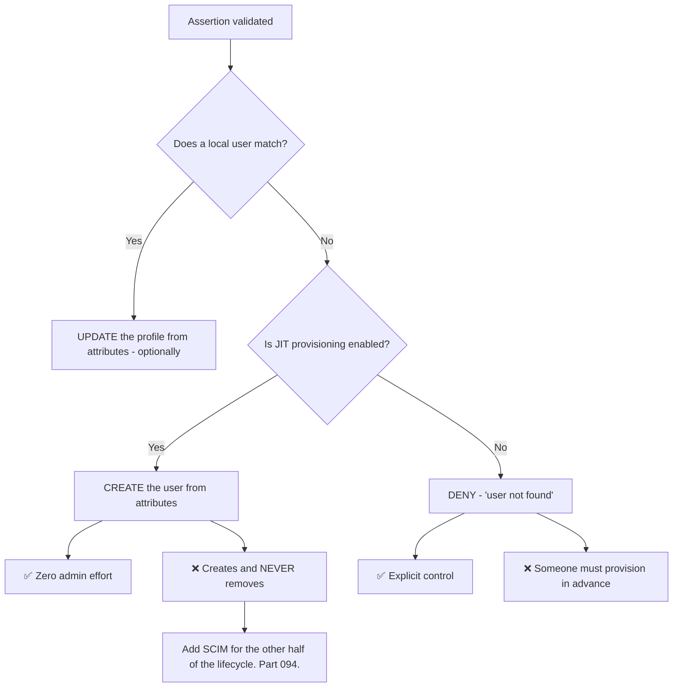
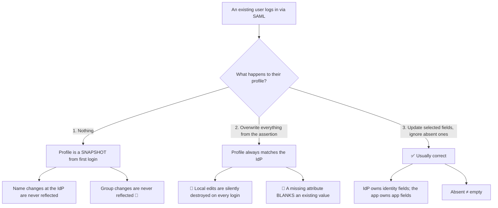
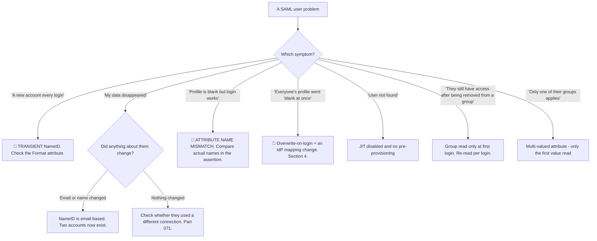

# Part 083 - NameID, Attribute Mapping, and Just-in-Time Provisioning

> Section goal: Understand how a SAML user becomes a user in your system — the identifier, the attributes, and the account creation — and where each step fails. This is the highest-volume SAML ticket category after certificates.

Covers index item **083**. Maps to JD signals: *knowledge of SAML*, *knowledge of authentication and authorization*, *strong analytical and problem-solving skills*, *communicate technical concepts clearly*, and *basic security concepts*.

---

## 1. Start From Zero: Three Decisions

When a federated user arrives, the service provider must decide three things.



**Decision 1 is the consequential one.** Attributes can be remapped and provisioning can be changed; **changing the identifier means reconciling every existing account** (Part 048).

> **Analogy.** A new patient arriving with a referral letter. Which record is theirs, what does the letter tell you, and do you open a file if none exists. The first question is the one that causes harm when answered wrongly.
>
> **Where it stops:** a receptionist can ask the patient. A service provider matches on whatever string it was configured with, and a mismatch produces a confident, silent second account.

---

## 2. NameID: The Identifier

```xml
<saml:NameID Format="urn:oasis:names:tc:SAML:2.0:nameid-format:persistent">
  a7f3c9d2-e1b8-4c5a-9f2e-1234567890ab
</saml:NameID>
```

| Format | Stability | Use |
|---|---|---|
| **`persistent`** | ✅ **Stable and unique per SP** | ✅ The correct default |
| `emailAddress` | ❌ Changes when the email changes | Common and risky |
| `unspecified` | ⚠️ Whatever the IdP decides | Ask what it actually contains |
| **`transient`** | 🔴 **Different on EVERY login** | Anonymous SSO only |
| `X509SubjectName`, `kerberos`, `entity` | Specialised | Rare |

### 🔍 Plain-English deep-dive: the three NameID mistakes, in order of damage



**Mistake 1 — `transient`, and it is the fastest and loudest.** A transient NameID is *designed* to be different on every login; it exists for anonymous or pseudonymous SSO where the SP is not supposed to recognise returning users. Configure it by accident and **every login creates a new account.** The reported symptom is *"users lose their settings every time they log in,"* which sounds like a session bug and is an identity bug. **A tenant fills with duplicates within days**, so at least it is discovered quickly.

**Mistake 2 — `emailAddress`, and it is slower and more damaging.** It works perfectly until someone's email changes — a marriage, a rebrand, a domain migration after an acquisition. Then that person arrives as a **brand-new user**: empty workspace, no history, no permissions. They report data loss. **Nothing was lost; a second account was created beside the first** (Part 071).

**The reason this is worse than mistake 1** is discovery time. Transient breaks everything immediately and gets fixed. Email-based matching works for a year and then fails for one person at a time, and each instance looks like an isolated incident rather than a systemic choice.

**Mistake 3 — assuming `unspecified` means something.** It means the IdP decides. **The only way to know is to look at an actual assertion** and ask the IdP team what populates it. It might be a stable directory GUID — excellent — or an email address, or a username that changes on promotion.

**What good looks like:**

| Rule | Detail |
|---|---|
| Prefer **`persistent`** | Stable, unique per SP, opaque |
| Best of all: an **immutable directory ID** | Entra's object ID, or equivalent — stable across every change |
| Treat NameID as **opaque** | Never parse, never display |
| **Store the format too** | So a change is detectable |
| Match on **`(Issuer, NameID)`** | Not NameID alone — the same reasoning as `(iss, sub)` (Part 071) |

**The question to ask at configuration time**, which prevents all three mistakes: *"What exactly is in the NameID, and does it change if the person changes their name, email, or job title?"* **The identity team can answer that in one message, and it is far cheaper than discovering it in production.**

**Analogy:** filing records by name rather than by patient number. It works until someone marries, and then the same person has two histories and neither is complete. **Where it stops:** a clinician notices the duplicate. A service provider creates the second account and reports success.

---

## 3. Attributes

Everything other than the identifier.

```xml
<saml:AttributeStatement>
  <saml:Attribute Name="http://schemas.xmlsoap.org/ws/2005/05/identity/claims/emailaddress">
    <saml:AttributeValue>alice@corp.com</saml:AttributeValue>
  </saml:Attribute>
  <saml:Attribute Name="groups">
    <saml:AttributeValue>Sales</saml:AttributeValue>
    <saml:AttributeValue>Managers</saml:AttributeValue>
  </saml:Attribute>
</saml:AttributeStatement>
```

| Reality | Consequence |
|---|---|
| **Attribute names are not standardised** | `email`, `emailaddress`, and the full schema URI all appear |
| **Attributes can be multi-valued** | `groups` typically is — code must handle both |
| **Nothing is guaranteed** | The IdP releases what it is configured to release |
| **Names differ per IdP** | Entra, Okta, Ping and ADFS all default differently |
| **Case can matter** | Depending on the implementation |

### The naming problem, concretely

| Meaning | Entra ID default | Okta default | Short form |
|---|---|---|---|
| Email | `http://schemas.xmlsoap.org/ws/2005/05/identity/claims/emailaddress` | `email` | `email` |
| First name | `.../claims/givenname` | `firstName` | `givenName` |
| Groups | `http://schemas.microsoft.com/ws/2008/06/identity/claims/groups` | `groups` | `groups` |

**This is why "the email attribute is missing" is usually "the email attribute is present under a different name."**

### 🔍 Plain-English deep-dive: never assume attribute names — read them

The single fastest habit in SAML attribute troubleshooting is refusing to reason about attribute names in the abstract. **Decode an assertion and read what is actually there.**



**The three outcomes in that bottom row have completely different owners**, which is why guessing wastes so much time:

| Finding | Owner | Effort |
|---|---|---|
| Present under a different name | **You** — the connection's mapping | Minutes |
| Not present at all | **The customer's identity team** | A change request on their side |
| Present but empty | **The customer's directory** — the field is blank for that user | A data fix, per user |

**The third case is the one people miss**, and it produces a distinctive pattern: the mapping is correct, the attribute is released, and it works for most users and not for some. **That is not a configuration problem at all — it is a data-completeness problem in their directory**, and no amount of connection changes will fix it.

**The practical technique**, which resolves this class in one exchange rather than several:

> *"Could you send a decoded assertion for one affected user and one working user, with the values redacted but the attribute **names** intact? Comparing the two lists usually shows it immediately."*

**Asking for both an affected and a working user is the detail that makes it work** — the difference between the two assertions is the answer, and it distinguishes "not released at all" from "empty for this person" without any further round trips.

**And the naming reality is worth stating plainly to customers**, because it removes any sense of blame: there is no standard. `email`, `emailaddress`, and a schema URI are all legitimate, and two correctly-configured systems can simply disagree. **Framing it as a translation problem rather than a misconfiguration keeps the conversation efficient.**

**Analogy:** two departments using different codes for the same field on a form. Neither is wrong; nobody wrote down the mapping. **Where it stops:** a person reading both forms would recognise the field from its contents. Software matches on the name and finds nothing, with total confidence.

---

## 4. Just-in-Time Provisioning



| Approach | Trade |
|---|---|
| **JIT only** | ✅ Effortless onboarding. 🔴 **No deprovisioning** (Part 048) |
| **SCIM only** | ✅ Full lifecycle. ❌ More setup |
| **JIT + SCIM** | ✅ The enterprise answer |
| **Neither — pre-provisioned** | ✅ Full control. ❌ Does not scale |

### 🔍 Plain-English deep-dive: update-on-login is a decision nobody makes deliberately

JIT gets attention for *creating* users. **The quieter question is what happens on every subsequent login**, and it has three possible answers with very different consequences.



**Option 2's second failure is the nastiest**, and it is worth stating precisely: if the identity provider stops releasing an attribute — a mapping change, a policy change, a group the user left — and the service provider overwrites unconditionally, then **an absent attribute becomes an empty value.** Users' names vanish, group memberships are cleared, and access silently disappears **for everyone**, at the next login.

**That is a customer-wide incident produced by an attribute mapping change**, and the symptom — "everyone's profile went blank" — sounds like data loss.

**Option 1's problem is quieter but security-relevant:** if group membership drives authorisation and it is only read at first login, then a user removed from a group at the identity provider **keeps that access indefinitely** (Part 046). The IdP is the source of truth and the SP never asks again.

**Option 3 is the correct shape**, and it needs three rules stated explicitly:

| Rule | Reason |
|---|---|
| **Absent ≠ empty** | Only update fields the assertion actually contains |
| **Decide ownership per field** | The IdP owns email and name; the app may own display preferences |
| **Re-read authorisation attributes every login** | Groups drive access; a snapshot is a stale permission |

**The question that surfaces this at design time:** *"When Alice logs in tomorrow, which parts of her profile does the assertion overwrite — and what happens if an attribute isn't there?"* **Most teams have not decided**, and the inability to answer is the finding.

**Analogy:** a visitor system that re-reads a badge each visit. Updating the department is right; blanking their name because the badge printer omitted it this time is not. **Where it stops:** a receptionist would notice a blank badge. Code writes an empty string with perfect confidence.

---

## 5. Failure Modes

| Failure mode | What it looks like | Consequence | Correction |
|---|---|---|---|
| **`transient` NameID** | New account every login | 🔴 "Users lose settings every time" | `persistent` |
| **Email as NameID** | Works for a year | 🔴 New account when email changes | Immutable ID |
| **`unspecified` assumed stable** | Works until it does not | Duplicates | Ask what populates it |
| **NameID parsed or displayed** | Works until format changes | Breakage; poor UX | Opaque |
| **Matching on NameID alone** | Works with one IdP | Collides with a second | `(Issuer, NameID)` |
| **Attribute name mismatch** | Blank profile, login succeeds | 🔴 **Silent** bad data | Compare actual names |
| **Multi-valued attribute mishandled** | Only the first group read | Missing access | Handle arrays |
| **Overwrite-everything on login** | Works | 🔴 **Absent attribute blanks the value** | Absent ≠ empty |
| **Never updating on login** | Works | 🔴 Stale group membership = stale access | Re-read authorisation attributes |
| **JIT with no deprovisioning** | Accounts accumulate | 🔴 Audit gap (Part 048) | Add SCIM |
| **No JIT and no pre-provisioning** | "User not found" | Blocked onboarding | Enable one |
| **Groups used directly as permissions** | Coarse | Role explosion (Part 051) | Map groups → permissions |

---

## 6. Troubleshooting Decision Tree: Identity and Attribute Problems



### Worked example

*"A customer reports that every one of their users' profiles went blank overnight. Names, departments, everything. Login still works."*

1. **"Login works, profile blank, everyone at once" is a very specific shape.** Authentication succeeded, so the assertion is valid — the failure is entirely in what came *with* it.
2. **Get a current assertion** and decode it (Part 082). **Compare the attribute names present now** against what the connection expects.
3. **Finding:** the attributes are present under **different names**. The customer's IdP team changed the claim mapping — perhaps moving from short names to schema URIs during a platform upgrade.
4. **But that alone explains blank *new* profiles, not existing ones being wiped.** The second half is the service provider overwriting the whole profile on every login: attributes it could not find were written as empty.
5. **Name both causes**, because fixing only one leaves the other: an IdP-side mapping change **and** an SP-side overwrite policy that treats absent as empty.
6. **Immediate fix:** update the connection's attribute mapping to the new names. Profiles repopulate on next login.
7. **The durable fix, and the more important one:** change the update policy so **absent attributes are ignored rather than written as empty**. Without that, the next mapping change on either side does this again.
8. **Raise the data question honestly.** Were any profile fields locally edited and now lost? If so, that is genuine data loss and needs to be said, not buried.
9. **Prevention:** attribute mapping changes on either side should be tested against a single user before rollout. **Offer that as a process suggestion**, since this was a customer-wide incident caused by a configuration change nobody validated.

---

## 7. Lab: Identity and Attributes End to End

**Purpose.** Configure each identifier and update strategy, reproduce every failure, and build the configuration-time question set.

**Prerequisites.** Parts 079–082 artifacts. A free Auth0 tenant plus a SAML IdP where you control NameID format and attribute mappings.

**Steps.**

1. Create `okta-prep/labs/083-nameid-attributes/`.
2. **Record the defaults.** What NameID format and attributes does your IdP send by default? **Decode an assertion and list them** (Part 082).
3. **`persistent` baseline.** Configure `persistent` NameID. Log in twice as the same user. **Confirm one account and a stable value.**
4. **`transient` reproduction.** Switch to `transient`. Log in three times. **Confirm three accounts.** Record the exact symptom a user would report.
5. **Email-based reproduction.** Switch to `emailAddress`. Log in, then **change the user's email at the IdP**, then log in again. **Confirm a second account** and record the symptom.
6. **Restore `persistent`** and confirm stability.
7. **`(Issuer, NameID)` keying.** Add a second SAML connection from a different IdP issuing the **same** NameID value. **Confirm whether your matching collides**, then key on both and confirm it does not.
8. **Attribute name mismatch.** Change one attribute's name at the IdP without changing the connection. Log in. **Record whether login fails or silently produces a blank field.** The silent case is the point.
9. **Multi-valued attributes.** Send `groups` with three values. **Confirm all three are read**, not just the first.
10. **Update policy — overwrite.** Configure overwrite-everything-on-login. **Then stop sending one attribute** and log in. **Confirm the existing value is blanked.** Record it.
11. **Update policy — ignore absent.** Change to update-only-present. Repeat step 10 and **confirm the value survives.** This contrast is the lab's central artifact.
12. **Update policy — never update.** Change a name at the IdP and log in. **Confirm the local profile does not change.** Then consider group membership: remove the user from a group and confirm they retain access.
13. **JIT on and off.** With JIT disabled, log in as a new user and record the error. Enable JIT and confirm creation.
14. **Deprovisioning gap.** Disable the user at the IdP. Confirm login fails, then **confirm the local account persists** (Part 048).
15. **Build the configuration questionnaire.** `saml-user-mapping-questions.md` — the questions to ask an identity team at setup: what populates NameID, does it change when the person changes, which attributes will be released and under exactly what names, and are any multi-valued.
16. **Write the guidance.** `nameid-and-attributes.md` — one page: identifier choice, attribute naming reality, the three update policies, and the JIT/SCIM pairing.
17. **Failure catalog + manifest.** Complete `MANIFEST.md`.

**Expected evidence.** Default formats and attributes recorded, three identifier strategies with their failure symptoms, a collision test with and without issuer keying, a silent attribute mismatch, multi-value handling, all three update policies with the absent-attribute contrast, JIT on and off, a demonstrated deprovisioning gap, a configuration questionnaire, and one-page guidance.

**Validation rubric.**

| Check | Pass condition |
|---|---|
| Defaults recorded | Format and attribute names listed from a real assertion |
| `transient` | Three logins, three accounts |
| Email-based | Second account after an email change |
| Issuer keying | Collision demonstrated, then prevented |
| Attribute mismatch | Silent blank field observed |
| Multi-valued | All values read |
| Update policies | All three tested; absent-attribute contrast recorded |
| JIT | Both states; deprovisioning gap evidenced |
| Questionnaire | Four questions, answerable by an identity team |

**Cleanup and privacy.** Lab tenants, synthetic users, **an email domain you control**. Assertions contain personal data — redact before saving (Part 082). Delete all users and connections, and restore IdP mappings, at the end.

---

## 8. JD Mapping

| Supplied JD signal | How this Part supports it |
|---|---|
| **Knowledge of SAML** | NameID formats, attribute statements, and JIT |
| Knowledge of authentication and authorization | Group attributes as authorisation input, and staleness |
| **Strong analytical and problem-solving skills** | "Everyone's profile went blank" traced to two combined causes |
| **Communicate technical concepts clearly** | Explaining that nothing was lost — a second account was created |
| **Basic security concepts** | Stale group membership as stale access; deprovisioning gap |
| Promote best practices | The configuration-time questionnaire |
| Exceed expectations on response quality | Naming both causes, and raising genuine data loss honestly |

---

## 9. Candidate Honesty Note

- **Claim safety:** *Learned architecture and lab experience*, with genuine adjacent background — Active Directory and Entra group and attribute work is the IdP side of this.
- **The strongest thing you can say:** *"Three decisions when a federated user arrives: which local user this is, what we know about them, and whether we create an account. The first is the one you can't undo cheaply — attributes can be remapped and provisioning changed, but changing the identifier means reconciling every existing account."*
- **A second point, the identifier hierarchy:** *"`transient` NameID means a new value every login, so every login creates an account — the symptom is 'users lose their settings every time,' which sounds like a session bug. Email-based NameID is worse in a subtler way: it works for a year and then one person changes their email and arrives as a brand-new user with an empty workspace. Persistent, or better an immutable directory ID, is the answer — and match on `(Issuer, NameID)`, not NameID alone."*
- **A third, and it explains most blank-profile tickets:** *"Attribute names aren't standardised. Entra sends schema URIs, Okta sends short names, and 'the email attribute is missing' is usually 'the email attribute is present under a different name.' The fix is comparing the names actually in the assertion against what the connection expects, which one decode answers."*
- **A fourth, a genuinely nasty failure:** *"If a service provider overwrites the whole profile on every login and the identity provider stops releasing an attribute, absent becomes empty — so everyone's profile blanks at once. That's a customer-wide incident caused by a mapping change, and the symptom sounds like data loss. Absent should never mean empty."*
- **A fifth, a security-relevant quiet one:** *"If groups drive authorisation and are only read at first login, a user removed from a group at the identity provider keeps that access indefinitely. Authorisation attributes need re-reading every login."*
- **A sixth, prevention:** *"At configuration time I'd ask the identity team four things: what exactly populates the NameID, does it change if the person changes their name, email or job title, which attributes will be released and under exactly what names, and are any multi-valued. That's one message and it prevents most of this."*
- **Do not overstate:** you have not run production SAML user mapping. Say you have reproduced each failure in a lab and that the directory background is genuine.

---

## 10. Official Source Anchors

Accessed **26 August 2026**.

| Source | What it defines |
|---|---|
| OASIS SAML 2.0 Core §2.2 | NameID and all identifier formats |
| OASIS SAML 2.0 Core §2.7.3 | Attribute statements and multi-valued attributes |
| OASIS SAML 2.0 Profiles §8.3 | Name identifier format semantics, including transient and persistent |
| IETF RFC 7644 (SCIM) | Provisioning and deprovisioning (Part 094) |
| Auth0 documentation — SAML attribute mapping and JIT | Vendor mapping configuration |
| Okta documentation — SAML attribute statements | Okta's defaults |
| Microsoft Entra ID documentation — SAML claims and NameID | Schema URI defaults and immutable ID guidance |
| OASIS SAML attribute profiles | Standard attribute naming conventions |

**Revalidate after 26 August 2026:** SAML is stable. **Recheck IdP default attribute names**, which do change between platform versions.

---

## ⭐ Likely Interview Questions for This Section

### Q1. "Which NameID format should be used and why?"
> *Model answer:* "`persistent`, or better an immutable directory identifier where the IdP will send one — Entra's object ID, for instance. It's stable, unique per service provider, and opaque, so it survives someone changing their name, email, or job title. What to avoid: `transient`, which is designed to be different on every login and produces a new account every time — the symptom users report is 'we lose our settings every time we log in,' which sounds like a session bug. And `emailAddress`, which works for a year and then someone marries or the company rebrands, and that person arrives as a brand-new user with an empty workspace. And `unspecified` means whatever the IdP decides, so the only way to know is to look at a real assertion and ask their team."

### Q2. "A user says their data disappeared after a federated login."
> *Model answer:* "Almost certainly a second account was created rather than data being lost, and the first thing I'd say is exactly that — because they believe they've lost work and that fear needs correcting before any explanation lands. Then the cause: something about their identity changed, and the service provider matches on something that changed with it. Usually that's an email-based NameID and their email changed. I'd decode a current assertion and compare the NameID to the one on their original account. The fix has two halves: link or merge the accounts for this user, after verifying identity out of band, and change the matching to a persistent or immutable identifier so it stops happening. And I'd check how many other users are affected, because whatever changed for one person often changed for a group."

### Q3. "Login succeeds but the profile is blank. Where do you look?"
> *Model answer:* "Attribute name mismatch, almost always. The assertion validated — that's why login worked — but the attributes it carries are named differently from what the connection expects. Attribute names aren't standardised: Entra sends full schema URIs like `http://schemas.xmlsoap.org/ws/2005/05/identity/claims/emailaddress`, Okta sends short names like `email`, and each platform has its own defaults. So 'the email attribute is missing' is usually 'the email attribute is present under a different name.' One decode answers it — list the attribute names actually in the assertion and compare them against the mapping. What makes it dangerous is that it fails silently: the user is created with missing data rather than being rejected, so it's discovered weeks later as bad data."

### Q4. "Everyone's profile went blank at once. What happened?"
> *Model answer:* "Two things combined. Something changed the attribute names on the identity provider side — a mapping change, or a platform upgrade moving from short names to schema URIs. And the service provider overwrites the whole profile on every login, so attributes it couldn't find were written as empty strings. Either alone would be less severe: a mapping change with a sensible update policy just means new profiles are incomplete; an overwrite policy with stable mappings never shows a problem. Together, everyone's profile blanks at the next login. I'd fix the mapping to restore the data, and then fix the update policy so absent attributes are ignored rather than written as empty — because otherwise the next mapping change on either side does this again. And I'd ask honestly whether any locally-edited fields were lost, because that would be genuine data loss."

### Q5. "What are the options for updating a profile on each login?"
> *Model answer:* "Three, and most teams haven't consciously chosen. Never update, so the profile is a snapshot from first login — which means name changes are never reflected, and more seriously, group membership driving authorisation goes stale, so someone removed from a group at the identity provider keeps that access indefinitely. Overwrite everything from the assertion, which keeps the profile current and silently destroys local edits and — the nasty one — turns an absent attribute into an empty value. Or update only the fields the assertion actually contains, ignoring absent ones, which is usually correct. That last one needs three rules stated explicitly: absent isn't empty, decide ownership per field so the IdP owns identity fields and the app may own its own, and re-read authorisation attributes every login because a snapshot is a stale permission."

### Q6. "What's JIT provisioning and what's missing from it?"
> *Model answer:* "Just-in-time provisioning creates the local account on first successful federated login, using attributes from the assertion. It's excellent for onboarding — zero admin effort, users appear as they arrive. What's missing is the other end: JIT creates and never removes. When someone leaves, the identity provider disables them so they can't log in, which is genuinely the important part, but the account and its data persist at the service provider indefinitely and are invisible to an offboarding audit. The complete answer is JIT for creation plus SCIM for lifecycle, so deactivation propagates. I'd raise it even when it isn't the ticket, because customers usually assume disabling at the IdP removed the account everywhere."

### Q7. "What would you ask an identity team when setting up a connection?"
> *Model answer:* "Four things, in one message. What exactly populates the NameID — the specific directory field, not the format name. Does that value change if the person changes their name, email, or job title, because that's the question that catches email-based and username-based identifiers before they cause damage. Which attributes will you release, and under exactly what names — asking for the names specifically, because that's where the mismatches are. And are any of them multi-valued, since groups usually are and code that reads only the first value produces missing access that's hard to trace. That's one message, they can answer it quickly, and it prevents most of the identity and attribute problems that otherwise surface months later."

### Q8. "Only one of a user's groups is being applied. Why?"
> *Model answer:* "The groups attribute is multi-valued and the code is reading only the first value. SAML attributes can carry several `AttributeValue` elements under one `Attribute`, and `groups` almost always does — but code written against a single-value example takes the first one and moves on. The symptom is subtle: the user has *some* access, so it doesn't look like a total failure, and it only affects people in more than one group. I'd confirm by decoding the assertion and counting the values, which takes seconds. It's worth mentioning that this is the same class of mistake as `aud` being a string or an array in a JWT — a specification permits variation, code assumes one form, and it works until it meets the other."

---

## 🧠 30-Second Memory Hooks

- **Three decisions:** which user · what we know · whether to create. **The first is the one you cannot undo.**
- **`transient` NameID = a NEW account EVERY login.** "We lose our settings every time."
- **Email NameID = a new account when the email CHANGES.** Discovered months later, one user at a time.
- **Use `persistent`, or an IMMUTABLE directory ID.** Treat it as opaque.
- **Match on `(Issuer, NameID)`**, not NameID alone.
- **Attribute names are NOT standardised.** Entra sends schema URIs; Okta sends short names.
- **"The attribute is missing" usually = "present under a different name."**
- **Attributes can be MULTI-VALUED.** `groups` almost always is.
- **Three update policies.** **ABSENT ≠ EMPTY** is the rule that prevents the worst one.
- **Overwrite + an IdP mapping change = everyone's profile blanks at once.**
- **Never updating = STALE GROUPS = stale access.** Re-read authorisation attributes.
- **Four setup questions** prevent almost all of this.

---

## ✅ Completion Checklist

- [ ] **Knowledge:** I can rank the NameID formats, explain the attribute naming problem, and state the three update policies.
- [ ] **Lab artifact:** `083-nameid-attributes/` contains three identifier strategies with symptoms, a silent attribute mismatch, multi-value handling, all three update policies with the absent-attribute contrast, and a setup questionnaire.
- [ ] **Spoken:** I can diagnose "my data disappeared" in 30 seconds and "everyone went blank" in 60.
- [ ] **Judgement:** I correct the data-loss fear first, name both causes, and raise genuine loss honestly.
- [ ] **Honesty check:** I claim directory background as genuine and SAML mapping as lab-built.
- [ ] **Source check:** I have read SAML 2.0 Core §2.2 and §2.7.3 myself.

---

*Next suggested section:* **[Part 084 - The SAML Troubleshooting Catalog](Part-084-the-saml-troubleshooting-catalog.md)** — every SAML failure, its cause, and the fastest route to each.
