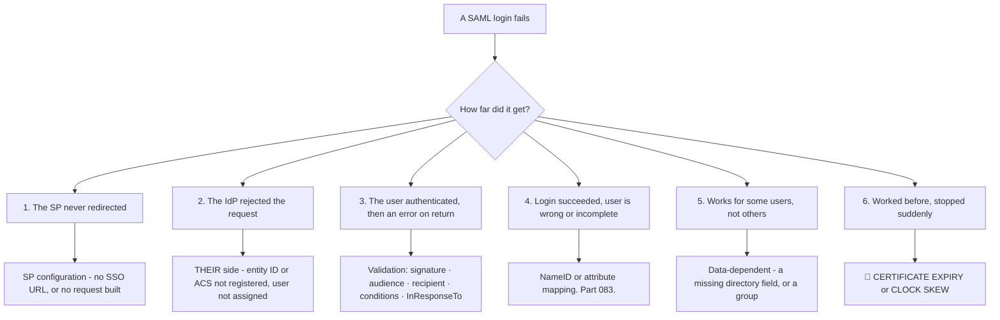
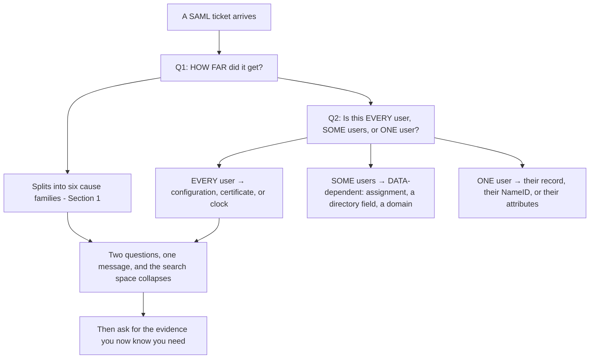
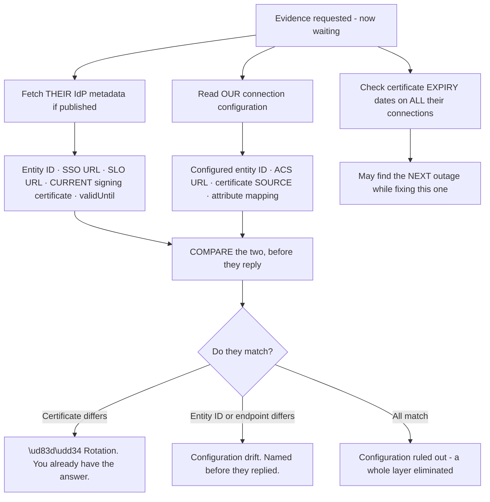
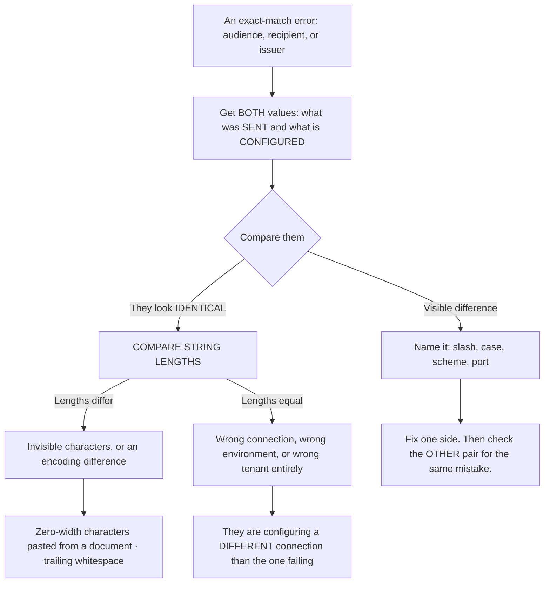
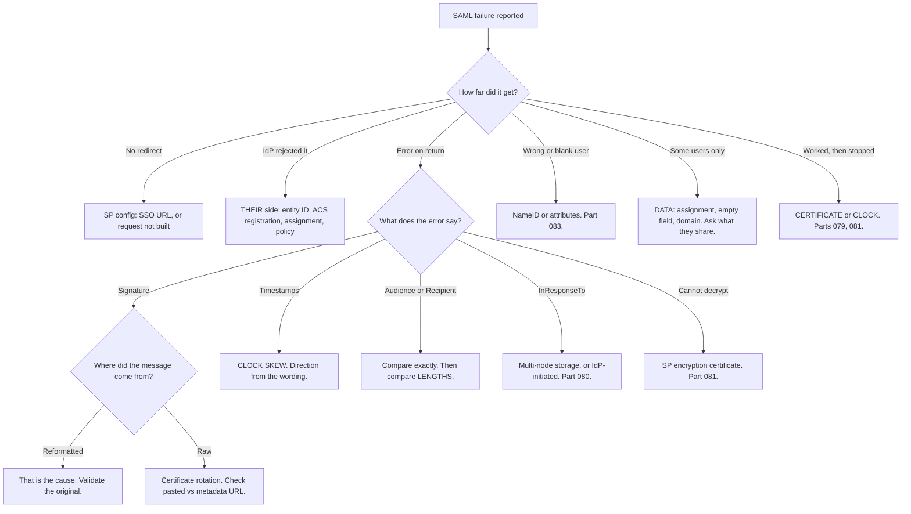

# Part 084 - The SAML Troubleshooting Catalog

> Section goal: Consolidate every SAML failure into a lookup you can use under pressure, with the fastest route to each cause. This is Group H's practical capstone — the SAML equivalent of Part 069.

Covers index item **084**. Maps to JD signals: *knowledge of SAML*, *strong analytical and problem-solving skills*, *experience with troubleshooting web applications*, *communicate technical concepts clearly*, and *exceed expectations on response quality*.

---

## 1. Start From Zero: Locate Before Diagnosing

SAML has fewer error codes than OAuth and far more ambiguity. **The compensating technique is locating the failure point precisely.**

**Six locations, six distinct cause families.** One question — *how far did it get?* — narrows the whole problem, exactly as in Part 069.

> **Analogy.** A parcel that never left, was refused at the depot, was refused at the door, arrived with the wrong contents, arrives only for some addresses, or stopped arriving last Tuesday. Six situations, six different people to talk to.
>
> **Where it stops:** a courier can tell you which. A SAML failure often produces one generic message, which is why the location question has to be asked rather than inferred.

---

## 2. The Catalog

### Location 1 — The SP never redirects

| Symptom | Cause | Fix |
|---|---|---|
| Clicking login does nothing | No IdP SSO URL configured | Configure it from metadata |
| Redirects to the wrong IdP | Home-realm discovery rule (Part 077) | Check the domain routing |
| Error before any redirect | SP-side application error | SP logs |

### Location 2 — The IdP rejects the request

| Symptom | Cause | Owner |
|---|---|---|
| "Unknown issuer" / "Unknown SP" | SP entity ID not registered | **Customer** |
| "ACS URL not registered" | SP's ACS not in the IdP's list | **Customer** |
| "User not assigned" | User has no access to the application | **Customer** |
| "Blocked by policy" | Conditional access (Part 091) | **Customer** |
| Request signature rejected | SP's signing certificate wrong at the IdP | Both |

### Location 3 — Error on return to the SP

| Symptom | Cause | Fastest check |
|---|---|---|
| Signature validation failed | Certificate rotated, or **the message was reformatted** | Where did the validated message come from? (Part 081) |
| "Not yet valid" | 🔴 SP clock **behind** the IdP | Compare both clocks (Part 079) |
| "Expired" | 🔴 SP clock **ahead** of the IdP | Same |
| Audience mismatch | SP entity ID differs between sides | Compare exactly |
| Recipient mismatch | ACS URL differs | Compare exactly |
| "`InResponseTo` unknown" | Stored request ID lost, or unsolicited (Part 080) | Multi-node storage, or IdP-initiated |
| "Assertion already used" | Replay protection firing | A genuine retry, or a double-submit |
| Cannot decrypt | SP encryption certificate rotated | Update it at the IdP (Part 081) |

### Location 4 — Login succeeds, user is wrong

| Symptom | Cause |
|---|---|
| New account every login | 🔴 `transient` NameID (Part 083) |
| New account after a name change | Email-based NameID |
| Blank profile | Attribute name mismatch |
| Only one group applied | Multi-valued attribute mishandled |
| Everyone's profile blanked | Overwrite policy + IdP mapping change |

### Location 5 — Works for some users

| Symptom | Cause |
|---|---|
| A subset cannot log in | Not assigned to the application at the IdP |
| A subset has blank fields | The directory field is **empty for those users** |
| A subset routed to the wrong IdP | Multi-domain organisation (Part 077) |
| Personal-address users excluded | Domain-based routing with no alternative |

### Location 6 — Worked before, stopped

| Symptom | Cause |
|---|---|
| Sudden, total, no changes | 🔴 **Certificate expiry** — pasted certificate (Part 081) |
| Sudden, total, timestamps in the error | 🔴 **Clock skew** crossing a threshold (Part 079) |
| Sudden, metadata-related error | Metadata `validUntil` passed |
| Gradual, then total | Clock drift |

### 🔍 Plain-English deep-dive: the two questions that split most SAML tickets

Two questions, asked in the first reply, resolve or narrow the large majority of SAML tickets — and both cost nothing.

**Question 2 is the one people skip**, and it is the more powerful of the two — because it separates configuration problems from data problems, which have completely different investigation paths.

| Scope | What it means | Where to look |
|---|---|---|
| **Every user** | Something structural — a certificate, a clock, a mapping, an endpoint | Configuration, both sides |
| **Some users** | Something about **those** users — assignment, an empty directory field, a domain | The customer's directory |
| **One user** | Their specific record | That user's assertion and account |

**The "some users" case is the one most often misdiagnosed** as a configuration problem, and it is almost never one. If the connection works for two hundred people and fails for twelve, the connection is fine. **What those twelve have in common is the investigation** — and the customer knows their own user base far better than you do, so asking is faster than deducing.

**The follow-up that finds it:** *"What do the affected users have in common that the working ones don't — a different email domain, a different office, a recent joiner, a different group?"* **Customers frequently answer that immediately**, and the answer is usually the diagnosis.

**Why asking both questions in one message matters:** with two organisations potentially involved and possibly two timezones, each round trip costs a day (Part 077). **Asking both plus the evidence you will need afterwards compresses a week into an exchange.**

**Analogy:** a doctor asking where it hurts and whether it is everywhere or in one place. The second question is the one that separates a systemic condition from a local injury, and it costs nothing to ask. **Where it stops:** a patient can point. A customer has to be asked, and if you do not ask, they will not volunteer it.

---

## 3. The Evidence Set

What to request, in one message.

| Evidence | Why |
|---|---|
| **The exact error text**, and where it appeared | Locates the failure (§1) |
| **A HAR** of one failing attempt | Contains both messages (Part 082) |
| **A timestamp with timezone** | For correlating with both sides' logs (Part 069) |
| **Scope**: every / some / one user | Configuration versus data (§2) |
| **The decoded assertion**, signature removed, values redacted, **names intact** | Attribute and identity diagnosis (Part 083) |
| **Whether anything changed recently** — on either side | Certificate, mapping, or policy |

**And what you can obtain yourself without asking:** the IdP's metadata document, if it is published at a URL. **That gives you their entity ID, endpoints, and current certificate before the customer replies** — the SAML equivalent of fetching a discovery document (Part 057).

### 🔍 Plain-English deep-dive: work the ticket while you wait

The interval between asking for evidence and receiving it is usually the longest part of a SAML ticket — especially when a second organisation is involved. **A surprising amount can be done in that window with nothing from the customer.**

**Four things available with no customer input:**

| Action | Yields |
|---|---|
| Fetch their published metadata | Their **current** certificate, entity ID, and endpoints |
| Read your connection's configuration | What you believe about them |
| **Diff the two** | Rotation and drift, identified before they reply |
| Check every connection's certificate expiry | The **next** outage |

**The diff is the high-value one.** A certificate mismatch between their live metadata and your stored configuration is a complete diagnosis, obtained for free, while the customer is still writing their first reply.

**And when everything matches, that is equally valuable** — you have eliminated the entire configuration layer before the evidence arrives, so when it does you go straight to the message rather than starting from scratch (Part 057's principle, applied to SAML).

**Why this changes the shape of the engagement:** replying with *"I've compared your identity provider's published metadata against our connection configuration — the signing certificate differs, which suggests a rotation"* while they are still gathering a HAR **transforms the customer's experience of the ticket.** It signals momentum, it is genuinely useful, and it frequently means the evidence you asked for is only needed to confirm rather than to diagnose.

**Analogy:** a mechanic pulling the service history and the manufacturer's recall notices while the car is being driven over. By the time it arrives they know what to look at. **Where it stops:** a mechanic still needs the car. Metadata tells you what *should* be happening, not what did — which is why the evidence request still goes out first.

---

## 4. The Fast Checks

Cheap checks that resolve a disproportionate share of tickets.

| Check | Cost | Catches |
|---|---|---|
| **Where did the validated message come from?** | One question | Reformatting (Part 081) |
| **Is the certificate pasted or a metadata URL?** | One look | Rotation outages |
| **Compare both sides' clocks** | Two commands | Skew |
| **Count characters** on entity IDs and URLs | Seconds | Invisible characters (Part 048) |
| **Is `InResponseTo` present?** | One decode | Which flow (Part 080) |
| **Compare attribute names** in a working and a failing assertion | One comparison | Mapping and data problems |
| **Check the certificate's expiry date** | One command | The next outage, before it happens |

**That last row is proactive rather than diagnostic**, and it is worth doing on every SAML ticket regardless of the reported problem. **Finding a certificate expiring in three weeks while fixing something else is the kind of thing customers remember.**

### 🔍 Plain-English deep-dive: exact-match failures and the length trick

A whole family of SAML failures comes down to two strings that must match exactly and do not — entity IDs, ACS URLs, audiences, recipients. **They share a diagnosis technique and a specific trap.**

| Value | Must match | Common difference |
|---|---|---|
| SP entity ID | Registered at the IdP, and the `Audience` in the assertion | Trailing slash |
| ACS URL | Registered at the IdP, and the `Recipient` | Path case, port, scheme |
| IdP entity ID | Configured at the SP, and the `Issuer` | Trailing slash |
| SSO URL | Configured at the SP | Path change after a platform update |

**The length comparison is the technique worth internalising** (Part 048). Two strings that look identical and differ in length contain something invisible — a zero-width character pasted from a formatted document, trailing whitespace, or a percent-encoded segment. **No amount of visual comparison finds it; a character count finds it instantly.**

**The equal-length branch is the one that confuses people most.** If both values are byte-identical and it still fails, the customer is almost certainly looking at a **different connection** than the one producing the error — a staging tenant, a second application, an old configuration that was never deleted. **Asking which specific connection or application the failing login uses settles it**, and it is worth asking early because it feels too obvious to check.

**And the follow-through in the bottom node matters:** SAML has several pairs of values that must match, and a team that got one wrong by transcription usually got another wrong the same way. **Having fixed the audience, check the recipient and the issuer too**, rather than waiting for the next ticket.

**The reason this family is so persistent:** these values are exchanged between two organisations by email or by retyping into a form (Part 081). **They are transcription errors wearing protocol costumes**, and treating them as such — comparing strings rather than reasoning about configuration — is what makes them quick.

**Analogy:** two addresses that must match for a delivery, transcribed separately by two people. Reading them aloud finds most differences; counting the characters finds the rest. **Where it stops:** a person reading aloud would skip a zero-width character entirely, which is precisely why the count is the backstop.

---

## 5. Failure Modes in the Process Itself

| Failure mode | What it looks like | Consequence | Correction |
|---|---|---|---|
| **Not locating the failure** | Debugging everything | Wasted effort | Ask "how far did it get?" |
| **Not asking about scope** | Configuration assumed | Days on the wrong path | Every / some / one |
| **Treating "some users" as configuration** | Endless config changes | It is a data problem | Ask what they have in common |
| **Sequential evidence requests** | A week of round trips | Slow, across timezones | One message |
| **Not fetching their metadata yourself** | Waiting for values | Slower start | It is often public |
| **Assuming the customer's team is wrong** | Friction | Two-org standoff | They are usually right (Part 081) |
| **Diagnosing without the raw message** | Guesswork | Reformatting missed | Ask where it came from |
| **Not checking certificate expiry** | Fix this, miss the next | Recurring outages | Check every time |
| **Under-scoping severity** | A customer-wide outage as a normal ticket | Escalation | Blast radius (Part 077) |
| **No update cadence** | Silence in a two-org incident | Escalation | State a schedule |

---

## 6. Troubleshooting Decision Tree: The Master SAML Tree

### Worked example

*"SAML login is broken for one of our customers. That's all we know."*

1. **Ask both questions in the first reply**, plus the evidence set from §3 — one message, not three.
2. **Meanwhile, fetch their IdP metadata yourself** if it is published. **Record the entity ID, SSO URL, and current signing certificate**, and note the certificate's expiry.
3. **Their answers:** it fails after the user authenticates, on return; it affects **every** user at that customer; the error mentions signature validation.
4. **"Every user" plus "worked before" points at certificate or clock.** The signature error narrows it to the certificate.
5. **Compare** the certificate in the connection against the one you already fetched from their metadata. **They differ.**
6. **Check how the connection was configured.** Pasted certificate — so it did not follow their rotation (Part 081).
7. **Restore service** by updating the certificate. Then move the connection to their metadata URL.
8. **Say clearly that their team is right that nothing changed** — their platform rotated automatically, which is correct behaviour (Part 081).
9. **Then the two things worth more than the fix:** audit other connections for pasted certificates, and check every configured certificate's expiry — **you already have a script for this** (Part 081).
10. **Write it up** with the timeline, the cause, the fix, the prevention, and the audit result (Part 115).

---

## 7. Lab: Build the Catalog

**Purpose.** Produce every SAML failure deliberately, record its exact presentation, and build the lookup and evidence template you would use under pressure.

**Prerequisites.** All Group H artifacts. A working SAML connection you can break freely.

**Steps.**

1. Create `okta-prep/labs/084-saml-catalog/`.
2. **Reproduce every failure in §2**, location by location. For each, record: what the user saw, what the SP logged, what the IdP logged, and where the failure occurred.
3. **Location 1.** Remove the SSO URL. Record.
4. **Location 2.** Unregister the SP entity ID, then the ACS URL, then unassign the user. **Record all three separately** — they are distinguishable and often confused.
5. **Location 3 — the full set.** Break the signature two ways (rotated certificate, and reformatting), both clock directions, audience, recipient, `InResponseTo`, and decryption. **Eight distinct errors.**
6. **Location 4.** Reproduce `transient` NameID, an attribute name mismatch, and a multi-valued mishandling (Part 083).
7. **Location 5.** Create a user with an empty directory field and confirm a partial failure. **This is the "some users" case, produced deliberately.**
8. **Location 6.** Let a certificate expire, or set one in the past. Record the presentation.
9. **Build the catalog.** `saml-error-catalog.md` — for each error: exact text, location, likely causes ranked, the distinguishing question, the fix, and who owns it.
10. **Blind test it.** Have someone break the connection without telling you how. **Resolve it using only the catalog.** Record the time.
11. **Build the evidence request template.** `saml-evidence-request.md` — the two questions plus the §3 evidence set, in one message, with instructions for each item.
12. **Build the fast-check script.** Combine your Part 081 certificate checker and Part 082 decoder into one command that takes a connection and reports: certificate source, expiry and days remaining, metadata `validUntil`, and configured entity ID and ACS URL.
13. **Ownership table.** For every catalog entry, mark whether the fix is yours, the customer's, or both. **Count how many are theirs** — the proportion is the point (Part 077).
14. **Practise the master tree.** Take five failures from your catalog and walk the §6 tree for each. **Time yourself.**
15. **Write the guidance.** `saml-troubleshooting.md` — one page: the two questions, the six locations, the fast checks, and the evidence template.
16. **Failure catalog + manifest.** Complete `MANIFEST.md`, consolidating every SAML error recorded across Group H.

**Expected evidence.** Every failure in §2 reproduced with its full presentation, a complete error catalog with ownership, a timed blind test, an evidence request template, a combined fast-check script, an ownership count, five timed tree walks, and one-page guidance.

**Validation rubric.**

| Check | Pass condition |
|---|---|
| All six locations | Every listed failure reproduced |
| Location 2 | Three causes recorded separately and distinguishably |
| Location 3 | All eight errors, including both signature causes |
| "Some users" | Produced deliberately via an empty field |
| Catalog | Every entry with cause, question, fix, and owner |
| Blind test | Resolved using only the catalog; time recorded |
| Fast-check script | Reports all four items |
| Ownership count | Proportion on the customer side recorded |

**Cleanup and privacy.** Lab tenants and synthetic users. **Restore every deliberately broken setting** after recording. Assertions contain personal data — redact before saving (Part 082). Delete connections and users at the end.

---

## 8. JD Mapping

| Supplied JD signal | How this Part supports it |
|---|---|
| **Knowledge of SAML** | Every failure mode consolidated |
| **Strong analytical and problem-solving skills** | Two questions that collapse the search space |
| **Experience troubleshooting web applications** | Evidence collection and HAR-based diagnosis |
| **Communicate technical concepts clearly** | Distinguishing configuration from data problems |
| **Exceed expectations on response quality** | Checking certificate expiry on every ticket regardless of the issue |
| Collaborate across teams | Ownership marking; the customer's team is usually right |
| Ownership from start to resolution | Severity by blast radius; stated update cadence |

---

## 9. Candidate Honesty Note

- **Claim safety:** *Learned architecture and lab experience*, with genuine transfer — systematic troubleshooting and evidence discipline are existing production skills.
- **The strongest thing you can say:** *"SAML has fewer error codes than OAuth and far more ambiguity, so the compensating technique is locating the failure precisely. Two questions in the first reply do most of the work: how far did it get, and is it every user, some users, or one user."*
- **A second point, and the second question is the underused one:** *"'Some users' almost never means a configuration problem. If a connection works for two hundred people and fails for twelve, the connection is fine — what those twelve have in common is the investigation. And the customer knows their user base far better than I do, so asking 'what do the affected users share that the working ones don't?' usually gets the diagnosis in one message."*
- **A third, on the highest-value fast check:** *"Before investigating a signature failure I'd ask where the validated message came from. XML signatures cover a canonicalised form, so a pretty-printed copy fails validation and the certificate was never involved. That one question saves hours regularly."*
- **A fourth, on the proactive habit:** *"I'd check every configured certificate's expiry on every SAML ticket, regardless of what was reported. Finding one expiring in three weeks while fixing something unrelated prevents the next outage, and those dates are knowable months ahead — an outage that could have been prevented by reading a date is a poor outcome."*
- **A fifth, on process rather than protocol:** *"Most SAML causes sit on the customer's side, so severity should follow blast radius and there should be a stated update cadence. A customer-wide outage involving two organisations escalates because of silence far more often than because of speed."*
- **A sixth, on efficiency:** *"I'd ask both questions and the full evidence set in one message, and fetch their metadata myself while waiting. With two organisations and possibly two timezones, each round trip costs a day."*
- **Do not overstate:** you have not handled production SAML tickets. Say the catalog was built by breaking a connection deliberately, and the troubleshooting method transfers from existing work.

---

## 10. Official Source Anchors

Accessed **26 August 2026**.

| Source | What it defines |
|---|---|
| OASIS SAML 2.0 Core §3.2.2 | Status codes and their meanings |
| OASIS SAML 2.0 Profiles §4.1.4 | Response processing rules — what SPs must reject |
| OASIS SAML 2.0 Security and Privacy Considerations | Validation requirements underlying most errors |
| OASIS SAML 2.0 Metadata | Certificates and `validUntil` (Part 081) |
| W3C XML Signature | Canonicalisation — the reformatting cause |
| Auth0 and Okta documentation — SAML error codes and tenant logs | Vendor errors and log correlation (Part 107) |
| Microsoft Entra ID documentation — SAML sign-in errors | The most common IdP's error catalog |

**Revalidate after 26 August 2026:** SAML is stable. Recheck vendor error catalogs and log event codes.

---

## ⭐ Likely Interview Questions for This Section

### Q1. "How do you approach a SAML failure with no detail?"
> *Model answer:* "Two questions in the first reply, plus the evidence I know I'll need. How far did it get — did the SP never redirect, did the IdP reject the request, was there an error on return, did login succeed with a wrong user, does it affect some users only, or did it work before and stop? That splits into six distinct cause families. And second: is it every user, some users, or one user, because that separates configuration problems from data problems entirely. Then I'd ask for the exact error and where it appeared, a HAR, a timestamp with timezone, and whether anything changed recently on either side. Meanwhile I'd fetch their IdP metadata myself if it's published, which gives me their entity ID, endpoints and current certificate before they reply."

### Q2. "Why does 'some users' matter so much?"
> *Model answer:* "Because it almost never means a configuration problem, and treating it as one leads to days of changes on the wrong thing. If a connection works for two hundred people and fails for twelve, the connection is correct — what those twelve have in common is the investigation. The usual causes are: they're not assigned to the application at the identity provider, a directory field is empty for them specifically, or they're on a different email domain that a home-realm routing rule doesn't cover. The follow-up question that finds it is 'what do the affected users have in common that the working ones don't — a different domain, a different office, recent joiners, a different group?' Customers usually answer that immediately, because they know their own user base far better than I do."

### Q3. "Which SAML failures are most common?"
> *Model answer:* "Certificate expiry by a wide margin — a pasted signing certificate rather than a metadata URL, so an IdP rotation breaks it overnight with no warning. Then attribute name mismatches, which produce blank profiles while login still succeeds, so they fail silently and are discovered as bad data weeks later. Then clock skew, because SAML's validity window is two to five minutes rather than an hour, so drift causes total failure rather than occasional problems. And then a family of exact-match failures — entity ID, ACS URL, audience — where two values look identical and differ by a trailing slash or an invisible character. Those four account for most of what I'd expect to see."

### Q4. "A signature is failing. What's your first question?"
> *Model answer:* "Where the message being validated came from — the raw HTTP body, or something copied out of a viewer or run through a formatter. XML signatures cover a canonicalised form, so pretty-printing a response to read it and then validating the formatted version fails, and the certificate was never involved. That one question saves hours regularly, and it's the cheapest possible check. If it genuinely came from the raw body, then the next question is whether it worked before: 'worked, then stopped' points at certificate rotation against a pasted certificate, and 'never worked' points at the wrong certificate or an algorithm mismatch. Three questions, and the signature failure is located."

### Q5. "What checks would you run on every SAML ticket regardless of the reported problem?"
> *Model answer:* "Certificate expiry, first — read every configured certificate and note the days remaining, because those dates are knowable months ahead and an outage that could have been prevented by reading a date is a poor outcome. Whether certificates are pasted or fetched from a metadata URL, because a pasted one is a scheduled outage. And metadata `validUntil`, which can expire and cause a failure with no certificate involved at all. All three take seconds with a script, and finding a certificate expiring in three weeks while fixing something unrelated is the kind of thing customers remember — it turns a reactive ticket into a prevented incident."

### Q6. "How do you decide severity on a SAML ticket?"
> *Model answer:* "By blast radius, which the scope question tells me directly. Every user at a customer is a customer-wide outage — potentially their entire workforce locked out of an application — and it involves a second organisation who may need to act, so it can't be reproduced or fixed unilaterally. That deserves higher severity and a stated update cadence, because these escalate through silence far more often than through slow technical progress. Some users is serious but bounded. One user is a normal ticket. I'd also be explicit about the cadence rather than just intending to update — even 'no change yet, still waiting on their identity team' at a stated interval prevents an escalation that a faster technical answer wouldn't have."

### Q7. "Most SAML causes are on the customer's side. What does that change?"
> *Model answer:* "It changes what a good response is. My deliverable is often an evidence pack rather than a fix — a timestamp with timezone so they can search their logs, the exact error, what we sent, what we received decoded with the signature stripped and values redacted, the specific missing value named rather than the category, and one or two things for them to check. And I'd say which side I believe owns it and why, with the evidence attached, because a clear evidenced hypothesis gets acted on where a neutral summary gets a round trip. I'd also be careful not to assume their team is wrong when they say nothing changed — usually they're right, and their platform rotated a certificate automatically, which is correct behaviour."

### Q8. "What would your SAML error catalog contain?"
> *Model answer:* "For each error: the exact text as it appears, which of the six locations it occurs at, the likely causes ranked, the distinguishing question that separates them, the fix, and — importantly — who owns it, us or the customer. That last column is what makes it useful under pressure, because it tells me immediately whether I'm fixing something or writing an evidence pack. I'd build it by deliberately breaking a connection every way it can break and recording the actual presentation, rather than from documentation, because what the user sees and what the logs say are often quite different from the specification's language. And I'd blind-test it — have someone break the connection without telling me how, and resolve it using only the catalog."

---

## 🧠 30-Second Memory Hooks

- **Two questions, first reply:** **how far did it get?** · **every / some / one user?**
- **Six locations:** no redirect · IdP rejected · error on return · wrong user · **some users** · **worked then stopped**.
- **"SOME users" is a DATA problem, not configuration.** Ask what they share.
- **"Worked then stopped" = CERTIFICATE or CLOCK.**
- **Signature failing? Ask WHERE THE MESSAGE CAME FROM first.** Reformatting.
- **Timestamp errors give DIRECTION:** "not yet valid" = SP behind · "expired" = SP ahead.
- **Compare exact strings, then compare LENGTHS.** Invisible characters.
- **Fetch their METADATA yourself** — often public, and it has their current certificate.
- **Check certificate EXPIRY on every ticket**, whatever was reported.
- **Most causes are on the CUSTOMER's side.** Deliverable = an evidence pack.
- **Severity by BLAST RADIUS. State an update CADENCE.**
- **Ask everything in ONE message.** Two orgs, two timezones, a day per round trip.

---

## ✅ Completion Checklist

- [ ] **Knowledge:** I can name the six locations, the two opening questions, and the fast checks unaided.
- [ ] **Lab artifact:** `084-saml-catalog/` contains every failure reproduced with its full presentation, a catalog with ownership marked, a timed blind test, an evidence template, and a combined fast-check script.
- [ ] **Spoken:** I can open a SAML ticket in 30 seconds and explain the "some users" distinction in 45.
- [ ] **Judgement:** I check certificate expiry regardless of the reported issue, and I set severity by blast radius.
- [ ] **Honesty check:** I claim troubleshooting method as existing skill and the SAML catalog as lab-built.
- [ ] **Source check:** I have read SAML 2.0 Core §3.2.2 and Profiles §4.1.4 myself.

---

*Next suggested section:* **[Part 085 - WS-Federation, WS-Trust, and SAML Single Logout](Part-085-ws-federation-ws-trust-and-saml-single-logout.md)** — the older Microsoft-centric protocols you will still meet in enterprise estates, plus SAML's logout profile.
