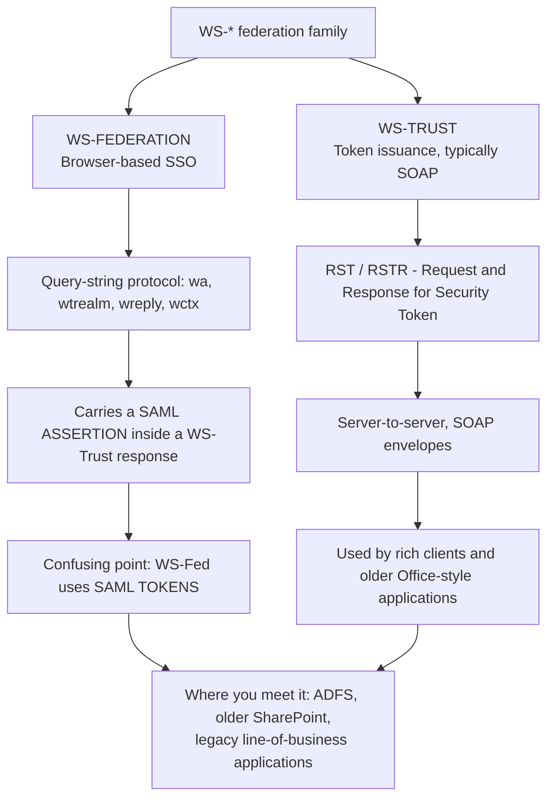
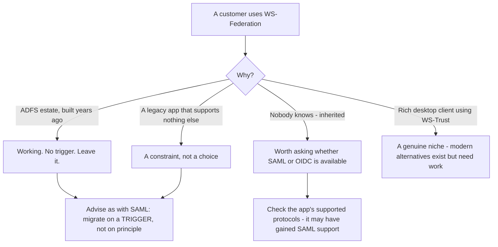
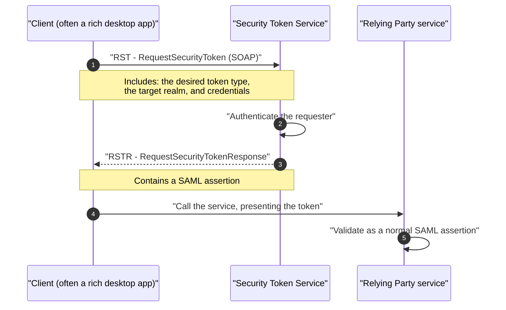
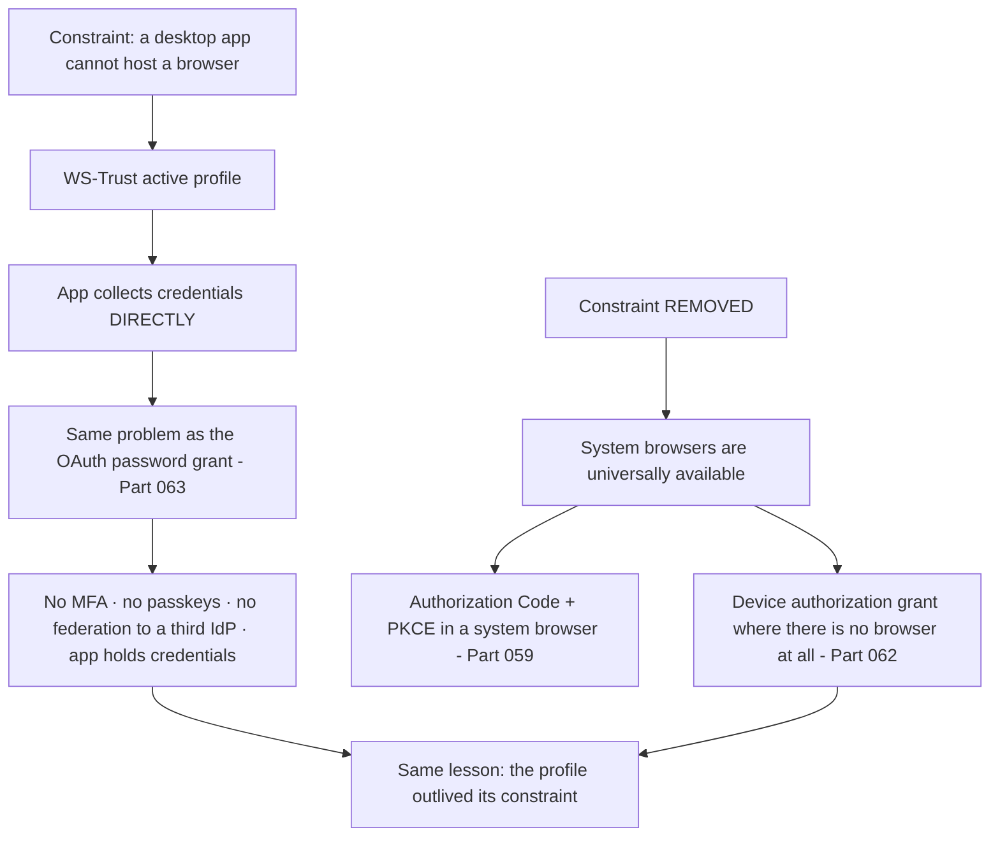
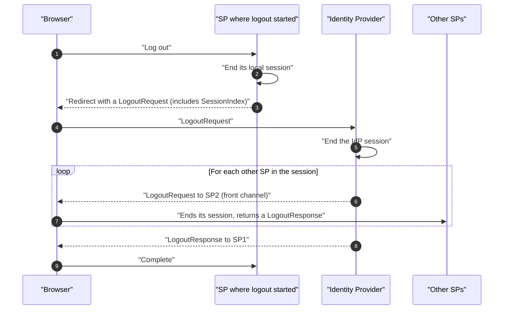
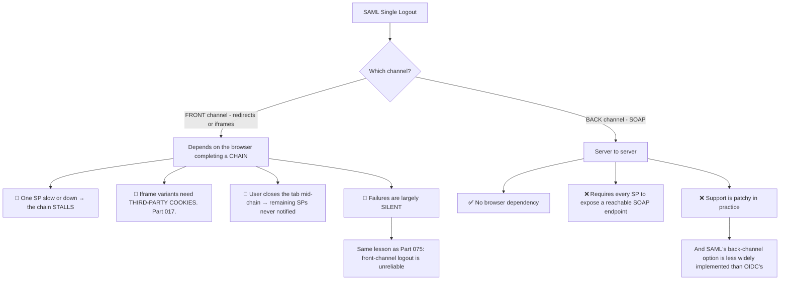
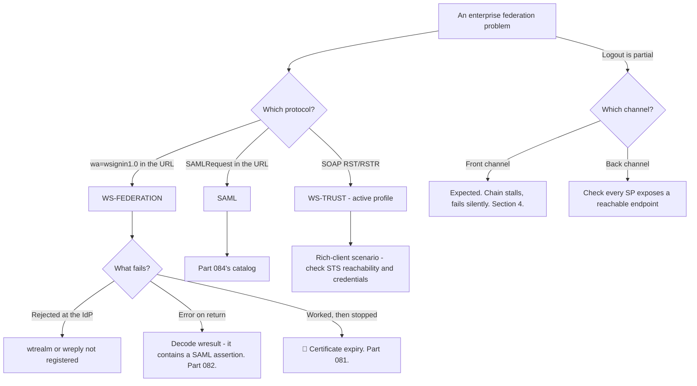

# Part 085 - WS-Federation, WS-Trust, and SAML Single Logout

> Section goal: Cover the remaining enterprise federation surface — the older Microsoft-centric protocols you will still meet in real estates, and SAML's logout profile. These are lower-volume than SAML SSO and distinctive enough that recognising them quickly is valuable.

Covers index item **085**. Maps to JD signals: *knowledge of SAML*, *knowledge of authentication and authorization*, *strong analytical and problem-solving skills*, *communicate technical concepts clearly*, and *experience with troubleshooting web applications*.

---

## 1. Start From Zero: The WS-* Family

Before SAML web SSO became dominant, Microsoft-centric estates federated with **WS-Federation** and **WS-Trust**.



| | WS-Federation | SAML 2.0 Web SSO |
|---|---|---|
| Era | 2003 onward | 2005 onward |
| Transport | Query string, then form POST | Redirect and form POST |
| Message format | WS-Fed parameters wrapping a token | SAML protocol messages |
| Token inside | **Often a SAML assertion** | A SAML assertion |
| Metadata | WS-Fed metadata, or shared with SAML | SAML metadata |
| Where you meet it | ADFS estates, legacy Microsoft stacks | Everywhere |

**The single most confusing fact:** WS-Federation typically **carries a SAML assertion**. So "we use SAML" and "we use WS-Fed" can both be true of the same integration — the *token* is SAML, the *protocol wrapping it* is WS-Fed.

> **Analogy.** The same document sent by two different courier services with different paperwork. The contents are identical; the labels, tracking, and handover process differ.
>
> **Where it stops:** you would notice which courier arrived. WS-Fed and SAML both end in a form POST carrying a token, so telling them apart requires looking at the parameter names.

---

## 2. Recognising WS-Federation

**The parameter names are the tell.**

```
GET https://idp.example.com/adfs/ls/
  ?wa=wsignin1.0
  &wtrealm=https%3A%2F%2Fapp.example.com
  &wreply=https%3A%2F%2Fapp.example.com%2Fsignin
  &wctx=rm%3D0%26id%3Dpassive%26ru%3D%252Freports
```

| Parameter | Meaning | SAML equivalent |
|---|---|---|
| **`wa`** | The action — `wsignin1.0` or `wsignout1.0` | The message type |
| **`wtrealm`** | The relying party identifier | SP entity ID |
| **`wreply`** | Where to return | ACS URL |
| **`wctx`** | Opaque context, round-tripped | `RelayState` |
| `wct` | Timestamp | — |
| `wfresh` | Freshness requirement | `ForceAuthn` / `max_age` |
| `whr` | Home realm hint | Home-realm discovery (Part 077) |

| Signal | Protocol |
|---|---|
| `wa=wsignin1.0` in a URL | **WS-Federation** |
| `SAMLRequest=` in a URL | SAML |
| A form POST with `wresult` | WS-Federation |
| A form POST with `SAMLResponse` | SAML |

### 🔍 Plain-English deep-dive: why WS-Fed still exists, and what that means for support

WS-Federation is not being actively developed and it is still deployed. **Understanding why prevents both dismissing it and over-recommending migration** (Part 078's lesson, in a narrower case).

| Reason it persists | Detail |
|---|---|
| **ADFS estates** | Active Directory Federation Services supports it natively and many deployments were built on it |
| **Legacy applications** | Older SharePoint and line-of-business applications support WS-Fed and not SAML or OIDC |
| **It works** | A functioning federation has no forcing function to change (Part 078) |
| **Rich-client scenarios** | WS-Trust served desktop applications that could not use browser redirects |
| **Migration is a two-org project** | The same coordination cost as any federation change |



**The support-relevant consequences:**

**1. You will meet it in enterprise tickets** even if your product's primary path is OIDC — because the customer's *identity provider* may be ADFS, and their internal applications may be WS-Fed.

**2. Recognising it quickly matters more than knowing it deeply.** Seeing `wa=wsignin1.0` and immediately thinking *"WS-Federation, and the token inside is probably a SAML assertion"* is most of the value. **The token is then decoded and validated exactly as in Part 082.**

**3. The failure modes are the same family.** Certificate expiry, clock skew, realm mismatch, and attribute mapping — the same causes as SAML (Part 084), with different parameter names. **The catalog transfers.**

**4. The migration conversation is Part 078's**, unchanged: migrate on a trigger, not on principle, and diagnose the actual recurring problem first — which will usually be a certificate.

**The one genuinely different thing** is WS-Trust for rich clients. Desktop applications that obtained tokens over SOAP without a browser have modern equivalents — the device authorization grant (Part 062) or a system browser (Part 059) — but moving them is application work rather than configuration. **That is a real migration cost worth naming honestly.**

**Analogy:** an older telephone exchange still serving part of a building. It works, replacing it means rewiring, and the sensible time to do it is when the floor is being refurbished anyway. **Where it stops:** an exchange visibly ages. A working federation looks identical to a modern one from the outside, which is why "if it works, leave it" needs stating explicitly.

---

## 3. WS-Trust

Token issuance, typically server-to-server over SOAP.



| Term | Meaning |
|---|---|
| **STS** | Security Token Service — the issuer |
| **RST** | RequestSecurityToken — the request |
| **RSTR** | RequestSecurityTokenResponse — carries the token |
| **Realm** | The target relying party |
| Active profile | Client obtains the token directly, no browser |
| Passive profile | Browser-based — this is WS-Federation |

**"Active" and "passive" are the vocabulary to recognise.** Passive means browser redirects — WS-Federation. Active means a client obtaining a token directly — WS-Trust. **A customer saying "active federation" is describing WS-Trust**, and that is a useful translation.

### 🔍 Plain-English deep-dive: why rich clients needed their own protocol, and what replaced it

WS-Trust's active profile exists because of a constraint that no longer holds — the same pattern as the deprecated OAuth grants (Part 056).

**The constraint:** desktop applications in the early 2000s could not reasonably host a browser. Embedding one was heavy, inconsistent, and often unavailable. So a protocol was needed where the application collected credentials itself and exchanged them for a token, server to server.



**The parallel with the resource owner password grant is exact**, and it is worth drawing because it makes the recommendation coherent rather than arbitrary: an application that collects the user's credentials directly cannot support MFA, cannot support passkeys, cannot redirect to a third-party identity provider, and becomes a credential holder (Part 063). **WS-Trust's active profile has the same ceiling for the same reason.**

**What replaced it:**

| Modern approach | Suits |
|---|---|
| **Authorization Code + PKCE in a system browser** | Desktop and mobile applications — the standard answer |
| **Device authorization grant** | Genuinely browser-less devices (Part 062) |
| **Client credentials** | Where there is no user at all (Part 060) |

**The honest cost of migrating**, which distinguishes this from a configuration change: moving a rich client off WS-Trust means **changing the application** — launching a system browser, handling a redirect back, storing tokens securely. That is development work with a release cycle, not a tenant setting.

**So the advice is Part 078's, applied narrowly:** migrate on a trigger. A working WS-Trust integration for an internal desktop tool is not urgent. **A requirement for MFA is a trigger**, because it is simply not achievable in that profile — and framing it as a blocked requirement rather than as modernisation is what makes the case land.

**The support-facing recognition:** a customer describing an application that "asks for the username and password itself and then calls the service" is describing an active-profile integration, whatever they call it. **The capability ceiling is the useful thing to name**, because it is concrete and it will force the conversation eventually anyway.

**Analogy:** a machine designed for a workshop that had no mains power. It still runs, and everything built since assumes a socket on the wall. **Where it stops:** you would notice the generator. A working federation integration gives no sign that it rests on an assumption that expired.

---

## 4. SAML Single Logout

SAML's logout profile, and the counterpart to Part 075's OIDC logout family.



| Element | Purpose |
|---|---|
| **`LogoutRequest`** | Asks a party to end a session |
| **`LogoutResponse`** | Confirms, or reports a failure |
| **`SessionIndex`** | **Which** session — from the original assertion (Part 079) |
| `NameID` | Which user |
| Front-channel SLO | Via browser redirects or iframes |
| Back-channel SLO | SOAP, server to server |

### 🔍 Plain-English deep-dive: SAML SLO is fragile, and for familiar reasons

Single Logout is the least reliable part of SAML, and the reasons map almost exactly onto Part 075's front-channel logout problems.



**The chain is the structural weakness.** Front-channel SLO logs the user out of each service provider **in sequence**, through their browser. If one is slow, unreachable, or returns an error, the chain can stall — and everything after it never receives a logout. **The user believes they logged out everywhere; some sessions remain.**

**And it fails silently**, exactly as OIDC front-channel logout does (Part 075). The browser completes the visible steps, the user is returned to a landing page, and nothing reports that three of five service providers were never reached.

**The honest position to give a customer:**

| Expectation | Reality |
|---|---|
| "Logout ends every session everywhere" | ⚠️ Best-effort, and frequently partial |
| "We'll know if it fails" | ❌ Usually not |
| "Back-channel fixes it" | ✅ In principle — **if every SP implements it**, which many do not |
| "It works in testing" | ⚠️ Testing has two SPs, both fast and healthy |

**What to advise, in order:**

1. **Do not rely on SLO for security-critical logout.** If a session must genuinely end — a shared computer, a suspected compromise — **shorter session lifetimes are more dependable than a logout chain** (Part 045).
2. **Use back-channel where every participant supports it.** Confirm support rather than assuming.
3. **Set expectations explicitly with users.** A message saying "you have been signed out of this application" is honest; "you have been signed out everywhere" frequently is not.
4. **Test with a realistic number of service providers**, including one deliberately slow, because that is the failure mode that testing never sees.

**Why this matters beyond SAML:** it is the same conclusion as Part 075 reached for OIDC — **browser-mediated multi-party logout is unreliable, and the durable answer is server-to-server notification plus short sessions.** Recognising the pattern across both protocols is worth more than either detail.

**Analogy:** asking one departing guest to tell the next, who tells the next. It works when everyone is present and cooperative, and one person leaving early ends the chain silently. **Where it stops:** a host would notice people still in the building. Nothing observes a partially completed logout chain.

---

## 5. Failure Modes

| Failure mode | What it looks like | Consequence | Correction |
|---|---|---|---|
| **Not recognising WS-Fed** | Debugging as SAML | Wasted time | `wa=wsignin1.0` is the tell |
| **Assuming WS-Fed means no SAML** | Confusion | The token inside **is** SAML | Decode it normally |
| **`wtrealm` mismatch** | Rejected at the IdP | Same as an entity ID mismatch | Exact match |
| **`wreply` not registered** | Rejected | Same as an ACS mismatch | Register exactly |
| **Certificate expiry** | Worked, then stopped | 🔴 Same as SAML | Metadata; monitor expiry |
| **Relying on front-channel SLO** | Appears to work | 🔴 Partial, silent failure | Short sessions; back-channel |
| **SLO chain stalls** | Some SPs never notified | Sessions remain | Do not depend on the chain |
| **Telling users "signed out everywhere"** | Inaccurate | Misplaced confidence | Honest messaging |
| **`SessionIndex` ignored** | Logout affects all sessions | Unexpected device sign-outs | Use it deliberately (Part 075) |
| **Testing SLO with two fast SPs** | Passes | Fails in production | Test with a slow participant |
| **Migrating WS-Trust without scoping** | "It's just federation" | Application work, not configuration | Name the cost |

---

## 6. Troubleshooting Decision Tree



### Worked example

*"A customer says SSO is broken for one of their internal applications. Their identity team mentioned ADFS."*

1. **ADFS means WS-Federation is plausible**, though ADFS also supports SAML and OIDC. **Do not assume.**
2. **Get the authorization URL** from a HAR. **Look at the parameter names.** `wa=wsignin1.0` and `wtrealm` confirm WS-Federation.
3. **Say so early**, because it changes what evidence to ask for: the token arrives as `wresult` in a form POST, not `SAMLResponse`.
4. **Decode `wresult`.** It contains a SAML assertion inside a WS-Trust response wrapper — **so Part 082's decoding and Part 084's catalog both apply directly.**
5. **The error mentions signature validation, and it worked until last week.** That is the same shape as every SAML certificate ticket (Part 081).
6. **Confirm:** the relying party's configured signing certificate differs from ADFS's current one. ADFS rotates its token-signing certificate automatically by default.
7. **Fix now**, then move to the ADFS metadata URL so future rollovers are picked up.
8. **Note the ADFS-specific detail** worth knowing: ADFS auto-rollover generates a new certificate ahead of expiry and switches at a scheduled point, so **the failure date is predictable in advance** if anyone reads the configuration.
9. **Widen it.** Other relying parties on the same ADFS instance will roll over at the same time. **That is a genuinely valuable warning to give**, because it converts one ticket into a prevented set.

---

## 7. Lab: Recognise and Decode

**Purpose.** Identify WS-Federation from evidence, decode its token, and test SAML Single Logout honestly.

**Prerequisites.** Parts 079–084 artifacts. Access to a WS-Federation-capable IdP if possible; otherwise work from captured samples and focus on recognition.

**Steps.**

1. Create `okta-prep/labs/085-wsfed-slo/`.
2. **Build the recognition table.** From §2, write the parameter-name signals for WS-Fed versus SAML in both directions — request and response. **Memorise it.**
3. **If you have a WS-Fed IdP:** complete a sign-in and **capture a HAR**. Identify `wa`, `wtrealm`, `wreply`, and `wctx`.
4. **Decode `wresult`.** Extract the SAML assertion from inside the WS-Trust response wrapper. **Confirm it decodes with your Part 082 tool.**
5. **Map the parameters.** For each WS-Fed parameter, write its SAML equivalent. **This mapping is the whole recognition skill.**
6. **Break `wtrealm`.** Change it and record the error. **Compare it to a SAML audience mismatch** — note how similar the causes are.
7. **Break `wreply`.** Record the error and compare to an ACS mismatch.
8. **If you cannot access WS-Fed:** obtain published sample messages and practise recognition and decoding from those. **Recognition is the transferable skill; decoding is Part 082's tool.**
9. **SAML Single Logout — configure it.** Set up SLO across **three** service providers.
10. **Test the happy path.** Log into all three, log out of one, and **confirm all three sessions end.**
11. **Break the chain.** Make one service provider slow — add an artificial delay — or take it offline. **Log out and record what happens to the SPs after it in the chain.**
12. **Confirm the silent failure.** Record whether the user or the IdP receives any indication that some sessions remain. **Screenshot the apparent success.**
13. **Close the tab mid-chain.** Log out, close the browser tab before the chain completes, and **check which sessions survived.**
14. **Back-channel contrast.** If any participant supports SOAP back-channel SLO, configure it and repeat step 11. **Record the difference.**
15. **`SessionIndex` behaviour.** Log the same user in on two browsers. Log out of one and **record whether the other survives** — then check whether `SessionIndex` was used.
16. **Write the honest position.** `slo-expectations.md` — half a page a customer could read: what SLO does, what it does not guarantee, and what to do when logout genuinely must be reliable.
17. **Failure catalog + manifest.** Complete `MANIFEST.md`.

**Expected evidence.** A recognition table, a WS-Fed flow captured and its token decoded (or sample-based recognition practice), a parameter mapping, two WS-Fed failures compared to their SAML equivalents, SLO working across three SPs, a stalled chain with the silent failure documented, a mid-chain abandonment test, a back-channel contrast where possible, `SessionIndex` behaviour, and an honest customer-facing position.

**Validation rubric.**

| Check | Pass condition |
|---|---|
| Recognition table | Both directions, both protocols |
| `wresult` decoded | SAML assertion extracted with existing tooling |
| Parameter mapping | Every WS-Fed parameter mapped |
| Two failures | Compared to SAML equivalents |
| SLO happy path | Three SPs, all sessions ended |
| Stalled chain | Reproduced; silent failure documented |
| Mid-chain abandonment | Surviving sessions recorded |
| `SessionIndex` | Behaviour determined |
| Customer position | Honest, half a page |

**Cleanup and privacy.** Lab tenants and synthetic users. Assertions inside `wresult` contain personal data — redact before saving (Part 082). Remove artificial delays and restore all SPs. Delete connections at the end.

---

## 8. JD Mapping

| Supplied JD signal | How this Part supports it |
|---|---|
| **Knowledge of SAML** | Single Logout, and SAML tokens inside WS-Fed |
| Knowledge of authentication and authorization | Active versus passive federation |
| **Strong analytical and problem-solving skills** | Protocol recognition from parameter names |
| **Communicate technical concepts clearly** | An honest position on what SLO guarantees |
| Experience troubleshooting web applications | Chain failures and silent partial logout |
| Promote best practices | Short sessions over logout chains for security-critical cases |
| Exceed expectations on response quality | Warning about a shared ADFS rollover affecting other relying parties |

---

## 9. Candidate Honesty Note

- **Claim safety:** *Learned architecture and lab experience*, with genuine adjacent background — ADFS and Microsoft federation appear in enterprise support work.
- **The strongest thing you can say:** *"WS-Federation is the older Microsoft-centric browser SSO protocol, and the confusing part is that it usually carries a SAML assertion inside. So 'we use SAML' and 'we use WS-Fed' can both be true — the token is SAML, the protocol wrapping it isn't. The tell is the parameter names: `wa=wsignin1.0` and `wtrealm` in the URL, and `wresult` in the form POST."*
- **A second point, on what actually matters:** *"Recognising it quickly matters more than knowing it deeply. Once I've identified it, the token inside decodes with the same tooling and the failure catalog is the same family — certificate expiry, clock skew, realm mismatch, attribute mapping. Only the parameter names differ. `wtrealm` is the entity ID, `wreply` is the ACS URL, `wctx` is `RelayState`."*
- **A third, vocabulary that translates:** *"'Active' and 'passive' are worth recognising — passive means browser-based, which is WS-Federation; active means a client obtaining a token directly over SOAP, which is WS-Trust. A customer saying 'active federation' is describing a rich-client scenario, and migrating that is application work rather than configuration."*
- **A fourth, on Single Logout, and this is the honest one:** *"SAML SLO is the least reliable part of SAML. Front-channel logout walks a chain of service providers through the browser, so one slow or unreachable participant stalls it and everything after never gets logged out — and it fails silently, exactly like OIDC front-channel logout. I wouldn't rely on it for security-critical logout; short session lifetimes are more dependable than a logout chain."*
- **A fifth, on expectations:** *"I'd advise telling users 'you have been signed out of this application' rather than 'signed out everywhere,' because the second is frequently untrue and the difference matters on a shared computer."*
- **A sixth, an ADFS specific worth knowing:** *"ADFS rotates its token-signing certificate automatically by default, and the rollover date is predictable in advance. So when one relying party breaks, the others on that instance will break at the same time — warning about that turns one ticket into a prevented set."*
- **Do not overstate:** you have not supported production WS-Federation or SLO. Say recognition and decoding are lab-built and the enterprise support context is genuinely familiar.

---

## 10. Official Source Anchors

Accessed **26 August 2026**.

| Source | What it defines |
|---|---|
| OASIS WS-Federation 1.2 | The passive requestor profile and all `w*` parameters |
| OASIS WS-Trust 1.4 | RST/RSTR, security token service, active profile |
| OASIS SAML 2.0 Profiles §4.4 | Single Logout profile |
| OASIS SAML 2.0 Core §3.7 | `LogoutRequest` and `LogoutResponse` |
| Microsoft documentation — ADFS | WS-Fed, WS-Trust, and automatic certificate rollover |
| Microsoft documentation — Entra ID SAML and WS-Fed support | What modern Entra supports |
| Auth0 and Okta documentation — WS-Federation connections | Vendor support where it exists |
| OpenID Connect Back-Channel Logout | The comparison point (Part 075) |

**Revalidate after 26 August 2026:** WS-* specifications are static. **Recheck vendor support**, which is being reduced over time as these protocols are retired.

---

## ⭐ Likely Interview Questions for This Section

### Q1. "What is WS-Federation and how do you recognise it?"
> *Model answer:* "It's the older Microsoft-centric browser SSO protocol, predating SAML web SSO's dominance and still deployed in ADFS estates and older line-of-business applications. You recognise it from the parameter names: `wa=wsignin1.0` and `wtrealm` in the authorization URL, and `wresult` in the form POST that returns. The confusing part is that WS-Fed usually carries a SAML assertion inside a WS-Trust response wrapper — so 'we use SAML' and 'we use WS-Fed' can both be true of the same integration. The token is SAML; the protocol wrapping it isn't. Once you've recognised it, the token decodes with the same tooling and the failure catalog is the same family."

### Q2. "How do WS-Fed parameters map to SAML?"
> *Model answer:* "Closely enough that the mapping is most of what you need. `wtrealm` is the relying party identifier, which is the SP entity ID. `wreply` is where the response is sent, which is the ACS URL. `wctx` is opaque round-tripped context, which is `RelayState`. `wa` is the action — sign-in or sign-out — which is the message type. `wfresh` requests a freshness bound, which is `ForceAuthn` or `max_age`. And `whr` is a home realm hint, which is home-realm discovery. So a `wtrealm` mismatch is an audience mismatch, and a `wreply` not registered is an ACS not registered — the same causes with different names, which means the SAML troubleshooting catalog transfers directly."

### Q3. "What's the difference between active and passive federation?"
> *Model answer:* "Passive means browser-based — the user is redirected, authenticates, and a token is posted back. That's WS-Federation. Active means a client obtains a token directly without a browser, typically over SOAP using WS-Trust with RST and RSTR messages — a security token service issuing tokens to rich desktop applications. It's useful vocabulary because customers use it: someone saying 'active federation' is describing a WS-Trust rich-client scenario, and that matters because migrating it is application work rather than configuration. Modern equivalents exist — the device authorization grant or a system browser — but they require changing the application, which is a real cost worth naming honestly rather than treating as a configuration change."

### Q4. "Why is SAML Single Logout unreliable?"
> *Model answer:* "Because front-channel SLO walks a chain of service providers through the user's browser, in sequence. If one is slow, unreachable, or errors, the chain stalls and everything after it never gets logged out — and it fails silently, so the user is returned to a landing page believing they're signed out everywhere while some sessions remain. If they close the tab mid-chain, the same thing happens. Iframe-based variants have the additional third-party cookie problem. Back-channel SLO over SOAP avoids the browser dependency but requires every service provider to expose a reachable endpoint, and support is patchy. It's the same conclusion Part 075 reaches for OIDC front-channel logout: browser-mediated multi-party logout is unreliable."

### Q5. "What would you tell a customer about SLO expectations?"
> *Model answer:* "That it's best-effort rather than guaranteed, and that they won't reliably know when it partially fails. Concretely: don't depend on it for security-critical logout — if a session must genuinely end, on a shared computer or after a suspected compromise, shorter session lifetimes are more dependable than a logout chain. Use back-channel where every participant supports it, and confirm support rather than assuming. And change the user-facing message: 'you have been signed out of this application' is honest, where 'signed out everywhere' frequently isn't, and that difference matters on a shared machine. I'd also suggest testing with a realistic number of service providers including one deliberately slow, because two fast healthy SPs in testing never reproduces the failure mode."

### Q6. "You see `wa=wsignin1.0` in a HAR. What do you do next?"
> *Model answer:* "Say early that this is WS-Federation, because it changes what evidence to ask for — the token comes back as `wresult` in a form POST, not as `SAMLResponse`, so anyone searching for SAML parameter names finds nothing. Then decode `wresult`, which contains a SAML assertion inside a WS-Trust wrapper, and from that point the existing decoding and validation tooling applies unchanged. Then I'd treat the failure as a SAML one: the causes are the same family — certificate expiry, clock skew, realm mismatch, attribute mapping. The recognition takes seconds and everything after it is familiar, which is why recognising it quickly matters more than knowing WS-Fed deeply."

### Q7. "A customer on ADFS has SSO breaking. What's the most likely cause?"
> *Model answer:* "Token-signing certificate rollover. ADFS rotates its token-signing certificate automatically by default, generating a new one ahead of expiry and switching at a scheduled point — so a relying party configured with a pasted certificate rather than the ADFS metadata URL breaks at that switch. It's the same certificate story as any SAML federation, with an ADFS-specific detail worth knowing: because the rollover is scheduled, the failure date is predictable in advance if anyone reads the configuration. And the valuable follow-through is that every other relying party on that ADFS instance rolls over at the same time — so warning them about the others turns one ticket into a prevented set, which is worth far more than the fix."

### Q8. "Should customers migrate off WS-Federation?"
> *Model answer:* "Same answer as SAML in Part 078 — on a trigger, not on principle. If it works, migrating is coordination across two organisations for no user-visible benefit. The triggers are: building new applications, where the answer is to build those on OIDC rather than migrate the old ones; the identity provider being replaced anyway; needing mobile support; or a legacy application gaining support for something newer. And I'd diagnose any 'it keeps breaking' claim first, because it's almost always certificate rollover against a pasted certificate, which is fixable in place with a metadata URL. The one genuinely different case is WS-Trust for rich desktop clients — modern alternatives exist but need application changes, so that's a real project rather than a configuration change, and I'd name that cost rather than glossing it."

---

## 🧠 30-Second Memory Hooks

- **WS-Federation = older Microsoft browser SSO.** Tell: **`wa=wsignin1.0`**, `wtrealm`, `wreply`, `wctx`.
- **WS-Fed usually CARRIES A SAML ASSERTION.** "We use SAML" and "we use WS-Fed" can both be true.
- **Response token is `wresult`**, not `SAMLResponse`.
- **Mapping:** `wtrealm`↔entity ID · `wreply`↔ACS URL · `wctx`↔`RelayState`.
- **Recognition matters more than depth.** After that, existing tooling and the SAML catalog apply.
- **PASSIVE = browser = WS-Fed. ACTIVE = direct token = WS-Trust** (RST/RSTR, SOAP).
- **SAML SLO is the LEAST RELIABLE part of SAML.**
- **Front-channel SLO walks a CHAIN.** One slow SP stalls it — **silently**.
- **Do not rely on SLO for security-critical logout.** Short sessions are more dependable.
- **Say "signed out of this application," not "signed out everywhere."**
- **ADFS auto-rotates its token-signing certificate** — and the date is **predictable in advance**.
- **One ADFS rollover breaks EVERY relying party on that instance.** Warn about the others.

---

## ✅ Completion Checklist

- [ ] **Knowledge:** I can recognise WS-Fed from parameter names, map them to SAML, and explain why SLO is unreliable.
- [ ] **Lab artifact:** `085-wsfed-slo/` contains a recognition table, a decoded `wresult` or sample-based practice, SLO across three SPs with a stalled chain documented, and an honest customer position.
- [ ] **Spoken:** I can identify WS-Fed in 15 seconds and give the SLO expectations answer in 45.
- [ ] **Judgement:** I advise short sessions over logout chains, and I warn about the shared-ADFS rollover.
- [ ] **Honesty check:** I claim enterprise Microsoft familiarity and lab-built WS-Fed recognition.
- [ ] **Source check:** I have read WS-Federation 1.2's passive requestor profile and SAML Profiles §4.4 myself.

---

*Next suggested section:* **[Part 086 - Protocol Bridging and Multi-Protocol Architectures](Part-086-protocol-bridging-and-multi-protocol-architectures.md)** — how one platform normalises several protocols, and the architectures customers actually run.
