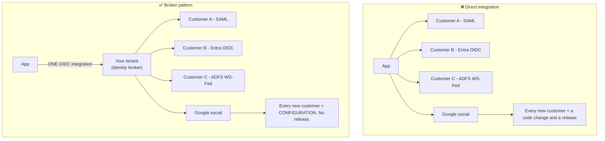
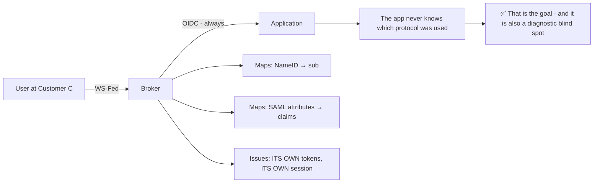
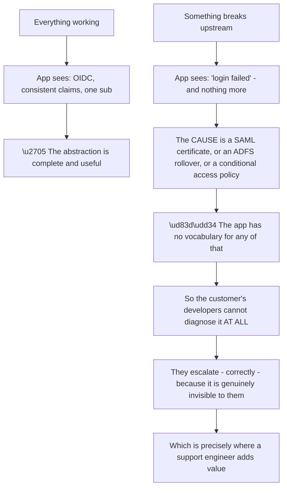
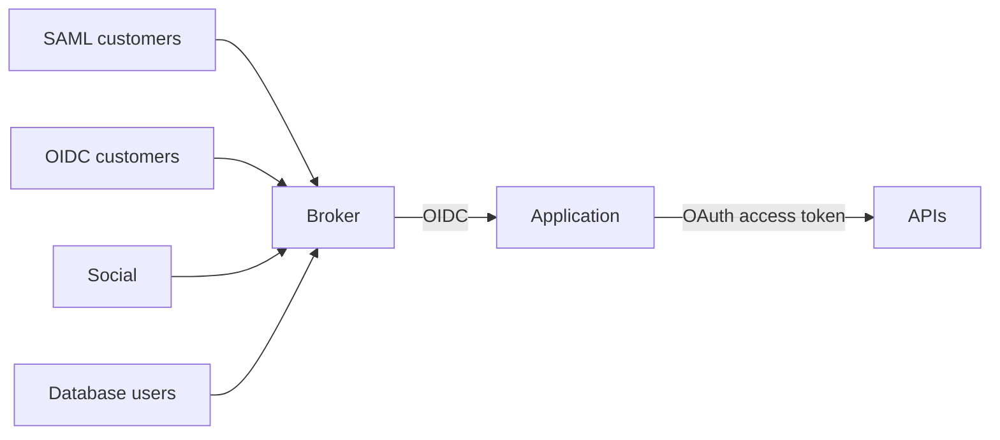
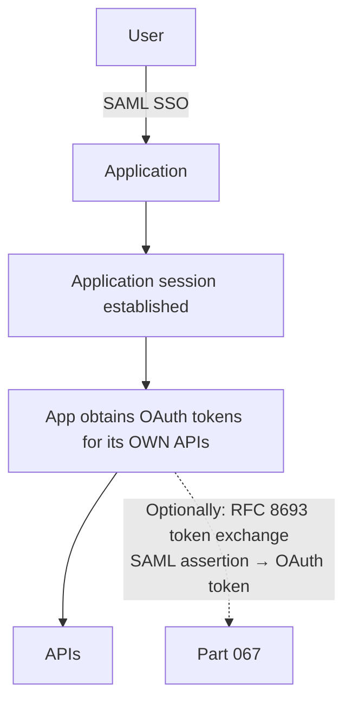
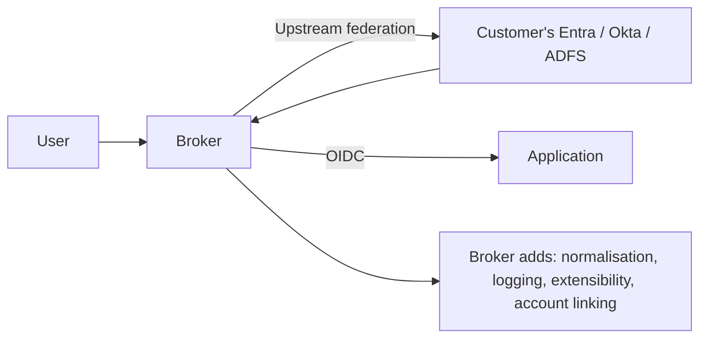
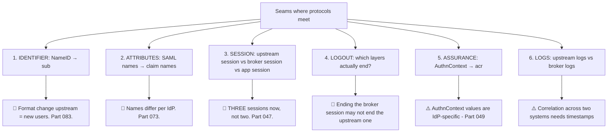
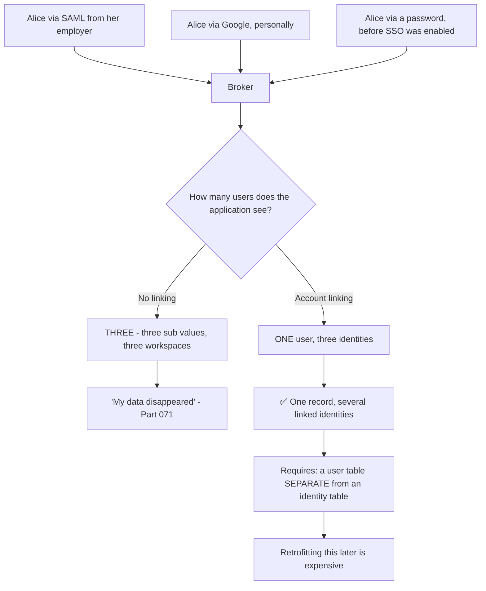
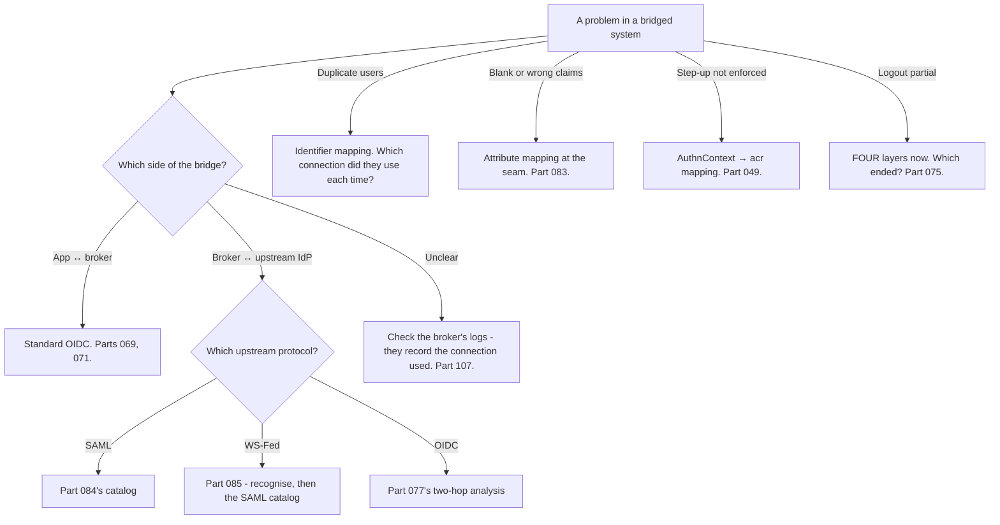

# Part 086 - Protocol Bridging and Multi-Protocol Architectures

> Section goal: Understand how one platform normalises several protocols into a single identity model, the architectures customers actually run, and how to reason about a system where SAML, OIDC, and OAuth all appear at once. This closes Group H and is the pattern most enterprise deployments end up in.

Covers index item **086**. Maps to JD signals: *knowledge of SAML/OAuth/OIDC*, *knowledge of authentication and authorization*, *strong analytical and problem-solving skills*, *communicate technical concepts clearly*, and *promote best practices*.

---

## 1. Start From Zero: The Broker Pattern

A product serving enterprises will meet SAML, OIDC, WS-Federation, and social providers. **Integrating each directly does not scale.**

**The application integrates once, with one protocol, and every external provider is normalised behind it** (Part 077). That single property is why brokers exist.

> **Analogy.** A single reception desk that accepts passports, driving licences, and staff cards, and issues one visitor badge. Every internal door reads one badge format.
>
> **Where it stops:** a receptionist can interpret an unfamiliar document. A broker must have an explicit connection configured for each provider — the normalisation is real, and it is not automatic.

---

## 2. What Gets Normalised, and What Does Not

| Normalised by the broker | Still protocol-specific |
|---|---|
| ✅ The application's integration | ❌ Connection configuration and its failure modes |
| ✅ Token format the app receives | ❌ Certificate and key rotation models |
| ✅ Claim shapes, after mapping | ❌ Attribute naming upstream (Part 083) |
| ✅ `sub` and the user record | ❌ NameID versus `sub` semantics |
| ✅ Session and logout at the broker | ❌ Upstream logout capability (Parts 075, 085) |
| ✅ Logs, in one place | ❌ The upstream provider's own logs |

**The last node is worth sitting with.** The application's protocol-blindness is exactly the benefit and exactly the reason a support engineer must be able to see through it: **when something breaks upstream, the application reports a generic failure and the cause is in a protocol it has never heard of.**

### 🔍 Plain-English deep-dive: the abstraction leaks in exactly one direction

A broker abstracts protocols away from the application. **That abstraction holds perfectly while everything works and leaks entirely when it does not** — which is a general property of abstractions worth naming, because it predicts where the difficulty will be.

**The consequence for support is a positive one**, and worth internalising: these tickets escalate not because the customer is unskilled but because the information they need is **structurally unavailable** to them. Their application logged what it saw, and what it saw was a generic failure from a broker.

**What you can see that they cannot:**

| Visible to you | Not visible to their application |
|---|---|
| Which connection was used | Anything protocol-specific |
| The broker's own logs (Part 107) | Upstream errors |
| The upstream assertion or token | The wire format at all |
| Certificate and metadata state | Any of it |

**So the first useful move on a bridged ticket is often to look at something the customer literally cannot look at**, and to say so — *"your application only sees a generic failure here, which is expected; let me check the connection logs"* removes any suggestion that they should have found it themselves.

**The design implication for customers is the mirror image.** If their developers need to self-serve on federation failures, the broker's logs and connection status need to be **exposed to them** — and that is a product and permissions decision worth raising, because otherwise every enterprise connection problem becomes a support ticket by construction.

**And the general lesson transfers well beyond identity:** an abstraction that hides complexity also hides *diagnosis*, so the tooling that pierces it has to be deliberately provided. **A broker without accessible logs is an abstraction with no escape hatch.**

**Analogy:** an interpreter in a negotiation. While it flows, the abstraction is perfect and neither side needs the other's language. The moment something is misunderstood, the party who does not speak the language cannot even identify what went wrong. **Where it stops:** an interpreter can explain the misunderstanding. A broker returns an error code, which is why access to its logs is the escape hatch.

---

## 3. Common Multi-Protocol Architectures

### Architecture A — Broker for everything

**The default and the simplest.** One integration, one user model, one session.

### Architecture B — SAML for SSO, OAuth for APIs

**Legitimate and common** (Part 078). SAML federates the user; OAuth authorizes API calls. **Two protocols, cleanly separated by purpose.**

### Architecture C — Broker in front of an existing IdP

**The most common enterprise shape**, and the one Part 077 describes: two chained flows, with the broker as both OP and RP.

---

## 4. Where Bridging Happens

### 🔍 Plain-English deep-dive: bridging is not free, and the seams are where tickets live

The broker pattern's benefits are real. **The costs sit at the seams between protocols**, and knowing where they are is what makes you fast.

**Seam 3 is the one that surprises people most.** Part 047 described three pieces of state; with a broker in front of an upstream IdP there are **four**: the application session, the broker's session, the upstream IdP's session, and the tokens. **A logout that ends one or two of those looks like it worked and does not.**

**Seam 4 follows directly.** Ending the broker session does not necessarily end the upstream provider's session — so a user who logs out and immediately logs back in may be authenticated silently by the upstream IdP, exactly as in Part 075's non-bug. **The difference is that there is now an extra layer to explain.**

**Seam 1 is the most damaging when it goes wrong.** If the upstream identity provider changes what populates its NameID, the broker maps a different value into `sub`, and every affected user becomes a **new user** at the application (Part 083). **The application sees nothing unusual — a new `sub`, so a new person.**

**Seam 5 is quietly important for step-up.** SAML's `AuthnContextClassRef` and OIDC's `acr` are both IdP-defined vocabularies (Part 049), and the broker maps between them. **A customer requesting MFA through a bridged connection needs that mapping to be correct**, or the request is silently ignored and step-up becomes theatre.

**Seam 6 is the operational one.** A failure may be visible only in the upstream provider's logs, which you cannot see (Part 077). **Timestamps with timezones are what make correlation possible across the seam**, which is why they are always in the evidence request (Part 084).

**The diagnostic habit this produces:** on any bridged architecture, ask *"which side of the bridge is this?"* before anything else — the same "how far did it get" question, applied to a system with more layers.

**Analogy:** a translator between two organisations. Everything works until a term has no equivalent, or one side changes its vocabulary. The translation is real and the seams are where meaning is lost. **Where it stops:** a translator can ask for clarification. A broker maps whatever it was configured to map, silently, including a value that has changed meaning.

---

## 5. Designing a Bridged System

| Decision | Guidance |
|---|---|
| **Identifier** | Map to an **immutable** upstream value, not email or username (Part 083) |
| **Attribute mapping** | Explicit, per connection, and **documented** |
| **Session lifetimes** | The three or four must agree (Part 061) |
| **Logout** | Decide which layers end, and tell users honestly (Part 075) |
| **Assurance mapping** | Map `AuthnContextClassRef` to `acr` deliberately (Part 049) |
| **Account linking** | Design for it from the start (Part 105) |
| **Deprovisioning** | JIT alone is incomplete — add SCIM (Part 094) |
| **Logging** | Correlate by timestamp; record the connection used |

### 🔍 Plain-English deep-dive: the one-user-model rule

The single most valuable design property of a bridged system is that **whatever protocol a person federated through, the application sees one consistent identity.**

**The structural requirement is a data model decision made early:** a **user** record, and a separate **identity** record holding `(issuer, subject, connection)` — with one user owning several identities. **Retrofitting that onto a schema where the user *is* the identity is expensive**, because every foreign key points at the wrong thing.

**Three practical rules:**

| Rule | Reason |
|---|---|
| **Store the connection alongside `(iss, sub)`** | You will need to know *how* someone authenticated |
| **Never assume one human means one identity** | Password, social, and enterprise are three (Part 071) |
| **Link only on verified identifiers** | Linking on an unverified email is a takeover path (Part 053) |

**The support-facing value:** when a customer reports duplicate accounts or vanished data, the question *"how did they sign in this time versus last time?"* answers it immediately — **but only if the connection was recorded.** A system that does not store which connection produced an identity makes its own duplicates hard to diagnose.

**And the third rule is where security and convenience collide.** Automatic linking on email is exactly what customers ask for and exactly what Part 053 warns against. **The compromise that works is linking on a *verified* identifier automatically, and requiring explicit user confirmation otherwise** — which is both safe and a better experience than silently creating a second account.

**Analogy:** a customer record with several ways to reach the same person. Merging them is easy at the outset and painful once each has its own history. **Where it stops:** a person can recognise the same customer under two names. Software matches identifiers, so the model has to allow one person to hold several.

---

## 6. Failure Modes

| Failure mode | What it looks like | Consequence | Correction |
|---|---|---|---|
| **Direct integration per customer** | Works for three customers | Does not scale; a release per customer | Broker pattern |
| **Not knowing which side broke** | Debugging the application | Wasted time | Ask which side of the bridge |
| **Upstream NameID change** | Users become new users | 🔴 Data appears lost (Part 083) | Immutable identifiers |
| **Attribute mapping undocumented** | Nobody knows what maps to what | Slow diagnosis | Document per connection |
| **Four sessions, two ended** | "Logout doesn't work" | Confusion (Part 075) | Decide and communicate |
| **Assurance not mapped** | Step-up silently ignored | 🔴 Theatre (Part 049) | Map `AuthnContextClassRef` → `acr` |
| **User model = identity model** | One person, three accounts | 🔴 Duplicates; expensive to fix | Separate user and identity records |
| **Connection not recorded** | Cannot diagnose duplicates | Slow support | Store it with `(iss, sub)` |
| **Automatic linking on unverified email** | Convenient | 🔴 Takeover path (Part 053) | Verified only, or confirm explicitly |
| **JIT with no SCIM** | Accounts accumulate | Audit gap (Part 048) | Add SCIM |
| **No timestamp correlation** | Cannot align two systems' logs | Dead end | Timezone-qualified timestamps |

---

## 7. Troubleshooting Decision Tree: Bridged Architectures

### Worked example

*"After we added a new enterprise customer, some of our existing users started getting a blank profile page. The two seem unrelated."*

1. **Take the "seem unrelated" seriously**, but test it — a change to a shared broker configuration can affect other connections.
2. **Establish scope.** Which users are affected? Answer: only users from **one existing customer**, not the new one.
3. **That is the key detail.** A change made for the new customer has affected an existing connection, which means something shared was altered.
4. **Ask what was changed.** A default attribute mapping at the broker level was adjusted to accommodate the new customer's attribute names.
5. **The mechanism:** the existing connection relied on that default rather than an explicit per-connection mapping. Changing the default changed its behaviour, so attributes stopped resolving and profiles rendered blank (Part 083).
6. **And the second half:** the application overwrites the profile on every login, so absent attributes were written as empty — turning a mapping change into apparent data loss (Part 083's §4).
7. **Immediate fix:** restore the default and add an **explicit** mapping for the new customer's connection.
8. **The durable fix:** every connection gets an explicit, documented attribute mapping. **Shared defaults create invisible coupling between customers**, which is exactly the failure here.
9. **And separately:** change the update policy so absent attributes are ignored rather than blanking existing values.
10. **Raise the general lesson**, because it applies beyond attributes: in a multi-tenant broker, **anything shared across connections is a change that can affect customers who were not part of the change.** Suggesting per-connection explicitness is worth more than either fix.

---

## 8. Lab: Build a Bridged System

**Purpose.** Run three upstream protocols into one broker, prove the normalisation, and reproduce each seam failure.

**Prerequisites.** All of Groups G and H. A free Auth0 tenant, a SAML IdP, a second OIDC provider, and a social connection.

**Steps.**

1. Create `okta-prep/labs/086-bridging/`.
2. **Configure three connections:** SAML, enterprise OIDC, and social. Plus a database connection for local users.
3. **One application.** Integrate it with the broker using **OIDC only**. Confirm it never speaks SAML.
4. **Log in through each connection** as an equivalent user. **Capture a HAR of each** and confirm the application's side is identical every time. **This is the normalisation, proven.**
5. **Compare the four user records.** `sub`, connection recorded, claims populated. **Build a table.** Confirm all four are distinct identities.
6. **Implement account linking.** Separate user and identity records; link the four to one user **only where the identifier is verified**. Confirm one workspace.
7. **Reproduce the identifier seam.** Change the SAML NameID format and log in again. **Confirm a new identity is created** (Part 083).
8. **Reproduce the attribute seam.** Change one connection's attribute name upstream without updating the mapping. **Record the blank field.**
9. **Reproduce the shared-default trap.** Configure a broker-level default mapping, rely on it in two connections, then change it for one. **Confirm the other breaks** — this is §7's worked example.
10. **Fix it** with explicit per-connection mappings and confirm isolation.
11. **Count the sessions.** With an upstream enterprise connection, enumerate every session that exists after a login: application, broker, upstream IdP, plus tokens. **Build the four-state observatory** (Part 047).
12. **Logout matrix.** For each logout mechanism, record which of the four layers ends. **Produce a 4×4 table.**
13. **Assurance mapping.** Request MFA via `acr_values` through the SAML connection. **Record whether the broker maps it to `AuthnContextClassRef` and whether the IdP honours it** (Part 049).
14. **Log correlation.** Trigger a failure at the upstream IdP and **correlate the broker's log entry with the timestamp** (Part 107). Record what each system shows.
15. **Write the architecture note.** `bridging.md` — one page: the broker pattern, the six seams, the one-user-model rule, and the shared-default warning.
16. **Failure catalog + manifest.** Complete `MANIFEST.md`, consolidating Groups G and H.

**Expected evidence.** Three upstream protocols into one application, identical application-side HARs, a four-record comparison, working account linking on verified identifiers only, all six seams exercised with at least three failures reproduced, a four-state observatory, a logout matrix, an assurance-mapping result, log correlation across the bridge, and a one-page architecture note.

**Validation rubric.**

| Check | Pass condition |
|---|---|
| Three connections | All working into one OIDC integration |
| Normalisation | Application-side HARs identical across protocols |
| Four records | Distinct identities tabulated |
| Account linking | One user, several identities, verified only |
| Identifier seam | New identity reproduced |
| Attribute seam | Blank field reproduced |
| Shared default | Cross-connection breakage reproduced, then isolated |
| Session count | Four layers enumerated |
| Logout matrix | Complete |
| Assurance | Mapping behaviour recorded |

**Cleanup and privacy.** Lab tenants and synthetic users only. **Never bridge to an employer or customer directory.** Delete all connections, users, and applications at the end; restore any shared defaults.

---

## 9. JD Mapping

| Supplied JD signal | How this Part supports it |
|---|---|
| **Knowledge of SAML/OAuth/OIDC** | All three in one architecture, normalised |
| Knowledge of authentication and authorization | Identity model, assurance mapping, and sessions across layers |
| **Strong analytical and problem-solving skills** | "Which side of the bridge?" as the first question |
| **Communicate technical concepts clearly** | Explaining coupling between unrelated customers |
| **Promote best practices** | Per-connection explicitness; one user model; verified-only linking |
| Exceed expectations on response quality | Raising the shared-default lesson beyond the immediate fix |
| Collaborate across teams | Upstream failures needing the customer's identity team |

---

## 10. Candidate Honesty Note

- **Claim safety:** *Learned architecture and lab experience.*
- **The strongest thing you can say:** *"The broker pattern is why an application can integrate once, with one protocol, and support customers on SAML, OIDC, WS-Fed and social. Adding a customer becomes configuration rather than a release. The application never knows which protocol was used — which is the benefit and also a diagnostic blind spot, because when something breaks upstream the application reports a generic failure in a protocol it has never heard of."*
- **A second point, the diagnostic habit:** *"On any bridged system the first question is which side of the bridge — application to broker, or broker to upstream. That's the same 'how far did it get' question applied to a system with more layers, and the broker's own logs usually record which connection was used, so it's answerable quickly."*
- **A third, on the seams:** *"The costs sit where protocols meet — identifier mapping, attribute naming, sessions, logout, assurance, and logs. The one that surprises people is sessions: with a broker in front of an upstream IdP there are four pieces of state, not three, so a logout that ends two of them looks like it worked."*
- **A fourth, the design rule that matters most:** *"Whatever protocol someone federated through, the application should see one consistent identity — which needs a user record separate from an identity record holding issuer, subject, and connection. Retrofitting that later is expensive because every foreign key points at the wrong thing, and the symptom in the meantime is 'my data disappeared' when someone signs in a different way."*
- **A fifth, a genuinely non-obvious failure:** *"In a multi-tenant broker, anything shared across connections couples customers who have nothing to do with each other. A default attribute mapping adjusted for a new customer can blank profiles for an existing one. Per-connection explicitness is the fix, and it's worth raising as a principle rather than just correcting the instance."*
- **A sixth, on linking:** *"Automatic linking on email is what customers ask for and it's a takeover path if the email is unverified. The compromise that works is linking automatically on a verified identifier and requiring explicit confirmation otherwise — which is safer and a better experience than silently creating a second account."*
- **Do not overstate:** you have not designed a production bridged architecture. Say you have built one in a lab across three protocols and reproduced the seam failures.

---

## 11. Official Source Anchors

Accessed **26 August 2026**.

| Source | What it defines |
|---|---|
| OpenID Connect Core | The protocol the application integrates with |
| OASIS SAML 2.0 Core and Profiles | The upstream protocol most often bridged |
| OASIS WS-Federation 1.2 | The legacy upstream protocol (Part 085) |
| IETF RFC 8693 | Token exchange, including SAML assertions as subject tokens (Part 067) |
| IETF RFC 7644 (SCIM) | Lifecycle across the bridge (Part 094) |
| Auth0 documentation — connections, Organizations, account linking | The broker model in practice (Parts 101, 104, 105) |
| Okta documentation — identity providers and inbound federation | Okta's brokering model |
| NIST SP 800-63C | Federation assurance, protocol-neutral |

**Revalidate after 26 August 2026:** the protocols are stable. Recheck vendor connection and organisation features, which develop.

---

## ⭐ Likely Interview Questions for This Section

### Q1. "Why use an identity broker?"
> *Model answer:* "So the application integrates once. Without one, every enterprise customer's identity provider is a separate integration — SAML for one, Entra OIDC for another, ADFS WS-Fed for a third — and adding a customer means a code change and a release. With a broker, the application speaks one protocol, usually OIDC, and every upstream provider is normalised behind it: NameID or `sub` mapped to one identifier, attributes mapped to consistent claims, one session model, one set of logs. Adding a customer becomes configuration. The trade-off is a second hop to reason about when something breaks, and the application's protocol-blindness becomes a diagnostic blind spot — it reports a generic failure for a cause in a protocol it's never heard of."

### Q2. "What gets normalised and what doesn't?"
> *Model answer:* "Normalised: the application's integration, the token format it receives, claim shapes after mapping, the user record and `sub`, the session and logout at the broker, and logs in one place. Not normalised: the connection configuration and its failure modes, certificate and key rotation models, upstream attribute naming, NameID versus `sub` semantics, upstream logout capability, and the upstream provider's own logs which you can't see. So the application's experience is uniform and the support surface isn't — which is exactly why a support engineer needs to be able to see through the normalisation to whichever protocol is actually failing."

### Q3. "How do you troubleshoot a bridged system?"
> *Model answer:* "First question: which side of the bridge? Application to broker is standard OIDC, so the OIDC error catalog applies. Broker to upstream depends on the upstream protocol — SAML gets the SAML catalog, WS-Fed gets recognised and then the SAML catalog, OIDC gets the two-hop analysis. If it's unclear, the broker's own logs usually record which connection was used, which settles it. It's the same 'how far did it get' question from OAuth troubleshooting, applied to a system with an extra layer. And because most upstream causes sit with the customer's identity team, the deliverable is frequently an evidence pack rather than a fix, with timestamps that let both systems' logs be correlated."

### Q4. "Where do bridged systems typically break?"
> *Model answer:* "At the seams. Identifier mapping — if the upstream provider changes what populates its NameID, the broker maps a different value into `sub` and users become new users. Attribute naming, which differs per provider and is where blank profiles come from. Sessions — with a broker there are four pieces of state, not three, so logout that ends two of them looks like it worked. Logout capability upstream, which varies. Assurance mapping, where SAML's `AuthnContextClassRef` and OIDC's `acr` are both provider-defined vocabularies, so a step-up request can be silently ignored. And logs, which live in two systems and need timezone-qualified timestamps to correlate. Six seams, and knowing them is what makes diagnosis fast."

### Q5. "How should the user model be designed?"
> *Model answer:* "A user record separate from an identity record. The identity holds issuer, subject, and which connection produced it; a user owns several identities. That matters because one person legitimately has several — a password before SSO was enabled, a corporate SAML identity, maybe a personal social login — and without linking they get several accounts and several workspaces, and report it as data loss. Retrofitting the separation later is expensive because every foreign key points at the identity rather than the person. I'd also store the connection alongside issuer and subject, because when someone reports duplicates the diagnostic question is 'how did you sign in this time versus last time' — and that's only answerable if it was recorded."

### Q6. "A change for one customer broke another. How does that happen?"
> *Model answer:* "Something shared was altered. In a multi-tenant broker, a default attribute mapping, a default session policy, or a tenant-level rule applies across connections unless overridden — so adjusting a default to accommodate a new customer changes behaviour for every connection relying on it. The classic version is attribute mapping: the new customer's provider uses different attribute names, someone changes the default, and an existing connection that relied on the default stops resolving attributes, producing blank profiles. Often compounded by an update policy that overwrites profiles on login, so absent attributes get written as empty. The fix is per-connection explicit configuration, and the principle worth raising is that anything shared across connections couples customers who have nothing to do with each other."

### Q7. "Is SAML for SSO plus OAuth for APIs a compromise?"
> *Model answer:* "No, it's a legitimate architecture with two protocols cleanly separated by purpose. SAML federates the user into the application and establishes a session; OAuth authorizes the application's calls to its own APIs. SAML was never designed for API authorization — no scoped delegated access, no bearer token model, no refresh or PKCE — so trying to make it do that is the compromise. There's also a bridge available if the application needs to move from a SAML-established session into OAuth-protected APIs: RFC 8693 token exchange accepts a SAML assertion as a subject token. The failure I'd watch for is a customer assuming SAML means no OAuth, which is how applications end up with SSO and no API authorization story at all."

### Q8. "What's the biggest design mistake in a bridged system?"
> *Model answer:* "Making the user model the identity model — treating one authenticated identity as one person. It works perfectly with a single connection and breaks the moment a second is added, which is usually months later when someone enables SSO for a customer whose users already had passwords. Those users then arrive as new people with empty workspaces and report data loss. And by then the schema has every foreign key pointing at the identity, so separating them is a migration rather than a change. The second-biggest is automatic account linking on an unverified email, which is exactly what customers ask for and is a takeover path — the compromise being to link automatically on a verified identifier and require explicit confirmation otherwise."

---

## 🧠 30-Second Memory Hooks

- **Broker pattern: the app integrates ONCE.** New customers become **configuration**, not a release.
- **The app never knows which protocol was used** — the benefit **and** a diagnostic blind spot.
- **First question: WHICH SIDE OF THE BRIDGE?** App↔broker, or broker↔upstream.
- **SIX SEAMS:** identifier · attributes · **sessions** · logout · assurance · logs.
- **With a broker there are FOUR pieces of state**, not three.
- **Upstream NameID change → users become NEW users.**
- **Assurance mapping matters:** `AuthnContextClassRef` ↔ `acr`, or step-up is silently ignored.
- **ONE USER MODEL:** a **user** record separate from an **identity** record `(iss, sub, connection)`.
- **Store the CONNECTION** — it is the diagnostic question for duplicates.
- **Link only on VERIFIED identifiers.** Otherwise it is a takeover path.
- **SHARED DEFAULTS COUPLE UNRELATED CUSTOMERS.** Be explicit per connection.
- **SAML for SSO + OAuth for APIs is legitimate**, not a compromise.

---

## ✅ Completion Checklist

- [ ] **Knowledge:** I can describe the broker pattern, name the six seams, and state the one-user-model rule.
- [ ] **Lab artifact:** `086-bridging/` contains three upstream protocols into one application, identical app-side HARs, working verified-only account linking, three reproduced seam failures, a four-state observatory, and a logout matrix.
- [ ] **Spoken:** I can explain the broker pattern in 45 seconds and the shared-default coupling in 45.
- [ ] **Judgement:** I ask which side of the bridge first, and I raise per-connection explicitness as a principle.
- [ ] **Honesty check:** I say "built across three protocols in a lab."
- [ ] **Source check:** I have read RFC 8693's SAML subject-token section and my vendor's connection documentation myself.

---

*Next suggested section:* **[Part 087 - Directory Services From Zero: Trees, DNs, and Schemas](Part-087-directory-services-from-zero-trees-dns-and-schemas.md)** — Group I begins: the directories that sit behind most enterprise identity providers.
