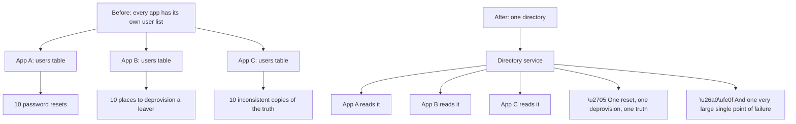
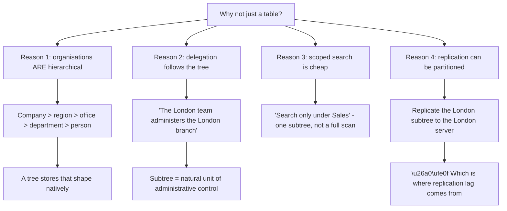
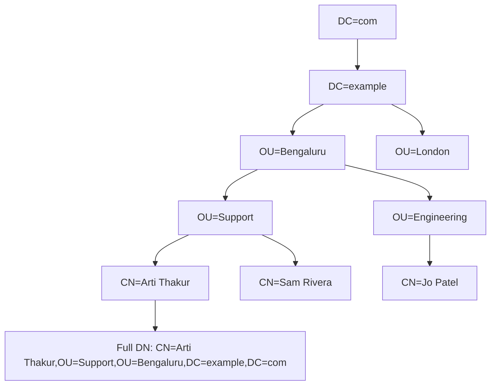
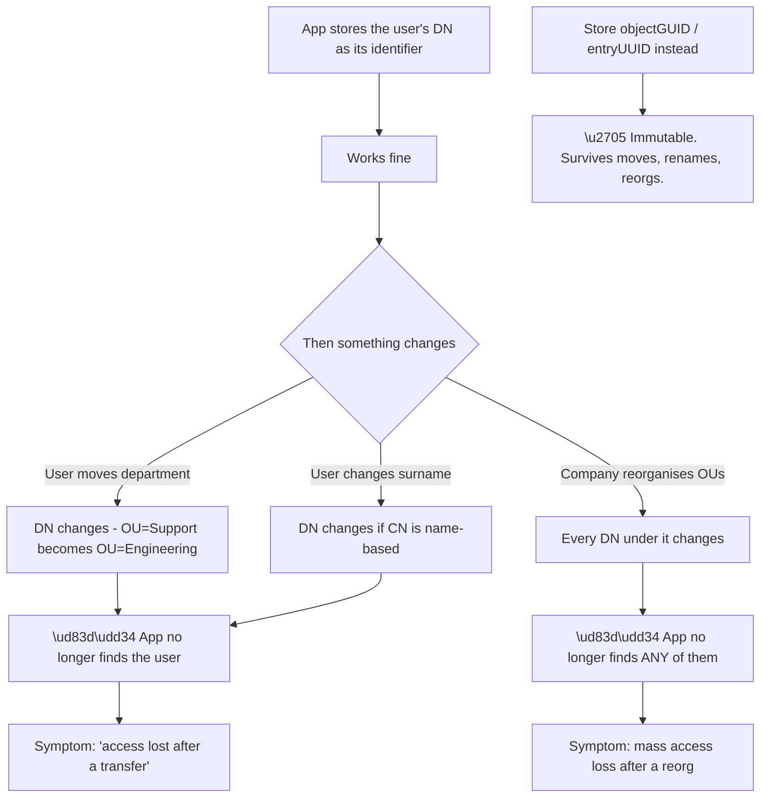
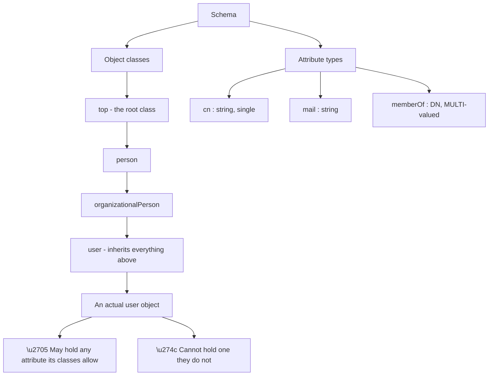
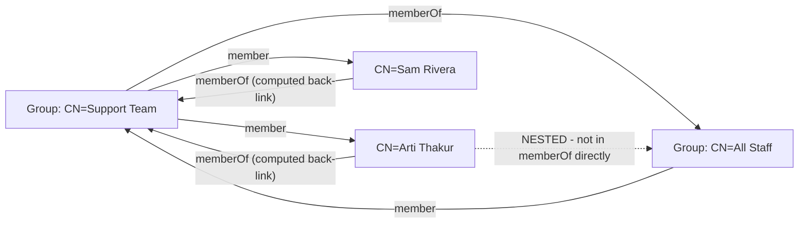
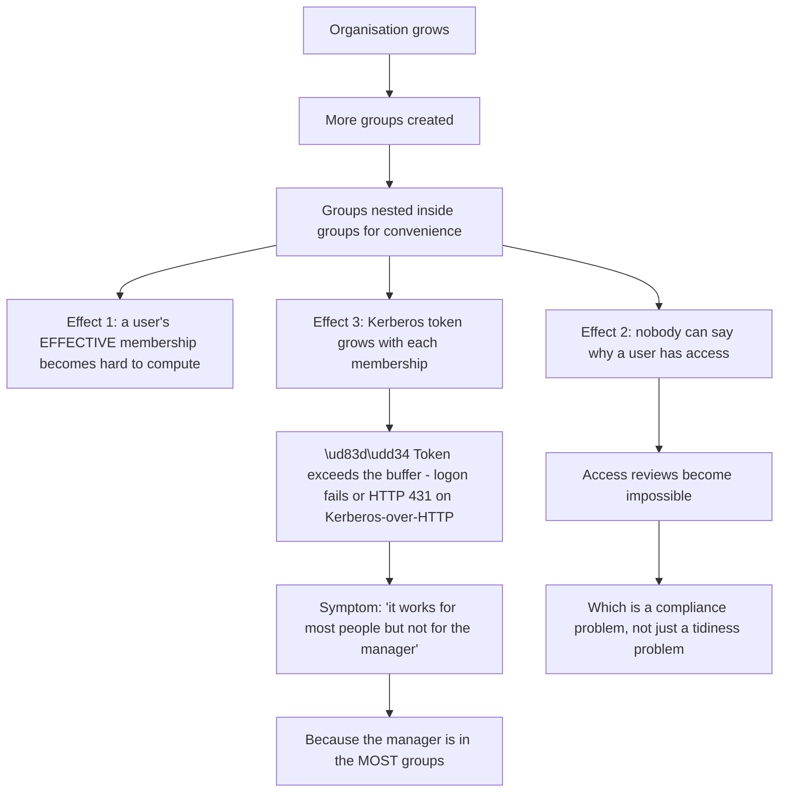
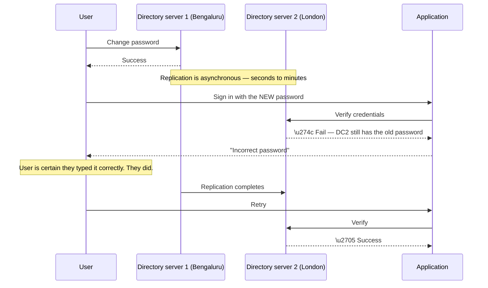
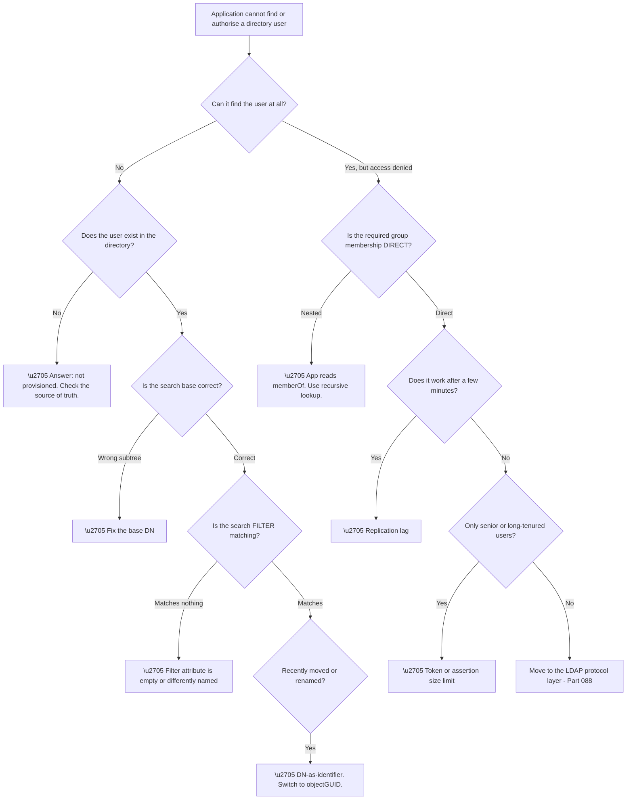

# Part 087 - Directory Services From Zero: Trees, DNs, and Schemas

> Section goal: Build a first-principles understanding of what a directory service *is* — a hierarchical, read-optimised store of identity objects — so that LDAP, Active Directory, and Entra ID in the following Parts feel like variations on one model rather than three unrelated systems.

Covers index item **087**. Maps to JD signals: *Active Directory*, *LDAP*, *identity and access management*, *troubleshooting complex technical issues*.

---

## 1. Start From Zero: What Problem a Directory Solves

Before directories, every application kept its own list of users. **Ten applications meant ten lists**, ten password resets when someone forgot their password, and ten places to remember when somebody left the company.

The obvious fix is a shared list. But "shared list" understates the problem, because the thing being shared is not just usernames — it is **the organisation's structure**: who reports to whom, which office someone sits in, which printers exist on which floor, which groups grant which access.

A **directory service** is that shared store, with four defining characteristics:

| Characteristic | What it means | Why it matters |
|---|---|---|
| **Hierarchical** | Objects live in a tree, not a flat table | Mirrors organisational structure |
| **Read-optimised** | Reads vastly outnumber writes | Every login is a read; hires are rare |
| **Schema-driven** | Object types and attributes are defined in advance | Consistency across every consumer |
| **Distributed** | Replicated across servers | Availability and locality |



**That last node is the trade-off**, and it explains almost everything about how directories are built. Because every application depends on the directory, the directory must be **replicated, cached, and extremely fast to read** — and those three design decisions produce most of the behaviours that later confuse people, including replication lag, stale caches, and the fact that writes behave differently from reads.

> 💡 **Tie-in to your background:** you have worked with Active Directory, LDAP, and Group Policy directly. That is genuine, hands-on directory experience — and it is one of the strongest bridges from your current role into identity work, because the concepts in this Part are ones you have troubleshooted rather than only read about.

### 🔍 Plain-English deep-dive: why a tree, and not a table?

A database table is flat: rows and columns. A directory is a **tree**. That choice was deliberate, and understanding why makes distinguished names stop feeling arbitrary.



**Reason two is the one people underestimate.** Delegated administration — letting a regional IT team manage their own users without giving them the keys to the whole organisation — falls out of the tree structure almost for free. A subtree is a natural permission boundary.

**Reason four has a cost that shows up in support tickets.** Because subtrees can be replicated to different servers, a change made in one place takes time to appear elsewhere. **A password changed at head office may not be usable at a branch office for some minutes** — and the user experiences that as "my new password doesn't work," which sounds like a password problem and is actually a replication problem.

| Trade-off | Table | Tree |
|---|---|---|
| Arbitrary queries | Excellent | Weaker |
| Hierarchical queries | Awkward | Native |
| Delegated administration | Manual | Structural |
| Write-heavy workloads | Excellent | Poor |
| Read-heavy workloads | Good | Excellent |

**Analogy:** a filing system organised by department and floor rather than one enormous alphabetical drawer. Finding "everyone in Sales" is trivial; finding "everyone whose surname starts with M" is not. **Where it stops:** a filing cabinet has one copy. A directory has many, and they disagree briefly after every change.

---

## 2. Distinguished Names: An Object's Address

Every object in a directory has a **distinguished name** — its full, unambiguous path from itself up to the root. Read right to left, it is a route down the tree.

```
CN=Arti Thakur,OU=Support,OU=Bengaluru,DC=example,DC=com
```

| Component | Stands for | Meaning here |
|---|---|---|
| `CN` | Common Name | The object itself |
| `OU` | Organizational Unit | A container — a folder in the tree |
| `DC` | Domain Component | One label of the DNS domain name |

Reading it **right to left**: the `com` domain, the `example` domain within it, the `Bengaluru` container, the `Support` container inside that, and finally the object `Arti Thakur`.



Two related terms complete the picture:

| Term | Meaning |
|---|---|
| **RDN** (Relative DN) | Just the object's own component: `CN=Arti Thakur` |
| **Base DN** | Where a search starts: `OU=Bengaluru,DC=example,DC=com` |
| **Naming context** | The subtree a server holds: often `DC=example,DC=com` |

**The support consequence is immediate:** a DN is *position-dependent*. Move a user from `OU=Support` to `OU=Engineering` and their DN changes — which means **anything that stored the DN as an identifier now points at nothing**.

### 🔍 Plain-English deep-dive: why storing a DN as a user identifier goes wrong

This is a real and recurring integration bug, and it rhymes exactly with the NameID lesson from Part 083.



**The identifier a directory guarantees to be stable is not the DN.** Active Directory provides `objectGUID`; many LDAP servers provide `entryUUID`; some provide `objectSid` (stable within a domain but *not* across a domain migration). Those are the values to store.

| Attribute | Stable across moves? | Stable across renames? | Notes |
|---|---|---|---|
| `distinguishedName` | ❌ | ❌ | Positional |
| `sAMAccountName` | ✅ | ❌ | Changes on rename in practice |
| `userPrincipalName` | ✅ | ❌ | Often email-shaped; changes on marriage, rebrand |
| `mail` | ✅ | ❌ | Can be reassigned to a new person |
| `objectGUID` / `entryUUID` | ✅ | ✅ | **The correct choice** |

**Two rows deserve emphasis.** `mail` being reassignable is the same danger as email-based NameID (Part 083) — a departed employee's address given to a new hire silently transfers access. And `userPrincipalName` changing is far more common than people expect: **surname changes, company rebrands, and domain consolidations all rewrite it in bulk.**

**The support signature to memorise:** *"a user lost access after moving teams"* or *"lots of users lost access after a reorganisation"* is very often a DN-as-identifier bug — and the diagnostic question is simply **"what field does the application match users on?"**

**Analogy:** filing someone under their desk location. It works until they move desks, and a whole-floor move breaks every reference at once. **Where it stops:** a person would recognise the individual anyway. A system matching on an exact string will not.

---

## 3. Schema: What Objects Can Exist

A directory's **schema** defines what object types exist and what attributes each may hold. It is enforced — you cannot store an attribute the schema does not define.

| Schema concept | Meaning | Example |
|---|---|---|
| **Object class** | A type of object | `user`, `group`, `computer`, `organizationalUnit` |
| **Attribute** | A field an object may hold | `cn`, `mail`, `telephoneNumber`, `memberOf` |
| **Mandatory (MUST)** | Required for that class | `cn` on most classes |
| **Optional (MAY)** | Allowed but not required | `telephoneNumber` |
| **Syntax** | The data type | String, integer, DN, boolean |
| **Single vs multi-valued** | How many values allowed | `mail` single; `memberOf` multi |



**Inheritance is why the model scales.** `user` inherits from `organizationalPerson`, which inherits from `person`, which inherits from `top`. Anything true of a person is automatically true of a user.

**Extending the schema is possible and consequential.** Adding a custom attribute is a legitimate operation, and in Active Directory it is **effectively irreversible** — schema extensions cannot be deleted, only deactivated, and they replicate forest-wide. That is why organisations treat schema changes with a level of caution that surprises people arriving from ordinary database work.

> 💡 **Tie-in to your background:** if you have ever seen an Active Directory schema extension performed as part of an application deployment, you have seen exactly why forest-wide, irreversible changes get scheduled, reviewed, and tested. That instinct carries over directly to identity work.

---

## 4. Multi-Valued Attributes and Group Membership

Group membership is the attribute pattern that causes the most confusion, so it earns its own section.

| Attribute | Lives on | Contains | Direction |
|---|---|---|---|
| `member` | The **group** | DNs of its members | Group → users |
| `memberOf` | The **user** | DNs of groups they belong to | User → groups |

**These are two views of one relationship**, and in Active Directory `memberOf` is *computed* — it is a back-link maintained by the directory rather than something you write directly. You add a user to a group by writing `member` on the group.



**The dotted line is the classic trap.** Arti is a member of Support Team, and Support Team is a member of All Staff — so Arti is effectively in All Staff. But **`memberOf` on the user does not show it**, because back-links are direct only. An application that reads `memberOf` and checks for "All Staff" will conclude she is not a member.

| Approach | Sees nested groups? | Cost |
|---|---|---|
| Read `memberOf` | ❌ Direct only | Cheap |
| Recursive search of `member` | ✅ | Expensive, multiple queries |
| AD `LDAP_MATCHING_RULE_IN_CHAIN` (`1.2.840.113556.1.4.1941`) | ✅ | One query, AD-only, can be slow |
| Token-based (Kerberos PAC) | ✅ | Free at logon; see Part 089 |

**The support signature:** *"the user is in the group but the application says they're not."* Ask **"is that membership direct or through a nested group?"** — and if nested, the application is almost certainly reading `memberOf`.

### 🔍 Plain-English deep-dive: group sprawl, token bloat, and why "just add another group" has a ceiling

Groups feel free. They are not, and the limits appear suddenly rather than gradually.



**The failure signature in the diagram is genuinely distinctive** and worth committing to memory: a problem that affects **long-tenured staff and managers but not new joiners** points at accumulated group membership, because those are exactly the people who have collected the most groups over time.

| Symptom | Underlying limit |
|---|---|
| Logon fails for some users only | Kerberos token size |
| `HTTP 431 Request Header Fields Too Large` | Kerberos ticket in an HTTP header |
| SAML assertion rejected as too large | Every group emitted as an attribute |
| Slow logins for specific users | Deep nested-group resolution |

**The third row connects directly to federation.** An IdP configured to emit *all* group memberships as SAML attributes produces an enormous assertion for a heavily-grouped user — and the service provider rejects it or truncates it. **The fix is to emit only the groups the application actually needs** (a filter), which is both smaller and better practice. Part 093 returns to this for Entra ID specifically.

**The design lesson:** groups are a mechanism, not a strategy. Role-based grouping with shallow nesting scales; ad-hoc groups nested for convenience do not, and the bill arrives years later as an unexplainable access model.

**Analogy:** carrying every membership card you have ever been issued. Fine for a while; eventually the wallet will not close — and it is the person with the longest history who cannot close it first. **Where it stops:** you could leave cards at home. A logon token carries all of them, every time, automatically.

---

## 5. Replication and Consistency

Directories are replicated, and replication is **eventually consistent**. Every directory-related timing mystery traces back to that sentence.



**The user's report is accurate and the system's rejection is also accurate.** They are talking to different servers.

Directories mitigate this in specific ways worth knowing:

| Mitigation | What it does |
|---|---|
| **Urgent replication** | Password changes and lockouts replicate immediately rather than on schedule |
| **PDC Emulator referral** (AD) | A failed password check is retried against one authoritative server before rejecting |
| **Read-only replicas** | Serve reads locally, forward writes to a writable server |
| **Site topology** | Replication scheduled by network cost between locations |

**The second row is the reason this problem is rarer than it should be**, and knowing it exists is what lets you say confidently that a *persistent* password failure is not replication lag. **Replication symptoms are transient and resolve themselves**; if it still fails ten minutes later, look elsewhere.

| Behaviour | Likely replication? |
|---|---|
| Fails for a few minutes, then works | ✅ Very likely |
| Fails consistently for one user | ❌ Look at the account |
| Fails only at one office | ✅ Possible — that site's replica |
| Fails for everyone, everywhere | ❌ Something else broke |

> 💡 **Tie-in to your background:** "it works from one place and not another, and resolves itself after a while" is a pattern you will recognise from distributed-service work at Microsoft. Directory replication is the same shape of problem with different vocabulary.

---

## 6. Failure Modes

| # | Failure mode | Symptom | Root cause | First check |
|---|---|---|---|---|
| 1 | DN stored as identifier | Access lost after a move or reorg | Positional identifier | What field does the app match on? |
| 2 | Email reused | New hire inherits old access | `mail` is reassignable | Is matching done on `mail`? |
| 3 | Nested group not seen | "In the group but denied" | App reads `memberOf` | Direct or nested membership? |
| 4 | Token bloat | Logon or HTTP fails for senior staff only | Too many group memberships | Count the user's groups |
| 5 | Replication lag | New password rejected briefly | Async replication | Does it resolve on retry? |
| 6 | Wrong base DN | Search returns nothing | Searching the wrong subtree | Print the base DN being used |
| 7 | Schema mismatch | Attribute always empty | Attribute not populated or not in schema | Query the raw object |
| 8 | Referral not followed | Partial results | Client ignores referrals | Check the client's referral setting |
| 9 | Case sensitivity assumption | Intermittent match failure | DN comparison is case-insensitive; values may not be | Normalise before comparing |
| 10 | Deleted-object tombstone | Recreated user has no access | New `objectGUID` | Was the account deleted and recreated? |

**Row 10 is a subtle one.** Deleting and recreating a user produces a **new** `objectGUID` — so an application correctly storing the GUID will treat the recreated account as a different person. That is the correct behaviour, and it surprises administrators who expected a restore.

---

## 7. Troubleshooting Decision Tree: Directory Lookup Problems



### Worked example

A customer reports that five users lost access to an internal application last Tuesday. Everyone else is fine.

**Walking the tree.** The application *can* find them — it returns "access denied," not "user not found," so we take the right-hand branch. Their required group membership is direct, confirmed in the directory console. It has not resolved after four days, so it is not replication. And they are not all senior staff, so token bloat is unlikely.

**The question that resolves it:** what happened last Tuesday? The answer is a departmental reorganisation — five people moved from `OU=Support` to `OU=Customer Success`.

**Back to node F.** Their DNs changed. The application stores DNs. **The five users the application is looking for no longer exist at the addresses it recorded.**

**The immediate fix** is to re-link the five accounts. **The actual fix** is to change the application's identifier to `objectGUID`, which is the recommendation to write up — because otherwise the next reorganisation produces the same ticket with different names.

**What made it findable:** the correlation between "five users" and "one department." **A failure that follows an organisational boundary rather than a technical one is almost always a structural identifier problem.**

---

## 8. Lab: Explore a Directory Tree Safely

**Purpose.** Build hands-on familiarity with DNs, object classes, attributes, and group membership using a disposable local directory — with no connection to any employer or customer system.

**Prerequisites.**
- Docker Desktop, or any local LDAP server you can run and delete
- A directory browser: Apache Directory Studio, `ldapsearch`, or JXplorer
- **A personal machine.** Do not point any tool at an employer directory.

**Steps.**

1. **Start a throwaway directory server.** A container image of OpenLDAP is the simplest option. Give it a fictional base DN such as `dc=labexample,dc=test`.
2. **Connect with a browser tool** and expand the tree. Note the root, and note that the base DN is the top of what this server holds.
3. **Create two organizational units:** `ou=Support` and `ou=Engineering`.
4. **Create three users**, one in Engineering and two in Support, with entirely fictional names. Record each user's full DN.
5. **Record the stable identifier.** Read `entryUUID` on each user. Note that it is not the DN.
6. **Create a group** and add two users via the `member` attribute. Observe how membership is stored.
7. **Create a second group and nest the first inside it.** Query a user's `memberOf`. **Confirm that the outer group does not appear.**
8. **Move a user** from `ou=Support` to `ou=Engineering`. Record the new DN. Re-read `entryUUID` and confirm it is unchanged.
9. **Write down both observations** in your own words: what changed, what did not, and which one an application should store.

**Expected evidence.**
- Before-and-after DNs for the moved user
- The unchanged `entryUUID` for the same user
- A `memberOf` result that omits the nested outer group
- Your written explanation of both

**Validation rubric.**

| Criterion | Pass |
|---|---|
| DN structure | You can read a DN aloud right-to-left and explain each component |
| Stable identity | You can show the DN changing while the UUID does not |
| Nesting | You can demonstrate `memberOf` missing a nested group |
| Explanation | You can state the application-design consequence without notes |
| Safety | Everything is local, fictional, and deleted afterwards |

**Cleanup and privacy.** Delete the container and its volumes when finished. **Use invented names only — never real colleagues, customers, or employer data.** Nothing in this lab should ever touch a production directory, and no output containing real organisational structure should be saved or shared.

---

## 9. JD Mapping

| JD signal | How this Part addresses it |
|---|---|
| Active Directory | The tree, schema, and replication model AD implements |
| LDAP | The data model LDAP queries; protocol follows in Part 088 |
| Identity and access management | Groups, membership, and effective access |
| Troubleshooting complex technical issues | Ten failure modes and a decision tree |
| Root cause analysis | The worked example distinguishes symptom from structural cause |
| Enterprise connections | Directories are the upstream source for Part 101's connections |

---

## 10. Candidate Honesty Note

- **Production experience:** Active Directory, LDAP, and Group Policy in a real enterprise environment. This is genuine, and it is directly relevant.
- **Production experience:** troubleshooting access problems that turned out to be group membership or replication timing.
- **Lab experience:** running a standalone directory and demonstrating DN instability versus UUID stability, as above.
- **Learned architecture:** schema extension governance and multi-master replication topology at large scale.
- **No direct experience:** designing a directory tree for a new organisation, or running a directory migration.
- **How to say it:** *"I've worked with Active Directory and LDAP in support — group membership issues, replication timing, Group Policy. I haven't designed a directory from scratch, but I understand the model well enough to troubleshoot integrations against one, and I've built a local lab to confirm the details I hadn't seen directly."*

---

## 11. Official Source Anchors

| Source | Why | Accessed |
|---|---|---|
| RFC 4510 — LDAP Technical Specification Road Map | The authoritative map of the LDAP suite | Accessed **26 August 2026** |
| RFC 4512 — LDAP Directory Information Models | Schema, DIT, DNs, object classes | Accessed **26 August 2026** |
| RFC 4514 — LDAP String Representation of DNs | Exact DN syntax and escaping | Accessed **26 August 2026** |
| Microsoft Learn — Active Directory Domain Services concepts | Objects, schema, replication | Accessed **26 August 2026** |
| Microsoft Learn — AD schema reference | Attribute definitions including `objectGUID` | Accessed **26 August 2026** |
| Auth0 Docs — Connect Your Enterprise Directory | How a directory becomes an enterprise connection | Accessed **26 August 2026** |

> **Revalidate:** re-check these before interview. RFCs are stable; vendor documentation and product terminology change, so confirm current naming on Microsoft Learn and the Auth0 docs before relying on specific screen or menu names.

---

## ⭐ Likely Interview Questions for This Section

### Q1. "What is a directory service, and how is it different from a database?"

> *Model answer:* A directory is a hierarchical, read-optimised, schema-driven store of identity objects, usually replicated across servers. The differences from a general database follow from those properties. It is hierarchical because organisations are, and because delegation and scoped search fall naturally out of a tree. It is read-optimised because the workload is overwhelmingly reads — every login is a read, while a hire or a transfer is rare. It is schema-driven so every consumer sees consistent object types. And it is replicated for availability and locality, which is why it is eventually consistent rather than immediately consistent. That last property is where most of the confusing support behaviour comes from.

### Q2. "Read this DN aloud and explain it: `CN=Jo Patel,OU=Sales,OU=London,DC=example,DC=com`."

> *Model answer:* Read right to left, it is a path down the tree. `DC=com` and `DC=example` are domain components, which together correspond to the DNS domain `example.com`. `OU=London` is an organizational unit — a container — and `OU=Sales` is a container inside it. `CN=Jo Patel` is the object itself. So: the Sales unit within the London unit of the example.com domain, containing the user Jo Patel. The important consequence is that the DN encodes position, so moving Jo to another OU changes it.

### Q3. "An application loses access for a group of users after a departmental reorganisation. What is your hypothesis?"

> *Model answer:* My first hypothesis is that the application stores distinguished names as user identifiers. A DN encodes the object's position in the tree, so moving users between organizational units changes their DNs, and anything that recorded the old DN now points at nothing. The signature that makes me confident is that the affected set follows an *organisational* boundary rather than a technical one — the same department, all at once. I would confirm by comparing an affected user's current DN against what the application stored. The fix is to match on an immutable identifier: `objectGUID` in Active Directory, `entryUUID` in most LDAP servers.

### Q4. "Why can a user be in a group and still be denied access?"

> *Model answer:* The most common reason is nested group membership. If a user is in Support Team, and Support Team is a member of All Staff, the user is effectively in All Staff — but the user's `memberOf` attribute only lists *direct* memberships, so All Staff will not appear there. An application that reads `memberOf` and looks for All Staff concludes the user is not a member. Resolving it requires either a recursive search of the `member` attribute, Active Directory's matching-rule-in-chain filter, or a token-based approach where the directory computes effective membership at logon. My first diagnostic question is simply whether the membership is direct or nested.

### Q5. "What is token bloat, and how would you recognise it?"

> *Model answer:* Each group membership adds to the size of the authentication token or assertion carried on the user's behalf. Past a certain number of memberships, that exceeds a buffer or header limit and authentication fails. The recognisable signature is that it affects long-tenured staff and managers but not new joiners — because those are precisely the people who have accumulated the most group memberships over time. In HTTP-based flows it can surface as a 431 or a rejected oversized assertion. The immediate mitigation is to filter which groups are emitted rather than sending all of them; the real fix is to reduce group sprawl and nesting depth.

### Q6. "A user changes their password and immediately cannot sign in, but it works ten minutes later. Explain."

> *Model answer:* That is the classic signature of replication lag. The password change was written to one directory server, but the authenticating server had not yet received it, so it checked against the old value and correctly rejected the new one. Both the user and the system are telling the truth — they are talking to different replicas. Directories mitigate this with urgent replication for password changes and, in Active Directory, a referral to the PDC Emulator before finally rejecting a password. The diagnostic value is in the transience: if it resolves on retry, replication is a strong explanation, and if it still fails after ten minutes, it is not replication and I should look at the account itself.

### Q7. "Why do organisations treat schema changes so cautiously?"

> *Model answer:* In Active Directory, a schema extension replicates across the entire forest and is effectively irreversible — extensions can be deactivated but not deleted. So a change made for one application becomes a permanent property of the whole environment, and a mistake cannot simply be rolled back. That combination of forest-wide scope and irreversibility is why schema changes go through review and staged testing in a way that ordinary database schema changes usually do not. It also means an application that requires a schema extension faces a much higher bar for approval than one that does not.

### Q8. "How does understanding directories help you support a customer identity product?"

> *Model answer:* Enterprise customers usually federate to a directory somewhere behind their identity provider, so directory behaviour surfaces in customer identity tickets even when the directory itself is invisible in the flow. If attributes arrive empty, the cause may be that they are not populated in the source directory. If group-based rules misbehave, nested membership is a likely explanation. If a user loses access after moving teams, an unstable identifier is the likely cause. And if an assertion is rejected as oversized, it is probably every group being emitted. Knowing the directory model lets me ask the question that reaches past the identity provider to the actual source of truth.

---

## 🧠 30-Second Memory Hooks

- **Directory** = hierarchical, read-optimised, schema-driven, replicated.
- **DN reads right to left** — it is a path, and paths change.
- **Store `objectGUID` / `entryUUID`, never the DN** — same lesson as SAML NameID.
- **`member` lives on the group; `memberOf` lives on the user and is direct-only.**
- **Nested groups are invisible to `memberOf`.**
- **Token bloat hits managers first** — most groups, longest tenure.
- **Transient password failure = replication. Persistent = not replication.**
- **AD schema extensions are forest-wide and effectively permanent.**
- **A failure that follows a department boundary is a structural identifier problem.**

---

## ✅ Completion Checklist

- [ ] I can explain what a directory is and why it is a tree
- [ ] I can read a DN aloud and name each component
- [ ] I can explain why DNs must not be used as identifiers, and what to use instead
- [ ] I can explain `member` versus `memberOf` and the nested-group trap
- [ ] I can describe token bloat and its distinctive victim profile
- [ ] I can distinguish replication lag from a genuine credential failure
- [ ] I have completed the lab and captured the DN-versus-UUID evidence
- [ ] I can state honestly what directory work I have done and what I have not

*Next suggested section:* **[Part 088 - The LDAP Protocol: Bind, Search, Filters, and Controls](Part-088-the-ldap-protocol-bind-search-filters-and-controls.md)** — how applications actually talk to the directory you have just learned to picture, and the wire-level failures that follow.
