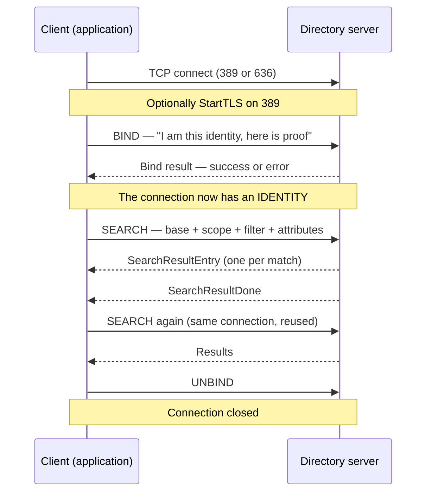
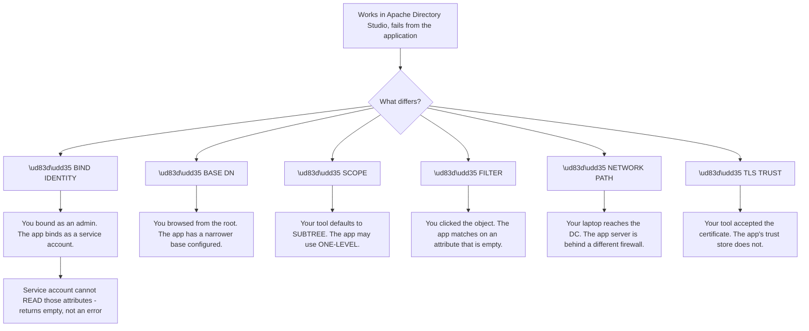
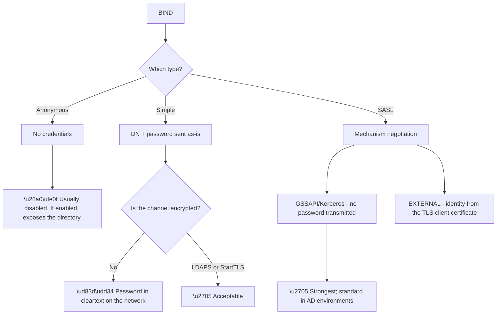
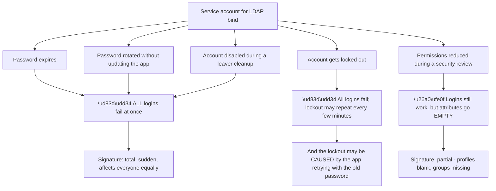
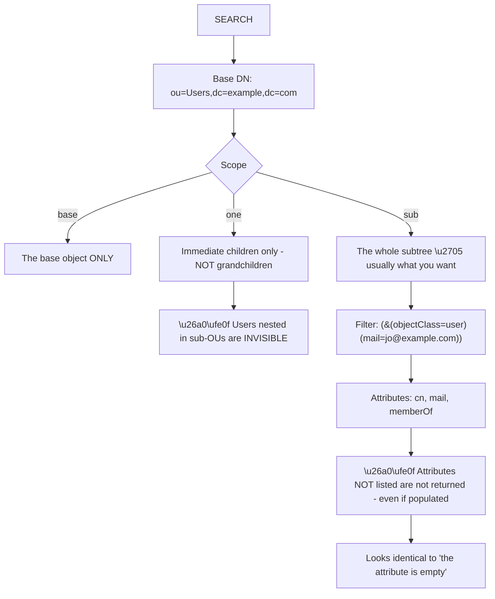
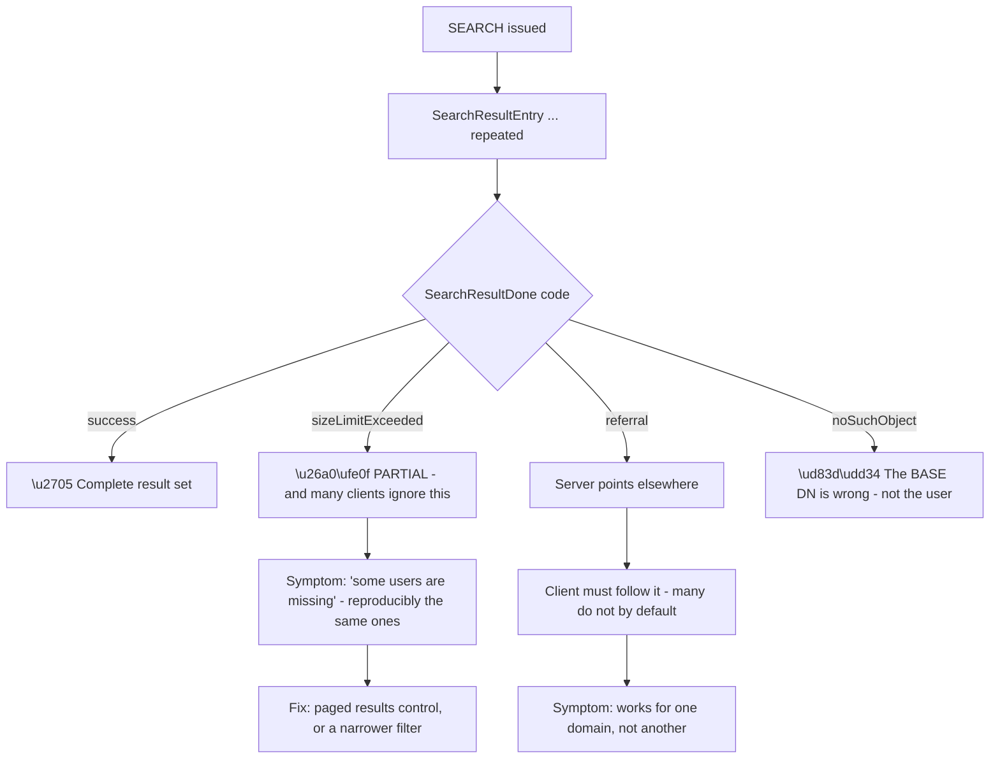
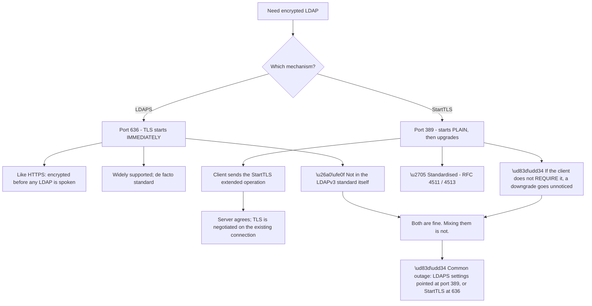
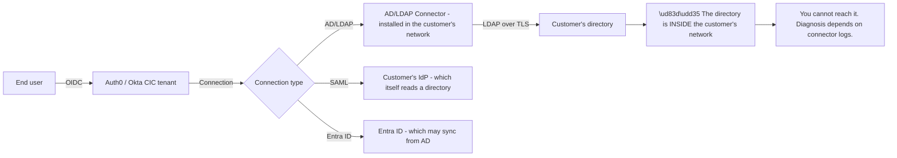
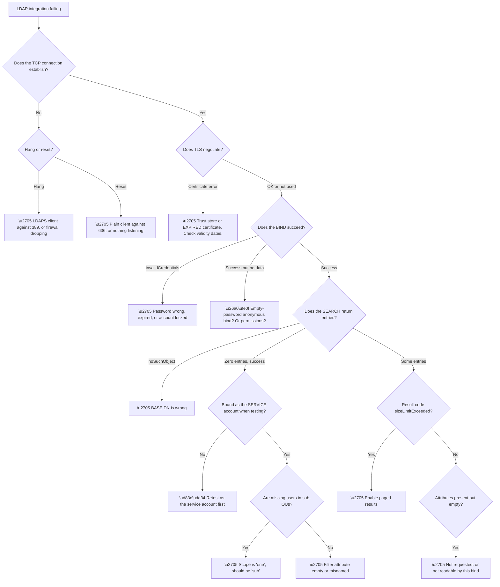

# Part 088 - The LDAP Protocol: Bind, Search, Filters, and Controls

> Section goal: Move from the directory *model* of Part 087 to the actual wire protocol — how a client connects, proves who it is, asks a question, and receives an answer — so that LDAP failures become readable rather than mysterious.

Covers index item **088**. Maps to JD signals: *LDAP*, *Active Directory*, *networking protocols*, *troubleshooting complex technical issues*, *TLS/SSL*.

---

## 1. Start From Zero: What LDAP Actually Is

**LDAP is a protocol, not a database.** That single distinction resolves a great deal of confusion, because people routinely say "we store users in LDAP" when they mean "we store users in a directory that speaks LDAP."

The Lightweight Directory Access Protocol defines **how a client asks a directory server questions over a network connection**. It is:

| Property | Detail |
|---|---|
| **Connection-oriented** | Runs over TCP — port **389** plain, **636** for LDAPS |
| **Session-based** | You connect, authenticate, run many operations, disconnect |
| **Binary** | Encoded with BER/ASN.1, not text like HTTP |
| **Asynchronous** | Multiple requests can be in flight, correlated by message ID |
| **Stateful** | The connection remembers who you bound as |

**Two structural facts drive most LDAP behaviour.**

**First: authentication and query are separate operations.** You bind *once*, then search many times. This is unlike HTTP, where every request typically carries its own credentials. It is why LDAP clients pool connections, and why an expired service-account password breaks *everything at once* rather than gradually.

**Second: the connection carries the identity.** What you can see in a search depends on who you bound as. **The same search, run as two different identities, legitimately returns different results** — and that is the single most common cause of "it works in my test tool but not from the application."

> 💡 **Tie-in to your background:** you have used Wireshark and network tooling on TCP protocols. LDAP is exactly the kind of protocol where a packet capture answers questions no log will — whether the bind succeeded, whether TLS was negotiated, and what the server actually returned.

### 🔍 Plain-English deep-dive: why "it works in my LDAP browser but not from the app" is the most common LDAP ticket

This complaint arrives constantly, and it has a small number of causes that a structured comparison eliminates quickly.

**The first branch is the highest-yield and the least obvious**, because of a property that catches people out: **LDAP access control returns empty results rather than access-denied errors.** A service account without permission to read an attribute does not get "permission denied" — it gets an entry with that attribute absent, exactly as though it were unpopulated.

| What you see | What it might actually mean |
|---|---|
| Attribute missing | Not populated **or** not readable by this bind identity |
| Zero results | No match **or** no read permission on that subtree |
| Partial results | Some entries readable, others not |

**That ambiguity is why the diagnostic instruction is always the same: bind as the application's own service account and run the application's own search.** Not an equivalent search as an administrator — the *same* search as the *same* identity. Everything else is guesswork.

**The sixth branch is a close second in frequency.** Graphical LDAP tools frequently offer to trust an unknown certificate with a single click, and people click it without registering that they have done so. The application, running headless with a proper trust store, cannot. **The tool's convenience feature hides the exact difference that matters** — and this is the same class of problem as Part 041's certificate-chain issues, just with no browser to show a padlock.

**Analogy:** two people asked to fetch a file from an archive. One has full clearance and finds it immediately; the other has restricted clearance and is told, quite politely, that no such file exists. The archive is not lying — that file does not exist *for them*. **Where it stops:** a person would probably say "I'm not allowed to see that." LDAP just returns nothing.

---

## 2. Bind: Proving Who You Are

The bind operation establishes the connection's identity. There are three kinds, and the differences matter.

| Bind type | What it sends | Use |
|---|---|---|
| **Anonymous** | Nothing | Public reads only; usually disabled |
| **Simple** | DN + password, **in the clear** | Common — but requires TLS |
| **SASL** | A pluggable mechanism (GSSAPI/Kerberos, DIGEST-MD5, EXTERNAL) | Stronger; no password on the wire |

**The red node is not theoretical.** A simple bind over port 389 without StartTLS puts a service-account password on the network in plaintext, readable by anyone capturing traffic. **This still exists in production more often than anyone would like**, and it is a legitimate finding to raise on any ticket where you see it.

**Two important bind subtleties:**

**Anonymous bind by accident.** In LDAP, a simple bind with a **DN but an empty password** is treated as *anonymous* by many servers — it does not fail. So a misconfiguration that supplies an empty password produces a *successful* bind with no privileges, and the application then sees empty results rather than an authentication error. **A "successful" bind that returns nothing is worth checking for exactly this.**

**Rebinding on the same connection.** Some applications bind as a service account, search for the user, then **rebind as that user** on the same connection to verify their password. That is a legitimate pattern — but it means the connection's identity changes mid-flow, which affects what subsequent searches can see. Connection pools and this pattern interact badly if the pool is not aware of it.

### 🔍 Plain-English deep-dive: the service-account bind is a fragile dependency

Almost every LDAP integration depends on one service account. That account is a **shared, long-lived, high-privilege credential** — and it has a predictable set of failure modes.

**The two signatures at the bottom are diagnostically distinct and worth separating.**

**Total and sudden, affecting everyone identically**, points at the bind itself — expired, locked, disabled, or rotated. Nothing user-specific can produce a uniform failure across an entire population.

**Partial — logins succeed but profiles are blank** — points at *permissions*, not authentication. The bind still works; it just cannot read what it used to. This follows security reviews and permission cleanups, and it is easy to miss because nothing looks broken from the authentication side.

**The lockout loop in the last node is worth naming explicitly.** An application configured with an old password retries automatically, and those retries count toward the lockout threshold. **The account then locks, unlocks, and locks again**, producing an intermittent failure that looks like instability. The clue is a lockout that recurs on a regular interval matching the application's retry schedule — and the fix is to stop the application before unlocking the account, or the cycle simply repeats.

| Preventive practice | Why |
|---|---|
| Exempt the account from password expiry, with compensating controls | Removes the most common cause |
| Grant read-only, least-privilege access | Limits blast radius |
| Document the account and its consumers | So a cleanup does not disable it blindly |
| Monitor bind failures | Detects rotation problems before users do |
| Use a certificate or Kerberos identity where possible | No password to expire |

**Analogy:** a building where every visitor is escorted by the same single receptionist. When she is off sick, nobody gets in — not some people, everybody. **Where it stops:** a colleague could cover. A hard-coded credential has no stand-in.

---

## 3. Search: Base, Scope, Filter, Attributes

A search operation has four parameters, and **every one of them can silently produce zero results.**

| Parameter | What it controls | Failure if wrong |
|---|---|---|
| **Base DN** | Where the search starts | Searching the wrong subtree → nothing |
| **Scope** | How deep it goes | Too shallow → nothing |
| **Filter** | Which entries match | Wrong attribute → nothing |
| **Attributes** | Which fields to return | Not requested → appears empty |

**The two warning nodes are the quiet killers.**

**Scope `one` versus `sub`** breaks the moment an organisation adds sub-OUs. It works on day one when all users sit directly under `ou=Users`, and stops working for the users who get moved into `ou=Users/ou=Contractors` — **a subset failure that looks arbitrary until you check the scope.**

**Unrequested attributes** are indistinguishable from empty attributes in the response. An application requesting `cn, mail` and then complaining that `department` is empty is not seeing an empty attribute — **it never asked for it.**

**Filter syntax** is prefix-notation and worth being fluent in:

| Filter | Meaning |
|---|---|
| `(cn=Jo Patel)` | Exact match |
| `(cn=Jo*)` | Starts with "Jo" |
| `(&(a=1)(b=2))` | AND |
| `(\|(a=1)(b=2))` | OR |
| `(!(a=1))` | NOT |
| `(mail=*)` | Attribute is present with any value |
| `(!(mail=*))` | Attribute is absent |
| `(objectClass=*)` | Everything |

**Prefix notation reads outward-in:** `(&(objectClass=user)(department=Sales))` is "AND of: is a user, and is in Sales."

**One filter needs a safety warning.** User input placed directly into a filter string enables **LDAP injection** — a value like `*)(objectClass=*` can turn a targeted lookup into a full enumeration. **Escape special characters (`( ) * \ NUL`) per RFC 4515, or use a library that parameterises filters.** This is the LDAP counterpart of SQL injection and belongs in any code review of a directory integration.

---

## 4. Results, Referrals, and Limits

A search does not simply return a list. It returns a **stream of entries followed by a completion result**, and several things can interrupt or truncate it.

| Result condition | Meaning |
|---|---|
| `success` (0) | Completed normally |
| `sizeLimitExceeded` (4) | **Partial results** — more matched than the limit allowed |
| `timeLimitExceeded` (3) | Server gave up |
| `adminLimitExceeded` (11) | Server-side administrative cap hit |
| `insufficientAccessRights` (50) | Explicit denial (less common than silent empties) |
| `referral` (10) | "Not here — ask that server" |
| `invalidCredentials` (49) | Bind failed |
| `noSuchObject` (32) | The **base DN** does not exist |

**`sizeLimitExceeded` deserves particular attention** because of how it fails. Active Directory's default limit is **1,000 entries**. A client that ignores the result code and processes only what it received will silently miss users — **and it will miss the same users every time**, because the server returns them in a consistent order. That reproducibility makes it look like a data problem rather than a limit problem.

**The correct solution is the paged results control** (`1.2.840.113556.1.4.319`), which requests results in batches with a cookie for the next page. **Any code that enumerates a directory without paging is incorrect at scale**, even if it currently works.

**`noSuchObject` is frequently misread.** It refers to the **base DN**, not the user being searched for. A missing user produces a *successful* search with zero entries; a wrong base DN produces `noSuchObject`. **Those two are diagnostically completely different**, and confusing them sends investigations in the wrong direction.

### 🔍 Plain-English deep-dive: LDAP over TLS, and the two ways to get there

Directory traffic carries credentials and personal data, so encryption is not optional. There are two mechanisms, they are often confused, and the confusion produces real outages.

**The mixing failure in the last node is a genuinely common configuration mistake**, and it presents unhelpfully: a connection that hangs, or resets, or reports a TLS error that mentions neither port nor mechanism. **The check is mechanical — port 636 means LDAPS, port 389 means plain or StartTLS — and it takes seconds to verify against the client's configuration.**

| Symptom | Likely cause |
|---|---|
| Connection hangs on connect | LDAPS client against a plain 389 listener |
| Immediate reset or protocol error | Plain client against a 636 listener |
| Connects but certificate error | Trust store missing the issuing CA |
| Works from a GUI tool, not from the app | GUI accepted the certificate interactively |
| Worked until a specific date | **Certificate expired** — Part 041 |

**The last row connects to a wider theme.** Domain controller certificates expire like any other, and when they do, **every LDAPS consumer fails simultaneously**. A total, sudden, date-correlated LDAP failure across multiple applications should put certificate expiry at the top of the list — and the same reasoning applies to SAML signing certificates (Part 081) and any other certificate-dated dependency.

**One thing never to recommend:** disabling certificate validation to "get it working." It converts an encrypted, authenticated channel into an encrypted channel with no assurance of *who* is on the other end, and it is exactly the configuration that makes an interception attack invisible. **The correct fix is always to install the issuing CA in the client's trust store.**

**Analogy:** two ways to hold a private conversation — book a soundproof room in advance (LDAPS), or start talking in the corridor and step into one mid-sentence (StartTLS). Both work. Booking a room and then standing in the corridor does not. **Where it stops:** people notice when they are still in the corridor. Software will happily continue in plaintext unless told to require the upgrade.

---

## 5. Where LDAP Appears in Customer Identity

LDAP rarely appears directly in a consumer-facing login. It appears **behind** the identity provider, which matters for how tickets present.

**The blue node changes how these tickets are worked.** The directory sits inside the customer's network, behind their firewall, and the identity platform reaches it through a **connector the customer installs and runs**. That means:

| Consequence | Practical effect |
|---|---|
| You cannot query the directory | Every directory fact comes from the customer |
| Connector logs are the primary evidence | Ask for them early |
| Network path problems are common | Firewall, DNS, proxy between connector and DC |
| The connector is a customer-side component | Its version, health, and restarts matter |
| Time zones and clocks apply | Kerberos and TLS both care |

**The first row is the practical reality**, and it shapes the questions worth asking: which DC does the connector target, what base DN and scope is configured, what identity does it bind as, and what does the connector log say about the last bind and search. **Those four answers resolve a large fraction of AD/LDAP connection tickets**, and none of them require access to the customer's network.

Part 101 covers the connection configuration itself; Part 095 covers the troubleshooting workflow end to end.

---

## 6. Failure Modes

| # | Failure mode | Symptom | Root cause | First check |
|---|---|---|---|---|
| 1 | Service account password expired | All logins fail at once | Credential rotation | When did it last change? |
| 2 | Service account locked | Intermittent, recurring failure | App retrying old password | Lockout events on a fixed interval? |
| 3 | Permissions reduced | Logins work, profiles blank | Read rights removed | Bind as the account and read the attribute |
| 4 | Wrong base DN | `noSuchObject` | Misconfiguration | Print the configured base |
| 5 | Scope too narrow | Some users invisible | `one` instead of `sub` | Are missing users in sub-OUs? |
| 6 | Attribute not requested | Field always empty | Not in the requested list | Check the attribute list |
| 7 | Size limit hit | Same users always missing | Default 1,000-entry cap | Is paging enabled? |
| 8 | Referral not followed | Works for one domain only | Client ignores referrals | Multi-domain forest? |
| 9 | Port/mechanism mismatch | Hang or reset on connect | LDAPS vs StartTLS confusion | Port 636 or 389? |
| 10 | Certificate expired | Total failure on a date | DC certificate lifetime | Check the certificate validity |
| 11 | Empty-password bind | "Success" but no data | Anonymous bind fallback | Is the password actually set? |
| 12 | LDAP injection | Unexpected result sets | Unescaped user input in filters | Is the filter parameterised? |

---

## 7. Troubleshooting Decision Tree: LDAP Failures

### Worked example

A customer reports that their AD/LDAP connection "stopped working for new employees." Existing employees sign in fine.

**The population split is the entire clue.** Nothing about credentials, certificates, or connectivity can distinguish new employees from existing ones — those are all-or-nothing. So the failure is in **where the directory is being searched**, not whether it can be searched.

**Walking the tree.** Connection establishes, TLS negotiates, bind succeeds, and search returns entries — just not the new ones. Following the "zero entries for these users" branch: the tester confirms they used the service account. The next question is whether the missing users sit in sub-OUs.

**They do.** The customer recently began placing new hires in `OU=Onboarding` beneath the main users OU while their paperwork completes. The connection is configured with scope `one`.

**Existing employees sit directly under the base DN and are found. New hires sit one level deeper and are invisible** — not denied, not erroring, simply outside the search.

**The fix** is scope `sub`. **The write-up point** is that this was a configuration limitation exposed by an organisational change, not a regression — nothing broke, the directory simply grew in a direction the search was not looking.

**What made it fast:** starting from the population split. **"Which users are affected, and what do they have in common?"** is the highest-yield opening question in directory troubleshooting, because directory failures partition along structural lines.

---

## 8. Lab: Query a Directory Over LDAP

**Purpose.** Run real LDAP operations against your own disposable directory, and reproduce the scope, attribute, and size-limit failures deliberately so you recognise them instantly.

**Prerequisites.**
- The lab directory from Part 087, still running (or recreated)
- `ldapsearch` (OpenLDAP client tools), or PowerShell, or a Python LDAP library
- **A personal machine.** Never point these commands at an employer or customer directory.

**Steps.**

1. **Run a basic search** with an explicit base, `sub` scope, and a simple filter. Confirm you get results and note the result code.
2. **Change scope to `one`** and re-run. Record which entries disappear and confirm they are the ones in sub-OUs.
3. **Request a limited attribute list** — just `cn`. Observe that `mail` is absent from the output even though it is populated. **Write down that this is indistinguishable from an empty attribute.**
4. **Search with a wrong base DN.** Record the exact error. Confirm it is `noSuchObject` and note that it refers to the base, not the user.
5. **Search for a user who does not exist**, with a correct base. Confirm you get `success` with zero entries — **a different outcome from step 4.**
6. **Bind with a DN but an empty password.** Record what happens. Note whether the server reports success.
7. **Enable StartTLS or connect over LDAPS**, and confirm the traffic is encrypted. If you have Wireshark, capture both a plain and an encrypted bind and compare what is visible.
8. **Create enough entries to exceed a small size limit** (or configure a low limit), run an unpaged search, and confirm the `sizeLimitExceeded` code with partial results.
9. **Write a one-page summary** mapping each observed error to its meaning.

**Expected evidence.**
- Output from `sub` versus `one` scope, showing the difference
- A `noSuchObject` error and a zero-result success, side by side
- A packet capture or note showing plaintext credentials versus encrypted traffic
- A `sizeLimitExceeded` result with partial entries
- Your one-page error-to-meaning summary

**Validation rubric.**

| Criterion | Pass |
|---|---|
| Search anatomy | You can state base, scope, filter, and attributes for any search |
| Error discrimination | You can explain `noSuchObject` versus zero results without hesitating |
| Silent failures | You can name three ways LDAP returns nothing without erroring |
| TLS | You can explain LDAPS versus StartTLS and identify which a config uses |
| Limits | You can explain why paging is mandatory at scale |
| Safety | Everything was local, fictional, and destroyed afterwards |

**Cleanup and privacy.** Destroy the container and volumes. **Delete any packet captures** — even lab captures build a habit worth keeping, and a capture containing a real bind would contain a real credential. Never run these commands against employer infrastructure, and never store directory output containing real names.

---

## 9. JD Mapping

| JD signal | How this Part addresses it |
|---|---|
| LDAP | The protocol itself: bind, search, controls, result codes |
| Active Directory | AD-specific limits, referrals, and matching rules |
| Networking protocols | TCP, ports, TLS negotiation, packet-level diagnosis |
| TLS/SSL | LDAPS versus StartTLS, trust stores, certificate expiry |
| Troubleshooting complex technical issues | Twelve failure modes and a full decision tree |
| Debugging tools | Packet capture and command-line LDAP clients |
| Enterprise connections | The connector model used by customer identity platforms |

---

## 10. Candidate Honesty Note

- **Production experience:** troubleshooting LDAP-backed authentication and Active Directory queries in enterprise support.
- **Production experience:** network-level diagnosis with Wireshark and related tooling on TCP protocols.
- **Lab experience:** running LDAP searches directly, reproducing scope and size-limit failures, and comparing plain versus TLS binds, as above.
- **Learned architecture:** the AD/LDAP connector model used by customer identity platforms, and paged-results implementation at scale.
- **No direct experience:** operating a customer identity platform's directory connector in production.
- **How to say it:** *"LDAP-backed authentication is something I've troubleshooted — service account issues, group lookups, connectivity. I hadn't worked hands-on with paged results or the connector architecture a CIAM platform uses, so I set up a local directory and worked through the search semantics and the failure codes directly."*

---

## 11. Official Source Anchors

| Source | Why | Accessed |
|---|---|---|
| RFC 4511 — LDAP: The Protocol | Bind, search, StartTLS, result codes | Accessed **26 August 2026** |
| RFC 4513 — LDAP Authentication Methods and Security Mechanisms | Bind types, TLS requirements | Accessed **26 August 2026** |
| RFC 4515 — LDAP String Representation of Search Filters | Filter syntax and required escaping | Accessed **26 August 2026** |
| RFC 2696 — LDAP Simple Paged Results Control | The paging mechanism | Accessed **26 August 2026** |
| Microsoft Learn — LDAP policies and limits in AD | Default size and time limits | Accessed **26 August 2026** |
| Auth0 Docs — Active Directory / LDAP Connector | Connector architecture and configuration | Accessed **26 August 2026** |

> **Revalidate:** RFCs are stable and can be trusted as written. Verify AD default limits and connector documentation before interview, since product defaults and installer behaviour change between versions.

---

## ⭐ Likely Interview Questions for This Section

### Q1. "Walk me through what happens when an application authenticates a user against LDAP."

> *Model answer:* The application opens a TCP connection to the directory server, on 389 or 636, and secures it — either LDAPS immediately, or StartTLS as an upgrade. It then binds as a service account, which establishes the connection's identity. Using that identity it searches for the user, with a base DN, a scope, and a filter matching whatever the user typed. If exactly one entry comes back, it takes that entry's DN and performs a second bind as the user with the supplied password. A successful bind means the password is correct. It then usually reads group memberships to determine authorisation. Two things are worth noting: the whole flow depends on the service account, and what the search can see depends on that account's read permissions.

### Q2. "A search returns no results but no error. What are the possibilities?"

> *Model answer:* Several, and they are all silent, which is what makes LDAP frustrating. The base DN could point at the wrong subtree — though if the base itself does not exist you would get `noSuchObject`, so a genuine zero-result means the base is valid but empty of matches. The scope could be too narrow, typically `one` when it should be `sub`, which hides anything in sub-OUs. The filter could reference an attribute that is not populated or is named differently. Or — and this is the one people miss — the bind identity may lack read permission on that subtree, in which case LDAP returns nothing rather than access denied. That is why I always retest using the application's own service account rather than an admin account.

### Q3. "What is the difference between LDAPS and StartTLS?"

> *Model answer:* LDAPS runs on port 636 and negotiates TLS immediately on connection, the way HTTPS does, so nothing is ever spoken in the clear. StartTLS runs on the normal port 389, begins as a plaintext connection, and then issues an extended operation to upgrade to TLS in place. StartTLS is the standardised approach in RFC 4511; LDAPS is not formally in the LDAPv3 standard but is very widely deployed. Both are acceptable. The failure I see most often is mixing them — configuring an LDAPS client against port 389, which typically hangs, or a plain client against 636, which resets. Checking the port against the mechanism is a five-second diagnostic.

### Q4. "An LDAP integration works for most users but always misses the same ones. What do you suspect?"

> *Model answer:* Two strong candidates. The first is a size limit — Active Directory defaults to a thousand entries, and a client that ignores the `sizeLimitExceeded` result code processes only what it received. Because the server returns results in a stable order, it misses the same users every time, which makes it look like a data problem. The fix is the paged results control. The second candidate is scope: if the search uses `one` rather than `sub`, users in sub-OUs are permanently invisible. I would distinguish them by asking where the missing users sit in the tree and by checking whether the result code is actually being read.

### Q5. "Why is the service account such a common source of LDAP outages?"

> *Model answer:* Because it is a single shared credential that everything depends on, and it is subject to normal account lifecycle. Its password expires, it gets rotated without updating the application, it gets caught in a leaver cleanup, or its permissions get trimmed in a security review. The signatures differ usefully: expiry, rotation, or disablement produce a total, sudden failure affecting everyone equally, because nothing user-specific can fail uniformly. Reduced permissions produce a subtler failure where logins still succeed but attributes come back empty. There is also a nasty loop where an application retrying an old password keeps re-locking the account, which presents as intermittent instability — you have to stop the application before unlocking it.

### Q6. "How would you prevent LDAP injection?"

> *Model answer:* By never concatenating user input into a filter string. LDAP filters have special characters — parentheses, asterisk, backslash, and NUL — and RFC 4515 defines the escaping for them. A value like `*)(objectClass=*` inserted into a filter can turn a targeted lookup into a full directory enumeration, which is the same class of problem as SQL injection. The right approach is a library that builds filters safely with parameterised values, or explicit escaping applied to every untrusted value. I would also apply defence in depth: the bind account should be least-privilege and read-only, so even a successful injection is limited in what it can reach.

### Q7. "A customer's AD/LDAP connection is failing and you cannot reach their directory. How do you proceed?"

> *Model answer:* The directory sits inside their network behind a connector they run, so every directory fact has to come from them — which means asking precise questions rather than vague ones. I would establish four things: which domain controller the connector targets, what base DN and scope are configured, what identity it binds as, and what the connector's own logs say about the most recent bind and search. Those four answers resolve most of these tickets. On top of that I would check the connector's version and whether it was recently restarted, and confirm the network path — firewall rules, DNS resolution of the DC, and any proxy in between. The connector logs are the primary evidence and I would ask for them early rather than after several rounds of questions.

### Q8. "What does it mean that LDAP is stateful, and why does it matter?"

> *Model answer:* The connection carries an identity established by the bind, and that identity persists across every subsequent operation on that connection. It matters in three ways. First, what a search returns depends on who bound, so the same search run by two identities legitimately gives different answers — which is why reproducing a problem requires binding as the application's own account. Second, applications pool connections for efficiency, so a pattern like rebinding as the end user to verify their password changes the connection's identity mid-flow and interacts badly with pooling unless handled explicitly. Third, it means a single credential failure takes down every operation at once rather than degrading gradually, which is why service-account outages are so total.

---

## 🧠 30-Second Memory Hooks

- **LDAP is a protocol; the directory is the store.**
- **389 = plain or StartTLS. 636 = LDAPS. Mixing them hangs or resets.**
- **Bind sets the connection's identity — results depend on it.**
- **LDAP returns *empty*, not *denied*.** Retest as the service account.
- **`noSuchObject` = wrong base DN. Zero entries with success = no matching user.**
- **Scope `one` hides sub-OUs.** Scope `sub` is usually what you want.
- **Unrequested attributes look identical to empty attributes.**
- **AD default 1,000-entry limit → always page.**
- **Service account failure = total and sudden. Permission loss = blank profiles.**
- **Opening question: "which users are affected, and what do they share?"**

---

## ✅ Completion Checklist

- [ ] I can describe a full LDAP authentication flow from connect to group read
- [ ] I can name the four search parameters and how each fails silently
- [ ] I can distinguish `noSuchObject` from a zero-result success
- [ ] I can explain LDAPS versus StartTLS and diagnose a mismatch by symptom
- [ ] I can explain why LDAP returns empty results instead of permission errors
- [ ] I can explain size limits and why paging is required
- [ ] I can describe LDAP injection and its prevention
- [ ] I have completed the lab and reproduced the scope and limit failures
- [ ] I can state honestly what LDAP work I have done and what I have not

*Next suggested section:* **[Part 089 - Active Directory: Domains, Forests, Kerberos, NTLM, and Group Policy](Part-089-active-directory-domains-forests-kerberos-ntlm-group-policy.md)** — the most widely deployed directory in the enterprise, and the authentication protocols that make it behave unlike plain LDAP.
