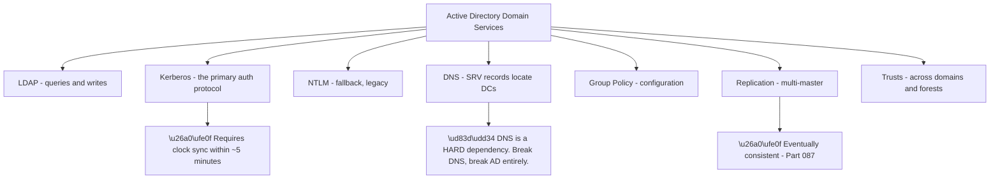
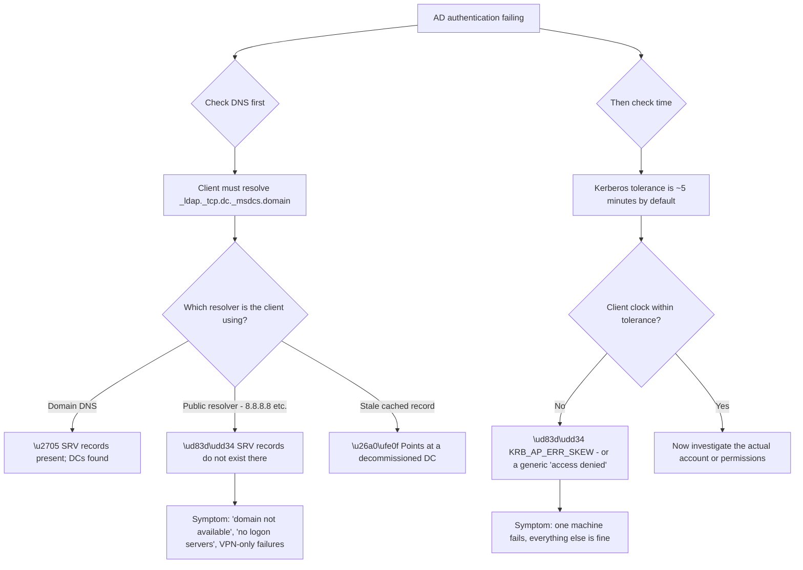
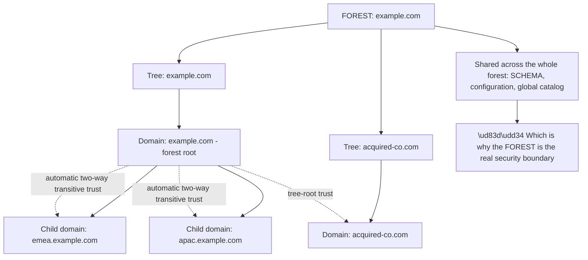
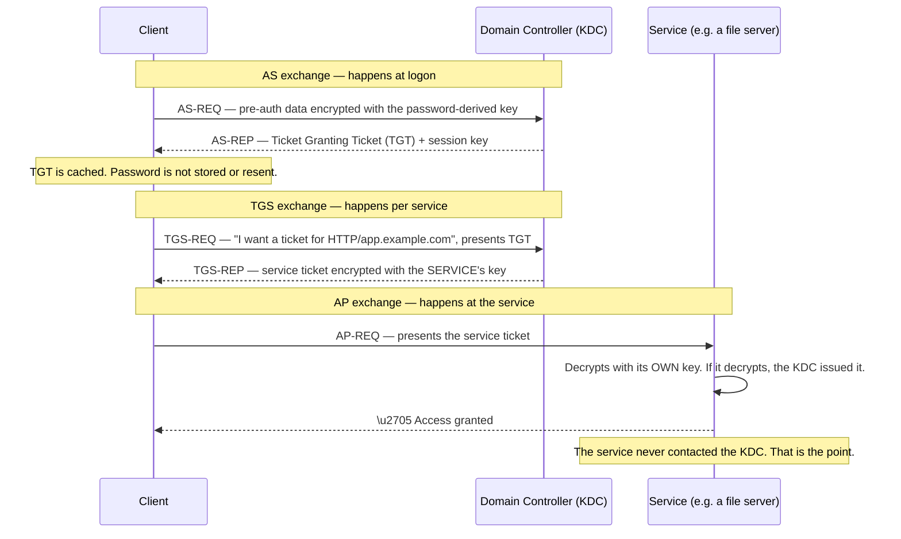
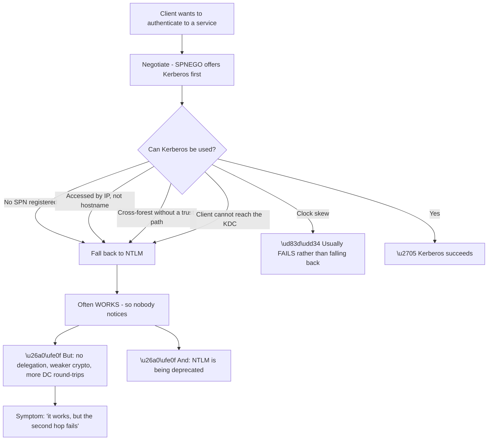
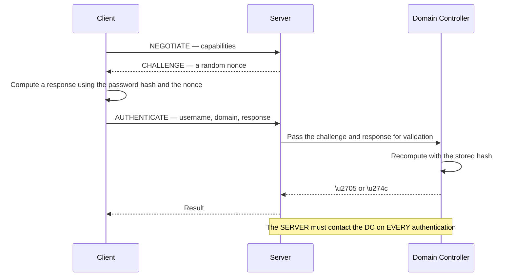
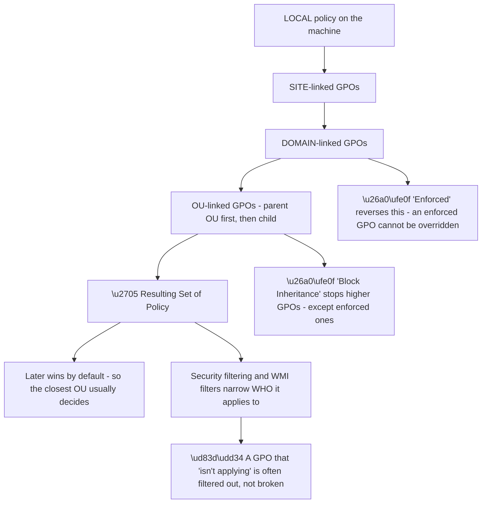
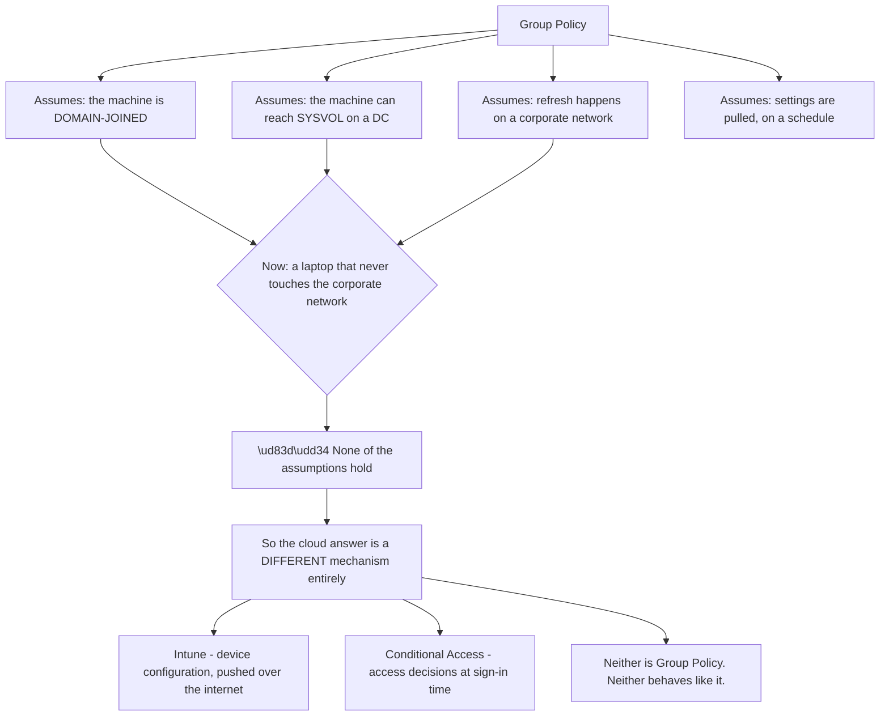
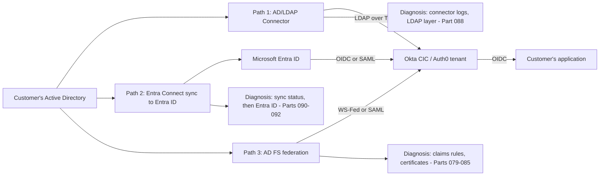
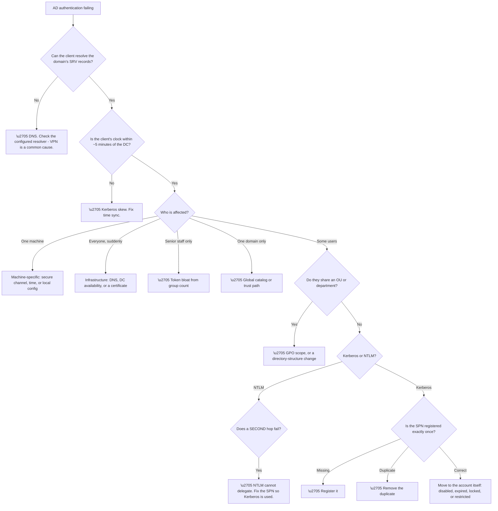

# Part 089 - Active Directory: Domains, Forests, Kerberos, NTLM, and Group Policy

> Section goal: Understand the directory that most enterprise customers actually run — its domain and forest structure, the two authentication protocols it uses, and the policy engine layered on top — so that "we authenticate against AD" becomes a precise statement rather than a vague one.

Covers index item **089**. Maps to JD signals: *Active Directory*, *Group Policy*, *identity and access management*, *authentication and authorization*, *networking protocols*, *troubleshooting complex technical issues*.

---

## 1. Start From Zero: What Active Directory Adds to LDAP

Active Directory speaks LDAP, but it is considerably more than an LDAP server. It bundles several services together, and knowing which service is failing is half of any AD diagnosis.

| Component | What it provides |
|---|---|
| **Directory (LDAP)** | The object store from Parts 087–088 |
| **Kerberos KDC** | Ticket-based authentication |
| **NTLM** | Legacy challenge-response authentication |
| **DNS integration** | Service location — how clients *find* domain controllers |
| **Group Policy** | Centralised configuration enforcement |
| **Replication** | Multi-master synchronisation between DCs |
| **Trusts** | Cross-domain and cross-forest authentication |

**The DNS node is the single most important fact about AD operations.** Clients do not have domain controller addresses configured — they **discover** them by querying DNS for SRV records such as `_ldap._tcp.dc._msdcs.example.com`. If DNS is wrong, misconfigured, or pointing at a public resolver instead of the domain's own, **nothing in Active Directory works** — and the symptoms look like everything except a DNS problem.

**The Kerberos clock node is the second.** Kerberos rejects tickets outside a tolerance window, five minutes by default. **A machine with a wrong clock cannot authenticate at all**, and the error rarely mentions time.

> 💡 **Tie-in to your background:** you have worked with Active Directory and Group Policy directly, and with DNS and DHCP. The DNS-underpins-AD relationship is one you will have seen in practice — and being able to say "the first thing I check on an AD authentication problem is DNS and time" is a credible, experience-grounded answer.

### 🔍 Plain-English deep-dive: why DNS and time are the top two causes of AD failure

Two infrastructure dependencies cause a disproportionate share of AD problems, and both produce misleading symptoms.

**The DNS symptom set is deceptive** because none of the messages mention DNS. "No logon servers are available," "the trust relationship failed," "the domain is not available" — all of these are downstream of a client that could not find a domain controller. **The VPN correlation in node A5 is a particularly good tell:** a laptop that works in the office and fails on VPN is very often getting a public DNS resolver from the VPN configuration.

**The time symptom is equally deceptive** and has a distinctive shape: **one machine fails while everything else is fine.** Nothing about the directory, the account, or the network is wrong — the machine's own clock has drifted, or its time source is unreachable, or it is set to the wrong time zone with a correct local reading. Virtual machines resumed from a snapshot are a classic case.

| Symptom | DNS? | Time? |
|---|---|---|
| "No logon servers available" | ✅ Very likely | Possible |
| Works in office, fails on VPN | ✅ Very likely | Unlikely |
| One machine only | Possible | ✅ Very likely |
| After a VM was resumed or restored | Possible | ✅ Very likely |
| Everyone, everywhere, suddenly | ✅ If DNS broke | Unlikely |
| Intermittent, some DCs only | ✅ Stale SRV records | Possible |

**The practical rule that follows:** on any AD authentication ticket, **establish DNS and time before anything else**, because both are cheap to check and both produce symptoms that will otherwise send you looking at accounts and permissions for hours.

**Analogy:** a postal system where the address book is DNS and the appointment times are Kerberos. Wrong address book and letters go nowhere, though the complaint will be "my post isn't arriving." Wrong clock and you turn up when the office is shut, though the complaint will be "they wouldn't let me in." **Where it stops:** a person would notice they were an hour early. A computer just gets refused and reports something unrelated.

---

## 2. Domains, Trees, Forests, and Trusts

AD's structure has three nested levels, and the terms are used loosely in practice — which causes real confusion when discussing federation scope.

| Unit | What it is | Boundary for |
|---|---|---|
| **Domain** | A security and replication boundary with its own DCs | Account policies, replication |
| **Tree** | Domains sharing a contiguous DNS namespace | Naming |
| **Forest** | One or more trees sharing a schema and configuration | **Schema, global catalog, ultimate security boundary** |

**The bottom node states the fact most often gotten wrong.** People treat the *domain* as the security boundary because it holds account policies. **It is not.** Within a forest, schema and configuration are shared and trusts are automatic and transitive, so compromise of one domain has forest-wide implications. **The forest is the security boundary.** This matters when a customer says "we've isolated that in a separate domain" — it is worth clarifying whether they mean a separate domain or a separate forest.

**Trusts** determine who can authenticate where:

| Trust property | Meaning |
|---|---|
| **Direction** | One-way or two-way — A trusts B does not mean B trusts A |
| **Transitivity** | Transitive trusts chain; external trusts typically do not |
| **Forest trust** | Between forest roots; can be transitive within each forest |
| **Selective authentication** | Restricts *which* principals may authenticate across it |

**Trust direction is counterintuitive and worth stating carefully.** If domain A **trusts** domain B, then **B's users can access A's resources** — the trusting domain accepts the trusted domain's authentication. People consistently get this backwards, and it produces conversations at cross purposes.

**Global catalog** deserves a mention because it explains a specific failure. It holds a **partial replica of every object in the forest** — enough attributes to find things across domains — and it listens on **ports 3268 (plain) and 3269 (SSL)**. An application that needs forest-wide search must query the global catalog port, not the normal LDAP port. **Querying 389 in a multi-domain forest returns only that domain's objects**, which presents as "we can find users from one domain but not the others."

---

## 3. Kerberos: Tickets, Not Passwords

Kerberos is AD's primary authentication protocol, and its central idea is that **your password is used once, locally, and never sent to the resource you are accessing.**

**The final note is Kerberos's key property.** The service validates the ticket **offline**, using its own long-term key. It does not call the domain controller. That is what makes Kerberos scale — and it is also why a service's key being out of sync with the directory breaks authentication in a way that looks like a network problem but is not.

Three concepts carry most of the operational weight:

| Concept | What it is | Failure it causes |
|---|---|---|
| **SPN** (Service Principal Name) | The service's identity: `HTTP/app.example.com` | Missing or duplicate → falls back to NTLM, or fails |
| **PAC** (Privilege Attribute Certificate) | Group memberships embedded in the ticket | Grows with membership → token bloat (Part 087) |
| **Delegation** | A service acting on the user's behalf onward | Misconfigured → "double hop" failures |

**SPN problems are the classic Kerberos ticket.** The client asks the KDC for a ticket for a specific SPN. If that SPN is not registered, the KDC cannot issue a ticket, and the client typically **falls back to NTLM** — which often still works, so nobody notices until something requires Kerberos specifically. **A duplicate SPN is worse**: registered against two accounts, the KDC cannot determine which key to encrypt with, and authentication fails outright with an error that names neither the SPN nor the duplication.

### 🔍 Plain-English deep-dive: why Kerberos silently becomes NTLM, and why that matters

The fallback from Kerberos to NTLM is quiet by design, which makes it a persistent source of confusion.

**Node "accessed by IP" is the most common accidental trigger.** SPNs are hostname-based. Browsing to `https://10.0.0.5/` instead of `https://app.example.com/` means no SPN can be constructed, so Kerberos is impossible and NTLM takes over. **The same application, reached two ways, uses two different protocols** — which explains a surprising number of "it works with the IP but not the name" reports, and their inverse.

**The double-hop symptom in the final node is the practical consequence worth knowing.** NTLM cannot delegate. So a web application that authenticates the user with NTLM and then tries to reach a database *as that user* fails at the second hop — the user's identity cannot be forwarded. **Kerberos with delegation configured can do this; NTLM fundamentally cannot.** The signature is "the website loads and shows my name, but the data doesn't."

| Question | Why it discriminates |
|---|---|
| Hostname or IP in the URL? | IP forces NTLM |
| Is the site in the browser's Intranet zone? | Controls whether credentials are sent automatically |
| Does a second hop fail? | Strongly suggests NTLM |
| Is the SPN registered, and only once? | The direct check |
| Cross-forest? | Trust path required |

**Why it matters increasingly:** NTLM is on a deprecation path, and environments hardening against it will find that things which "worked fine" were quietly depending on it. **Identifying silent NTLM fallback before it is disabled is genuinely valuable work.**

**Analogy:** a building with a fast electronic pass system and an old sign-in book. If the pass reader cannot identify the door, you sign the book instead and get in anyway — so nobody reports a fault. Then someone removes the book. **Where it stops:** the book at least records that it was used. Silent NTLM fallback leaves no obvious trace to the user at all.

---

## 4. NTLM: The Legacy Fallback

NTLM is a challenge-response protocol that predates Kerberos in Windows and remains in wide use.

**The final note is the structural difference from Kerberos**, and it has three consequences:

| Consequence | Detail |
|---|---|
| **Scales poorly** | Every authentication is a DC round-trip |
| **DC availability is critical** | No DC reachable, no NTLM authentication |
| **No delegation** | The server cannot forward the user's identity |

**NTLM's security properties are also weaker** — it is vulnerable to relay attacks, and pass-the-hash means possession of a password hash is equivalent to possession of the password. Environments increasingly restrict or audit it, and Microsoft has stated a direction of deprecation.

**For support purposes, the practical point is diagnostic:** knowing whether a flow used Kerberos or NTLM tells you what is possible. **If it used NTLM, delegation is off the table**, and any second-hop problem is explained.

---

## 5. Group Policy

Group Policy applies configuration to users and computers based on where they sit in the directory tree — which is one of the clearest payoffs of the tree structure from Part 087.

**The order is LSDOU** — Local, Site, Domain, OU — and it is worth memorising because it determines which setting wins.

**The two exceptions invert it**, and together they are why real environments become hard to reason about. *Enforced* makes a higher-level GPO immune to override; *Block Inheritance* makes a lower-level OU ignore higher GPOs — **except enforced ones**, which still apply. An environment using both extensively has a policy outcome that genuinely cannot be predicted by reading the links alone.

**Which is why the tooling matters:** `gpresult /h report.html` and the Group Policy Results wizard show the **actual** resulting set of policy for a specific user on a specific machine, including which GPOs were applied, which were filtered out, and why. **On any "this policy isn't applying" question, that report is the answer**, and reasoning about it from the console is not.

| Common cause | How the report reveals it |
|---|---|
| Security filtering excludes the user | GPO listed as denied, with the reason |
| WMI filter did not match | GPO listed as filtered out |
| Block Inheritance | Higher GPOs absent |
| Applied but overridden | Shows the winning GPO for that setting |
| Not refreshed yet | Timestamps show the last refresh |
| Loopback processing | User settings coming from the *computer's* OU |

**Loopback processing** in the last row is the one that most often produces a genuinely baffling result: it makes user settings come from the **computer's** OU rather than the user's, which is intentional for kiosks and shared machines and completely surprising if you do not know it is enabled.

> 💡 **Tie-in to your background:** Group Policy is on your CV. Being able to explain LSDOU, the enforced/blocked interaction, and why `gpresult` is the arbiter is a strong, concrete demonstration of directory experience that is hard to fake.

### 🔍 Plain-English deep-dive: Group Policy is the concept that does **not** cross into the cloud

Group Policy is worth understanding precisely because it marks a boundary. **It is the AD capability with no cloud equivalent**, and recognising that saves a great deal of unproductive conversation.

**The four assumptions are the whole story.** Group Policy is a *pull* model: the machine reaches out to SYSVOL on a domain controller, on a schedule, over a trusted network. **A laptop that is Entra-joined and never touches the corporate network satisfies none of that**, so there is nothing to pull from and no schedule that fires.

| Group Policy property | Cloud equivalent | Same behaviour? |
|---|---|---|
| Pulled from SYSVOL on a schedule | Intune pushes over the internet | ❌ Different timing model |
| Scoped by OU | Scoped by group assignment | ❌ No OUs exist |
| LSDOU precedence | Intune conflict resolution | ❌ Different rules |
| Applies at refresh | CA applies at **sign-in** | ❌ Completely different moment |
| Configures the machine | CA decides **access** | ❌ Different purpose entirely |

**Every row is a mismatch**, which is why "can you just put a GPO on it?" has no answer in a cloud-only environment — and why the honest response is to ask what outcome is wanted, then map it to whichever cloud mechanism actually produces it.

**The row that matters most is the fourth.** Group Policy configures a machine and applies at refresh; Conditional Access evaluates at the **moment of sign-in** and decides whether access is granted at all. **Those are not the same kind of control**, and treating Conditional Access as "Group Policy for the cloud" leads to genuinely wrong expectations — including the belief that a policy change will take effect on a schedule, when in fact it takes effect on the next sign-in.

**Hybrid environments have both**, which is the hardest case: a domain-joined, Entra-registered device gets Group Policy *and* Intune *and* Conditional Access, and reconciling three overlapping control planes is a real operational problem rather than a misunderstanding.

**Analogy:** rules posted on the wall of a building, versus a decision made at the door each time you arrive. The posted rules configure how things work inside; the door decision determines whether you get in at all. **Where it stops:** you can read the wall. Nobody can read the door's reasoning without the sign-in log.

---

## 6. How AD Reaches a Customer Identity Platform

AD is almost never directly exposed to a consumer identity flow. It arrives through one of three paths, and knowing which one changes the diagnosis entirely.

**Each path fails differently, and the first question on any "we use AD" ticket is which one is in play:**

| Path | Characteristic failures |
|---|---|
| **Connector** | Bind, base DN, scope, network path, connector health |
| **Entra Connect** | Sync delay, filtered objects, attribute mapping, soft-match |
| **AD FS** | Claims rules, certificate rollover, endpoint availability |

**"We authenticate against Active Directory" is therefore an incomplete statement**, and asking which path is in use is not pedantry — it determines whether you are looking at LDAP, at directory synchronisation, or at SAML claims rules. Parts 090–095 cover each in turn.

---

## 7. Failure Modes

| # | Failure mode | Symptom | Root cause | First check |
|---|---|---|---|---|
| 1 | Wrong DNS resolver | "No logon servers available" | Client cannot find SRV records | Which DNS server is configured? |
| 2 | Stale SRV records | Intermittent, some clients | Decommissioned DC still listed | Compare SRV records to live DCs |
| 3 | Clock skew | One machine fails, others fine | Outside Kerberos tolerance | Compare client and DC time |
| 4 | Missing SPN | Silent NTLM fallback; double hop fails | SPN not registered | `setspn -L` on the service account |
| 5 | Duplicate SPN | Hard authentication failure | Registered twice | `setspn -X` |
| 6 | Accessed by IP | Kerberos impossible | SPNs are hostname-based | Is the URL a hostname? |
| 7 | Token bloat | Fails for senior staff only | PAC size from group count | Count group memberships |
| 8 | Global catalog not used | Users found in one domain only | Querying 389 in a multi-domain forest | Is the port 3268/3269? |
| 9 | Trust direction misunderstood | Cross-domain access denied | Trust is one-way the other way | Which domain trusts which? |
| 10 | GPO filtered out | "Policy not applying" | Security or WMI filtering | `gpresult /h` |
| 11 | Loopback processing | Unexpected user settings | Settings from the computer's OU | Is loopback enabled? |
| 12 | Replication lag | Transient inconsistency | Multi-master async replication | Does it resolve on retry? |

---

## 8. Troubleshooting Decision Tree: AD Authentication Failures

### Worked example

A customer reports that an internal web application "stopped working" for users on a new VPN client. The office network is fine.

**The correlation is with the VPN, not with users or the application.** That immediately puts DNS at the top — VPN clients commonly push their own DNS configuration.

**Node B confirms it partially.** The clients *can* resolve the domain, so basic name resolution works. But checking the specific SRV records shows the VPN's DNS server resolves public names correctly and returns nothing for `_ldap._tcp.dc._msdcs.example.com`. **It is a public resolver, and the internal SRV records do not exist there.**

**But there is a second layer.** Once DNS is corrected, the application loads but the reports page fails — a partial recovery that would be easy to declare a success and close.

**Following the tree further.** The application is now reached by hostname, and authentication succeeds. The reports page hits a database as the user. The second hop fails. **Node F1: NTLM cannot delegate.**

**Why NTLM?** Because the VPN users reach the application through a different hostname than office users — an alias that has no SPN registered. **The office hostname has an SPN; the VPN alias does not.** Kerberos is impossible via that name, so NTLM takes over, and delegation dies with it.

**The fix** is to register the SPN for the alias. **The write-up point** is that one root cause — an incomplete network configuration for a new access path — produced two distinct symptoms at two different layers, and stopping after the first fix would have left a real problem in place.

**What made it findable:** noticing that the recovery was *partial*. **A fix that improves things without fully resolving them is a signal that there is more than one cause**, and it is worth resisting the temptation to close.

---

## 9. Lab: Explore Kerberos and Group Policy Concepts Safely

**Purpose.** Build practical familiarity with SPNs, ticket inspection, and policy resolution — using either a disposable lab domain or, where you have legitimate access, read-only commands on your own account.

**Prerequisites.**
- **Option A (preferred):** a disposable Windows Server lab domain in a local hypervisor, with fictional data
- **Option B:** read-only commands on your own corporate machine — **only commands that inspect your own session**
- **Never** run commands that modify directory objects, register SPNs, or change policy on any system you do not own

**Steps.**

1. **List your current Kerberos tickets** with `klist`. Identify the TGT (`krbtgt/...`) and any service tickets. Note the start and end times.
2. **Note the ticket lifetime.** Observe that it is finite — typically ten hours — and that renewal is a separate property.
3. **Purge and re-acquire** (lab only): `klist purge`, then access a resource, then `klist` again to see the new ticket appear.
4. **Inspect an SPN** (lab only): use `setspn -L <account>` to list SPNs on a service account, and `setspn -X` to check for duplicates forest-wide. **Do not register or remove anything outside your own lab.**
5. **Force NTLM deliberately** (lab only): access the same web resource by IP address instead of hostname, and confirm via `klist` that no service ticket was issued.
6. **Generate a policy report:** `gpresult /h report.html` on your own machine. Open it.
7. **Read the report properly.** Identify: which GPOs applied, which were denied and why, and — for one specific setting — which GPO won.
8. **Find a filtered GPO** in the report and note the stated reason. If none is filtered, note that too.
9. **Write a short summary** connecting what you saw to LSDOU and to the Kerberos ticket lifecycle.

**Expected evidence.**
- `klist` output before and after acquiring a service ticket
- A note recording that IP access produced no Kerberos ticket
- A `gpresult` HTML report with the applied, denied, and winning GPOs identified
- Your written summary

**Validation rubric.**

| Criterion | Pass |
|---|---|
| Kerberos flow | You can narrate AS, TGS, and AP exchanges without notes |
| Tickets | You can read `klist` output and explain each ticket's purpose |
| SPNs | You can explain what breaks when one is missing and when one is duplicated |
| Fallback | You can explain why IP access forces NTLM and what that costs |
| Group Policy | You can explain LSDOU and read a `gpresult` report |
| Safety | You made no changes to any system you do not own |

**Cleanup and privacy.** Delete the lab domain and its snapshots. **Delete the `gpresult` report** — it contains your employer's internal policy configuration, GPO names, and OU structure, which must never be shared, screenshotted into notes, or included in an interview conversation. **Describe what you learned; never show the artefact.** All SPN and ticket manipulation must stay in the disposable lab.

---

## 10. JD Mapping

| JD signal | How this Part addresses it |
|---|---|
| Active Directory | Domains, forests, trusts, global catalog, replication |
| Group Policy | LSDOU, filtering, enforcement, `gpresult` |
| Authentication and authorization | Kerberos and NTLM in full |
| Networking protocols | DNS SRV dependency, ports, DC discovery |
| Troubleshooting complex technical issues | Twelve failure modes, decision tree, two-layer worked example |
| Root cause analysis | The example distinguishes a partial fix from a complete one |
| Enterprise connections | Three paths from AD into a customer identity platform |

---

## 11. Candidate Honesty Note

- **Production experience:** Active Directory and Group Policy in an enterprise environment, including troubleshooting access and policy issues.
- **Production experience:** DNS troubleshooting, which is the foundation of AD service location.
- **Lab experience:** inspecting Kerberos tickets, observing NTLM fallback, and reading a resulting-set-of-policy report deliberately, as above.
- **Learned architecture:** forest trust design, selective authentication, and delegation configuration at scale.
- **No direct experience:** designing an AD forest, configuring constrained delegation in production, or running an AD FS farm.
- **How to say it:** *"Active Directory and Group Policy are on my CV because I've supported them — DNS-related logon failures, policy not applying, group-based access. Kerberos internals like SPN registration and delegation I've studied and labbed rather than administered, and I'd say that plainly rather than overclaim."*

---

## 12. Official Source Anchors

| Source | Why | Accessed |
|---|---|---|
| RFC 4120 — The Kerberos Network Authentication Service (V5) | AS, TGS, and AP exchanges | Accessed **26 August 2026** |
| Microsoft Learn — Kerberos authentication overview | Windows implementation, SPNs, delegation | Accessed **26 August 2026** |
| Microsoft Learn — NTLM overview and deprecation guidance | Challenge-response flow and direction of travel | Accessed **26 August 2026** |
| Microsoft Learn — Group Policy processing and precedence | LSDOU, enforcement, filtering, loopback | Accessed **26 August 2026** |
| Microsoft Learn — Domain and forest trusts | Direction, transitivity, selective authentication | Accessed **26 August 2026** |
| Auth0 Docs — Active Directory / LDAP Connector | How AD reaches a customer identity tenant | Accessed **26 August 2026** |

> **Revalidate:** RFC 4120 is stable. Microsoft's NTLM deprecation guidance and Group Policy tooling change between Windows Server releases — confirm current status on Microsoft Learn before interview, particularly anything about NTLM being disabled by default.

---

## ⭐ Likely Interview Questions for This Section

### Q1. "What are the first two things you check on an Active Directory authentication failure?"

> *Model answer:* DNS and time, in that order, because both are cheap to check and both produce symptoms that mention neither. Clients discover domain controllers through DNS SRV records, so a client using a public resolver — which happens constantly on VPN connections — cannot find a DC at all, and reports "no logon servers available" or "the domain is not available." Then Kerberos rejects tickets outside roughly a five-minute clock tolerance, and a machine with a drifted clock fails with an error that usually looks like access denied. The tell for time is that it affects one machine while everything else works, which nothing about accounts or permissions can produce.

### Q2. "Explain the Kerberos exchanges."

> *Model answer:* Three exchanges. The AS exchange happens at logon: the client proves knowledge of the password to the KDC and receives a Ticket Granting Ticket plus a session key, which are cached. The TGS exchange happens per service: the client presents its TGT and asks for a ticket for a specific service principal name, and the KDC returns a service ticket encrypted with that service's own long-term key. The AP exchange happens at the service: the client presents the ticket, and the service decrypts it with its own key. If it decrypts, the KDC must have issued it. The important property is that the service never contacts the domain controller — validation is offline, which is what lets Kerberos scale.

### Q3. "Why might a service silently fall back from Kerberos to NTLM?"

> *Model answer:* Several reasons, and the common thread is that Kerberos becomes impossible so SPNEGO negotiates down. If no service principal name is registered, the KDC cannot issue a ticket. If the resource is accessed by IP address rather than hostname, no SPN can even be constructed, because SPNs are hostname-based. Cross-forest access without a trust path, or a client that cannot reach the KDC, will also fall back. It usually still works, so nobody notices — but NTLM cannot delegate, so the signature appears at the second hop: the site loads and shows your name, but the data behind it fails. That is worth finding proactively, since NTLM is being deprecated and anything quietly depending on it will break when it is disabled.

### Q4. "What is the difference between a domain and a forest, and which is the security boundary?"

> *Model answer:* A domain is a replication and account-policy boundary with its own domain controllers. A forest is one or more domain trees sharing a schema, configuration, and global catalog, with automatic transitive trusts between domains inside it. The forest is the security boundary — not the domain, which is the common misconception. Because schema and configuration are shared and internal trusts are automatic, compromising one domain has forest-wide implications. This matters in customer conversations: when someone says they have isolated something in a separate domain, it is worth clarifying whether they mean a separate domain or a genuinely separate forest, because the security properties are very different.

### Q5. "A Group Policy setting isn't applying. How do you investigate?"

> *Model answer:* I would generate a resulting-set-of-policy report with `gpresult /h` for that specific user on that specific machine, because reasoning from the console is unreliable in any real environment. The report shows which GPOs applied, which were denied and why, and which GPO won for a given setting. The usual causes are security filtering or a WMI filter excluding the user, block inheritance on the OU, or the setting simply being overridden by a closer GPO — since processing runs Local, Site, Domain, then OU, and later normally wins. Two things invert that: an enforced GPO cannot be overridden and survives block inheritance, and loopback processing makes user settings come from the computer's OU instead of the user's, which is intentional for shared machines and extremely surprising if you do not know it is on.

### Q6. "What is an SPN and what happens when it's wrong?"

> *Model answer:* A service principal name identifies a service to Kerberos — something like `HTTP/app.example.com` — and it maps that service name to the account whose key will encrypt the ticket. If it is missing, the KDC cannot issue a ticket and the client typically falls back to NTLM, which usually still works, so the problem hides until something needs delegation. If it is duplicated across two accounts, it is worse: the KDC cannot determine which key to use, and authentication fails outright with an error that mentions neither the SPN nor the duplication. `setspn -L` lists them for an account and `setspn -X` finds duplicates across the forest, and I would check both before looking at the account itself.

### Q7. "A customer says they authenticate against Active Directory. What do you need to clarify?"

> *Model answer:* Which path AD reaches the identity platform by, because there are three and they fail completely differently. If it is a directory connector, I am looking at LDAP — bind account, base DN, scope, network path, and connector health. If it is synchronised into Entra ID, I am looking at sync status, attribute mapping, and object filtering, and the actual authentication is happening in Entra rather than AD. If it is AD FS, I am looking at claims rules and certificate rollover, and it is really a SAML or WS-Federation problem. So "we use AD" doesn't tell me which of three investigations to start, and asking is the difference between a fast diagnosis and a slow one.

### Q8. "How does token bloat manifest in Active Directory specifically?"

> *Model answer:* Kerberos tickets carry a Privilege Attribute Certificate containing the user's group memberships, so ticket size grows with the number of groups. Past a threshold it exceeds a buffer and authentication fails, or in HTTP-based scenarios the ticket in an Authorization header exceeds the server's header limit and produces a 431. The signature is distinctive and diagnostically valuable: it affects long-tenured staff and managers but not new joiners, because those are exactly the people who have accumulated the most memberships. Immediate mitigation is reducing memberships or raising the header limit; the real fix is addressing group sprawl and deep nesting, which is an access-model problem rather than a technical one.

---

## 🧠 30-Second Memory Hooks

- **AD = LDAP + Kerberos + NTLM + DNS + Group Policy + replication + trusts.**
- **DNS and time are the top two AD failure causes.** Check both first.
- **VPN + "no logon servers" = wrong DNS resolver.**
- **One machine failing = clock skew.**
- **Forest, not domain, is the security boundary.**
- **A trusts B → B's users reach A's resources.** People get this backwards.
- **Global catalog = 3268/3269** for forest-wide search.
- **Kerberos: AS → TGS → AP. The service validates offline.**
- **No SPN, or access by IP → silent NTLM → no delegation → second hop fails.**
- **Group Policy = LSDOU; enforced and blocked invert it; `gpresult` is the arbiter.**
- **Partial recovery after a fix = more than one root cause.**

---

## ✅ Completion Checklist

- [ ] I can explain what AD adds beyond LDAP
- [ ] I can explain why DNS and time are the first two checks
- [ ] I can define domain, tree, forest, and name the real security boundary
- [ ] I can state trust direction correctly
- [ ] I can narrate the three Kerberos exchanges
- [ ] I can explain SPNs and both missing and duplicate failures
- [ ] I can explain silent NTLM fallback and the double-hop symptom
- [ ] I can explain LSDOU and read a `gpresult` report
- [ ] I can name the three paths from AD into a customer identity platform
- [ ] I have completed the lab safely and deleted the artefacts
- [ ] I can state honestly what AD work I have done and what I have not

*Next suggested section:* **[Part 090 - Microsoft Entra ID Architecture From Zero](Part-090-microsoft-entra-id-architecture-from-zero.md)** — the cloud directory that is not Active Directory, why the difference matters, and how it becomes an enterprise identity provider.
