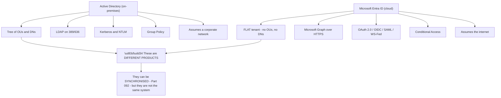
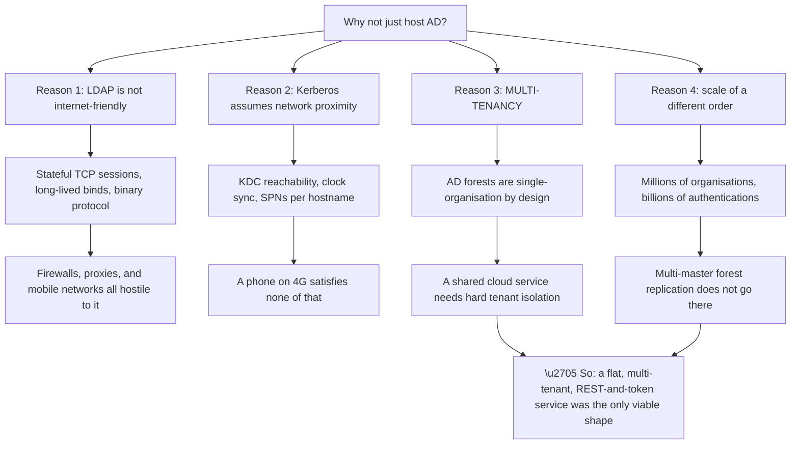
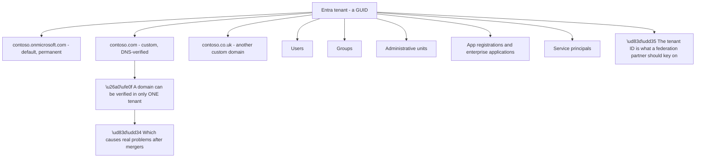
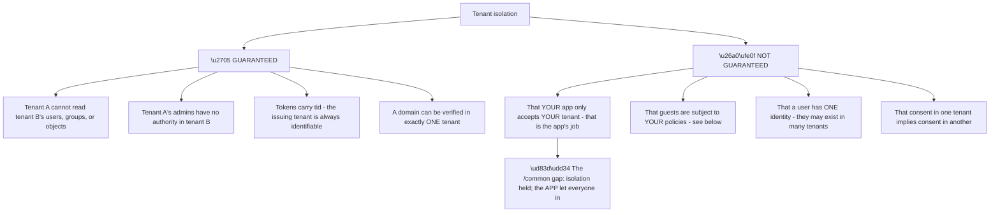
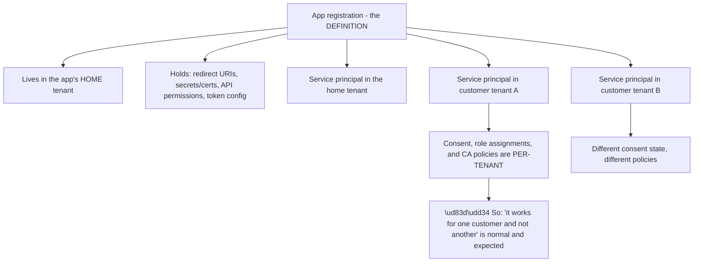
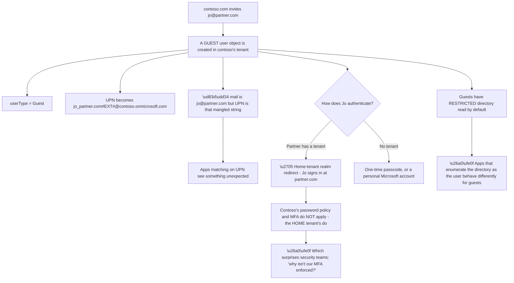
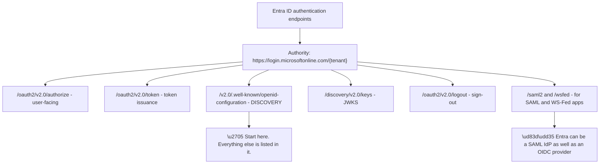
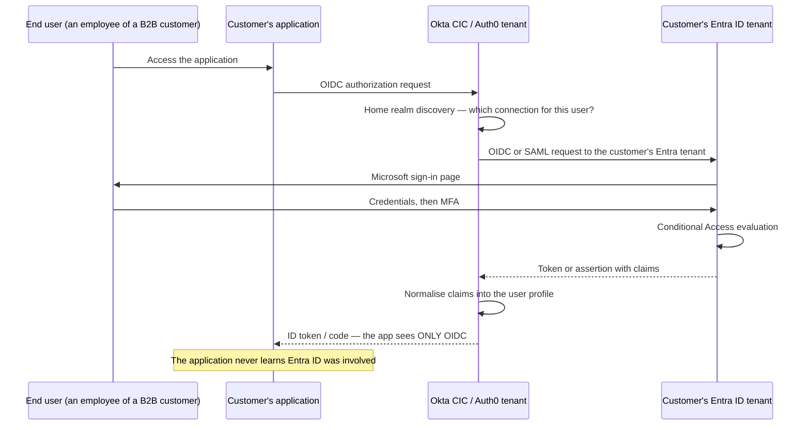
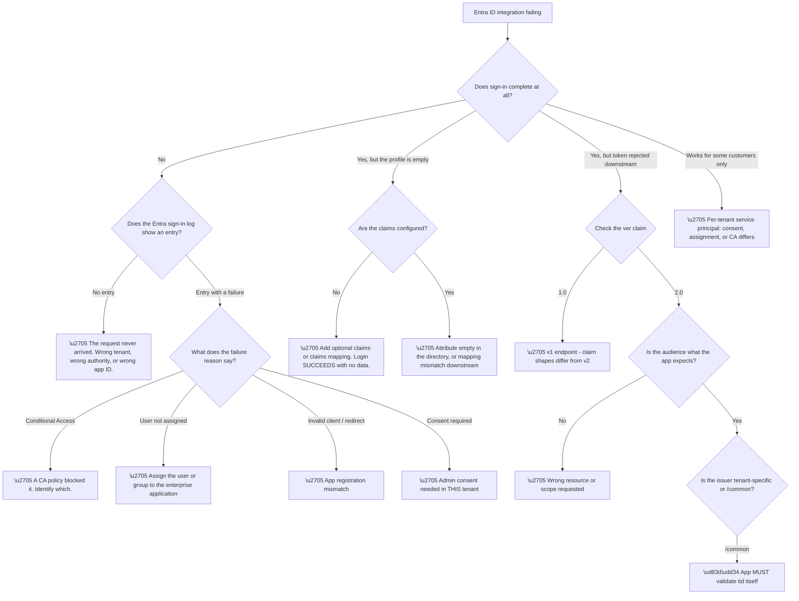

# Part 090 - Microsoft Entra ID Architecture From Zero

> Section goal: Understand Microsoft Entra ID as its own system — a cloud identity service that is *not* Active Directory in the cloud — so you can reason correctly about what it can and cannot do when a customer federates to it.

Covers index item **090**. Maps to JD signals: *Azure Identity*, *Microsoft Entra ID*, *identity and access management*, *authentication and authorization*, *enterprise connections*.

---

## 1. Start From Zero: Entra ID Is Not AD in the Cloud

The single most useful correction in this whole Part: **Microsoft Entra ID is not Active Directory hosted in Azure.** It is a different product, with a different data model, different protocols, and different capabilities. The shared word "Directory" in the old name (Azure Active Directory) caused years of confusion, and the rename to Microsoft Entra ID was partly an attempt to end it.

| Dimension | Active Directory (AD DS) | Microsoft Entra ID |
|---|---|---|
| **Structure** | Hierarchical tree — OUs, DNs | **Flat** — a tenant with objects |
| **Query protocol** | LDAP | **Microsoft Graph REST API** |
| **Authentication** | Kerberos, NTLM | **OAuth 2.0, OIDC, SAML, WS-Fed** |
| **Policy** | Group Policy | **Conditional Access, Intune** |
| **Designed for** | Devices on a corporate network | **Internet-facing applications** |
| **Boundary** | Forest | **Tenant** |
| **Grouping** | OUs plus groups | Groups plus **administrative units** |

**Two consequences follow immediately and are worth internalising.**

**There is no LDAP and there are no OUs.** An application written to bind to LDAP and search an OU **cannot talk to Entra ID at all** without an intermediary. Entra Domain Services exists as a separate, managed service specifically to provide LDAP and Kerberos for legacy applications — it is a distinct product with its own cost and its own limitations, not a feature of Entra ID.

**Group Policy does not exist here.** Device configuration in the Entra world is Intune. Access control is Conditional Access. **"Can you just put a GPO on it?" has no answer in a cloud-only environment**, and recognising that distinction quickly prevents a lot of circular conversation.

> 💡 **Tie-in to your background:** your CV lists both Active Directory and Azure Identity / Microsoft Entra ID. Being able to articulate *precisely* how they differ — flat versus tree, Graph versus LDAP, Conditional Access versus Group Policy — is a strong signal, because most people who list both treat them as the same thing.

### 🔍 Plain-English deep-dive: why they had to be different, rather than simply modernised

It would have been possible to put Active Directory in a datacentre and call it cloud. That was not done, and the reasons explain most of Entra ID's design.

**Reason three is the deepest.** An AD forest is fundamentally single-organisation — shared schema, shared configuration, transitive internal trusts. **A cloud service serving millions of organisations cannot be built on a model whose security boundary is "everyone in the forest."** Entra ID's tenant is a hard isolation boundary from the ground up, which is a different architectural commitment entirely.

**Reason one has a practical corollary worth naming.** REST over HTTPS traverses firewalls, proxies, mobile networks, and CDNs — it is the one protocol that reliably works everywhere. **Graph being a REST API is not a stylistic choice; it is what makes Entra ID reachable from a phone on a train.**

| AD assumption | Why it fails on the internet |
|---|---|
| The client can reach a DC | Not true from a coffee shop |
| Clocks are synchronised | Not guaranteed on personal devices |
| Hostnames are stable and internal | Cloud services are load-balanced and global |
| A trusted network perimeter exists | The premise of zero trust is that it does not |
| One organisation per directory | A shared service serves millions |

**The last row of that table is the one that made a new product inevitable**, and understanding it turns "Entra ID is different" from a fact to memorise into a conclusion you can derive.

**Analogy:** a company's internal phone system versus the public telephone network. You could try to extend the internal system to everyone, but it assumes internal wiring, internal extensions, and a single organisation. The public network was built on different assumptions from the start. **Where it stops:** phone numbers are universal in a way that identities are not — Entra ID still has to keep every tenant rigorously separate.

---

## 2. The Tenant: Entra ID's Fundamental Unit

A **tenant** is a dedicated, isolated instance of Entra ID belonging to one organisation. It is the analogue of a forest, but with harder isolation.

| Property | Detail |
|---|---|
| **Tenant ID** | A GUID — the stable, unambiguous identifier |
| **Default domain** | `<something>.onmicrosoft.com`, created automatically |
| **Custom domains** | Verified by DNS record; multiple allowed |
| **Isolation** | Objects in one tenant are invisible to another by default |
| **Sign-in endpoint** | `https://login.microsoftonline.com/<tenant-id-or-domain>/...` |

**The blue node is the practically important one for federation.** When configuring an enterprise connection to Entra ID, the tenant can be addressed three ways — by GUID, by a verified domain name, or by the `common` / `organizations` endpoints. **The GUID is the stable choice**; domain names can be added, removed, and moved between tenants.

**The one-tenant-per-domain constraint** in node V is worth knowing because it produces genuine business problems. After an acquisition, a domain verified in the acquired company's tenant **cannot** simply be added to the parent's — it must be removed from the first tenant, which means dealing with everything that depends on it. **"We can't add our domain" is often this**, and the answer is not a configuration change.

**Three endpoint choices matter for multi-tenant applications:**

| Endpoint | Who can sign in |
|---|---|
| `/{tenant-id}` or `/{domain}` | **Only that tenant** |
| `/organizations` | Any work or school account, any tenant |
| `/common` | Any work, school, **or personal Microsoft account** |
| `/consumers` | Personal Microsoft accounts only |

**Using `/common` when you meant one tenant is a real security issue**, not merely a configuration nuance — it means any Microsoft account in the world can obtain a token from your endpoint, and the application must then check the `tid` claim itself. Part 091 covers the token validation this demands.

### 🔍 Plain-English deep-dive: what "tenant isolation" actually guarantees, and what it does not

Tenant isolation is Entra ID's central security promise, and it is worth being precise about its edges — because customers frequently assume it covers more than it does.

**The distinction the diagram draws is the one that matters in practice.** Entra ID enforces isolation *within itself* rigorously. What it cannot do is decide which tenants **your** application should trust — that is a decision only the application can make, by validating `tid`.

**So the `/common` failure is not an isolation failure.** Every token was correctly issued, correctly signed, and correctly stamped with its originating tenant. **The application simply did not look at the stamp.** Framing it that way matters in a customer conversation, because "Microsoft let strangers in" and "your application accepted tokens from every tenant because it never checked `tid`" describe the same event with completely different implications.

| Customer assumption | Reality |
|---|---|
| "Only our users can get a token" | True only if the app names your tenant or validates `tid` |
| "Guests follow our security policy" | Only via Conditional Access, deliberately configured |
| "One person, one identity" | A person may exist in many tenants, with different object IDs |
| "Consent is global" | Consent is per-tenant, per-service-principal |
| "Our domain is ours" | True — one tenant per domain is genuinely enforced |

**The third row is the one that reshapes how you think about identity across organisations.** The same human being can be a member of their employer's tenant, a guest in three partner tenants, and the owner of a personal Microsoft account — **five distinct identities, five distinct object IDs, no automatic relationship between them.** An application trying to recognise "the same person" across those is attempting something the platform deliberately does not provide.

**Which leads to the practical rule:** account linking across tenants is an application-level decision requiring verified evidence, not something to infer from a matching email address. **Part 105 returns to this** for customer identity specifically, where the same reasoning applies to social and enterprise identities for one consumer.

**Analogy:** separate, well-run companies that each issue their own staff passes. No company can read another's records, and that isolation is real. But nothing stops one person holding passes from five of them, and nothing tells a security desk that the five passes belong to the same person. **Where it stops:** a person might recognise the face. Software has only the pass.

---

## 3. Objects: Users, Groups, and the App Model

Entra ID's object model is flat but not simple, and the application-side objects in particular confuse people.

| Object | What it is |
|---|---|
| **User** | A person — cloud-only, synchronised, or guest |
| **Group** | Security or Microsoft 365; assigned or **dynamic** |
| **Administrative unit** | A scoping container for delegated admin — *not* an OU |
| **App registration** | The **definition** of an application, in its home tenant |
| **Service principal** | The **instance** of that application in a specific tenant |
| **Managed identity** | A service principal Azure manages the credentials for |

**The registration-versus-principal distinction is the one to get right**, because it explains a whole class of multi-tenant behaviour. **One app registration; one service principal per tenant that uses it.** Consent, role assignments, and Conditional Access policies attach to the *service principal* — so they differ per customer.

**That makes the red node not a bug but the design.** A multi-tenant application working perfectly for nine customers and failing for the tenth is entirely consistent with correct configuration: the tenth tenant may not have granted consent, may have an admin-consent requirement, or may have a Conditional Access policy targeting that application specifically.

**Dynamic groups** deserve a specific caution. Membership is computed from a rule over user attributes — *"everyone whose department is Sales"* — which is powerful and has two support-relevant properties: **membership updates are not instantaneous**, and **a rule that references an empty attribute silently produces an empty group.** Both present as "the group isn't working."

### 🔍 Plain-English deep-dive: guest users and B2B collaboration, and why they behave oddly

Entra ID lets you invite external people into your tenant as **guests**. It is genuinely useful, and it produces support behaviour that looks broken until you understand the model.

**The mangled UPN in node G2 is a real integration hazard.** The guest's `mail` attribute is their genuine address, but their `userPrincipalName` becomes an escaped composite ending in `#EXT#@` plus the host tenant's default domain. **An application matching users on UPN gets something no human would recognise**, and an application displaying UPN shows users a string that looks like an error.

**The authentication-location point in A2 is the one security teams find most surprising.** Guests authenticate against their **home** tenant — so the inviting organisation's password policy and MFA settings do not apply by default. The inviting tenant can require MFA **through Conditional Access**, which is the correct control, but assuming it happens automatically is a mistake. **"Why isn't our MFA being enforced for partners?" is answered by Conditional Access, not by user settings.**

| Guest characteristic | Support consequence |
|---|---|
| Mangled UPN | Breaks UPN-based matching and display |
| Authenticates at home tenant | Host password policy does not apply |
| MFA via Conditional Access only | Must be configured deliberately |
| Restricted directory read | Directory-enumerating apps behave differently |
| Invitation can be pending | User exists but has not accepted |
| Sponsor and lifecycle differ | May be missed by leaver processes |

**The pending-invitation row causes a specific and common ticket:** the guest object exists in the directory, so an administrator confirms "the user is there," but the invitation has never been redeemed and the account cannot be used. **The object existing and the account working are two different things**, and checking `externalUserState` distinguishes them immediately.

**Analogy:** a visitor badge issued by your building but validated by the visitor's own employer. They can enter, but their security clearance is administered elsewhere, and your rules about badge photos and passwords do not apply to them. **Where it stops:** a visitor badge does not rename the person. Entra ID does rewrite the guest's principal name, and downstream systems notice.

---

## 4. Authentication Endpoints and the v2.0 Platform

Entra ID exposes standards-based endpoints, and there are **two generations** of them — which matters because their behaviour differs.

| Aspect | v1.0 endpoint | v2.0 endpoint (Microsoft identity platform) |
|---|---|---|
| Path | `/oauth2/authorize` | `/oauth2/v2.0/authorize` |
| Accounts | Work and school only | Work, school, **and personal** |
| Permissions | Static, configured in the portal | **Dynamic**, requested via `scope` |
| Scope parameter | `resource` | `scope` |
| Standards alignment | Partial | **Closer to OAuth 2.0 / OIDC** |
| Status | Legacy | **Current** |

**Node E1 is the practical instruction.** The discovery document (Part 073) lists every endpoint, the JWKS location, supported scopes, and supported response types — for that specific tenant. **Fetching it is the fastest way to establish ground truth** about a tenant's configuration, and it requires no credentials.

**Node H1 is the fact that matters for CIAM integration.** Entra ID can act as a **SAML identity provider** as well as an OIDC provider. So a customer federating their workforce into a customer identity platform may be doing it over either protocol — and the diagnosis differs completely (Parts 079–085 for SAML, 070–078 for OIDC). **Establishing which protocol is in use is the first question**, and Part 093 covers the choice in depth.

**The v1/v2 distinction has a specific practical consequence.** A token issued by the v1.0 endpoint has `ver: "1.0"` and different claim shapes from a v2.0 token — notably around `scp`, `roles`, and how the issuer is expressed. **An application validating tokens against the wrong version's expectations rejects perfectly valid tokens**, and the error is usually an unhelpful "invalid token."

---

## 5. Where Entra ID Sits in a Customer Identity Flow

For a customer identity platform, Entra ID is almost always an **upstream enterprise identity provider** — one of the connections behind the tenant.

**The final note restates Part 086's bridging point with a specific consequence:** when something fails inside Entra ID — a Conditional Access block, an expired certificate, a missing claim — **the application reports a generic login failure**, because that is all it can see. The customer's developers are not being careless; the information is structurally unavailable to them.

| Failure inside Entra ID | What the application sees |
|---|---|
| Conditional Access blocked the sign-in | Generic login failure |
| MFA required but not satisfied | Generic login failure |
| Claim not configured | Successful login, empty profile |
| SAML certificate expired | Generic login failure |
| User not assigned to the application | Generic login failure |
| Guest invitation not redeemed | Generic login failure |

**Five of six rows produce the same visible symptom**, which is exactly why the tenant logs (Part 107) and the Entra sign-in logs are the actual evidence. **Row three is the odd one out and worth remembering** — a missing claim produces a *successful* login with a blank profile, not a failure, which is a completely different investigation.

---

## 6. Failure Modes

| # | Failure mode | Symptom | Root cause | First check |
|---|---|---|---|---|
| 1 | Expecting LDAP | Integration cannot connect | Entra ID has no LDAP | Is Entra Domain Services required? |
| 2 | Expecting Group Policy | "Just apply a GPO" | Not a cloud concept | Intune or Conditional Access instead |
| 3 | `/common` instead of tenant | Any Microsoft account can sign in | Wrong authority | Is `tid` validated? |
| 4 | Domain in the wrong tenant | Cannot verify a custom domain | One tenant per domain | Where is it currently verified? |
| 5 | Consent not granted | Works for some tenants only | Per-tenant service principal | Check consent in that tenant |
| 6 | Guest UPN mangled | Matching or display breaks | `#EXT#` UPN format | Match on object ID, not UPN |
| 7 | Guest MFA not enforced | Security gap | Guests authenticate at home tenant | Is there a CA policy for guests? |
| 8 | Invitation not redeemed | User exists but cannot sign in | Pending state | Check `externalUserState` |
| 9 | Dynamic group empty | Group-based access fails | Rule references an empty attribute | Test the rule against a user |
| 10 | Dynamic group lag | New user lacks access briefly | Async evaluation | Does it resolve on its own? |
| 11 | v1 vs v2 token mismatch | "Invalid token" | Claim shapes differ | Check the `ver` claim |
| 12 | User not assigned to the app | Generic login failure | Assignment required | Check the enterprise application |

---

## 7. Troubleshooting Decision Tree: Entra ID Integration Problems

### Worked example

A B2B customer reports that their employees cannot sign in to a partner application through their Entra ID connection. It worked last week.

**Node B: sign-in does not complete.** Node C: the Entra sign-in log **does** show entries, which is immediately valuable — it proves the request is reaching the right tenant with the right application ID, eliminating a whole family of configuration causes.

**Node D: the failure reason is Conditional Access.** The log names the policy.

**But the interesting part is why.** The policy is not new. What changed is that the customer began requiring a **compliant device** for this application category, and the affected employees are contractors using unmanaged laptops.

**So nothing is broken.** The policy is working exactly as designed, and the sign-ins are being blocked correctly.

**The support value is in the framing.** This is not a defect to fix but a policy decision to surface: either the contractors get managed devices, or the policy is scoped to exclude them, or a compensating control such as stricter MFA is applied instead. **All three are the customer's decision, and none of them is a change to the identity platform.**

**The write-up point:** the application reported a generic login failure, so the customer's developers had no way to see any of this. **The single most useful thing delivered was the named Conditional Access policy from the sign-in log** — after which the conversation moved from "your integration is broken" to a security-policy discussion, which is where it belonged.

**What made it fast:** going to the Entra sign-in log first rather than examining the connection configuration. **When an upstream IdP is involved, its own log is the primary evidence**, and the presence of an entry is itself diagnostic before you even read the result.

---

## 8. Lab: Explore an Entra ID Tenant Safely

**Purpose.** Build hands-on familiarity with a tenant, its discovery document, app registrations, and token shapes — using a **free personal tenant**, never an employer tenant.

**Prerequisites.**
- A **free Microsoft Entra ID tenant** created with a personal account (the free tier is sufficient)
- A browser and a JWT decoder that runs **locally** (Part 038)
- **Never** perform these steps in an employer or customer tenant

**Steps.**

1. **Create a free tenant.** Record its tenant ID (a GUID) and its default `.onmicrosoft.com` domain.
2. **Fetch the discovery document** at `https://login.microsoftonline.com/<tenant-id>/v2.0/.well-known/openid-configuration`. Read it properly: note the issuer, the authorization and token endpoints, and the JWKS URI.
3. **Compare with `/common`.** Fetch the same document for `common` and note how the issuer differs. **Write down why that matters for validation.**
4. **Create an app registration.** Note that this is the *definition*. Configure a redirect URI of `http://localhost:...`.
5. **Find the service principal** that was created alongside it, under Enterprise Applications. **Confirm you can see two distinct objects for one application.**
6. **Create two users** with fictional names. Create a group and add one of them.
7. **Create a dynamic group** with a rule based on an attribute, and observe how long it takes to populate. **Then create a rule referencing an attribute you have not set, and confirm the group stays empty.**
8. **Invite a guest** using a second personal email address you control. **Record the guest's UPN** and note the `#EXT#` format. Note the `externalUserState` before and after redemption.
9. **Run an authorization code flow** against your tenant using a local client (reuse the tooling from Part 059). Decode the ID token locally.
10. **Inspect the token claims:** `iss`, `aud`, `tid`, `oid`, `sub`, `ver`, `preferred_username`. **Note that `oid` is the stable object ID and `sub` is pairwise per application.**

**Expected evidence.**
- Your tenant's discovery document, and the `/common` version, with the issuer difference noted
- Screenshots or notes showing the app registration and its separate service principal
- The empty dynamic group with its rule
- A guest user's mangled UPN, recorded
- A decoded ID token with each claim explained in your own words

**Validation rubric.**

| Criterion | Pass |
|---|---|
| Product distinction | You can state five concrete differences from AD without notes |
| Tenant model | You can explain the tenant as an isolation boundary and identify it three ways |
| App model | You can explain registration versus service principal and why multi-tenant behaviour varies |
| Guests | You can explain the UPN format and where guests actually authenticate |
| Tokens | You can explain `oid` versus `sub` versus `tid` and which to store |
| Safety | Everything was in your own free tenant with fictional data |

**Cleanup and privacy.** Delete the app registration, users, groups, and guest invitation when finished; delete the tenant if you no longer need it. **Never perform any of these steps in an employer or customer tenant**, and never capture tokens from a real environment. Decode tokens only with a **local** tool — pasting a real token into a website transmits a live credential.

---

## 9. JD Mapping

| JD signal | How this Part addresses it |
|---|---|
| Azure Identity / Microsoft Entra ID | The architecture, object model, and endpoints in full |
| Identity and access management | Tenants, users, groups, guests, application identity |
| Authentication and authorization | The v2.0 platform, endpoints, and token shapes |
| Enterprise connections | Entra ID as an upstream IdP for a customer identity tenant |
| Troubleshooting complex technical issues | Twelve failure modes and a full decision tree |
| Customer communication | The worked example reframes a "defect" as a policy decision |

---

## 10. Candidate Honesty Note

- **Production experience:** Azure Identity and Microsoft Entra ID concepts in a enterprise support context, including access and sign-in issues.
- **Production experience:** Active Directory, which gives a concrete basis for articulating the contrast.
- **Lab experience:** creating a free tenant, registering an application, inspecting the discovery document, and decoding tokens locally, as above.
- **Learned architecture:** multi-tenant application design, B2B collaboration at scale, and Conditional Access policy design.
- **No direct experience:** administering a large production Entra tenant or designing a Conditional Access strategy.
- **How to say it:** *"Entra ID is on my CV from the support side — I've worked issues involving Azure identity and sign-in problems. What I've deliberately built up in a personal tenant is the developer-facing side: app registrations, the v2 endpoints, token claims, and how a customer would federate it into a CIAM platform. I'd distinguish those two clearly rather than blur them."*

---

## 11. Official Source Anchors

| Source | Why | Accessed |
|---|---|---|
| Microsoft Learn — What is Microsoft Entra ID? | Product definition and scope | Accessed **26 August 2026** |
| Microsoft Learn — Compare Entra ID with Active Directory Domain Services | The authoritative version of §1's table | Accessed **26 August 2026** |
| Microsoft Learn — Microsoft identity platform (v2.0) overview | Endpoints, scopes, account types | Accessed **26 August 2026** |
| Microsoft Learn — Application and service principal objects | The registration/principal distinction | Accessed **26 August 2026** |
| Microsoft Learn — B2B collaboration overview | Guest users, UPN format, redemption | Accessed **26 August 2026** |
| Auth0 Docs — Microsoft Azure AD / Entra ID enterprise connections | How Entra becomes an upstream connection | Accessed **26 August 2026** |

> **Revalidate:** Microsoft's identity terminology has changed repeatedly — Azure AD to Entra ID, and portal navigation with it. Re-check names and screen locations on Microsoft Learn before interview, and avoid asserting portal paths from memory.

---

## ⭐ Likely Interview Questions for This Section

### Q1. "How is Microsoft Entra ID different from Active Directory?"

> *Model answer:* They are different products, not the same product in two places. Active Directory is a hierarchical tree of OUs and distinguished names, queried over LDAP, authenticating with Kerberos and NTLM, configured with Group Policy, and designed for devices on a corporate network. Entra ID is a flat multi-tenant service, queried through the Microsoft Graph REST API, authenticating with OAuth 2.0, OIDC, SAML and WS-Federation, controlled through Conditional Access, and designed for internet-facing applications. The practical consequences are concrete: there is no LDAP and no OUs, so a legacy LDAP application needs Entra Domain Services as a separate service, and there is no Group Policy, so device configuration is Intune. They can be synchronised, which is what confuses people, but synchronising two systems does not make them one system.

### Q2. "Why couldn't Microsoft just host Active Directory in the cloud?"

> *Model answer:* Four reasons, and the deepest is multi-tenancy. An AD forest is fundamentally single-organisation — shared schema, shared configuration, automatic transitive trusts inside it — so its security boundary is "everyone in the forest," which cannot be the basis for a service shared by millions of organisations. Beyond that, LDAP is a stateful binary protocol that firewalls, proxies, and mobile networks handle badly; Kerberos assumes KDC reachability, tight clock synchronisation, and hostname-based service names, none of which a phone on a mobile network satisfies; and forest replication does not scale to billions of authentications. A flat, multi-tenant, REST-and-token service was really the only viable shape.

### Q3. "What's the difference between an app registration and a service principal?"

> *Model answer:* The app registration is the definition of the application, living in its home tenant — redirect URIs, credentials, requested permissions, token configuration. A service principal is the instance of that application inside a specific tenant. One registration produces one service principal per tenant that uses the app. It matters because consent, role assignments, and Conditional Access policies attach to the service principal, so they differ per customer. That is why a multi-tenant application can work perfectly for nine customers and fail for the tenth without anything being misconfigured — the tenth tenant may not have granted admin consent, or may have a policy targeting that application. Recognising that as expected behaviour rather than a bug saves a lot of time.

### Q4. "A customer says guests aren't getting MFA. Explain what's happening."

> *Model answer:* Guests authenticate against their *home* tenant, not the inviting one. So the inviting organisation's password policy and MFA settings do not apply — the partner's do. That surprises security teams who assume inviting someone brings them under local policy. The correct control is Conditional Access in the inviting tenant, which can require MFA for guest users specifically, and that has to be configured deliberately rather than assumed. I would also check whether the guest's invitation has actually been redeemed, because a pending guest object exists in the directory and looks like a valid user while being unusable — the `externalUserState` attribute distinguishes those cases immediately.

### Q5. "What are the risks of using the `/common` endpoint?"

> *Model answer:* `/common` accepts any work, school, or personal Microsoft account from any tenant in the world. If an application uses it when it meant a single tenant, then anyone with a Microsoft account can obtain a token from that endpoint — and unless the application explicitly validates the `tid` claim against an allow-list, it will accept them. There is a second, subtler issue: with `/common` the issuer in the token is tenant-specific rather than fixed, so an application that validates the issuer against a single hard-coded value will fail, and the temptation is to relax issuer validation entirely, which is the wrong fix. If the application genuinely serves one tenant, the authority should name that tenant. If it is genuinely multi-tenant, it must validate `tid` deliberately.

### Q6. "A federated login through Entra ID succeeds but the user profile is empty. Where do you look?"

> *Model answer:* This is the one failure mode that produces a *successful* login rather than an error, which makes it distinctive. It is almost always claims configuration: the application or connection expects certain claims, and Entra ID is not emitting them, so the login works and the profile has nothing in it. I would check what claims the enterprise application is configured to release — optional claims or a claims mapping policy — and confirm the attributes are actually populated on the user in the directory, since an empty source attribute produces an absent claim. Then I would check the downstream mapping, because the claim may be arriving under a name the receiving side is not looking for. The key diagnostic distinction is that authentication succeeded, so certificates, policy, and assignment are all fine.

### Q7. "How would you establish ground truth about a customer's Entra tenant configuration?"

> *Model answer:* Fetch the OpenID Connect discovery document for their tenant — it is a public, unauthenticated endpoint at `/{tenant}/v2.0/.well-known/openid-configuration`. It gives the exact issuer, the authorization and token endpoints, the JWKS URI, and the supported scopes and response types for that tenant specifically. That is authoritative and takes seconds, and it beats asking the customer to describe their configuration. For the SAML side there is an equivalent federation metadata document. From there, if the problem is a specific sign-in, the Entra sign-in log is the primary evidence — and the presence or absence of an entry is diagnostic before you even read the result, because no entry means the request never reached the tenant.

### Q8. "Why do so many Entra ID failures look identical to the application?"

> *Model answer:* Because the application only sees the outcome of an OIDC exchange with the identity platform, and the identity platform only sees a failure from Entra. A Conditional Access block, an unsatisfied MFA requirement, an expired SAML certificate, an unassigned user, and an unredeemed guest invitation all surface as the same generic login failure. That is not the customer's developers being careless — the information is structurally unavailable to them. It means the tenant logs and the Entra sign-in logs are the actual evidence, and part of the support value is simply retrieving something the customer cannot see. The one exception worth remembering is a missing claim, which produces a *successful* login with an empty profile, and that is a completely different investigation.

---

## 🧠 30-Second Memory Hooks

- **Entra ID is not AD in the cloud.** Flat vs tree, Graph vs LDAP, Conditional Access vs Group Policy.
- **No LDAP, no OUs, no Group Policy.** Legacy apps need Entra Domain Services.
- **Tenant = isolation boundary.** Identify it by GUID, not by domain.
- **A domain can be verified in only one tenant.** Merger problems live here.
- **App registration = definition. Service principal = per-tenant instance.**
- **Per-tenant consent → "works for some customers" is normal.**
- **Guests authenticate at their home tenant.** MFA needs Conditional Access.
- **Guest UPN is `user_domain#EXT#@tenant.onmicrosoft.com`.** Never match on it.
- **`/common` = anyone. Validate `tid`.**
- **Discovery document = free ground truth.**
- **Missing claim = successful login, empty profile.** Everything else = generic failure.

---

## ✅ Completion Checklist

- [ ] I can state five concrete differences between AD and Entra ID
- [ ] I can explain why a separate product was architecturally necessary
- [ ] I can explain the tenant boundary and three ways to address it
- [ ] I can explain app registration versus service principal and its multi-tenant consequence
- [ ] I can explain guest authentication, the UPN format, and MFA enforcement
- [ ] I can explain the risk of `/common` and what an app must validate
- [ ] I can fetch and read a discovery document to establish ground truth
- [ ] I can explain why most Entra failures look identical downstream, and the one exception
- [ ] I have completed the lab in my own free tenant and cleaned up
- [ ] I can state honestly what Entra work I have done and what I have not

*Next suggested section:* **[Part 091 - Entra ID Protocol Endpoints, Tokens, MSAL, and Conditional Access](Part-091-entra-id-protocol-endpoints-tokens-msal-and-conditional-access.md)** — the wire-level detail: what Entra tokens actually contain, how MSAL handles them, and how Conditional Access changes the flow.
