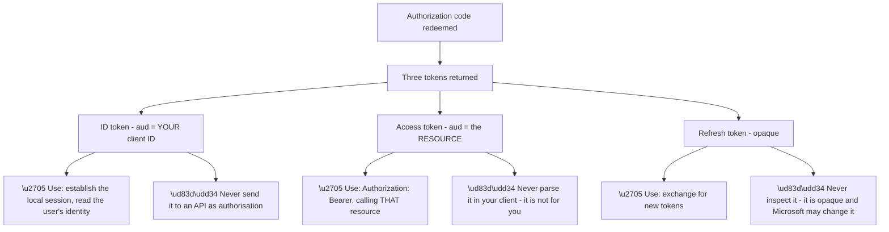
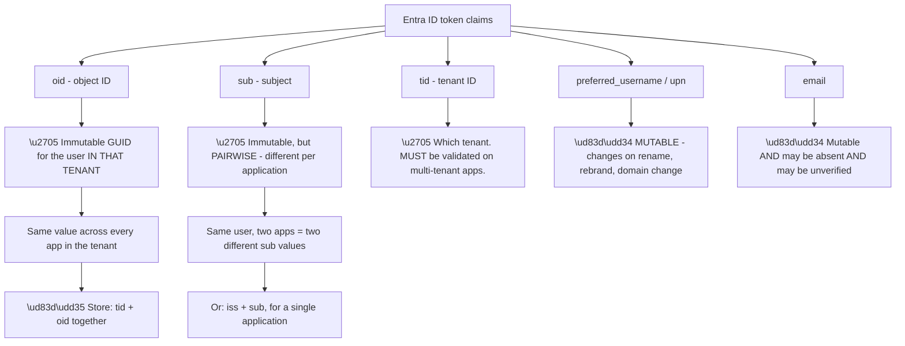
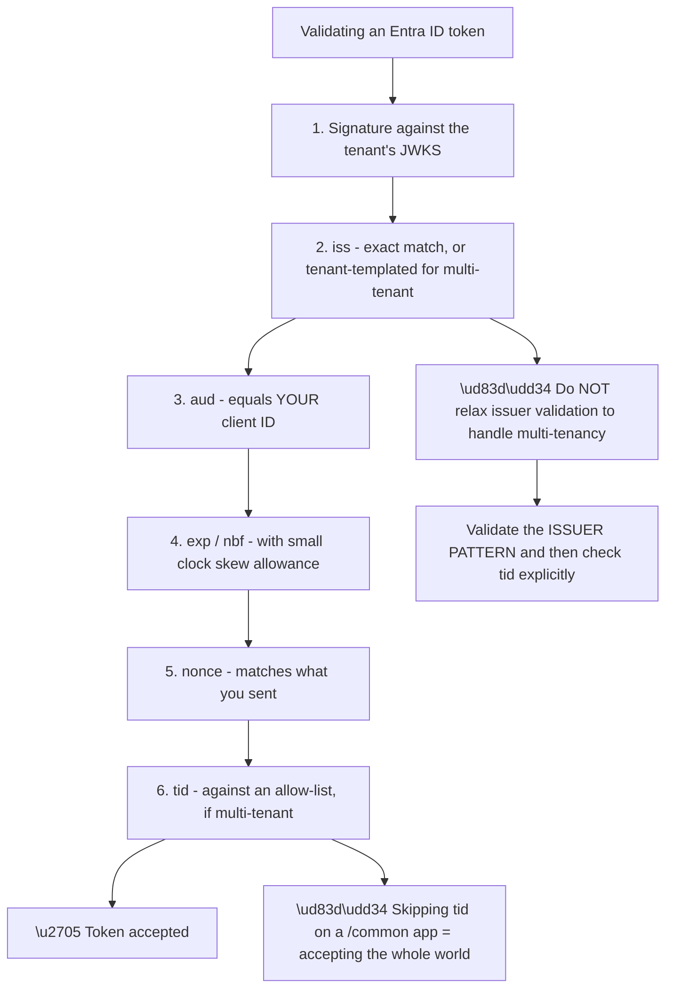
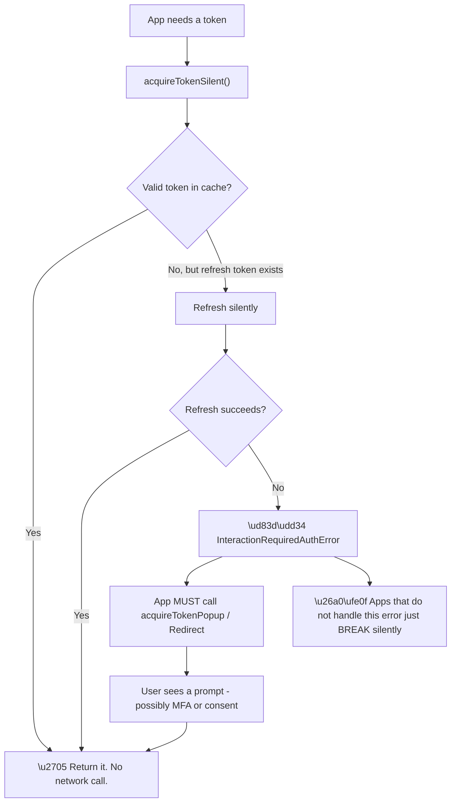
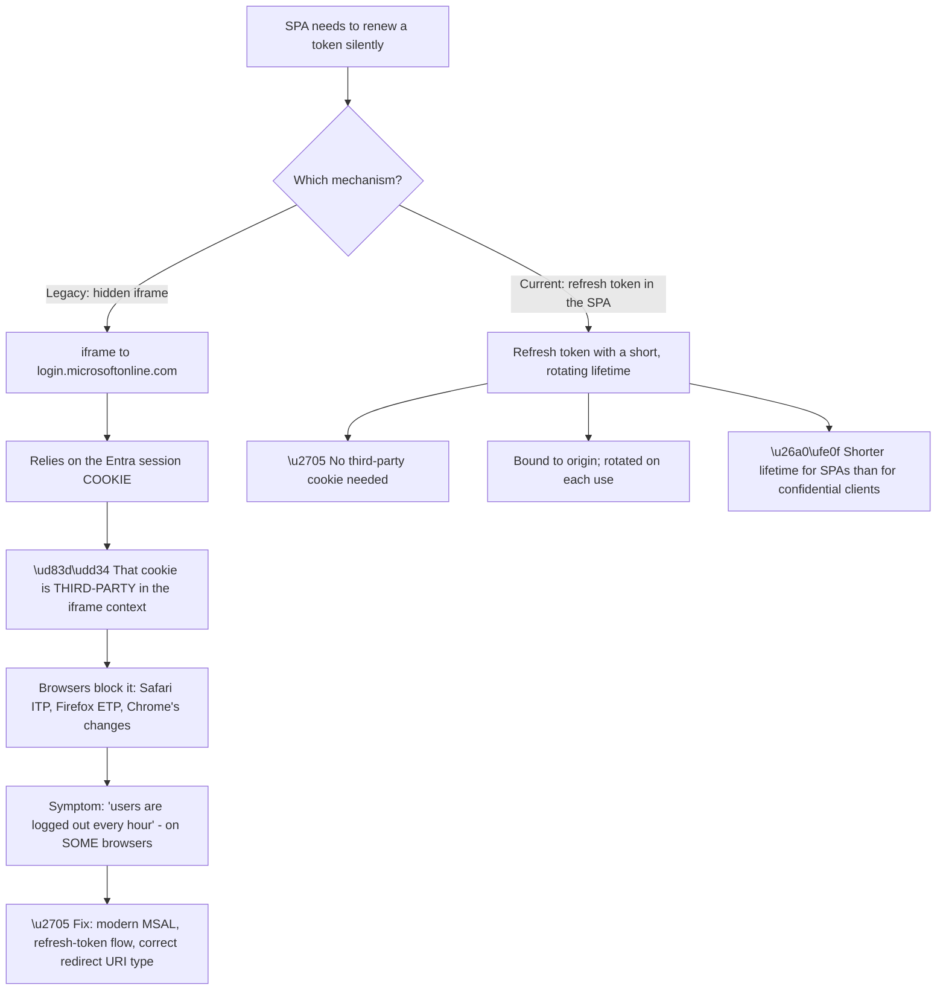
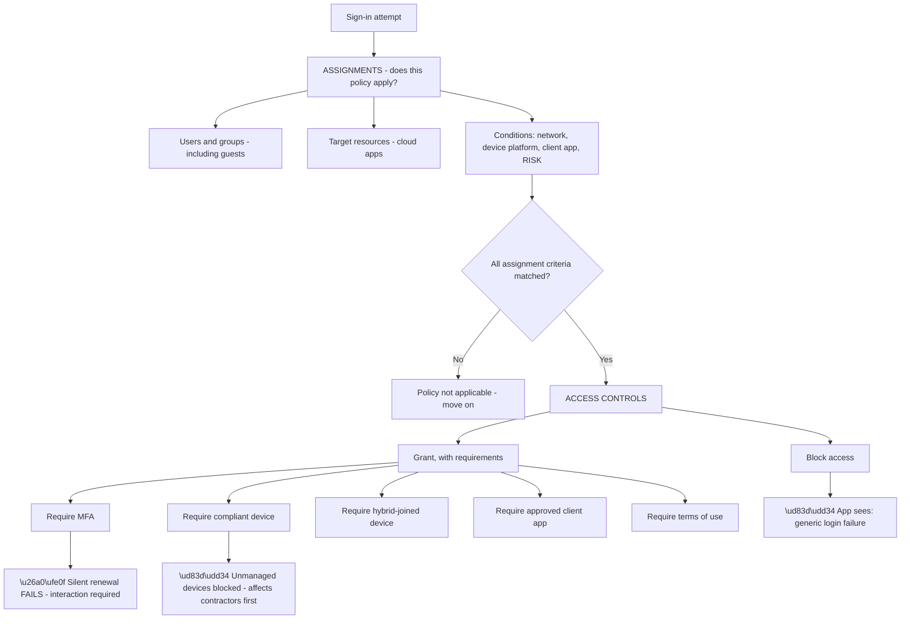
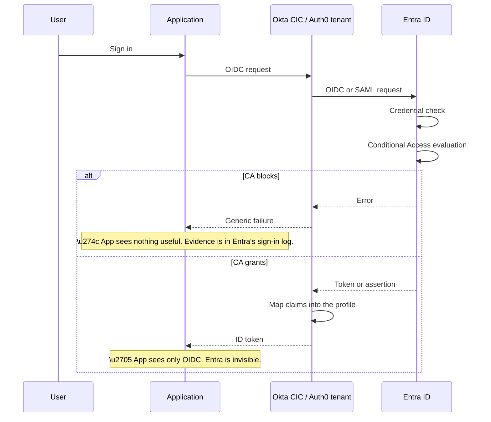
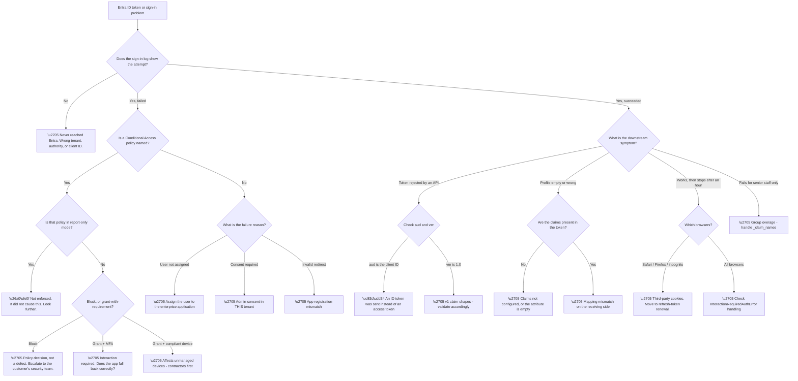

# Part 091 - Entra ID Protocol Endpoints, Tokens, MSAL, and Conditional Access

> Section goal: Get to wire-level fluency with Microsoft Entra ID — the exact claims its tokens carry, how MSAL manages them, and how Conditional Access silently reshapes a flow — so you can read an Entra token and a sign-in log with confidence.

Covers index item **091**. Maps to JD signals: *Azure Identity*, *Microsoft Entra ID*, *authentication and authorization*, *OAuth 2.0 and OIDC*, *troubleshooting complex technical issues*, *debugging tools*.

---

## 1. Start From Zero: Three Token Types, Three Purposes

Entra ID issues three kinds of token, and **confusing them is the single most common Entra developer error**. The confusion is understandable — they are all JWTs, they arrive together, and they look similar.

| Token | Audience (`aud`) | Purpose | Who validates it |
|---|---|---|---|
| **ID token** | **Your client application** | Tells your app *who signed in* | Your application |
| **Access token** | **A resource API** | Authorises a call *to that API* | The API, not your app |
| **Refresh token** | Entra ID itself | Obtains new tokens without re-login | Entra ID only — **opaque to you** |



**The two red nodes on the ID and access tokens are the mistakes that recur.**

**Sending an ID token to an API** is wrong because the API is not its audience. A correctly-implemented API rejects it. An incorrectly-implemented API accepts it — which is worse, because it means the API is not validating audience, and any ID token for any application would be accepted (Part 077).

**Parsing an access token in your client** is wrong for a subtler reason: for Microsoft Graph, the access token may be in a **proprietary, encrypted format** that is not a readable JWT at all. Code that decodes it works today and breaks without warning. **The access token is opaque to the client by contract**, even when it happens to be decodable.

> 💡 **Tie-in to your background:** this is exactly the class of issue you would see in support — a developer's code works in one configuration and fails in another because it depends on an internal detail that was never guaranteed. Recognising "you are relying on something that isn't part of the contract" is a transferable diagnostic instinct.

### 🔍 Plain-English deep-dive: `oid`, `sub`, `tid`, and which one to store

Entra tokens carry several identifiers, and picking the wrong one produces the same class of bug as Part 083's NameID and Part 087's DN.



**The key at the bottom is the practical answer.** For an application that needs to correlate a user across multiple applications in the same tenant, **`tid` + `oid`** is the right key. For a single application that just needs a stable local identifier, **`iss` + `sub`** works and has better privacy properties, since `sub` does not correlate across applications.

**`oid` alone is not sufficient** on a multi-tenant application. Object IDs are unique within a tenant; the pairing with `tid` is what makes the key globally unambiguous. Guest users make this concrete: **a guest has a different `oid` in the host tenant than in their home tenant**, which is correct behaviour and surprising if you expected one identifier per human.

| Claim | Stable? | Unique where? | Store it? |
|---|---|---|---|
| `oid` | ✅ | Within a tenant | ✅ with `tid` |
| `sub` | ✅ | Per app + user | ✅ with `iss` |
| `tid` | ✅ | Globally | ✅ as part of the key |
| `preferred_username` | ❌ | — | ❌ display only |
| `upn` | ❌ | — | ❌ display only |
| `email` | ❌ | — | ❌ and may be absent |
| `name` | ❌ | — | ❌ display only |

**Two rows deserve emphasis.** `upn` changes far more often than people expect — surname changes, company rebrands, and domain consolidations all rewrite it in bulk, and a **rebrand rewrites every UPN in the organisation at once**, which turns a slow-burning bug into an outage.

**And `email` may simply be absent.** It is only emitted when the user has a populated mail attribute, so an application requiring it breaks for a subset of users with no obvious pattern — which is a genuinely painful thing to diagnose.

**Analogy:** identifying someone by their staff number rather than their email address or job title. The staff number is meaningless to look at and never changes; the others are readable and change constantly. **Where it stops:** a staff number is unique to the company. Move to another company and there is a new one — which is precisely why `tid` has to travel with `oid`.

---

## 2. Reading an Entra ID Token

A concrete, annotated v2.0 ID token, claim by claim:

| Claim | Example | Meaning and support relevance |
|---|---|---|
| `iss` | `https://login.microsoftonline.com/{tid}/v2.0` | **Tenant-specific.** Validate it. |
| `aud` | Your client ID (a GUID) | Must equal *your* application |
| `sub` | Opaque string | Pairwise stable identifier |
| `oid` | GUID | Tenant-wide user object ID |
| `tid` | GUID | The tenant. **Validate on multi-tenant apps.** |
| `iat` / `nbf` / `exp` | Unix timestamps | Validity window |
| `nonce` | Your value | **Replay protection — must match** |
| `preferred_username` | `jo@contoso.com` | Display only, mutable |
| `name` | `Jo Patel` | Display only |
| `ver` | `2.0` | **v1 and v2 claim shapes differ** |
| `acr` / `amr` | `1`, `["pwd","mfa"]` | **How** they authenticated |
| `groups` | Array of GUIDs | Only if configured; **may be omitted** |
| `roles` | Array of strings | App roles assigned to the user |
| `wids` | Array of GUIDs | Directory role template IDs |



**The `groups` claim needs a specific warning** that connects to Part 087's token bloat. When a user is in many groups, Entra ID **omits the `groups` claim entirely** and instead emits a `_claim_names` / `_claim_sources` pair pointing at a Graph endpoint — the "group overage" behaviour.

**The consequence is exactly the signature you now recognise:** authorisation works for most users and fails for **long-tenured staff and managers**, because those are the people in the most groups. **An application that reads `groups` and does not handle overage will break for precisely its most senior users**, which is both operationally awkward and a memorable diagnostic tell.

| Symptom | Likely cause |
|---|---|
| `groups` missing for some users only | **Group overage** — check for `_claim_names` |
| `groups` missing for everyone | Not configured in the app registration |
| `groups` present but wrong format | Configured as GUIDs vs sAMAccountName |
| `roles` empty | User not assigned an app role |

### 🔍 Plain-English deep-dive: `acr`, `amr`, and proving *how* someone authenticated

Two claims answer a question that becomes important the moment an application has any operation worth protecting: **not who the user is, but how strongly they proved it.**

```mermaid
flowchart TD
    A["Authentication completed"] --> AM["amr - Authentication Methods References"]
    AM --> AM1["[\"pwd\"] - password only"]
    AM --> AM2["[\"pwd\",\"mfa\"] - password plus a second factor"]
    AM --> AM3["[\"rsa\"] / [\"fido\"] / [\"wia\"] - stronger or integrated methods"]
    A --> AC["acr - Authentication Context Class Reference"]
    AC --> AC1["A policy-level statement of assurance"]
    AM2 --> U1["\u2705 App can require MFA for sensitive operations"]
    AM1 --> U2["\u2705 App can STEP UP - send the user back with a stronger requirement"]
    U2 --> U3["OIDC: acr_values, or prompt / max_age. Part 074."]
    AM --> W["\ud83d\udd34 amr is INFORMATIONAL - it describes what happened"]
    W --> W1["It does not enforce anything. The APP must check it."]
```

**The red node is the point people miss.** `amr` reports what happened; it does not cause anything. **An application that wants MFA for a high-value action must read `amr` and act on it** — nothing enforces that on its behalf, and a token from a password-only sign-in is perfectly valid for everything the application does not gate.

**Step-up authentication is the pattern this enables**, and it is a genuinely better design than requiring MFA for everything:

| Approach | Effect |
|---|---|
| MFA on every sign-in | Secure, and users complain constantly |
| MFA never | Convenient, and the high-value action is unprotected |
| **Step-up: MFA only when it matters** | ✅ Both — read `amr`, re-challenge when needed |

**The mechanism is already familiar from Part 074.** The application redirects the user back to the authorization endpoint with `acr_values` requesting a stronger context, or with `max_age=0` to force a fresh authentication. **The user experiences one extra prompt at the moment it is justified**, rather than friction on every login.

**And this is where Entra and the customer identity platform have to agree.** If a customer identity tenant sits between the application and Entra ID, **`amr` must survive the hop** — the connection has to pass it through as a claim, or the application downstream sees nothing and cannot make the decision. **A step-up requirement that silently loses `amr` in the middle degrades to "always allow," which fails open.**

**That failure mode is worth naming explicitly** because it is invisible: nothing errors, nothing logs, and the protection simply is not there. Verifying that `amr` actually arrives in the downstream token is a concrete check worth running on any step-up implementation.

**Analogy:** a visitor pass that records whether you showed one form of ID or two. The pass does not stop you entering the secure room — it just carries the fact, and the door to that room is supposed to read it. **Where it stops:** a guard would ask again if unsure. A door that never reads the pass lets everyone through and reports nothing.

---

## 3. MSAL: What the Library Does For You

Microsoft Authentication Library (MSAL) is the supported client library, and understanding what it handles explains a set of tickets where "the library is broken."

| MSAL responsibility | What it prevents |
|---|---|
| Building correct authorize requests | Malformed parameters |
| **PKCE by default** | Code interception (Part 059) |
| **Token caching** | Unnecessary round-trips |
| **Silent renewal** | Forcing re-login every hour |
| Refresh token handling | Manual, error-prone refresh logic |
| Multi-account management | Wrong-account bugs |
| Broker integration | Device-bound credentials, SSO |



**The pattern in the diagram is the one MSAL expects, and skipping it is the most common MSAL bug.** `acquireTokenSilent` is called first; if it throws `InteractionRequiredAuthError`, the application **must** fall back to an interactive call. An application that treats that error as a failure produces a user experience of "it just stopped working," with no prompt and no explanation.

**And the reason silent renewal fails is frequently Conditional Access**, which is the link to §4: a policy now requires MFA, or a compliant device, or a fresh sign-in — none of which can be satisfied silently. **The token refresh is not broken; it is being correctly refused pending user interaction.**

### 🔍 Plain-English deep-dive: token lifetimes, silent renewal, and the third-party cookie problem

Silent renewal has a browser-specific failure mode that has grown steadily worse, and it connects directly to Part 072.



**The browser-specific symptom in node I4 is the diagnostic gift here.** A problem that affects Safari and Firefox users but not Chrome users — or that started affecting Chrome users after a browser update — is **almost never an identity configuration problem**. It is third-party cookie policy, and the fix is on the application side.

| Symptom | Third-party cookies? |
|---|---|
| Fails on Safari, works on Chrome | ✅ Almost certainly |
| Fails in private/incognito browsing | ✅ Very likely |
| Fails for everyone on every browser | ❌ Something else |
| Started after a browser update | ✅ Likely |
| Works after clicking "sign in" again | ✅ Consistent with silent-only failure |

**Token lifetimes are the other half of the picture:**

| Token | Typical lifetime | Notes |
|---|---|---|
| Access token | ~60–90 minutes | Randomised to avoid synchronised expiry storms |
| ID token | ~60–90 minutes | For establishing the session |
| Refresh token (confidential client) | Long-lived, sliding | Revocable |
| Refresh token (SPA) | **Short — typically 24 hours** | Rotated on every use |

**That last row explains a specific complaint** that sounds like a bug and is not: a single-page application requires interactive sign-in roughly daily, while a server-side application does not. **That asymmetry is deliberate**, because a refresh token in browser storage is far more exposed than one in a server's memory.

**And the correct response to "can you make it longer?"** is usually no — the lifetime is a security control. The right conversation is about whether the interactive prompt can be made painless (existing Entra session, no MFA re-prompt) rather than eliminated.

**Analogy:** a building pass that renews automatically while you stay inside, but where a new security policy stops the automatic renewal working from certain corridors. The pass system is fine; the corridor is the problem. **Where it stops:** a security guard could just wave you through. A browser applying cookie policy will not make an exception.

---

## 4. Conditional Access: The Policy Layer That Reshapes Everything

Conditional Access sits between a successful credential check and a successful sign-in. **It is the most common reason an Entra federation "breaks" without anything having changed on the identity side.**



**The three outcome nodes map to three distinct support signatures**, and separating them is most of the diagnostic work:

| Signature | Cause |
|---|---|
| Generic login failure, sign-in log names a policy | **Block** |
| Silent renewal fails, interactive works | **Grant with MFA or freshness requirement** |
| Fails for contractors/BYOD, works for staff laptops | **Device compliance requirement** |
| Fails from certain countries or IPs | **Location condition** |
| Fails intermittently for the same user | **Risk-based policy** — risk score varies |

**The last row is worth dwelling on** because it is the one that looks most like instability. Identity Protection assigns a risk level per sign-in based on signals like impossible travel, anonymous IP, or unfamiliar sign-in properties. **A risk-based policy therefore produces genuinely non-deterministic behaviour** — the same user, same device, same application, different outcome — which people reasonably interpret as a flaky system.

**The evidence is always the sign-in log.** It records which policies were evaluated, which applied, which were satisfied, and which failed — **per sign-in attempt, with a correlation ID.** No amount of reasoning about configuration substitutes for reading it, and asking a customer for the correlation ID of a failed sign-in is the single highest-value request on any Entra ticket.

**One nuance that catches people:** report-only mode. A policy in report-only mode is evaluated and logged **without being enforced**. So the sign-in log may show a policy "failing" while the sign-in succeeded — which is correct and confusing. **Check the policy's mode before concluding it caused anything.**

---

## 5. What This Means for a Customer Identity Integration

When a customer federates their Entra tenant into a customer identity platform, the layering produces a specific division of visibility.



**Three practical rules follow from this picture:**

| Rule | Why |
|---|---|
| **Always ask for the Entra correlation ID** | It is the key into the sign-in log |
| **Ask for both logs** | The CIC tenant log and the Entra sign-in log, for the same attempt |
| **Match on timestamps** | The two logs are separate systems; correlate by time and user |

**The two-log discipline is what makes these tickets tractable.** The tenant log shows what the connection sent and received; the Entra sign-in log shows what Entra decided and why. **Either alone is half a story**, and the point where they disagree is where the problem is.

**And the claim-mapping layer adds its own failure mode**, distinct from anything Entra does: authentication succeeds, Entra emits claims correctly, and the connection maps them to the wrong profile fields — producing a successful login with a wrong or empty profile. **That is a Part 083-shaped problem living one layer down**, and it is diagnosed by comparing what Entra emitted against what the connection expected.

---

## 6. Failure Modes

| # | Failure mode | Symptom | Root cause | First check |
|---|---|---|---|---|
| 1 | ID token sent to an API | API rejects, or accepts wrongly | Wrong token type | What is the `aud`? |
| 2 | Access token parsed by the client | Breaks unpredictably | Format is not guaranteed | Is the client decoding it? |
| 3 | Stored `upn` as the identifier | Mass access loss after a rebrand | Mutable claim | What field does the app key on? |
| 4 | `email` claim absent | Breaks for a subset of users | Not always emitted | Is mail populated? |
| 5 | Group overage | Fails for senior staff only | `groups` omitted, `_claim_names` present | Check for `_claim_names` |
| 6 | `tid` not validated | Any tenant can sign in | `/common` without a check | Is there a tenant allow-list? |
| 7 | v1 vs v2 claim mismatch | "Invalid token" | Different claim shapes | Check `ver` |
| 8 | `InteractionRequiredAuthError` unhandled | "It just stopped working" | Silent renewal refused | Does the app fall back to interactive? |
| 9 | Third-party cookies blocked | Fails on Safari/Firefox only | iframe renewal | Which browsers are affected? |
| 10 | SPA refresh token lifetime | Daily re-login on SPA only | Deliberate 24-hour limit | Is it a SPA? |
| 11 | Conditional Access block | Generic login failure | Policy assignment | Read the sign-in log |
| 12 | Risk-based policy | Non-deterministic failures | Varying risk score | Is a risk policy in scope? |
| 13 | Report-only policy misread | Log shows failure, sign-in succeeded | Policy not enforced | Check the policy's mode |
| 14 | Claim mapping mismatch | Login works, profile wrong | Connection-side mapping | Compare emitted vs expected |

---

## 7. Troubleshooting Decision Tree: Entra Token and Policy Problems



### Worked example

A customer's SPA, federated through a customer identity platform to their Entra tenant, reports: *"users get logged out after an hour, but only some users, and it started last month."*

**Three qualifiers, and they pull in different directions** — which is the interesting part. "After an hour" suggests token lifetime. "Only some users" suggests something user-specific. "Started last month" suggests a change.

**Node B: sign-in logs show the attempts** — silent renewal attempts, failing. So the flow reaches Entra and Entra refuses.

**Node C: a Conditional Access policy is named.** Node D: it is enforced, not report-only. Node E: it is grant-with-MFA — specifically, a **sign-in frequency** requirement added last month.

**That explains "started last month" and "after an hour."** But not "only some users."

**Following the assignment.** The policy is assigned to a group. **Only members of that group are affected** — which is precisely correct behaviour, and precisely why the pattern looked arbitrary from the application's side.

**But there is a second finding.** The application does not handle `InteractionRequiredAuthError`. So affected users are not being prompted to reauthenticate — **they are simply being logged out**, with no explanation and no path forward.

**Two root causes, two owners.** The policy is the customer's security decision and is working as intended. **The unhandled error is an application defect**, and it converts a designed reauthentication prompt into an apparent outage.

**The recommendation** is not to change the policy: it is to handle the error correctly, so affected users get a prompt instead of a silent logout. **The policy stays, the experience becomes correct.**

**What made it findable:** treating the three qualifiers as three separate clues rather than one description. **"Only some users" was the one that identified group-scoped policy assignment**, and it was the qualifier most likely to have been dismissed as vague.

---

## 8. Lab: Inspect Entra Tokens and Simulate Policy

**Purpose.** Read real Entra tokens claim by claim, observe silent renewal, and use the What-If tool to understand Conditional Access — all in your own free tenant.

**Prerequisites.**
- The free tenant from Part 090
- A local JWT decoder (Part 038) — **never a web-based one**
- A minimal SPA or local client using MSAL
- **Never** perform any of this in an employer or customer tenant

**Steps.**

1. **Run an authorization code flow with PKCE** using MSAL against your tenant. Capture all three tokens.
2. **Decode the ID token locally.** Identify `iss`, `aud`, `sub`, `oid`, `tid`, `ver`, `nonce`, `exp`, and the `amr` array.
3. **Decode the access token if it is a JWT.** Note that its `aud` is the resource, not your client. **If it is not decodable, record that** — it demonstrates the point in §1.
4. **Compare `sub` across two applications.** Register a second app, sign in with the same user, and confirm `sub` differs while `oid` is identical.
5. **Observe silent renewal.** Leave the app idle past token expiry and watch `acquireTokenSilent` succeed. Note the timing.
6. **Force interaction required.** Sign out of the Entra session in another tab, then trigger renewal, and observe `InteractionRequiredAuthError`. **Confirm your app handles it.**
7. **Create a Conditional Access policy in report-only mode** requiring MFA for one test user.
8. **Sign in as that user.** Confirm the sign-in succeeds and the log shows the policy as report-only.
9. **Switch the policy to enabled** and repeat. Observe the MFA prompt and the difference in the log.
10. **Use the What-If tool** to model the policy against a different user, and confirm it does not apply.
11. **Test group overage if practical:** add a user to enough groups that `groups` is replaced by `_claim_names`. If you cannot reach the threshold, document the expected behaviour instead.

**Expected evidence.**
- Annotated ID token claims, in your own words
- Two `sub` values and one `oid` for the same user across two apps
- A captured `InteractionRequiredAuthError` and your handling of it
- Sign-in log entries for report-only and enforced modes, side by side
- A What-If result showing the policy not applying

**Validation rubric.**

| Criterion | Pass |
|---|---|
| Token types | You can explain all three and their audiences without notes |
| Identifiers | You can explain `oid`, `sub`, `tid` and justify what to store |
| Validation | You can list the six validation steps in order |
| MSAL | You can explain the silent-then-interactive pattern and its failure |
| Conditional Access | You can read a sign-in log and identify the deciding policy |
| Report-only | You can explain why a "failing" policy may be irrelevant |
| Safety | Everything was in your own free tenant, tokens decoded locally |

**Cleanup and privacy.** Delete the app registrations, users, and Conditional Access policies. **Delete every captured token** — an unexpired token is a live credential regardless of where it came from. **Never paste a token into a web-based decoder**, and never capture tokens from an employer or customer environment for any reason.

---

## 9. JD Mapping

| JD signal | How this Part addresses it |
|---|---|
| Azure Identity / Microsoft Entra ID | Endpoints, token claims, MSAL, Conditional Access |
| Authentication and authorization | Token types, audiences, and validation order |
| OAuth 2.0 and OIDC | Entra's implementation, v1 versus v2 |
| Troubleshooting complex technical issues | Fourteen failure modes and a full decision tree |
| Debugging tools | Sign-in logs, correlation IDs, What-If, local token decoding |
| Root cause analysis | The example separates a policy decision from an app defect |
| Customer communication | Distinguishing "working as designed" from "defect" |

---

## 10. Candidate Honesty Note

- **Production experience:** supporting Microsoft identity issues, including sign-in failures and access problems.
- **Production experience:** reading logs and correlating evidence across systems to isolate a cause.
- **Lab experience:** decoding Entra tokens locally, observing silent renewal and interaction-required failures, and testing Conditional Access in report-only mode, as above.
- **Learned architecture:** MSAL's caching and broker behaviour, group overage handling, and Conditional Access design at scale.
- **No direct experience:** designing a Conditional Access strategy for a production organisation, or shipping an MSAL-based application.
- **How to say it:** *"I've worked Microsoft identity issues from the support side, and I've built up the developer-facing detail deliberately in my own tenant — token claims, MSAL's silent-then-interactive pattern, and how Conditional Access shows up in the sign-in log. I'd be clear that I haven't designed Conditional Access policy in production; I've tested it in report-only mode in a lab to understand the behaviour."*

---

## 11. Official Source Anchors

| Source | Why | Accessed |
|---|---|---|
| Microsoft Learn — Microsoft identity platform ID tokens | Claim-by-claim reference | Accessed **26 August 2026** |
| Microsoft Learn — Access tokens | Audience, format caveat, validation | Accessed **26 August 2026** |
| Microsoft Learn — Configurable token lifetimes | Current lifetime behaviour | Accessed **26 August 2026** |
| Microsoft Learn — MSAL overview and error handling | Silent versus interactive patterns | Accessed **26 August 2026** |
| Microsoft Learn — Conditional Access overview and What-If | Policy structure, evaluation, report-only | Accessed **26 August 2026** |
| Microsoft Learn — Sign-in logs | Correlation IDs and failure reasons | Accessed **26 August 2026** |
| Auth0 Docs — Microsoft Entra ID enterprise connections | The connection layer above all of this | Accessed **26 August 2026** |

> **Revalidate:** token lifetimes, SPA refresh-token behaviour, and browser cookie policy all change. Re-check Microsoft Learn before interview rather than quoting specific durations from memory — the *reasoning* is stable, the numbers are not.

---

## ⭐ Likely Interview Questions for This Section

### Q1. "Explain the three token types Entra ID issues."

> *Model answer:* The ID token is for your client application — its audience is your client ID, and its job is to tell your app who signed in so it can establish a local session. The access token is for a resource API — its audience is that resource, and it is sent as a bearer token when calling it. The refresh token is for Entra ID itself, and it is opaque; you exchange it for new tokens and never inspect it. Two mistakes recur. Sending an ID token to an API is wrong because the API is not the audience, and if the API accepts it, that itself is a finding — it means audience is not being validated. And parsing an access token in the client is wrong because its format is not guaranteed; for Microsoft Graph it may not be a readable JWT at all, so code that decodes it works until it suddenly does not.

### Q2. "Which claim should an application store to identify a user, and why?"

> *Model answer:* For a multi-tenant application, `tid` plus `oid`. The object ID is an immutable GUID for the user within a tenant, and pairing it with the tenant ID makes the key globally unambiguous. For a single application, `iss` plus `sub` also works and has better privacy properties, because `sub` is pairwise — the same user gets different `sub` values in different applications, so it does not correlate across them. What you must not store is `upn`, `preferred_username`, or `email`. Those are mutable: a surname change, a company rebrand, or a domain consolidation rewrites them, and a rebrand rewrites every one in the organisation at once, which turns a slow bug into an outage. `email` has an additional problem — it is only emitted when the mail attribute is populated, so it is absent for some users with no obvious pattern.

### Q3. "Authorisation works for most users but fails for managers. What's your hypothesis?"

> *Model answer:* Group overage. When a user belongs to more groups than the token can carry, Entra ID omits the `groups` claim entirely and instead emits `_claim_names` and `_claim_sources` pointing at a Graph endpoint the application is expected to call. An application that reads `groups` directly and does not handle overage sees no groups at all for those users and denies them. The reason it hits managers and long-tenured staff is simply that they have accumulated the most memberships. I would confirm by decoding a working user's token and an affected user's token and comparing — the presence of `_claim_names` is definitive. The fix is either to handle overage properly by calling Graph, or to reduce what is emitted by using application roles or a filtered group set instead of all groups.

### Q4. "A SPA logs users out every hour on Safari but not Chrome. What's happening?"

> *Model answer:* That browser split is the signature of third-party cookie blocking. The legacy silent-renewal mechanism uses a hidden iframe to the Entra login domain, which depends on the Entra session cookie — and in an iframe that cookie is third-party. Safari's tracking prevention and Firefox's equivalent block it, and Chrome has moved in the same direction, so renewal silently fails while the user is still signed in as far as Entra is concerned. The fix is on the application side: modern MSAL using the refresh-token flow for SPAs, which does not depend on a third-party cookie. I would also check that the app handles `InteractionRequiredAuthError` by falling back to an interactive call, because without that the user just gets logged out with no prompt.

### Q5. "How does Conditional Access change how you troubleshoot?"

> *Model answer:* It introduces a layer where the credentials are correct and the sign-in still fails, and it is invisible to everything downstream — the application just sees a generic login failure. So the sign-in log becomes the primary evidence, because it records which policies were evaluated, which applied, and which were not satisfied, per attempt with a correlation ID. Getting that correlation ID from the customer is the highest-value single request on these tickets. Two things I check carefully: whether the policy is in report-only mode, because a report-only policy is logged as failing without being enforced and can send you chasing something that did not cause anything; and whether the policy is risk-based, because risk scores vary per sign-in and produce genuinely non-deterministic failures that look like instability.

### Q6. "What does `InteractionRequiredAuthError` mean and what should an app do?"

> *Model answer:* It means MSAL could not obtain a token silently and user interaction is genuinely required — typically because a Conditional Access policy now demands MFA, a compliant device, or a fresh sign-in, or because consent is needed. The correct pattern is to call `acquireTokenSilent` first and, on that specific error, fall back to an interactive call so the user gets a prompt. Applications that treat it as a plain failure produce the worst possible experience: the user is silently logged out with no explanation and no way forward, and it looks like an outage when it is actually a designed reauthentication. I have seen this turn a security policy working exactly as intended into a reported incident, and the fix is on the application side rather than the policy side.

### Q7. "Why do SPAs need to sign in again more often than server-side apps?"

> *Model answer:* Because refresh tokens issued to single-page applications have a deliberately short lifetime — typically around 24 hours — and rotate on every use, while a confidential client running on a server gets a long-lived sliding refresh token. The reason is exposure: a refresh token sitting in browser storage is far more reachable by cross-site scripting or a compromised extension than one held in server memory, so its blast radius is deliberately limited in time. When a customer asks to extend it, the honest answer is usually no, because the lifetime is a security control rather than a tuning parameter. The productive conversation is about making the reauthentication painless — if the Entra session is still valid and no MFA re-prompt is required, the interactive call can complete without the user really noticing.

### Q8. "You have a failing federated login through Entra. What evidence do you ask for?"

> *Model answer:* Two logs and a correlation ID, for the same attempt. The customer identity tenant log shows what the connection sent and what it received back; the Entra sign-in log shows what Entra decided and why, including which Conditional Access policies applied. Either one alone is half the story, and the point where they disagree is where the problem is. The Entra correlation ID is the key into the sign-in log, so I ask for it explicitly rather than a description of the failure. I would also ask for the approximate timestamp and the user, so the two logs can be correlated — they are separate systems and do not share identifiers. And I would set expectations that the application's own error will not be useful, because a block, an unsatisfied MFA requirement, an expired certificate, and an unassigned user all look identical from there.

---

## 🧠 30-Second Memory Hooks

- **ID token → your app. Access token → the API. Refresh token → opaque.**
- **Never send an ID token to an API. Never parse an access token in the client.**
- **Store `tid` + `oid`, or `iss` + `sub`. Never `upn` or `email`.**
- **`sub` is pairwise per app; `oid` is tenant-wide.**
- **Validate: signature → `iss` → `aud` → `exp` → `nonce` → `tid`.**
- **`groups` missing for managers = group overage → `_claim_names`.**
- **MSAL: silent first, then interactive on `InteractionRequiredAuthError`.**
- **Safari-only hourly logout = third-party cookies.**
- **SPA refresh tokens ~24 hours by design.**
- **Conditional Access → generic failure downstream. The sign-in log is the evidence.**
- **Report-only policies log failures without enforcing them.**

---

## ✅ Completion Checklist

- [ ] I can explain the three token types and their audiences
- [ ] I can name the identifier claims and justify which to store
- [ ] I can list the token validation steps in order
- [ ] I can explain group overage and its distinctive victim profile
- [ ] I can explain MSAL's silent-then-interactive pattern and its common bug
- [ ] I can diagnose third-party cookie failures from the browser split alone
- [ ] I can explain why SPA refresh tokens are short-lived
- [ ] I can read a sign-in log and identify a deciding Conditional Access policy
- [ ] I can explain report-only mode and why it misleads
- [ ] I have completed the lab and deleted every captured token
- [ ] I can state honestly what Entra work I have done and what I have not

*Next suggested section:* **[Part 092 - Hybrid Identity: Entra Connect, PHS, PTA, AD FS, and Seamless SSO](Part-092-hybrid-identity-entra-connect-phs-pta-ad-fs-seamless-sso.md)** — how on-premises Active Directory and cloud Entra ID are joined together, and the four very different ways passwords are actually checked.
