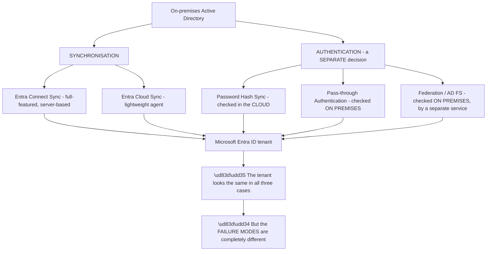
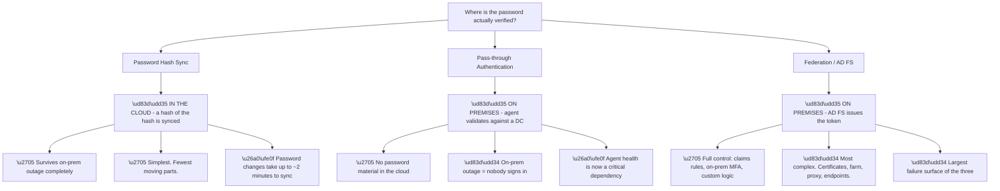
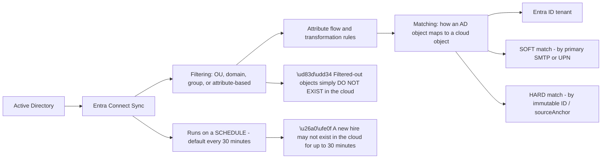
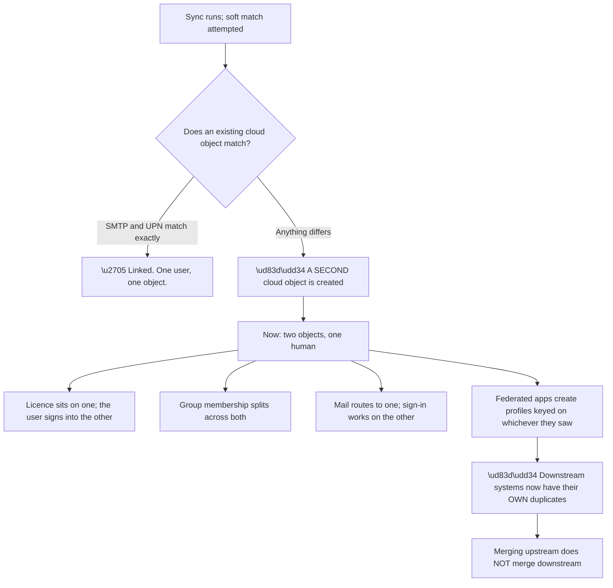
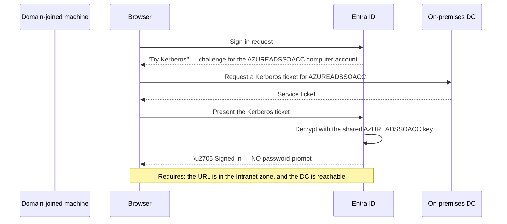
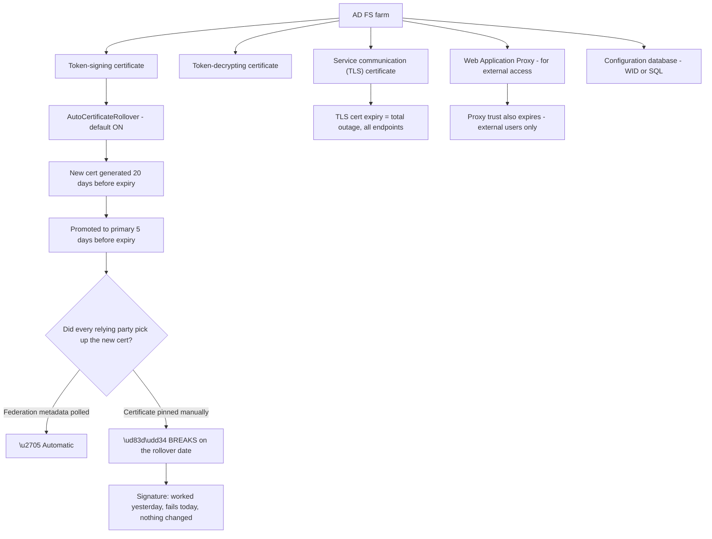
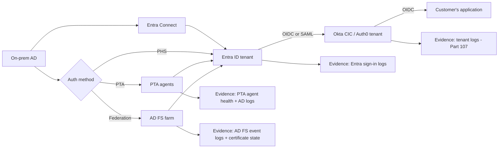
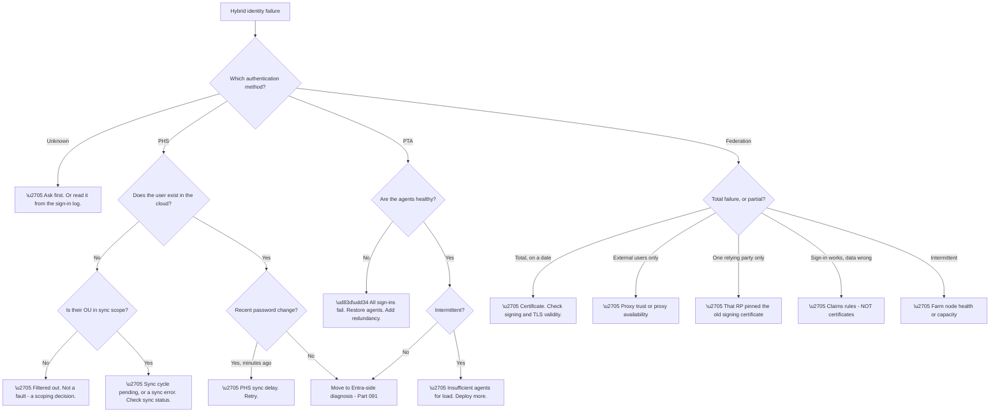

# Part 092 - Hybrid Identity: Entra Connect, PHS, PTA, AD FS, and Seamless SSO

> Section goal: Understand the four ways an on-premises Active Directory can be joined to Microsoft Entra ID — and, critically, *where the password is actually checked* in each — because that one fact determines the entire shape of a troubleshooting investigation.

Covers index item **092**. Maps to JD signals: *Active Directory*, *Azure Identity*, *Microsoft Entra ID*, *authentication and authorization*, *SAML*, *troubleshooting complex technical issues*.

---

## 1. Start From Zero: Two Directories, One Identity

Most enterprises have both an on-premises Active Directory and a Microsoft Entra ID tenant. They are different products (Part 090), so joining them requires **synchronisation** — copying objects from one to the other — plus a decision about **where authentication happens**.

**Those are two separate decisions**, and conflating them is the most common source of confusion in this area.

| Decision | Options | What it controls |
|---|---|---|
| **Synchronisation** | Entra Connect Sync, or Entra Cloud Sync | Which objects and attributes exist in the cloud |
| **Authentication** | PHS, PTA, or Federation (AD FS) | Where the password is actually verified |

**The blue node is the diagnostic key.** From the outside — from an application, or from a customer identity platform federating to the tenant — **all three authentication methods look identical**. The tenant issues tokens, users sign in, everything is standard OIDC or SAML.

**But when it breaks, they break in completely different places.** So on any hybrid identity ticket, the first question is not "what's the error" — it is **"which authentication method is in use?"** Everything downstream depends on the answer.

> 💡 **Tie-in to your background:** you have worked with both Active Directory and Azure Identity. Hybrid identity is exactly the seam between them, and being able to name the three authentication methods and their distinct failure modes is a concrete demonstration that you understand both rather than one.

### 🔍 Plain-English deep-dive: "where is the password checked?" is the question that organises everything

One question separates three architectures, and it predicts almost every failure characteristic.

**Read down the three columns and the trade-off is stark**, and it is fundamentally about where you are willing to place a dependency.

| Property | PHS | PTA | Federation |
|---|---|---|---|
| Survives on-prem outage | ✅ | ❌ | ❌ |
| Password material in cloud | Hash of hash | ❌ None | ❌ None |
| Infrastructure to maintain | Minimal | Agents | **Full farm + proxy** |
| Certificate management | None | None | **Ongoing, and expiring** |
| Immediate password revocation | ~2 min delay | ✅ Immediate | ✅ Immediate |
| Custom claims logic | ❌ | ❌ | ✅ |
| On-premises MFA | ❌ | ❌ | ✅ |
| Complexity of failure diagnosis | Low | Medium | **High** |

**Microsoft's own guidance now favours PHS for most organisations**, and the last row explains much of why: **federation adds an entire on-premises service, its proxy, and a set of expiring certificates to the critical path of every single sign-in.** That is a large amount of failure surface in exchange for capabilities most organisations do not use.

**The "hash of a hash" point deserves precision**, because it is frequently mischaracterised as "passwords in the cloud." What is synchronised is not the password and not the AD password hash — it is a **further hash of the AD hash**, produced with a per-user salt and many thousands of iterations. **It cannot be used to authenticate against the on-premises AD**, which is the security property that matters.

**Row five is the operational nuance to know.** With PHS, a password reset or a disabled account takes up to about two minutes to reach the cloud. **For a routine change that is irrelevant; during a security incident it matters**, and it is worth mentioning proactively when someone asks about revocation speed.

**Analogy:** three ways to check a membership card at a branch office. Keep a verified copy of the records locally (PHS — works even if head office is closed). Phone head office each time (PTA — always current, useless if the line is down). Or have head office issue signed letters that the branch accepts (federation — flexible, and the letterhead expires). **Where it stops:** a person could use judgement if head office were unreachable. None of these three can.

---

## 2. Entra Connect: What Actually Synchronises

Synchronisation is a separate concern from authentication, and it has its own distinct failure modes.

**The two warning nodes cover most synchronisation tickets.**

**Filtering is invisible from the cloud side.** An object excluded by an OU filter, a domain filter, or an attribute rule does not appear as "disabled" or "pending" — **it does not exist at all.** The administrator sees the user in AD, the cloud shows nothing, and there is no error anywhere because nothing failed. This is the most common "the user isn't syncing" cause, and it is a configuration decision rather than a fault.

**The 30-minute schedule** produces the onboarding complaint: a new hire created in AD cannot sign in to cloud services immediately. **Nothing is broken; the sync cycle simply has not run.** A manual cycle resolves it, and the expectation-setting is the real fix.

**Source anchor and immutable ID** deserve a specific caution:

| Concept | Meaning |
|---|---|
| **Source anchor** | The AD attribute that permanently links an AD object to its cloud object |
| **`ms-DS-ConsistencyGuid`** | The modern default — writable, survives forest migration |
| **`objectGUID`** | The legacy default — does not survive a forest migration |
| **`immutableId`** | The cloud-side representation, base64 of the source anchor |

**Changing the source anchor after deployment is genuinely disruptive** — it breaks the link between every AD object and its cloud counterpart, producing duplicate objects. **This is why `ms-DS-ConsistencyGuid` became the default**: it can be written, so it survives a forest migration or consolidation, whereas `objectGUID` cannot and does not.

**Soft match versus hard match** explains a specific class of duplicate-account problem. A **soft match** links an AD object to an existing cloud object by matching primary SMTP address or UPN. It is convenient and it is fragile — **if the addresses do not match exactly, a second cloud object is created instead of linking**, and the user ends up with two accounts. A **hard match** uses the immutable ID and is deterministic.

### 🔍 Plain-English deep-dive: the duplicate account, and why it is so hard to unpick

Duplicate cloud accounts are the most expensive synchronisation failure, because the damage accumulates before anyone notices.

**Node W1 is why this is expensive rather than merely annoying.** By the time the duplicate is noticed, downstream applications — including a CIAM tenant — have created their own user profiles keyed on whichever object they encountered. **Merging the two cloud objects does not merge the downstream profiles**, and each system needs its own remediation.

**The causes are small and mundane**, which is what makes them easy to introduce:

| Cause | Detail |
|---|---|
| UPN suffix differs from the mail domain | `jo@contoso.local` vs `jo@contoso.com` |
| Proxy address missing or secondary | The primary SMTP is not what you expect |
| Case or whitespace difference | Exact-match comparison |
| Cloud object created manually first | Then AD object syncs and does not match |
| Source anchor changed | **Every** object re-evaluates at once |

**Row four is the most common human cause.** An administrator creates a cloud-only account for someone who has not been set up in AD yet, the AD account is created later, and the two never link — producing exactly the split above.

**Row five is the catastrophic one.** Changing the source anchor invalidates every existing link simultaneously, so the next sync cycle attempts to soft-match the entire directory. **Anything that does not match perfectly duplicates.** This is why source anchor changes are treated as a migration project rather than a configuration edit.

**The prevention is straightforward and worth recommending:** align UPN suffixes with mail domains before enabling sync, verify primary SMTP addresses, and avoid creating cloud-only objects for people who will later be synced. **The detection is equally straightforward** — a report of cloud objects with no on-premises source anchor, run periodically, surfaces them before the downstream damage spreads.

**Analogy:** two personnel files opened for one employee because the second was filed under a slightly different spelling. Payroll uses one, the security pass uses the other, and every department that copied a reference now has its own inconsistency. **Where it stops:** a person would spot the same name. An exact-match rule will not, and it does so silently.

---

## 3. Seamless SSO and Device-Based Sign-In

Seamless SSO removes the password prompt for users on domain-joined machines, and it works through a mechanism worth understanding because it fails in a distinctive way.

**Two requirements in the final note are where it breaks:**

| Requirement | Failure if unmet |
|---|---|
| Entra URLs in the browser's **Intranet zone** | Browser will not send Kerberos automatically → password prompt |
| **DC reachable** | No ticket obtainable → password prompt |
| `AZUREADSSOACC` key **rotated** (recommended every 30 days) | Stale key → failures |
| Browser supports integrated auth | Some browsers need explicit configuration |

**The symptom is always the same and always mild:** the user is prompted for a password instead of signing in silently. **Nothing fails; the experience degrades.** That makes it low-urgency and persistently annoying, and it also makes it easy to misattribute — users report "SSO isn't working" when authentication is working perfectly.

**The distinguishing question:** *"are you prompted for a password, or does sign-in fail?"* A prompt means Seamless SSO; a failure means something else entirely.

**Device join states** are a related concept that surfaces constantly in Conditional Access:

| State | Meaning |
|---|---|
| **Entra registered** | Personal device with a work account added — BYOD |
| **Entra joined** | Cloud-only corporate device, no on-premises AD |
| **Hybrid Entra joined** | Domain-joined **and** registered in Entra |

**The third state is the one hybrid organisations depend on**, because Conditional Access policies requiring a "hybrid Azure AD joined device" only succeed for devices in that state. **A device that is domain-joined but has not completed Entra registration fails those policies** — and from the user's perspective, their perfectly normal corporate laptop is being rejected.

### 🔍 Plain-English deep-dive: AD FS, and why its failures are dated

AD FS is the most complex option and produces the most distinctive failure signature of the three: **failures that correlate with a date.**

**The signature in node S is the one to memorise:** *"it worked yesterday, nothing changed, and now every user fails."* **A total, sudden, date-correlated failure with no configuration change is a certificate event until proven otherwise** — and it is the same reasoning as Part 081 for SAML and Part 088 for LDAPS.

**AutoCertificateRollover is helpful and incomplete.** AD FS generates and promotes new signing certificates automatically. **But relying parties that pinned the old certificate manually — rather than polling federation metadata — do not know**, and they break precisely when the rollover completes. The organisation did everything right on the AD FS side and a partner integration still fails.

**The proxy trust in node S3 produces a particularly instructive symptom:** the Web Application Proxy's trust certificate expires separately, and when it does, **external users fail while internal users are unaffected.** A failure that splits by network location, with no other pattern, points there directly.

| Symptom | Likely AD FS cause |
|---|---|
| Total failure on a specific date | Signing or TLS certificate |
| External users only | Proxy trust or proxy availability |
| One relying party only | That RP pinned the old certificate |
| Successful sign-in, missing claims | **Claims rules** — not certificates |
| Intermittent under load | Farm node health or capacity |
| Fails after a Windows update | Farm node configuration drift |

**Row four is the important discriminator.** Claims-rule problems produce *successful authentication with wrong or missing data* — the same shape as Part 090's missing-claim case. **If the user signs in and the profile is wrong, stop looking at certificates.**

**Why this matters for customer identity work:** a customer federating into a CIAM platform via AD FS brings all of this with them. **Their AD FS certificate rollover becomes your outage**, and recognising the date-correlated signature quickly is worth a great deal.

**Analogy:** an office that issues signed letters of introduction, where the signature stamp is replaced on a schedule. Anyone who verifies against the current published stamp is fine; anyone who photocopied the old stamp for reference rejects every letter from the changeover date. **Where it stops:** a person would query an unexpected signature. An automated verifier just rejects it.

---

## 4. What Reaches a Customer Identity Platform

When a customer connects their hybrid environment to a customer identity tenant, the layering determines what evidence exists and where.

**Four evidence sources, and which ones you need depends entirely on the authentication method:**

| Method | Evidence to request |
|---|---|
| **PHS** | Entra sign-in logs, sync status. Simplest. |
| **PTA** | Entra sign-in logs **plus agent health** |
| **Federation** | Entra sign-in logs **plus AD FS event logs plus certificate dates** |
| All | The CIAM tenant log, always |

**The practical opening question on any hybrid ticket** is therefore: *"Is your Entra tenant using password hash sync, pass-through authentication, or federation?"* — because it determines which of four evidence sets you need, and asking it first avoids two rounds of correspondence.

**A useful secondary signal when the customer does not know:** the sign-in log records the authentication method per sign-in, so **the answer is usually already in evidence they can send you**, without anyone needing to check the configuration.

---

## 5. Failure Modes

| # | Failure mode | Symptom | Root cause | First check |
|---|---|---|---|---|
| 1 | Object filtered from sync | User exists in AD, not in cloud | Sync scoping rule | Is the OU in scope? |
| 2 | Sync cycle not run | New hire cannot sign in briefly | 30-minute schedule | How long since creation? |
| 3 | Soft match failed | **Duplicate cloud accounts** | Address mismatch | Compare SMTP/UPN exactly |
| 4 | Source anchor changed | Mass duplicate objects | Anchor reconfigured | Was the anchor changed? |
| 5 | PHS delay | Password change not effective yet | ~2-minute sync | Does it work after a few minutes? |
| 6 | PTA agent down | **Everyone** fails to sign in | On-prem dependency | Agent health status |
| 7 | PTA agent count | Intermittent failures under load | Single agent, no redundancy | How many agents? |
| 8 | AD FS signing cert rollover | Total failure on a date | Pinned certificate at an RP | Certificate validity dates |
| 9 | AD FS TLS cert expired | Total outage | Certificate lifetime | Check the service cert |
| 10 | Proxy trust expired | **External users only** | WAP trust certificate | Does it work internally? |
| 11 | Claims rule wrong | Sign-in works, claims missing | Rule configuration | Is authentication succeeding? |
| 12 | Seamless SSO zone | Password prompt, not failure | Intranet zone config | Prompt or failure? |
| 13 | `AZUREADSSOACC` key stale | Seamless SSO stops working | Key not rotated | When was it last rotated? |
| 14 | Device not hybrid joined | CA device policy blocks | Registration incomplete | Check the device join state |

---

## 6. Troubleshooting Decision Tree: Hybrid Identity Failures

### Worked example

A B2B customer reports that their employees stopped being able to sign in to a partner application "this morning." Everyone is affected. Nothing was changed.

**Node B: they use federation with AD FS.** That alone narrows things considerably.

**Node H: total failure, correlated with a date, no change.** Straight to H1.

**Checking the certificates.** The AD FS token-signing certificate rolled over overnight — AutoCertificateRollover promoted the new certificate to primary exactly as designed.

**So AD FS is working correctly.** The customer's Entra tenant, which polls federation metadata, picked up the new certificate without incident. **Internal Microsoft 365 sign-ins are fine**, which the customer confirms when asked — a detail they had not thought to mention.

**The failure is one layer further out.** The partner application federates through a customer identity platform, and **that connection was configured with a manually-uploaded certificate** rather than a metadata URL. It is still pinned to the old signing certificate.

**Nothing broke.** A scheduled, correct, well-designed rollover completed, and one downstream consumer had opted out of the mechanism that makes rollovers safe.

**The immediate fix** is to upload the new certificate. **The actual fix** is to configure the connection with the federation metadata URL so future rollovers are automatic — otherwise this recurs on a schedule, roughly annually, forever.

**What made it fast:** asking whether *other* sign-ins were also failing. **"What still works?" is as diagnostic as "what's broken"** — internal sign-ins working proved AD FS and Entra were healthy and located the fault precisely at the one consumer that was not following metadata.

---

## 7. Lab: Model Hybrid Identity Safely

**Purpose.** Understand the three authentication methods and the sync model well enough to diagnose them, without building an AD FS farm — which is neither practical nor necessary.

**Prerequisites.**
- The free Entra tenant from Part 090
- Optionally, a disposable Windows Server VM with AD DS for the sync portion
- **Never** connect any lab to an employer directory or tenant

**Steps.**

1. **Document the decision tree from memory** before reading anything: three authentication methods, where the password is checked in each, and one distinctive failure for each. Then check yourself against §1.
2. **If you have a lab AD:** install Entra Connect in a test configuration against your free tenant, with a small fictional OU in scope.
3. **Observe the sync cycle.** Create a user in AD and time how long it takes to appear in the cloud. Record the actual delay.
4. **Demonstrate filtering.** Create a user in an OU that is *not* in scope. Confirm it never appears in the cloud, and confirm **no error is generated anywhere.**
5. **Force a sync cycle** manually and observe the difference.
6. **Inspect the source anchor.** Find `ms-DS-ConsistencyGuid` on a synced user and the corresponding `immutableId` in the cloud. **Confirm the relationship between them.**
7. **If you cannot build a lab AD:** instead, write out the four evidence sources from §4 and, for each of the fourteen failure modes in §5, state which evidence source would reveal it. **This is the transferable skill; the lab is only a way of grounding it.**
8. **Read a real AD FS certificate rollover timeline** from Microsoft's documentation and write the dates out as a timeline: generation, promotion, expiry. **Note where a pinned relying party breaks.**
9. **Write a customer-facing explanation** of the certificate scenario from §6, in plain language, without blaming anyone.

**Expected evidence.**
- Your written decision tree, produced from memory then corrected
- Measured sync delay, if you built a lab
- A filtered user that never appeared, with confirmation that nothing errored
- A failure-mode-to-evidence-source mapping table
- A plain-language customer explanation of the rollover scenario

**Validation rubric.**

| Criterion | Pass |
|---|---|
| Three methods | You can state where the password is checked in each, instantly |
| Trade-offs | You can explain why PHS is generally recommended |
| Sync vs auth | You can explain that these are separate decisions |
| Filtering | You can explain why a filtered user produces no error |
| Certificates | You can recognise the date-correlated signature |
| Evidence routing | You can name which logs to request for each method |
| Safety | No employer or customer system was touched |

**Cleanup and privacy.** Delete the lab VM, the Entra Connect installation, and any synced objects; remove the sync configuration from your free tenant. **Never install Entra Connect against a tenant you do not own**, and never point a lab at an employer directory — a misconfigured sync can write to production objects. Use fictional users throughout.

---

## 8. JD Mapping

| JD signal | How this Part addresses it |
|---|---|
| Active Directory | The on-premises half of every hybrid topology |
| Azure Identity / Entra ID | The cloud half, and the join between them |
| Authentication and authorization | Three distinct authentication architectures |
| SAML | AD FS as a SAML/WS-Fed identity provider |
| Troubleshooting complex technical issues | Fourteen failure modes and a method-first decision tree |
| Root cause analysis | The example shows a correct system with one non-conforming consumer |
| Enterprise connections | What a customer brings when they federate a hybrid environment |

---

## 9. Candidate Honesty Note

- **Production experience:** Active Directory and Azure Identity from the support side, including sign-in and access failures in environments that were almost certainly hybrid.
- **Production experience:** recognising certificate-expiry-shaped failures and correlating "what still works" against "what broke."
- **Lab experience:** modelling the sync and filtering behaviour against a personal tenant, and mapping failure modes to evidence sources, as above.
- **Learned architecture:** AD FS farm design, certificate rollover mechanics, PTA agent topology.
- **No direct experience:** deploying Entra Connect in production, operating an AD FS farm, or migrating an organisation between authentication methods.
- **How to say it:** *"I've supported environments that were hybrid without always owning the hybrid plumbing. What I've made sure I can do is ask the question that organises the investigation — which authentication method is in use — because that determines whether I'm looking at sync, at agents, or at AD FS certificates. I haven't deployed Entra Connect or run an AD FS farm, and I'd say so."*

---

## 10. Official Source Anchors

| Source | Why | Accessed |
|---|---|---|
| Microsoft Learn — Choose the right authentication method for hybrid identity | The authoritative comparison | Accessed **26 August 2026** |
| Microsoft Learn — Password hash synchronisation implementation | What is actually synchronised, and how | Accessed **26 August 2026** |
| Microsoft Learn — Pass-through Authentication | Agent architecture and requirements | Accessed **26 August 2026** |
| Microsoft Learn — Entra Connect Sync: source anchor | `ms-DS-ConsistencyGuid` and immutable ID | Accessed **26 August 2026** |
| Microsoft Learn — AD FS certificates and AutoCertificateRollover | Rollover timeline and behaviour | Accessed **26 August 2026** |
| Microsoft Learn — Seamless single sign-on | `AZUREADSSOACC`, zone requirements, key rotation | Accessed **26 August 2026** |
| Microsoft Learn — Device identity and join states | Registered, joined, hybrid joined | Accessed **26 August 2026** |

> **Revalidate:** Microsoft's recommendations in this area have shifted over time — particularly the move away from federation toward PHS, and the introduction of Cloud Sync alongside Connect Sync. Re-check current guidance on Microsoft Learn before interview rather than asserting a preference from memory.

---

## ⭐ Likely Interview Questions for This Section

### Q1. "What are the ways an on-premises AD can be connected to Entra ID?"

> *Model answer:* There are two separate decisions, and conflating them causes most of the confusion. The first is synchronisation — Entra Connect Sync or the lighter Cloud Sync — which determines which objects and attributes exist in the cloud at all. The second is authentication, which determines where the password is actually verified, and there are three options: password hash sync, where a hash of the AD hash is synchronised and verification happens in the cloud; pass-through authentication, where an on-premises agent validates against a domain controller; and federation with AD FS, where an on-premises service issues the token. From outside, all three look identical — the tenant issues standard tokens either way. But they fail in completely different places, which is why identifying the method is the first question on any hybrid ticket.

### Q2. "Why is password hash sync generally recommended?"

> *Model answer:* Because it has by far the smallest failure surface. There is no on-premises component in the authentication path, so sign-ins keep working through an on-premises outage — which is a genuinely valuable property. There are no certificates to expire, no agents to keep healthy, and no farm to patch. Pass-through authentication and federation both put on-premises infrastructure in the critical path of every sign-in, and federation additionally adds a proxy and a set of expiring certificates. The security objection to PHS is usually a misunderstanding: what synchronises is not the password and not the AD hash but a further salted, heavily-iterated hash of the hash, which cannot be used to authenticate against the on-premises directory. The real trade-off is that a password change takes up to about two minutes to reach the cloud, which matters during an incident and not otherwise.

### Q3. "A customer's users can't sign in at all this morning and nothing was changed. What's your first hypothesis?"

> *Model answer:* A certificate event, if they are federated. A total, sudden, date-correlated failure with no configuration change is the classic certificate signature. My first question would actually be what *still* works — if internal sign-ins are fine and only one relying party fails, then AD FS is healthy and rolled over correctly, and the failing consumer pinned the old signing certificate manually instead of polling federation metadata. If everything fails including internal, I would check the service TLS certificate. If only external users fail, I would look at the web application proxy trust, which expires separately. If they use pass-through authentication instead, the equivalent hypothesis is agent health, since a failed agent takes down every sign-in at once.

### Q4. "A user exists in AD but not in the cloud, and there's no error anywhere. Why?"

> *Model answer:* Almost certainly a synchronisation filter. Objects can be scoped out by OU, domain, group, or attribute, and a filtered object does not appear in the cloud as disabled or pending — it simply does not exist. Nothing failed, so nothing is logged as an error, which is exactly why it is confusing. The check is whether the user's OU is in sync scope. The other possibility, if the user was created very recently, is that the sync cycle has not run yet — the default is every thirty minutes, so a new hire genuinely may not exist in the cloud for half an hour. Those two are easy to distinguish by asking when the account was created.

### Q5. "What is Seamless SSO and how do you recognise its failure?"

> *Model answer:* It removes the password prompt for users on domain-joined machines by having Entra ID accept a Kerberos ticket for a computer account called AZUREADSSOACC that Entra Connect creates in the on-premises directory. The distinguishing thing about its failure is that it *degrades* rather than breaks: the user gets a password prompt instead of signing in silently. Nothing actually fails. So my first question is always "are you prompted for a password, or does sign-in fail?" — a prompt points at Seamless SSO, a failure points somewhere else entirely. The usual causes are the Entra URLs not being in the browser's Intranet zone, the domain controller being unreachable, or the AZUREADSSOACC key not having been rotated.

### Q6. "Explain soft match and hard match, and why it matters."

> *Model answer:* When Entra Connect synchronises an object, it needs to decide whether it corresponds to an existing cloud object or should create a new one. A hard match uses the immutable ID derived from the source anchor and is deterministic. A soft match links by primary SMTP address or UPN, which is convenient but fragile — if the addresses do not match exactly, no link is made and a second cloud object is created instead. The user then has two accounts, which surfaces as confusing behaviour like licences applying to the wrong one or group membership appearing incomplete. The related risk is changing the source anchor after deployment, which breaks the link for every object at once and produces duplicates at scale. That is why the modern default is `ms-DS-ConsistencyGuid`, which is writable and survives a forest migration, unlike `objectGUID`.

### Q7. "What evidence do you ask for on a hybrid identity ticket?"

> *Model answer:* It depends entirely on the authentication method, so I ask that first. For password hash sync I need the Entra sign-in logs and the sync status — that is usually enough. For pass-through authentication I need the sign-in logs plus the agent health status, because a failed agent takes down all sign-ins. For federation I need the sign-in logs plus AD FS event logs and the certificate validity dates. In all three cases I also want the customer identity tenant's own logs for the same attempt, correlated by timestamp and user. If the customer does not know which method they use, that is fine — the sign-in log records the authentication method per sign-in, so the answer is usually already in evidence they can send me.

### Q8. "How does a customer's hybrid setup become your problem in a CIAM support role?"

> *Model answer:* Because the customer identity tenant sits downstream of all of it. If their AD FS signing certificate rolls over and the enterprise connection was configured with a manually uploaded certificate instead of a metadata URL, that rollover becomes an outage in our product from the customer's point of view. If their pass-through agents fail, every enterprise login through that connection fails. If their sync filters exclude a group of users, those users simply do not exist to authenticate. None of that is visible from the application, which just reports a generic login failure. So part of the job is recognising the signature — total and date-correlated, or population-shaped, or external-users-only — and then asking for the right evidence from the right layer, which is often a layer the customer had not thought to look at.

---

## 🧠 30-Second Memory Hooks

- **Sync and authentication are two separate decisions.**
- **PHS = checked in the cloud. PTA = checked on-prem by an agent. Federation = AD FS issues the token.**
- **First question on any hybrid ticket: which authentication method?**
- **PHS survives an on-prem outage. PTA and federation do not.**
- **PHS syncs a hash of a hash — not the password, not the AD hash.**
- **Filtered-out users produce NO error. They simply do not exist.**
- **Default sync cycle 30 minutes → new hires wait.**
- **Soft match by SMTP/UPN → mismatch creates a duplicate account.**
- **Seamless SSO failure = a password *prompt*, not a failure.**
- **Total + dated + nothing changed = certificate.**
- **External users only = proxy trust.**
- **Sign-in works but claims wrong = claims rules, not certificates.**
- **Ask "what still works?" — it locates the fault.**

---

## ✅ Completion Checklist

- [ ] I can explain that sync and authentication are separate decisions
- [ ] I can state where the password is checked in all three methods
- [ ] I can explain why PHS is generally recommended, and answer the security objection
- [ ] I can explain why a filtered user generates no error
- [ ] I can explain soft match versus hard match and the duplicate-account outcome
- [ ] I can explain source anchor and why changing it is disruptive
- [ ] I can recognise Seamless SSO failure by the prompt-versus-failure distinction
- [ ] I can recognise the date-correlated certificate signature in AD FS
- [ ] I can name the right evidence source for each authentication method
- [ ] I have completed the lab or the evidence-mapping alternative
- [ ] I can state honestly what hybrid work I have done and what I have not

*Next suggested section:* **[Part 093 - Using Entra ID as an Enterprise Identity Provider for CIAM](Part-093-using-entra-id-as-an-enterprise-identity-provider-for-ciam.md)** — bringing everything from Parts 087–092 together into the specific integration a customer identity platform actually configures.
