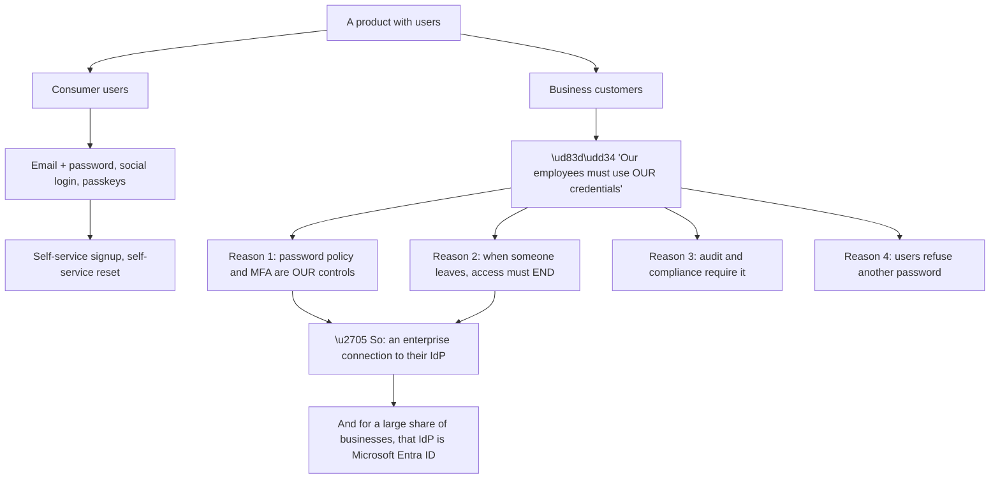
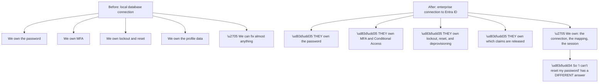
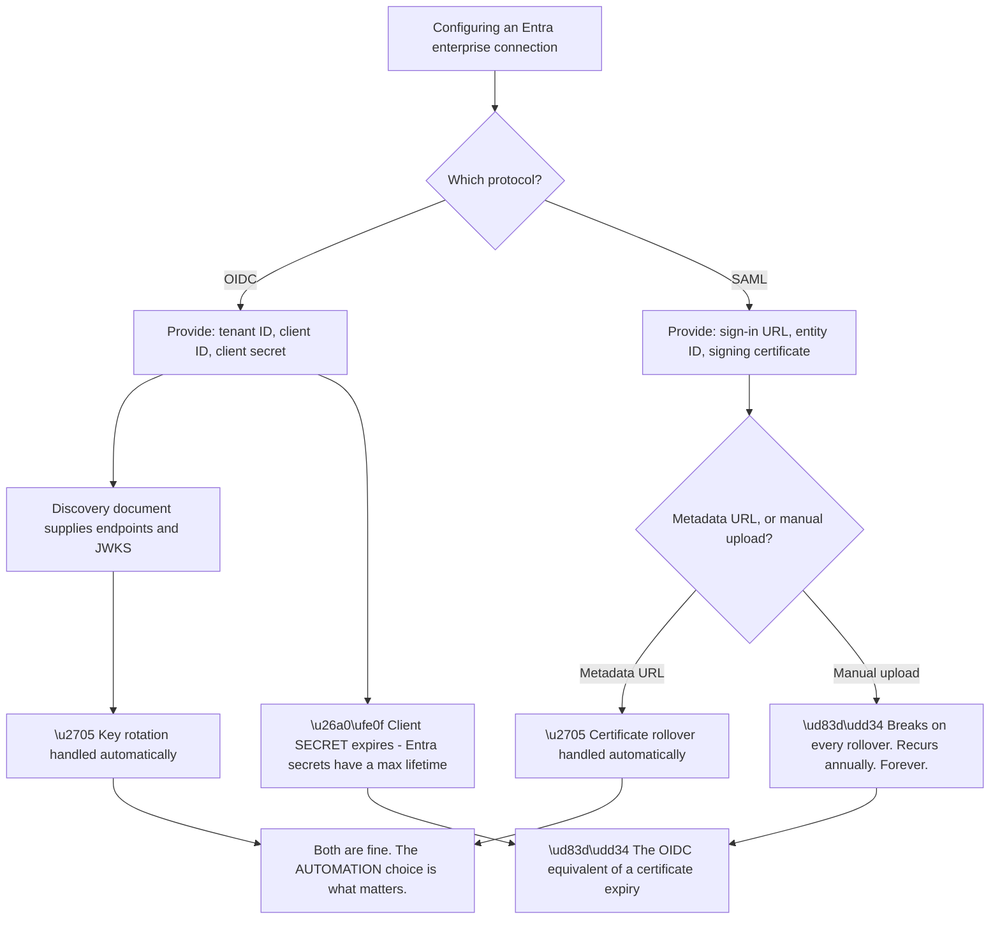
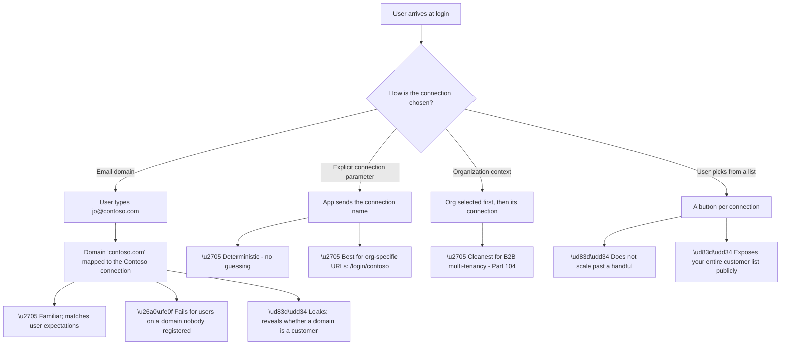
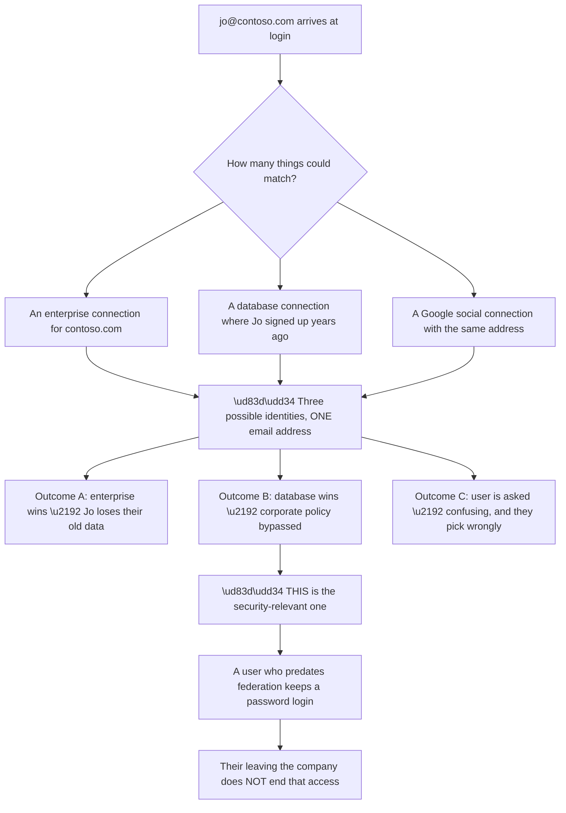
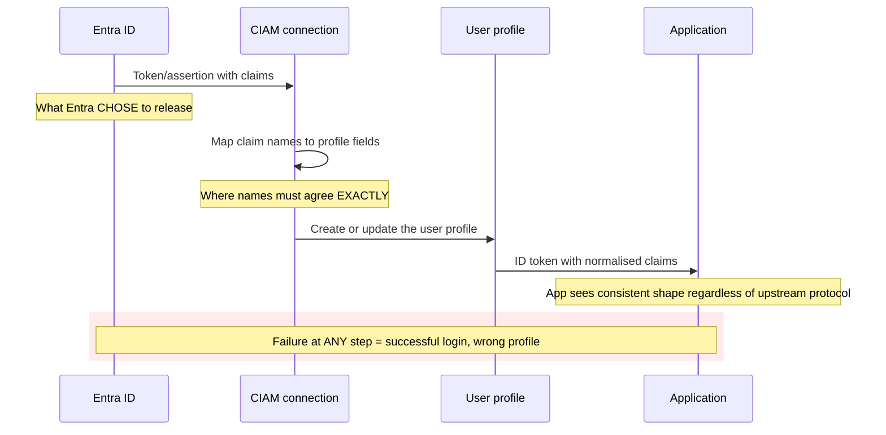
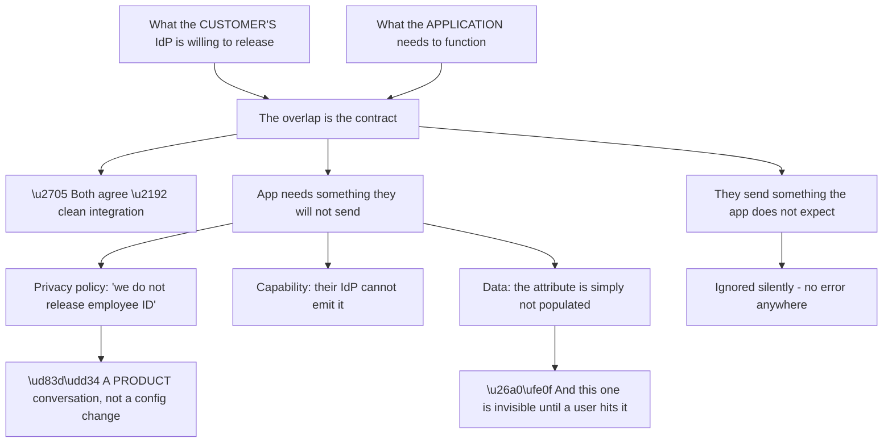
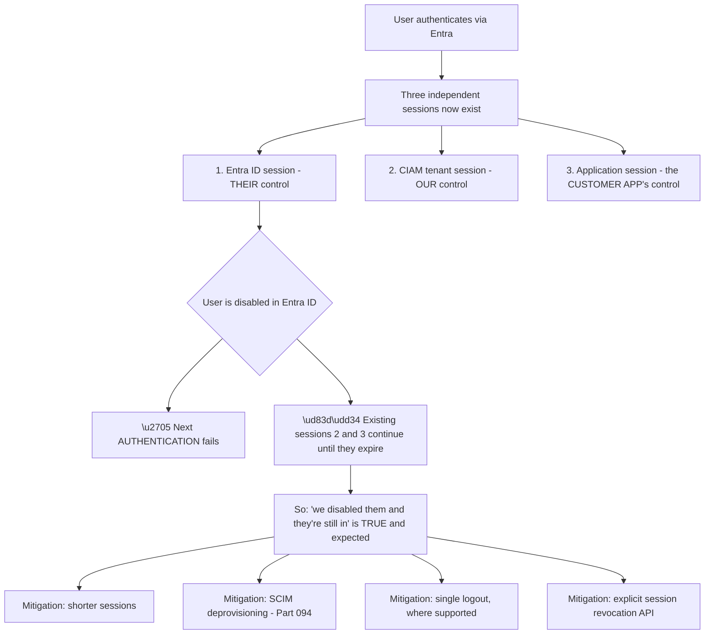
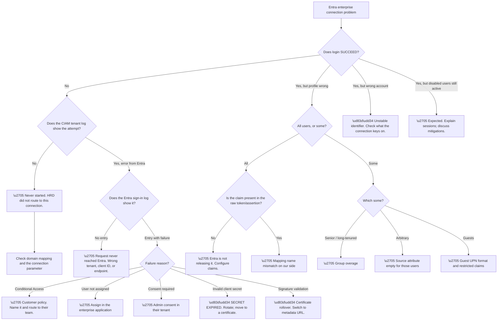

# Part 093 - Using Entra ID as an Enterprise Identity Provider for CIAM

> Section goal: Bring Parts 087–092 together into the specific integration you will actually support — a B2B customer federating their Microsoft Entra ID tenant into a customer identity platform — including the protocol choice, the claim mapping, and the failures that follow.

Covers index item **093**. Maps to JD signals: *Microsoft Entra ID*, *SAML*, *OAuth 2.0 and OIDC*, *enterprise connections*, *authentication and authorization*, *troubleshooting complex technical issues*, *customer-facing communication*.

---

## 1. Start From Zero: Why a CIAM Platform Talks to Entra ID at All

A customer identity platform serves **consumers** — people signing up for a product with an email address, a Google account, or a passkey. So why does it need to federate to a corporate directory?

Because most products that start consumer-facing eventually sell to businesses, and **business buyers require that their employees sign in with their existing corporate credentials.** That requirement is not negotiable in enterprise sales.

**Reason two is the strongest and the one to lead with in customer conversations.** Without federation, deprovisioning a leaver means remembering to remove them from every SaaS product individually. **With federation, disabling the account in the corporate directory ends access everywhere immediately** — because every sign-in is a fresh trip to their IdP.

**And Entra ID is disproportionately common**, because a very large share of businesses already run Microsoft 365, which means they already have an Entra tenant, already have their users in it, and already have MFA and Conditional Access configured. **Federating to it is the path of least resistance for them**, which is exactly why it appears so often in support queues.

> 💡 **Tie-in to your background:** you have supported Microsoft 365 workloads, which means you have supported organisations whose identity foundation is Entra ID. The customer side of this integration — their tenant, their policies, their admins — is territory you already know.

### 🔍 Plain-English deep-dive: what changes when identity moves outside your control

Federating shifts several responsibilities to the customer, and being explicit about which ones prevents a great deal of misdirected troubleshooting.

**The red node captures a real and frequent support moment.** A federated user asking for a password reset must be redirected to their own IT department — **the platform has no password for them and never did.** Saying that clearly and kindly, rather than apologetically, is the correct response.

| Request | Federated answer |
|---|---|
| "Reset my password" | Your IT team — we don't hold it |
| "Turn off MFA for me" | Your IT team's policy |
| "Unlock my account" | Your IT team |
| "Why am I blocked?" | Your IT team's Conditional Access — we can show the error |
| "My name is wrong" | Their directory, unless we allow local overrides |
| "I can't sign in at all" | ✅ **Ours to investigate** — connection, mapping, session |

**Only one row is genuinely ours**, and that clarity is valuable rather than dismissive. **It routes the customer to the team that can actually help them**, instead of leaving them in a queue where nobody can.

**The nuance that keeps it from sounding like deflection:** we can still *show them the evidence*. The tenant log records what the connection sent and what came back, and the error from Entra is often specific enough to hand to their IT team as a starting point. **"That's your IT team, and here's exactly what their system returned" is a completely different interaction from "that's not us."**

**And one responsibility is easy to overlook:** **we own the session.** Even when the customer owns authentication, the platform decides how long the local session lasts and whether it re-checks with the IdP. **A user disabled in Entra ID may still have a valid session with us until it expires** — which is a real security conversation to have honestly, and Part 105 and Part 110 return to it.

**Analogy:** a building that accepts another company's staff passes. You control the door and the visitor log; they control who has a pass and whether it still works. When someone's pass is refused, the answer is with their employer — but you can at least tell them exactly what the reader said. **Where it stops:** you might let a known face in anyway. A federation cannot, and should not.

---

## 2. The Protocol Choice: OIDC or SAML

Entra ID can act as an OIDC provider or a SAML identity provider. **Both work; the choice changes the failure modes**, and knowing which is configured is the first diagnostic fact.

| Aspect | OIDC connection | SAML connection |
|---|---|---|
| Configuration source | **Discovery document** — one URL | **Federation metadata** — one URL, or manual |
| Certificate management | **Automatic via JWKS** | Metadata URL, or **manual upload** |
| Claim format | JSON claims in a JWT | XML attribute statements |
| Message transport | Query/fragment/form POST | **Form POST — cross-site (Part 072)** |
| Debugging | Decode a JWT | Base64 + inflate + read XML |
| Rollover safety | ✅ Handled by JWKS `kid` | ⚠️ **Only if metadata is polled** |
| Setup friction | Lower | Higher |

**The bottom of the diagram is the real lesson, and it is protocol-independent.** Whichever protocol is chosen, **the connection either follows a live source of truth or it holds a static copy that expires.** Static copies produce a scheduled outage.

**The OIDC client secret in node O3 is the trap people miss** precisely because OIDC is generally the safer choice. Entra ID client secrets have a maximum lifetime — commonly up to two years — and **when one expires, the connection fails totally and suddenly with no configuration change.** It is the same signature as a certificate expiry, wearing different clothes.

| Expiring thing | Protocol | Automated alternative |
|---|---|---|
| SAML signing certificate | SAML | Metadata URL |
| OIDC client secret | OIDC | **Certificate credential**, or a diarised rotation |
| AD FS signing certificate | Either | Metadata URL |
| TLS certificates | Both | Standard renewal automation |

**Row two deserves the recommendation.** A certificate credential on the app registration avoids the short mandatory lifetime that applies to secrets, and it is the better practice. Where a secret must be used, **the expiry date belongs in a calendar with an owner**, because nothing else will surface it until it fails.

---

## 3. Home Realm Discovery: Routing the User to the Right Connection

With multiple enterprise connections configured, the platform must decide **which one applies to a given user** before authentication can begin.

**Node L2 is a genuine and under-appreciated problem.** A login page listing "Sign in with Contoso," "Sign in with Fabrikam," and so on **publishes the customer list to anyone who visits it.** For many businesses that is commercially sensitive.

**Node E4 is the subtler version of the same issue.** Domain-based discovery reveals, one domain at a time, whether an organisation is a customer — because entering an address either redirects to their IdP or does not. **It cannot be eliminated entirely while domain-based routing exists**, but it can be blunted by presenting a uniform interstitial rather than an immediate redirect.

**Node E3 is the most common operational ticket** in this area, and it has a specific shape:

| Cause | Detail |
|---|---|
| Subsidiary domains | `contoso.co.uk` not registered alongside `contoso.com` |
| Post-acquisition domains | Newly acquired company's domain unmapped |
| Contractor addresses | Personal or agency addresses, not corporate |
| Alias domains | Users have multiple valid addresses |
| Typos | `constoso.com` — routed nowhere, correctly |

**Rows one and two are the same underlying issue** and it is worth raising proactively at onboarding: **which domains, plural, should route to this connection?** Asking once at setup prevents a recurring ticket every time the customer adds a domain.

### 🔍 Plain-English deep-dive: the same email address, two connections — and who wins

Home realm discovery assumes one address maps to one connection. **Real organisations violate that assumption regularly**, and the resulting behaviour surprises everyone.

**Node D2 is the finding worth raising proactively when a customer adopts federation.** Users who signed up with a password *before* the enterprise connection existed still have that password login. **Federating does not retire those credentials automatically**, so the deprovisioning guarantee the customer believes they have bought does not cover them.

| Migration approach | Effect |
|---|---|
| Enable federation, leave old logins | ❌ Bypass remains; deprovisioning is incomplete |
| Disable password login for the domain | ✅ Forces everyone through federation |
| Link accounts on first federated login | ✅ Preserves data, retires the password |
| Delete old accounts | ❌ Loses history and owned resources |

**Row three is the correct answer in most cases**, and it is worth understanding as a pattern rather than a feature: on first federated sign-in, the platform recognises that a local account exists with the same verified address and **links** them, so the user's history survives while the password path is closed. **Part 105 covers the mechanics; the important thing here is knowing to ask for it during onboarding rather than after.**

**The verification caveat matters.** Linking on a matching email address is only safe if **both** addresses are verified — otherwise an unverified self-signup with a corporate address could capture the enterprise identity. **Automatic linking on unverified email is an account-takeover path**, and it is the same reasoning as Part 083's NameID caution.

**And the ordering question is worth asking explicitly at onboarding:** *"do any of your employees already have accounts in this product from before?"* **The answer is almost always yes**, and it converts a future security surprise into a planned migration step.

**Analogy:** issuing everyone a company pass while their old visitor passes still work. The new system is sound; the old passes were never collected. **Where it stops:** you could physically collect visitor passes. Credentials cannot be collected — they have to be deliberately retired.

---

## 4. Claim Mapping: Where Most Post-Login Problems Live

Authentication succeeding and the user profile being correct are **two different things**, and the gap between them is claim mapping.

**The highlighted note is the defining characteristic of this failure class:** nothing errors. **The user signs in successfully and the profile is empty or wrong**, which is a completely different investigation from a login failure and must be recognised as such immediately.

| Where it breaks | Symptom | Fix |
|---|---|---|
| Entra not releasing the claim | Field always empty for everyone | Configure optional claims / claims mapping |
| Attribute empty in the directory | Empty for **some** users | Populate the source attribute |
| Claim name mismatch | Empty despite being sent | Align the mapping |
| Wrong field mapped | Data in the wrong place | Correct the mapping |
| Format mismatch | Present but unusable | Transform (e.g. GUID vs name) |
| Group overage (Part 091) | Groups empty for **senior staff** | Handle `_claim_names` |

**Row two versus row one is the discriminator worth internalising.** *Everyone* affected points at configuration; *some* users affected points at data. **That single question — "is it all users or some users?" — splits the investigation immediately**, and it is the same reasoning as Part 088's population-split heuristic.

**SAML claim names are a specific source of friction.** Entra ID emits SAML attributes with long URI-style names such as `http://schemas.xmlsoap.org/ws/2005/05/identity/claims/emailaddress`, while the receiving side may expect `email`. **They are the same data under different names**, and the mapping must be explicit. Reading the raw assertion (Part 082) is the fastest way to see the actual names rather than the assumed ones.

**And the identifier choice recurs here**, as it has in Parts 083, 087, and 091: the connection must key users on something stable. **`oid` (or the SAML NameID configured to the object ID) is correct; `email` and `upn` are not**, for all the reasons already established — with the added CIAM-specific danger that a reassigned email address silently grants a new employee a departed one's account.

### 🔍 Plain-English deep-dive: why claim mapping is where the two organisations must actually agree

Everything else in an enterprise connection is mechanical — endpoints, certificates, protocol. **Claim mapping is the only part that requires two organisations to agree on meaning**, which is why it is where the negotiation happens.

**Node R1 is the reclassification worth making early.** When an application requires a claim the customer will not or cannot release, **that is not a support ticket to solve** — it is a requirements conversation. Treating it as a configuration problem produces days of back-and-forth that cannot succeed.

| Situation | Correct handling |
|---|---|
| They will not release it (policy) | Can the app work without it? Escalate as a requirement |
| Their IdP cannot emit it | Is there an equivalent claim? |
| The attribute is not populated | They can populate it — a directory data task |
| Name mismatch only | ✅ Genuine configuration fix |
| App ignores an extra claim | Harmless |

**Row three is the one that hides.** The claim is configured on both sides and works perfectly — for every user whose source attribute happens to be populated. **The users where it is blank get an empty field**, and since nothing errors, it surfaces as sporadic complaints with no pattern until someone checks the directory.

**Which is why "all users or some users?" is the decisive question**, and why it is worth asking before touching any configuration. **All users means the contract is wrong. Some users means the contract is right and the data is incomplete** — two completely different conversations with two different owners.

**The practical onboarding artefact** that prevents most of this is a short, explicit list: which claims the application requires, which are optional, and what each is used for. **Agreeing that list before the connection is configured** converts a discovery process spread over weeks of tickets into a single conversation.

**Analogy:** two companies agreeing what information appears on a shared form. The form design is easy; agreeing what each field means and who is willing to fill it in is the actual work. **Where it stops:** a human would query a blank field. Software renders an empty profile and moves on.

---

## 5. Sessions, Sign-Out, and Deprovisioning

Three lifecycle questions that customers ask and that have genuinely nuanced answers.

**The red node is a conversation that must be had honestly.** Disabling a user in Entra ID stops *future* authentications. **It does not reach into sessions that already exist**, at any of the three layers. A customer who believes deprovisioning is instantaneous has a security expectation the architecture does not meet.

**And there is a hierarchy to the mitigations** worth presenting rather than a single answer:

| Mitigation | Effect | Cost |
|---|---|---|
| Shorter session lifetimes | Bounds the exposure window | More re-authentication |
| SCIM deprovisioning | Removes the profile proactively | Requires SCIM setup (Part 094) |
| Single logout | Ends sessions on sign-out | Poorly supported; unreliable |
| Session revocation API | Immediate, targeted | Requires integration work |
| Short-lived app tokens | Bounds the last layer | App-side change |

**Row three needs a caveat that Part 085 established:** single logout is genuinely unreliable across implementations, and presenting it as a deprovisioning control oversells it. **It is a user-experience feature, not a security guarantee.**

**The honest framing for a customer:** *"disabling in Entra prevents new sign-ins immediately; existing sessions last as long as the configured lifetime. If your compliance requirement is immediate revocation, we should look at session lifetime, SCIM, and a revocation call together."* That is accurate, actionable, and does not promise something the architecture will not deliver.

---

## 6. Failure Modes

| # | Failure mode | Symptom | Root cause | First check |
|---|---|---|---|---|
| 1 | Client secret expired | Total failure, no change | Entra secret lifetime | Secret expiry date |
| 2 | SAML certificate rollover | Total failure on a date | Manual certificate upload | Metadata URL configured? |
| 3 | Domain not mapped | Some users routed nowhere | Incomplete domain list | Which domains are mapped? |
| 4 | Wrong connection chosen | Signed in to the wrong org | HRD ambiguity | How is the connection selected? |
| 5 | Conditional Access block | Generic login failure | Customer's policy | Entra sign-in log |
| 6 | User not assigned | Generic login failure | Enterprise app assignment | Is the user assigned? |
| 7 | Consent not granted | Fails for that tenant only | Per-tenant consent | Admin consent state |
| 8 | Claim not released | Empty profile, **all** users | Entra claims config | Read the raw token/assertion |
| 9 | Attribute empty | Empty profile, **some** users | Source data | Check the directory |
| 10 | Claim name mismatch | Empty despite being sent | Mapping | Compare emitted vs expected names |
| 11 | Group overage | Groups empty for senior staff | Token size | Check `_claim_names` |
| 12 | Unstable identifier | Duplicate or hijacked accounts | Keyed on email/UPN | What is the connection keyed on? |
| 13 | Session outlives disablement | "Disabled but still in" | Independent sessions | Expected — explain and mitigate |
| 14 | SameSite / cross-site POST | SAML response drops state | Cookie policy (Part 072) | Browser-specific? |
| 15 | Guest user in the tenant | Odd UPN, unexpected behaviour | B2B guest (Part 090) | Is `userType` Guest? |

---

## 7. Troubleshooting Decision Tree: Entra Enterprise Connections

### Worked example

A customer reports that "about a third" of their employees get an error when signing in, while the rest are fine. It began two weeks ago.

**Node B: login fails.** Node C: the tenant log **does** show the attempts, with an error returned from Entra. Node D: the Entra sign-in log shows them too.

**Node E: the reason is "user not assigned to the application."**

**Which raises the real question — why a third?** Assignment is per-user or per-group, so a partial population means a group boundary.

**The customer's answer explains it.** The enterprise application is assigned to a group. Two weeks ago they restructured their groups as part of a licensing project, and one nested group was removed from the assigned group.

**The affected third were members via that nested group.** They were never assigned directly — their assignment came through nesting, and when the nesting changed, the assignment vanished silently.

**Nothing errored on their side.** No policy was changed, no application was touched. **A group restructure two levels away removed application access for a third of the company.**

**The fix** is to restore the nesting or assign the group directly. **The write-up point** is the more valuable one: application assignment via nested groups is fragile precisely because it is invisible — **the assignment does not appear anywhere near the group that was edited**, so the impact of the change was unforeseeable from where it was made.

**What made it findable:** treating "about a third" as the primary clue rather than the error message. **The error told us what; the population told us why**, and the population is what pointed at group structure rather than at configuration.

---

## 8. Lab: Federate a Free Entra Tenant Into a CIAM Tenant

**Purpose.** Configure a real Entra enterprise connection end to end, read the raw claims, and deliberately break and fix the mapping — using free tiers and fictional data only.

**Prerequisites.**
- The free Entra tenant from Part 090, with two or three fictional users
- A free customer identity platform tenant (Auth0 free tier)
- A local test application (reuse the client from Part 059)
- **Never** use an employer or customer tenant on either side

**Steps.**

1. **Create an app registration** in your Entra tenant for the CIAM connection. Configure the redirect URI the platform specifies.
2. **Create the enterprise connection** on the CIAM side using **OIDC**, supplying the tenant ID, client ID, and secret. **Record the secret's expiry date** and note that it is a future outage.
3. **Sign in end to end** through your test application. Confirm it works.
4. **Capture the raw token from Entra.** Use the tenant log to see what the connection received. **Decode it locally** and list every claim actually present.
5. **Compare** that list against the mapped profile fields. Note which claims mapped and which were ignored.
6. **Break it deliberately:** change a mapping to reference a claim name that does not exist. Sign in again. **Confirm login still succeeds and the profile field is now empty** — this is the key observation of the lab.
7. **Fix the mapping** and confirm recovery.
8. **Add a second connection** for a second (or simulated second) domain, and configure domain-based home realm discovery. **Test with an address on an unmapped domain** and record what the user sees.
9. **Now build a SAML connection** to the same Entra tenant. Configure it with the **federation metadata URL**.
10. **Capture and decode the SAML assertion** (Part 082). **Compare the claim names against the OIDC version** — note the long URI-style names.
11. **Simulate a rollover problem:** configure a second SAML connection with a manually-uploaded certificate instead of metadata, and document what would happen at rollover. **Write it as a customer-facing explanation.**
12. **Disable a user in Entra** while they have an active session, and observe that the session continues. **Record how long until it ends.**

**Expected evidence.**
- A working OIDC connection with the secret expiry date recorded
- A raw decoded Entra token with every claim listed
- Before/after evidence of the broken mapping — **successful login, empty field**
- A user on an unmapped domain and what they saw
- A decoded SAML assertion with claim names compared side by side against OIDC
- A written customer-facing explanation of certificate rollover
- A measured session-outlives-disablement observation

**Validation rubric.**

| Criterion | Pass |
|---|---|
| Connection setup | You can configure both protocols without following a script |
| Raw evidence | You can capture and decode what the IdP actually sent |
| Mapping failure | You can explain why login succeeds while the profile is empty |
| HRD | You can explain routing and its edge cases |
| Rollover | You can explain metadata versus manual, and the recurring outage |
| Sessions | You can explain the three-session model honestly |
| Safety | Free tiers, fictional users, everything deleted |

**Cleanup and privacy.** Delete both connections, the app registration, the test users, and the CIAM tenant if no longer needed. **Delete every captured token and assertion** — they are credentials. **Never configure a connection against an employer or customer tenant**, and never capture a real assertion for study; use only your own lab data.

---

## 9. JD Mapping

| JD signal | How this Part addresses it |
|---|---|
| Microsoft Entra ID | As an upstream enterprise IdP, end to end |
| SAML | The SAML connection path, claim names, rollover |
| OAuth 2.0 and OIDC | The OIDC connection path and secret lifecycle |
| Enterprise connections | The core subject of this Part |
| Troubleshooting complex technical issues | Fifteen failure modes and a two-log decision tree |
| Customer-facing communication | Ownership boundaries, honest session framing |
| Root cause analysis | The worked example finds a cause two structural levels away |

---

## 10. Candidate Honesty Note

- **Production experience:** supporting Microsoft 365 customers, whose identity foundation is Entra ID — the customer side of this integration is familiar territory.
- **Production experience:** correlating evidence across two systems to isolate which side a fault sits on.
- **Lab experience:** configuring both OIDC and SAML enterprise connections between a free Entra tenant and a free CIAM tenant, breaking and fixing claim mapping, as above.
- **Learned architecture:** home realm discovery design, multi-domain routing, and deprovisioning strategy at enterprise scale.
- **No direct experience:** supporting production enterprise connections for paying customers, or onboarding a large B2B customer's federation.
- **How to say it:** *"I've supported organisations running on Entra ID, so the customer's side of this is familiar. The connection side I've built in a lab — both protocols, deliberately broken the claim mapping to see that login still succeeds with an empty profile, and worked through what a certificate rollover does to a manually-configured connection. I haven't done it for a paying customer yet."*

---

## 11. Official Source Anchors

| Source | Why | Accessed |
|---|---|---|
| Auth0 Docs — Microsoft Azure AD / Entra ID enterprise connections | The connection configuration itself | Accessed **26 August 2026** |
| Auth0 Docs — Enterprise connections overview | Connection types and home realm discovery | Accessed **26 August 2026** |
| Auth0 Docs — Identity provider access tokens and claim mapping | How upstream claims become profile fields | Accessed **26 August 2026** |
| Microsoft Learn — Configure optional claims | What Entra will release, and how | Accessed **26 August 2026** |
| Microsoft Learn — Claims mapping policy | Customising SAML and token claims | Accessed **26 August 2026** |
| Microsoft Learn — App registration credentials and expiry | Client secret lifetime constraints | Accessed **26 August 2026** |
| Okta Developer Forum — `devforum.okta.com` | Community threads on Entra federation issues | Accessed **26 August 2026** |

> **Revalidate:** connection configuration screens and claim-mapping capabilities change on both sides. Re-check the Auth0 docs and Microsoft Learn before interview, and avoid asserting specific UI paths from memory.

---

## ⭐ Likely Interview Questions for This Section

### Q1. "Why would a consumer identity platform need to federate to Microsoft Entra ID?"

> *Model answer:* Because products that start consumer-facing end up selling to businesses, and business buyers require their employees to sign in with corporate credentials. The strongest reason is deprovisioning: without federation, removing a leaver means remembering to remove them from every SaaS product separately, whereas with federation, disabling the corporate account ends access everywhere because every sign-in is a fresh trip to their IdP. Beyond that, the business wants its own password policy, its own MFA, and its own audit trail, and users refuse to maintain another password. Entra ID shows up disproportionately because a very large share of businesses already run Microsoft 365, so the tenant, the users, and the policies already exist — federating to it is the path of least resistance for them.

### Q2. "A federated user asks you to reset their password. What do you say?"

> *Model answer:* That we do not hold their password and never did — their organisation's IT team owns it, along with MFA, lockout, and account status. I would say that clearly rather than apologetically, because routing them to the team that can actually help is the useful outcome. What makes it not sound like deflection is that I can still show them evidence: our tenant log records what we sent and what their identity provider returned, and that error is often specific enough for their IT team to act on. So the interaction becomes "that's your IT team, and here's exactly what their system returned," which is a completely different conversation from "not our problem."

### Q3. "SAML or OIDC for an Entra connection — which would you recommend?"

> *Model answer:* OIDC, generally, because certificate rotation is handled automatically through JWKS and key IDs, debugging is easier since you decode a JWT rather than base64-decoding and inflating XML, and there is no cross-site form POST to interact badly with cookie policy. But the honest answer is that the protocol matters less than the automation choice. A SAML connection configured with a federation metadata URL is safe; one configured with a manually uploaded certificate breaks on every rollover, annually, forever. And OIDC has its own version of that trap — Entra client secrets have a maximum lifetime, so an OIDC connection using a secret has a scheduled outage built into it unless someone diarises the rotation or uses a certificate credential instead.

### Q4. "Login succeeds but the user's profile is empty. Walk me through it."

> *Model answer:* First I would note that this is a fundamentally different investigation from a login failure — authentication worked, so certificates, policy, assignment, and connectivity are all fine. Then I would ask whether it affects all users or only some, because that splits the cause immediately. All users points at configuration: either Entra is not releasing the claim, or the claim name does not match what our mapping expects. Some users points at data: the source attribute is empty for those individuals. If the affected users are specifically senior or long-tenured, that is group overage, where the groups claim is replaced by a pointer because the user has too many memberships. The decisive evidence in every case is the raw token or assertion, decoded, so I can see the actual claim names rather than the assumed ones.

### Q5. "A customer disabled a user in Entra ID but they still have access. Explain."

> *Model answer:* There are three independent sessions in this architecture: the Entra session, our tenant session, and the customer application's own session. Disabling the account stops future authentications immediately, but it does not reach into sessions that already exist at any of those layers, so the user remains signed in until those expire. That is expected behaviour rather than a defect, and I would say so plainly. Then I would offer the mitigations honestly and in order: shorter session lifetimes bound the exposure window, SCIM deprovisioning removes the profile proactively, and a session revocation call gives immediate targeted termination. I would specifically not oversell single logout — it is unreliable across implementations and is a user-experience feature rather than a security guarantee.

### Q6. "How does home realm discovery work and where does it go wrong?"

> *Model answer:* It is the decision about which connection applies to a given user, and there are a few approaches. Domain-based routing maps the email domain to a connection, which matches user expectations but fails for anyone on an unregistered domain. An explicit connection parameter is deterministic and works well with organisation-specific URLs. Organisation context is cleanest for B2B multi-tenancy. A list of buttons does not scale and publishes your entire customer list to anyone who visits the login page, which is often commercially sensitive. The most common operational ticket is unmapped domains — subsidiaries, acquisitions, alias domains, and contractor addresses. Asking at onboarding "which domains, plural, should route here?" prevents a recurring ticket every time the customer adds one.

### Q7. "What evidence do you gather on an Entra enterprise connection ticket?"

> *Model answer:* Two logs for the same attempt, correlated by user and timestamp. The tenant log on our side shows whether the attempt started, which connection was chosen, what we sent, and what came back. The Entra sign-in log on the customer's side shows whether the request arrived, what Entra decided, and which Conditional Access policies applied — and I ask for the correlation ID specifically because that is the key into it. The absence of an entry is itself diagnostic in both: nothing in our log means home realm discovery never routed to that connection, and nothing in Entra's log means the request never reached their tenant, which points at tenant ID, client ID, or endpoint configuration. And where the profile is wrong rather than login failing, I want the raw token or assertion, because assumed claim names and actual claim names differ constantly.

### Q8. "Give me an example of a root cause that wasn't where the error pointed."

> *Model answer:* A customer had about a third of their employees failing to sign in through an Entra connection, with a clear error saying the user was not assigned to the application. The obvious action would have been to assign them. But "about a third" was the more interesting clue — assignment is per-user or per-group, so a partial population meant a group boundary. It turned out the enterprise application was assigned to a group, and two weeks earlier a licensing project had restructured groups and removed one nested group from it. Everyone whose assignment came through that nesting lost access silently. The immediate fix was straightforward, but the useful finding was that assignment via nested groups is fragile because it is invisible — the impact does not appear anywhere near the group being edited, so nobody making that change could have predicted it.

---

## 🧠 30-Second Memory Hooks

- **Enterprise connection = the customer owns password, MFA, lockout, claims. We own connection, mapping, session.**
- **"Reset my password" → their IT team. But show them the evidence.**
- **OIDC or SAML both work — the automation choice is what matters.**
- **Metadata URL = safe. Manual certificate = annual outage.**
- **OIDC's version of certificate expiry is the client secret.**
- **Ask at onboarding: which domains, *plural*?**
- **A button per customer publishes your customer list.**
- **Login succeeds + empty profile = claim mapping, not authentication.**
- **All users = configuration. Some users = data. Senior staff = group overage.**
- **Three independent sessions — disabling stops future logins only.**
- **Two logs, one attempt, correlated by time and user.**
- **The population tells you why; the error only tells you what.**

---

## ✅ Completion Checklist

- [ ] I can explain why CIAM platforms federate to corporate IdPs
- [ ] I can state the ownership boundary and handle a password-reset request correctly
- [ ] I can compare OIDC and SAML connections and identify the real risk in each
- [ ] I can explain home realm discovery and its edge cases
- [ ] I can diagnose an empty profile as a mapping problem, not an auth problem
- [ ] I can split "all users" from "some users" and know what each implies
- [ ] I can explain the three-session model and deprovisioning honestly
- [ ] I can name both logs and what their absence means
- [ ] I have completed the lab, including the deliberate mapping break
- [ ] I can state honestly what I have configured and what I have not

*Next suggested section:* **[Part 094 - SCIM Provisioning and Lifecycle Synchronisation](Part-094-scim-provisioning-and-lifecycle-synchronisation.md)** — the standard that makes accounts appear and disappear automatically, and the answer to the deprovisioning gap this Part just exposed.
