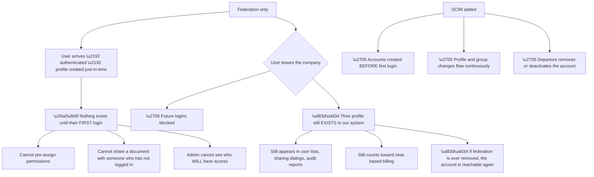
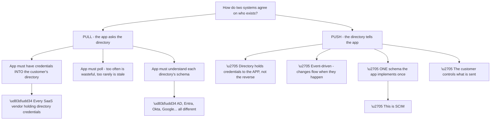
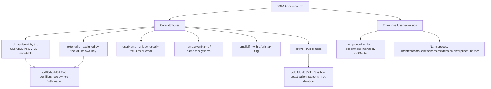
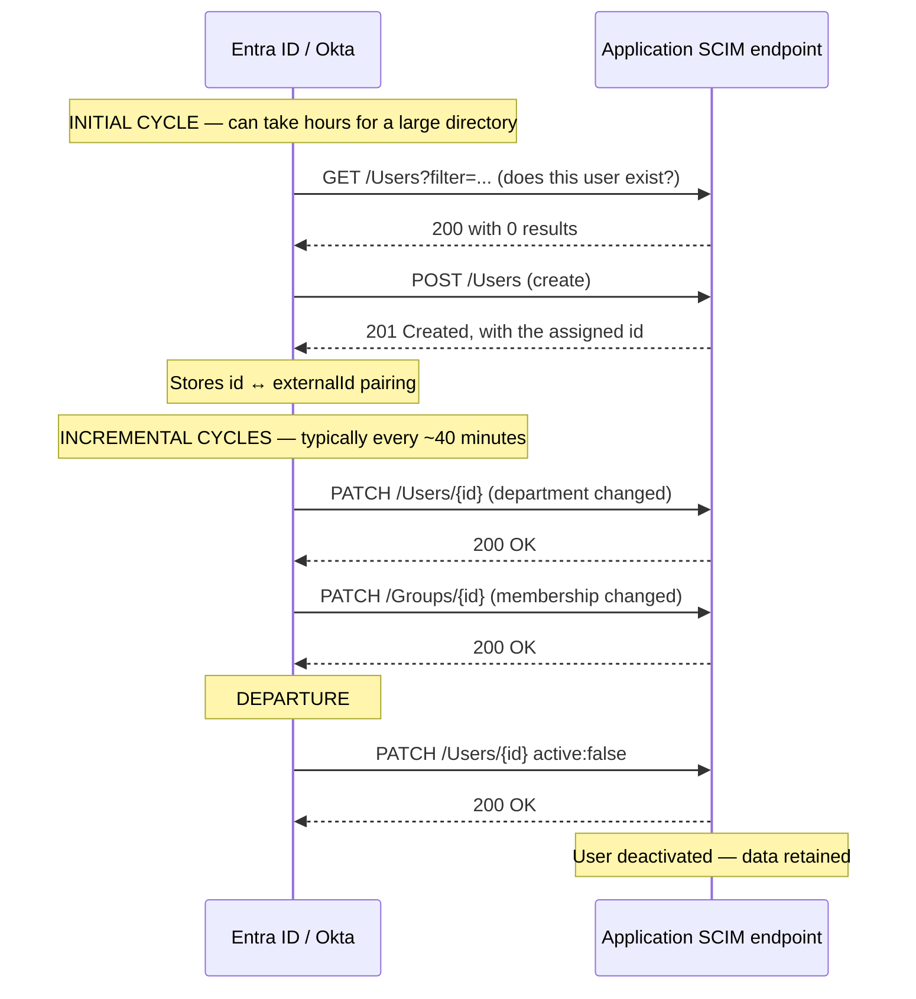
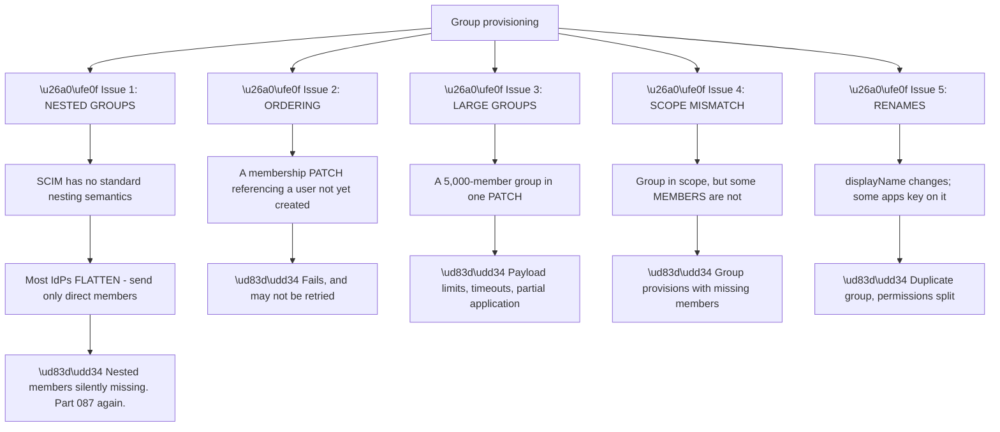
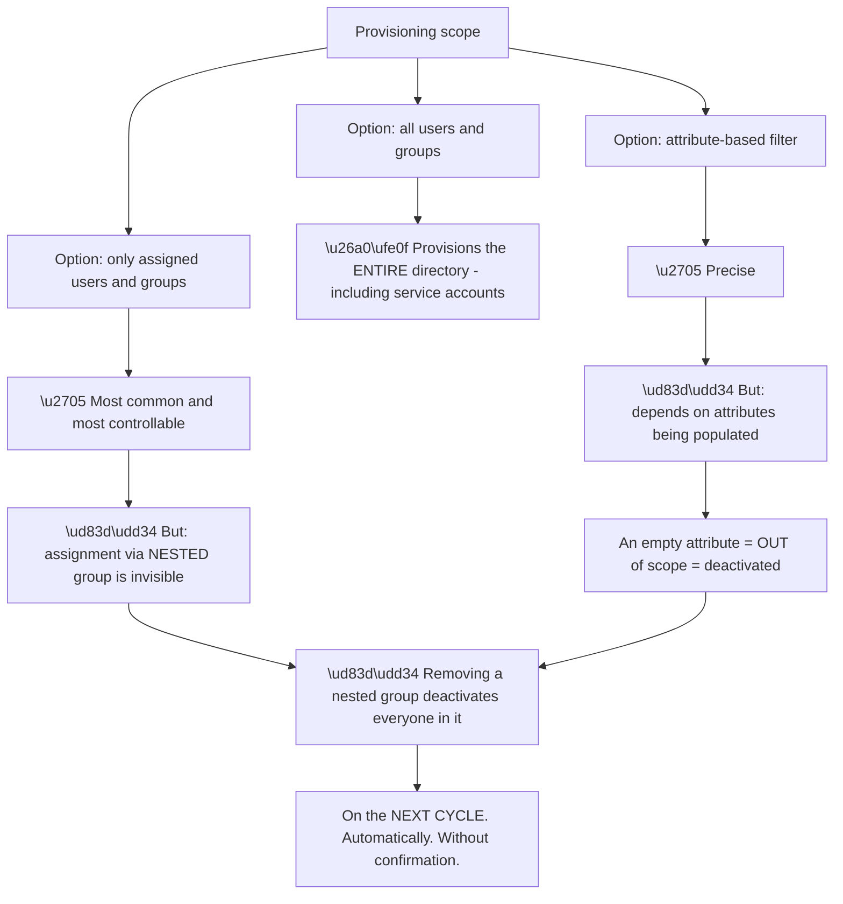
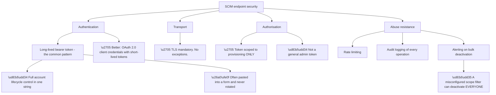
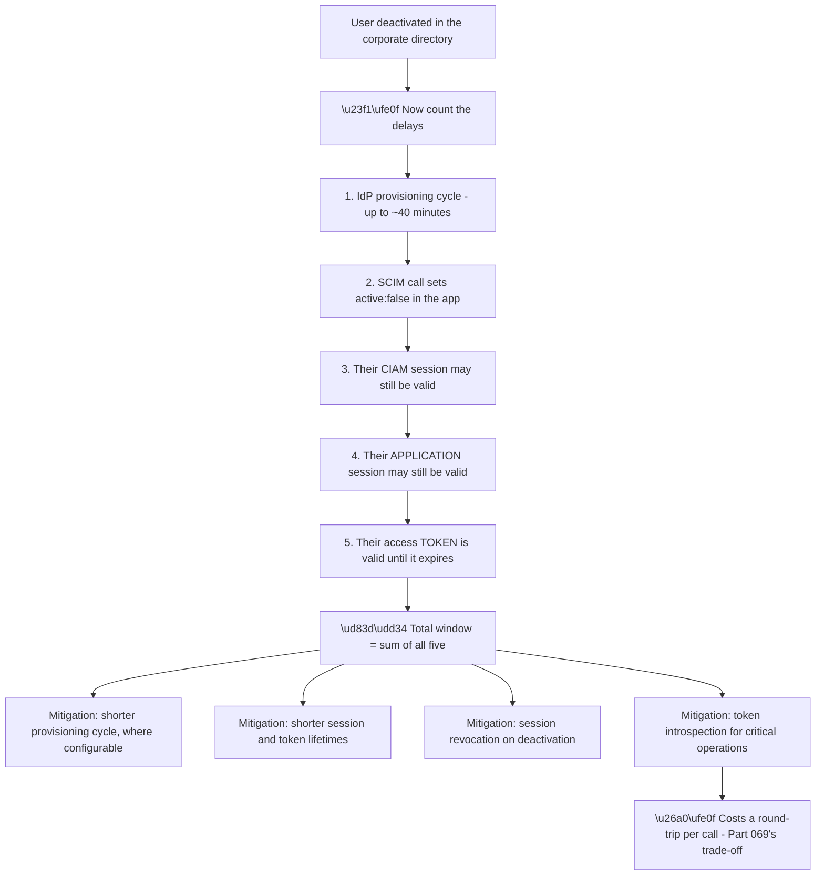
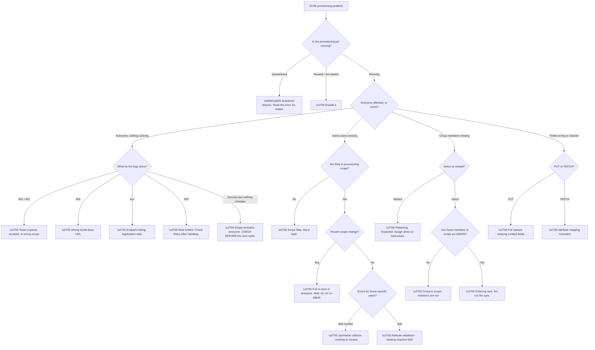

# Part 094 - SCIM Provisioning and Lifecycle Synchronisation

> Section goal: Understand the standard that makes user accounts appear, update, and disappear automatically across systems — and why "we federated, so we're covered" leaves a real deprovisioning gap that SCIM is designed to close.

Covers index item **094**. Maps to JD signals: *identity and access management*, *REST APIs*, *enterprise connections*, *authentication and authorization*, *troubleshooting complex technical issues*, *Microsoft Entra ID*.

---

## 1. Start From Zero: The Problem Federation Does Not Solve

Part 093 established that federation solves authentication: the customer's IdP checks the password, so disabling an account there stops future sign-ins.

**But federation does not create accounts, and it does not remove them.** It only answers "is this person who they say they are, right now?"

| Question | Federation | SCIM |
|---|---|---|
| Is this person who they claim? | ✅ | ❌ |
| Does an account exist before they arrive? | ❌ | ✅ |
| Is their profile data current? | Partly — at login | ✅ Continuously |
| Are they in the right groups? | Partly — at login | ✅ Continuously |
| Has their account been removed on departure? | ❌ | ✅ |

**Node D5 is the one that makes this a security issue rather than a tidiness issue.** A profile that outlives the employment relationship is dormant, not harmless — **if the enterprise connection is ever removed, misconfigured, or replaced with a database connection, those orphaned profiles may become directly reachable.** That is a real risk, not a theoretical one.

**Node P3 is the one customers complain about first.** Sharing a document with a colleague who has not yet logged in fails, because that colleague does not exist in the system. **Just-in-time provisioning creates users on first login and not a moment earlier**, which is invisible until someone tries to act on a user who has not arrived yet.

**SCIM — System for Cross-domain Identity Management — is the standard that closes both gaps.** It is a REST API specification (RFCs 7642, 7643, 7644) that lets an identity provider push user and group lifecycle events to a downstream application.

> 💡 **Tie-in to your background:** you have worked with REST APIs and with identity systems. SCIM is exactly the intersection — a well-specified REST API whose whole purpose is identity lifecycle, and whose failures are ordinary API failures with identity consequences.

### 🔍 Plain-English deep-dive: push versus pull, and why SCIM is push

There are two ways to keep two systems in agreement about who exists, and SCIM's choice explains its shape.

**The credential-direction point in P2 versus PU1 is the decisive one.** In a pull model, every SaaS application a company uses would need read credentials into the corporate directory — **dozens of vendors holding keys to the identity source of truth.** In a push model, the directory holds a token for each application, which is a far better security posture: **the blast radius of a leaked token is one application, not the directory.**

**And the schema point is what makes SCIM valuable rather than merely possible.** Without a standard, every application would implement a different integration per directory — a combinatorial problem. **SCIM defines one schema and one API surface**, so an application implements it once and works with every compliant identity provider.

| Property | Push (SCIM) |
|---|---|
| Credential direction | IdP → app. Better blast radius. |
| Timeliness | Near real-time, event-driven |
| Schema | One standard, implemented once |
| Control | Customer decides scope and attributes |
| Failure mode | ⚠️ Silent — the app does not know it stopped |

**That last row is the cost of push**, and it is the single most important operational fact about SCIM. **A pull system notices when it cannot reach the source. A push system receiving nothing cannot distinguish "no changes" from "provisioning has been broken for three weeks."**

**Which is why monitoring provisioning is a real requirement rather than a nicety**, and why "when did you last see a successful provisioning event?" is a question worth asking early on any staleness complaint.

**Analogy:** a supplier who sends updates when something changes, versus one you have to phone for. Push is more efficient and less intrusive — but if they quietly stop sending, silence looks exactly like "nothing has changed." **Where it stops:** you would eventually get suspicious. A system with no expectation of cadence will not.

---

## 2. The SCIM Data Model

SCIM defines a small, standard set of resources. Understanding the core schema makes provisioning configuration readable rather than magical.

| Resource | Endpoint | Purpose |
|---|---|---|
| **User** | `/Users` | A person |
| **Group** | `/Groups` | A collection of users |
| **ServiceProviderConfig** | `/ServiceProviderConfig` | What this implementation supports |
| **ResourceTypes** | `/ResourceTypes` | Which resources exist |
| **Schemas** | `/Schemas` | Attribute definitions |

**The two-identifier model in the last node is the most important structural detail.**

**`id`** is assigned by the receiving application when a user is created, and returned to the IdP. **`externalId`** is the IdP's own identifier for that user, sent along with the create. **Each side stores the other's identifier**, and that pairing is what makes subsequent updates unambiguous.

**When that pairing is lost, provisioning breaks in a specific and messy way:** the IdP no longer knows which resource corresponds to which user, so it either creates duplicates or fails to update. **Restoring it means re-matching, which is exactly the soft-match problem from Part 092** in a different setting.

**The `active` flag in node C7 is the deactivation mechanism**, and it is worth being precise about. SCIM deprovisioning normally means **`PATCH active: false`, not `DELETE`.** The account remains, retaining data, audit history, and ownership of resources — it simply cannot be used. **A true `DELETE` is destructive and usually undesirable**, because it orphans everything the user owned.

| Operation | HTTP | Meaning |
|---|---|---|
| Create | `POST /Users` | New user |
| Read | `GET /Users/{id}` | Fetch one |
| Search | `GET /Users?filter=userName eq "jo@x.com"` | Find by attribute |
| Replace | `PUT /Users/{id}` | **Full replacement — omitted fields are cleared** |
| Update | `PATCH /Users/{id}` | Partial — **preferred** |
| Deactivate | `PATCH` with `active: false` | The normal "removal" |
| Delete | `DELETE /Users/{id}` | Destructive; often unsupported |

**The `PUT` warning deserves emphasis.** A `PUT` replaces the entire resource — **any attribute the IdP does not send is cleared.** An IdP configured to send a narrow attribute set, talking to an application that treats `PUT` literally, silently wipes fields the application had populated locally. **`PATCH` is the correct verb for updates**, and a `PUT`-based integration is worth flagging.

---

## 3. How Provisioning Actually Runs

SCIM provisioning is not instantaneous, and understanding the cycle prevents a category of false alarms.

**Three timing facts drive most expectation mismatches:**

| Fact | Consequence |
|---|---|
| **Initial cycle is slow** | A large directory can take hours to provision fully |
| **Incremental cycle is ~40 minutes** | A change is not immediate |
| **Scope changes trigger a full re-sync** | Which restarts the slow cycle |

**The third row surprises people.** Changing the provisioning scope — adding a group, altering a filter — commonly triggers a **complete re-evaluation** rather than an incremental delta. **On a large directory, that means the change appears to do nothing for hours**, and the natural response is to change it again, which restarts the cycle.

**The advice that follows is simple and rarely given:** after a scope change on a large tenant, **wait and observe rather than adjusting.** Repeated adjustments extend the outage they are trying to fix.

**Quarantine** is the other behaviour to know. When an IdP receives sustained failures from a SCIM endpoint — repeated 401s, 403s, or 5xx responses — it moves the provisioning job into a **quarantined state** and dramatically reduces its retry frequency, eventually stopping.

**The consequence is exactly the silent failure from §1.** The customer's directory is making changes, nothing is reaching the application, and **no one is being told.** Quarantine is visible in the IdP's provisioning status — but only if someone looks.

---

## 4. Groups, Roles, and the Hard Part

User provisioning is comparatively simple. **Group provisioning is where SCIM implementations diverge most**, and where the majority of difficult tickets originate.

**Issue four is the most common and the least intuitive.** A group is in provisioning scope, so it is created in the application. But scope is evaluated **per object** — and members who fall outside the scope filter are not provisioned as users. **The group arrives with a subset of its membership**, and to an administrator looking at the application, it simply appears that the group is wrong.

**The diagnostic question is precise:** *"is every member of that group also in provisioning scope?"* It resolves this instantly and is rarely the customer's first thought.

**Issue one is Part 087's nested-group problem arriving in a new form**, which is worth pointing out as a pattern rather than a coincidence. **Nested membership is invisible to `memberOf`, invisible to SAML group claims unless expanded, and invisible to SCIM unless flattened.** Three different technologies, one recurring blind spot — and the same diagnostic question each time: *direct or nested?*

**Issue two — ordering — produces a distinctive intermittent failure.** During an initial sync, a group membership update may reference a user the application has not created yet. **Whether that recovers depends entirely on the IdP's retry behaviour**, so it presents as "some memberships came through and some didn't," with no pattern. **Re-running the sync usually fixes it**, which is a useful thing to try before deep investigation.

### 🔍 Plain-English deep-dive: provisioning scope is the highest-consequence setting in the integration

One configuration field decides who exists in the downstream application. **It is easy to change, hard to preview, and its mistakes are population-wide.**

**Node R1 is the reason this deserves its own deep-dive.** Falling out of scope is not neutral — the identity provider concludes the user should no longer be provisioned and **deactivates them.** A scope edit is therefore an access-removal operation, and it does not feel like one when you are making it.

| Scope change | Consequence on the next cycle |
|---|---|
| Remove a group from assignment | Every member deactivated |
| Remove a **nested** group | Everyone reached through it deactivated |
| Tighten a filter expression | Everyone newly excluded deactivated |
| Attribute stops being populated | Those users deactivated |
| Mistype a filter | Potentially **everyone** deactivated |

**Row four is the subtle one.** An attribute-based filter depends on data staying populated. **If an upstream process stops writing `department`, those users silently leave scope** — and nobody connects a directory data change to a mass deactivation in a downstream SaaS product.

**Two practices materially reduce the risk**, and both are worth recommending:

**Alert on bulk deactivation.** A threshold alert — more than a handful of deactivations in one cycle — catches every row in that table within one cycle instead of after the complaints arrive.

**Treat scope edits as change-managed.** Not because the field is dangerous to touch, but because its consequences are delayed, automatic, and population-wide. **Reviewing a scope change is cheap; reversing a mass deactivation after downstream systems have reacted is not.**

**And when investigating any "lots of users lost access" report**, scope is the first thing to check — **before** the token, before the endpoint, before the logs. It is the only setting that can produce that outcome by design.

**Analogy:** a distribution list that also controls building access. Editing it to tidy up the mailing looks harmless, and the next morning a floor of people cannot get in. **Where it stops:** someone would notice a crowd at the door. A provisioning cycle deactivates silently and reports success.

---

## 5. Security Considerations

A SCIM endpoint is a **highly privileged API**: it creates, modifies, and deactivates user accounts. It deserves treatment as such.

**Node AB4 is the incident scenario to have in mind.** A scope filter edited incorrectly — a group removed, a filter expression mistyped — causes the IdP to conclude that most users are out of scope and to **deactivate them all on the next cycle.** This is not hypothetical; it is the natural consequence of the design when scope is misconfigured.

| Control | Why |
|---|---|
| Alert on bulk deactivation | Catches it within one cycle rather than after complaints |
| Deactivate rather than delete | Recovery is a flag flip, not a restore |
| Require confirmation for large scope changes | Prevents the mistake |
| Retain deactivated accounts | Nothing is lost |
| Log every SCIM operation | Post-incident reconstruction |

**Row two is the strongest argument for `active: false` over `DELETE`** — and it is worth stating to customers who ask for hard deletion. **Recovering from a mass deactivation is trivial; recovering from a mass deletion may not be possible at all.**

**Token handling deserves its own note.** SCIM bearer tokens are frequently generated once, pasted into an IdP configuration screen, and never touched again. **They carry full user-lifecycle authority and are often the longest-lived credential in the integration.** Where the platform supports OAuth 2.0 client credentials with short-lived tokens (Part 062), that is materially better, and it is a reasonable thing to recommend.

### 🔍 Plain-English deep-dive: why "the user is deactivated but still has access" happens anyway

Even with SCIM working perfectly, there is a window where a deactivated user retains access — and being precise about why is what makes the conversation credible.

**Five delays compound**, and no single mitigation removes them all. **This is a genuine architectural property of token-based, cache-friendly systems**, not an implementation shortcoming — and Part 069 established the same trade-off for token revocation generally.

| Requirement | Honest answer |
|---|---|
| "Access must end within minutes" | ✅ Achievable — short sessions plus revocation |
| "Access must end instantly" | ⚠️ Only with introspection on every call, at a performance cost |
| "Access must end at next login" | ✅ Federation alone achieves this |
| "The account must disappear from lists" | ✅ SCIM achieves this |

**Row two is where honesty matters most.** A customer with a hard compliance requirement for instantaneous revocation needs to know that it costs a round-trip on every protected operation, and to decide whether that trade is worth making. **Promising instant revocation without that conversation sets up a failure later.**

**And there is a useful reframing to offer.** For most organisations the real requirement is *"we must be able to demonstrate that access ended promptly and completely,"* which is an **auditability** requirement rather than a latency one. **SCIM plus logging satisfies it well**, and separating the two requirements often dissolves the apparent conflict.

**Analogy:** cancelling a membership card. The cancellation is recorded immediately, but the card in someone's wallet still opens the door until the readers next update, and the person already inside the building stays until they leave. **Where it stops:** you could send someone to escort them out. Session revocation is that escort — deliberate, targeted, and it has to be called.

---

## 6. Failure Modes

| # | Failure mode | Symptom | Root cause | First check |
|---|---|---|---|---|
| 1 | Provisioning quarantined | Nothing syncs, silently | Sustained endpoint errors | Provisioning status in the IdP |
| 2 | Token expired or revoked | 401 on every call | Credential lifecycle | Test the token |
| 3 | Scope excludes the user | User never appears | Filter or group scope | Is the user in scope? |
| 4 | Scope excludes group members | Group has missing members | Per-object scope evaluation | Are all members in scope? |
| 5 | Nested group flattened | Members missing | No SCIM nesting semantics | Direct or nested? |
| 6 | Ordering race | Some memberships missing | Membership before user creation | Does a re-sync fix it? |
| 7 | Large group payload | Timeouts, partial application | Payload or time limits | How large is the group? |
| 8 | `PUT` clearing fields | Local data disappears | Full-replace semantics | Is the IdP using PUT or PATCH? |
| 9 | Identifier pairing lost | Duplicates or failed updates | `id` ↔ `externalId` broken | Compare stored identifiers |
| 10 | `userName` uniqueness clash | 409 Conflict | Duplicate or reused address | Does the user already exist? |
| 11 | Attribute mapping wrong | Fields empty or wrong | Mapping configuration | Compare sent vs stored |
| 12 | Rate limiting | Intermittent 429s | Bulk operations | Is the IdP honouring `Retry-After`? |
| 13 | Scope change re-sync | Appears to do nothing for hours | Full re-evaluation | How long since the change? |
| 14 | Mass deactivation | Everyone loses access | Scope misconfiguration | **Check scope immediately** |
| 15 | Deactivated but still active | Access continues briefly | Compounded delays | Expected — explain the window |

---

## 7. Troubleshooting Decision Tree: SCIM Provisioning Failures

### Worked example

A customer reports that new starters have not appeared in the application for "about three weeks," while existing users work fine.

**Node B is the whole investigation.** The provisioning job is **quarantined**.

**The error history explains it.** Three weeks ago there was a burst of 401 responses. The bearer token had been rotated during a routine credential review, and the IdP configuration was not updated. **The IdP retried, failed repeatedly, and quarantined the job.**

**Why nobody noticed for three weeks** is the interesting part. Existing users were unaffected — they authenticate through federation, which is entirely independent of provisioning. **Only new starters were affected, and new starters are rare enough that three weeks of onboarding produced a handful of tickets that were each handled manually.**

**Each individual ticket looked like a one-off.** Someone created the account by hand, the user was unblocked, and the ticket closed. **The pattern only became visible when someone counted.**

**The fix** is to update the token and restart the job. **The two write-up points** are more valuable than the fix:

**First, push-based systems fail silently**, and this is the canonical demonstration. Nothing alerted, nothing errored visibly, and the symptom was an absence.

**Second, the manual workarounds hid the problem.** Each handled ticket removed the evidence that would have revealed the pattern. **A recommendation to monitor provisioning status and alert on quarantine is worth more than the token rotation**, because it converts a three-week silent outage into a same-day notification.

**What made it findable:** noticing that only *new* users were affected. **"What is different about the affected population?" pointed at provisioning rather than authentication**, because authentication is identical for both groups.

---

## 8. Lab: Build and Break a SCIM Integration

**Purpose.** See real SCIM traffic, understand the resource model, and reproduce the scope and quarantine failures deliberately — using free tiers and fictional data.

**Prerequisites.**
- The free Entra tenant from Part 090 with fictional users and groups
- A free customer identity platform tenant, or a local SCIM server implementation
- A local HTTP inspection tool (Part 022)
- **Never** configure provisioning against an employer or customer tenant

**Steps.**

1. **Read `/ServiceProviderConfig`** on the target SCIM endpoint. Note which operations it supports — particularly whether `PATCH`, filtering, and bulk are supported.
2. **Configure provisioning** in your Entra tenant to the SCIM endpoint, scoped to a single test group.
3. **Run the initial cycle** and watch the requests. **Record the sequence:** the `GET` with a filter, the `POST`, and the returned `id`.
4. **Record both identifiers** — the `id` the application assigned and the `externalId` Entra sent. **Confirm they are different and that both are stored.**
5. **Change a user's department** in Entra and observe the `PATCH` on the next cycle. Time how long it took.
6. **Add a nested group** to the scoped group. **Confirm the nested members do not appear** — this is the key observation.
7. **Add a user to the group who is out of provisioning scope.** Confirm the group updates but the member does not appear.
8. **Deactivate a user** in Entra. Observe the `PATCH` with `active: false`. **Confirm the account still exists but cannot sign in.**
9. **Break the token deliberately.** Change it to an invalid value and let cycles run until the job quarantines. **Record how long that took and what, if anything, alerted you.**
10. **Restore the token** and restart. Observe recovery.
11. **Measure the deactivation window:** with a user signed in, deactivate them, and record how long until they actually lose access across all layers.
12. **Write a customer-facing explanation** of that window, with mitigations in order.

**Expected evidence.**
- The `/ServiceProviderConfig` response, annotated
- A captured create sequence with both identifiers recorded
- Evidence that nested members did not provision
- Evidence that an out-of-scope member did not provision
- A quarantined job, with the time taken and the absence of any alert noted
- A measured deactivation window
- Your written customer explanation

**Validation rubric.**

| Criterion | Pass |
|---|---|
| Resource model | You can explain `id` versus `externalId` and why both matter |
| Deactivation | You can explain why `active: false` beats `DELETE` |
| Scope | You can explain per-object scope and the group-members trap |
| Nesting | You can explain flattening and connect it to Parts 087 and 093 |
| Silent failure | You can explain quarantine and why nobody notices |
| Honesty | You can explain the deactivation window without overpromising |
| Safety | Free tiers, fictional data, everything deleted |

**Cleanup and privacy.** Delete the provisioning configuration, the test users and groups, and the SCIM token. **Revoke the token explicitly rather than just deleting the configuration** — a live provisioning token is one of the most privileged credentials in any integration. **Never point provisioning at an employer or customer tenant**, and never test scope changes against real data: a misconfigured scope filter deactivates users.

---

## 9. JD Mapping

| JD signal | How this Part addresses it |
|---|---|
| Identity and access management | Full user lifecycle, not just authentication |
| REST APIs | SCIM is a REST specification — verbs, status codes, filtering |
| Enterprise connections | Provisioning alongside federation |
| Microsoft Entra ID | Entra as the provisioning source |
| Troubleshooting complex technical issues | Fifteen failure modes and a full decision tree |
| Root cause analysis | The example finds a three-week silent outage from a population clue |
| Customer-facing communication | Honest framing of the deactivation window |

---

## 10. Candidate Honesty Note

- **Production experience:** REST API troubleshooting, including authentication, status codes, and rate limiting.
- **Production experience:** identity lifecycle issues in an enterprise context — accounts not appearing, access not ending.
- **Lab experience:** configuring SCIM provisioning from a free Entra tenant, observing the resource model, and deliberately reproducing quarantine and scope failures, as above.
- **Learned architecture:** SCIM at enterprise scale, bulk operations, and provisioning monitoring strategy.
- **No direct experience:** implementing a SCIM service provider, or supporting production provisioning for paying customers.
- **How to say it:** *"SCIM was new to me as a standard, though the underlying problem — accounts not being created or removed properly — is one I've supported plenty of times. I've built a provisioning integration in a lab, watched the actual requests, and deliberately quarantined a job to see how silent that failure is. I haven't implemented a SCIM endpoint or run this in production."*

---

## 11. Official Source Anchors

| Source | Why | Accessed |
|---|---|---|
| RFC 7642 — SCIM: Definitions, Overview, Concepts, and Requirements | The problem statement and model | Accessed **26 August 2026** |
| RFC 7643 — SCIM: Core Schema | User, Group, and enterprise extension attributes | Accessed **26 August 2026** |
| RFC 7644 — SCIM: Protocol | Endpoints, verbs, filtering, PATCH semantics | Accessed **26 August 2026** |
| Microsoft Learn — Entra ID app provisioning and SCIM | Cycle timing, scope, quarantine behaviour | Accessed **26 August 2026** |
| Microsoft Learn — Provisioning logs and troubleshooting | The evidence source for these tickets | Accessed **26 August 2026** |
| Auth0 Docs — SCIM inbound provisioning | How a CIAM tenant receives provisioning | Accessed **26 August 2026** |

> **Revalidate:** the RFCs are stable. Cycle intervals, quarantine thresholds, and provisioning UI change — re-check Microsoft Learn and the Auth0 docs before interview rather than quoting specific durations from memory.

---

## ⭐ Likely Interview Questions for This Section

### Q1. "What problem does SCIM solve that federation doesn't?"

> *Model answer:* Federation answers "is this person who they claim to be, right now" — it authenticates. It does not create accounts before someone first logs in, and it does not remove them when someone leaves. So without provisioning, you cannot pre-assign permissions or share something with a colleague who has not logged in yet, because that person does not exist in the system. And on departure, future logins are blocked but the profile persists — still in user lists, still in sharing dialogs, still counting toward seat billing, and potentially reachable again if the federation is ever removed or reconfigured. SCIM is a REST API standard that lets the identity provider push create, update, and deactivate events downstream, closing both gaps.

### Q2. "Why is SCIM push rather than pull?"

> *Model answer:* Mainly credential direction. In a pull model every SaaS vendor a company uses would need read credentials into the corporate directory, which means dozens of vendors holding keys to the identity source of truth. In push, the directory holds a token per application, so a leaked credential compromises one application rather than the directory. Push is also event-driven rather than polled, and it means the application implements one standard schema instead of a different integration per directory. The cost is that push fails silently — a system receiving nothing cannot distinguish "no changes" from "provisioning broke three weeks ago." That is why monitoring provisioning status is a genuine requirement rather than a nicety.

### Q3. "How does SCIM deprovision a user, and why that way?"

> *Model answer:* Normally with a PATCH setting `active` to false, not a DELETE. The account remains, keeping its data, audit history, and ownership of any resources, but it cannot be used. That matters for recovery: if a scope filter is misconfigured and the identity provider concludes most users are out of scope, it will deactivate them all on the next cycle. Recovering from mass deactivation is a flag flip; recovering from mass deletion may not be possible at all. Hard deletion also orphans everything the user owned, which is usually undesirable. So when a customer asks for true deletion, I would explain the trade-off rather than just enabling it.

### Q4. "A provisioned group is missing members. What are the possibilities?"

> *Model answer:* Four, and I would work through them in order. First, nested groups — SCIM has no standard nesting semantics, so identity providers flatten and send only direct members, which means nested members silently do not appear. That is the same blind spot as `memberOf` in LDAP and group claims in SAML, so my first question is always whether membership is direct or nested. Second, scope: scope is evaluated per object, so a group can be in scope while some of its members are not, and the group arrives with a partial membership. Third, an ordering race during initial sync, where a membership update references a user that has not been created yet — that usually resolves on a re-run. Fourth, very large groups hitting payload or timeout limits and applying partially.

### Q5. "A customer says provisioning stopped working weeks ago and nobody noticed. How does that happen?"

> *Model answer:* It is the defining failure mode of push-based provisioning. If the endpoint returns sustained errors — usually an expired or rotated bearer token — the identity provider quarantines the job and effectively stops trying. Nothing alerts, and the symptom is an absence rather than an error. Existing users are unaffected because they authenticate through federation, which is completely independent of provisioning, so only new starters are affected. New starters are rare enough that each one looks like a one-off, gets handled manually, and the manual workaround erases the evidence that would have shown the pattern. The recommendation worth more than the fix is monitoring the provisioning status and alerting on quarantine, which turns a three-week silent outage into a same-day notification.

### Q6. "A customer says a deactivated user still had access. Is that a bug?"

> *Model answer:* Not usually — it is compounded delays, and I would walk through them honestly. The provisioning cycle can take up to around forty minutes to send the deactivation. Then their session with our platform may still be valid, their session with the application may still be valid, and any access token they hold is valid until it expires. Those add up. The mitigations are shorter provisioning cycles where configurable, shorter session and token lifetimes, session revocation on deactivation, and token introspection for critical operations — though introspection costs a round-trip per call. What I would also do is separate the requirements: most organisations actually need to demonstrate that access ended promptly and completely, which is an auditability requirement that SCIM plus logging satisfies well, rather than a sub-second latency requirement.

### Q7. "What's the difference between `id` and `externalId`?"

> *Model answer:* `id` is assigned by the receiving application when the user is created and returned to the identity provider. `externalId` is the identity provider's own identifier for that user, sent along with the create. Each side stores the other's identifier, and that pairing is what makes every subsequent update unambiguous. If the pairing is lost — through a re-created integration, a restored database, or an identifier change upstream — the provider no longer knows which resource corresponds to which user, so it either creates duplicates or fails to update. Restoring it means re-matching on attributes, which is the same fragile soft-match problem you see in directory synchronisation, with the same duplicate-account outcome.

### Q8. "Why is `PATCH` preferred over `PUT` in SCIM?"

> *Model answer:* Because `PUT` replaces the entire resource, so any attribute the identity provider does not send gets cleared. If the provider is configured with a narrow attribute set and the application implements `PUT` literally, fields the application populated locally are silently wiped on every update cycle. `PATCH` applies only the specified changes and leaves everything else intact, which is what you actually want for ongoing synchronisation. It is worth checking the `/ServiceProviderConfig` endpoint, which declares whether `PATCH` is supported — if an implementation only supports `PUT`, that is a finding to raise, because the data loss is gradual and looks like an application bug rather than a provisioning one.

---

## 🧠 30-Second Memory Hooks

- **Federation authenticates. SCIM provisions. You need both.**
- **Without SCIM: no pre-login accounts, and profiles outlive employment.**
- **Push, not pull — the directory holds the app's token, not the reverse.**
- **Push fails silently. Monitor provisioning status.**
- **`id` = app-assigned. `externalId` = IdP-assigned. Both stored, both needed.**
- **Deprovision = `PATCH active:false`, not `DELETE`.**
- **`PUT` clears omitted fields. Prefer `PATCH`.**
- **Scope is per object — a group can be in scope while its members are not.**
- **Nested groups flatten.** Same blind spot as `memberOf` and SAML claims.
- **Scope change → full re-sync → wait, don't re-adjust.**
- **Quarantine = the silent outage. Nobody is told.**
- **Deactivation window = provisioning + two sessions + token lifetime.**
- **Only new users affected? Provisioning, not authentication.**

---

## ✅ Completion Checklist

- [ ] I can explain what federation leaves unsolved
- [ ] I can explain why SCIM is push and what that costs
- [ ] I can explain `id` versus `externalId`
- [ ] I can explain why deactivation beats deletion
- [ ] I can explain `PUT` versus `PATCH` semantics and the data-loss risk
- [ ] I can explain per-object scope and the missing-group-members trap
- [ ] I can connect nested-group flattening to Parts 087 and 093
- [ ] I can explain quarantine and why it goes unnoticed
- [ ] I can explain the deactivation window honestly, with ordered mitigations
- [ ] I have completed the lab, including deliberately quarantining a job
- [ ] I can state honestly what provisioning work I have done and what I have not

*Next suggested section:* **[Part 095 - Directory and Enterprise Connection Troubleshooting](Part-095-directory-and-enterprise-connection-troubleshooting.md)** — the consolidated method for everything in Group I: one workflow that routes any directory or enterprise connection problem to the right layer.
