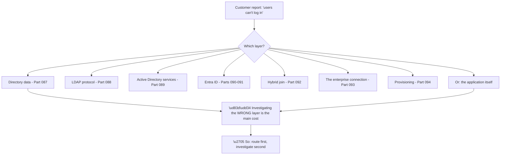
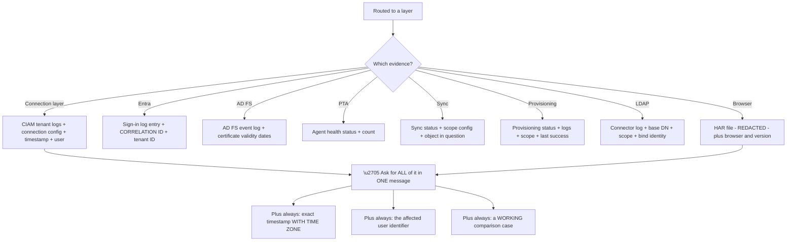
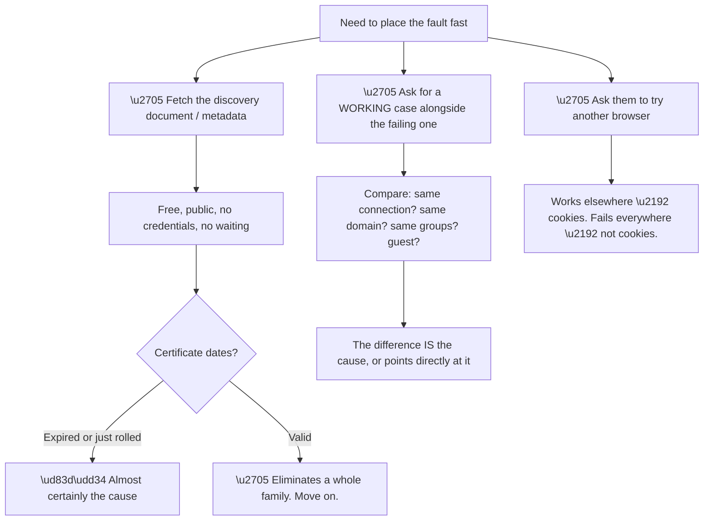
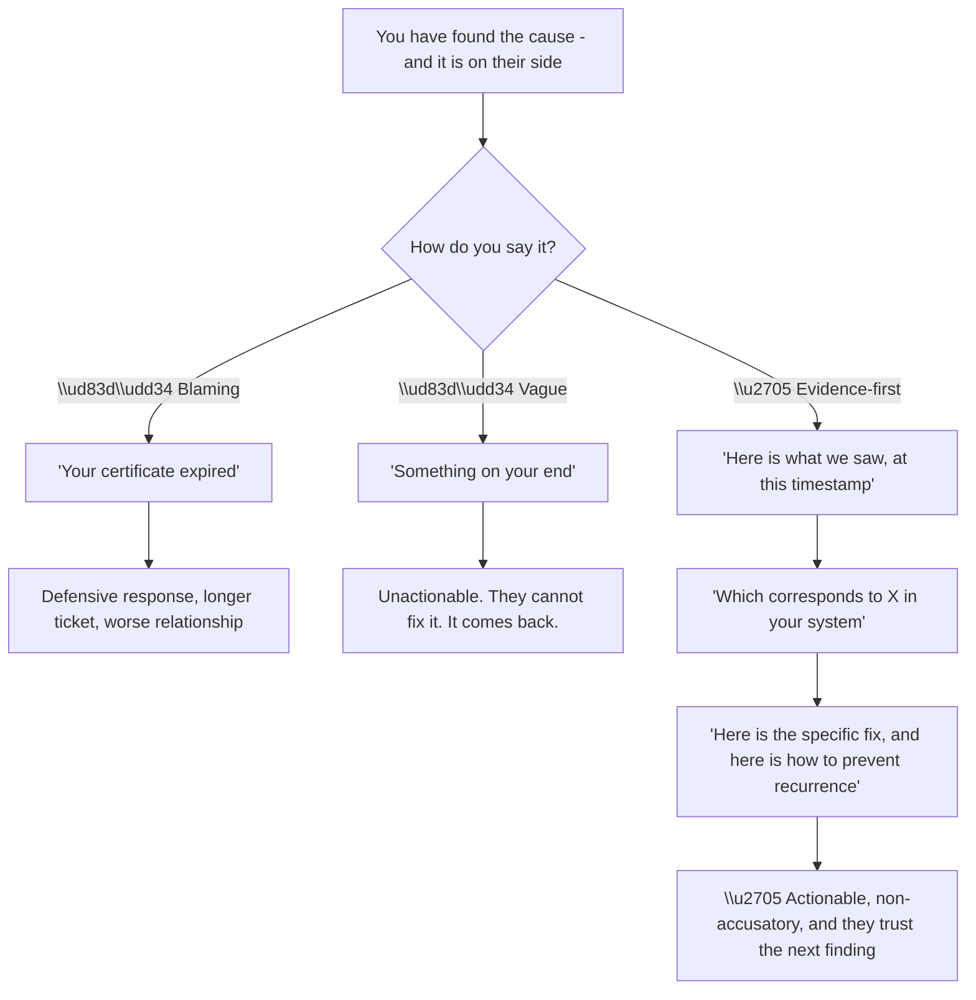
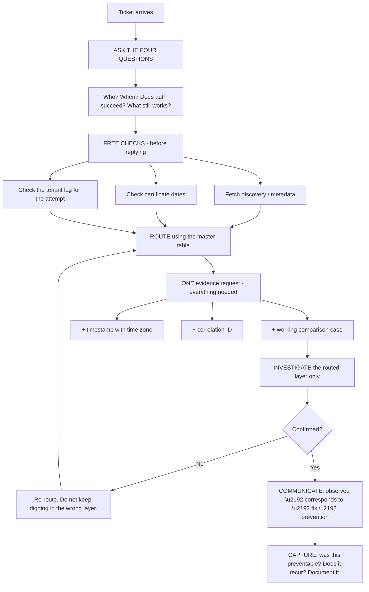
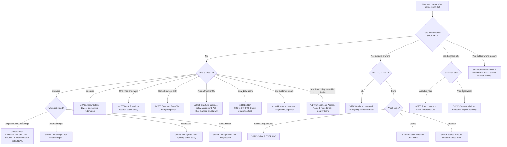

# Part 095 - Directory and Enterprise Connection Troubleshooting

> Section goal: Consolidate everything from Parts 087–094 into a single routing method — one workflow that takes any directory or enterprise connection problem and sends it to the correct layer, fast, with the right evidence request.

Covers index item **095**. Maps to JD signals: *troubleshooting complex technical issues*, *root cause analysis*, *Active Directory*, *LDAP*, *Microsoft Entra ID*, *SAML*, *enterprise connections*, *customer-facing communication*.

---

## 1. Start From Zero: Why a Routing Method Is Needed

Group I has covered directories, LDAP, Active Directory, Entra ID, hybrid identity, CIAM federation, and SCIM. **That is seven layers, and a customer describing a problem has no idea which one they are in.**

Their report will be something like *"users can't log in"* or *"the group isn't working"* — accurate, and completely underdetermined. **The skill is turning that into a layer, quickly, before investigating anything.**

**The cost of getting this wrong is not just time.** Investigating the wrong layer produces requests for evidence the customer then has to gather — **each wrong request costs a round-trip and a day**, and it erodes their confidence that you know what you are doing.

**The good news is that routing is fast** and depends on a small number of questions, most of which the customer can answer immediately. This Part is those questions, in order.

> 💡 **Tie-in to your background:** as a Support Escalation Engineer handling CRITSITs, you have done exactly this — the discipline of narrowing before investigating, and asking for the right evidence in one request rather than five. The layers are different; the method is one you already use.

### 🔍 Plain-English deep-dive: the four questions that route almost everything

Four questions, asked before any investigation, resolve the layer in most cases.

```mermaid
flowchart TD
    Q1["Q1: WHO is affected?"] --> A1["Everyone \u2192 infrastructure, credential, or certificate"]
    Q1 --> A2["One user \u2192 that account or that device"]
    Q1 --> A3["A department or OU \u2192 structure, scope, or policy"]
    Q1 --> A4["Only NEW users \u2192 PROVISIONING"]
    Q1 --> A5["Only senior / long-tenured \u2192 TOKEN or GROUP SIZE"]
    Q1 --> A6["One office or network \u2192 DNS, network path, or location policy"]
    Q2["Q2: WHEN did it start?"] --> B1["A specific date, nothing changed \u2192 CERTIFICATE or SECRET"]
    Q2 --> B2["After a change \u2192 that change"]
    Q2 --> B3["Always - never worked \u2192 configuration, not regression"]
    Q2 --> B4["Intermittent \u2192 replication, risk policy, load, or agent count"]
    Q3["Q3: Does authentication SUCCEED?"] --> C1["No \u2192 auth layer: credentials, policy, certificates"]
    Q3 --> C2["Yes, data wrong \u2192 CLAIMS or MAPPING"]
    Q3 --> C3["Yes, then fails later \u2192 SESSION or TOKEN"]
    Q4["Q4: What STILL works?"] --> D1["Locates the boundary of the fault"]
```

**Question one is the highest-yield**, and the reason is structural: **directory and identity failures partition along organisational and structural lines**, not random ones. A failure affecting "the Bengaluru office" or "everyone hired since March" or "the leadership team" is telling you where to look before you have read a single log.

| Population | Layer it points at |
|---|---|
| Everyone | Infrastructure, credential, certificate |
| One user | Account state, device, clock |
| One department/OU | Directory structure, scope, GPO, policy assignment |
| **Only new users** | **Provisioning (Part 094)** |
| **Only senior staff** | **Token/group size (Parts 087, 091)** |
| One office/network | DNS, firewall, location-based policy |
| Guests only | B2B guest behaviour (Part 090) |
| One customer tenant | Per-tenant consent, assignment, or policy (Part 090) |
| Some browsers only | Cookies, third-party cookie policy (Parts 072, 091) |

**Question three is the second-highest-yield and the most often skipped.** *"Does the user actually sign in?"* splits the entire problem space in two, and the two halves share almost no causes.

**A successful sign-in eliminates**, in one stroke: certificates, credentials, connectivity, Conditional Access, assignment, and consent. **All of them.** What remains is claims, mapping, and session — a much smaller space.

**Question four is the underused one.** *"What still works?"* locates the boundary. In Part 092's example, internal sign-ins working proved AD FS and Entra were healthy and placed the fault at one consumer. **A fault's edges are as informative as its centre**, and customers can usually answer this immediately.

**Analogy:** a doctor asking where it hurts, when it started, whether you can still walk, and what you can still do — before ordering any tests. The questions are cheap, the answers narrow enormously, and ordering the wrong test first costs a week. **Where it stops:** a patient can describe sensation. A customer can only describe symptoms their tooling made visible, which is why the fourth question matters.

---

## 2. The Master Routing Table

Once the four questions are answered, this table routes to a layer and a Part.

| Symptom | Population | Timing | Auth succeeds? | → Layer | Part |
|---|---|---|---|---|---|
| Cannot sign in | Everyone | Specific date | ❌ | Certificate / secret expiry | 092, 093 |
| Cannot sign in | Everyone | After a change | ❌ | That change | — |
| Cannot sign in | Everyone | Intermittent | ❌ | PTA agents, farm capacity | 092 |
| Cannot sign in | One user | Any | ❌ | Account state, clock, device | 089, 090 |
| Cannot sign in | One office | Any | ❌ | DNS, network, location policy | 089, 091 |
| Cannot sign in | Some browsers | Any | ❌ | Cookies / SameSite | 072, 091 |
| Cannot sign in | A department | After a reorg | ❌ | DN as identifier, scope, assignment | 087, 093 |
| "No logon servers" | Any | On VPN | ❌ | DNS resolver | 089 |
| Password prompt (not failure) | Domain users | Any | ✅ eventually | Seamless SSO | 092 |
| Blocked with a policy named | Subset | Any | ❌ | Conditional Access | 091 |
| Empty profile | Everyone | Any | ✅ | Claims not released / mapping | 093 |
| Empty profile | Some users | Any | ✅ | Source attribute empty | 093 |
| Groups empty | Senior staff | Any | ✅ | Group overage | 091 |
| Group members missing | Any | Any | ✅ | Nesting or scope | 087, 094 |
| User not found | New starters | Weeks | ❌ | **Provisioning quarantine** | 094 |
| User not found | Some users | Any | ❌ | Sync/provisioning scope | 092, 094 |
| Duplicate accounts | Some users | Any | ✅ | Soft match / unstable identifier | 087, 092, 093 |
| Search returns nothing | Any | Any | — | LDAP base/scope/permissions | 088 |
| Second hop fails | Any | Any | ✅ | NTLM fallback, no delegation | 089 |
| Deactivated user still active | Any | Any | ✅ | Session window — expected | 094 |
| Works for most customers | One tenant | Any | ❌ | Per-tenant consent/assignment | 090 |

**Two rows are worth memorising as complete diagnoses**, because they are unambiguous:

**"Only new starters, for weeks"** is provisioning quarantine until proven otherwise. Nothing else produces that population with that duration.

**"Groups empty for senior staff only"** is group overage. Nothing else selects for tenure.

### 🔍 Plain-English deep-dive: the recurring patterns underneath all seven layers

Group I covered seven technologies. **A small number of patterns explain most of their failures**, and recognising the pattern is often faster than recalling the technology.

```mermaid
flowchart TD
    P1["PATTERN 1: unstable identifier"] --> P1a["DN changes on a move - Part 087"]
    P1 --> P1b["NameID on email - Part 083"]
    P1 --> P1c["UPN rewritten by a rebrand - Part 091"]
    P1 --> P1d["Soft match creating duplicates - Part 092"]
    P1 --> P1e["externalId pairing lost - Part 094"]
    P2["PATTERN 2: nested membership invisible"] --> P2a["memberOf is direct-only - Part 087"]
    P2 --> P2b["App assignment via nesting - Part 093"]
    P2 --> P2c["SCIM flattens groups - Part 094"]
    P3["PATTERN 3: something expires"] --> P3a["LDAPS certificate - Part 088"]
    P3 --> P3b["AD FS signing certificate - Part 092"]
    P3 --> P3c["OIDC client secret - Part 093"]
    P3 --> P3d["SCIM bearer token - Part 094"]
    P4["PATTERN 4: size limits"] --> P4a["Kerberos PAC / token bloat - Part 089"]
    P4 --> P4b["Group overage - Part 091"]
    P4 --> P4c["LDAP 1000-entry limit - Part 088"]
    P5["PATTERN 5: silent absence"] --> P5a["LDAP returns empty, not denied - Part 088"]
    P5 --> P5b["Sync filter, no error - Part 092"]
    P5 --> P5c["Provisioning quarantine - Part 094"]
```

**Five patterns cover the great majority of Group I**, and each has a single diagnostic question attached to it:

| Pattern | The question that detects it |
|---|---|
| Unstable identifier | *"What field does it match users on?"* |
| Nested membership | *"Is that membership direct or nested?"* |
| Expiry | *"What are the certificate and secret dates?"* |
| Size limits | *"Is it only senior or long-tenured staff?"* |
| Silent absence | *"When did you last see this work?"* |

**The value of thinking in patterns rather than technologies** is that a pattern transfers to systems you have never seen. **A support engineer who has never touched a particular IdP can still ask "what does it match users on?"** and find an unstable-identifier bug in it.

**Pattern five deserves the most attention** because it is the one that defeats normal troubleshooting instincts. **Four of the seven layers can fail by returning nothing rather than an error** — LDAP permissions, sync filters, provisioning quarantine, and unrequested attributes. In all four, the system reports success while doing nothing, and every log looks healthy.

**The counter-question is the same in all four cases:** *when did this last work, and what has been created since?* **Absence has no timestamp, so you have to find the boundary from the other side.**

**Pattern three has the most valuable property for a support engineer:** it is checkable *before replying to the customer*, from public metadata, at no cost. **Making that a reflex — fetch metadata, read dates — resolves or eliminates a large fraction of federation tickets in the first minute.**

**Analogy:** a mechanic who thinks in failure patterns — something worn, something loose, something leaking, something starved — rather than memorising every engine. The patterns transfer to a model they have never seen. **Where it stops:** an engine tells you it is failing through noise and smoke. Four of these five patterns fail silently, which is why the questions have to be asked rather than waited for.

---

## 3. The Evidence Request: Getting It Right First Time

The second skill, after routing, is **asking for everything you need in one message.** Each additional round-trip is a day.

**Node A3 is the most valuable and least requested item.** A working case alongside a failing case turns diagnosis into **comparison**, which is dramatically faster than analysis. *"Send me one user this fails for and one it works for, at the same time"* is often the single most useful sentence in an evidence request.

**Node A1 matters more than it looks.** Logs across three systems in three time zones cannot be correlated without unambiguous timestamps. **Asking for "with time zone" explicitly** prevents an entire class of wasted correlation.

**A reusable evidence request:**

> To investigate this properly, could you send:
> 1. The **exact timestamp** of a failed attempt, **with time zone**
> 2. The **user identifier** (email or object ID) for that attempt
> 3. The **correlation ID** from your Entra sign-in log for that attempt
> 4. One user this **works** for, so I can compare
> 5. Whether it affects **all users or a subset** — and if a subset, what they have in common
>
> If it is convenient, a **HAR file** of the failing sign-in is very helpful — please **redact** it before sending, since it contains tokens and cookies.

**The redaction instruction is not optional.** A HAR of an authentication flow contains live credentials — tokens, cookies, and sometimes passwords in form posts. **Asking for redaction protects the customer and is a professional signal** (Part 112 covers the handling in full).

---

## 4. Isolating the Layer With Direct Tests

Where evidence is slow or incomplete, a few direct tests place the fault without waiting.

| Test | What it proves | Requires |
|---|---|---|
| Fetch the discovery document | The IdP is reachable and correctly configured | Nothing — public |
| Fetch federation metadata | Certificates and endpoints, with dates | Nothing — public |
| Check certificate validity dates | Whether a rollover is imminent or past | Metadata |
| Decode the raw assertion/token | What was **actually** sent | The evidence |
| Compare working vs failing user | The differentiating attribute | Two cases |
| Test with a second browser | Cookie/browser-policy involvement | The user |
| Test in private browsing | Session-state involvement | The user |
| Check the provisioning status | Whether provisioning is even running | Customer access |

**The metadata check in T1 deserves to be a habit.** It costs seconds, requires no credentials, no customer action, and no waiting — and it either finds the cause outright or eliminates an entire family of causes. **On any federation ticket, do it before replying.**

**The comparison test in T4 is the fastest path to a cause** in the difficult cases, because it converts an open-ended question into a bounded one: **what is different about these two users?** The list of candidate differences is short — connection, domain, group membership, guest status, when they were created, which office.

**And the browser test in T6 is worth suggesting early** because it is something the customer can do immediately, without tooling, and it cleanly separates cookie and session problems from everything else. **A cheap test the customer can run while you wait for logs is worth more than a precise test that takes two days.**

### 🔍 Plain-English deep-dive: telling the customer what you found without assigning blame

Most Group I root causes land on the **customer's** side — their certificate, their policy, their group restructure, their expired token. **How that is communicated determines whether the ticket ends well.**

**The structure in the right-hand branch is worth using as a template**, because it is genuinely better rather than merely more polite:

| Element | Purpose |
|---|---|
| **What we observed** | Neutral fact, with evidence |
| **What it corresponds to** | Translates our evidence into their system |
| **The specific fix** | Actionable, not a category |
| **Prevention** | Stops it recurring |

**The second element does the real work.** The customer's team lives in their system, not ours. **"We received a signature validation failure at 09:14 UTC, which corresponds to your AD FS token-signing certificate rolling over at 09:12"** gives them something they can act on immediately; "signature validation failed" does not.

**And the fourth element is what makes the interaction valuable rather than merely correct.** In Part 093's rollover example, the fix was uploading a certificate — but the *prevention* was switching to a metadata URL, which stops an annual outage forever. **The prevention is usually worth more than the fix, and it is the part customers remember.**

**One phrasing to avoid entirely:** "working as designed." It is often literally true — for Conditional Access blocks, for session windows, for scope filters — and it reliably sounds dismissive. **"This is expected behaviour, and here's why, and here's what you can change if you need a different outcome"** says the same thing and leaves the customer with options.

**Analogy:** a mechanic who says "your brake fluid is low, here's the reading, that explains the noise, and here's how often it should be checked" rather than "you didn't maintain it." Same facts, same fault, completely different relationship. **Where it stops:** a mechanic can just fix it. A support engineer often cannot touch the system at fault, which makes the clarity of the explanation the entire deliverable.

---

## 5. The Consolidated Workflow

Everything above, as one sequence.

**The `V → No` branch is a discipline worth naming explicitly.** When the routed layer does not confirm the hypothesis, **re-route rather than dig deeper.** The instinct is to keep looking where you started, and it is usually wrong — a hypothesis that has failed one confirming test rarely improves with more effort in the same place.

**The final node is what separates a support engineer from a ticket closer.** After resolution: *was this preventable, will it recur, and is there a documentation or product gap?* **Part 122 covers turning that into knowledge base content; Part 124 covers turning it into product feedback.**

---

## 6. Failure Modes of the *Process*

The failure modes here are process failures rather than technical ones, and they cost more time than any technical cause.

| # | Process failure | Symptom | Fix |
|---|---|---|---|
| 1 | Investigating before routing | Hours in the wrong layer | Ask the four questions first |
| 2 | Multiple evidence round-trips | Days of latency | One complete request |
| 3 | No working comparison | Analysis instead of comparison | Always ask for both |
| 4 | Ambiguous timestamps | Cannot correlate logs | Require the time zone |
| 5 | Ignoring the population clue | Missing the structural cause | Treat "who" as primary |
| 6 | Not doing free checks | Waiting for what you could fetch | Metadata before replying |
| 7 | Continuing after disconfirmation | Sunk-cost digging | Re-route |
| 8 | Unredacted HAR requested | Live credentials in a ticket | Always ask for redaction |
| 9 | "Working as designed" | Customer feels dismissed | Explain and offer options |
| 10 | Fix without prevention | Same ticket next year | Always give the prevention |
| 11 | Blaming phrasing | Defensiveness, longer ticket | Observed → corresponds → fix |
| 12 | No knowledge capture | The team relearns it | Document it |

---

## 7. Troubleshooting Decision Tree: The Master Router

### Worked example

A customer escalates: *"SSO is completely broken. This is a P1. Our users cannot work."*

**No technical detail, high urgency.** The temptation is to start investigating immediately.

**The four questions, asked in the first reply, take two minutes to write.**

**Who?** *"Our Mumbai office. About 60 people."*
**When?** *"This morning."*
**Does authentication succeed?** *"No — they get an error at the Microsoft page."*
**What still works?** *"Bengaluru is fine. Same application."*

**Four answers, and the routing is already done.** One office affected, other offices fine, failing at the identity provider. **Node C → "one office or network."**

**The free check while waiting.** The connection metadata is valid, certificates are in date. **That eliminates the entire certificate family** — which was the most likely cause given "this morning," and eliminating it early prevents a wrong turn.

**The evidence request** asks for one failing user, one working Bengaluru user, timestamps with time zone, and the Entra correlation ID.

**The correlation ID resolves it.** The Entra sign-in log shows a Conditional Access policy blocking based on **named location**. The Mumbai office's internet breakout was migrated to a new provider overnight, and its new IP range is not in the trusted locations list.

**Nothing is broken.** The policy is doing exactly what it was configured to do, with information that is now out of date.

**The communication:**

> *What we observed:* sign-ins from your Mumbai users failing at Entra ID from 08:40 IST, with correlation IDs showing a Conditional Access block.
>
> *What it corresponds to:* the policy named in your sign-in log restricts access to trusted named locations. Your Mumbai office IP range appears to have changed — the requests are arriving from a range not in that list.
>
> *The fix:* add the new range to your named locations.
>
> *Prevention:* it may be worth reviewing whether network changes trigger a check of the named locations list, since this will recur with any future breakout change.

**Total elapsed time: hours, not days.** **What made it fast:** four questions before any investigation, and the free metadata check that eliminated the obvious-but-wrong hypothesis before it consumed a day.

**And the P1 framing was correct** — sixty people could not work. **Routing quickly is how a genuine P1 gets the response it deserves**, rather than the urgency being spent on investigating the wrong layer.

---

## 8. Lab: Build Your Routing Card

**Purpose.** Produce a one-page artefact you can actually use — under interview pressure and in a real queue — and validate it against realistic scenarios.

**Prerequisites.**
- Parts 087–094 completed
- No systems required — this is a synthesis exercise

**Steps.**

1. **From memory**, write the four routing questions and, for each, at least four possible answers and where each points.
2. **Check yourself against §1** and correct the gaps. **Note which ones you missed** — those are your weak areas.
3. **Build a one-page routing card:** the four questions on the left, the population-to-layer mapping in the middle, the evidence-per-layer list on the right.
4. **Write your standard evidence request** as a reusable template, in your own voice.
5. **Test it against ten scenarios.** Write ten one-line symptom descriptions drawn from Parts 087–094's failure modes, shuffle them, and route each using only the card. **Time yourself.**
6. **Score honestly.** Any scenario that took more than thirty seconds or routed wrongly indicates a gap in the card, not in your memory.
7. **Revise the card** to fix those gaps.
8. **Write the four-element communication template** — observed, corresponds to, fix, prevention — as a reusable structure.
9. **Practise it aloud** on the Mumbai scenario from §7 without reading.

**Expected evidence.**
- A one-page routing card
- A reusable evidence-request template
- Ten scenarios with your routing and timing
- A revised card addressing every miss
- A communication template, practised aloud

**Validation rubric.**

| Criterion | Pass |
|---|---|
| Four questions | Recalled instantly, with what each answer implies |
| Population mapping | Nine populations routed correctly without notes |
| Auth-succeeds split | You use it to eliminate half the problem space automatically |
| Free checks | You know what to check before replying |
| Evidence request | One message, complete, including a comparison case |
| Communication | Four-element structure, no blame, prevention included |
| Speed | Ten scenarios routed in under five minutes total |

**Cleanup and privacy.** This lab produces no system artefacts. **Use only synthetic scenarios** — do not reconstruct real employer or customer incidents in your notes, even anonymised, and do not carry any real case detail into interview conversations. **Describe the method; invent the examples.**

---

## 9. JD Mapping

| JD signal | How this Part addresses it |
|---|---|
| Troubleshooting complex technical issues | The consolidated routing method itself |
| Root cause analysis | Structural clues, disconfirmation discipline, prevention |
| Active Directory, LDAP, Entra ID, SAML | All routed by one table |
| Enterprise connections | The full Group I surface |
| Customer-facing communication | Evidence requests and the four-element explanation |
| Prioritisation | Routing is how a P1 gets a P1 response |
| Cross-functional collaboration | Routing to the customer's own security or IT team correctly |

---

## 10. Candidate Honesty Note

- **Production experience:** narrowing before investigating, structured evidence requests, and non-blaming customer communication — this is the core of escalation work.
- **Production experience:** correlating evidence across multiple systems and time zones under time pressure.
- **Lab experience:** building and testing the routing card against synthetic scenarios drawn from Parts 087–094.
- **Learned architecture:** the specific layers — Entra, AD FS, SCIM, CIAM connections — as a routed set rather than individually.
- **No direct experience:** running this method on a live CIAM support queue.
- **How to say it:** *"The method is one I use every day — narrow before investigating, ask for everything in one request, always get a working comparison case, and explain findings without assigning blame. What's new is the specific layers. I've built a routing card for them and tested it against scenarios, but I'd be honest that I haven't run it on a live queue yet."*

---

## 11. Official Source Anchors

| Source | Why | Accessed |
|---|---|---|
| Auth0 Docs — Troubleshoot enterprise connections | Vendor-side routing guidance | Accessed **26 August 2026** |
| Auth0 Docs — Tenant logs and event codes | The primary evidence source | Accessed **26 August 2026** |
| Microsoft Learn — Sign-in logs and correlation IDs | The upstream evidence source | Accessed **26 August 2026** |
| Microsoft Learn — Provisioning logs | Provisioning-layer evidence | Accessed **26 August 2026** |
| Microsoft Learn — Conditional Access What-If | Confirming a policy hypothesis | Accessed **26 August 2026** |
| Okta Developer Forum — `devforum.okta.com` | Real reported symptoms and their causes | Accessed **26 August 2026** |

> **Revalidate:** log formats, event codes, and portal navigation change on both sides. Re-check before interview — but note that the *routing method* is stable regardless of where the logs live.

---

## ⭐ Likely Interview Questions for This Section

### Q1. "A customer says 'SSO is broken.' What do you do first?"

> *Model answer:* I ask four questions before investigating anything. Who is affected — everyone, one user, one office, only new starters, only senior staff? When did it start — a specific date with no change, after a change, or has it never worked? Does authentication actually succeed, or does it fail? And what still works? Those four answers usually route the problem to a layer before I have looked at a single log, which matters because investigating the wrong layer costs a day per wrong evidence request. While waiting for the answers I do the free checks — fetch the discovery document or federation metadata and check the certificate dates, which either finds the cause outright or eliminates a whole family of causes at no cost.

### Q2. "Why is 'who is affected' the highest-yield question?"

> *Model answer:* Because directory and identity failures partition along structural lines rather than randomly. If everyone is affected it is infrastructure, a credential, or a certificate — nothing user-specific can fail uniformly. If one office is affected it is DNS, network path, or a location-based policy. If only new starters are affected over a period of weeks, that is provisioning quarantine essentially every time. If only senior and long-tenured staff are affected, that is token or group size, because those are the people with the most memberships. Two of those are complete diagnoses on their own. So the population is not background detail — it is often the answer, and it costs nothing to ask.

### Q3. "How does knowing whether authentication succeeded help?"

> *Model answer:* It splits the problem space in half, and the halves share almost no causes. If sign-in succeeds, that single fact eliminates certificates, credentials, connectivity, Conditional Access, application assignment, and consent — all of them, at once. What remains is claims, mapping, and session, which is a much smaller space and a completely different investigation. It is also the question customers most often leave out, because "it's not working" feels complete to them. Asking it explicitly is the difference between investigating certificates for a day and going straight to claim mapping. And there is a third variant worth catching — succeeds then fails later — which points at token lifetime and session rather than either of the other two.

### Q4. "How do you make an evidence request effective?"

> *Model answer:* Ask for everything in one message, because each round-trip costs about a day. That means the exact timestamp with time zone, the affected user identifier, the correlation ID from their identity provider's log, and — the item most often forgotten — a user it works for at the same time. A working comparison case turns diagnosis into comparison, which is dramatically faster, and the list of candidate differences between two users is short. I also ask whether it affects all users or a subset, and what the subset have in common, because that is the routing question. If a HAR would help I ask for it explicitly redacted, since an authentication HAR contains live tokens and cookies.

### Q5. "You've found the root cause and it's on the customer's side. How do you tell them?"

> *Model answer:* With four elements, in order. What we observed, as a neutral fact with evidence and a timestamp. What it corresponds to in their system — this is the part that does the real work, because their team lives in their environment, not ours, and "signature validation failed at 09:14, which corresponds to your AD FS certificate rolling over at 09:12" is actionable in a way that "signature validation failed" is not. Then the specific fix. Then the prevention, which is usually worth more than the fix — uploading a certificate solves today, switching to a metadata URL solves it permanently. The phrase I avoid is "working as designed," which is often literally true and reliably sounds dismissive; "this is expected behaviour, here's why, and here's what you can change if you need a different outcome" says the same thing and leaves them with options.

### Q6. "What do you do when the layer you routed to doesn't confirm your hypothesis?"

> *Model answer:* Re-route rather than dig deeper. The instinct is to keep looking where you started, because you have already invested there, and it is usually wrong — a hypothesis that has failed one good confirming test rarely improves with more effort in the same place. So I go back to the four questions and check whether I weighted an answer incorrectly, or whether there is a second cause. That last possibility is worth taking seriously: a partial recovery after a fix is a strong signal that there was more than one root cause, and stopping there leaves a real problem in place. I have seen a case where fixing DNS restored the application but not a downstream page, and the second cause was a missing service principal name.

### Q7. "How do you avoid multiple round-trips with a customer?"

> *Model answer:* Two things. First, do everything that does not require them — fetch their discovery document or federation metadata, check certificate validity, look at whatever logs I already have access to. Those cost seconds and often narrow the problem before I reply at all. Second, when I do ask, ask once and completely: timestamp with time zone, user, correlation ID, a working comparison case, and the population question. Writing that takes two minutes and saves days. I would also suggest something they can test immediately while gathering logs — trying a different browser, or private browsing — because a cheap test they can run now is worth more than a precise test that arrives in two days.

### Q8. "What do you do after the ticket is resolved?"

> *Model answer:* Three things. Give the prevention, not just the fix, because otherwise the same ticket returns on a schedule — an annually expiring certificate or a rotating secret will recur forever otherwise. Ask whether this was preventable and whether it will recur for other customers, because if the answer is yes it belongs in the knowledge base or in product feedback rather than only in a closed ticket. And capture what made it hard to diagnose, because that is often a product gap — a silent provisioning quarantine with no alerting, for instance, is a real finding worth raising even though the individual ticket was resolved by rotating a token.

---

## 🧠 30-Second Memory Hooks

- **Route first, investigate second.**
- **Four questions: Who? When? Does auth succeed? What still works?**
- **Only new users, for weeks = provisioning quarantine.**
- **Only senior staff = group overage / token size.**
- **Specific date, nothing changed = certificate or secret.**
- **One office = DNS, network, or location policy.**
- **Some browsers = cookies.**
- **Auth succeeds → eliminates certs, creds, connectivity, CA, assignment, consent.**
- **Free checks before replying: metadata + certificate dates.**
- **Always ask for a working comparison case.**
- **Timestamps with time zone. Always.**
- **HAR requests always say "redacted."**
- **Communicate: observed → corresponds to → fix → prevention.**
- **Never "working as designed."**
- **Disconfirmed? Re-route. Don't dig.**
- **Partial recovery = second root cause.**

---

## ✅ Completion Checklist

- [ ] I can recall the four routing questions instantly
- [ ] I can map nine populations to layers without notes
- [ ] I can explain what a successful authentication eliminates
- [ ] I know the free checks to run before replying
- [ ] I have a reusable, complete evidence-request template
- [ ] I always ask for a working comparison case
- [ ] I can use the four-element communication structure fluently
- [ ] I re-route on disconfirmation rather than digging
- [ ] I always give prevention alongside the fix
- [ ] I have built and tested my routing card against ten scenarios
- [ ] I can state honestly what is method transfer and what is new learning

*Next suggested section:* **[Part 096 - Okta Portfolio Map: Customer Identity Cloud, Workforce Identity, and Identity Engine](Part-096-okta-portfolio-map-customer-identity-cloud-workforce-identity-identity-engine.md)** — Group J begins: the actual product surface of the role, starting with what Okta and Auth0 each are and which one this job is about.
