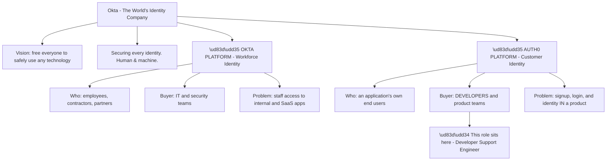
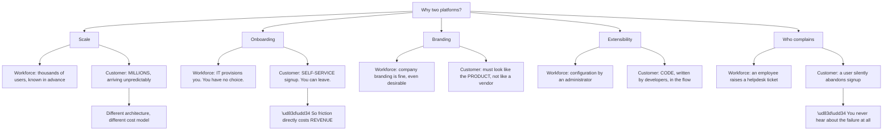
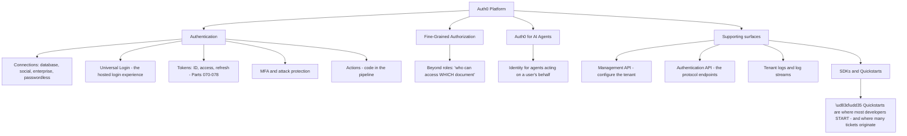
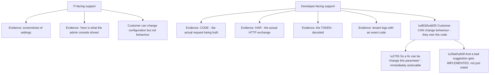
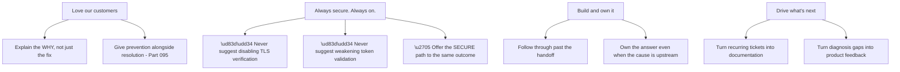
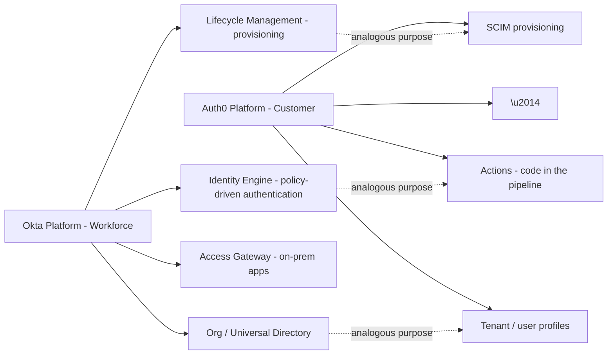
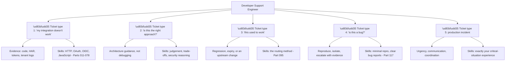
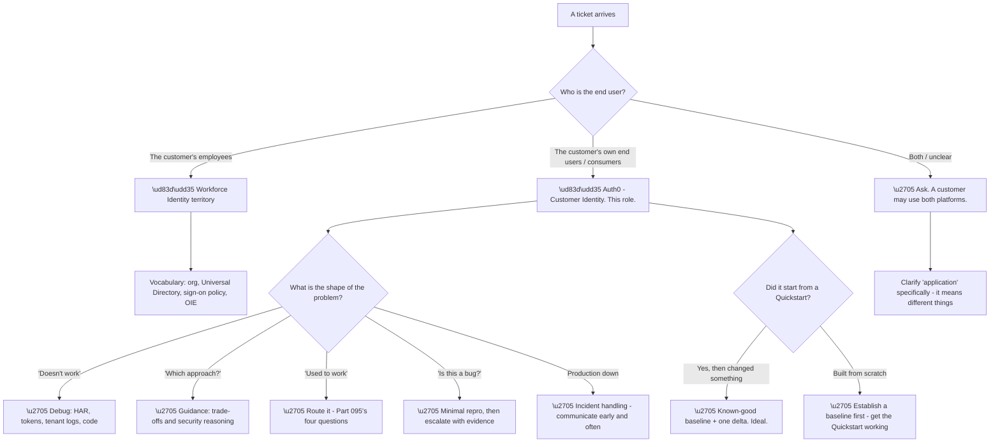

# Part 096 - Okta Portfolio Map: Customer Identity Cloud, Workforce Identity, and Identity Engine

> Section goal: Establish precisely what Okta sells, how Auth0 fits inside it, and which product this role is actually about — so that every subsequent Part in Group J is grounded in the right product and the right vocabulary.

Covers index item **096**. Maps to JD signals: *Okta*, *Auth0*, *customer identity*, *developer support*, *product knowledge*, *customer-facing communication*.

---

## 1. Start From Zero: What Okta Is

Okta describes itself as **"The World's Identity Company™"**, with a stated vision **"to free everyone to safely use any technology"** and the positioning line **"Securing every identity. Human & machine."**

It was **founded in 2009** by **Todd McKinnon** and **Frederic Kerrest**, and it effectively **created the IDaaS category** — Identity as a Service — at a time when identity meant on-premises directories and federation servers (Parts 087–092).

| Fact | Detail |
|---|---|
| Founded | **2009** |
| Founders | **Todd McKinnon**, **Frederic Kerrest** |
| Category | **IDaaS** — which Okta created |
| Headquarters | San Francisco |
| Presence | Operations across **15 countries** |
| Reach | Used by **two-thirds of the Fortune 100** |

**The two-platform split is the single most important structural fact** in this Part, and it determines the entire vocabulary of the role.

**Okta Platform (Workforce Identity)** serves an organisation's *own people* — employees signing into Salesforce, Workday, and internal tools. **The buyer is IT.** The vocabulary is single sign-on, provisioning, lifecycle management, and access governance.

**Auth0 Platform (Customer Identity)** serves *an application's end users* — the people who sign up for a product. **The buyer is a developer or product team.** The vocabulary is SDKs, APIs, tenants, connections, tokens, and login flows.

**A concrete confirmation of the relationship:** `okta.com/products/customer-identity/` **redirects to auth0.com**. Okta's customer identity offering *is* Auth0. **This role — Developer Support Engineer — is on the Auth0 side.**

> 💡 **Tie-in to your background:** your support experience has been with IT-facing products, which maps naturally to the Workforce Identity vocabulary. **The shift to developer-facing support is a genuine change** — the person raising the ticket is writing code, not administering users — and naming that shift honestly is better than pretending the two are the same.

### 🔍 Plain-English deep-dive: why workforce and customer identity are genuinely different products

It would be reasonable to assume one identity platform could serve both. **The requirements diverge sharply**, and understanding why explains why Okta operates two platforms rather than one.

**Node O3 is the commercial fact that reshapes everything.** In workforce identity, a clumsy login is an annoyance — the employee has no alternative and will complete it. **In customer identity, a clumsy login loses a sale.** Every additional field, every confusing error, every unnecessary redirect has a measurable conversion cost.

**Node W3 is the support-specific consequence**, and it is the one worth internalising for this role. **Consumer users do not raise tickets — they leave.** So the tickets that *do* arrive come from the customer's developers, who noticed a drop in conversion or found an error in their logs. **The person you are helping is rarely the person who experienced the problem**, which changes how evidence is gathered and how urgency is assessed.

| Dimension | Workforce | Customer (Auth0) |
|---|---|---|
| User count | Thousands | Millions |
| Onboarding | IT provisions | Self-service signup |
| Friction tolerance | High | **Very low** |
| Branding | Vendor-visible acceptable | **Must be invisible** |
| Extensibility | Admin configuration | **Developer code** |
| Failure signal | Helpdesk ticket | **Silent abandonment** |
| Who contacts support | An IT admin | **A developer** |
| Primary artefact | A configuration screen | **An SDK, an API, a log** |

**The final row is the practical summary of the role.** Developer support means the evidence is code, HTTP traffic, tokens, and logs — **not screenshots of configuration pages.** The skills from Parts 011–045 (HTTP, JavaScript, tokens, certificates) are the daily tools.

**Analogy:** a staff entrance and a shop front. The staff entrance can be plain and procedural because staff must use it. The shop front has to be inviting, on-brand, and effortless, because anyone who finds it awkward simply walks past — and never tells you why. **Where it stops:** a shopkeeper can see people walking past. In software, abandonment is invisible unless someone instruments it.

---

## 2. The Auth0 Platform: What It Actually Provides

Auth0's documentation organises the platform into product areas, and knowing them gives you the map for Parts 097–110.

| Product area | What it covers |
|---|---|
| **Authentication** | Login, signup, MFA, connections, sessions, tokens |
| **Fine-Grained Authorization** | Relationship-based permissions beyond roles (Part 109) |
| **Auth0 for AI Agents** | Identity for autonomous and agentic workloads (Part 109) |

**Node R is a practical observation about the role.** Developers typically begin with a Quickstart — a language-specific guide that gets a login working in minutes. **Problems arise when they move beyond it**: the Quickstart works, then they add a custom domain, or an API, or a second connection, and something breaks.

**The recognisable ticket shape** is therefore: *"the Quickstart worked, and then I changed X."* **That framing is diagnostically useful** — it establishes a known-good starting point and a single delta, which is the ideal debugging position and one worth eliciting deliberately when it is not offered.

**The developer community lives at `devforum.okta.com`**, the Okta Developer Forum, which covers both platforms. It is worth reading as preparation for this role: **the questions asked there are the questions you would be answering**, and their recurring shapes are the best available preview of the queue.

### 🔍 Plain-English deep-dive: what "developer support" changes about the evidence you ask for

The shift from IT-facing to developer-facing support changes what evidence exists, what the customer can produce, and what a good first reply looks like.

**Node R2 is the responsibility that comes with the audience.** An IT admin given a poor suggestion usually cannot act on it beyond a settings change. **A developer given a poor suggestion writes it into their application and ships it** — which is why "disable verification to unblock yourself" is so much more dangerous in this context than it sounds.

**Node R1 is the compensating advantage**, and it makes developer support unusually satisfying: **the fix is frequently one parameter, one line, or one configuration value**, and the customer can apply it in minutes rather than scheduling a change window.

| Ask an IT admin for | Ask a developer for |
|---|---|
| A screenshot of the settings | The **code** that builds the request |
| "What does the console show?" | A **HAR** of the failing flow |
| The account name | The **decoded token** |
| When it last worked | The **tenant log entry** and its event code |
| — | A **minimal reproduction** |

**The last row is unique to developer support and enormously valuable.** A developer can usually produce a stripped-down reproduction — a Quickstart plus one change — which isolates the variable definitively. **Asking for it is reasonable here in a way it would not be with an IT admin**, and it is often faster than any amount of log analysis.

**One caution that goes with all of this:** every one of those artefacts may contain secrets. **HARs contain tokens and cookies, code contains client secrets, and tokens are credentials.** Asking for them *and* asking for redaction in the same breath is the professional standard (Part 112).

**Analogy:** helping someone use a machine versus helping someone who is building one. The first can only adjust the dials; the second can rewire it — which means better fixes are possible and worse advice does more damage. **Where it stops:** a machine builder can show you the wiring diagram. Software intent is only visible through code and traffic, which is why you have to ask for both.

---

## 3. Okta's Values and What They Imply for Support

Okta publishes four values, and they are worth knowing precisely — both because interviewers ask, and because they map onto concrete support behaviours.

| Value | What it means in a support context |
|---|---|
| **Love our customers** | The customer's outcome, not ticket closure, is the goal |
| **Always secure. Always on.** | Never trade security for convenience; never advise unsafe workarounds |
| **Build and own it** | Take responsibility end to end rather than routing away |
| **Drive what's next** | Feed learning back into product and documentation |

**Node B5 is the value that most often gets tested in practice.** A developer under deadline pressure asks for the quick workaround — disable certificate checking, skip issuer validation, turn off state verification. **"Always secure" means finding the secure route to what they actually need**, not refusing and not conceding.

**The phrasing that works** acknowledges the pressure and redirects: *"I understand you need this working today. Disabling verification would do it, but it also removes the protection against an interception attack, so I'd rather get you there properly — here's the fastest correct path."* **That is helpful and firm at the same time**, which is the balance the value describes.

**Beyond the values, several corporate initiatives are worth being able to name** if the conversation turns to company knowledge:

| Initiative | What it is |
|---|---|
| **Okta Secure Identity Commitment** | A stated commitment to leading the fight against identity attacks |
| **Okta for Good** | The company's social impact arm |
| **Okta Ventures** | Investment in early-stage identity and security companies |
| **Oktane** | Okta's annual customer and developer conference |

**Knowing these signals genuine preparation**, and the Secure Identity Commitment in particular is worth understanding rather than merely naming — **it frames security as the company's central obligation**, which is exactly the framing behind the second value.

---

## 4. Identity Engine and the Workforce Vocabulary

Even though this role is Auth0-side, **Workforce Identity vocabulary will appear** — in conversations, in tickets from customers who use both, and potentially in interviews. Knowing the terms prevents avoidable confusion.

| Workforce term | Meaning | Auth0 near-equivalent |
|---|---|---|
| **Okta Identity Engine (OIE)** | The modern Okta Platform architecture, with policy-driven, dynamic authentication | Actions + policies |
| **Classic Engine** | The earlier architecture | — |
| **Org** | An Okta Workforce tenant | Tenant |
| **Universal Directory** | Okta's user store | User store / profiles |
| **Lifecycle Management** | Provisioning and deprovisioning | SCIM (Part 094) |
| **Access Gateway** | Extends SSO to on-premises apps | — |
| **Sign-on policy** | Rules governing authentication | Actions + attack protection |
| **Application (in Okta)** | An integrated SaaS app | Application (an OAuth client) |

**The word "application" is the term most likely to cause genuine confusion**, because it means different things on each side. In Workforce, an application is a SaaS product the organisation has integrated. **In Auth0, an application is an OAuth client** — a client ID, a set of redirect URIs, and a grant configuration (Part 098).

**A customer using both platforms may use the word without qualifying it**, and asking *"do you mean an Okta app integration or an Auth0 application?"* is a reasonable clarifying question rather than pedantry.

**The honest framing for interview:** *"I know this role is on the Auth0 side, and that's where I've focused. I've made sure I understand the Workforce vocabulary too, because customers use both and the words overlap confusingly."* **That is accurate, shows preparation, and does not overclaim Workforce depth.**

### 🔍 Plain-English deep-dive: what a Developer Support Engineer actually does all day

The role title is specific, and understanding what it involves shapes how you prepare for every remaining Part.

**Type two is the one most different from IT-facing support**, and it is worth preparing for deliberately. **A developer asking "should I use the implicit flow or authorization code with PKCE?" is not reporting a fault** — they are asking for judgement. Answering well requires understanding the trade-off, not looking up a setting.

**Types one, three, and five map closely to escalation engineering**, which is genuinely transferable. **Type five in particular is where your critical-situation experience is directly applicable** — production incidents need coordination, communication, and calm as much as they need diagnosis, and that skill does not depend on the product.

| Ticket type | Transfers from your background? |
|---|---|
| Integration debugging | ✅ Method transfers; the protocols are new-ish |
| Architecture guidance | ⚠️ **New** — requires product judgement |
| Regression / expiry | ✅ Strongly |
| Bug isolation and escalation | ✅ Strongly — this is escalation work |
| Production incident | ✅ **Very strongly** — critical-situation experience |

**Being explicit about the middle row is a strength rather than a weakness in interview.** *"Architecture guidance is the part I'd need to grow into, because it requires product judgement I don't have yet — the debugging and incident work transfers directly."* **That reads as self-aware rather than underqualified**, and it invites a conversation about ramp rather than about gaps.

**Analogy:** moving from supporting a building's facilities to supporting the architects who design buildings. The physics is the same; the questions change from "this is broken" to "should I do it this way?" **Where it stops:** an architect can show you drawings. A developer's intent is usually only visible through their code and their traffic, which is why evidence-gathering skill matters so much.

---

## 5. Failure Modes

Failure modes here are **positioning and communication** errors — the mistakes that cost credibility rather than uptime.

| # | Failure mode | Symptom | Fix |
|---|---|---|---|
| 1 | Confusing Okta and Auth0 platforms | Wrong vocabulary, wrong answers | Know which platform the ticket is about |
| 2 | Using "application" ambiguously | Cross-purposes conversation | Clarify which product's meaning |
| 3 | Treating a developer like an admin | Screenshot requests instead of logs | Ask for code, HAR, tokens, logs |
| 4 | Assuming a user will report a failure | Underestimating impact | Consumer failure is **silent** |
| 5 | Ignoring conversion cost | "Just add another step" | Friction has revenue cost |
| 6 | Conceding an insecure workaround | Short-term relief, long-term risk | Offer the fast **correct** path |
| 7 | Refusing without an alternative | Customer blocked | Always provide a route |
| 8 | Overclaiming product experience | Loses credibility fast | Be explicit about lab versus production |
| 9 | Missing the Quickstart-plus-delta clue | Slower diagnosis | Elicit the known-good baseline |
| 10 | Not knowing the values | Weak culture-fit answers | Know all four, with behaviours |

---

## 6. Troubleshooting Decision Tree: Which Product Am I In?

### Worked example

A ticket says: *"Our application login is broken for some users after we enabled SSO. Can you check our org settings?"*

**Two vocabulary signals conflict.** "Our application" and "org settings" are Workforce phrasing. But "our application login" and "some users" suggest a product with end users.

**The clarifying question resolves it in one exchange:** *"Just to make sure I'm looking in the right place — are these your employees signing into internal tools, or your product's own users? And when you say SSO, do you mean an enterprise connection for a specific customer organisation?"*

**The answer:** it is their product, their end users, and they have onboarded their first enterprise customer with a SAML connection. **This is Auth0 territory, and specifically Part 101 and Part 104.**

**"Some users" is then the routing clue** (Part 095): the affected users are that enterprise customer's employees, and everyone else — consumers on database and social connections — is unaffected.

**One clarifying question saved a wrong investigation.** Had the "org settings" phrasing been taken at face value, the first reply would have asked for Workforce configuration that does not exist in their tenant, costing a round-trip and some credibility.

**The write-up point:** **customers borrow vocabulary from whatever they read last.** Words in a ticket are evidence of what they read, not reliable evidence of what they have. **Confirming the product before investigating is the Part 095 method applied one level higher** — routing to the right product before routing to the right layer.

---

## 7. Lab: Map the Product Surface

**Purpose.** Build accurate, current product knowledge from primary sources, and produce a one-page map you can speak from.

**Prerequisites.**
- A browser
- **Public documentation only** — no employer systems, no credentials

**Steps.**

1. **Read `okta.com` top level.** Record the exact vision statement, tagline, and the four values. **Write them verbatim** — approximate quotes read as unprepared.
2. **Navigate to `okta.com/products/customer-identity/`.** Confirm where it takes you. **This is the fact that establishes the role's product.**
3. **Read `auth0.com` and its documentation home.** List the product areas. Note which are recent additions.
4. **Read one Quickstart end to end** for a language you know — ideally JavaScript or Python. **Note exactly what it configures and what it leaves out.**
5. **List what the Quickstart does not cover.** Custom domains, APIs, refresh token rotation, error handling. **These are your future ticket topics.**
6. **Browse `devforum.okta.com`.** Read twenty recent Auth0-tagged questions. **Categorise them** by the five ticket types from §4.
7. **Record the three most common question shapes** you observed. These are your highest-value preparation targets.
8. **Read the Okta Secure Identity Commitment page** and summarise it in two sentences.
9. **Build a one-page product map:** two platforms, who each serves, who buys, the vocabulary of each, and where this role sits.
10. **Practise aloud:** explain the Okta/Auth0 relationship in sixty seconds, without notes.

**Expected evidence.**
- Verbatim vision, tagline, and four values
- Confirmation of the customer-identity redirect
- A Quickstart walkthrough note with its gaps listed
- Twenty forum questions categorised by ticket type
- Your three most-common question shapes
- A one-page product map
- A timed sixty-second explanation, delivered without notes

**Validation rubric.**

| Criterion | Pass |
|---|---|
| Company facts | Founders, year, category, values — all exact |
| Platform split | You can explain both and why they differ |
| Role placement | You can state clearly which platform this role is on |
| Product areas | You can name Auth0's areas without notes |
| Ticket types | You can name five and which transfer from your background |
| Vocabulary | You can spot ambiguous "application" and clarify it |
| Currency | Everything sourced from live documentation, dated |

**Cleanup and privacy.** This lab creates no accounts and touches no systems. **Use public documentation only.** Do not create tenants in this Part — Part 097 does that deliberately, with cleanup instructions. **Never reference employer or customer information when discussing product positioning.**

---

## 8. JD Mapping

| JD signal | How this Part addresses it |
|---|---|
| Okta / Auth0 product knowledge | The full portfolio map and platform split |
| Customer identity | Why CIAM differs from workforce identity |
| Developer support | The five ticket types and what the role involves |
| Customer-facing communication | Vocabulary clarification and value-aligned phrasing |
| Culture fit | The four values, with concrete support behaviours |
| Troubleshooting | Routing to the right product before the right layer |

---

## 9. Candidate Honesty Note

- **Production experience:** enterprise support for IT-facing products, which maps to the Workforce Identity buyer and vocabulary.
- **Production experience:** critical situation and production incident handling — directly transferable to ticket type five.
- **Lab experience:** reading the primary product documentation, working through Quickstarts, and categorising real developer forum questions, as above.
- **Learned architecture:** Auth0's product areas and the CIAM-versus-workforce distinction.
- **No direct experience:** Okta or Auth0 in production, for any customer.
- **How to say it:** *"I haven't used Okta or Auth0 in production — I want to be clear about that. What I've done is learn the platform properly from the documentation, work through Quickstarts, and read the developer forum to understand what the questions actually look like. My support and incident experience transfers directly; the product knowledge is what I've built deliberately and would keep building."*

---

## 10. Official Source Anchors

| Source | Why | Accessed |
|---|---|---|
| `okta.com` — company home | Vision, tagline, values | Accessed **26 August 2026** |
| `okta.com/company/about/` | Founders, founding year, IDaaS category | Accessed **26 August 2026** |
| `okta.com/products/customer-identity/` | Confirms the Auth0 relationship via redirect | Accessed **26 August 2026** |
| `auth0.com` and Auth0 Docs home | Product areas and platform structure | Accessed **26 August 2026** |
| Okta Secure Identity Commitment | Security positioning | Accessed **26 August 2026** |
| `devforum.okta.com` | Real developer questions across both platforms | Accessed **26 August 2026** |

> **Revalidate:** product naming, packaging, and site structure change. **Re-check all of these the week before interview** — quoting a superseded product name is a costly and entirely avoidable error.

---

## ⭐ Likely Interview Questions for This Section

### Q1. "What do you know about Okta?"

> *Model answer:* Okta describes itself as The World's Identity Company, with a vision to free everyone to safely use any technology, and the positioning "securing every identity, human and machine." It was founded in 2009 by Todd McKinnon and Frederic Kerrest, and it effectively created the IDaaS category at a point when identity meant on-premises directories and federation servers. It runs two platforms: the Okta Platform for workforce identity, serving an organisation's own employees, and the Auth0 Platform for customer identity, serving an application's end users. It is used by around two-thirds of the Fortune 100, headquartered in San Francisco with operations across fifteen countries. This role sits on the Auth0 side, which is why my preparation has focused there.

### Q2. "What's the difference between workforce identity and customer identity?"

> *Model answer:* The users, the buyer, and the tolerances. Workforce identity serves employees and contractors — IT provisions them, they have no alternative, so a clumsy login is an annoyance rather than a loss. Customer identity serves an application's own end users, who sign up themselves and can leave, so friction has a direct revenue cost. The buyer differs too: IT and security buy workforce, while developers and product teams buy customer identity, which changes what good support looks like. And the failure signal is completely different — a workforce user raises a helpdesk ticket, whereas a consumer just abandons signup and you never hear about it. That last point is the one I find most important for support: the person raising the ticket is usually the developer who noticed a metric, not the person who hit the problem.

### Q3. "Why does Auth0 exist inside Okta rather than being merged into one product?"

> *Model answer:* Because the requirements genuinely diverge rather than just differing in degree. Scale is different — thousands of known users versus millions arriving unpredictably. Onboarding is different — provisioned versus self-service. Branding is different — a workforce login can show the vendor, a consumer login has to look like the product, not like an identity vendor. And extensibility is different in kind: workforce extensibility is administrator configuration, while customer identity extensibility is code written by developers running inside the authentication pipeline. Trying to serve both from one product would mean compromising on each. Okta's own site reflects the split — the customer identity page takes you to auth0.com.

### Q4. "What are Okta's values, and what do they mean for a support engineer?"

> *Model answer:* Love our customers; Always secure, always on; Build and own it; and Drive what's next. In support terms, the first means the customer's outcome matters more than closing the ticket, so I explain the why and give prevention alongside the fix. The second is the one that gets tested most — a developer under deadline pressure asks to disable certificate verification or skip token validation, and "always secure" means finding the secure route to what they actually need rather than either conceding or just refusing. Build and own it means following through past a handoff, including when the root cause is upstream in the customer's own system. And drive what's next means turning recurring tickets into documentation and diagnosis gaps into product feedback.

### Q5. "What kinds of tickets would you expect in this role?"

> *Model answer:* Five broad shapes. Integration debugging — "this doesn't work" — where the evidence is code, HTTP traffic, tokens, and tenant logs. Architecture guidance — "should I do it this way?" — which is judgement rather than debugging. Regressions — "this used to work" — where something expired or changed upstream. Bug isolation, where I need a minimal reproduction before escalating. And production incidents, which need communication and coordination as much as diagnosis. Four of those transfer strongly from escalation work I have done. The one that is genuinely new is architecture guidance, because it needs product judgement I would have to build — and I would rather say that than pretend otherwise.

### Q6. "A customer asks you to help them disable certificate validation to get unblocked. What do you do?"

> *Model answer:* I acknowledge the pressure and redirect rather than either agreeing or flatly refusing. Something like: I understand you need this working today, and disabling verification would technically do it, but it removes the protection against an interception attack, so I would rather get you there properly — here is the fastest correct path. Then I actually give them that path, because refusing without an alternative just leaves them blocked and they will do it anyway without telling me. Usually the real problem is a missing intermediate certificate or a trust store issue, which takes minutes to fix once identified. This is directly the "always secure, always on" value, and I think the test of it is whether you can be firm and genuinely helpful at the same time.

### Q7. "How would you handle a ticket where the customer's vocabulary doesn't match the product?"

> *Model answer:* Ask one clarifying question before investigating anything. Customers borrow vocabulary from whatever documentation they read last, so the words in a ticket tell you what they read rather than what they have. The word "application" is the worst offender, because in the Okta platform it means an integrated SaaS app and in Auth0 it means an OAuth client — completely different things. I had exactly this shape in a scenario I worked through: a ticket said "our application login is broken, can you check our org settings," which mixes both vocabularies. One question — are these your employees or your product's own users, and by SSO do you mean an enterprise connection for a specific customer? — resolved it immediately and avoided asking for configuration that did not exist in their tenant.

### Q8. "You have no Okta or Auth0 production experience. Why should we hire you?"

> *Model answer:* I would start by confirming that is accurate, because I would rather be straightforward about it. What I bring is several years of enterprise support and escalation work — owning business-critical escalations and critical situations, doing root cause analysis, and working with engineering to validate fixes — which is exactly the shape of ticket types one, three, four, and five in this role. I also bring the underlying technical foundation: Active Directory, LDAP, Entra ID, networking, TLS, HTTP, and HAR analysis, which is the substrate all of this identity work sits on. What I have done deliberately is close the product gap — worked through the protocols properly, built labs with free tiers, and read the developer forum to understand what the questions actually look like. The part I would genuinely need to grow into is architecture guidance, because that needs product judgement that only comes with time on the product.

---

## 🧠 30-Second Memory Hooks

- **Okta = "The World's Identity Company™."** Vision: free everyone to safely use any technology.
- **Founded 2009 by Todd McKinnon and Frederic Kerrest. Created IDaaS.**
- **Two platforms: Okta (Workforce) and Auth0 (Customer).**
- **`okta.com/products/customer-identity/` → auth0.com.** This role is Auth0.
- **Values: Love our customers · Always secure. Always on. · Build and own it · Drive what's next.**
- **Two-thirds of the Fortune 100. SF HQ. 15 countries.**
- **Workforce: IT buys, friction tolerated, ticket raised. Customer: developers buy, friction costs revenue, users leave silently.**
- **Auth0 product areas: Authentication · Fine-Grained Authorization · Auth0 for AI Agents.**
- **"Application" means different things on each platform. Clarify it.**
- **Five ticket types: debug · guidance · regression · bug · incident.**
- **Community: `devforum.okta.com`. Conference: Oktane.**
- **"The Quickstart worked, then I changed X" = ideal debugging position.**

---

## ✅ Completion Checklist

- [ ] I can state the vision, tagline, founders, and founding year exactly
- [ ] I can name and explain all four values with support behaviours
- [ ] I can explain the two-platform split and which one this role is on
- [ ] I can explain why CIAM and workforce identity are genuinely different products
- [ ] I can name Auth0's product areas
- [ ] I can name the five ticket types and which transfer from my background
- [ ] I can spot ambiguous vocabulary and clarify it in one question
- [ ] I can name the corporate initiatives without hesitating
- [ ] I have completed the lab, including reading real forum questions
- [ ] I can explain the Okta/Auth0 relationship in sixty seconds without notes
- [ ] I can state honestly that I have no production experience, and what I bring instead

*Next suggested section:* **[Part 097 - Tenants, Domains, Custom Domains, and Environments](Part-097-tenants-domains-custom-domains-and-environments.md)** — the first concrete Auth0 object: what a tenant is, why custom domains matter more than they appear to, and how environments should be structured.
