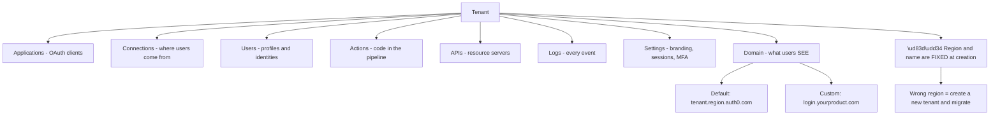
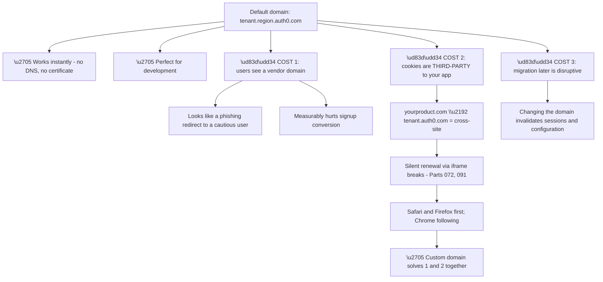
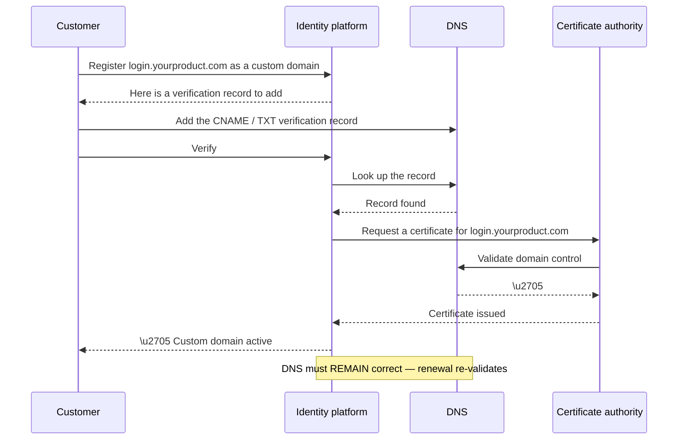
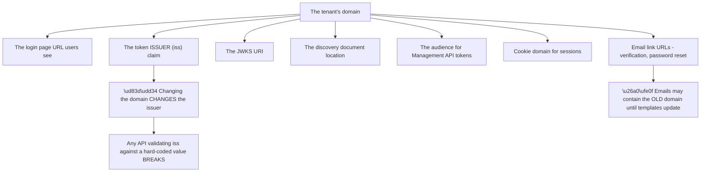
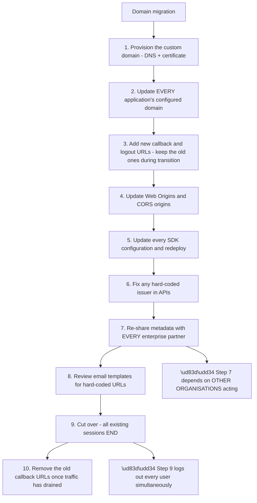
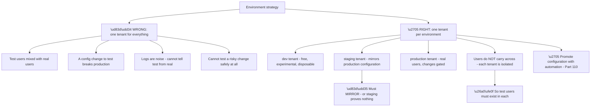
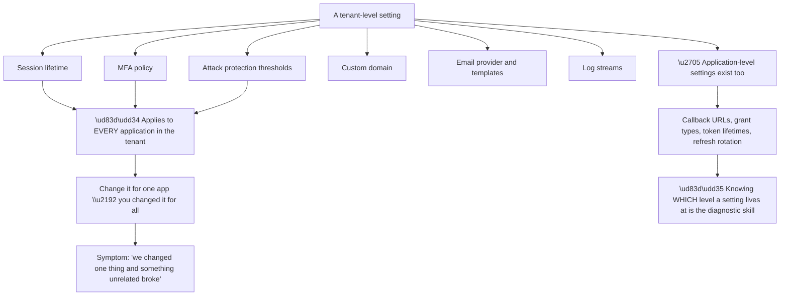
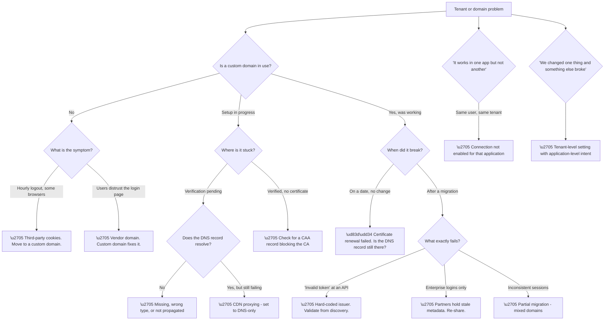

# Part 097 - Tenants, Domains, Custom Domains, and Environments

> Section goal: Understand the container everything else lives in — the tenant — plus the domain that users actually see, and why the choice between a default domain and a custom domain has consequences far beyond branding.

Covers index item **097**. Maps to JD signals: *Auth0*, *customer identity*, *DNS*, *TLS/SSL*, *troubleshooting complex technical issues*, *browser behaviour*, *deployment*.

---

## 1. Start From Zero: What a Tenant Is

A **tenant** is an isolated instance of the identity platform belonging to one customer. Everything else in Group J — applications, connections, users, actions, logs — lives inside one.

| Property | Detail |
|---|---|
| **Identifier** | A tenant name, unique within a region |
| **Region** | Where the tenant's data resides — chosen at creation |
| **Default domain** | `<tenant>.<region>.auth0.com` |
| **Isolation** | Users, configuration, and logs are scoped to the tenant |
| **Immutability** | The name and region **cannot be changed after creation** |

**Node R1 is the mistake that is expensive to correct.** Region determines where user data is stored, which is often a legal requirement — data residency in the EU, in Australia, in specific jurisdictions. **Choosing wrongly means creating a new tenant and migrating every user, application, and configuration**, which is a project rather than a fix.

**The practical advice at onboarding** is therefore to establish the data residency requirement *before* the tenant is created, not after. **It is one of the few decisions in this entire platform that cannot be undone.**

**Users are scoped to the tenant**, which has an important consequence: **the same person signing up in two of a company's tenants is two entirely separate users**, with separate IDs, separate profiles, and no relationship. That is correct isolation, and it is why environment strategy (§4) matters.

> 💡 **Tie-in to your background:** the tenant model here is structurally the same as the Entra tenant from Part 090 — an isolation boundary containing users, applications, and configuration. **The concepts you built there transfer directly**, which is worth noticing because it makes this section faster to learn than it looks.

### 🔍 Plain-English deep-dive: what the default domain costs you

Every tenant gets a working domain immediately, which is excellent for getting started and problematic for production.

**Cost two is the technically consequential one**, and it connects directly to material already covered. When the application is at `yourproduct.com` and the identity platform is at `tenant.auth0.com`, **every cookie the identity platform sets is third-party from the application's perspective.**

**Browsers are progressively eliminating third-party cookies.** So silent token renewal via a hidden iframe — which depends on that cookie being sent — **stops working**, and the symptom is the one from Part 091: users appear to be logged out after an hour, on some browsers and not others.

**A custom domain at `login.yourproduct.com` makes the identity platform's cookies same-site** with the application, because both are under `yourproduct.com`. **That is not a cosmetic improvement; it is a functional one.**

| Aspect | Default domain | Custom domain |
|---|---|---|
| Setup time | Instant | DNS + certificate provisioning |
| Branding | Vendor visible | Your product |
| Cookie context | **Third-party** | **Same-site** |
| Silent renewal | ⚠️ Fragile | ✅ Reliable |
| Conversion | ⚠️ Measurably worse | ✅ Better |
| Certificate | Managed for you | Managed, but DNS must stay valid |
| Migration cost later | — | **Do it early** |

**The last row is the practical recommendation.** Moving to a custom domain after launch invalidates existing sessions and requires updating every application's configuration, every allowed callback URL, and any hard-coded issuer values. **Doing it before launch costs an afternoon; doing it after costs a migration plan.**

**Analogy:** trading under a marketplace's web address versus your own. The marketplace address works immediately and tells every customer you are a tenant of someone else's platform. Moving later means every link, bookmark, and reference has to change. **Where it stops:** a shop can put up a sign. Cookies are governed by the actual domain, not by what it looks like.

---

## 2. Custom Domains: How They Actually Work

Setting up a custom domain involves DNS, certificates, and a verification step — all of which can fail in recognisable ways.

**The final note is the failure that catches people out later.** Certificates renew automatically, but renewal **re-validates domain control through DNS**. If the DNS record is removed during an unrelated cleanup, **renewal fails and the domain breaks on the renewal date** — a Part 095 pattern-three failure with a delay of months between cause and symptom.

| Failure | Symptom | Cause |
|---|---|---|
| Verification never completes | Domain stuck pending | Record missing, wrong, or not propagated |
| Wrong record type | Verification fails | CNAME vs TXT confusion |
| Proxied through a CDN | Verification or TLS fails | CDN intercepting validation |
| Certificate not issued | TLS errors | CA validation blocked |
| **Record removed later** | **Breaks months later** | Renewal re-validation fails |
| CAA record blocks the CA | Certificate never issues | DNS CAA policy |
| Application still points at the default | Mixed domains, cookie issues | Configuration not updated |

**Row three deserves specific attention** because it is common and confusing. Customers frequently place their DNS behind a CDN with proxying enabled, which **intercepts the validation request** and breaks either verification or certificate issuance. **The fix is to set the record to DNS-only mode**, which is a single toggle and almost never the customer's first guess.

**Row six is rarer but produces a completely opaque failure.** A CAA record restricting which certificate authorities may issue for the domain will silently prevent issuance if the platform's CA is not listed. **Nothing in the error mentions CAA**, and checking for it is a quick, high-value diagnostic on any stuck certificate.

**Row seven produces the worst outcome** — a partially migrated configuration where some flows use the custom domain and some use the default. **Cookies are then split across two domains**, sessions behave inconsistently, and the symptoms are genuinely bizarre. **The check is to confirm every application's configured domain and every allowed callback URL uses the same one.**

---

## 3. What Else the Domain Choice Affects

The domain appears in more places than the login page, and inconsistency in any of them causes failures.

**Node W1 is the migration trap.** The issuer claim is derived from the domain. **An API that validates `iss` against a hard-coded string will reject every token issued after a domain change** — and the error will be "invalid token," which points at tokens rather than at domains.

**The correct pattern**, established in Part 077, is to validate the issuer against the value from the discovery document rather than a literal. **Customers who hard-coded it discover the problem at the worst moment**, and it is worth flagging proactively during any domain migration conversation.

**Node W3 is the subtle one.** Verification and password reset emails contain links built from the domain. **After a migration, previously-sent emails still point at the old domain** — which may still work, or may not — and templates that hard-coded the domain will keep producing old links until updated.

| Surface | Affected by domain change? | Action needed |
|---|---|---|
| Login page URL | ✅ | Update application configuration |
| `iss` claim | ✅ | **APIs must not hard-code it** |
| JWKS URI | ✅ | Fetch from discovery |
| Allowed callback URLs | ✅ | Update every application |
| Session cookies | ✅ | Existing sessions invalidated |
| Email templates | ⚠️ Only if hard-coded | Review templates |
| SDK configuration | ✅ | Update the domain setting |
| Enterprise connection metadata | ✅ | **Re-share with every IdP partner** |

**The last row is the one with an external dependency.** SAML metadata for the tenant includes URLs built from the domain. **Every enterprise customer who configured a connection has that metadata**, and a domain change means every one of them must update — which is a coordination exercise, not a configuration change.

**Which reinforces the earlier advice:** choose the domain before onboarding enterprise customers, because after that the cost is borne by other organisations.

### 🔍 Plain-English deep-dive: the domain migration checklist, and why it is a project

Moving from a default domain to a custom one after launch is routinely underestimated. **Laying out the actual steps is the fastest way to make the "do it early" advice land.**

**Node W2 is what makes it a project rather than a task.** Steps one through six are within the customer's control. **Step seven is not** — each enterprise partner has their own change process, their own release schedule, and their own priorities. **A migration involving five enterprise customers is gated by the slowest of five external organisations.**

**Node W is the user-visible cost.** Session cookies are scoped to the domain, so cutting over ends every session at once. **Doing that at a peak time is a self-inflicted incident**, and the mitigation is simply timing plus a clear notice.

| Step | Owner | Reversible? |
|---|---|---|
| DNS and certificate | Customer | ✅ |
| Application configuration | Customer | ✅ |
| SDK redeploy | Customer | ✅ |
| Hard-coded issuer fix | Customer | ✅ |
| **Enterprise metadata** | **Each partner** | ⚠️ Slow both ways |
| Cutover | Customer | ❌ Sessions cannot be restored |

**The transitional overlap in step three is the single most useful piece of advice** to give a customer planning this. **Keeping both old and new callback URLs configured during the transition** means a client that has not yet been updated keeps working, which converts a big-bang cutover into a gradual migration for everything except sessions.

**And the ordering matters in one specific way:** fix the hard-coded issuer (step six) **before** cutover, not after. **An API validating a literal issuer will reject every token the instant the domain changes**, and discovering that during a cutover window is avoidable.

**Analogy:** changing a company's phone number. Updating your own stationery is easy; getting every partner who printed your number in their systems to update is not, and the day you disconnect the old line, every call in progress drops. **Where it stops:** you can keep the old number redirecting indefinitely. Session cookies cannot be redirected — they simply stop matching.

---

## 4. Environments: Development, Staging, Production

A tenant is the unit of environment separation, and getting this wrong is one of the more damaging early mistakes.

**Node R2a is the requirement that makes staging worth having.** A staging tenant that differs from production in its connections, actions, or settings **does not test what production will do.** The most common divergence is enterprise connections — staging has none, production has several — which means enterprise login paths are never tested before release.

**Node R5 is the practical friction.** Because tenants are isolated, a test user in staging does not exist in production. **That is correct**, and it means test data and seeding must be handled per environment rather than assumed.

**Node R6 is the discipline that makes multiple tenants sustainable.** Manually keeping three tenants aligned does not work — drift is inevitable. **Configuration-as-code, promoted through environments, is the answer** (Part 110), and it converts environment separation from an overhead into an advantage.

| Practice | Effect |
|---|---|
| One tenant per environment | Isolation, safe testing |
| Configuration as code | Prevents drift |
| Same connection *types* in staging | Enterprise paths actually tested |
| Separate applications per environment | No cross-environment credentials |
| Production changes gated | Change control where it matters |
| Free tier for development | Cost is not a barrier |

**Row four is a security point worth stating.** Using the same application credentials across environments means **a development secret is a production credential.** Development environments are less protected by definition, so separate applications per environment is a real control, not bureaucracy.

### 🔍 Plain-English deep-dive: the tenant is the blast radius, and that cuts both ways

Tenant isolation is protective. **It also means a tenant-level mistake affects everything in it**, which is the framing that should govern change management.

**Node P2 is the transferable skill from this Part.** When a customer reports that changing one thing broke something else, **the question is whether the setting they changed was tenant-level or application-level.** A tenant-level change with an application-level intention is a very common cause of surprising collateral damage.

| Setting | Level | Blast radius |
|---|---|---|
| Session lifetime | Tenant | Every application |
| MFA policy | Tenant | Every application |
| Attack protection | Tenant | Every application |
| Custom domain | Tenant | Everything |
| Callback URLs | **Application** | That application only |
| Grant types | **Application** | That application only |
| Refresh token rotation | **Application** | That application only |
| Connection enabled/disabled | **Per application** | That application only |

**The last row is a genuinely useful detail.** Connections are defined at tenant level but **enabled per application** — so the same database connection can serve one application and not another. **That is the mechanism behind a specific and confusing ticket: "the same user can log into app A but not app B."** The user exists; the connection is simply not enabled for the second application.

**And it is the first thing to check on any "works in one app, not another" report**, because it costs seconds and explains the symptom exactly.

**Analogy:** a building's central heating versus a thermostat in one room. Adjusting the boiler because one room is cold changes every room. **Where it stops:** people in other rooms will complain quickly. A tenant-level identity change may not surface for hours, and by then the connection to the change has been forgotten.

---

## 5. Failure Modes

| # | Failure mode | Symptom | Root cause | First check |
|---|---|---|---|---|
| 1 | Wrong region chosen | Data residency non-compliance | Immutable at creation | Was residency established first? |
| 2 | Default domain in production | Hourly logout on Safari | Third-party cookies | Which domain is configured? |
| 3 | Verification record missing | Domain stuck pending | DNS not added or propagated | Query the record directly |
| 4 | CDN proxying the record | Verification or TLS fails | Proxy intercepts validation | Is it DNS-only mode? |
| 5 | CAA record blocks issuance | Certificate never issues | DNS CAA policy | Check for CAA records |
| 6 | DNS record removed later | Breaks on renewal, months later | Renewal re-validation | Is the record still present? |
| 7 | Partial domain migration | Bizarre session behaviour | Mixed domains | Do all apps use one domain? |
| 8 | Hard-coded issuer | "Invalid token" after migration | `iss` derived from domain | Is `iss` validated from discovery? |
| 9 | Enterprise metadata stale | Enterprise logins fail after migration | Partners hold old URLs | Were partners notified? |
| 10 | One tenant for all environments | Test changes break production | No isolation | How many tenants exist? |
| 11 | Staging differs from production | Untested paths fail on release | Configuration drift | Do connection types match? |
| 12 | Shared credentials across environments | Dev secret is a prod credential | Same application reused | Separate apps per environment? |
| 13 | Tenant-level change, app-level intent | Unrelated breakage | Blast radius misunderstood | Which level is that setting? |
| 14 | Connection not enabled for an app | Works in one app, not another | Per-application enablement | Is the connection enabled there? |

---

## 6. Troubleshooting Decision Tree: Tenant and Domain Problems

### Worked example

A customer reports that their production login page has been down for two hours. It worked yesterday. Nothing was deployed.

**Node B: a custom domain is in use.** Node D: it broke on a date with no change. **Straight to D1 — certificate renewal.**

**Checking the domain.** The TLS certificate for `login.theirproduct.com` is expired. The renewal should have been automatic.

**Why it failed.** Renewal re-validates domain control via DNS, and the validation record is **gone**.

**When was it removed?** Three months ago, during a DNS cleanup. Someone found a record that appeared to serve no purpose — it pointed at a vendor domain, it was not referenced by anything in their infrastructure documentation, and removing it broke nothing at the time.

**Nothing broke for three months**, because the certificate was still valid. **The cause and the symptom are separated by a quarter**, which is why nobody connected them.

**The immediate fix** is to restore the record and trigger renewal. **The write-up point** is the more valuable one: **DNS records that support certificate validation look purposeless between renewals.** They should be documented as load-bearing, precisely because their function is invisible for most of their life.

**What made it findable:** the Part 095 pattern — total, dated, nothing changed — pointing at expiry, and then asking not "what changed yesterday" but **"what changed at any point that could surface now."** For certificate failures, the relevant change window is the whole renewal period, not the last day.

---

## 7. Lab: Create a Tenant and Configure a Custom Domain

**Purpose.** Build the container everything else in Group J lives in, and experience the domain setup and its failure modes directly.

**Prerequisites.**
- A **free-tier** Auth0 tenant, created with a personal email
- Optionally, a personal domain you control with DNS access
- A DNS lookup tool (`nslookup`, `dig`, or an online checker)
- **Never** use an employer or customer domain or tenant

**Steps.**

1. **Create a free tenant.** Before confirming, **note the region choice** and write down why it cannot be changed later.
2. **Record the default domain** and note its shape.
3. **Fetch the discovery document** at `https://<tenant>/.well-known/openid-configuration`. **Record the issuer** and note that it matches the domain exactly.
4. **Create a second tenant** to represent a development environment. **Confirm that a user created in one does not exist in the other.**
5. **If you have a personal domain:** configure a custom domain. **Record every step**, including the exact record type and value requested.
6. **Before adding the record**, attempt verification and record the error.
7. **Add the record**, wait for propagation, and verify. **Time how long propagation took.**
8. **Fetch the discovery document from the custom domain.** **Compare the issuer** to the default-domain version. **Confirm they differ.**
9. **Deliberately break it:** remove the DNS record and observe what does and does not break immediately. **Note that the existing certificate keeps working** — this is the three-month gap from §6.
10. **Restore the record.**
11. **If you do not have a domain:** document steps 5–10 from the official documentation instead, and **write out the failure timeline** for the removed-record scenario in your own words.
12. **Identify three tenant-level and three application-level settings** in the dashboard, and write down each one's blast radius.

**Expected evidence.**
- Two tenants, with the region decision noted
- Both discovery documents, with issuers compared
- Evidence that a user in one tenant does not exist in the other
- Custom domain setup steps with the propagation time recorded
- The removed-record observation, or a written timeline
- A tenant-level versus application-level settings table, in your own words

**Validation rubric.**

| Criterion | Pass |
|---|---|
| Tenant model | You can explain isolation and what is immutable |
| Domain cost | You can explain the third-party cookie consequence |
| Setup | You can describe verification, certificate issuance, and renewal |
| Delayed failure | You can explain the removed-record timeline |
| Issuer | You can explain why hard-coding `iss` breaks on migration |
| Levels | You can classify any setting as tenant or application level |
| Safety | Personal email, free tier, personal domain only |

**Cleanup and privacy.** Delete both tenants when finished and remove any DNS records you added. **Never configure a custom domain against an employer or customer domain**, and never create a tenant using a work email address — tenants created with corporate identities can become entangled with organisational accounts. **Use fictional users only.**

---

## 8. JD Mapping

| JD signal | How this Part addresses it |
|---|---|
| Auth0 / customer identity | The tenant object model and environment strategy |
| DNS | Verification records, propagation, CAA, CDN proxying |
| TLS/SSL | Certificate issuance, renewal, and delayed failure |
| Browser behaviour | Third-party cookies and the same-site benefit |
| Troubleshooting complex technical issues | Fourteen failure modes and a decision tree |
| Root cause analysis | A cause and symptom separated by three months |
| Deployment | Environment separation and configuration promotion |

---

## 9. Candidate Honesty Note

- **Production experience:** DNS and TLS troubleshooting, including certificate expiry and propagation issues.
- **Production experience:** environment separation and change-control discipline in enterprise support.
- **Lab experience:** creating tenants, configuring a custom domain on a personal domain, and observing the delayed-failure behaviour of a removed validation record, as above.
- **Learned architecture:** the tenant-level versus application-level setting split and its blast radius implications.
- **No direct experience:** operating production tenants or running a domain migration for a live customer.
- **How to say it:** *"DNS and certificates are familiar territory — I've troubleshooted expiry and propagation problems plenty of times. The tenant model I've learned and labbed, including setting up a custom domain on a personal domain and deliberately removing the validation record to see the delayed failure. I haven't run a domain migration for a live customer."*

---

## 10. Official Source Anchors

| Source | Why | Accessed |
|---|---|---|
| Auth0 Docs — Tenant settings and creation | Tenant model, region, immutability | Accessed **26 August 2026** |
| Auth0 Docs — Custom domains | Setup, verification, certificate management | Accessed **26 August 2026** |
| Auth0 Docs — Set up multiple environments | Environment strategy guidance | Accessed **26 August 2026** |
| Auth0 Docs — OpenID Connect discovery | Issuer and endpoint derivation | Accessed **26 August 2026** |
| RFC 8659 — DNS Certification Authority Authorization | CAA record semantics | Accessed **26 August 2026** |
| Auth0 Docs — Application settings | Application-level configuration surface | Accessed **26 August 2026** |

> **Revalidate:** custom domain setup steps, supported record types, and regional options change. Re-check the Auth0 documentation before interview rather than describing a specific setup flow from memory.

---

## ⭐ Likely Interview Questions for This Section

### Q1. "What is a tenant, and what decisions about it are irreversible?"

> *Model answer:* A tenant is an isolated instance of the platform belonging to one customer — it contains the applications, connections, users, actions, logs, and settings, and nothing crosses between tenants. Two things are fixed at creation: the tenant name and the region. Region matters most because it determines where user data is stored, which is frequently a legal data-residency requirement. Getting it wrong means creating a new tenant and migrating every user and every piece of configuration, which is a project rather than a fix. So establishing the residency requirement before the tenant is created is one of the few genuinely irreversible decisions in the whole platform, and worth confirming at onboarding.

### Q2. "Why does a custom domain matter beyond branding?"

> *Model answer:* Because of cookies. If the application is at yourproduct.com and the identity platform is at tenant.auth0.com, then every cookie the identity platform sets is third-party from the application's point of view. Browsers are progressively eliminating third-party cookies, so silent token renewal through a hidden iframe stops working — and the symptom is users appearing to be logged out after an hour, on Safari and Firefox first and Chrome following. A custom domain at login.yourproduct.com makes those cookies same-site, which turns a fragile mechanism into a reliable one. There is a branding and conversion benefit too, since a vendor domain in the middle of a signup flow looks like a phishing redirect to a cautious user. But the cookie point is functional rather than cosmetic, and it is the one I would lead with.

### Q3. "A custom domain worked for months and suddenly broke. What happened?"

> *Model answer:* Almost certainly a failed certificate renewal, caused by the DNS validation record having been removed at some earlier point. Certificates renew automatically, but renewal re-validates domain control through DNS — so if the record was deleted during an unrelated cleanup, nothing breaks until the existing certificate expires, which can be months later. That gap is why nobody connects the two. The general lesson is that for certificate failures the relevant change window is the whole renewal period, not the last day, so I would ask what changed at any point rather than what changed yesterday. And the prevention worth writing up is that validation records look purposeless between renewals and should be documented as load-bearing.

### Q4. "A customer migrated to a custom domain and now their API rejects tokens. Why?"

> *Model answer:* The issuer claim is derived from the domain, so changing the domain changes `iss` on every token issued afterwards. An API validating the issuer against a hard-coded string rejects all of them, and the error surfaces as "invalid token," which points at tokens rather than at domains. The correct pattern is to validate the issuer against the value from the discovery document rather than a literal, which makes the API robust to this by construction. It is worth flagging proactively before any domain migration, along with the other things a domain change touches — allowed callback URLs, SDK configuration, and especially enterprise connection metadata, since every enterprise partner holds URLs built from the old domain and has to update.

### Q5. "How should a customer structure environments?"

> *Model answer:* One tenant per environment — development, staging, production — because a tenant is the isolation boundary and there is no other way to test a configuration change safely. The requirement people miss is that staging has to genuinely mirror production, and the most common divergence is enterprise connections: staging has none, production has several, so enterprise login paths are never tested before release. The friction to be aware of is that users do not cross tenants, so test users have to exist in each one. And the discipline that makes it sustainable is configuration as code, promoted between environments, because manually keeping three tenants aligned guarantees drift. I would also use separate applications per environment, so a development secret is not also a production credential.

### Q6. "A customer says the same user can log into one of their applications but not another. What's your first check?"

> *Model answer:* Whether the connection is enabled for the second application. Connections are defined at tenant level but enabled per application, so the same database or social connection can serve one application and not another. The user genuinely exists, and the connection genuinely works — it is just not switched on for that client. That explains the symptom exactly and takes seconds to check, so it goes first. If that is not it, I would look at whether the two applications use the same domain, because a partially completed custom domain migration splits cookies across two domains and produces genuinely strange session behaviour.

### Q7. "A customer changed one setting and something unrelated broke. How do you approach that?"

> *Model answer:* By establishing whether the setting they changed is tenant-level or application-level, because that is the blast radius. Session lifetime, MFA policy, attack protection thresholds, the custom domain, and email configuration are all tenant-level — they apply to every application in the tenant. Callback URLs, grant types, token lifetimes, and refresh rotation are application-level. A very common cause of surprising collateral damage is a tenant-level change made with an application-level intention: someone wanted to shorten sessions for one app and shortened them for all of them. So my first question is which setting, and my second is which level it lives at, before I look at the thing that broke.

### Q8. "What would you check if a custom domain gets stuck during setup?"

> *Model answer:* Three things in order. First, whether the DNS record actually resolves — I would query it directly rather than trust that it was added, since the wrong record type or incomplete propagation is the most common cause. Second, whether the record is proxied through a CDN, because proxying intercepts the validation request and breaks either verification or certificate issuance; the fix is setting it to DNS-only mode, which is one toggle and almost never the customer's first guess. Third, if verification succeeds but no certificate is issued, I would check for a CAA record on the domain restricting which certificate authorities may issue — nothing in the error mentions CAA, so it has to be checked deliberately, and it is a quick high-value diagnostic.

---

## 🧠 30-Second Memory Hooks

- **Tenant = the isolation boundary.** Everything lives inside one.
- **Name and region are immutable.** Establish data residency first.
- **Users do not cross tenants.**
- **Default domain = third-party cookies = broken silent renewal.**
- **Custom domain = same-site = functional, not cosmetic.**
- **Do the custom domain BEFORE launch and before enterprise customers.**
- **Domain determines `iss`.** Never hard-code the issuer.
- **Renewal re-validates DNS.** A removed record breaks it months later.
- **CDN proxying breaks verification. Set DNS-only.**
- **CAA records silently block issuance.**
- **One tenant per environment. Staging must mirror production.**
- **Tenant-level vs application-level = the blast radius question.**
- **Connections are tenant-defined but application-enabled.**
- **"Works in one app, not another" = connection not enabled there.**

---

## ✅ Completion Checklist

- [ ] I can explain what a tenant is and what is immutable about it
- [ ] I can explain the third-party cookie cost of the default domain
- [ ] I can describe custom domain setup and its three common blockers
- [ ] I can explain the delayed certificate-renewal failure
- [ ] I can list what a domain change affects, including enterprise metadata
- [ ] I can explain why hard-coding the issuer breaks on migration
- [ ] I can describe a sound environment strategy and the staging-mirror requirement
- [ ] I can classify settings as tenant-level or application-level
- [ ] I know the "works in one app, not another" check
- [ ] I have completed the lab and deleted my tenants
- [ ] I can state honestly what I have configured and what I have not

*Next suggested section:* **[Part 098 - Applications, APIs, and Connections: The Core Object Model](Part-098-applications-apis-and-connections-the-core-object-model.md)** — the three objects that every Auth0 ticket ultimately involves, and how they relate to the OAuth roles from Part 056.
