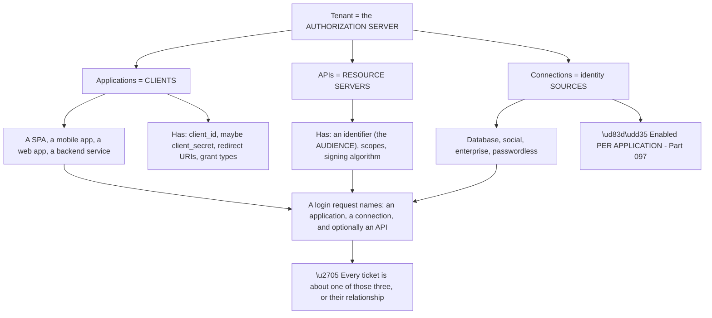
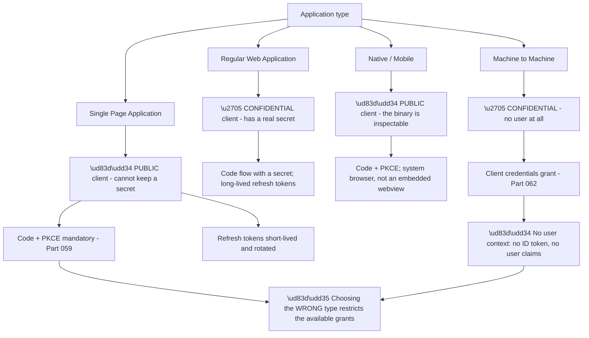
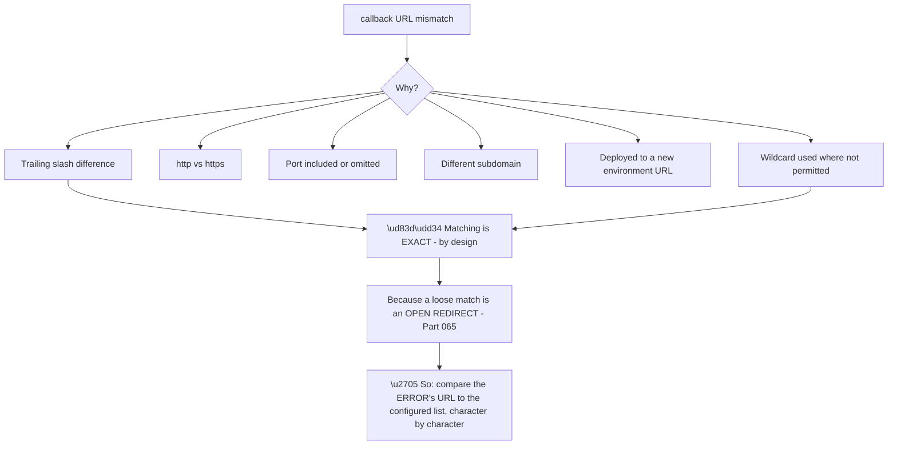
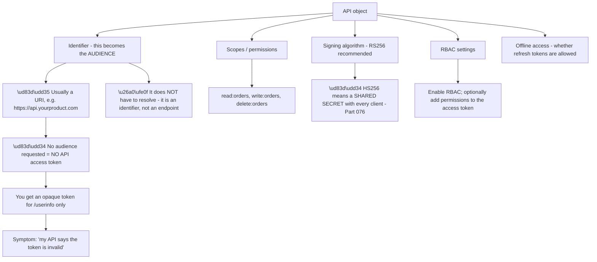
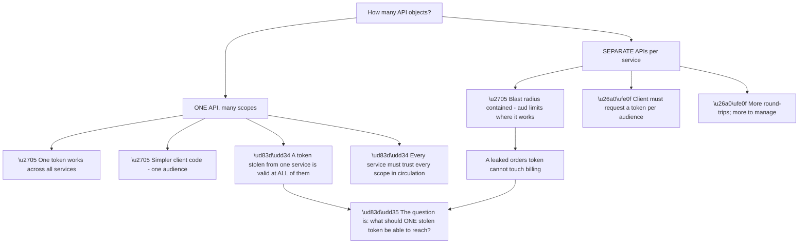
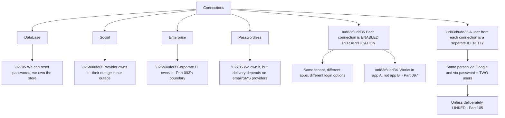
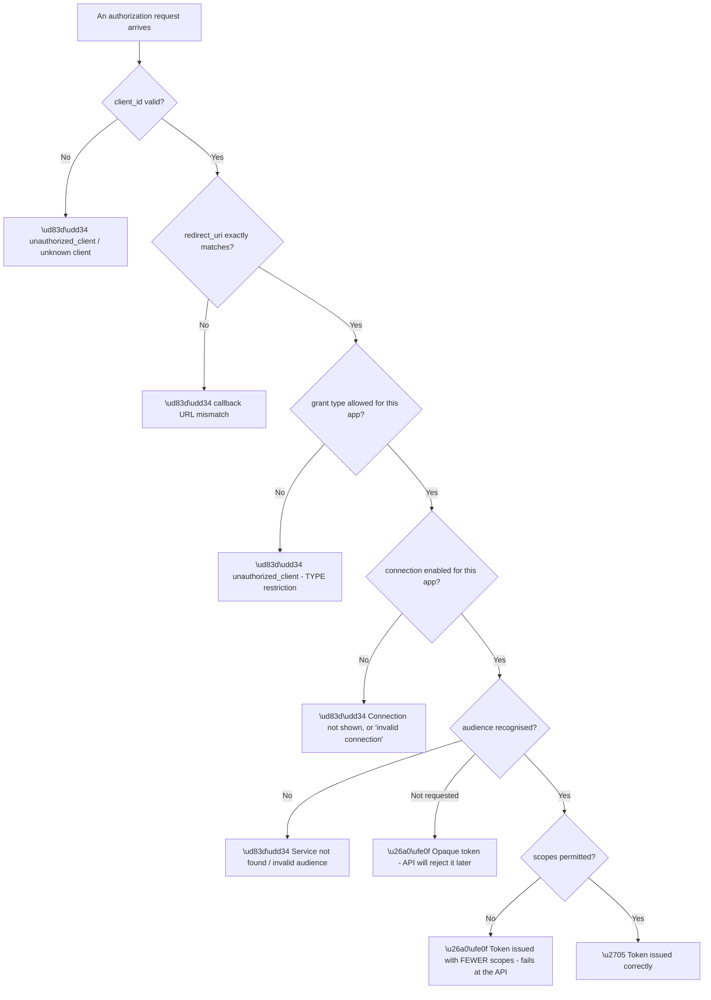
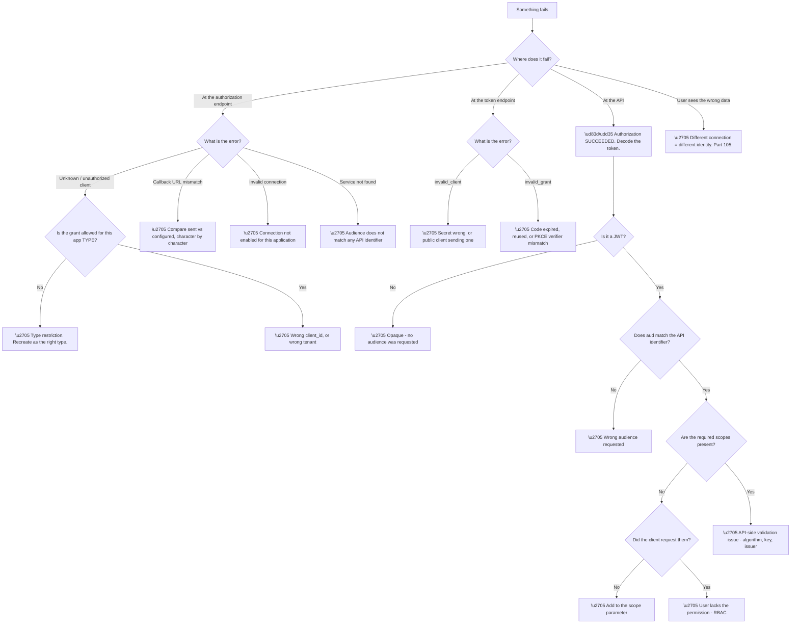

# Part 098 - Applications, APIs, and Connections: The Core Object Model

> Section goal: Learn the three objects that every ticket in this product ultimately involves — Applications, APIs, and Connections — and map each one onto the OAuth 2.0 roles from Part 056, so the dashboard stops being a set of screens and becomes a model you can reason with.

Covers index item **098**. Maps to JD signals: *Auth0*, *OAuth 2.0 and OIDC*, *APIs*, *authentication and authorization*, *troubleshooting complex technical issues*, *developer support*.

---

## 1. Start From Zero: Three Objects, Three OAuth Roles

Every configuration screen in this platform maps onto an OAuth 2.0 role you already know from Part 056. **Making that mapping explicit turns product configuration into protocol reasoning.**

| Product object | OAuth role | Answers the question |
|---|---|---|
| **Application** | **Client** | *Who is asking for a token?* |
| **API** | **Resource server** | *What is the token for?* |
| **Connection** | *(Identity source)* | *Where do the users come from?* |
| The tenant itself | **Authorization server** | *Who issues the tokens?* |

**Node F is the sentence to internalise.** A single authorization request carries a `client_id` (which application), often a `connection` (which identity source), and often an `audience` (which API). **Three objects, one request** — and a misconfiguration in any of them produces a distinct, recognisable error.

**The tenant being the authorization server** is worth stating explicitly because it explains why tenant-level settings (Part 097) affect everything: **the authorization server is shared by every client and every resource server inside it.**

> 💡 **Tie-in to your background:** you have worked with REST APIs and with identity systems separately. This is the point where they join — an API here is a first-class identity object with an audience and scopes, not just an endpoint. **The OAuth roles from Part 056 are the bridge.**

### 🔍 Plain-English deep-dive: application *type* is not cosmetic — it changes what is possible

When creating an application you choose a type, and that choice constrains the security model permanently.

**The public/confidential split is the whole point** (Part 057). A public client cannot hold a secret, because anyone can read the code or decompile the binary. **The platform enforces this by making certain grants unavailable to certain types**, which is protective and confusing if you do not know why.

**The recognisable ticket:** *"I'm getting `unauthorized_client` and I don't understand why."* **Very often the application type does not permit the grant being attempted.**

| Attempted grant | Type where it fails |
|---|---|
| Client credentials | ❌ SPA and Native — no secret to authenticate with |
| Authorization code **without** PKCE | ❌ SPA and Native — PKCE required |
| Password grant | ❌ Generally discouraged everywhere (Part 063) |
| Refresh token | ⚠️ Must be explicitly enabled; behaviour differs by type |

**Node M3 is the misunderstanding worth pre-empting.** A machine-to-machine application has **no user**. The client credentials grant returns an access token representing *the application itself* — **there is no ID token, no `sub` naming a person, and no user profile.** Developers frequently expect user claims and are surprised by their absence.

**And the type cannot always be changed later** without re-creating the application, which means new credentials and updated configuration everywhere. **Getting it right at creation is worth thirty seconds of thought**, and it is a reasonable thing to confirm early in any integration conversation.

**Analogy:** choosing between a safe and a display cabinet before you decide what to store. Once the cabinet is glass-fronted, "keep this secret inside" is not an option no matter how much you want it. **Where it stops:** you could move the contents. An application's type is baked into its identity and its issued credentials.

---

## 2. Applications in Detail

The application object is where most integration configuration lives, and each field maps to a specific failure.

| Setting | Purpose | Failure when wrong |
|---|---|---|
| **Client ID** | Public identifier | `unauthorized_client`, or the wrong app's config applies |
| **Client secret** | Confidential authentication | `invalid_client` |
| **Allowed Callback URLs** | Where the response may be sent | **`callback URL mismatch`** — the single most common error |
| **Allowed Logout URLs** | Where logout may return | Logout redirect rejected |
| **Allowed Web Origins** | CORS for silent auth | Silent renewal blocked |
| **Allowed Origins (CORS)** | Cross-origin API calls | CORS errors (Part 021) |
| **Grant types** | Which flows are permitted | `unauthorized_client` |
| **Token endpoint auth method** | How the client authenticates | `invalid_client` |
| **Refresh token rotation** | Rotation and reuse detection | Unexpected logouts if misconfigured |
| **ID token expiry** | Lifetime | Session length behaviour |

**Node M1 is the security reason to give the customer**, because "just allow a wildcard" is the request that follows this error. **Exact matching prevents an attacker from redirecting the authorization response to a URL they control** — which would hand them the code or token. It is a deliberate control, not an inconvenience.

**Node M2 is the diagnostic method**, and it is genuinely mechanical. The error message contains the URL that was sent. **Compare it to the configured list character by character** — the difference is almost always a trailing slash, a scheme, or a port. **This resolves in seconds and is worth doing before any other investigation.**

**Three settings are routinely confused**, and being precise about them saves round-trips:

| Setting | What it controls |
|---|---|
| **Allowed Callback URLs** | Where the **authorization response** may be delivered |
| **Allowed Web Origins** | Which origins may perform **silent authentication** |
| **Allowed Origins (CORS)** | Which origins may make **cross-origin requests** to the tenant |

**A SPA typically needs all three**, and the classic symptom of missing Web Origins is that login works but **silent renewal fails** — which presents as the hourly-logout pattern from Part 091, with a different cause. **Two different root causes, one symptom**, which is why checking both is worthwhile.

---

## 3. APIs: The Audience and Scopes

An API object represents a **resource server** — something an access token is issued *for*. Registering it is what makes the platform issue a proper JWT access token rather than an opaque one.

**Node R is the single most common API-related misunderstanding**, and it is worth being able to explain instantly. **If the authorization request does not include an `audience` parameter naming the API, the access token returned is not for that API** — it is an opaque token usable only against the `/userinfo` endpoint.

**The developer's experience** is that they get a token, it looks like a token, and their API rejects it. **The fix is one parameter**, and recognising the symptom saves a long investigation.

| Symptom | Cause |
|---|---|
| Access token is not a JWT | No `audience` requested |
| JWT with wrong `aud` | Wrong audience value |
| `insufficient_scope` | Scope not requested or not granted |
| Signature validation fails | Wrong algorithm or wrong key |
| Token works for `/userinfo` only | Opaque token — no audience |

**Node SG1 restates Part 076's warning in product terms.** Choosing HS256 means the API validates with a **shared secret** — the same secret the client holds. **That secret must then be distributed to every party**, and a public client cannot hold it at all. **RS256 uses a public key from JWKS**, requiring no secret distribution, and is the correct default.

**Scopes versus permissions** is a distinction worth being precise about:

| Concept | Meaning |
|---|---|
| **Scope** | What the *client* is asking to do |
| **Permission** | What the *user* is allowed to do (RBAC) |
| **Effective** | The **intersection** — both must allow it |

**The intersection point resolves a specific confusion.** A user with `delete:orders` permission using a client that only requested `read:orders` gets a token with `read:orders` only. **That is correct** — the client did not ask for more — and it explains "the user has the permission but the token doesn't."

### 🔍 Plain-English deep-dive: one API object, many services — and when to split

A recurring architecture question from developers is whether to register one API or several. **The answer follows from what the audience claim is actually for.**

**Node R is the reframing that makes the decision easy.** The audience claim exists precisely to **bound where a token is valid** (Part 077). **A single audience across a whole estate discards that boundary**, which is a legitimate choice for a small internal system and a poor one for anything with differing sensitivity.

| Situation | Recommendation |
|---|---|
| One product, one backend | ✅ One API |
| Several services, similar sensitivity | ✅ One API, scoped permissions |
| A service handling payments or PII | ✅ **Separate API** |
| Third-party or partner access | ✅ **Separate API** |
| Internal admin tooling | ✅ **Separate API** |

**Rows three to five share one reason:** those are the services where **a token leak matters most**, and the audience claim is the cheapest available containment. **Splitting them costs the client one extra token request and buys a hard boundary.**

**A practical detail worth knowing:** a single access token has **one** audience. A client needing to call two separately-registered APIs must obtain **two tokens** — typically by requesting each audience in turn, reusing the same session so the user is not prompted twice. **Developers expecting one token to cover both are surprised by this**, and it is the most common follow-up question after recommending a split.

**And the anti-pattern to name explicitly:** using the **Management API** as the audience for an application's own business calls. The Management API is for configuring the tenant, not for a product's own data — **and a token for it is extremely privileged.** Seeing it requested from a front-end application is a finding worth raising immediately (Part 106).

**Analogy:** one master key for an entire building versus separate keys per floor. The master key is convenient right up until it is copied. **Where it stops:** you can rekey a lock. A token already issued remains valid for its lifetime, which is exactly why the boundary has to be designed in rather than added later.

---

## 4. Connections: Where Users Come From

A connection is a source of identities. **The type determines who owns the credential and what can go wrong.**

| Connection type | Users live | Credential owner | Covered in |
|---|---|---|---|
| **Database** | In the tenant, or in the customer's own store | The platform, or the customer | Part 099 |
| **Social** | At Google, Facebook, GitHub, Apple | The social provider | Part 100 |
| **Enterprise** | At a corporate IdP | The corporate IT team | Part 101 |
| **Passwordless** | In the tenant, verified by email/SMS | The platform | Part 100 |

**Node ID1 is the model that surprises people most**, and it is fundamental. **A person who signs up with a password and later signs in with Google is two separate user records**, each with its own user ID, profile, and history — unless account linking is configured.

**That is correct behaviour**, because the platform has no basis for assuming the same email address at two providers means the same person. **Assuming it would be an account-takeover path** (Parts 083, 093). But it produces a real and frequent support pattern:

| Symptom | Explanation |
|---|---|
| "My data disappeared" | Signed in via a different connection |
| "I have two accounts" | Two identities, same person |
| "It says I already have an account" | Email exists on another connection |
| "My purchases are gone" | Same as the first |

**Part 105 covers linking in full.** The point here is that **the connection is part of the user's identity**, not an incidental detail of how they logged in.

### 🔍 Plain-English deep-dive: how the three objects fail *together*

Most real tickets are not about one object — they are about a mismatch between two.

**The ordering of this validation chain is diagnostically useful**, because **the error tells you how far the request got.**

| Error | How far it got |
|---|---|
| Unknown client | Step 1 — nothing else was evaluated |
| Callback mismatch | Step 2 — the client is valid |
| `unauthorized_client` on grant | Step 3 — client and redirect are fine |
| Connection not available | Step 4 — the request is structurally valid |
| Invalid audience | Step 5 — everything before is correct |
| Failure **at the API** | Step 6 — the token was issued successfully |

**That last row is the most important distinction in this Part.** A failure at the API means **authorization succeeded** — the platform did its job. **The problem is the token's contents or the API's validation**, which is an entirely different investigation from a failure at the authorization endpoint.

**Two nodes produce delayed failures**, which makes them harder:

**F6** — no audience requested — issues a perfectly valid opaque token. **Nothing fails until the API rejects it**, at which point the developer looks at their API rather than at their authorization request.

**F7** — reduced scopes — issues a valid token with fewer permissions than expected. **Nothing fails until an operation is attempted that needs the missing scope**, which may be a rarely-used feature and may surface weeks later.

**The general rule worth stating:** **failures at the authorization endpoint are immediate and named; failures caused by token *contents* are delayed and generic.** So when a developer says "the token is invalid," the first question is **what is actually in it** — decode it before assuming anything (Part 038).

**Analogy:** a security desk that checks your appointment, your name, your pass type, and your destination in sequence. Being turned away tells you which check failed. But being let in with the wrong floor on your pass fails later, at a lift you cannot use — and you will blame the lift. **Where it stops:** the desk could have warned you. An authorization server issues exactly what was asked for, and asking for the wrong thing is not an error.

---

## 5. Failure Modes

| # | Failure mode | Symptom | Root cause | First check |
|---|---|---|---|---|
| 1 | Callback URL mismatch | Named error at login | Exact-match rule | Compare character by character |
| 2 | Wrong application type | `unauthorized_client` | Grant not permitted for type | What type is the app? |
| 3 | Missing client secret | `invalid_client` | Public client, or wrong auth method | Is it confidential? |
| 4 | Web Origins missing | Login works, renewal fails | Silent auth blocked | Is the origin listed? |
| 5 | CORS origin missing | Browser CORS error | Cross-origin not allowed | Part 021 |
| 6 | No audience requested | API rejects an opaque token | Token is not for the API | Decode it — is it a JWT? |
| 7 | Wrong audience | `aud` mismatch at the API | Wrong identifier | Compare `aud` to the API identifier |
| 8 | HS256 chosen | Secret distribution problem | Symmetric signing | Should be RS256 |
| 9 | Scope not requested | `insufficient_scope` | Client asked for less | Decode the token's `scope` |
| 10 | Permission not assigned | `insufficient_scope` | RBAC | Check the user's permissions |
| 11 | Connection not enabled | Missing login option | Per-application enablement | Is it enabled for this app? |
| 12 | Two identities, one person | "My data disappeared" | Separate connections | Which connection did they use? |
| 13 | M2M expecting user claims | No `sub` for a person | No user in client credentials | Is this M2M? |
| 14 | Refresh rotation misconfigured | Unexpected logouts | Reuse detection triggered | Rotation settings |

---

## 6. Troubleshooting Decision Tree: The Object Model

### Worked example

A developer reports: *"Login works perfectly, but our API returns 401 on every call. The token must be broken."*

**Node B: it fails at the API.** That is immediately valuable — **authorization succeeded**, so the client, the redirect URI, the grant type, and the connection are all correct. **Four families eliminated by one observation.**

**Node E: decode the token.** It is not a JWT — it is a short opaque string.

**Node F1: no audience was requested.** Their authorization request has `scope=openid profile email` and no `audience` parameter, so the access token is a `/userinfo` token, not an API token.

**The fix is one parameter.**

**But the more interesting part is why the developer concluded the token was broken.** They received a token, it was returned in the `access_token` field, and their API rejected it. **From their position, "the token is broken" is a completely reasonable inference.**

**The explanation that lands** is the one that gives them the model: *"an access token is always issued for a specific audience. Without an `audience` parameter, the token is issued for the identity platform's own userinfo endpoint rather than for your API — so both systems are behaving correctly, they just disagree about what the token is for."*

**The write-up point:** **"failed at the API" is a diagnostic goldmine**, because it proves everything upstream worked. **The instinct to investigate the login flow when the API is failing wastes the most valuable clue in the ticket.**

**And the generalisation is worth carrying:** when a developer says "the token is invalid," decode it first. **The token is evidence, and it is usually sitting unexamined in the ticket already.**

---

## 7. Lab: Build the Object Model End to End

**Purpose.** Create all three objects, wire them together, and deliberately reproduce the six most common errors so they are instantly recognisable.

**Prerequisites.**
- The free tenant from Part 097
- A local test client (reuse Part 059's PKCE client)
- A local JWT decoder — **never a web-based one**
- A trivial local API (any language) that validates tokens

**Steps.**

1. **Create a SPA application.** Record the client ID. **Note that no secret is issued** — confirm why.
2. **Create a Regular Web Application.** **Confirm a secret exists.** Note the difference.
3. **Create a Machine-to-Machine application.** **Confirm there is no user context available to it.**
4. **Create an API** with identifier `https://lab.example/api` and scopes `read:items` and `write:items`. **Note that the identifier does not resolve** — confirm this is fine.
5. **Run a login from the SPA with no `audience`.** Decode the access token. **Confirm it is opaque, not a JWT.** This is failure mode 6.
6. **Add `audience`** and repeat. **Confirm you now get a JWT** and read its `aud`.
7. **Request only `read:items`.** Call your API and confirm it works for reads. **Attempt a write** and confirm `insufficient_scope`.
8. **Break the callback URL deliberately** — add a trailing slash in the client. **Record the exact error text.**
9. **Attempt client credentials from the SPA.** **Record the exact error** and connect it to the application type.
10. **Create a second application** and **do not enable a connection** for it. **Confirm the login option is absent.**
11. **Create a user via a database connection**, then create one with the same email via a second connection. **Confirm they are two separate users** with different IDs.
12. **Build an error-to-cause reference card** from the errors you captured, in your own words.

**Expected evidence.**
- Three applications of different types, with credential differences noted
- An opaque token and a JWT for the same flow, side by side
- An `insufficient_scope` failure with the token's `scope` claim shown
- The exact callback mismatch error text
- The exact `unauthorized_client` error for the type restriction
- Two user records with the same email and different IDs
- Your error-to-cause reference card

**Validation rubric.**

| Criterion | Pass |
|---|---|
| Object mapping | You can map all three objects to OAuth roles instantly |
| Application types | You can explain public versus confidential and grant restrictions |
| Audience | You can explain why a missing audience yields an opaque token |
| Scopes | You can explain scope versus permission and the intersection |
| Connections | You can explain per-application enablement and separate identities |
| Where it failed | You can use the failure location to eliminate causes |
| Safety | Free tier, fictional users, local decoding, everything deleted |

**Cleanup and privacy.** Delete all applications, the API, and every test user. **Delete every captured token** — even lab tokens are credentials and build the right habit. **Decode tokens only locally**; pasting one into a website transmits a live credential. **Never create these objects in an employer or customer tenant.**

---

## 8. JD Mapping

| JD signal | How this Part addresses it |
|---|---|
| Auth0 product knowledge | The core object model in full |
| OAuth 2.0 and OIDC | Each object mapped to its protocol role |
| APIs | Audience, scopes, RBAC, signing algorithm |
| Authentication and authorization | The full validation chain |
| Troubleshooting complex technical issues | Fourteen failure modes and a location-first decision tree |
| Developer support | Errors framed the way a developer encounters them |
| Root cause analysis | Using the failure location to eliminate whole families |

---

## 9. Candidate Honesty Note

- **Production experience:** REST API troubleshooting including authentication failures, status codes, and CORS.
- **Production experience:** using the location of a failure to eliminate upstream causes — standard escalation practice.
- **Lab experience:** creating all three object types, wiring them together, and deliberately reproducing six common errors, as above.
- **Learned architecture:** the mapping between product objects and OAuth roles, and the validation ordering.
- **No direct experience:** supporting these objects for paying customers or advising on production architecture choices.
- **How to say it:** *"The object model I've learned by building it — three application types, an API with scopes, multiple connections — and by deliberately breaking each one to see the error. What I find most useful is that each object maps to an OAuth role, so a configuration question becomes a protocol question. I haven't supported this in production."*

---

## 10. Official Source Anchors

| Source | Why | Accessed |
|---|---|---|
| Auth0 Docs — Applications | Types, settings, grant types | Accessed **26 August 2026** |
| Auth0 Docs — APIs and API settings | Audience, scopes, signing, RBAC | Accessed **26 August 2026** |
| Auth0 Docs — Connections overview | Connection types and per-application enablement | Accessed **26 August 2026** |
| Auth0 Docs — Get access tokens / audience parameter | Why audience determines token format | Accessed **26 August 2026** |
| RFC 6749 §2.1 — Client Types | Public versus confidential | Accessed **26 August 2026** |
| RFC 8707 — Resource Indicators for OAuth 2.0 | Standards context for audience | Accessed **26 August 2026** |

> **Revalidate:** application type names, default settings, and dashboard organisation change. Re-check the Auth0 documentation before interview; the RFCs are stable.

---

## ⭐ Likely Interview Questions for This Section

### Q1. "Explain how Applications, APIs, and Connections relate."

> *Model answer:* They map directly onto OAuth roles, which is the most useful way to hold them. The tenant is the authorization server. An Application is a client — it answers "who is asking for a token" and holds the client ID, redirect URIs, and permitted grant types. An API is a resource server — it answers "what is the token for" and its identifier becomes the audience claim. A Connection is the identity source — it answers "where do the users come from," and it can be a database, a social provider, an enterprise IdP, or passwordless. A single authorization request names an application, usually a connection, and often an audience, so every ticket is about one of those three or the relationship between them.

### Q2. "Why does application type matter?"

> *Model answer:* Because it determines whether the client can keep a secret, and that constrains which grants are possible. A single-page application or a native app is a public client — the code is readable or the binary is decompilable — so it cannot hold a secret and must use authorization code with PKCE. A regular web application runs on a server and is confidential, so it can authenticate with a real secret. Machine-to-machine is confidential and has no user at all, which surprises people: the client credentials grant returns a token representing the application itself, so there is no ID token and no user claims. The platform enforces these restrictions, which produces a very common ticket where a developer gets `unauthorized_client` and the real cause is that the grant is not available to that application type.

### Q3. "A developer says login works but their API returns 401. Where do you start?"

> *Model answer:* By noting that the failure location is itself the most valuable clue — a failure at the API proves authorization succeeded, so the client ID, redirect URI, grant type, and connection are all correct. Four families of cause eliminated by one observation. Then I decode the access token, because it is evidence already sitting in the ticket. The most common finding is that it is not a JWT at all but a short opaque string, which means no `audience` parameter was included in the authorization request — so the token was issued for the userinfo endpoint rather than for their API. Both systems are behaving correctly; they just disagree about what the token is for. If it is a JWT, I check `aud` against the API identifier, then the scopes.

### Q4. "Why is exact matching enforced on callback URLs?"

> *Model answer:* Because a loose match is an open redirect, and an open redirect in an authorization flow hands the authorization code or token to whoever controls the destination. If a wildcard or prefix match were allowed, an attacker could craft a redirect URI that satisfies the pattern but points at their own server. So exact matching is a deliberate security control rather than an inconvenience, and that is the explanation to give when a customer asks to allow a wildcard. Diagnostically it is easy: the error contains the URL that was sent, so I compare it character by character against the configured list, and the difference is almost always a trailing slash, http versus https, or a port being included or omitted.

### Q5. "What's the difference between a scope and a permission?"

> *Model answer:* A scope is what the client is asking to do; a permission is what the user is allowed to do under RBAC. The effective result is the intersection — both have to allow it. That resolves a confusion I would expect to see regularly: a user has `delete:orders` assigned, but the token does not contain it, because the client only requested `read:orders`. That is correct behaviour — the client did not ask for more, and issuing more than was asked for would violate least privilege. So when someone reports "the user has the permission but the token doesn't," I check what the client actually requested before looking at the user's assignments.

### Q6. "Why would you recommend RS256 over HS256 for an API?"

> *Model answer:* Because HS256 is symmetric, so the same secret that signs the token is needed to verify it. That means the secret has to be shared with every party that validates tokens, and a public client cannot hold it at all. Every additional holder is another place it can leak, and rotating it means coordinating with everyone at once. RS256 is asymmetric: the authorization server signs with a private key and anyone validating fetches the public key from the JWKS endpoint. No secret distribution, key rotation is handled through the key ID in the header, and adding a new consumer requires no coordination. HS256 has narrow legitimate uses, but for an API with more than one consumer, RS256 is the right default.

### Q7. "A user says their data disappeared. What's your hypothesis?"

> *Model answer:* They signed in through a different connection. A person who signs up with a password and later signs in with Google is two separate user records, each with its own user ID, profile, and history — the platform has no basis for assuming the same email at two providers is the same person, and assuming it would be an account-takeover path. So their data has not disappeared; they are looking at a different account. I would confirm by checking which connection each login used, which the tenant logs show directly. The fix depends on the customer's intent: account linking joins them deliberately, which is the usual answer, but it has to be done on verified evidence rather than a matching email address alone.

### Q8. "How do you use the location of a failure diagnostically?"

> *Model answer:* The authorization server validates in a specific order — client, redirect URI, grant type, connection, audience, scopes — so the error tells you how far the request got and everything before that point is proven correct. An unknown client means nothing else was even evaluated. A callback mismatch means the client is valid. An invalid audience means everything upstream is fine. And a failure at the API means the token was issued successfully, which eliminates the entire login flow. The important asymmetry is that failures at the authorization endpoint are immediate and specifically named, whereas failures caused by token contents — a missing audience or a reduced scope — are delayed and generic, surfacing later at the API. So "it failed at the API" and "it failed at login" are completely different investigations, and establishing which one it is comes first.

---

## 🧠 30-Second Memory Hooks

- **Tenant = authorization server. Application = client. API = resource server. Connection = identity source.**
- **Application type decides public vs confidential, which decides available grants.**
- **M2M has no user.** No ID token, no user claims.
- **Callback URLs match exactly** — because loose matching is an open redirect.
- **Callback / Web Origins / CORS are three different settings.** SPAs need all three.
- **No `audience` → opaque token → API rejects it.**
- **API identifier does not need to resolve.**
- **RS256, not HS256** — no secret to distribute.
- **Effective permission = scope ∩ RBAC permission.**
- **Connections are enabled per application.**
- **Each connection is a separate identity** — same email, two users.
- **Failed at the API = authorization succeeded.** Decode the token.
- **Authorization errors are named and immediate. Token-content errors are generic and delayed.**

---

## ✅ Completion Checklist

- [ ] I can map all three objects onto OAuth roles instantly
- [ ] I can explain application types and their grant restrictions
- [ ] I can explain why M2M has no user context
- [ ] I can explain exact callback matching as a security control
- [ ] I can distinguish Callback URLs, Web Origins, and CORS origins
- [ ] I can explain the audience parameter and the opaque-token symptom
- [ ] I can explain scope versus permission and the intersection
- [ ] I can explain why the same person on two connections is two users
- [ ] I can use failure location to eliminate whole families of cause
- [ ] I have completed the lab and built my error-to-cause card
- [ ] I can state honestly what I have built and what I have not supported

*Next suggested section:* **[Part 099 - Database Connections, Custom Scripts, and Password Migration](Part-099-database-connections-custom-scripts-and-password-migration.md)** — the first connection type in depth: where passwords actually live, how to migrate them without forcing a reset, and the custom-script model.
