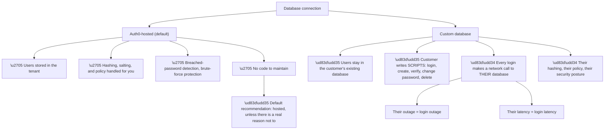
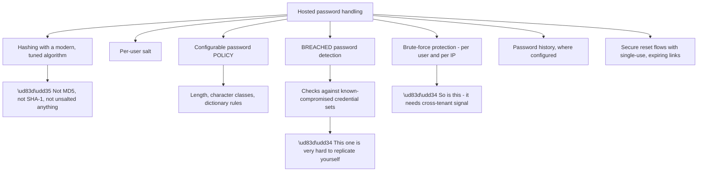
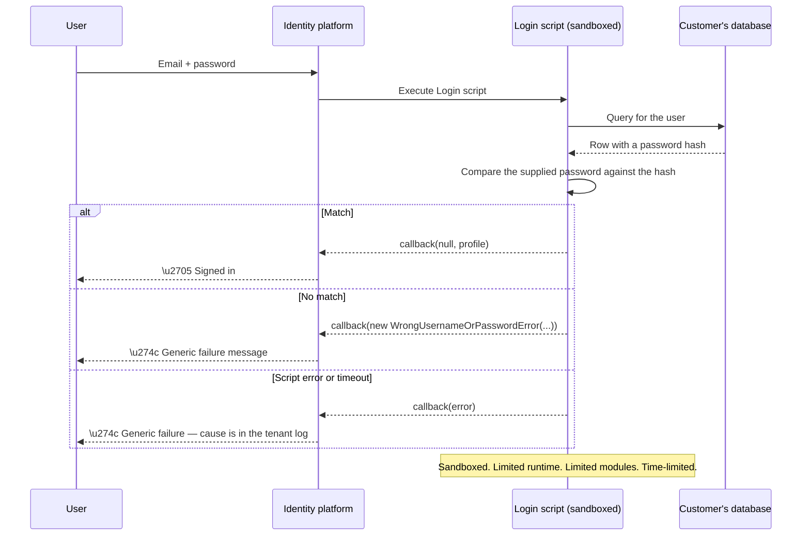
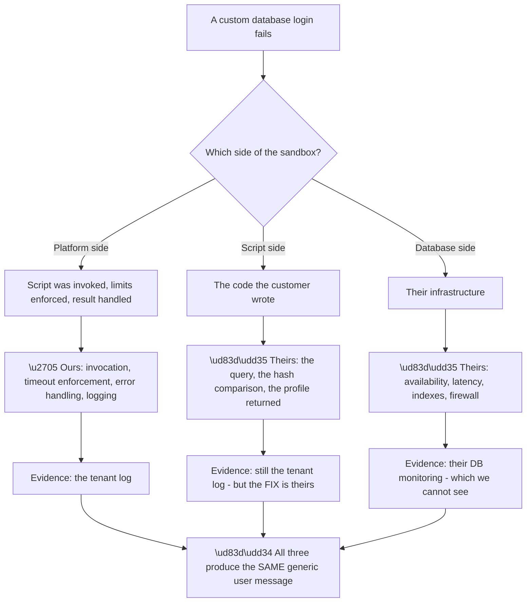
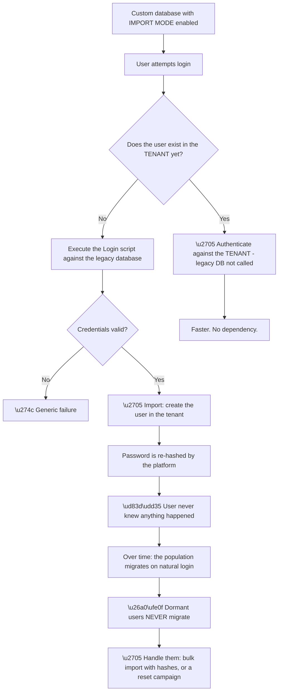
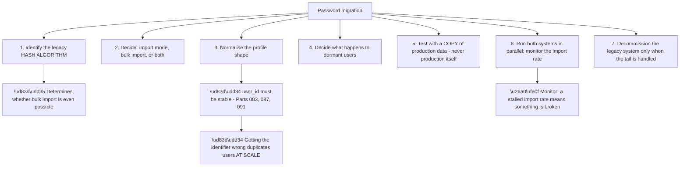
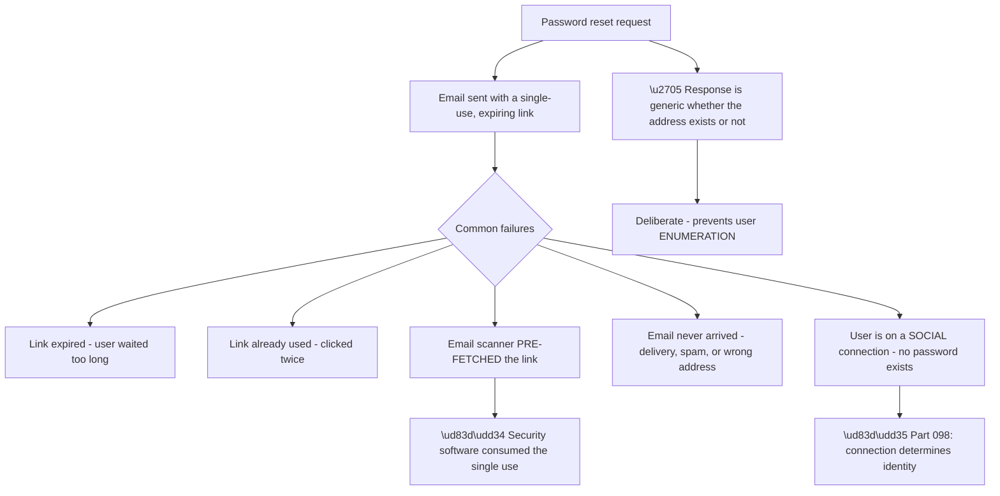
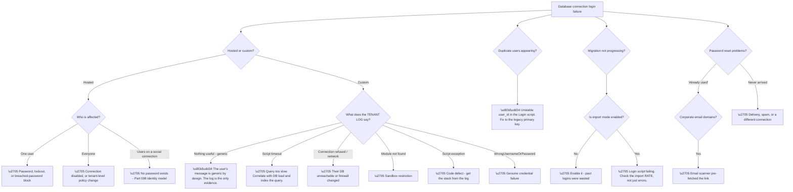

# Part 099 - Database Connections, Custom Scripts, and Password Migration

> Section goal: Understand where passwords actually live, how to move users from a legacy system without forcing everyone to reset, and what the custom database script model can and cannot do.

Covers index item **099**. Maps to JD signals: *Auth0*, *authentication and authorization*, *password security*, *JavaScript*, *SQL*, *migration*, *troubleshooting complex technical issues*.

---

## 1. Start From Zero: Two Kinds of Database Connection

A database connection stores username-and-password identities. **There are two fundamentally different arrangements**, and confusing them is the source of most tickets in this area.

| Arrangement | Where credentials live | Who validates the password |
|---|---|---|
| **Auth0-hosted database** | In the tenant's user store | The platform |
| **Custom database** | In the **customer's own** database | **Their code**, running as a script |

**Node C3 is the fact that changes the support model completely.** With a custom database, **every single login is a synchronous call into the customer's infrastructure.** Their database being slow makes login slow. Their database being down makes login impossible. **The identity platform is healthy and the login is failing**, which is a genuinely confusing position for a customer to be in.

**The legitimate reasons for a custom database** are real but narrower than customers often assume:

| Reason | Valid? |
|---|---|
| Legacy system must remain the source of truth | ✅ Genuinely |
| Regulatory requirement to hold credentials in a specific place | ✅ Genuinely |
| Other systems authenticate against the same store | ✅ Often |
| "We want to keep control" | ⚠️ Usually solvable another way |
| "We haven't migrated yet" | ⚠️ **Import-mode migration is better** (§3) |

**Row five is the important redirect.** A customer choosing a custom database purely because they have not migrated is choosing a permanent architecture for a temporary reason. **Import mode migrates them gradually and then removes the dependency entirely**, which is almost always the better answer.

> 💡 **Tie-in to your background:** you have SQL and PostgreSQL experience and you write JavaScript. **Custom database scripts are exactly that combination** — JavaScript that queries a database and returns a normalised profile. This is one of the few places in the platform where your specific technical stack maps one-to-one.

### 🔍 Plain-English deep-dive: what the platform does for you on password security

The hosted option handles a set of things that are easy to underestimate and genuinely hard to get right.

**Nodes R and R2 identify the two capabilities a customer genuinely cannot rebuild.**

**Breached-password detection** requires access to large, current sets of known-compromised credentials and the operational discipline to keep them updated. **A single company cannot practically maintain that**, and it is one of the highest-value protections in modern authentication — because credential stuffing (Part 108) depends entirely on reused passwords.

**Effective brute-force protection needs signal beyond one tenant.** An attacker spreading attempts across many targets is invisible to any single one of them. **A platform seeing traffic across many tenants can detect patterns no individual customer can.**

| Protection | Custom database keeps it? |
|---|---|
| Password hashing | ⚠️ Whatever the customer implemented |
| Password policy | ⚠️ Theirs to enforce |
| **Breached-password detection** | ❌ **Lost** |
| Brute-force protection | ⚠️ Partial — platform-side attempts only |
| Secure reset flows | ⚠️ Depends on their scripts |
| Bot detection | ✅ Still applies at the platform edge |

**The third row is the security cost worth stating explicitly** when a customer proposes a custom database. **They are trading away a protection they cannot rebuild**, and that deserves to be a conscious decision rather than a side effect of an architecture choice.

**Analogy:** a bank that handles vault security for you, including intelligence about which safe-cracking techniques are currently circulating. Running your own vault is possible, and you will not have the intelligence feed. **Where it stops:** you could subscribe to a security service. Breach corpora at useful scale and freshness are not something most organisations can practically maintain.

---

## 2. Custom Database Scripts

When a customer runs a custom database, they implement a set of JavaScript functions the platform calls at defined moments.

| Script | Called when | Must return |
|---|---|---|
| **Login** | A user attempts to sign in | A normalised profile, or an error |
| **Create** | A new user signs up | Success, or an error |
| **Verify** | Email verification completes | Success |
| **Change Password** | Password reset or change | Success |
| **Get User** | Lookup by email — reset, duplicate check | A profile, or nothing |
| **Delete** | A user is deleted | Success |

**The three-branch structure matters diagnostically**, because **two of the three produce the same user-visible message.** A wrong password and a script crash both show a generic failure — deliberately, so that errors do not leak information about which accounts exist.

**So the tenant log is the only way to distinguish them**, and this is the defining characteristic of custom database troubleshooting: **the user's report tells you nothing, and the log tells you everything.**

**The sandbox constraints** are the second source of tickets:

| Constraint | Consequence |
|---|---|
| **Execution time limit** | A slow database query fails the login |
| **Limited module set** | Not every npm package is available |
| **No persistent state** | Connections are not reliably reused |
| **No filesystem** | Certificates and files must be inline or fetched |
| **Network egress from the platform** | The customer's database must be reachable **and firewalled appropriately** |

**The time limit is the most common production surprise.** A query that runs in 50 ms in development against a small dataset may take seconds in production against millions of rows — **and the login simply fails.** The symptom is intermittent login failure correlated with database load, which looks like flakiness rather than a timeout.

**The network requirement in the last row is a security conversation.** The customer's database must accept connections from the platform, which means it is reachable from outside their network. **Restricting that to the platform's published IP ranges is essential**, and it is worth confirming rather than assuming.

**The most important script-writing rule** is one of error discipline: **return `WrongUsernameOrPasswordError` for authentication failures and a generic error for everything else.** Returning a distinguishable error for "user not found" versus "wrong password" creates a **user enumeration** vulnerability — an attacker can determine which email addresses are registered.

### 🔍 Plain-English deep-dive: the script sandbox is a support boundary, not just a technical one

The sandbox constrains what the customer's code can do. **It also draws a line through the middle of the ticket**, and being clear about which side a problem sits on is most of the diagnosis.

**Node R is why this connection type generates disproportionate support effort.** Three different owners, three different fixes, **one indistinguishable symptom.** The customer experiences "login is broken" and has no way to tell whether the cause is in the platform, in their code, or in their database.

| Log signal | Side | Who fixes it |
|---|---|---|
| Script exception with a stack trace | Script | Customer's developers |
| Execution timeout | Script or database | Customer — query or infrastructure |
| Connection refused / network error | Database | Customer's infrastructure team |
| Module not found | Script | Customer, within sandbox limits |
| `WrongUsernameOrPassword` | Neither | Genuine credential failure |
| No log entry at all | **Platform or routing** | Investigate our side |

**The last row is the one that changes the direction of the investigation entirely.** If the tenant log shows no invocation, **the script was never called** — which means the problem is upstream of it: the connection is not enabled for that application (Part 098), the request never arrived, or the user is on a different connection.

**The communication implication matters as much as the diagnosis.** Telling a customer "your script timed out" without evidence sounds like deflection. **Quoting the log entry, the timestamp, and the elapsed time makes it a shared fact** — which is the Part 095 four-element structure applied to a case where the fault is in code the customer wrote.

**And there is a proactive move worth making early:** ask them to add their own logging inside the script, within the sandbox's constraints. **A script that reports its own query duration turns an opaque timeout into a measured one**, and it is the customer's fastest route to self-diagnosis on the next occurrence.

**Analogy:** a kitchen where the restaurant supplies the recipe and the ingredients, and the venue supplies the oven and the timer. A burnt dish could be the recipe, the ingredients, or the oven — and the diner only knows it tasted wrong. **Where it stops:** a chef can taste as they go. A sandboxed script gets one attempt and a generic failure message.

---

## 3. Password Migration Without a Reset

The best reason to touch a custom database is often to **stop needing one.** Import mode migrates users gradually and invisibly.

**Node I2 is why this is the recommended approach.** The user types their existing password and signs in normally. **No reset email, no forced change, no support tickets, no conversion loss.** From their side nothing happened.

**Node P2 is the part that must be planned for.** Users who never log in never migrate — and after the legacy system is decommissioned, **they cannot log in at all.** Three options exist:

| Option | Detail |
|---|---|
| **Bulk import with hashes** | If the legacy hashing algorithm is supported, import the hashes directly |
| **Reset campaign** | Email dormant users asking them to set a new password |
| **Keep the legacy system longer** | Delays the problem; sometimes appropriate |

**The first option is the best where possible**, and it depends entirely on the legacy hashing algorithm. **Common formats such as bcrypt are typically importable**; proprietary or unusual schemes may not be. **Establishing which algorithm the legacy system uses is therefore an early, high-value question** in any migration conversation.

**And there is a sequencing point that matters:** import mode must be enabled **from the start** of the migration. **Users who log in while it is off are authenticated against the legacy system and not imported** — so those logins are wasted migration opportunities that will never recur.

### 🔍 Plain-English deep-dive: the migration checklist, and where migrations go wrong

Password migration is one of the highest-risk operations a customer performs, because failure is user-visible and reputationally costly.

**Node W1 is the failure that is hardest to undo.** The profile returned by the Login script includes a `user_id` that becomes the imported user's identifier. **If it is unstable — derived from an email address, or regenerated per call — the same person imports as multiple users**, and each one accumulates separate data.

**This is the same lesson as SAML NameID (Part 083), directory DNs (Part 087), and Entra `upn` (Part 091)** — a pattern recurring for the fourth time. **The identifier must be the legacy system's own immutable primary key.**

| Identifier choice | Outcome |
|---|---|
| Legacy primary key | ✅ Correct |
| Email address | ❌ Changes; reassignable |
| Username | ❌ Changes |
| A hash of the row | ❌ Changes when any field changes |
| Generated per call | ❌ **Duplicates on every login** |

**Node S5 is a rule worth stating firmly.** Testing a migration against production data risks importing, altering, or duplicating real users. **A copy — or better, synthetic data with the same shape — is the only safe test environment**, and this is the kind of advice a support engineer should give unprompted.

**Node W2 is the operational monitoring point.** During a migration, the import rate should track the natural login rate. **A rate that drops to zero means the Login script is failing** — and because failures are generic to the user, the only signal is the log and the rate itself. **Nobody will report it**, which is the Part 094 silent-failure pattern in a new setting.

**And the final step deserves emphasis:** the legacy system cannot be decommissioned until the dormant tail is handled. **Decommissioning early converts dormant users into permanently locked-out users**, which surfaces months later as a slow trickle of unrecoverable accounts.

**Analogy:** moving house gradually by taking things with you each time you visit. Everything you use regularly comes across naturally; the things in the loft never do — and once the old house is sold, they are gone. **Where it stops:** you could go back for the loft. A decommissioned credential store cannot be re-consulted.

---

## 4. Password Policy, Resets, and Related Behaviour

Several behaviours around database connections generate predictable tickets.

**Node P2d is a genuinely common and genuinely surprising cause.** Corporate email security products fetch links in incoming mail to check them for malware. **A single-use link is consumed by that fetch**, so when the user clicks it, it has already been used.

**The signature is distinctive:** it affects **corporate email domains** and not consumer ones, and the user insists they clicked it only once — **which is true.** Mitigations include allowing a small number of uses, or requiring an additional interaction on the landing page rather than acting on the GET.

**Node P2f is the one support handles most often.** A user who signed up with Google has no password on that identity, so a password reset is meaningless. **The reset flow may still appear to work** — a generic response is returned to prevent enumeration — and the email either never arrives or resets a different account entirely (Part 098's two-identity model).

**Node P3a is worth understanding rather than merely following.** The reset response is deliberately identical whether the address exists or not, because a distinguishable response lets an attacker **enumerate registered users**. **The same principle governs the Login script's error handling** in §2, and it explains a piece of behaviour that otherwise looks like an unhelpful product decision.

**Password policy changes** have one non-obvious property worth knowing: **strengthening the policy does not invalidate existing passwords.** Users with weaker passwords keep them until they next change. **A customer expecting immediate compliance across their user base needs a forced-reset campaign**, and expecting policy alone to achieve it is a common misunderstanding.

---

## 5. Failure Modes

| # | Failure mode | Symptom | Root cause | First check |
|---|---|---|---|---|
| 1 | Script timeout | Intermittent login failure under load | Execution time limit | Correlate with DB load |
| 2 | Customer DB unreachable | All logins fail | Network, firewall, or outage | Is their DB up and reachable? |
| 3 | Unsupported module | Script fails at runtime | Sandbox restriction | Tenant log error |
| 4 | Wrong error type returned | User enumeration risk | Distinguishable errors | Does it return `WrongUsernameOrPasswordError`? |
| 5 | Unstable `user_id` | Duplicate users multiply | Identifier derived, not primary key | What does the script return? |
| 6 | Import mode enabled late | Logins wasted, no import | Sequencing | When was it enabled? |
| 7 | Import rate stalls | Migration silently stops | Login script failing | Monitor the rate |
| 8 | Dormant users unmigrated | Locked out after decommission | Never logged in | Was the tail handled? |
| 9 | Hash algorithm unsupported | Bulk import impossible | Legacy format | Which algorithm? |
| 10 | Reset link pre-fetched | "Already used" for corporate users | Email security scanner | Which email domains? |
| 11 | Reset for a social user | No password to reset | Wrong connection | Which connection? |
| 12 | Policy change expectation | Weak passwords persist | Policy applies at change time | Is a reset campaign needed? |
| 13 | Breached-password detection lost | Weaker security posture | Custom database | Was the trade-off explicit? |
| 14 | Tested against production | Real users altered | No copy used | **Stop and use a copy** |

---

## 6. Troubleshooting Decision Tree: Database Connection Failures

### Worked example

A customer with a custom database reports that logins fail "sometimes, for random users, maybe five percent." It has been happening for a fortnight.

**Node B: custom database.** Node D: the tenant log shows **script timeout** errors on the failing attempts.

**So the cause is established quickly** — but "five percent, random users" needs explaining, because a timeout suggests something systematic.

**Correlating the failures with time** shows they cluster. **Not randomly — in bursts**, matching their database's nightly reporting job and their peak traffic hour.

**The Login script queries by email with no index on that column.** Against a small development dataset it was instant. **Against 4 million production rows under concurrent load, it exceeds the sandbox execution limit.**

**Nothing changed a fortnight ago in the identity configuration.** What changed was the **data volume** crossing a threshold where the unindexed query became slow enough to time out under load.

**The fix** is an index on the email column, which takes minutes and resolves it entirely.

**Two write-up points.** First, **"random users" was not random** — it was whoever happened to log in during a burst, which is why it looked arbitrary from the customer's side. **Correlating failures with time rather than with users found it.**

**Second, and more valuable:** this failure mode is inherent to the custom database architecture. **Their login availability is bounded by their database's performance**, permanently. The index fixes today; **migrating to import mode removes the dependency**, and that recommendation is worth more than the index.

**What made it findable:** distrusting "random." **A five percent failure rate is not random — it is a population or a time window**, and asking which one it is takes one query.

---

## 7. Lab: Build a Custom Database Connection and Migrate It Away

**Purpose.** Write real database scripts, experience the sandbox constraints, and run an import-mode migration end to end with fictional data.

**Prerequisites.**
- The free tenant from Part 097
- A small local database with **entirely fictional** users — SQLite, PostgreSQL, or similar
- A way for the platform to reach it, **or** a mock that simulates it
- **Never** use real user data, employer data, or a production database

**Steps.**

1. **Create a local database** with ten fictional users. **Hash the passwords with bcrypt** — do not store plaintext even in a lab.
2. **Create a custom database connection** and write the Login script. Query by email, compare the hash, return a normalised profile.
3. **Use the legacy primary key as `user_id`.** Write down why, in your own words.
4. **Test a successful login and a failed one.** **Confirm the user sees the same generic message** in the failure case.
5. **Read the tenant log for both.** **Confirm the log distinguishes them** — this is the key observation.
6. **Break the script deliberately:** reference an undefined variable. Log in. **Confirm the user message is still generic** and the log shows the exception.
7. **Simulate a timeout:** add an artificial delay exceeding the sandbox limit. **Record the error and the user experience.**
8. **Introduce an unstable identifier:** return a generated `user_id`. Log in twice. **Confirm two users are created.** Then revert.
9. **Enable import mode.** Log in as a user who has not yet been imported. **Confirm they now exist in the tenant.**
10. **Log in again and check the log.** **Confirm the Login script was not called the second time.**
11. **Count how many of your ten users migrated** after logging in as five of them. **Write the dormant-user plan** for the remaining five.
12. **Write a customer-facing migration checklist** based on §3.

**Expected evidence.**
- Working Login script with the legacy primary key as `user_id`
- Log entries distinguishing a wrong password, an exception, and a timeout
- Two duplicate users from the unstable-identifier test, then reverted
- Evidence of an import-mode migration and the second login bypassing the script
- A dormant-user plan and a migration checklist in your own words

**Validation rubric.**

| Criterion | Pass |
|---|---|
| Two arrangements | You can explain hosted versus custom and the availability consequence |
| Script model | You can name the scripts and the sandbox constraints |
| Error discipline | You can explain why errors are generic and what enumeration is |
| Identifier | You can explain the stable-`user_id` rule and connect it to Parts 083/087/091 |
| Import mode | You can explain the mechanism and the dormant tail |
| Diagnosis | You can explain why the tenant log is the only evidence |
| Safety | Fictional data only, bcrypt even in a lab, everything deleted |

**Cleanup and privacy.** Delete the connection, the tenant users, and the local database. **Never point a custom database connection at real user data** — not production, not a copy of production containing real people. **Use invented users only.** If a lab database must be reachable from the internet, **restrict it to the platform's IP ranges and delete it immediately afterwards.**

---

## 8. JD Mapping

| JD signal | How this Part addresses it |
|---|---|
| Auth0 product knowledge | Database connections, scripts, import mode |
| Authentication and authorization | Password validation and policy |
| Password security | Hashing, breached-password detection, enumeration |
| JavaScript | The custom script model |
| SQL / PostgreSQL | Query performance and indexing in the login path |
| Migration | Import mode, bulk import, dormant users |
| Troubleshooting complex technical issues | Fourteen failure modes and a log-first decision tree |

---

## 9. Candidate Honesty Note

- **Production experience:** SQL and PostgreSQL, including query behaviour and performance; JavaScript.
- **Production experience:** diagnosing intermittent failures by correlating with time and load rather than accepting "random."
- **Lab experience:** writing Login scripts, reproducing timeout and exception failures, and running an import-mode migration, as above.
- **Learned architecture:** breached-password detection, enumeration resistance, and bulk-import hash compatibility.
- **No direct experience:** running a production password migration or supporting a live custom database connection.
- **How to say it:** *"This is the part of the platform closest to my existing stack — the scripts are JavaScript querying a database, which I'm comfortable with. I've built one in a lab, deliberately broken it to see how failures surface, and run an import-mode migration. I haven't done a production migration, and I'd treat that as high-risk work needing careful planning rather than something to improvise."*

---

## 10. Official Source Anchors

| Source | Why | Accessed |
|---|---|---|
| Auth0 Docs — Database connections | Hosted versus custom | Accessed **26 August 2026** |
| Auth0 Docs — Custom database action scripts | Script contracts and error types | Accessed **26 August 2026** |
| Auth0 Docs — Configure automatic migration (import mode) | The migration mechanism | Accessed **26 August 2026** |
| Auth0 Docs — Bulk user import and supported hash algorithms | The dormant-user path | Accessed **26 August 2026** |
| Auth0 Docs — Password policies and breached password detection | Hosted protections | Accessed **26 August 2026** |
| OWASP — Authentication Cheat Sheet | Enumeration resistance and password storage | Accessed **26 August 2026** |

> **Revalidate:** sandbox constraints, supported modules, execution limits, and supported hash algorithms change. Re-check the Auth0 documentation before interview; do not quote specific limits from memory.

---

## ⭐ Likely Interview Questions for This Section

### Q1. "What's the difference between a hosted and a custom database connection?"

> *Model answer:* With a hosted database, users live in the tenant and the platform handles hashing, password policy, breached-password detection, and brute-force protection. With a custom database, users stay in the customer's own store and the customer writes JavaScript scripts that the platform executes to validate credentials. The critical consequence is that every login becomes a synchronous call into the customer's infrastructure, so their database's availability and latency become the login's availability and latency. That produces a genuinely confusing support position where the identity platform is completely healthy and logins are failing. I would default to recommending hosted unless there is a real reason — a legacy system that must stay authoritative, or a regulatory constraint.

### Q2. "A customer wants a custom database because they haven't migrated yet. What do you say?"

> *Model answer:* That they are choosing a permanent architecture for a temporary reason, and that import mode is almost certainly what they actually want. With import mode, the custom database is used only until each user's first successful login, at which point the platform creates them locally and re-hashes their password. The user types their existing password and signs in normally — no reset email, no forced change, no conversion loss, and they never know anything happened. Over time the population migrates on natural login and the legacy dependency disappears. The part to plan for is dormant users who never log in and therefore never migrate, which needs either a bulk import of their hashes or a reset campaign before the legacy system is decommissioned.

### Q3. "Why do custom database scripts return generic errors?"

> *Model answer:* To prevent user enumeration. If the script returned a distinguishable error for "no such user" versus "wrong password," an attacker could determine which email addresses are registered simply by attempting logins — which is valuable for targeted phishing and for credential stuffing. So the convention is to return `WrongUsernameOrPasswordError` for any authentication failure and a generic error for anything else. The same reasoning governs password reset responses, which are identical whether the address exists or not. The diagnostic consequence is that the user-visible message tells you nothing, so the tenant log is the only evidence — a wrong password, a script exception, and a timeout all look identical to the user and are clearly distinguished in the log.

### Q4. "What should a Login script return as the user identifier, and why does it matter?"

> *Model answer:* The legacy system's own immutable primary key. Nothing derived — not the email address, not the username, and definitely not something generated per call. If the identifier is unstable, the same person is imported as multiple users and each one accumulates separate data, which is very hard to unpick after the fact. A generated identifier is the worst case because it duplicates on every single login. This is the same lesson as SAML NameID, directory distinguished names, and Entra's UPN — the same identifier mistake recurring in a fourth technology, which is why I now treat "what does this key on?" as a standard question rather than a specific one.

### Q5. "A customer reports login failures for 'random users, about five percent.' How do you approach it?"

> *Model answer:* By distrusting the word random, because a consistent five percent failure rate almost never is. It is either a population — some attribute those users share — or a time window. So I would correlate the failures against time first, which takes one query. In a case I worked through, the failures clustered into bursts matching a nightly reporting job and the peak traffic hour, and the cause was a Login script querying by email with no index on that column. Instant against a small development dataset, slow enough to hit the sandbox execution limit against millions of rows under concurrent load. The users looked random because it was whoever happened to log in during a burst. The index fixed it, but the more valuable recommendation was import mode, because their login availability being bounded by their database's performance is inherent to that architecture.

### Q6. "What security capability does a customer lose with a custom database?"

> *Model answer:* Breached-password detection, primarily — and it is the one they genuinely cannot rebuild. It requires access to large, current sets of known-compromised credentials and the discipline to keep them fresh, which no single organisation can practically maintain. It matters because credential stuffing depends entirely on password reuse, so it is one of the highest-value protections in modern authentication. They also lose some of the brute-force protection, because effective detection needs signal across many tenants — an attacker spreading attempts thinly is invisible to any single target. Password hashing and policy are not lost exactly, but they become the customer's responsibility and quality. I would make sure that trade-off is an explicit decision rather than a side effect.

### Q7. "Users say their password reset link says 'already used' but they only clicked once. Explain."

> *Model answer:* Their email security product almost certainly pre-fetched it. Corporate mail scanners fetch links in incoming messages to check them for malware, and a single-use link is consumed by that fetch — so by the time the user clicks, it has genuinely already been used. The signature is that it affects corporate email domains and not consumer ones, and the users are telling the truth. Mitigations are to allow a small number of uses on the link, or to make the landing page require an additional interaction rather than acting on the initial GET. I would also check whether the affected users are actually on a social connection, in which case there is no password to reset at all and the reset flow is meaningless for them.

### Q8. "A customer strengthened their password policy but weak passwords still work. Is that a bug?"

> *Model answer:* No — policy is enforced at the point a password is set, not retroactively against stored hashes. The platform holds hashes, not passwords, so it cannot evaluate an existing password against a new policy even in principle. Users keep their current password until they next change it. If the customer needs immediate compliance across their user base, that requires a forced reset campaign, and I would talk through the cost of that honestly, because forcing a reset on an entire consumer population has real support and conversion consequences. An alternative worth raising is enabling breached-password detection, which blocks known-compromised credentials at login without forcing everyone to change.

---

## 🧠 30-Second Memory Hooks

- **Hosted vs custom: custom makes every login a call into the customer's database.**
- **Their database's availability = their login availability.**
- **Custom loses breached-password detection** — the one thing they cannot rebuild.
- **Scripts: Login, Create, Verify, Change Password, Get User, Delete.**
- **Sandbox: time limit, limited modules, no filesystem, no persistent state.**
- **Errors are generic on purpose** — enumeration resistance.
- **The tenant log is the only evidence.** The user's message tells you nothing.
- **`user_id` must be the legacy primary key.** Fourth time this lesson appears.
- **Import mode migrates on natural login. The user never knows.**
- **Dormant users never migrate.** Plan the tail before decommissioning.
- **Enable import mode from day one** — logins before that are wasted.
- **"Already used" reset link + corporate email = scanner pre-fetch.**
- **Policy applies at change time, not retroactively.**
- **"Random five percent" is a time window or a population. Never random.**

---

## ✅ Completion Checklist

- [ ] I can explain hosted versus custom and the availability consequence
- [ ] I can name the scripts and the sandbox constraints
- [ ] I can explain why errors are generic and what enumeration is
- [ ] I can state the stable-identifier rule and connect it to three earlier Parts
- [ ] I can explain import mode and the dormant-user problem
- [ ] I can explain what security capability a custom database gives up
- [ ] I can diagnose a script timeout from an intermittent failure pattern
- [ ] I can explain the pre-fetched reset link signature
- [ ] I can explain why policy changes are not retroactive
- [ ] I have completed the lab, including the duplicate-user demonstration
- [ ] I can state honestly what I have built and what I have not run in production

*Next suggested section:* **[Part 100 - Social Connections and Consumer Federation](Part-100-social-connections-and-consumer-federation.md)** — the connection type consumers actually use most, the developer-keys trap, and what happens when a social provider changes the rules.
