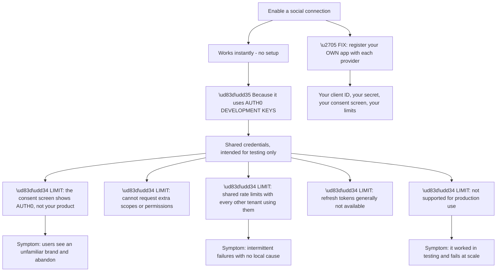
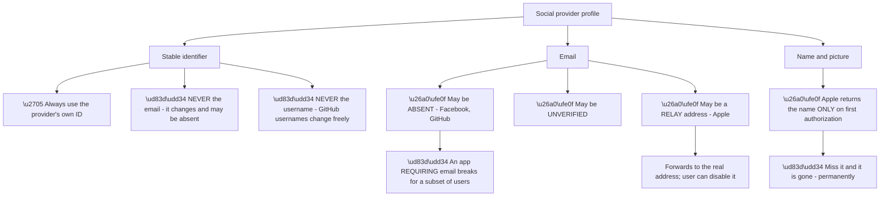
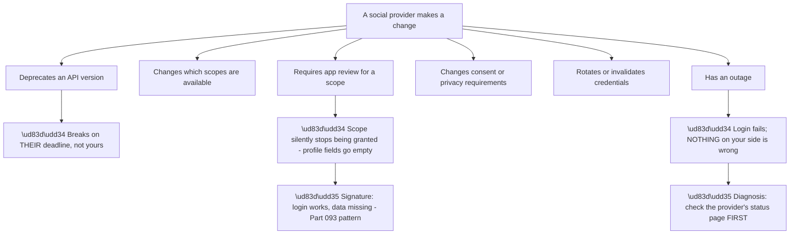
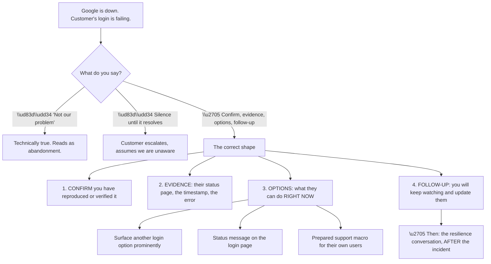
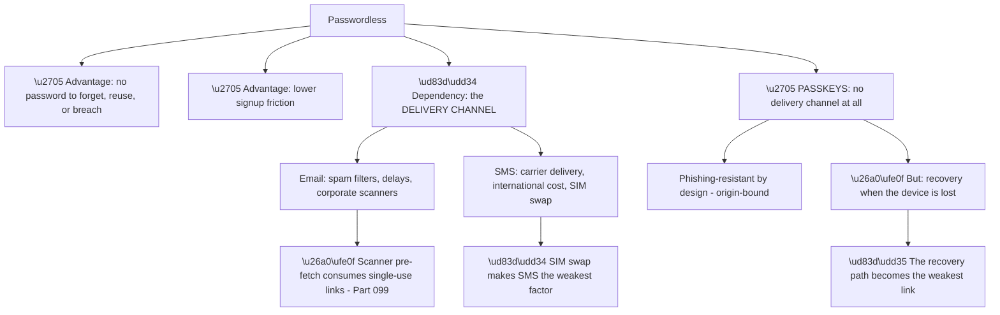
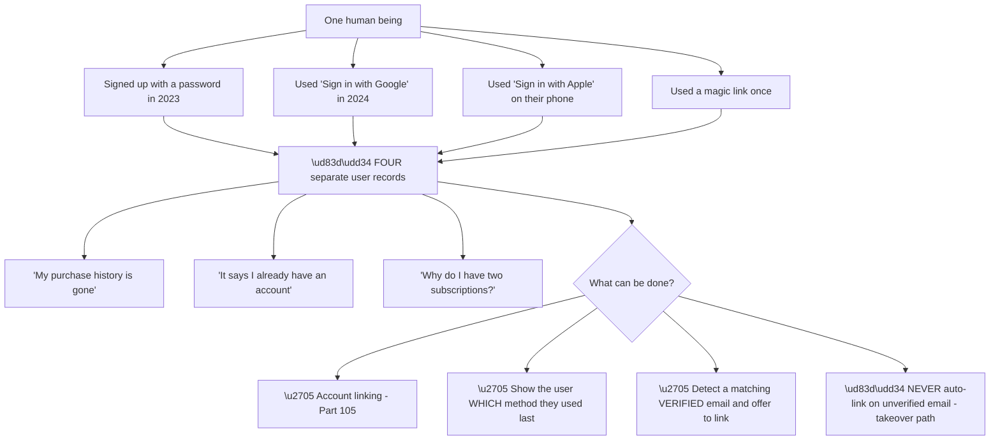
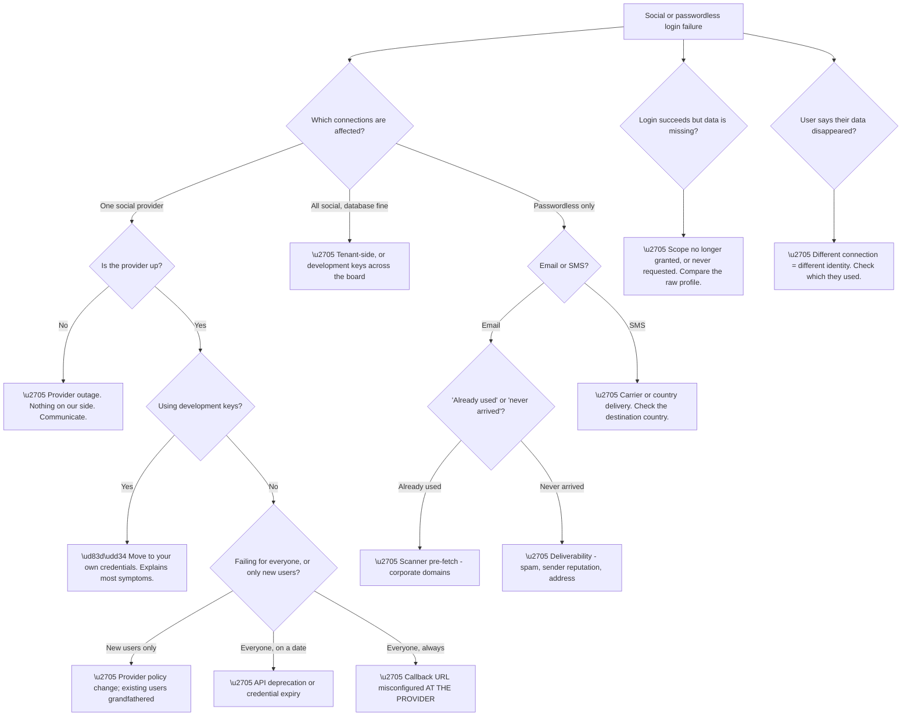

# Part 100 - Social Connections and Consumer Federation

> Section goal: Understand the connection type consumers actually use most — social login — including the development-keys trap that breaks in production, what each provider does differently, and why passwordless belongs in the same conversation.

Covers index item **100**. Maps to JD signals: *Auth0*, *OAuth 2.0 and OIDC*, *customer identity*, *third-party integration*, *troubleshooting complex technical issues*, *customer-facing communication*.

---

## 1. Start From Zero: What a Social Connection Really Is

A social connection is **an OAuth 2.0 / OIDC flow to another provider**, wrapped so the application never sees it. Everything from Parts 056–078 applies — it is just happening one layer upstream.

```mermaid
sequenceDiagram
    participant U as User
    participant A as Customer's application
    participant T as Tenant (authorization server)
    participant G as Google (upstream IdP)

    U->>A: "Sign in with Google"
    A->>T: OIDC authorization request, connection=google
    T->>G: OAuth/OIDC request — with the TENANT's client credentials
    G->>U: Google's consent and sign-in screen
    U->>G: Authenticate and consent
    G-->>T: Code, exchanged for Google's tokens
    T->>T: Read the profile; normalise into a user
    T-->>A: ID token — standard OIDC claims
    Note over A: The application never speaks Google's protocol
```

**The normalisation step is the value.** Google, Facebook, GitHub, and Apple all return different profile shapes. **The platform maps them into one consistent user object**, so the application's code does not branch per provider.

| What differs upstream | What the application sees |
|---|---|
| Google's `sub`, `email`, `picture` | A normalised profile |
| Facebook's numeric ID and graph fields | The same shape |
| GitHub's `login` and `id` | The same shape |
| Apple's private relay email and one-time name | The same shape — **with caveats** |

**The caveat in the last row is Part 4's subject**, and it is the most operationally significant provider difference in the whole category.

**Two facts about the identity model** carry forward from Part 098 and matter more here than anywhere else:

**Each social provider is a separate connection**, so **the same person via Google and via Facebook is two users.** With a database connection this is occasionally confusing; with social connections it is constant, because consumers genuinely do not remember which button they pressed last time.

**The upstream provider owns the credential**, so their outage is your outage and their policy change is your problem — which §3 covers.

> 💡 **Tie-in to your background:** you have supported Microsoft 365 and Copilot, which are products where "sign in with" flows to an upstream identity provider are routine. **The shape of the problem — a third party you do not control sitting in the critical path — is familiar**, even if the specific providers are different.

### 🔍 Plain-English deep-dive: development keys, and the outage they schedule for you

Social connections work immediately after being switched on, with no configuration. **That convenience is the single most common cause of a social-login production incident.**



**Node L1 is the conversion problem.** A user clicking "Sign in with Google" on *your* product and being shown a consent screen naming a company they have never heard of **looks like a phishing attempt**. Many will abandon, and they will not tell you why (Part 096).

**Node L3 is the intermittent-failure problem**, and it is genuinely hard to diagnose from the inside: rate limits are shared across every tenant using the development keys, so **failures correlate with other people's traffic.** Nothing in the customer's own metrics explains it.

**The recognisable ticket shape:** *"social login works in staging and fails intermittently in production"* — or *"it worked fine and then started failing as we grew."* **Development keys should be the first check on any social connection issue**, because the symptom set is broad and the check takes seconds.

| Development keys | Own credentials |
|---|---|
| Instant setup | Registration per provider |
| Vendor branding on consent | **Your branding** |
| Default scopes only | **Any scope you need** |
| Shared rate limits | **Your own limits** |
| Refresh tokens limited | **Available** |
| **Testing only** | **Production-ready** |

**The advice to give at onboarding** is unambiguous: **register your own application with every social provider before launch.** It takes an hour per provider and it removes an entire category of production incident.

**Analogy:** using a shared demonstration account to try a service. It works, it proves the concept, and it has someone else's name on it and someone else's usage limits. **Where it stops:** a demo account usually announces itself. Development keys work so smoothly that customers reach production without realising they are still on them.

---

## 2. What Social Providers Actually Give You

Providers differ in what they return, what they guarantee, and what they let you request — and those differences drive real behaviour.

| Provider | Identifier | Email | Notable behaviour |
|---|---|---|---|
| **Google** | `sub` — stable | Usually present, verified | Well-behaved; good OIDC support |
| **Facebook** | App-scoped user ID | **May be absent** | ID differs per app; email not guaranteed |
| **GitHub** | Numeric `id` | **May be private** | Username changes; `id` does not |
| **Apple** | `sub` — stable | **Often a private relay address** | **Name returned only once** |
| **Microsoft** | `oid` / `sub` | Usually present | Personal vs work accounts differ (Part 090) |
| **LinkedIn** | `sub` | Usually present | Scope availability changes over time |



**Node N2 is the Apple behaviour that produces the most surprising ticket.** Apple returns the user's name **only on the very first authorization**, and only if the user chose to share it. **A bug or an error on that first attempt loses it permanently** — subsequent sign-ins return no name at all, and there is no way to ask again short of the user revoking access and re-authorizing.

**The symptom:** a subset of Apple users with blank names, no pattern, and no way to recover it from the provider. **The application must capture and persist it on first sight**, and this is worth flagging proactively to any customer enabling Apple.

**Node R is the design consequence that spans all providers.** An application treating email as a required field **breaks for real users** — Facebook may not return one, GitHub users may have theirs private, and Apple users may have a relay address they later disable.

**The robust design** treats email as optional at signup and prompts for it separately when it is genuinely needed. **That is a product decision, not a configuration one**, and it is the kind of architecture guidance this role involves (Part 096, ticket type two).

**Apple's private relay** deserves its own note. The address is real and forwards to the user's actual mailbox, but **the user can disable forwarding at any time** — at which point transactional email silently stops reaching them. **The signature is a cohort of Apple users who stop responding to email while their accounts remain active**, which almost nobody connects to relay addresses without prompting.

---

## 3. When the Provider Changes the Rules

The defining characteristic of social connections is that **a third party controls something in your critical path**, and they change it on their schedule.



**Node D is a habit worth building.** When a single social connection fails while others work, **the provider's status page is the fastest check available** and requires nothing from the customer. It either explains everything or eliminates a whole hypothesis in seconds.

**Node S2 is the subtler failure and the one that connects to earlier material.** When a provider restricts a scope — often requiring review or verification for access to it — **the scope simply stops being granted.** Login continues to work; the data stops arriving.

**That is the Part 093 signature exactly: successful authentication, missing data.** And it is worth recognising that the same shape appears across enterprise connections, social connections, and directory attributes — **three different technologies, one diagnostic pattern.**

| Symptom | Provider-side cause |
|---|---|
| One provider fails, others fine | Outage or credential problem |
| All social fails, database fine | Tenant-side or development keys |
| Login works, fields empty | **Scope no longer granted** |
| Failing only for new users | New app review requirements |
| Failing on a specific date | API version deprecation |
| Failing for some regions | Provider regional policy |

**Row four is a distinctive and under-recognised pattern.** Some providers apply new restrictions to newly-authorized users while existing authorizations continue under previous terms. **The result is that existing users are unaffected and new signups fail** — which looks like a signup bug and is actually a provider policy change.

**The practical resilience advice** for customers: **offer more than one way in.** A product with only Facebook login is entirely dependent on Facebook's decisions. **Multiple connections — including a database or passwordless option — mean a provider change degrades rather than blocks.**

### 🔍 Plain-English deep-dive: communicating a failure you did not cause and cannot fix

Provider outages and policy changes put support in an unusual position: **the diagnosis is fast, and the fix is not available to anyone in the conversation.**



**Node G3 is what separates useful support from accurate support.** The customer already suspects Google is down. **What they cannot easily produce under pressure is a list of things they can do in the next ten minutes**, and providing it is the entire value of the interaction.

| What they need | What it looks like |
|---|---|
| Certainty | "Confirmed — here is their status page and the timestamps matching your failures" |
| Immediate mitigation | "Surface your email login option more prominently while this lasts" |
| Something to tell users | A suggested message for their own status page |
| Reassurance | "We are monitoring and will update you when it clears" |
| A path forward | The resilience conversation — **later** |

**Node R's timing is deliberate and worth respecting.** "You should have had a fallback" is correct and completely unwelcome during an outage. **The resilience conversation belongs in the follow-up**, once service is restored, where it lands as a recommendation rather than as blame.

**And the same structure applies to a policy change**, which is the harder case because there is no status page to point at. **The evidence is then the provider's changelog or developer announcement**, and finding it is genuinely useful work — customers frequently do not know a change happened, and locating the announcement converts a mystery into a plan.

**One phrase worth avoiding entirely here:** "there's nothing we can do." **There is almost always something** — confirming the cause, providing mitigations, drafting a user message, and scheduling the resilience discussion are all real contributions. **The fix being unavailable does not make the support unavailable.**

**Analogy:** a travel agent when an airline cancels a flight. They did not cancel it and cannot un-cancel it, and the good ones are still worth calling — they confirm what happened, find the alternatives, and tell you what to expect. **Where it stops:** an agent can rebook you. A support engineer can only hand the customer the options; they have to act on them.

---

## 4. Passwordless Connections

Passwordless belongs here because it solves the same consumer problem — friction — by a different route, and it has its own distinct failure modes.

| Method | How it works | Main failure |
|---|---|---|
| **Email link** | A one-time link sent to the address | **Deliverability**, and link pre-fetching |
| **Email code** | A numeric code sent by email | Deliverability, code expiry |
| **SMS code** | A code sent by text | **Cost, delivery, and SIM-swap risk** |
| **Passkeys / WebAuthn** | Device-bound cryptographic credential | Device loss, recovery, browser support |



**Node P3 is the point that decides whether a passwordless deployment is actually secure.** Passkeys are phishing-resistant because the credential is bound to the origin and never leaves the device. **But every system needs a recovery path**, and if that path is "email us a code," **the security of the whole system is the security of email.**

**That is not an argument against passkeys** — it is an argument for designing recovery deliberately rather than defaulting to the weakest available channel. **It is exactly the kind of trade-off a developer might ask about**, and having a clear position on it is valuable.

**SMS deserves its specific caution.** SIM-swap attacks — where an attacker persuades a carrier to transfer a number — make SMS the weakest widely-deployed factor. **It is still better than nothing and still appropriate for some populations**, but recommending it as a primary factor without naming the risk is not honest advice.

**Email deliverability** is the most common operational passwordless problem, and it inherits the Part 099 pre-fetch issue: **corporate email scanners consume single-use links.** A passwordless email-link flow in a B2B context hits this constantly.

### 🔍 Plain-English deep-dive: the same person, four accounts — the consumer identity problem

Social connections make Part 098's separate-identity model into a daily, high-volume support reality.



**Node F4 is the security boundary**, and it is the fourth appearance of this reasoning (Parts 083, 093, 098). **Automatically linking accounts because two identities share an email address is an account-takeover vector** if either address is unverified: an attacker signs up at a provider with someone else's address and is silently merged into their account.

**Linking must be based on verified evidence or explicit user action.** Offering to link — *"an account already exists with this email; sign in with your password to connect them"* — is safe because it requires proving control of the original account.

**Node F2 is the cheapest and most effective mitigation**, and it is frequently overlooked. **Showing the user which method they used last time** — a subtle "you signed in with Google last time" hint — prevents most duplicate accounts before they are created. It costs almost nothing and removes a large share of these tickets.

| Mitigation | Cost | Effect |
|---|---|---|
| Show last-used method | Very low | **Prevents most duplicates** |
| Offer linking on verified match | Low | Fixes them when they happen |
| Account linking after the fact | Medium | Cleans up existing duplicates |
| Auto-link on unverified email | — | ❌ **Never** |
| Single connection only | High UX cost | Avoids the problem by removing choice |

**The support-facing point** is that these tickets are not user error. **A consumer choosing a different button three months later is behaving completely normally**, and the product's design determines whether that produces a duplicate account. **Framing it that way in a customer conversation moves it from "educate the users" to "here is a product change that removes the tickets."**

**Analogy:** a shop where paying by card, by phone, and by cash each creates a separate loyalty account. The customer has done nothing wrong and their points are scattered. **Where it stops:** a shop assistant could look them up by name. Software has no basis for assuming two identities are one person, and assuming it is exactly how accounts get stolen.

---

## 5. Failure Modes

| # | Failure mode | Symptom | Root cause | First check |
|---|---|---|---|---|
| 1 | Development keys in production | Vendor branding, intermittent failures | Shared test credentials | **Check this first** |
| 2 | Shared rate limits | Intermittent, uncorrelated failures | Development keys | Same as above |
| 3 | Provider outage | One connection fails | Third-party availability | Their status page |
| 4 | Scope no longer granted | Login works, fields empty | Provider policy change | Compare profile to expected |
| 5 | API version deprecated | Fails on a date | Provider deadline | Provider changelog |
| 6 | New app review required | **New users only** fail | Grandfathered existing users | Is it only new signups? |
| 7 | Email absent | Signup breaks for some | Provider does not guarantee it | Is email required? |
| 8 | Apple name lost | Blank names, unrecoverable | Returned only on first authorization | Was it persisted? |
| 9 | Apple relay disabled | Email silently stops reaching | User disabled forwarding | Apple users specifically? |
| 10 | Duplicate accounts | "My data is gone" | Separate identity per connection | Which connection did they use? |
| 11 | Auto-link on unverified email | Account takeover | Unsafe linking rule | Is verification required? |
| 12 | Passwordless link pre-fetched | "Already used" | Email security scanner | Corporate domains? |
| 13 | SMS not delivered | Cannot sign in | Carrier or country | Which country? |
| 14 | Passkey recovery weak | Security theatre | Recovery via email | What is the recovery path? |
| 15 | Callback URL at the provider | Provider-side redirect error | Provider config, not tenant | Provider's own settings |

---

## 6. Troubleshooting Decision Tree: Social and Passwordless



### Worked example

A customer reports that **new** users cannot complete signup with Facebook. Existing Facebook users sign in normally. It started about a week ago.

**Node B: one provider.** Node C: Facebook is up. Node D: they are using their own credentials, not development keys.

**Node E: new users only.** **That is the distinctive branch**, and it points at a provider policy change with existing authorizations grandfathered.

**Checking their Facebook app.** A permission their signup flow requests now requires **app review**, and their app has not been reviewed for it. **Users who authorized before the change retain the permission; new users are not granted it**, and the customer's signup code treats its absence as a fatal error.

**Two things are true simultaneously.** Facebook changed their rules, and the customer's code is brittle — **it requires a field the provider never guaranteed.**

**Three recommendations, in order:**

**Immediate:** make signup tolerate the missing field, so users can complete signup and be prompted separately if it is genuinely needed. **This unblocks today without depending on Facebook.**

**Short term:** submit the app for review if the permission is genuinely required.

**Longer term:** offer additional login options, so a single provider's policy change degrades the experience rather than blocking signup entirely.

**What made it findable:** the **new-users-only** population. **Nothing on the customer's side distinguishes new users from existing ones** — same code, same configuration, same connection — so a population split along that line points squarely at the provider, where grandfathering is standard practice.

**The write-up point:** *"it works for existing users and fails for new ones"* is a **provider-policy signature**, and it is worth recognising instantly because it eliminates the entire local configuration space.

---

## 7. Lab: Configure Real Social and Passwordless Connections

**Purpose.** Move off development keys deliberately, observe raw provider profiles, and experience the duplicate-identity problem first-hand.

**Prerequisites.**
- The free tenant from Part 097
- A **personal** Google account and a personal GitHub account
- A local test client (Part 059)
- **Never** use employer accounts, employer email domains, or a work tenant

**Steps.**

1. **Enable Google with development keys.** Sign in. **Record exactly what the consent screen says** — note whose name appears.
2. **Register your own Google OAuth application.** Configure the redirect URI the platform specifies.
3. **Switch the connection to your own credentials.** Sign in again. **Record how the consent screen changed.**
4. **Compare the two experiences in writing** — this is the conversion argument in concrete form.
5. **Enable GitHub** with your own credentials.
6. **Inspect the raw profile** the platform received from each provider. **List the fields and their exact names.** Note how different they are before normalisation.
7. **Make your GitHub email private** in GitHub's settings, then sign in again. **Confirm the email is now absent.** This is failure mode 7.
8. **Sign in with Google, then with GitHub, using the same email address.** **Confirm two separate users exist** with different IDs.
9. **Record what a user would experience** in that situation — write it as the user would describe it.
10. **Enable a passwordless email connection.** Request a link and observe the flow.
11. **Note the link's properties:** single use, expiry. **Write down why a pre-fetching scanner breaks it.**
12. **Write a customer-facing recommendation** covering: register your own credentials, treat email as optional, show the last-used method, and offer more than one option.

**Expected evidence.**
- Both consent screens documented, with the difference stated
- Raw profiles from two providers, field names listed
- Evidence of an absent email after making it private
- Two user records with the same email and different IDs
- A user's-eye description of the duplicate-account experience
- Your written customer recommendation

**Validation rubric.**

| Criterion | Pass |
|---|---|
| Development keys | You can name five limitations and the symptoms of each |
| Provider differences | You can name three concrete differences and their consequences |
| Apple behaviour | You can explain the one-time name and the relay address |
| Identity model | You can explain duplicates and why auto-linking is unsafe |
| Passwordless | You can explain the delivery dependency and the recovery weak link |
| Diagnosis | You can use the affected population to locate the cause |
| Safety | Personal accounts only, free tier, everything deleted |

**Cleanup and privacy.** Delete the connections, the test users, and the OAuth applications you registered at Google and GitHub. **Revoke the tenant's access from your personal account settings at each provider** — deleting the connection does not revoke the authorization. **Never use employer accounts or a work tenant**, and restore any provider privacy settings you changed.

---

## 8. JD Mapping

| JD signal | How this Part addresses it |
|---|---|
| Auth0 product knowledge | Social and passwordless connections in depth |
| OAuth 2.0 and OIDC | Upstream provider flows and normalisation |
| Customer identity | The consumer duplicate-identity problem |
| Third-party integration | Provider policy changes and outage handling |
| Troubleshooting complex technical issues | Fifteen failure modes and a population-first decision tree |
| Customer-facing communication | Reframing user error as product design |
| Security | Auto-linking as a takeover vector; SIM swap; passkey recovery |

---

## 9. Candidate Honesty Note

- **Production experience:** supporting products where third-party sign-in flows sit in the critical path, and diagnosing failures where the cause is outside the product.
- **Production experience:** using population splits to locate a cause.
- **Lab experience:** configuring real social connections with my own provider credentials, comparing raw profiles, and reproducing the duplicate-identity problem, as above.
- **Learned architecture:** provider-specific behaviours, passwordless delivery dependencies, and passkey recovery design.
- **No direct experience:** supporting production social connections at consumer scale, or managing a provider app review.
- **How to say it:** *"Social connections I've configured properly in a lab — including registering my own applications at Google and GitHub so I could see exactly what changes on the consent screen. The pattern I find most useful is that a third party controls part of the critical path, which is familiar from supporting products with upstream sign-in dependencies. I haven't supported this at consumer scale."*

---

## 10. Official Source Anchors

| Source | Why | Accessed |
|---|---|---|
| Auth0 Docs — Social identity providers | Connection setup and provider list | Accessed **26 August 2026** |
| Auth0 Docs — Test social connections with developer keys | The limitations, authoritatively | Accessed **26 August 2026** |
| Auth0 Docs — Passwordless authentication | Email, SMS, and flow behaviour | Accessed **26 August 2026** |
| Auth0 Docs — User account linking | Safe linking practice | Accessed **26 August 2026** |
| Apple — Sign in with Apple documentation | One-time name and private relay behaviour | Accessed **26 August 2026** |
| W3C — Web Authentication (WebAuthn) | Passkey model and origin binding | Accessed **26 August 2026** |

> **Revalidate:** provider scopes, review requirements, and API versions change frequently and without much notice. **Re-check provider documentation before interview**, and treat any specific scope claim as time-sensitive.

---

## ⭐ Likely Interview Questions for This Section

### Q1. "What are development keys and why do they matter?"

> *Model answer:* They are shared credentials that make a social connection work instantly, with no registration at the provider — which is excellent for evaluation and unsuitable for production. Five limitations follow: the consent screen shows the vendor's name rather than the customer's product, which looks like a phishing attempt to users and costs conversion; you cannot request additional scopes; rate limits are shared with every other tenant using them, so failures correlate with other people's traffic and nothing in the customer's own metrics explains it; refresh tokens are generally unavailable; and they are simply not supported for production. It is my first check on any social connection issue because the symptom set is broad — intermittent failures, unexplained branding complaints, scale-related problems — and the check takes seconds.

### Q2. "A customer's Facebook login fails for new users but works for existing ones. What's your hypothesis?"

> *Model answer:* A provider policy change with existing authorizations grandfathered — most commonly a permission that now requires app review. Users who authorized before the change keep the permission; new users are not granted it, and if the customer's signup code treats its absence as fatal, signup breaks for them specifically. The reason I go straight there is that nothing on the customer's side distinguishes new users from existing ones — same code, same configuration, same connection — so a population split along exactly that line points at the provider, where grandfathering is standard practice. The fix has three layers: make signup tolerate the missing field so users are unblocked today, submit for review if the permission is genuinely needed, and offer more login options so one provider's policy change degrades rather than blocks.

### Q3. "Why shouldn't an application require an email address from social login?"

> *Model answer:* Because no provider guarantees one. Facebook may not return an email, GitHub users can make theirs private, and Apple frequently returns a private relay address which the user can later disable, silently cutting off transactional email. So an application treating email as a required field breaks for real users with no obvious pattern, which is painful to diagnose. The robust design treats it as optional at signup and prompts separately when it is genuinely needed for a specific purpose. That is a product decision rather than a configuration one, and it is exactly the kind of architecture guidance this role involves — the customer is not asking me to fix a bug, they are asking whether their approach is sound.

### Q4. "What's unusual about Sign in with Apple?"

> *Model answer:* Two things, both operationally significant. Apple returns the user's name only on the very first authorization, and only if they chose to share it — so if the application does not capture and persist it at that moment, it is gone permanently, and there is no way to ask again short of the user revoking access and re-authorizing. That produces a cohort of users with blank names and no recovery path. Second, Apple offers a private relay email that forwards to the user's real address, and the user can disable forwarding at any time. The signature there is a group of Apple users who stop responding to email while their accounts remain perfectly active, which almost nobody connects to relay addresses unprompted. Both are worth flagging proactively when a customer enables Apple.

### Q5. "A user says their purchase history disappeared. What happened?"

> *Model answer:* They almost certainly signed in through a different connection. Each connection produces a separate identity, so someone who signed up with a password in one year and clicked "Sign in with Google" the next has two user records with different IDs and separate data. Their history has not gone anywhere; they are looking at a different account. I would confirm from the tenant logs which connection each login used. The important framing is that this is not user error — a consumer choosing a different button months later is behaving completely normally, and the product's design determines whether that creates a duplicate. So the recommendation is a product change: show which method they used last time, which is cheap and prevents most duplicates before they happen, plus account linking on verified email to fix the ones that exist.

### Q6. "Why can't you just link accounts automatically when the email matches?"

> *Model answer:* Because it is an account-takeover path if either address is unverified. An attacker signs up at a social provider using someone else's email address, and automatic linking silently merges them into that person's account with all its data and entitlements. So linking has to be based on verified evidence or explicit user action — offering to link and requiring the user to sign in with their existing credentials to prove control is safe, because it demonstrates ownership of the original account. This is the same reasoning as not keying SAML NameID on email, not matching directory users on mail attributes, and not trusting an unverified email claim generally. It is the fourth place the same principle shows up, which is why I treat "is this identifier verified and stable?" as a standard question.

### Q7. "What's the weak point in a passwordless or passkey deployment?"

> *Model answer:* The recovery path, almost always. Passkeys are genuinely phishing-resistant because the credential is bound to the origin and never leaves the device — but every system needs a way back in when the device is lost, and if that path is "email us a code," then the security of the whole system is the security of email. That is not an argument against passkeys; it is an argument for designing recovery deliberately rather than defaulting to the weakest available channel. For email-based passwordless the operational weak point is deliverability, including corporate scanners that pre-fetch links and consume the single use. And for SMS it is SIM-swap risk, which makes it the weakest widely-deployed factor — still better than nothing for some populations, but recommending it without naming that would not be honest advice.

### Q8. "A single social provider stops working. Walk me through your first minute."

> *Model answer:* Check the provider's status page, because it costs nothing, needs nothing from the customer, and either explains everything or eliminates a whole hypothesis immediately. If they are up, I check whether the connection is on development keys, which explains a broad set of symptoms including intermittent failures from shared rate limits. Then I look at the population: everyone from a specific date suggests an API deprecation or credential expiry; new users only suggests a policy change with grandfathering; everyone always suggests a callback URL misconfigured at the provider rather than in the tenant. And if login succeeds but profile data is missing, that is a scope no longer being granted — which is the same signature as a missing claim in an enterprise connection, so I recognise the shape rather than starting from scratch.

---

## 🧠 30-Second Memory Hooks

- **Social connection = an OAuth flow to another provider, normalised.**
- **Development keys are the first check.** Vendor branding, shared limits, no extra scopes, testing only.
- **Register your own app per provider before launch.**
- **Never key on email or username.** Use the provider's own ID.
- **Email may be absent, unverified, or a relay address.**
- **Apple returns the name ONCE.** Miss it and it is gone.
- **Apple relay can be disabled** — email silently stops arriving.
- **Login works, data missing = scope no longer granted.** Same shape as enterprise claims.
- **New users only = provider policy change with grandfathering.**
- **One provider failing → check their status page first.**
- **Each connection = a separate identity.** Same person, four accounts.
- **Never auto-link on unverified email.** Takeover path.
- **Show the last-used method** — cheapest fix for duplicates.
- **Passwordless depends on the delivery channel. Passkeys depend on recovery.**

---

## ✅ Completion Checklist

- [ ] I can explain development keys and all five limitations
- [ ] I can name three provider-specific behaviours and their consequences
- [ ] I can explain Apple's one-time name and private relay
- [ ] I can explain why requiring email breaks for real users
- [ ] I can explain the duplicate-identity problem and its cheapest mitigation
- [ ] I can explain why auto-linking on unverified email is unsafe
- [ ] I can explain passwordless delivery dependencies and passkey recovery
- [ ] I can recognise "new users only" as a provider-policy signature
- [ ] I have completed the lab, including registering my own provider applications
- [ ] I have revoked the tenant's access at each provider
- [ ] I can state honestly what I have configured and what I have not supported

*Next suggested section:* **[Part 101 - Enterprise Connections: SAML, OIDC, WS-Fed, Entra ID, AD FS, and AD/LDAP](Part-101-enterprise-connections-saml-oidc-ws-fed-entra-id-ad-fs-ad-ldap.md)** — the third connection type, bringing Group I's directory knowledge into the product surface.
