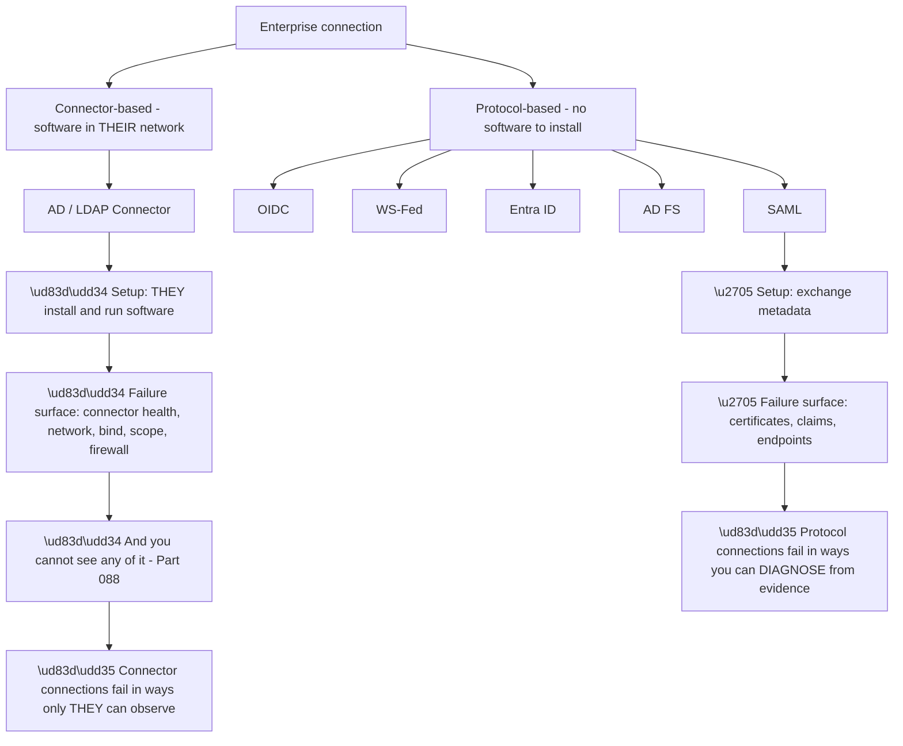
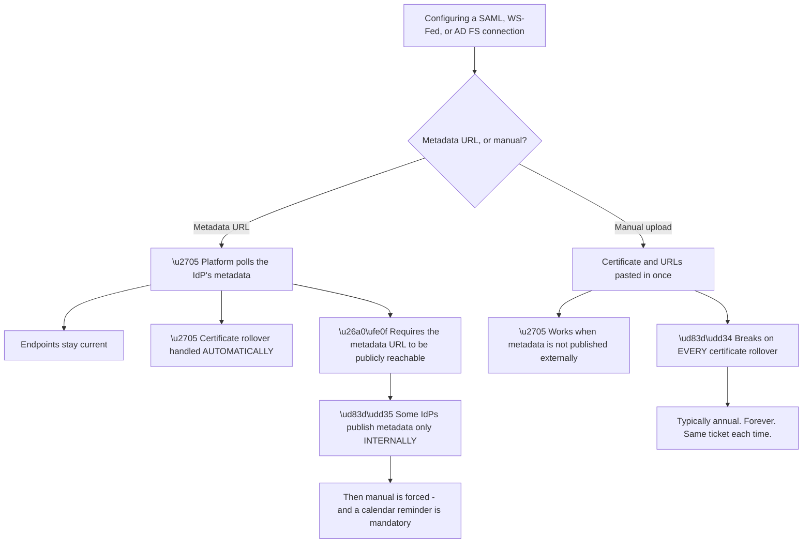
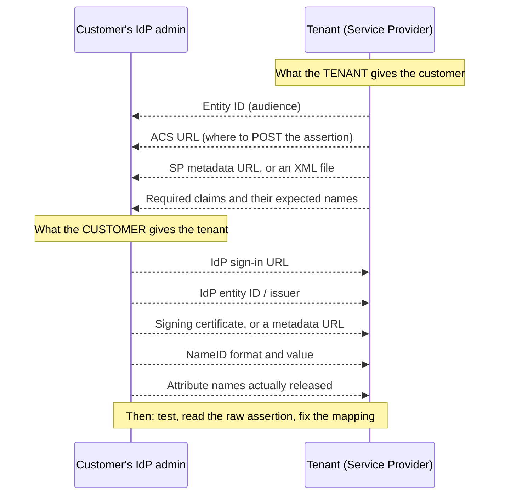
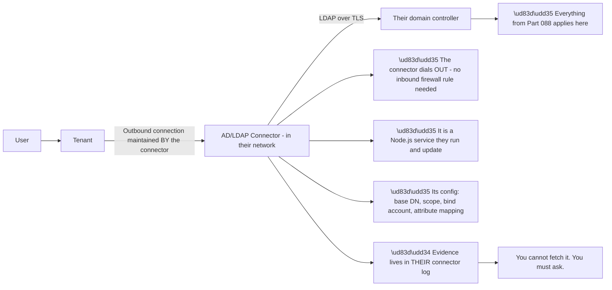
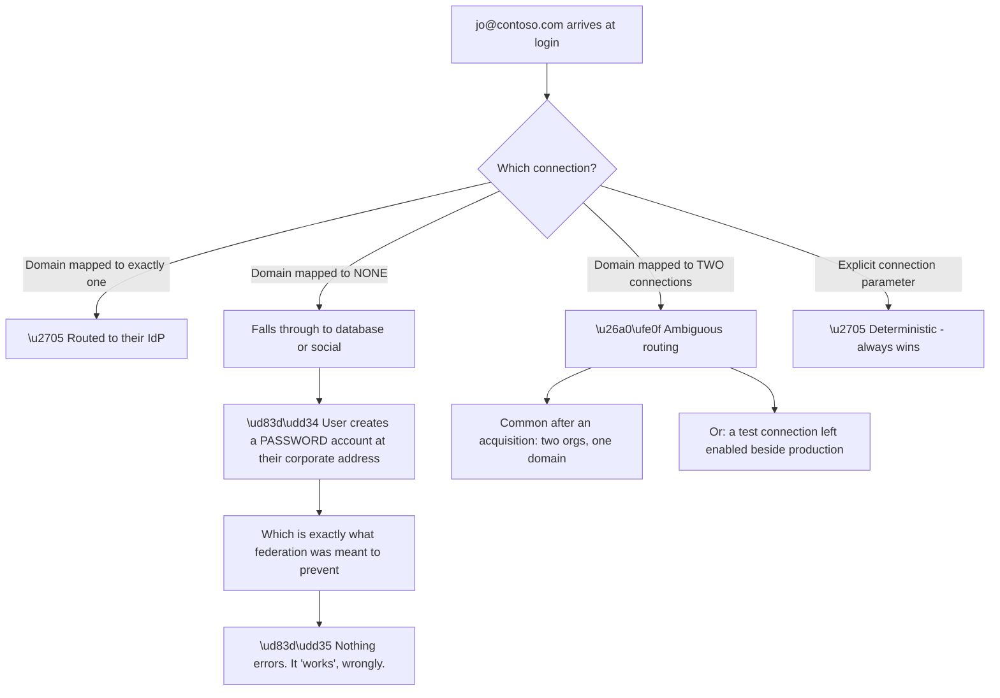
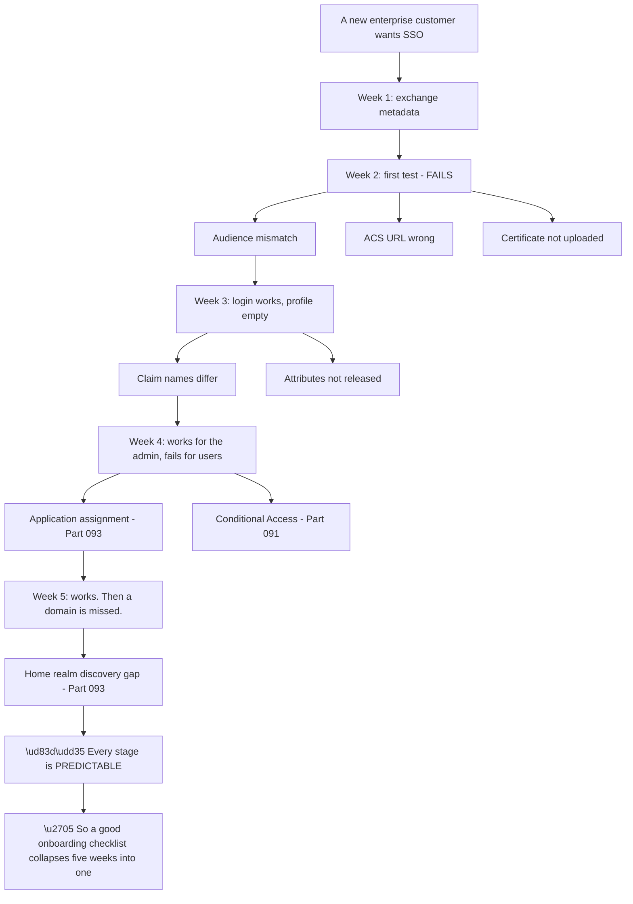
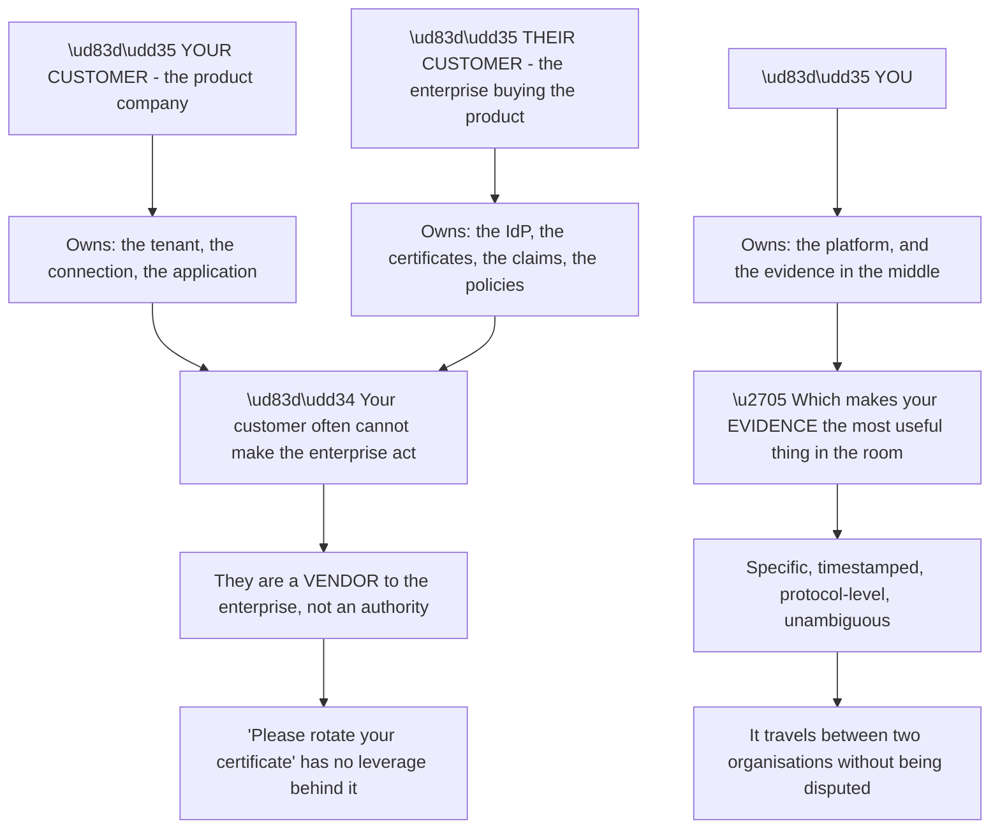
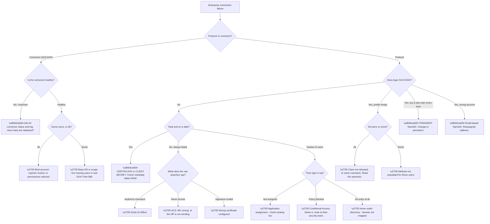

# Part 101 - Enterprise Connections: SAML, OIDC, WS-Fed, Entra ID, AD FS, and AD/LDAP

> Section goal: Bring Group I's directory and federation knowledge into the product surface — how an enterprise connection is actually configured, what each type demands, and how B2B onboarding really goes wrong.

Covers index item **101**. Maps to JD signals: *SAML*, *OAuth 2.0 and OIDC*, *Active Directory*, *LDAP*, *Microsoft Entra ID*, *enterprise connections*, *troubleshooting complex technical issues*, *customer-facing communication*.

---

## 1. Start From Zero: The Connection Types and What Each Costs

An enterprise connection federates to a corporate identity provider. **Six types matter, and they differ enormously in setup cost and failure surface.**

| Type | Configured with | Setup cost | Main failure surface |
|---|---|---|---|
| **SAML** | Metadata URL, or manual certificate + URLs | Medium | **Certificate rollover** |
| **OIDC** | Discovery URL, client ID, secret | Low | **Client secret expiry** |
| **WS-Federation** | Metadata, realm | Medium | Legacy, certificates |
| **Microsoft Entra ID** | Tenant ID + app credentials | Low | Consent, assignment, policy |
| **AD FS** | Metadata URL | Medium | Certificates, proxy, claims rules |
| **AD / LDAP** | **A connector installed in their network** | **High** | Connector health, network path |

**The protocol/connector split in nodes R and R2 is the most useful distinction** for support purposes, because it determines whether you can make progress independently.

**Protocol connections** produce artefacts you can read — assertions, tokens, metadata, tenant logs. **You can often diagnose without the customer's involvement**, and you can check certificates before replying (Part 095).

**Connector connections** put the failure inside the customer's network. **The connector's own log is the primary evidence**, and you cannot obtain it yourself. Every diagnostic step depends on the customer.

**So the connector type should be a deliberate choice**, not a default. **If the customer has Entra ID synchronised from their AD — which most do — an Entra ID connection is strictly better** than an AD/LDAP connector: less to install, less to fail, and evidence you can actually see. **Raising that at onboarding saves months of future tickets.**

> 💡 **Tie-in to your background:** Parts 087–095 covered every one of these upstream systems. **This Part is where that knowledge becomes product configuration**, and your AD, LDAP, and Entra experience is directly load-bearing here rather than merely adjacent.

### 🔍 Plain-English deep-dive: metadata URL versus manual configuration — the decision that recurs forever

Every certificate-bearing connection type offers the same choice, and it determines whether the customer has a recurring outage.

**Node U3 is the recurring cost.** A manually-configured connection produces a **total outage on a predictable schedule**, and because the interval is long, **the institutional memory of the previous occurrence has usually faded.** The same ticket is investigated from scratch annually.

**Node W is the legitimate reason manual configuration exists.** Some organisations do not publish federation metadata externally — often for security reasons that are entirely defensible. **When metadata is unavailable, manual is the only option**, and the correct response is not to argue but to make the expiry visible.

| Configuration | Rollover behaviour | Required practice |
|---|---|---|
| Metadata URL | ✅ Automatic | Confirm the URL stays reachable |
| Manual certificate | ❌ Breaks | **Diarised reminder with a named owner** |
| Multiple certificates configured | ✅ Overlap tolerated | Best manual practice |
| OIDC discovery | ✅ Keys rotate via JWKS | ⚠️ **But the client secret still expires** |

**Row three is the underused mitigation for manual connections.** Many implementations accept **more than one signing certificate**, so uploading the incoming certificate *before* the rollover date creates an overlap window where both work. **That converts a hard cutover into a safe transition**, and it is worth recommending whenever metadata is unavailable.

**Row four restates Part 093's trap.** OIDC connections feel immune to this because key rotation is automatic — **but the client secret has its own expiry**, and when it lapses the failure is identical in shape: total, sudden, dated, no configuration change.

**The single most valuable thing to do at onboarding** is therefore to ask: *"what expires on this connection, and who has a reminder for it?"* **Two questions, and they prevent the most predictable outage in enterprise federation.**

**Analogy:** a subscription that renews automatically versus one you must remember to renew each year. The automatic one is invisible; the manual one fails on a date you have forgotten, and reinstating it takes longer than renewing would have. **Where it stops:** a lapsed subscription usually warns you. A federation certificate expires in silence.

---

## 2. Configuring a SAML Connection: The Exchange

SAML setup is a **two-way exchange**, and most onboarding delays come from one side not knowing what the other needs.

**The final note is the step customers most often skip**, and skipping it is why onboarding drags. **Reading the raw assertion once** (Part 082) reveals the actual claim names, the actual NameID, and the actual audience — **replacing three rounds of guessing with one observation.**

**The four decisions that cause the most trouble:**

| Decision | Right answer | Why |
|---|---|---|
| **NameID value** | The IdP's **immutable object identifier** | Email is reassignable (Part 083) |
| **NameID format** | Persistent, or unspecified with a stable value | Transient breaks everything |
| **Signing** | Assertion signed at minimum | Trust anchor |
| **Metadata vs manual** | Metadata URL where possible | §1 |

**NameID is the decision with the worst failure mode**, and it recurs for the fifth time in this guide (Parts 083, 087, 091, 093, 099). **An email-based NameID means a departed employee's reassigned address grants the new holder their account.** In a B2B context that is a real security incident, not a theoretical one.

**Transient NameID is the other trap:** it changes on every login, so **every sign-in creates a new user.** The symptom is unmistakable once you know it — a user count that grows with every login — and baffling if you do not.

**Attribute names are the second most common onboarding delay.** Entra ID emits long URI-style claim names; other IdPs use short names; the tenant expects whatever it was configured with. **They are the same data with different labels**, and the mapping must be explicit.

---

## 3. AD/LDAP Connector: What You Are Actually Supporting

The connector is software the customer installs inside their network. **Understanding its architecture determines what you can ask for.**

**Node N1 is worth knowing** because it pre-empts a common customer concern: the connector establishes an **outbound** connection, so no inbound firewall rule is required. **That materially lowers the security objection** and is often the fact that unblocks an installation discussion.

**Node N3 lists exactly what to ask for**, and these four values resolve a large share of connector tickets:

| Ask for | Why |
|---|---|
| **Base DN** | Wrong subtree returns nothing (Part 088) |
| **Scope** | `one` versus `sub` hides sub-OUs |
| **Bind account** | Expiry, lockout, or reduced permissions |
| **Attribute mapping** | Empty profiles |
| **Connector version** | Old versions have known issues |
| **Last successful bind** | Establishes when it last worked |

**Node N4 is the payoff from Part 088.** Every LDAP failure mode applies: empty results instead of permission errors, scope hiding sub-OUs, size limits truncating, service account expiry taking everything down at once. **You already know this layer; the connector is just where it is configured.**

**Two connector-specific behaviours** are worth knowing beyond the LDAP layer:

**It is a service the customer maintains.** Version, patching, and restarts are theirs. **A connector that has not been restarted since a certificate change may be holding stale state**, and "have you restarted the connector?" is a legitimate early question.

**Redundancy is optional and frequently absent.** A single connector is a single point of failure for every enterprise login through that connection. **Asking how many are deployed is worth doing proactively**, because the answer is often one.

### 🔍 Plain-English deep-dive: home realm discovery, and the shadow account nobody notices

With several connections configured, the platform must decide which one applies before authentication starts. **The edge cases here produce the quietest failure in the whole product.**

**Node R is the failure worth naming**, because nothing errors anywhere. A user on an unmapped corporate domain **does not see a failure** — they see a normal signup form and create a password account. **From their perspective everything worked**, and from the enterprise's perspective an employee now holds a credential outside their control.

| Situation | What the user experiences | What actually happened |
|---|---|---|
| Domain mapped | Redirected to their IdP | ✅ Correct |
| **Domain unmapped** | **Normal signup** | 🔴 **Shadow account created** |
| Domain ambiguous | Unpredictable routing | ⚠️ Wrong connection possible |
| Explicit parameter | Deterministic | ✅ Correct |

**The second row is why the domains question belongs on the onboarding checklist**, and why it must ask for domains *plural*. **Subsidiaries, acquisitions, alias domains, and regional variants all route users into the fall-through path** unless they are enumerated deliberately.

**Two mitigations work well together.** **Blocking self-signup for mapped domains** prevents shadow accounts for the domains you know about. **Periodically auditing database-connection users whose email domain matches an enterprise connection** catches the ones you did not.

**And there is a detection signal that costs nothing:** a database-connection user with a corporate email address at a domain that has an enterprise connection **should not exist.** A single query surfaces every shadow account, and running it once at onboarding often finds users nobody knew were there.

**Analogy:** a building where staff badge in at a side door, but anyone whose department was never added to the list is quietly directed to the visitor desk and issued a visitor pass instead. Nothing failed; the wrong credential was issued, and nobody was told. **Where it stops:** a receptionist would notice a company email address. Software matches a domain list and falls through in silence.

---

## 4. B2B Onboarding: How It Actually Goes

Enterprise connection tickets cluster heavily at onboarding, and the pattern is consistent enough to prepare for.

**Node D1 is the opportunity.** Because the failure sequence is so consistent, **a checklist given at the start pre-empts most of it.** That is a genuinely valuable contribution for a support engineer to make (Part 122).

**The onboarding checklist worth having:**

| # | Question to ask up front |
|---|---|
| 1 | Which protocol — SAML, OIDC, or Entra ID directly? |
| 2 | Can you provide a **metadata URL**, or must we configure manually? |
| 3 | What will the **NameID** be? **Is it immutable?** |
| 4 | Which **attributes** will you release, and under what **names**? |
| 5 | **Which domains**, plural, should route to this connection? |
| 6 | Is the application **assigned** to all intended users or groups? |
| 7 | Are there **Conditional Access** policies that will apply? |
| 8 | **What expires**, and who has a reminder? |
| 9 | Do any of your users already have accounts here from before? |
| 10 | Do you need **provisioning** as well as authentication? (Part 094) |

**Questions three, five, and eight prevent the highest-cost failures** — account takeover from a reassigned email, a recurring routing gap, and an annual outage respectively.

**Question nine is the one most often forgotten** and it is Part 093's pre-existing-account problem: employees who signed up with a password before federation existed retain that login. **Federating does not retire it**, so the deprovisioning guarantee the customer believes they have does not cover them.

### 🔍 Plain-English deep-dive: you are supporting a conversation between two organisations

Enterprise connection tickets have a structural feature that consumer tickets do not: **there are three parties, and two of them do not report to each other.**

**Node G2 is the constraint that shapes everything.** Your customer needs the enterprise's IT team to change something, and **they have no authority to require it** — they are a supplier. A vague request gets deprioritised; a specific, evidenced one does not.

**Node V2 is therefore the real deliverable.** *"At 09:14 UTC the assertion we received was signed with certificate thumbprint X, which expired on 8 August; your IdP's current metadata publishes thumbprint Y"* is **something your customer can forward without editing**, and something the enterprise's IT team can act on immediately.

| Weak framing | Strong framing |
|---|---|
| "Something's wrong with their SAML" | "The assertion is signed with an expired certificate — thumbprint and dates attached" |
| "They're not sending the right claims" | "The assertion contains these three attribute names; we expect these" |
| "Their users aren't assigned" | "Entra sign-in log correlation ID X shows 'user not assigned'" |
| "It doesn't work" | "Here is the decoded assertion and the specific field that differs" |

**Every strong framing shares two properties:** it is **verifiable by the other party** and it **names exactly one thing to change.** That combination is what makes a request actionable across an organisational boundary.

**And there is a timing point worth knowing.** Enterprise IT teams work in change windows. **A request that lands with complete evidence can enter the next window; one that generates a clarifying question misses it** — and change windows can be weeks apart. **Completeness is not politeness here; it is schedule.**

**Analogy:** a surveyor's report in a property transaction between two parties who do not trust each other. Its value is that both sides accept it without argument, and it names exactly what needs fixing. **Where it stops:** a surveyor can revisit. Federation evidence is a snapshot, so it has to be complete the first time.

---

## 5. Failure Modes

| # | Failure mode | Symptom | Root cause | First check |
|---|---|---|---|---|
| 1 | Certificate rollover, manual config | Total failure on a date | No metadata URL | Certificate dates |
| 2 | Client secret expired (OIDC) | Total failure on a date | Secret lifetime | Secret expiry |
| 3 | Audience mismatch | Assertion rejected | Entity ID differs | Compare exactly |
| 4 | ACS URL wrong | Assertion posted nowhere useful | URL mismatch | Compare exactly |
| 5 | Transient NameID | **A new user on every login** | Wrong NameID format | User count growth |
| 6 | Email-based NameID | Account takeover on reassignment | Mutable identifier | What is NameID? |
| 7 | Claim names differ | Login works, profile empty | Naming mismatch | Read the raw assertion |
| 8 | Attributes not released | Empty for **everyone** | IdP configuration | All users or some? |
| 9 | Attribute not populated | Empty for **some** | Source data | Check their directory |
| 10 | User not assigned | Generic failure | Enterprise app assignment | Their sign-in log |
| 11 | Conditional Access block | Generic failure | Their policy | Their sign-in log |
| 12 | Domain not mapped | Some users routed nowhere | Incomplete domain list | Which domains? |
| 13 | Connector down | All enterprise logins fail | Single connector, no redundancy | Connector health |
| 14 | Connector base DN/scope | Some users not found | LDAP scoping (Part 088) | Base DN and scope |
| 15 | Bind account expired | All connector logins fail | Credential lifecycle | Last successful bind |
| 16 | Pre-existing password accounts | Deprovisioning incomplete | Accounts predate federation | Was linking planned? |
| 17 | SameSite / cross-site POST | Response drops state | Cookie policy (Part 072) | Browser-specific? |

---

## 6. Troubleshooting Decision Tree: Enterprise Connections

### Worked example

A customer reports that their enterprise SSO connection has "duplicate users everywhere" — their user count has grown from 400 to over 9,000 in three months, and the enterprise customer has only 400 employees.

**Node E: login succeeds.** **That eliminates certificates, endpoints, assignment, and policy** — everything is working. Node J is the branch: **a new user on every login.**

**Confirming it.** The raw assertion shows `NameID Format` of `urn:oasis:names:tc:SAML:2.0:nameid-format:transient` and a NameID value that differs on every sign-in.

**That is the IdP behaving exactly as specified.** Transient NameID is *designed* to be different each time — it exists specifically to prevent correlation across sessions, which is a legitimate privacy feature. **It is simply the wrong choice for a system that needs a persistent user account.**

**The arithmetic confirms it precisely.** 400 employees, roughly weekly logins, twelve weeks — **around 9,000 identities.** The growth rate matches login volume, not headcount.

**The fix is on the enterprise's side**, which is the Part 4 situation: the customer must ask another organisation to change their IdP configuration to a persistent NameID.

**The evidence packet** makes that request actionable: the decoded assertion showing the transient format, the user growth chart correlated with login volume, and the specific configuration change required, named exactly.

**Then the cleanup conversation**, which is the harder half. Nine thousand orphaned identities exist, some with data attached. **Merging them requires deciding which is authoritative**, and there is no automatic answer — this is a data problem created by a configuration mistake, and Part 105 covers the linking mechanics.

**The write-up point:** **transient NameID is the only failure mode where success is the symptom.** Everything works perfectly, every time, and the damage accumulates invisibly until someone looks at the user count. **Monitoring user growth against expected headcount would have caught it in week one** — and that is a genuinely useful recommendation to leave behind.

---

## 7. Lab: Build Enterprise Connections Both Ways

**Purpose.** Configure SAML and OIDC enterprise connections against your own Entra tenant, reproduce the highest-cost failures, and build the onboarding checklist as a working artefact.

**Prerequisites.**
- The free tenant from Part 097 and the free Entra tenant from Part 090
- A local test client (Part 059) and a local SAML decoder (Part 082)
- **Never** use an employer or customer tenant on either side

**Steps.**

1. **Create a SAML enterprise connection** to your Entra tenant using the **federation metadata URL**. Complete the exchange in both directions and record what each side needed.
2. **Sign in and capture the raw assertion.** Decode it locally. **List every attribute name exactly** — note the long URI-style names.
3. **Record the NameID format and value.** Confirm it is stable across two logins.
4. **Deliberately configure a transient NameID** in Entra. Sign in three times. **Confirm three separate users are created.** This is the §6 scenario.
5. **Revert to a persistent NameID** and note that the earlier duplicates remain — **the damage is not undone by fixing the cause.**
6. **Break the audience:** change the entity ID on one side. Record the exact error.
7. **Break the ACS URL** and record what happens differently from the audience failure.
8. **Create a second connection using OIDC** to the same Entra tenant. **Record the client secret's expiry date** and note it as a scheduled outage.
9. **Compare the two connections' claim names** side by side. Write down why the mapping had to differ.
10. **Configure a manual SAML connection** with an uploaded certificate rather than metadata, and **write out the rollover failure timeline** as a customer-facing explanation.
11. **Build the ten-question onboarding checklist** from §4 in your own words, as a document you would actually send.
12. **Write an evidence packet** for the transient-NameID scenario, in the strong-framing style from §4.

**Expected evidence.**
- A working SAML connection with the raw assertion decoded and annotated
- Three duplicate users from the transient NameID test
- Exact error text for audience and ACS URL failures, side by side
- An OIDC connection with the secret expiry recorded
- Claim names compared across both protocols
- Your onboarding checklist and your evidence packet

**Validation rubric.**

| Criterion | Pass |
|---|---|
| Type selection | You can explain protocol versus connector and recommend accordingly |
| Metadata | You can explain the rollover consequence and the overlap mitigation |
| NameID | You can explain transient and email failures and their signatures |
| Claims | You can read a raw assertion and map names |
| Onboarding | You have a checklist that pre-empts the five-week sequence |
| Evidence | You can write a packet that travels between organisations |
| Safety | Free tiers, fictional users, everything deleted |

**Cleanup and privacy.** Delete both connections, the Entra app registration, and every test user — **including the duplicates**, which is itself instructive. **Delete every captured assertion**; they contain identity data and are signed credentials. **Never configure a connection against an employer or customer IdP**, and never capture a real production assertion for study.

---

## 8. JD Mapping

| JD signal | How this Part addresses it |
|---|---|
| SAML | Configuration, NameID, claims, certificates |
| OAuth 2.0 and OIDC | The OIDC connection path and secret lifecycle |
| Active Directory / LDAP | The connector, and Part 088's failure modes in situ |
| Microsoft Entra ID | As the most common upstream IdP |
| Enterprise connections | The core subject of this Part |
| Troubleshooting complex technical issues | Seventeen failure modes and a full decision tree |
| Customer-facing communication | Evidence packets that cross organisational boundaries |

---

## 9. Candidate Honesty Note

- **Production experience:** Active Directory, LDAP, and Entra ID — every upstream system in this Part.
- **Production experience:** producing evidence precise enough to hand to another team and have them act on it.
- **Lab experience:** configuring SAML and OIDC enterprise connections end to end, reproducing the transient-NameID failure, and building an onboarding checklist, as above.
- **Learned architecture:** the connector model, B2B onboarding sequencing, and cross-organisational evidence practice.
- **No direct experience:** onboarding a real enterprise customer, or supporting a production connector deployment.
- **How to say it:** *"The upstream systems here are ones I've supported — AD, LDAP, Entra. The connection layer I've built in a lab, both protocols, and I deliberately reproduced the transient NameID failure because I wanted to see the shape of a problem where everything succeeds and the damage still accumulates. I haven't onboarded a real enterprise customer, and I'd expect the coordination side to be the part I'd learn on the job."*

---

## 10. Official Source Anchors

| Source | Why | Accessed |
|---|---|---|
| Auth0 Docs — Enterprise connections overview | Types and configuration | Accessed **26 August 2026** |
| Auth0 Docs — SAML enterprise connections | The SAML exchange in detail | Accessed **26 August 2026** |
| Auth0 Docs — Active Directory / LDAP Connector | Connector architecture and configuration | Accessed **26 August 2026** |
| Auth0 Docs — Microsoft Entra ID connections | The most common upstream IdP | Accessed **26 August 2026** |
| OASIS — SAML 2.0 Core, §8.3 NameID formats | Transient versus persistent, authoritatively | Accessed **26 August 2026** |
| Microsoft Learn — Configure SAML claims for enterprise applications | The IdP side of the exchange | Accessed **26 August 2026** |

> **Revalidate:** connection configuration screens and connector versions change. Re-check the Auth0 documentation before interview; the SAML specification is stable and can be quoted with confidence.

---

## ⭐ Likely Interview Questions for This Section

### Q1. "A customer can federate via an AD/LDAP connector or via their Entra tenant. Which do you recommend?"

> *Model answer:* Entra, in almost every case, and I would raise it proactively rather than waiting to be asked. The connector puts software inside the customer's network, which means the failure surface includes connector health, version, network path, firewall rules, the bind account, base DN, and scope — and none of that is visible to me, so every diagnostic step depends on them. An Entra connection is protocol-based: I can fetch their metadata, check certificate dates, and read assertions without involving them at all. Since most organisations running an AD already synchronise it to Entra, the connector usually adds a dependency without adding capability. The exception is an organisation with no Entra tenant and a genuine requirement for AD to remain authoritative, and then the connector is the right answer.

### Q2. "Why does the metadata URL versus manual certificate choice matter so much?"

> *Model answer:* Because a manually configured connection produces a total outage on a predictable schedule, typically annually, forever. Certificate rollover is normal and correct behaviour at the identity provider; the connection breaks because it holds a static copy. And because the interval is long, the institutional memory of the last occurrence has usually faded, so the same ticket gets investigated from scratch each year. A metadata URL handles rollover automatically. When metadata is not published externally — which is a defensible security decision — manual is forced, and then two things are mandatory: a diarised reminder with a named owner, and uploading the incoming certificate before the rollover date if the implementation accepts multiple certificates, which turns a hard cutover into an overlap window.

### Q3. "A customer's user count is growing far faster than their headcount. What's your hypothesis?"

> *Model answer:* Transient NameID. It is designed to be different on every authentication, specifically to prevent correlation across sessions, which is a legitimate privacy feature and completely wrong for a system that needs persistent accounts. So every login creates a new user. The confirming evidence is in the raw assertion — the format will be the transient URN and the value will differ between two logins — and the growth rate will track login volume rather than headcount, which is an easy arithmetic check. What makes it distinctive is that it is the only failure mode where success is the symptom: everything works perfectly every time and the damage accumulates invisibly. The fix is on the enterprise's side, and the cleanup is harder than the fix because thousands of orphaned identities may have data attached.

### Q4. "Walk me through what has to be exchanged to set up a SAML connection."

> *Model answer:* It is two-way. From our side the customer needs the entity ID, which becomes the audience; the ACS URL, which is where the assertion gets posted; our metadata; and the claims we expect, with their exact names. From their side we need their sign-in URL, their issuer, their signing certificate or metadata URL, the NameID format and value, and the attribute names they will actually release. Then the step people skip: sign in once and read the raw assertion. That single observation replaces three rounds of guessing, because it shows the actual claim names, the actual NameID, and the actual audience rather than what everyone believed was configured. Four decisions cause most of the trouble — NameID value, NameID format, signing, and metadata versus manual — and I would settle all four before the first test rather than after.

### Q5. "Login works but the user profile is empty. How do you narrow it?"

> *Model answer:* First by noting that authentication succeeded, which eliminates certificates, endpoints, assignment, and policy in one step — this is a claims problem, not an authentication problem. Then by asking whether it affects all users or only some. All users means the configuration is wrong: either the identity provider is not releasing the attribute, or it is releasing it under a name our mapping does not expect. Entra emits long URI-style SAML claim names while the receiving side often expects short ones, and they are the same data with different labels. Some users means the configuration is right and the source attribute is simply not populated for those individuals, which is a directory data task on their side. The decisive evidence in both cases is the decoded raw assertion, because assumed claim names and actual claim names differ constantly.

### Q6. "Your customer needs their enterprise customer's IT team to fix something. How do you help?"

> *Model answer:* By producing evidence precise enough that it travels between two organisations without being disputed. My customer is a vendor to that enterprise, not an authority, so they have no leverage — a vague request gets deprioritised. Something like "at 09:14 UTC the assertion we received was signed with thumbprint X, which expired on 8 August, and your published metadata now shows thumbprint Y" can be forwarded unedited and acted on immediately. The two properties that matter are that it is verifiable by the other party and that it names exactly one thing to change. There is also a timing dimension: enterprise IT teams work in change windows, so a request that arrives complete makes the next window, while one that generates a clarifying question misses it — and windows can be weeks apart.

### Q7. "What would you put in a B2B SSO onboarding checklist?"

> *Model answer:* Ten questions, because the failure sequence is so consistent that asking them up front collapses about five weeks of iteration into one. Which protocol. Can you give us a metadata URL or must we configure manually. What will the NameID be and is it immutable. Which attributes will you release and under what names. Which domains, plural, should route here. Is the application assigned to all intended users, including via nested groups. Are there Conditional Access policies that will apply. What expires on this connection and who has a reminder. Do any of your users already have accounts in the product from before federation. And do you need provisioning as well as authentication. The NameID, domains, and expiry questions prevent the three highest-cost failures.

### Q8. "Why does 'do any users already have accounts from before?' matter?"

> *Model answer:* Because federating does not retire pre-existing credentials. Employees who signed up with a password before the enterprise connection existed still have that password login, so the deprovisioning guarantee the customer believes they have bought does not cover them — someone leaving the company keeps a working way in. It is easy to miss because everything appears to work: federated login functions perfectly and the old accounts are invisible until someone audits. The right handling is account linking on first federated sign-in, which preserves the user's history while closing the password path, and it has to be based on verified evidence rather than a matching email address, because auto-linking on unverified email is an account-takeover vector. Asking the question at onboarding turns a future security surprise into a planned migration step.

---

## 🧠 30-Second Memory Hooks

- **Protocol connections you can diagnose. Connector connections only they can see.**
- **Prefer Entra over an AD/LDAP connector** where they already sync.
- **Metadata URL = automatic rollover. Manual = annual outage, forever.**
- **OIDC's version of certificate expiry is the client secret.**
- **Ask at onboarding: what expires, and who has a reminder?**
- **NameID must be immutable.** Fifth time this lesson appears.
- **Transient NameID = a new user every login.** Success is the symptom.
- **Email NameID = takeover on reassignment.**
- **Login works + empty profile = claims. All users = config. Some = data.**
- **Connector: base DN, scope, bind account, version, redundancy.**
- **The connector dials out** — no inbound firewall rule needed.
- **Three parties, and your customer has no authority over the third.**
- **Evidence must be verifiable and name exactly one change.**
- **Ask: do any users already have accounts from before?**

---

## ✅ Completion Checklist

- [ ] I can compare all six connection types by setup cost and failure surface
- [ ] I can explain why protocol beats connector where there is a choice
- [ ] I can explain metadata versus manual and the overlap mitigation
- [ ] I can list what each side must exchange for SAML
- [ ] I can explain transient and email NameID failures and their signatures
- [ ] I can split empty-profile causes by population
- [ ] I can name what to ask for on a connector ticket
- [ ] I can write an evidence packet that crosses organisational boundaries
- [ ] I have a ten-question onboarding checklist
- [ ] I have completed the lab, including the transient NameID reproduction
- [ ] I can state honestly what I have configured and what I have not onboarded

*Next suggested section:* **[Part 102 - Universal Login, Branding, and Customization](Part-102-universal-login-branding-and-customization.md)** — the login experience users actually see, why hosting it centrally matters for security, and how far customisation can safely go.
