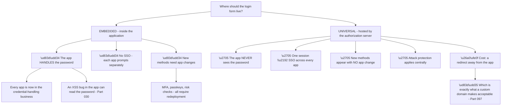
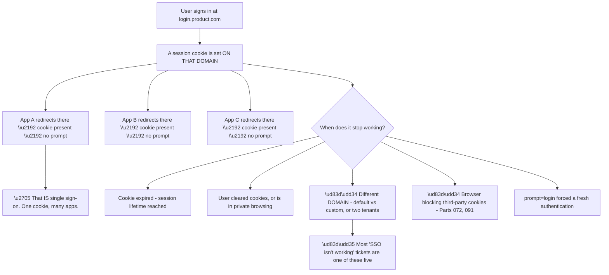
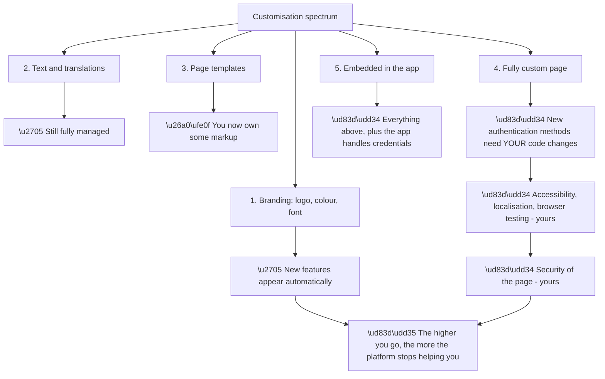
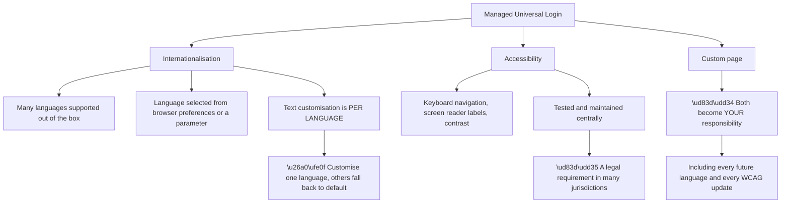
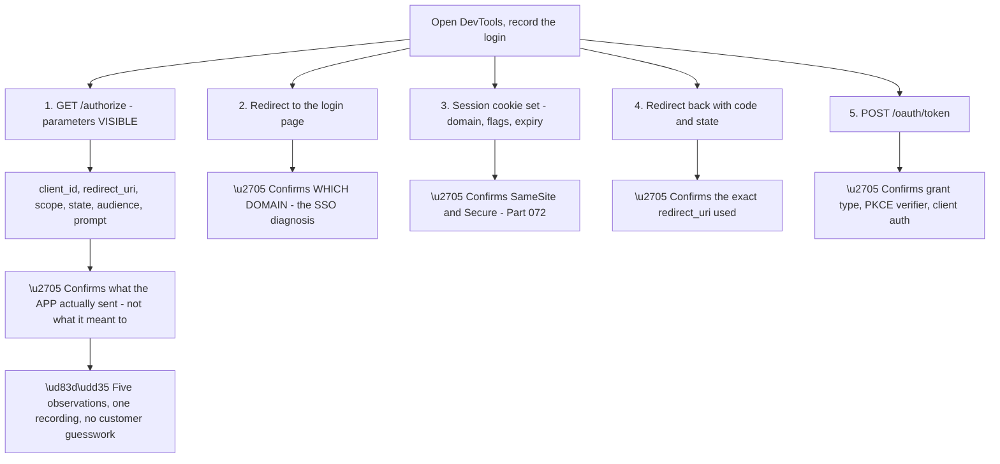
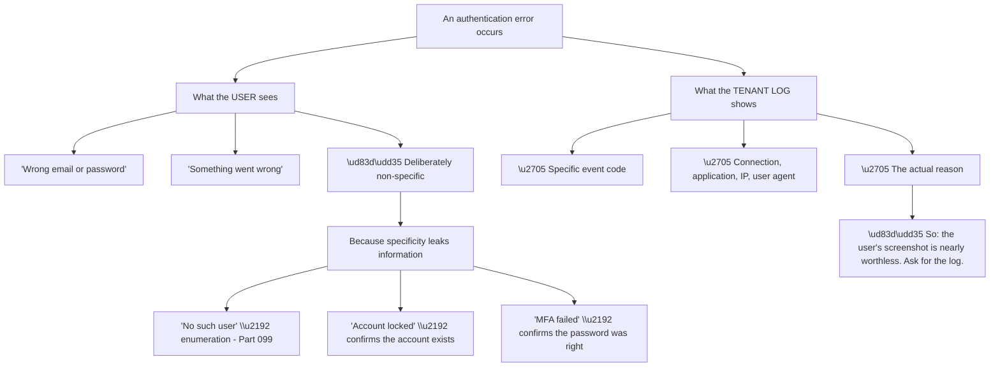
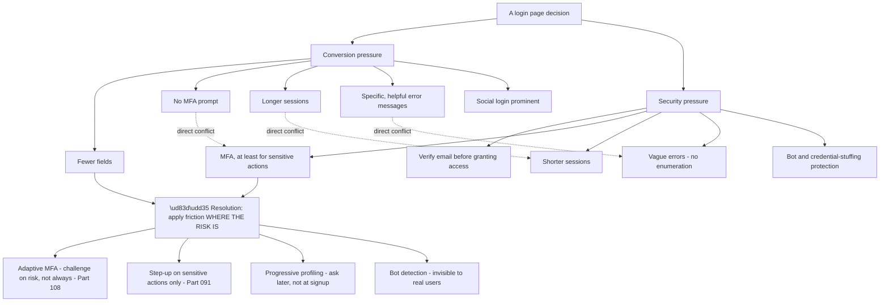
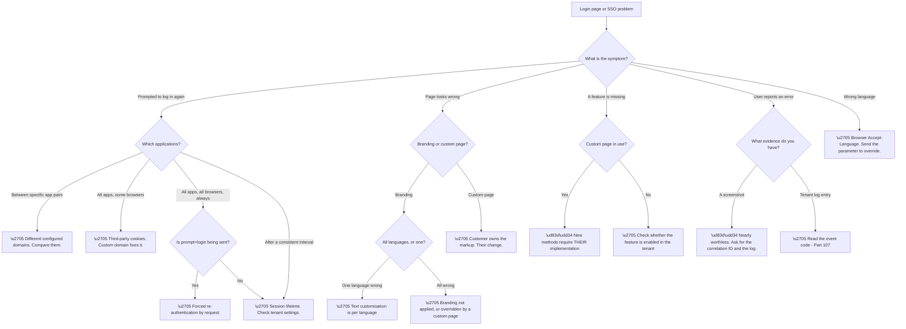

# Part 102 - Universal Login, Branding, and Customization

> Section goal: Understand why the login page is hosted centrally rather than embedded in the application, what that buys in security and maintenance, and how far customisation can go before it starts costing something.

Covers index item **102**. Maps to JD signals: *Auth0*, *customer identity*, *web and browser*, *JavaScript*, *security*, *customer-facing communication*, *troubleshooting complex technical issues*.

---

## 1. Start From Zero: Why the Login Page Is Not in the Application

The instinctive design is to build a login form inside the application — it is the application's page, so the application should own it. **Every modern identity platform pushes the opposite**, and the reasons are worth understanding rather than accepting.

**Node U3 is the argument that persuades developers**, because it is about their workload rather than abstract security. **Adding MFA, passkeys, bot detection, or a new social provider requires no application change at all** — the hosted page gains the capability and every application inherits it.

**The embedded alternative means every new authentication method is a development project**, multiplied by every application. **That is the cost that accumulates**, and it is invisible at the point of the original decision.

**Node E3 is the security argument**, and it is concrete rather than theoretical. An embedded form means the password passes through the application's JavaScript context. **Any cross-site scripting vulnerability anywhere on that page can read it** (Part 030). With a hosted page on a different origin, **the same-origin policy prevents that by construction** — the application's JavaScript cannot reach into the login page at all.

**Node U5 is the honest cost**, and it is the objection you will hear: users leave the application's domain during login. **A custom domain (Part 097) reduces this to a subdomain transition** — `app.product.com` to `login.product.com` — which most users do not register as leaving at all.

> 💡 **Tie-in to your background:** you have worked with browser DevTools and HAR analysis. **The redirect-based model is very visible in a HAR** — you can see the hop to the login domain, the session cookie being set, and the return with a code. That readability is one of the model's underrated advantages for support.

### 🔍 Plain-English deep-dive: what "single sign-on" actually means here, and why customers misunderstand it

SSO is the benefit customers most want and most often misunderstand. **The mechanism is a cookie on the authorization server's domain**, and knowing that explains every SSO question you will get.

**Node B3 is the most common cause in practice**, and it is invisible unless you look for it. **Two applications configured with different domains — one on the default, one on the custom — do not share a session**, because the cookie is scoped to a domain and they are visiting two different ones.

**The symptom is precise:** SSO works between some applications and not others, consistently, with no pattern related to users or timing. **The check is to compare the configured domain across every application**, which takes seconds.

**Node B4 is the browser-dependent variant.** Where the login domain is genuinely third-party to the application, the cookie may be blocked — producing the Safari-and-Firefox split from Part 091. **Same symptom, different cause, and the browser split distinguishes them.**

| "SSO isn't working" | Distinguishing signal |
|---|---|
| Cookie expired | Correlates with a time interval |
| Cleared / private browsing | Reproducible in normal browsing? |
| **Different domains** | **Consistent per application pair** |
| **Third-party cookies blocked** | **Browser-specific** |
| `prompt=login` sent | Check the authorization request |

**The last row deserves attention** because it is a self-inflicted case that looks like a platform failure. **An application sending `prompt=login` forces re-authentication every time by design** (Part 074), and developers sometimes add it while debugging and forget to remove it. **Checking the authorization request parameters is a fast, high-yield step.**

**Analogy:** a wristband from a festival entrance that every stage accepts. One check at the gate, free movement afterwards. **Where it stops:** a wristband is on your wrist. A cookie belongs to a specific domain, so approaching by a different route means arriving without one.

---

## 2. Customisation: The Spectrum

Customisation ranges from changing a colour to writing the entire page, and the cost rises sharply along the way.

| Level | What you control | Maintenance cost |
|---|---|---|
| **Branding settings** | Logo, colours, fonts, background | Minimal |
| **Text customisation** | Prompts, labels, error text, per-language | Low |
| **Page templates** | Surrounding HTML, layout | Medium |
| **Advanced / custom page** | The entire page, your own code | **High — you own it** |
| **Embedded login** | Everything, in your app | **Highest — and least secure** |

**Node R is the trade-off to communicate**, and it is easily missed at the point of the decision. **The value of a hosted login page is that improvements arrive without work.** Each step up the spectrum forfeits some of that.

**The concrete example that lands:** a customer with a fully custom login page **does not automatically gain passkey support** when the platform adds it. **They have to implement it.** The customisation that seemed free at the time now has a permanent development cost attached.

**The question worth asking** when a customer proposes heavy customisation: *"what specifically can't you achieve with branding and text customisation?"* **Frequently the answer is something that is now supported and was not when they last looked**, and the requirement dissolves.

**Where heavy customisation is genuinely justified:**

| Requirement | Justified? |
|---|---|
| Exact brand match beyond available settings | ⚠️ Sometimes — check current capabilities first |
| A regulated disclosure on the login page | ✅ Often |
| A genuinely unusual flow | ✅ Sometimes — but check Actions and Forms first (Part 103) |
| "It should look exactly like our app" | ⚠️ Usually achievable with branding |
| Progressive profiling during signup | ✅ **But Forms may do it** (Part 103) |

**Rows three and five point at Part 103**, and that redirect is important: **many requirements that appear to need a custom page are better served by Actions or Forms**, which keep the page managed while adding the behaviour.

---

## 3. Internationalisation and Accessibility

Two areas where the managed page does substantial work that customers only notice when they lose it.

**Node A2a is worth raising explicitly** in any customisation conversation, because it is frequently not considered. **Accessibility is a legal requirement in many jurisdictions**, and the login page is one of the few pages every single user must successfully use.

**A custom login page that fails accessibility testing is a compliance exposure**, not merely a quality issue — and it is a specific, concrete cost that belongs in the customisation decision.

**Node I3a is a real operational gotcha.** Text customisation applies per language, so **customising English does not customise French** — French continues to show the default text. **The symptom is a login page that is half-branded**, which looks like a bug and is configuration.

**A related detail worth knowing:** language is normally selected from the browser's `Accept-Language` preferences, and can be overridden with a parameter on the authorization request. **A customer whose users see the wrong language is usually seeing correct behaviour driven by browser settings** — and the fix is to send the parameter explicitly if the application knows better.

### 🔍 Plain-English deep-dive: the redirect is visible, and that is a support advantage

The redirect-based model is often described as a cost. **For diagnosis it is the opposite** — it makes the entire authentication exchange observable in a way an embedded form never is.

**Node R is why a HAR is the highest-value single artefact** on a login ticket. **One recording answers questions that would otherwise take several rounds of correspondence** — and it answers them with what actually happened rather than what the customer believes is configured.

| Question | Answered by |
|---|---|
| Is `prompt=login` being sent? | Step 1 |
| Which domain is this app using? | Step 2 |
| Are cookies being set and sent? | Step 3 |
| Is the redirect URI what is configured? | Step 4 |
| Is PKCE actually being used? | Step 5 |
| Was an `audience` requested? | Step 1 |

**Six of the most common causes across Parts 097–102, all readable from one capture** — which is why asking for a HAR early is usually faster than asking a sequence of configuration questions.

**The redaction requirement is absolute here**, and worth repeating because the value of the artefact makes it tempting to skip. **A login HAR contains session cookies, authorization codes, and often complete tokens** — every one of which is a live credential. **Asking for it and asking for redaction in the same sentence** is the standard (Part 112), and offering guidance on *how* to redact makes it likelier to happen properly.

**One practical tip worth passing to customers:** enable the **"preserve log"** option before recording, or the redirects will clear the capture and the most important entries will be missing. **A HAR that starts at the callback has lost everything diagnostic**, and this is the most common reason a requested HAR turns out to be unusable.

**Analogy:** a journey where every leg is a separate ticket you can inspect afterwards, versus one where a car simply arrives and you must ask the driver what route they took. **Where it stops:** the tickets show the route, not the reasoning — they tell you the application sent `prompt=login`, not why someone added it.

---

## 4. Errors, Messages, and What Users Actually See

The login page is where authentication errors surface to end users, and its messages are deliberately vague.

**Node R is the practical instruction**, and it changes what you ask for. **A screenshot of a login error tells you almost nothing** — it is the same message for a dozen different causes. **The tenant log entry, identified by timestamp and correlation, tells you everything** (Part 107).

**So the first evidence request on any login-page error is the log, not the screenshot.** This is a genuine difference from IT-facing support, where screenshots are often decisive.

**One user-visible detail is worth knowing:** the login page usually displays a **correlation or tracking identifier** on error screens. **Asking the user for that identifier turns a vague report into a precise log lookup**, and it is the single most useful thing an end user can provide. **Telling a customer to instruct their users to include it** is a small process improvement with a large effect on ticket quality.

**Error message customisation** is possible through text customisation, and it carries a warning: **making messages more specific to be more helpful can reintroduce enumeration.** *"We don't recognise that email address"* is friendlier and tells an attacker which addresses are registered. **The vagueness is a deliberate control**, and customers should be told that before they change it.

### 🔍 Plain-English deep-dive: the login page is where security and conversion argue

Almost every login page decision is a trade between making it easy and making it safe. **Naming the trade explicitly is more useful than pretending there is a right answer.**

**Node R is the reframing that resolves most of these arguments.** The conflict is only irreconcilable if friction is applied **uniformly**. **Applied selectively — where the risk actually is — both goals are largely satisfiable.**

| Uniform approach | Selective approach |
|---|---|
| MFA on every login | **Adaptive MFA** — challenge on risk signals |
| All fields at signup | **Progressive profiling** — ask when needed |
| Short sessions for everyone | Short sessions **for sensitive applications** |
| CAPTCHA for everyone | **Bot detection** — invisible to real users |
| Re-authenticate hourly | **Step up** on sensitive actions only |

**Every row on the right is a real capability** covered elsewhere in this guide, which means the answer to "security or conversion?" is usually **"both, with the right mechanism"** rather than a compromise.

**The one place the trade is genuinely irreducible** is error message specificity. **You cannot be both maximally helpful and enumeration-resistant**, and the correct answer is to stay vague on the login page while giving the *customer's support team* full detail through the logs. **The information exists; it is just not shown to an anonymous visitor.**

**And there is a framing worth using with customers** who push for helpful errors: *"the detail you want your users to have is available to your support team in the logs, in seconds. Putting it on the login page also gives it to everyone probing your user list."* **That reframes it from a refusal into a routing decision.**

**Analogy:** a shop entrance that must be welcoming and must not admit shoplifters. Making the door harder for everyone hurts trade; watching for actual signals of risk achieves both. **Where it stops:** a doorman can read a room. Software needs the risk signals to be defined in advance, which is why adaptive controls have to be configured rather than assumed.

---

## 5. Failure Modes

| # | Failure mode | Symptom | Root cause | First check |
|---|---|---|---|---|
| 1 | Different domains across apps | SSO works between some apps only | Cookie scoped per domain | Compare configured domains |
| 2 | Third-party cookies blocked | SSO fails on some browsers | Default domain, cross-site | Which browsers? |
| 3 | `prompt=login` left in | Always re-prompts | Debug parameter forgotten | Inspect the request |
| 4 | Session lifetime short | Frequent re-login | Tenant setting | Correlate with interval |
| 5 | Custom page not updated | New methods unavailable | Customisation forfeits automatic updates | Is it a custom page? |
| 6 | Text customised in one language | Half-branded page | Per-language customisation | Which language is shown? |
| 7 | Wrong language shown | Unexpected localisation | Browser `Accept-Language` | Send the parameter explicitly |
| 8 | Custom page accessibility | Compliance exposure | Customer owns it | Was this considered? |
| 9 | Screenshot as evidence | Diagnosis stalls | Messages are deliberately vague | Ask for the log |
| 10 | Error messages made specific | Enumeration reintroduced | Well-intentioned customisation | Does it distinguish causes? |
| 11 | Branding not applied | Default look persists | Branding vs custom page conflict | Which mode is active? |
| 12 | Embedded login attempted | Security and SSO both lost | Wrong architecture | Why not universal? |

---

## 6. Troubleshooting Decision Tree: Login Page and SSO Problems

### Worked example

A customer reports that SSO "doesn't work" between their two applications: users signing into the main app are prompted again when they open the admin app. It has never worked.

**Node B: prompted to log in again.** Node C: **between a specific pair of applications**, consistently, for everyone, in every browser.

**That population profile is decisive.** It is not browser-specific, so it is not third-party cookies. It is not time-related, so it is not session lifetime. **It is a property of that specific pair.**

**Node C1: compare the configured domains.** The main application uses the custom domain `login.theirproduct.com`. **The admin application, added later by a different team, uses the default `theirtenant.eu.auth0.com`.**

**Two domains, two cookies, no shared session.** Each application is establishing its own session at a different host, and neither can see the other's.

**Everything is working correctly.** Both applications authenticate successfully; they simply are not participating in the same session because they are talking to two different addresses for the same tenant.

**The fix** is to configure the admin application with the custom domain. **The session established at one is then visible to the other**, and SSO works.

**Two write-up points.** First, **"it has never worked" was diagnostically valuable** — it ruled out expiry, rotation, and browser policy changes in one word, and pointed at configuration rather than regression.

**Second, the underlying cause is organisational:** a second team added an application without knowing a custom domain was in use. **The prevention is a documented tenant setup standard**, not a technical control — and that is worth saying, because it is the kind of finding that stops the same ticket recurring with a third application.

**What made it fast:** the Part 095 population question. **"Which applications?" rather than "which users?"** — because the symptom partitioned by application, not by person.

---

## 7. Lab: Customise and Test the Login Experience

**Purpose.** Configure branding, observe SSO directly, and reproduce the domain-mismatch failure so the mechanism is unmistakable.

**Prerequisites.**
- The free tenant from Part 097, with a custom domain if you configured one
- Two local test applications (extend Part 059's client)
- Browser DevTools
- **Never** use an employer or customer tenant

**Steps.**

1. **Apply branding:** logo, primary colour, background. Sign in and confirm the page reflects it.
2. **Customise the login prompt text in English.** Sign in and confirm.
3. **Switch your browser's language preference to another supported language.** Sign in again. **Confirm your English customisation did not apply** — this is failure mode 6.
4. **Send an explicit language parameter** on the authorization request and confirm it overrides the browser preference.
5. **Register two applications**, both using the same domain. Sign into the first, then open the second. **Confirm no second prompt** — this is SSO.
6. **Inspect the session cookie in DevTools.** **Record its domain, its flags, and its expiry.** This is the mechanism made visible.
7. **Reconfigure the second application to use the other domain** — default if you were using custom, or vice versa. Repeat step 5. **Confirm you are now prompted again.** This is §6's scenario.
8. **Explain the observation in writing**, in your own words, before revisiting §1.
9. **Add `prompt=login`** to the first application's authorization request. **Confirm re-authentication every time**, even with a valid session.
10. **Trigger a login error** — a wrong password. **Screenshot what the user sees**, then find the corresponding tenant log entry. **Compare how much each tells you.**
11. **Note whether a correlation identifier is shown** on the error screen and whether it appears in the log.
12. **Write a customer-facing note** explaining why the error message is vague and where the detail actually lives.

**Expected evidence.**
- Branding applied, with before and after
- A partially-customised page in a second language
- Session cookie details recorded from DevTools
- SSO working, then failing after the domain change, with your written explanation
- A user-facing error screenshot alongside the log entry, compared
- Your customer-facing note on error vagueness

**Validation rubric.**

| Criterion | Pass |
|---|---|
| Model | You can explain why login is hosted, with both arguments |
| SSO | You can explain the cookie mechanism and name five failure causes |
| Domains | You can diagnose the pair-specific SSO failure instantly |
| Customisation | You can explain what each level forfeits |
| Errors | You can explain vagueness as enumeration resistance |
| Evidence | You ask for the log, not the screenshot |
| Safety | Free tier, fictional users, everything deleted |

**Cleanup and privacy.** Delete both applications, revert branding and text customisations, and remove test users. **Delete any HAR captures** — they contain session cookies, which are live credentials. **Never test customisations in an employer or customer tenant**, and use fictional branding rather than any real company's assets.

---

## 8. JD Mapping

| JD signal | How this Part addresses it |
|---|---|
| Auth0 product knowledge | Universal Login and the customisation spectrum |
| Customer identity | Conversion versus security, resolved with selective friction |
| Web and browser | Cookies, domains, same-origin policy, DevTools |
| Security | Why hosted login is safer; enumeration resistance |
| Troubleshooting complex technical issues | Twelve failure modes and a symptom-first decision tree |
| Customer-facing communication | Explaining vagueness and customisation trade-offs |
| Accessibility and localisation | What is forfeited with a custom page |

---

## 9. Candidate Honesty Note

- **Production experience:** browser DevTools, cookie and session diagnosis, HAR analysis.
- **Production experience:** explaining deliberate product behaviour to customers who read it as a defect.
- **Lab experience:** configuring branding and text customisation, observing SSO cookies directly, and reproducing the domain-mismatch failure, as above.
- **Learned architecture:** the customisation spectrum's maintenance implications, and adaptive approaches to the friction trade-off.
- **No direct experience:** building a custom login page in production or supporting a large customisation project.
- **How to say it:** *"The cookie and browser layer here is familiar — I've spent a lot of time in DevTools and HARs. The Universal Login model I've configured and tested in a lab, including deliberately breaking SSO by pointing two applications at different domains, which made the mechanism obvious. I haven't supported a production customisation project."*

---

## 10. Official Source Anchors

| Source | Why | Accessed |
|---|---|---|
| Auth0 Docs — Universal Login | The model and its rationale | Accessed **26 August 2026** |
| Auth0 Docs — Customize Universal Login pages | The customisation spectrum | Accessed **26 August 2026** |
| Auth0 Docs — Internationalization and text customization | Per-language behaviour | Accessed **26 August 2026** |
| Auth0 Docs — Session lifetime and SSO | Cookie and session mechanics | Accessed **26 August 2026** |
| OWASP — Authentication Cheat Sheet | Enumeration resistance | Accessed **26 August 2026** |
| W3C — WCAG | Accessibility obligations for custom pages | Accessed **26 August 2026** |

> **Revalidate:** customisation capabilities expand regularly, and a requirement that needed a custom page previously may now be met with branding. Re-check the current documentation before advising a customer to go custom.

---

## ⭐ Likely Interview Questions for This Section

### Q1. "Why is the login page hosted centrally rather than embedded in the application?"

> *Model answer:* Two arguments, and I would lead with the one that matters to developers. First, maintenance: new authentication methods — MFA, passkeys, bot detection, a new social provider — appear on the hosted page with no application change at all, whereas with an embedded form each one is a development project multiplied by every application. That cost accumulates and is invisible when the original decision is made. Second, security: an embedded form means the password passes through the application's JavaScript context, so any cross-site scripting bug anywhere on that page can read it. With a hosted page on a different origin, the same-origin policy prevents that by construction. The honest cost is a redirect away from the application, and a custom domain reduces that to a subdomain transition most users do not notice.

### Q2. "How does single sign-on actually work here?"

> *Model answer:* It is a session cookie on the authorization server's domain. When a user signs in at login.product.com, a cookie is set there. Every application that redirects to that same domain finds the cookie present and completes without prompting. That is the whole mechanism, and understanding it explains every SSO question. It stops working for five reasons: the cookie expired, the user cleared cookies or is in private browsing, the applications are configured with different domains so they are visiting two different hosts, the browser is blocking the cookie as third-party, or the application is sending `prompt=login` and forcing re-authentication. Those five have distinct signatures, so identifying which one it is takes a couple of questions rather than an investigation.

### Q3. "SSO works between two of a customer's apps but not a third. What's your first check?"

> *Model answer:* Whether all three applications are configured with the same domain. A session cookie is scoped to a domain, so an application pointing at the default tenant domain while the others use a custom domain is establishing a completely separate session — two hosts, two cookies, no sharing. The signature is exactly that: it partitions by application pair, consistently, for every user and every browser, which rules out cookie expiry, private browsing, and third-party cookie policy in one step. It is usually organisational in origin — a second team added an application without knowing a custom domain was in use — so the prevention is a documented tenant setup standard rather than a technical control.

### Q4. "A customer wants a fully custom login page. What do you tell them?"

> *Model answer:* First I would ask what specifically they cannot achieve with branding and text customisation, because customisation capabilities expand regularly and the requirement has often already been met. If it is genuine, I would make sure they understand what they take on. New authentication methods no longer arrive automatically — when passkeys become available, they have to implement them. Accessibility becomes theirs, and the login page is one of the few pages every single user must successfully use, so failing accessibility testing there is a compliance exposure in many jurisdictions rather than just a quality issue. Localisation, browser testing, and the security of the page all move to them. I would also point them at Actions and Forms first, because a lot of requirements that look like they need a custom page are better served by those while keeping the page managed.

### Q5. "Why are login error messages so vague, and can they be customised?"

> *Model answer:* They are vague deliberately, to resist user enumeration. "No such user" tells an attacker which email addresses are registered, "account locked" confirms an account exists, and "MFA failed" confirms the password was correct — each of those is useful to someone probing. They can be customised through text customisation, and that is exactly where customers get into trouble: making them more helpful reintroduces the leak. The framing I would use is that this is a routing decision rather than a refusal — the detail they want exists, in the logs, available to their support team in seconds. Putting it on the login page also gives it to everyone probing their user list. And that leads to the practical point: a screenshot of a login error is nearly worthless as evidence, so I ask for the correlation ID and the log entry instead.

### Q6. "How do you handle the tension between security and conversion on a login page?"

> *Model answer:* By pointing out that the conflict is mostly created by applying friction uniformly. MFA on every login, all fields at signup, short sessions for everyone, and CAPTCHA for everyone all trade conversion for security. Applied selectively, both goals are largely satisfiable: adaptive MFA challenges on risk signals rather than always, progressive profiling asks for data when it is needed rather than at signup, step-up authentication applies to sensitive actions only, and bot detection is invisible to real users. So the answer to "security or conversion" is usually "both, with the right mechanism." The one place the trade is genuinely irreducible is error specificity — you cannot be maximally helpful and enumeration-resistant at once — and there the resolution is to keep the page vague and give the customer's support team full detail in the logs.

### Q7. "A customer says their login page is only half-branded. What's happening?"

> *Model answer:* Almost certainly that text customisation is per language, and they have customised one language while users are seeing another. Customising English does not customise French — French keeps the default text — so the page shows their branding assets with default wording, which reads as half-finished. The related question is why users are seeing that language at all: language is normally selected from the browser's Accept-Language preferences, so a user with different browser settings gets a different language even in the same country. If the application knows better, it can send the language explicitly as a parameter on the authorization request to override the browser. I would check which language is actually being rendered before assuming the branding configuration is wrong.

### Q8. "What evidence do you ask for on a login page problem?"

> *Model answer:* The tenant log entry, not the screenshot — and this is a real difference from IT-facing support where screenshots are often decisive. The user-visible message is deliberately the same for a dozen different causes, so it carries almost no information, whereas the log has the specific event code, the connection, the application, the IP, the user agent, and the actual reason. The most useful thing an end user can provide is the correlation identifier usually shown on the error screen, because it turns a vague report into a precise log lookup. I would also suggest to the customer that their own support team instruct users to include it — that is a small process change with a large effect on the quality of every ticket that follows.

---

## 🧠 30-Second Memory Hooks

- **Hosted login: the app never sees the password; new methods need no app change.**
- **Embedded login: XSS can read the password, no SSO, every method is a project.**
- **SSO = a session cookie on the authorization server's domain.**
- **Five SSO failures: expiry · cleared/private · different domains · third-party cookies · `prompt=login`.**
- **Different domains = pair-specific failure, every browser, every user.**
- **Third-party cookies = browser-specific.**
- **Custom page = you no longer get new features for free.**
- **Custom page = accessibility becomes a compliance exposure.**
- **Text customisation is per language.** Half-branded pages come from here.
- **Language comes from `Accept-Language`** unless overridden.
- **Error messages are vague to resist enumeration.**
- **Ask for the log and the correlation ID, not the screenshot.**
- **Apply friction where the risk is, not uniformly.**

---

## ✅ Completion Checklist

- [ ] I can give both arguments for hosted login
- [ ] I can explain the SSO cookie mechanism and five failure causes
- [ ] I can diagnose a pair-specific SSO failure from the population alone
- [ ] I can explain what each customisation level forfeits
- [ ] I can explain the accessibility and localisation cost of a custom page
- [ ] I can explain error vagueness as enumeration resistance
- [ ] I ask for the log and correlation ID rather than a screenshot
- [ ] I can resolve the security/conversion trade with selective friction
- [ ] I have completed the lab, including breaking SSO deliberately
- [ ] I can state honestly what I have configured and what I have not supported

*Next suggested section:* **[Part 103 - Extensibility: Actions, Triggers, Flows, and Forms](Part-103-extensibility-actions-triggers-flows-and-forms.md)** — where customers put their own code inside the authentication pipeline, and the failure modes that come with running code in a login path.
