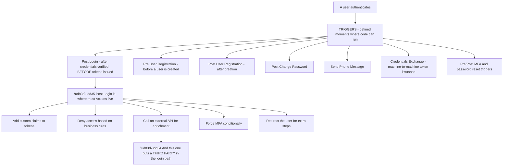
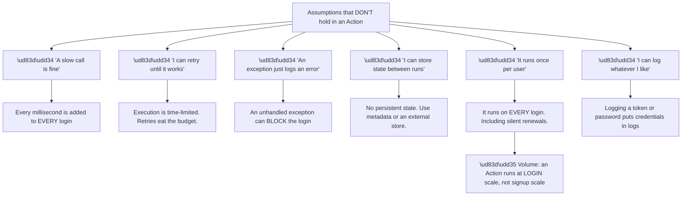
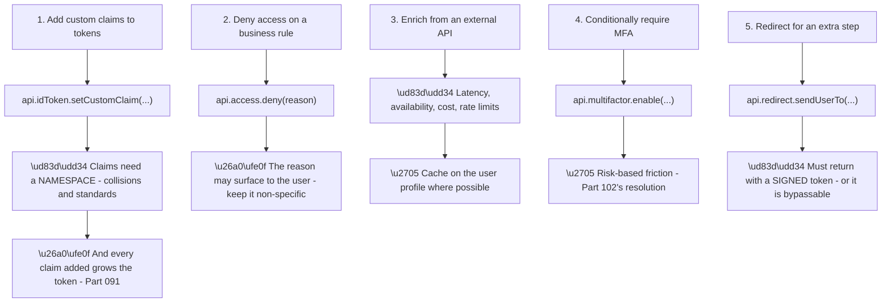
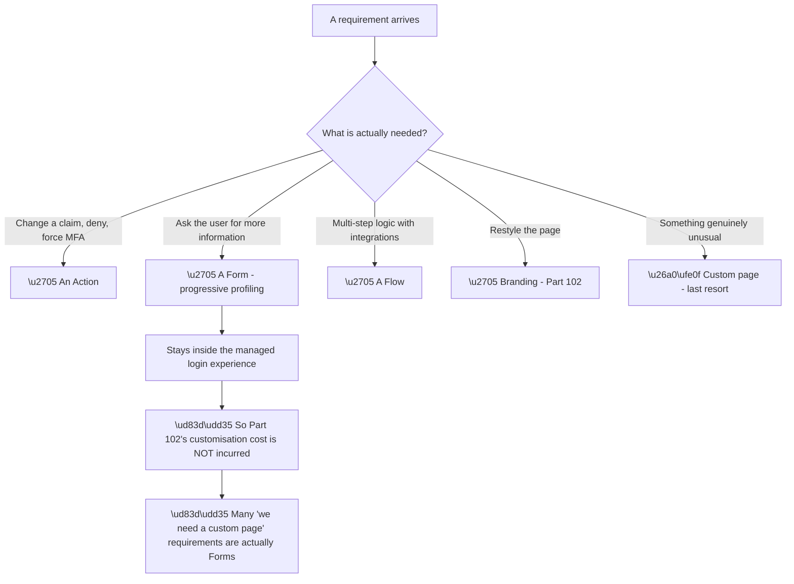
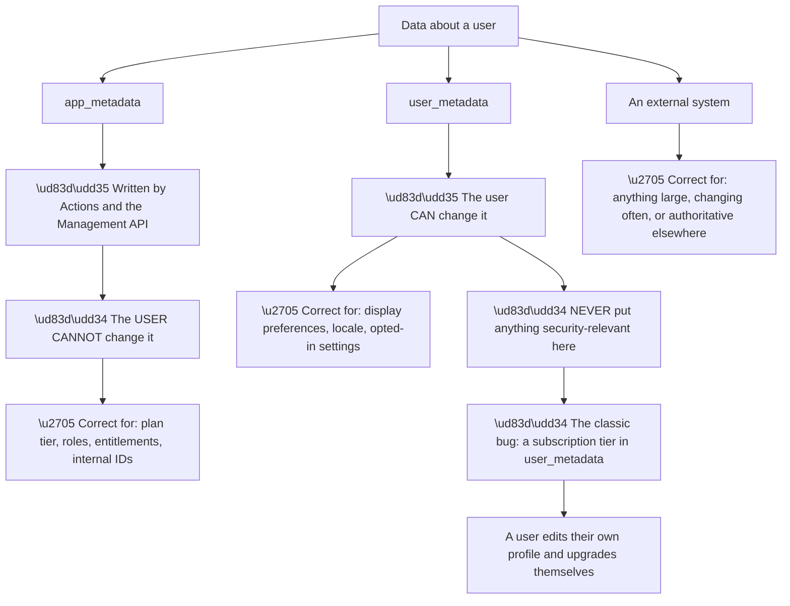
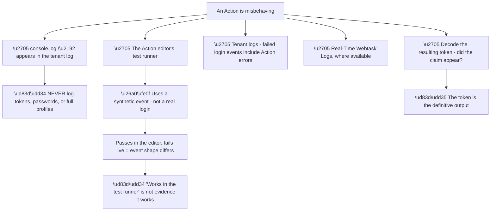
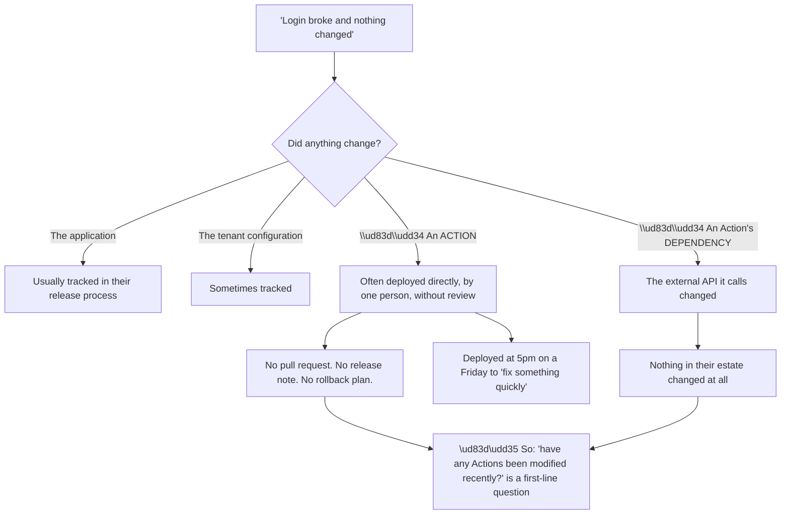
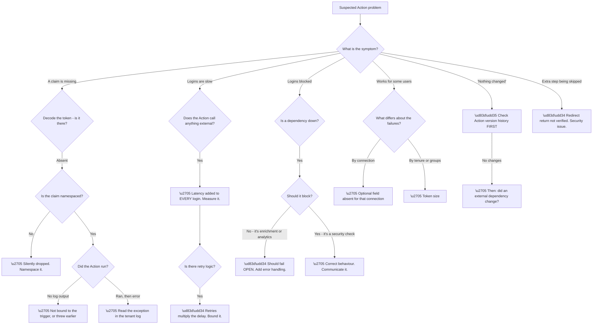

# Part 103 - Extensibility: Actions, Triggers, Flows, and Forms

> Section goal: Understand where customers put their own code inside the authentication pipeline — what it can do, what it must never do, and why running code in a login path has failure modes that ordinary application code does not.

Covers index item **103**. Maps to JD signals: *Auth0*, *JavaScript*, *authentication and authorization*, *APIs*, *troubleshooting complex technical issues*, *developer support*, *security*.

---

## 1. Start From Zero: Code Inside the Login

An **Action** is a JavaScript function the platform executes at a defined moment during authentication. It is the customer's code, running inside the identity pipeline.

**Node W is where the important design decisions concentrate.** Post Login runs after credentials are verified but **before tokens are issued**, which is exactly the point where you can still change the outcome — add claims, deny access, or require a second factor.

**Node R is the risk that defines this Part.** An Action calling an external API means **that API's availability and latency are now part of every login.** A slow enrichment service makes every login slow; an unavailable one may block logins entirely, depending on how the Action handles failure.

**That is the same structural risk as a custom database connection** (Part 099), arriving through a different door — and recognising it as the same pattern is what lets you predict the failure modes before seeing them.

> 💡 **Tie-in to your background:** Actions are JavaScript, and Post Login Actions frequently call REST APIs. **That is precisely your stack** — JavaScript plus API troubleshooting — and it is the second place in the product (after Part 099) where your existing skills apply directly rather than by analogy.

### 🔍 Plain-English deep-dive: an Action is not ordinary application code

Developers write Actions as though they were writing application code, and several assumptions do not hold. **Naming them prevents a whole category of production surprise.**

**Node A5a is the assumption that causes the most expensive mistakes.** An Action that calls a paid third-party enrichment API "once per user" actually calls it **on every authentication** — including silent token renewals, which happen far more often than visible logins.

**The result is a bill or a rate-limit breach that arrives without warning**, and it is entirely predictable from the trigger semantics. **Enrichment that genuinely belongs once per user belongs in Post User Registration**, or should be guarded by checking whether the data already exists on the profile.

**Node A1a is the latency arithmetic worth doing out loud with a customer:**

| Action work | Added to every login |
|---|---|
| A 200 ms API call | +200 ms |
| Two sequential calls | +400 ms |
| A call with a 3-second timeout that times out | **+3 seconds** |
| Retry three times before failing | **+9 seconds** |

**The last row is a genuine outage.** Well-intentioned retry logic turns a degraded dependency into a login timeout, and the customer's users experience it as the identity platform being down.

**Node A3a is the design decision that must be deliberate.** When an external dependency fails, does the Action **fail open** (allow the login, without the enrichment) or **fail closed** (deny it)? **Both are defensible**, and the choice must match what the Action is doing:

| Action purpose | Correct failure behaviour |
|---|---|
| Add a nice-to-have profile claim | **Fail open** — log and continue |
| Add a claim the API requires for authorization | ⚠️ Fail closed, or the API must handle its absence |
| Enforce a security policy | **Fail closed** — never allow on error |
| Fraud or risk check | **Fail closed** |
| Analytics or telemetry | **Fail open** — never block a login for telemetry |

**The last row deserves emphasis** because it is a real and avoidable incident: **an analytics call in a Post Login Action, without error handling, that blocks logins when the analytics provider has an outage.** Nothing about the login actually depended on it.

**Analogy:** a checkpoint that also collects an optional survey. If the survey system is down, you let people through and note it. If the *identity check* is down, you do not. **Where it stops:** a person knows which parts matter. Code treats every failed call identically unless told otherwise.

---

## 2. What Actions Commonly Do

Five patterns cover most real Actions, and each has a characteristic mistake.

**Node P1b is a specification requirement, not a style preference.** Custom claims must be **namespaced** — typically as a URI-like prefix — because unnamespaced names could collide with standard OIDC claims and change their meaning. **An unnamespaced custom claim is silently dropped**, which produces the recognisable ticket *"my custom claim isn't in the token."*

**Node P1c connects to token size.** Every claim added grows the token, and tokens travel in headers and cookies. **An Action adding a large object — a full profile, an array of permissions, a set of feature flags — can push the token past practical limits**, producing the same class of failure as Part 091's group overage.

**Node P2b matters for enumeration.** A denial reason may be shown to the user, so *"your account is not in the beta group"* leaks information about internal state. **Keep denial reasons generic to the user and specific in the logs** — the same principle as Parts 099 and 102.

**Node P5b is the security-critical one.** A redirect Action sends the user away to complete something — accepting terms, entering additional data — and the return must be **verified**. If the Action simply trusts that the user came back, **a user can navigate directly to the return URL and skip the step entirely.** The return must carry a signed token proving the step was genuinely completed.

**Node P3b is the practical mitigation for the most common design problem.** Enrichment data that changes rarely should be **written to the user's metadata on first retrieval and read from there afterwards**, converting a per-login API call into a one-off. **That single change removes latency, cost, and an availability dependency simultaneously.**

---

## 3. Forms and Flows

Beyond Actions, the platform offers higher-level extensibility for cases that would otherwise force a custom login page (Part 102).

| Capability | What it does | Replaces |
|---|---|---|
| **Forms** | Collect additional information during authentication | A custom page, or a post-login app screen |
| **Flows** | Low-code orchestration of steps and integrations | Hand-written Action logic |

**Node R is the redirect promised in Part 102**, and it is worth making early in a customisation conversation. **Progressive profiling — asking for a phone number, a company name, or a consent tick during signup — looks like it needs a custom page and usually does not.** A Form does it while keeping the page managed, which preserves automatic feature updates, accessibility, and localisation.

**The general rule to apply:** *"can this be done with branding, a Form, or an Action?"* **If yes, do not go custom.** Each of those keeps the platform's maintenance benefits intact; a custom page forfeits them permanently.

**Forms have their own consideration worth knowing:** every field added is friction at exactly the moment friction costs most (Part 096). **Progressive profiling is better than a long signup form** precisely because it defers the ask — but a Form that asks for six fields at signup is a long signup form wearing a different name.

### 🔍 Plain-English deep-dive: where to put data, and why metadata has two kinds

Actions and Forms both write data onto the user, and **choosing the wrong store creates a security problem or a maintenance one.**

**Node R1 is a real and entirely avoidable privilege-escalation bug.** `user_metadata` is user-writable by design. **Anything that grants an entitlement must live in `app_metadata`**, which the user cannot modify — and getting this the wrong way round produces a self-service upgrade path nobody intended.

| Data | Where | Why |
|---|---|---|
| Subscription tier | `app_metadata` | Entitlement — must not be user-writable |
| Internal customer ID | `app_metadata` | Authoritative elsewhere |
| Feature flags | `app_metadata` | Entitlement |
| Preferred language | `user_metadata` | The user's own choice |
| Theme preference | `user_metadata` | Harmless |
| Order history | **External** | Large, changes constantly |
| Full CRM record | **External** | Not identity data |

**The last two rows point at a second failure mode**, distinct from the security one. **Metadata is not a database.** Storing large or frequently-changing data there makes every user read heavier, and if it is emitted as claims, **it grows every token** (Part 103's §2).

**The rule worth giving customers:** metadata holds **what identity decisions need**, and nothing else. **If the application would query it anyway from its own store, it does not belong on the identity profile.**

**And there is a caching consequence that surprises people.** Metadata read in an Action is read at login time, so **a value changed after login is not reflected until the next authentication.** A customer expecting an entitlement change to take effect immediately needs either a shorter token lifetime or an application that checks the authoritative source — which is Part 069's revocation trade-off again, in a new setting.

**Analogy:** a membership card that carries your tier and your preferred greeting. The tier must be printed by the issuer; the greeting you can write yourself. Printing the tier in pencil and handing the customer the pencil is the bug. **Where it stops:** a card can be reprinted on the spot. A claim in an issued token stays wrong until the token is reissued.

---

## 4. Debugging Actions

Actions run server-side inside the platform, so debugging them is unlike debugging application code.

**Node E2b is the most common debugging trap.** The test runner supplies a synthetic event object. **A real login's event may contain different fields, different connection details, or absent optional properties** — so an Action that assumes a field exists passes the test and fails in production for a subset of users.

**The signature:** an Action that works for some users and throws for others. **The cause is usually an optional field the developer assumed was always present** — `event.user.email` for a connection that does not provide one (Part 100), or a nested property that is absent for enterprise users.

**Node E5a is the definitive check.** Whatever the logs say, **decode the resulting token**. If the claim is present, the Action ran and set it. If it is absent, either the Action did not run, it threw before reaching that line, or the claim was unnamespaced and dropped.

**A defensive coding pattern worth recommending** to any customer writing Actions:

| Practice | Why |
|---|---|
| Guard every optional field | Connections differ in what they provide |
| Wrap external calls in try/catch | Decide fail-open or fail-closed explicitly |
| Set a short timeout on external calls | Bound the latency added to logins |
| Namespace every custom claim | Or it is dropped |
| Never log secrets or tokens | Logs are broadly readable |
| Check whether enrichment already exists | Avoid per-login API calls |
| Keep the Action small | Complexity in a login path is expensive |

### 🔍 Plain-English deep-dive: Actions are the most common cause of "it worked yesterday"

Because Actions are code deployed independently of the application, **they are the change nobody remembers making.**

**Node R is the question worth asking early on any regression**, and it is frequently not asked because Actions are invisible from the application's perspective. **The application's code is unchanged, their deployment pipeline shows nothing, and their CI is green** — while a login-path change was made directly in a dashboard.

**Node C4 is the subtler variant** and the harder one. **The Action is unchanged and its external dependency changed** — an API returned a new field shape, started rate-limiting, or deprecated an endpoint. **Nothing in the customer's estate changed at all**, which makes "nothing changed" literally true from their side and still wrong.

| Change | Visible where |
|---|---|
| Application code | Their release process |
| Tenant configuration | Tenant logs, sometimes |
| **Action code** | **Action version history** |
| **Action's external dependency** | **Nowhere on their side** |

**The mitigations are process rather than technical**, and they are worth recommending:

**Treat Actions as code.** Version control, review, and deployment through the same pipeline as everything else (Part 110). **An Action deployed from a dashboard has no review and no rollback.**

**Log external call outcomes.** An Action that logs whether its dependency responded turns an invisible failure into a searchable one — **which is the difference between diagnosing row four in minutes and in days.**

**And there is a diagnostic shortcut worth knowing:** if a regression started at a precise moment and the customer is certain nothing changed, **check the Action's version history before anything else.** It costs seconds and it is right often enough to justify going first.

**Analogy:** a shared kitchen where anyone can adjust the oven, and the adjustment is not written anywhere. The recipe is unchanged, the ingredients are unchanged, and the results changed on Tuesday. **Where it stops:** an oven has a visible dial. An Action's history has to be deliberately looked at.

---

## 5. Failure Modes

| # | Failure mode | Symptom | Root cause | First check |
|---|---|---|---|---|
| 1 | Unnamespaced custom claim | Claim absent from token | Silently dropped | Is it namespaced? |
| 2 | External call latency | Slow logins | Added to every login | What does the Action call? |
| 3 | Retry logic | Login timeouts | Retries consume the budget | Is there retry logic? |
| 4 | No error handling | Logins blocked by a dependency outage | Unhandled exception | Fail-open or fail-closed? |
| 5 | Analytics blocking login | Outage from a non-essential call | Wrong failure mode | Should never block |
| 6 | Runs on every login | Unexpected cost or rate limits | Trigger semantics | Should it be Post Registration? |
| 7 | Optional field assumed | Works for some users, throws for others | Event shape differs | Which connection? |
| 8 | Test runner passes, live fails | False confidence | Synthetic event | Test with a real login |
| 9 | Token too large | Header or cookie limits | Too many/large claims | Decode and measure |
| 10 | Denial reason too specific | Information leak | Reason shown to user | Is it generic? |
| 11 | Redirect not verified | Step bypassable | No signed return token | Is the return verified? |
| 12 | Secrets logged | Credentials in logs | `console.log` of a token | Audit the logging |
| 13 | Action changed, untracked | "Nothing changed" regression | Dashboard deployment | Check version history |
| 14 | Dependency changed | Regression with no local change | External API changed | Does the Action log outcomes? |
| 15 | Long Form at signup | Conversion loss | Friction reintroduced | How many fields? |

---

## 6. Troubleshooting Decision Tree: Action Problems

### Worked example

A customer reports that logins started failing intermittently three days ago — roughly one in twenty — with no deployment on their side.

**Node B: intermittent failures.** Not a claim problem, not uniformly slow, not population-specific in any obvious way.

**Node G: check the Action version history.** **No changes in two months.** The customer is telling the truth.

**Node G1: did a dependency change?** The Post Login Action calls a third-party risk-scoring API. **The Action logs nothing about that call**, so there is no direct evidence.

**Reading the tenant logs** shows the failing logins throwing an unhandled exception inside the Action, at the line that reads a field from the API's response.

**Correlating with the provider's changelog** finds it: three days ago the API began returning a `null` for one field under certain conditions, rather than omitting it. **The Action's code assumed the field was either present with a value or absent — not present with a `null`.**

**So nothing in the customer's estate changed.** Their code is identical, their configuration is identical, and their dependency changed a response shape in a way that was backwards-compatible for anyone handling `null` and fatal for anyone not.

**Three recommendations, in order:**

**Immediate:** guard the field access, so a `null` is handled rather than thrown on.

**Then:** decide fail-open or fail-closed deliberately. **It is a risk check, so fail-closed is defensible** — but a silent unhandled exception is not the same as a deliberate fail-closed, and it should be made explicit.

**Then:** log the external call's outcome, so the next dependency change is visible in minutes rather than days.

**What made it findable:** checking the Action's history first and **believing the customer when it showed no changes.** The instinct to keep looking for a local change would have cost days; **accepting "nothing changed" as true and moving to the dependency was the productive move.**

---

## 7. Lab: Write, Break, and Debug Actions

**Purpose.** Write real Actions, reproduce the highest-cost failures deliberately, and build the habits that prevent them.

**Prerequisites.**
- The free tenant from Part 097 with at least two connections
- A local test client (Part 059) and a local JWT decoder
- A small local HTTP endpoint you can make slow or fail on demand
- **Never** write Actions in an employer or customer tenant

**Steps.**

1. **Write a Post Login Action** adding a custom claim. **Deliberately omit the namespace.** Decode the token and **confirm the claim is absent.**
2. **Add the namespace.** Decode again and confirm it appears. **This is failure mode 1.**
3. **Add a `console.log`** and find it in the tenant log. **Note how visible it is** — this is why secrets must never be logged.
4. **Add a call to your local endpoint.** Measure login time before and after. **Record the difference.**
5. **Make the endpoint take 3 seconds.** Log in and **record the user experience.**
6. **Add retry logic — three attempts.** **Record the total delay.** This is failure mode 3.
7. **Make the endpoint fail entirely, with no error handling.** **Confirm the login is blocked.**
8. **Add try/catch and fail open.** Confirm the login now succeeds without the claim. **Write down when fail-open is correct and when it is not.**
9. **Write an Action reading `event.user.email`.** Log in with a connection that provides it, then one that does not (make a GitHub email private, Part 100). **Confirm it throws for one and not the other.**
10. **Run it in the test runner** and confirm it passes there. **This is failure mode 8** — document the discrepancy.
11. **Add many large claims** until the token becomes unwieldy. **Measure its size** and note where problems would begin.
12. **Write a defensive-coding checklist** from §4 in your own words, as something you would send a customer.

**Expected evidence.**
- Tokens with and without the namespaced claim
- Measured login latency at 0 ms, 3 s, and with retries
- A blocked login, then the same Action failing open
- An Action throwing for one connection and not another
- The test runner passing while the live login fails
- A token size measurement
- Your defensive-coding checklist

**Validation rubric.**

| Criterion | Pass |
|---|---|
| Trigger semantics | You can explain what runs when, and how often |
| Namespacing | You can explain why unnamespaced claims are dropped |
| Latency | You can do the arithmetic out loud with a customer |
| Failure mode | You can decide fail-open versus fail-closed by purpose |
| Event shape | You can explain why it works for some users only |
| Test runner | You can explain why passing there proves little |
| Regression | You check Action history first on "nothing changed" |
| Safety | Free tier, no secrets logged, everything deleted |

**Cleanup and privacy.** Delete every Action, the test client, and all test users. **Review your tenant logs and delete anything you logged** — even in a lab, building the habit of not leaving logged data behind matters. **Never write Actions in an employer or customer tenant**, and never point a lab Action at a production API.

---

## 8. JD Mapping

| JD signal | How this Part addresses it |
|---|---|
| Auth0 product knowledge | Actions, triggers, Forms, and Flows |
| JavaScript | The Action programming model |
| APIs | External calls, latency, failure handling |
| Authentication and authorization | Claims, denial, conditional MFA |
| Troubleshooting complex technical issues | Fifteen failure modes and a symptom-first tree |
| Developer support | Defensive coding guidance for customer developers |
| Security | Redirect verification, denial reasons, secret logging |

---

## 9. Candidate Honesty Note

- **Production experience:** JavaScript and REST API integration, including latency, error handling, and dependency failures.
- **Production experience:** regressions where the cause was an unchanged system's changed dependency.
- **Lab experience:** writing Actions, reproducing namespace, latency, retry, and event-shape failures deliberately, as above.
- **Learned architecture:** trigger semantics, fail-open versus fail-closed design, and redirect verification.
- **No direct experience:** supporting production Actions for paying customers, or reviewing customer Action code at scale.
- **How to say it:** *"Actions are JavaScript calling APIs, which is my existing stack, so this is one of the parts I picked up fastest. I've written them, deliberately broken them — namespace, latency, retries, missing optional fields — and I find the most useful insight is that an Action runs on every login, which turns assumptions that are harmless in application code into real cost. I haven't supported production Actions."*

---

## 10. Official Source Anchors

| Source | Why | Accessed |
|---|---|---|
| Auth0 Docs — Actions overview and triggers | The trigger set and execution model | Accessed **26 August 2026** |
| Auth0 Docs — Post Login trigger API | `setCustomClaim`, `deny`, `redirect`, `multifactor` | Accessed **26 August 2026** |
| Auth0 Docs — Custom claims and namespacing | Why unnamespaced claims are dropped | Accessed **26 August 2026** |
| Auth0 Docs — Redirect with Actions | Verifying the return securely | Accessed **26 August 2026** |
| Auth0 Docs — Forms and Flows | Higher-level extensibility | Accessed **26 August 2026** |
| OpenID Connect Core §5.1 | Standard claims that must not be shadowed | Accessed **26 August 2026** |

> **Revalidate:** the trigger list, runtime limits, and available APIs change. Re-check the Auth0 documentation before interview rather than quoting specific limits or trigger names from memory.

---

## ⭐ Likely Interview Questions for This Section

### Q1. "What is an Action and where does it run?"

> *Model answer:* An Action is JavaScript the customer writes that the platform executes at a defined point in the authentication pipeline. The most important trigger is Post Login, which runs after credentials have been verified but before tokens are issued — that is the moment where you can still change the outcome, so it is where custom claims, access denials, conditional MFA, and profile enrichment happen. There are other triggers for registration, password change, and machine-to-machine token issuance. The key thing to understand is that it is the customer's code running inside a login path, which means it inherits properties ordinary application code does not have — it runs on every authentication, its latency is added to every login, and its failures can block sign-in.

### Q2. "What assumptions do developers wrongly make when writing Actions?"

> *Model answer:* Several, and they are all reasonable in ordinary application code. That a slow call is fine — it is not, because every millisecond is added to every login. That they can retry until it works — retries consume the execution budget and three attempts against a timing-out dependency turns a degradation into a login outage. That an unhandled exception just logs an error — it can block the login entirely. That the code runs once per user — it runs on every authentication, including silent renewals, which is how a paid enrichment API bill arrives unexpectedly. And that they can log freely — logging a token puts a live credential into logs that are broadly readable. The one I would flag first is the per-login frequency, because it turns harmless assumptions into real cost.

### Q3. "A customer's custom claim isn't appearing in the token. How do you narrow it?"

> *Model answer:* Decode the token first, because that is the definitive output — whatever the logs suggest, the token tells you whether the claim was set. If it is absent, my first check is whether it is namespaced. Custom claims have to carry a namespace, typically a URI-like prefix, so they cannot collide with standard OIDC claims — and an unnamespaced claim is silently dropped, which produces exactly this symptom with no error anywhere. If it is namespaced, I check whether the Action ran at all: no log output means it is not bound to the trigger or threw before that line. If it ran and threw, the exception is in the tenant log. It is a short chain and each step eliminates cleanly.

### Q4. "An external API in an Action goes down. Should the login fail?"

> *Model answer:* It depends entirely on what the Action does, and the important thing is that the choice is deliberate rather than accidental. If it is adding a nice-to-have profile claim, or sending analytics, it should fail open — log it and let the login proceed, because nothing about authentication actually depended on it. Blocking logins because an analytics provider had an outage is a real and completely avoidable incident. If it is enforcing a security policy or performing a fraud check, fail closed is correct — allowing access when the check could not run defeats the purpose. What I would push back on is an unhandled exception, because that is not a decision, it is a default. Even where fail-closed is right, it should be explicit and it should log why.

### Q5. "An Action works for some users and throws for others. What's your hypothesis?"

> *Model answer:* An optional field being assumed present. The event object passed to an Action differs by connection — a user from GitHub may have no email if they made it private, an enterprise user may have different nested properties, a machine-to-machine token has no user at all. So code reading `event.user.email` without a guard works for most connections and throws for one. What reinforces this hypothesis is that the Action editor's test runner uses a synthetic event, so the code passes in testing and fails live for a subset of real users — "works in the test runner" is not evidence it works. I would confirm by checking which connection the failing users came through, which the tenant logs show directly.

### Q6. "A customer says login broke and nothing changed. Where do you look?"

> *Model answer:* At the Action version history, first, because Actions are the change nobody remembers making — they are frequently deployed straight from a dashboard by one person, with no pull request, no release note, and no rollback plan, so the customer's release process and CI genuinely show nothing. If the history confirms no changes, I believe them and move to the dependency: an external API the Action calls may have changed a response shape, started rate-limiting, or deprecated an endpoint, in which case nothing in their estate changed at all and "nothing changed" is literally true. I saw exactly that shape in a scenario where an API started returning null for a field instead of omitting it — backwards-compatible for anyone handling null, fatal for anyone not.

### Q7. "A customer wants a custom login page for progressive profiling. What do you suggest?"

> *Model answer:* A Form, almost certainly. Progressive profiling — asking for a phone number, a company name, or a consent tick — looks like it needs a custom page and usually does not. A Form does it inside the managed login experience, which means they keep automatic feature updates, accessibility, and localisation, none of which they would keep with a custom page. The general rule I would apply is: can this be done with branding, a Form, or an Action? If yes, do not go custom. I would also raise the conversion point — every field is friction at exactly the moment friction costs most — so a Form asking six questions at signup is just a long signup form under a different name. Deferring the ask is the actual value of progressive profiling.

### Q8. "What would you tell a customer about writing safe Actions?"

> *Model answer:* Seven things, and I would give them as a checklist rather than prose. Guard every optional field, because connections differ in what they provide. Wrap external calls in try/catch and decide fail-open or fail-closed explicitly. Set a short timeout on anything external, to bound the latency added to every login. Namespace every custom claim or it will be dropped. Never log tokens, passwords, or full profiles, because logs are broadly readable. Check whether enrichment data already exists on the profile before fetching it again, which turns a per-login API call into a one-off. And keep Actions small, because complexity in a login path is unusually expensive. I would add one process point: treat Actions as code — version control, review, and deployment through the same pipeline as everything else, because a dashboard deployment has no review and no rollback.

---

## 🧠 30-Second Memory Hooks

- **An Action is the customer's JavaScript running inside the login.**
- **Post Login runs after credentials, before tokens** — the last point you can change the outcome.
- **It runs on EVERY login, including silent renewals.**
- **Every millisecond is added to every login. Retries multiply it.**
- **Fail open for enrichment and analytics. Fail closed for security checks. Never by accident.**
- **Custom claims must be namespaced** or they are silently dropped.
- **Every claim grows the token** — same limit family as group overage.
- **Denial reasons: generic to the user, specific in the log.**
- **A redirect Action's return must be verified** or the step is bypassable.
- **Test runner uses a synthetic event.** Passing there proves little.
- **Works for some users = an optional field assumed present.**
- **"Nothing changed" → check Action version history first.**
- **Then check whether the Action's dependency changed.**
- **Many "we need a custom page" requirements are Forms.**

---

## ✅ Completion Checklist

- [ ] I can explain what an Action is and when Post Login runs
- [ ] I can name the assumptions that do not hold in an Action
- [ ] I can do the login-latency arithmetic out loud
- [ ] I can decide fail-open versus fail-closed by the Action's purpose
- [ ] I can explain claim namespacing and the silent-drop symptom
- [ ] I can explain why redirect returns must be verified
- [ ] I can explain why the test runner gives false confidence
- [ ] I check Action version history first on a "nothing changed" regression
- [ ] I can redirect a custom-page request to a Form where appropriate
- [ ] I have completed the lab, including the retry and fail-open demonstrations
- [ ] I can state honestly what I have written and what I have not supported

*Next suggested section:* **[Part 104 - Organizations, B2B Multi-Tenancy, and Customer-Managed SSO](Part-104-organizations-b2b-multi-tenancy-and-customer-managed-sso.md)** — how one tenant serves many business customers, each with their own connections, branding, and members.
