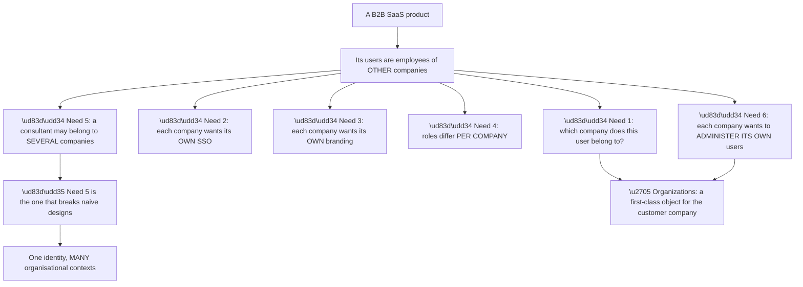
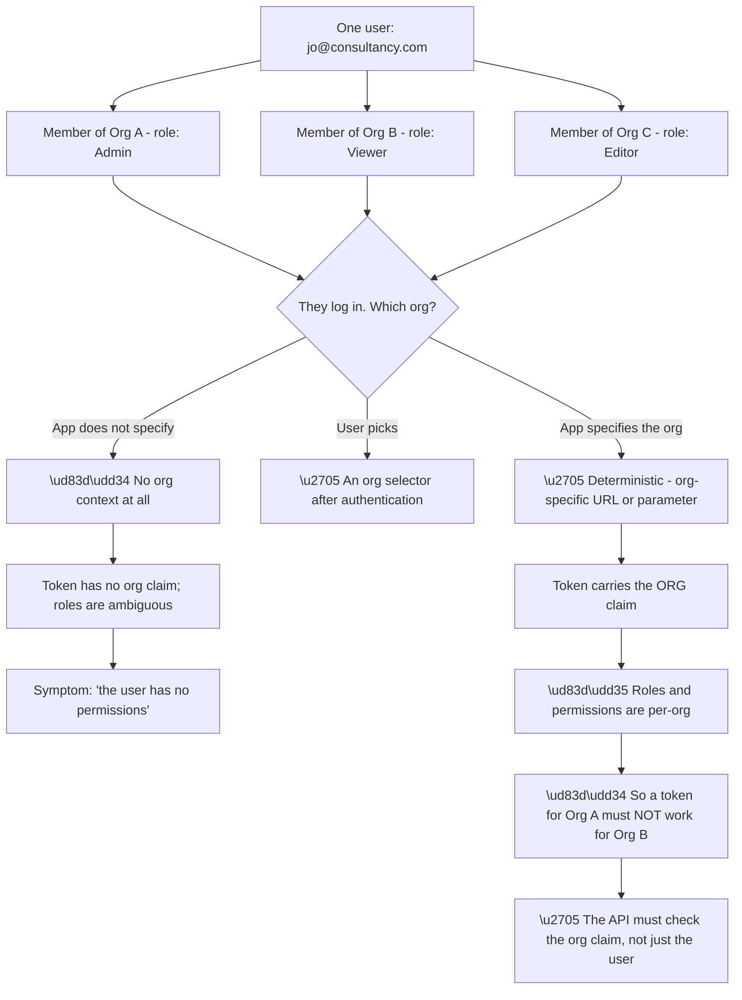
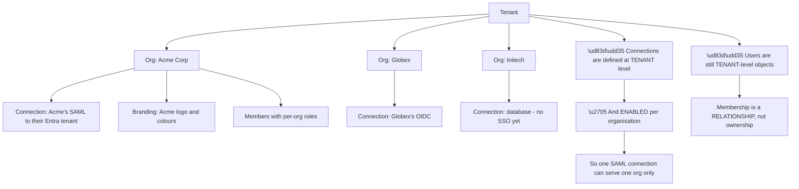
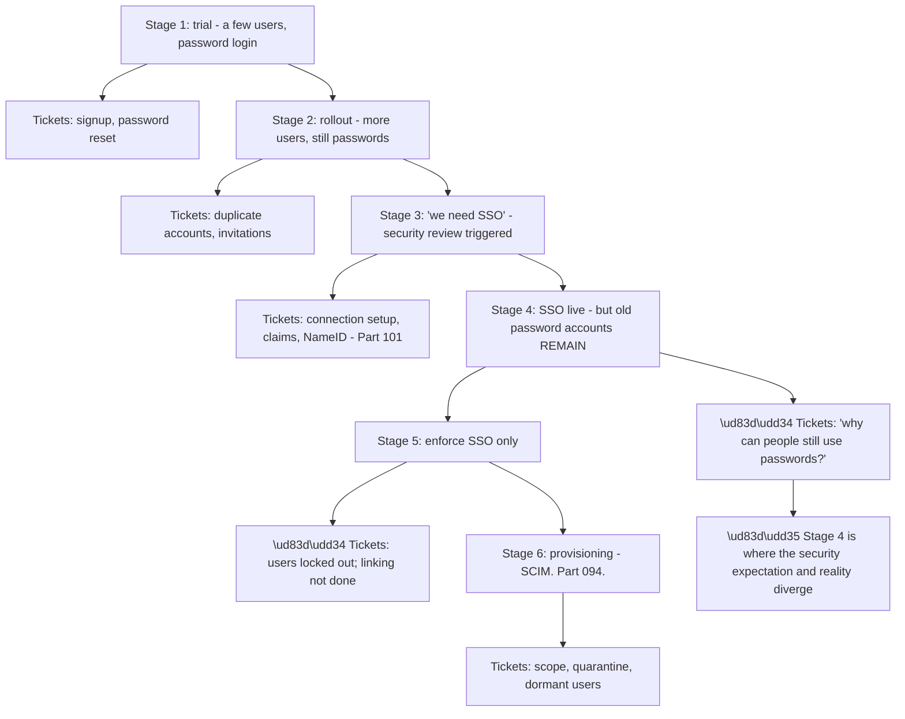
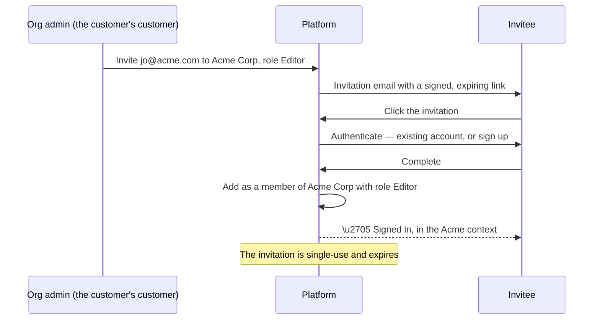
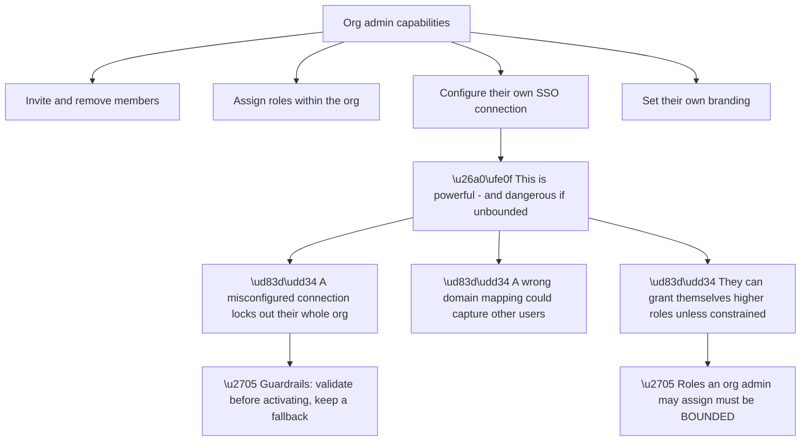
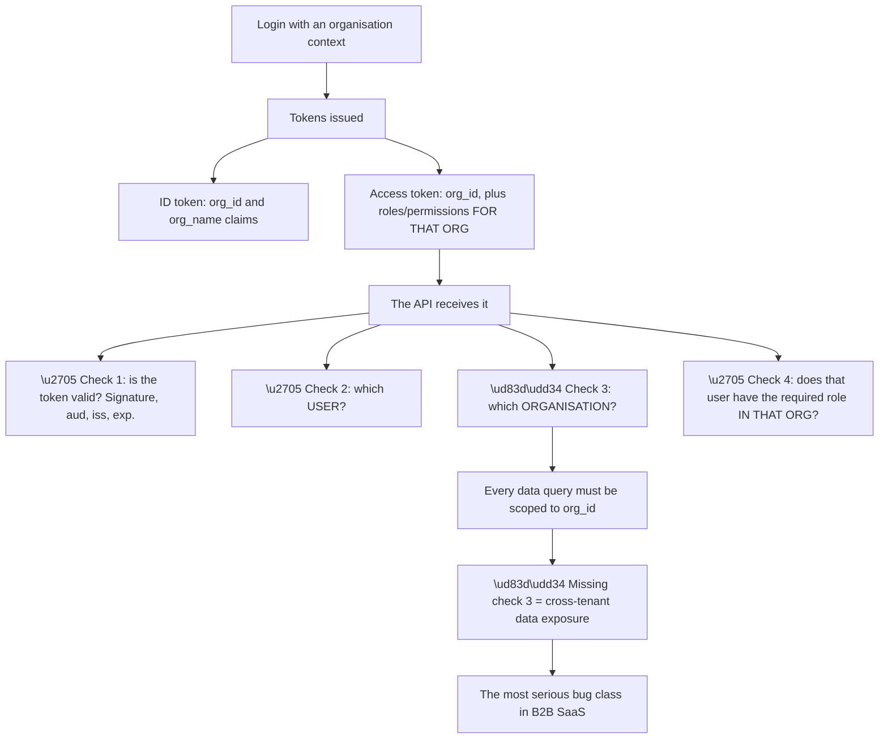
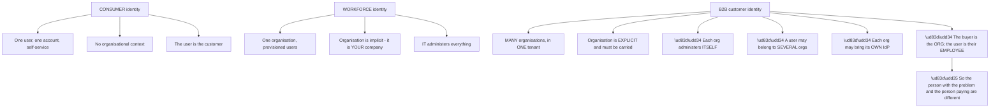
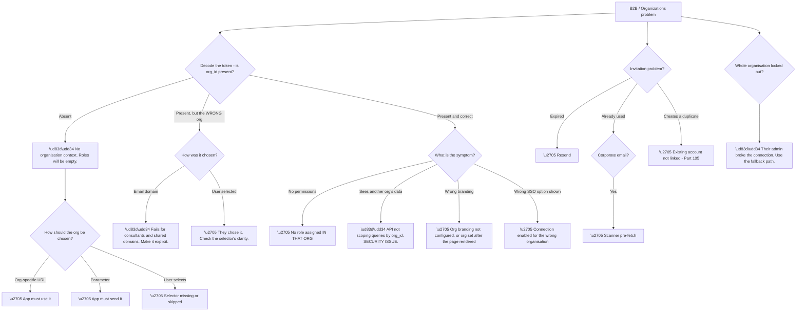

# Part 104 - Organizations, B2B Multi-Tenancy, and Customer-Managed SSO

> Section goal: Understand how one tenant serves many business customers — each with their own members, connections, branding, and roles — and why B2B identity is a genuinely different problem from both consumer and workforce identity.

Covers index item **104**. Maps to JD signals: *Auth0*, *customer identity*, *enterprise connections*, *authorization*, *multi-tenancy*, *troubleshooting complex technical issues*, *customer-facing communication*.

---

## 1. Start From Zero: The B2B Problem

Parts 099–101 covered connections. **A B2B product needs something those alone cannot provide: the concept of a customer organisation.**

**Node H is the requirement that defeats the obvious approaches.** A consultant who works with three client companies has **one identity and three contexts** — different roles, different data, different permissions in each. **Storing "company" as an attribute on the user cannot express that**, and separate tenants per customer means three separate accounts for one person.

**An Organization is a first-class object** representing a business customer, with its own members, connections, branding, roles, and invitations. **A user can be a member of several**, and each login carries an organisation context.

| Approach | Handles multi-org users? | Cost |
|---|---|---|
| Company as a user attribute | ❌ | Simple until it isn't |
| One tenant per customer | ❌ Separate identities | Unmanageable at scale |
| **Organizations** | ✅ | The right model |

**Node N6 is the requirement that drives commercial value.** Enterprise buyers want to manage their own users — invite colleagues, assign roles, configure their own SSO — **without raising a ticket with the vendor.** Delegated administration is a feature enterprises pay for, and it removes support load at the same time.

> 💡 **Tie-in to your background:** enterprise support at Microsoft means you have worked with organisations that are themselves customers of a platform, each with their own administrators and configuration. **The three-party structure from Part 101 is the same shape**, and Organizations is where it becomes an explicit product concept.

### 🔍 Plain-English deep-dive: the same person, three organisations, three different answers

Multi-organisation membership is the defining B2B complication, and its implications reach into tokens, sessions, and authorization.

**Node T3 is the security requirement that is easiest to get wrong.** An API that authorises on the user's identity alone — *"is this user an Admin?"* — **grants Org A's admin rights inside Org B's data**, because the user genuinely is an admin, just not there.

**The correct check is always two-part:** which user, **and in which organisation context.** **Every data access must be scoped to the organisation in the token**, not merely to the authenticated user.

**Node C2 is the most common non-security symptom.** An application that does not specify an organisation gets a token with no organisation claim, so **role-based checks find nothing** and the user appears to have no permissions at all. **They have permissions — in three organisations — and none apply without a context.**

| Login approach | Org context | Suits |
|---|---|---|
| Org-specific URL (`/login/acme`) | ✅ Deterministic | Most B2B products |
| Organisation parameter on the request | ✅ Deterministic | App knows the org |
| Selector after authentication | ✅ Explicit | Multi-org users |
| Email domain inference | ⚠️ Fails for consultants and free-mail | Limited use |
| No organisation | ❌ | **Broken for B2B** |

**Row four fails precisely for the users this model exists to serve.** A consultant at `consultancy.com` cannot be routed to a client's organisation by their email domain — **their domain is their own employer's**, and that is exactly the case Organizations was designed for.

**Analogy:** a contractor with passes to three client sites. They are one person, and their access rights at each site are entirely separate. A pass reader that identifies the person but not the site would let them into the wrong building. **Where it stops:** a physical pass is scoped by where you present it. A token has to carry the context explicitly, or nothing constrains it.

---

## 2. What an Organization Contains

| Element | Purpose |
|---|---|
| **Members** | Users belonging to this organisation |
| **Enabled connections** | Which identity sources this org may use |
| **Branding** | Logo and colours shown to this org's users |
| **Roles** | Per-organisation role assignments |
| **Invitations** | Inviting new members with a role |
| **Metadata** | Custom attributes on the organisation |

**Node U1 is the structural point that explains a lot of behaviour.** A user is a tenant-level object; **organisation membership is a relationship between them.** So removing a user from an organisation does not delete the user — they still exist, and may still be a member of others.

**That matters for deprovisioning conversations.** *"We removed them from our organisation"* means they lost access to that organisation's data. **It does not mean the account is gone**, and being clear about that avoids a false sense of completion.

**Connection enablement per organisation** is the mechanism behind customer-managed SSO. **Acme's SAML connection is enabled only for Acme's organisation**, so Globex users never see it and cannot use it. **That isolation is the product feature**, and it is why connections are tenant-defined but organisation-enabled.

**Organisation branding** is what makes a shared product feel dedicated. **Acme's employees see Acme's logo on the login page**, which matters commercially and costs nothing beyond configuration.

### 🔍 Plain-English deep-dive: how a B2B customer's SSO adoption actually progresses

Organisations rarely arrive with SSO configured. **They progress through stages, and each stage has its own characteristic tickets** — which makes the sequence worth knowing in advance.

**Node R marks the gap that causes the most difficult conversation.** The organisation has bought SSO, believes access is now controlled by their IdP, and **their employees' original password accounts still work** — which means a leaver retains a way in. **They discover this during an audit, not gracefully.**

| Stage | The question to ask *before* it |
|---|---|
| Before stage 3 | "Do any of your users already have password accounts?" |
| Before stage 4 | "Do you want password login disabled for your domains?" |
| Before stage 5 | "Have existing accounts been linked to their SSO identities?" |
| Before stage 6 | "Do you need deprovisioning as well as authentication?" |

**Every one of those questions prevents a specific ticket** in the stage that follows, and asking them early is the difference between a smooth adoption and six months of escalations.

**Stage 5 is the highest-risk transition.** Enforcing SSO-only without first linking existing accounts **locks users out of their own data** — their password account holds their history, and their new SSO identity is empty. **That is Part 098's separate-identity model arriving at the worst possible moment**, and it produces urgent tickets from users who did nothing wrong.

**The correct sequence is linking first, enforcement second.** Link on first federated sign-in with verified evidence (Part 105), let the population migrate naturally, then enforce. **Reversing those two steps is the most common B2B onboarding mistake**, and it is entirely avoidable by asking one question.

**Analogy:** issuing everyone a new company pass and then disabling the old ones — without checking that each new pass is linked to the right person's records. Everyone has a pass; nobody's history follows them. **Where it stops:** a records office could reconcile by name. Identity systems will not guess, and guessing is exactly what makes accounts stealable.

---

## 3. Invitations and Delegated Administration

Invitations are how organisations grow without vendor involvement, and they have specific failure modes.

**The invitation carries three things:** the organisation, the role, and proof that it came from an authorised inviter. **All three must survive the round trip**, and the link must be signed so it cannot be forged or altered.

| Failure | Cause |
|---|---|
| Invitation expired | Time limit reached |
| Already used | Single-use, or **scanner pre-fetch** (Part 099) |
| Wrong email | Invitation is bound to the address |
| Email not delivered | Deliverability |
| Invitee already a member | Duplicate invitation |
| Invitee has an existing account | Should join, not duplicate — Part 105 |

**The scanner pre-fetch problem is worse here than for password resets**, because invitations are inherently B2B — **the recipients are corporate email users**, precisely the population whose mail is scanned. **A B2B invitation flow will hit this**, and it should be designed for.

**Delegated administration** is the commercially significant capability, and it needs care:

**Node W1 is the support scenario to anticipate.** An organisation admin configures their own SAML connection incorrectly — wrong certificate, wrong entity ID — and **locks out every user in their organisation.** They cannot log in to fix it, because logging in requires the connection they just broke.

**The mitigation is a fallback path:** keeping at least one administrator able to authenticate through a different connection, **or a documented recovery route.** Raising this proactively during self-service SSO onboarding prevents a genuinely bad customer experience.

**Node W3 is the privilege-escalation concern.** If an organisation admin can assign any role, **they can assign themselves roles intended for the vendor's own staff.** The set of roles an organisation admin may grant must be explicitly bounded — and this is worth checking whenever delegated administration is discussed.

---

## 4. Tokens, Roles, and Authorization in a B2B Context

The organisation context has to reach the application, and how it does so determines whether authorization is correct.

**Node R1 is not an exaggeration.** Cross-tenant data exposure — one business customer seeing another's data — is among the most damaging bugs a B2B product can ship. **It usually originates in an API that authorises on user identity and forgets organisation scope.**

**The pattern to look for in a customer's code**, and worth asking about directly:

| Query shape | Safe? |
|---|---|
| `SELECT * FROM orders WHERE id = ?` | ❌ **No org scope** |
| `SELECT * FROM orders WHERE id = ? AND org_id = ?` | ✅ |
| Authorization checked on user role only | ❌ Role is per-org |
| Authorization checked on user role **within org** | ✅ |

**Row one is the classic mistake**, and it is invisible in testing because a developer testing with one organisation's data never encounters another's. **It surfaces when a user with access to two organisations guesses or enumerates an identifier** — or, more commonly, when someone reports seeing a record they should not.

**Role assignment is per-organisation**, which has a practical consequence worth stating: **a user's roles change depending on which organisation they logged into.** The same person, same credentials, different token contents. **That is correct and it confuses developers**, who expect roles to be a property of the user.

### 🔍 Plain-English deep-dive: B2B is neither consumer nor workforce identity

B2B customer identity has requirements that neither of the other two models handles, which explains why it needs its own concepts.

**Node R is the support-relevant consequence**, and it changes how tickets should be handled. **In consumer identity, the affected user is the customer. In B2B, the affected user is an employee of a company that is a customer of your customer.**

**Three parties again** (Part 101), and it determines who can act:

| Problem | Who can fix it |
|---|---|
| Their SSO connection is broken | The **organisation's** IT team |
| They cannot be invited | The **organisation's** admin |
| Their role is wrong | The **organisation's** admin |
| The product has a bug | **Your customer**, with your help |
| The platform is failing | **You** |

**Four of five rows are not you**, and being able to route quickly and accurately is the primary support skill here. **The failure mode is a ticket that bounces between three organisations because nobody established who owns the fix.**

**And the routing has to be done kindly**, because the end user is frustrated and did nothing wrong. **"This needs your organisation's administrator, and here is exactly what they need to change"** is helpful; "not our problem" is the same information delivered uselessly (Part 095).

**One more distinction worth holding:** in B2B, **churn is at organisation level.** Losing a customer means losing every user in that organisation at once. **That makes organisation-level problems commercially serious in a way individual consumer problems are not** — a broken SSO connection for one organisation may be a hundred users and a renewal conversation.

**Analogy:** a serviced office building. The landlord has many tenant companies; each company manages its own staff, may bring its own door-entry system, and its employees may also work for another tenant. **Where it stops:** a building has physical floors enforcing separation. In software, the separation is a value in a token that every query must respect.

---

## 5. Failure Modes

| # | Failure mode | Symptom | Root cause | First check |
|---|---|---|---|---|
| 1 | No organisation context | User has no permissions | No `org_id` in the token | Is an org specified at login? |
| 2 | API ignores `org_id` | **Cross-tenant data exposure** | Authorising on user only | How are queries scoped? |
| 3 | Roles assumed user-level | Wrong permissions | Roles are per-org | Which org did they log into? |
| 4 | Connection enabled for the wrong org | Users see another org's SSO | Enablement error | Which orgs is it enabled for? |
| 5 | Domain-based routing for consultants | Routed to the wrong org | Their domain is their employer's | Is routing explicit? |
| 6 | Invitation expired | Cannot join | Time limit | When was it sent? |
| 7 | Invitation pre-fetched | "Already used" | Corporate email scanner | Corporate domains? |
| 8 | Invitee has an existing account | Duplicate instead of joining | No linking | Part 105 |
| 9 | Org admin breaks their SSO | **Whole org locked out** | Self-service misconfiguration | Is there a fallback? |
| 10 | Org admin escalates privileges | Unauthorised roles | Unbounded role assignment | Which roles can they grant? |
| 11 | Removed from org, still exists | "We deleted them" | Membership is a relationship | Was the account deprovisioned? |
| 12 | Branding not applied | Generic login page | Org context missing | Was the org specified? |
| 13 | User in many orgs, no selector | Lands in the wrong context | No selection mechanism | How is the org chosen? |
| 14 | Token size with many roles | Header limits | Roles per org in the token | Decode and measure |

---

## 6. Troubleshooting Decision Tree: Organizations

### Worked example

A customer escalates urgently: an enterprise organisation's users report seeing **another organisation's records** in a shared list view.

**This is node D2 before any investigation** — and it is the most serious ticket shape in B2B. **Treat it as a security incident, not a bug report.**

**First: contain.** The immediate question is scope — how many records, which organisations, and for how long. **That determines the disclosure obligation**, and establishing it comes before diagnosis.

**Then: decode a token.** The `org_id` claim is present and correct. **The token is fine**, which locates the fault definitively in the application.

**Reading their query.** The list endpoint filters by the user's identity — because the user is a member of both organisations, and the query returns everything they can see **across all their memberships.**

**The developer's reasoning was not unreasonable:** *"show this user their records."* **The bug is that "their records" in a B2B product means "their records in this organisation context,"** and the query has no `org_id` filter.

**Why it was never caught:** every test user belonged to exactly one organisation. **With one membership, the two queries return identical results**, so the missing filter is invisible in every test.

**The fix** is to scope the query by `org_id` from the token.

**The recommendations that matter more:**

**Add a multi-organisation test user** to their test suite — this class of bug is invisible without one.

**Audit every query** that returns organisation-scoped data, not just this endpoint. **A missing filter in one place suggests the pattern was not established**, and there are likely others.

**Consider a data-access layer that requires organisation scope**, so the safe path is the default and omitting it is a compile-time or review-time error rather than a silent one.

**What made it diagnosable quickly:** decoding the token first. **Confirming `org_id` was present and correct eliminated the entire identity layer in one step** and placed the fault in application code — which is where cross-tenant exposure almost always lives.

---

## 7. Lab: Build a Multi-Organisation Setup

**Purpose.** Create organisations, experience multi-org membership, and reproduce the missing-context and cross-org failures deliberately.

**Prerequisites.**
- The free tenant from Part 097
- A local test client (Part 059) and a local JWT decoder
- **Never** use an employer or customer tenant

**Steps.**

1. **Create two organisations** with fictional names.
2. **Enable a database connection** for both. **Enable a second connection for only one.**
3. **Create a user and add them as a member of both**, with **different roles** in each.
4. **Log in with no organisation specified.** Decode the token. **Confirm `org_id` is absent and roles are empty.** This is failure mode 1.
5. **Log in specifying the first organisation.** Decode. **Confirm `org_id` and the first role.**
6. **Log in specifying the second.** Decode. **Confirm a different role for the same user.** Write down why this surprises developers.
7. **Configure different branding for each organisation.** Confirm the login page differs.
8. **Attempt to log in to an organisation for which a connection is not enabled.** Record what happens.
9. **Send an invitation** to a second fictional address you control. **Record the flow and the link's properties.**
10. **Let an invitation expire**, then attempt it. Record the error.
11. **Write a scoped-query example and an unscoped one** in pseudocode, and explain in writing why the unscoped one passes tests with single-org users.
12. **Write the fallback plan** for an organisation admin who breaks their own SSO connection.

**Expected evidence.**
- Two organisations with different connections and branding
- Three decoded tokens: no org, org A, org B — with different roles
- Evidence of a connection unavailable to one organisation
- An invitation flow captured, and an expired one
- Your scoped/unscoped query explanation
- Your fallback plan

**Validation rubric.**

| Criterion | Pass |
|---|---|
| Why Organizations | You can explain what user attributes and separate tenants cannot do |
| Multi-org | You can explain one identity, many contexts, different roles |
| Token | You can explain what `org_id` is for and why APIs must use it |
| Security | You can explain cross-tenant exposure and why tests miss it |
| Delegated admin | You can name the lockout and escalation risks |
| Routing | You can explain why email-domain routing fails for consultants |
| Safety | Free tier, fictional organisations, everything deleted |

**Cleanup and privacy.** Delete both organisations, all members, invitations, and connections. **Use entirely fictional company names** — do not model a lab organisation on a real employer or customer. **Never create organisations in a work tenant**, and delete any captured tokens.

---

## 8. JD Mapping

| JD signal | How this Part addresses it |
|---|---|
| Auth0 product knowledge | Organizations, membership, invitations, delegated admin |
| Customer identity | The B2B model as distinct from consumer and workforce |
| Enterprise connections | Per-organisation connection enablement |
| Authorization | Per-organisation roles and org-scoped API checks |
| Troubleshooting complex technical issues | Fourteen failure modes and a token-first decision tree |
| Security | Cross-tenant exposure as the primary risk |
| Customer-facing communication | Routing across three parties, kindly and accurately |

---

## 9. Candidate Honesty Note

- **Production experience:** supporting enterprise customers who are themselves organisations with their own administrators — the three-party structure is familiar.
- **Production experience:** handling issues where the fix belongs to a party other than the one reporting it.
- **Lab experience:** building a two-organisation setup, demonstrating per-org roles, and reasoning through the cross-tenant query bug, as above.
- **Learned architecture:** delegated administration risks, invitation flows, and org-scoped authorization patterns.
- **No direct experience:** supporting a production B2B multi-tenant deployment or handling a real cross-tenant exposure incident.
- **How to say it:** *"The three-party structure is familiar from enterprise support — the person with the problem, the organisation they work for, and the platform. Organizations as a product concept I've built in a lab, including showing the same user getting different roles in different organisations. I haven't handled a real cross-tenant exposure, and I'd treat one as a security incident rather than a bug from the first message."*

---

## 10. Official Source Anchors

| Source | Why | Accessed |
|---|---|---|
| Auth0 Docs — Organizations | The object model and capabilities | Accessed **26 August 2026** |
| Auth0 Docs — Organizations for B2B SaaS | Architecture guidance | Accessed **26 August 2026** |
| Auth0 Docs — Invite organization members | Invitation flow and constraints | Accessed **26 August 2026** |
| Auth0 Docs — Role-based access control | Per-organisation roles | Accessed **26 August 2026** |
| OWASP — Broken Access Control | Cross-tenant exposure as a top risk | Accessed **26 August 2026** |
| Auth0 Docs — Configure organization branding | Per-org login experience | Accessed **26 August 2026** |

> **Revalidate:** Organizations capabilities and the delegated-administration surface expand regularly. Re-check the current documentation before advising on what an organisation admin can and cannot do.

---

## ⭐ Likely Interview Questions for This Section

### Q1. "Why do B2B products need an Organizations concept rather than just a company attribute on the user?"

> *Model answer:* Because a user can belong to more than one organisation, and an attribute cannot express that. A consultant working with three client companies is one person with three contexts — different roles, different data, different permissions in each. Storing company as a user attribute forces one value, and creating a separate tenant per customer means three separate accounts for one human, with three passwords and no shared identity. Organizations makes the customer company a first-class object with its own members, connections, branding, and roles, and membership becomes a relationship rather than a property. Every login then carries an organisation context, which is what makes per-organisation roles and per-organisation data scoping possible.

### Q2. "What is the most serious bug class in B2B identity?"

> *Model answer:* Cross-tenant data exposure — one business customer seeing another's data. It almost always originates in an API that authorises on user identity and forgets the organisation scope: a query that filters by the user rather than by the user within the organisation context in the token. What makes it insidious is that it is invisible in testing, because if every test user belongs to exactly one organisation, the scoped and unscoped queries return identical results. It only appears when a user with multiple memberships uses the system. So the two recommendations I would make are to add a multi-organisation user to the test suite, and to make organisation scope structurally required in the data access layer so omitting it is a review-time error rather than a silent one.

### Q3. "A user says they have no permissions. Where do you look?"

> *Model answer:* At the token, first — specifically whether the `org_id` claim is present. Roles in a B2B product are assigned per organisation, so a token with no organisation context has no roles to resolve, and the user appears to have nothing. They usually have permissions in several organisations and none apply without a context. If `org_id` is absent, the question becomes how the organisation should be selected: an organisation-specific URL, a parameter on the authorization request, or a selector after authentication. If `org_id` is present and correct, then the user genuinely has no role assigned in that organisation, which is an administrative question for that organisation's admin rather than a technical one.

### Q4. "Why is routing users by email domain a problem in B2B?"

> *Model answer:* Because it fails for exactly the users the model exists to serve. A consultant at consultancy.com working with three clients cannot be routed to a client's organisation by domain — their domain belongs to their own employer. The same applies to contractors, to anyone using a free-mail address, and to organisations that share a parent domain. Domain routing works for the simple case of an employee at the customer company and breaks for everything else, which means it breaks silently and unpredictably. Explicit routing is better: an organisation-specific URL like /login/acme, or the application sending the organisation parameter, or a selector for users with multiple memberships. Deterministic beats inferred here.

### Q5. "What are the risks of letting organisation admins configure their own SSO?"

> *Model answer:* Two, and both need guardrails. The first is lockout: an admin configures their SAML connection with the wrong certificate or entity ID and locks out every user in their organisation, including themselves — they cannot log in to fix it because fixing it requires the connection they just broke. The mitigation is a documented fallback path, keeping at least one administrator able to authenticate through a different connection. The second is privilege escalation: if an admin can assign any role, they can assign themselves roles intended for the vendor's own staff, so the set of roles they may grant has to be explicitly bounded. Self-service SSO is commercially valuable and it removes support load, but it hands a powerful control to someone outside your organisation.

### Q6. "How is B2B identity different from workforce and consumer identity?"

> *Model answer:* Consumer identity is one user, one account, self-service, with no organisational context — the user is the customer. Workforce identity is one organisation with provisioned users, where the organisation is implicit because it is your own company and IT administers everything. B2B customer identity is many organisations inside one tenant, where the organisation is explicit and must be carried in every token, each organisation administers itself, users may belong to several, and each may bring its own identity provider. The support consequence is that the person with the problem and the person paying are different people at different companies — so most tickets need routing rather than fixing, and doing that quickly and kindly is the primary skill.

### Q7. "The same user gets different roles depending on how they log in. Is that a bug?"

> *Model answer:* No, that is the model working correctly. Roles are assigned per organisation, so the same person with the same credentials gets different token contents depending on which organisation context they authenticated into — Admin in one, Viewer in another. It surprises developers because they expect roles to be a property of the user, and in consumer and workforce identity they effectively are. In B2B they are a property of the membership. The practical implication is that an API must never cache a user's roles independently of the organisation context, and must never authorise on "is this user an admin" without also asking "in which organisation" — otherwise it grants one organisation's admin rights inside another's data.

### Q8. "An organisation's users say they were removed but still have access. Explain."

> *Model answer:* Removing a member from an organisation removes that relationship — they lose access to that organisation's data — but the user object still exists at tenant level and may still be a member of other organisations. So "we removed them" and "the account is gone" are different statements, and being clear about that avoids a false sense of completion. Beyond that, the Part 093 session point applies: existing sessions and unexpired tokens continue until they lapse, so removal stops future access rather than terminating current access instantly. If they need immediate revocation, that is a conversation about session lifetime, token lifetime, and an explicit revocation call — and I would set that expectation honestly rather than let them assume removal is instantaneous.

---

## 🧠 30-Second Memory Hooks

- **Organizations exist because one user can belong to many companies.**
- **Membership is a relationship, not ownership.** Removing ≠ deleting.
- **Connections are tenant-defined, organisation-enabled.**
- **Roles are per organisation.** Same user, different roles, different tokens.
- **No `org_id` in the token → no roles → "user has no permissions."**
- **Every query must be scoped by `org_id`.** Missing it = cross-tenant exposure.
- **Single-org test users make that bug invisible.**
- **Email-domain routing fails for consultants** — the exact case this model serves.
- **Self-service SSO risks: whole-org lockout and privilege escalation.**
- **Keep a fallback authentication path for org admins.**
- **B2B invitations hit corporate email scanners.**
- **Three parties: end user, their organisation, your customer. Most fixes are not yours.**
- **Churn is organisation-level** — one broken connection is a renewal conversation.

---

## ✅ Completion Checklist

- [ ] I can explain why user attributes and separate tenants both fail
- [ ] I can explain multi-organisation membership and per-org roles
- [ ] I can explain what `org_id` is for and why APIs must scope by it
- [ ] I can explain cross-tenant exposure and why testing misses it
- [ ] I can name the two delegated-administration risks and their mitigations
- [ ] I can explain why email-domain routing fails in B2B
- [ ] I can route a ticket correctly across three parties
- [ ] I can explain why removal is not deletion
- [ ] I have completed the lab, including three tokens with different contexts
- [ ] I can state honestly what I have built and what I have not supported

*Next suggested section:* **[Part 105 - User Profiles, Metadata, Account Linking, and Migration](Part-105-user-profiles-metadata-account-linking-and-migration.md)** — the user object itself: what belongs on it, how to safely join the duplicate identities this guide keeps generating, and how to move users in and out.
