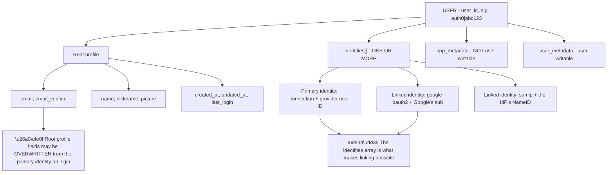
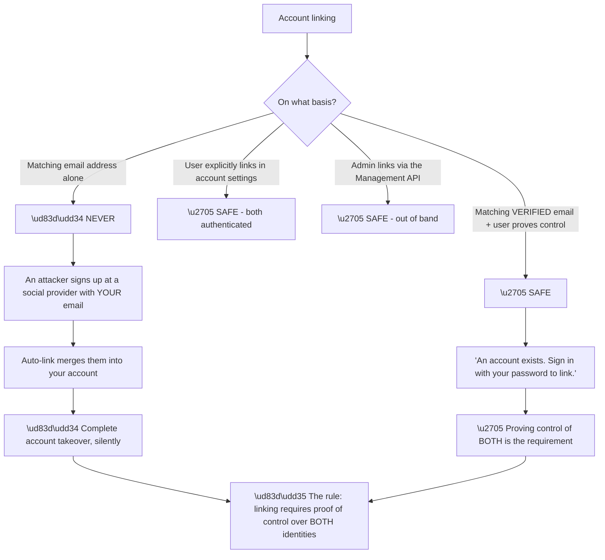
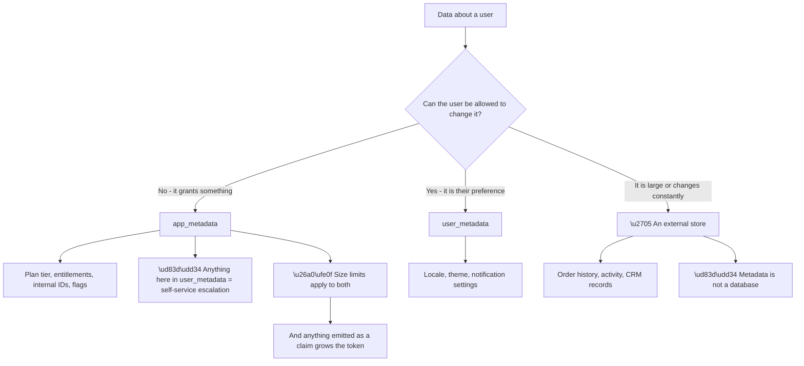
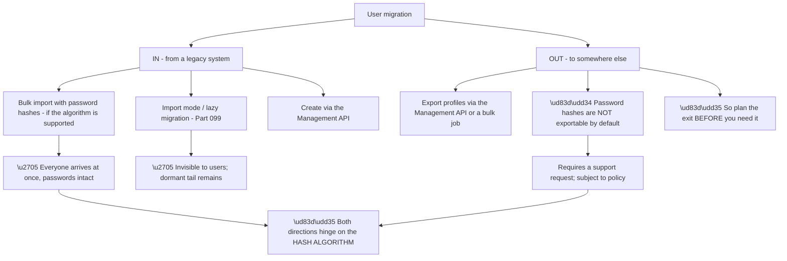
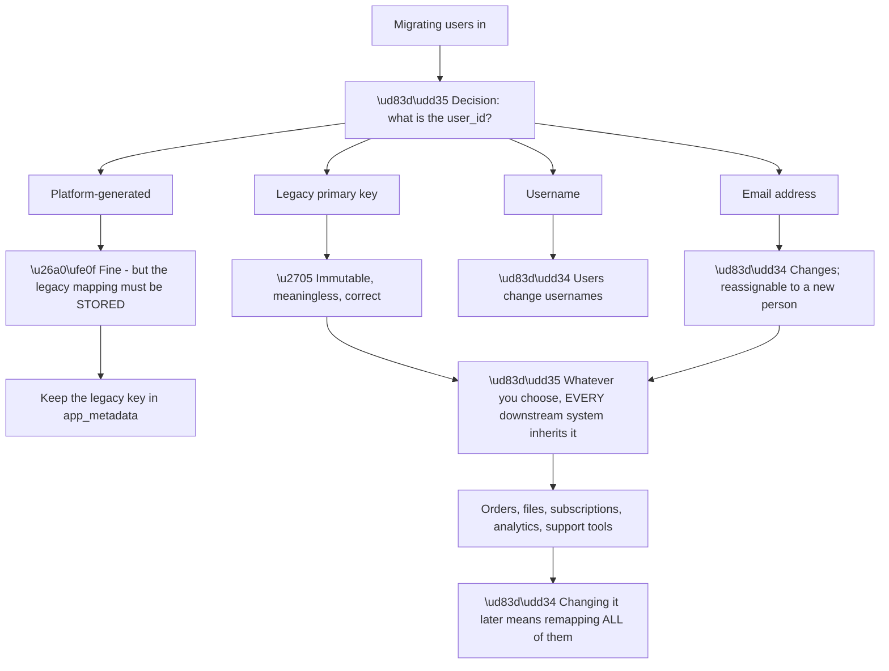
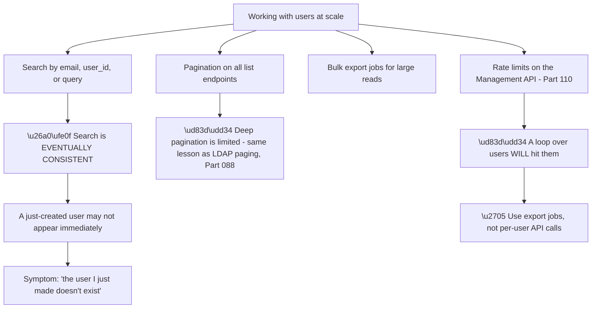
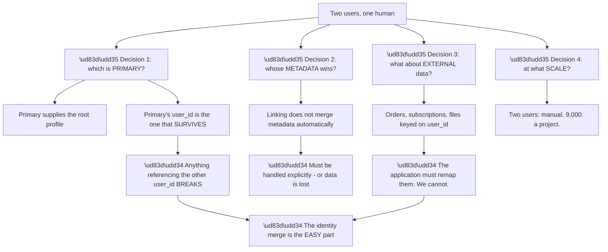
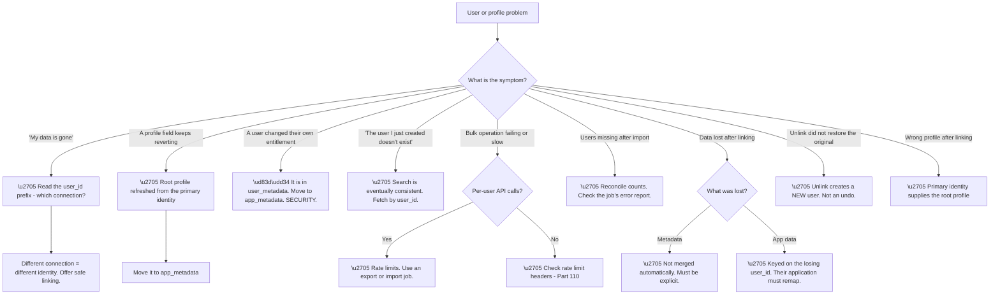

# Part 105 - User Profiles, Metadata, Account Linking, and Migration

> Section goal: Master the user object itself — what belongs on it, how to safely join the duplicate identities that Parts 098–104 keep generating, and how to move users into and out of the platform without losing anyone.

Covers index item **105**. Maps to JD signals: *Auth0*, *identity and access management*, *APIs*, *data migration*, *security*, *troubleshooting complex technical issues*, *customer-facing communication*.

---

## 1. Start From Zero: The Anatomy of a User

A user in this platform is not a single record — it is a **profile with one or more underlying identities**.

**Node R is the structural insight.** A user's `identities` array holds every credential that resolves to this person. **Linking means moving an identity from one user into another's array** — the underlying accounts at Google, at the IdP, or in the database are untouched; only the mapping changes.

**Node W is a behaviour that catches people out.** Root profile fields such as `email` and `name` are refreshed from the **primary** identity's provider on login. **A value set directly on the root profile can be overwritten** the next time the user signs in — which is why durable custom data belongs in metadata, not on the root profile.

| Field location | Who writes it | Survives login? |
|---|---|---|
| Root profile (`email`, `name`) | The identity provider | ⚠️ Refreshed from the provider |
| `app_metadata` | Actions, Management API | ✅ |
| `user_metadata` | The user, Actions, API | ✅ |
| `identities[]` | The platform | ✅ |

**The `user_id` format is worth reading fluently**, because it tells you the connection at a glance:

| Prefix | Meaning |
|---|---|
| `auth0\|` | Database connection |
| `google-oauth2\|` | Google social |
| `samlp\|` | SAML enterprise connection |
| `waad\|` / `windowslive\|` | Microsoft variants |
| `oidc\|` | OIDC enterprise connection |
| `email\|` / `sms\|` | Passwordless |

**Reading a `user_id` is a two-second diagnostic** — it answers "which connection did this user come from?" without any lookup, and that question opens or closes a large share of tickets (Parts 098, 100).

> 💡 **Tie-in to your background:** you have worked with SQL and data migrations. **The linking and migration problems here are fundamentally data problems** — identity resolution, merge conflicts, and referential integrity — dressed in identity vocabulary.

### 🔍 Plain-English deep-dive: account linking, and the rule that must never be broken

Every Part since 083 has generated duplicate identities. **Linking is the mechanism that resolves them, and it has one absolute rule.**

**Node R is the rule**, and it is the fifth appearance of this reasoning in the guide (Parts 083, 093, 098, 100). **Two identities may be joined only when control of both has been demonstrated** — by authenticating with each, or by an out-of-band administrative action.

**The unverified-email attack is concrete**, not theoretical: an attacker creates an account at a social provider that does not verify email ownership, using the victim's address. **If the platform auto-links on matching email, the attacker is merged into the victim's account and inherits everything.**

**The safe user-facing pattern** is worth knowing verbatim, because it is what you would recommend:

| Step | Detail |
|---|---|
| 1 | User signs in with a new identity |
| 2 | Platform detects an existing user with the **same verified** email |
| 3 | Prompt: *"An account already exists with this email"* |
| 4 | User signs in with the **existing** identity |
| 5 | **Both proven** → link |

**Step two's "verified" qualifier does the security work.** If either email is unverified, **the prompt is still safe but the automatic path is not** — the user must still authenticate with the original identity.

**Which identity becomes primary** is a real decision with consequences: the primary identity's provider supplies the root profile fields. **Linking a social identity into a database user behaves differently from the reverse**, and the usual convention is to keep the identity with the richest, most trusted profile as primary.

**And linking is not reversible by default** in a way that restores the previous state cleanly — **unlinking creates a new separate user**, it does not restore the original one with its original ID. **That makes linking a decision worth getting right**, and it is worth telling customers before they run a bulk linking operation.

**Analogy:** merging two customer records. You need proof they are the same person, not merely the same name — and once merged, unpicking them does not restore the originals, it creates something new. **Where it stops:** a records clerk could ask for ID. Software has only what the providers assert, which is why verification status matters so much.

---

## 2. Metadata: What Goes Where

Part 103 introduced the split; this is the practical guidance.

**Node A2 restates the privilege-escalation bug** because it is worth seeing twice: **a subscription tier in `user_metadata` is a self-service upgrade button.**

**Node E2 is the other common misuse.** Metadata is convenient, so it accumulates — and eventually every user read carries a large payload, or the data is emitted as claims and the token becomes unwieldy (Part 091's overage family).

**The test to apply:** *"does an identity decision need this?"* **If the application would query it from its own database anyway, it does not belong on the identity profile.**

| Data | Location | Reason |
|---|---|---|
| `is_premium` | `app_metadata` | Entitlement |
| `crm_customer_id` | `app_metadata` | Authoritative elsewhere; used for lookup |
| `preferred_language` | `user_metadata` | Their choice |
| `onboarding_complete` | `app_metadata` | Drives a flow decision |
| `last_5_orders` | **External** | Large, volatile, not identity |
| `marketing_consent` | `user_metadata` or external | Depends on legal requirements |

**The last row deserves a note.** Consent records often have **audit and retention requirements** that identity metadata is not designed to satisfy. **Storing consent where it is convenient rather than where it is defensible** is a compliance risk worth flagging.

---

## 3. Migration In and Out

Two directions, two very different problems.

**Node O2 is a fact worth knowing before a customer asks under pressure.** Profile data exports readily; **password hashes do not export as a routine self-service operation.** A customer planning to leave, or to run a parallel system, needs to establish that early rather than discover it during a migration window.

**This is a legitimate question to answer honestly**, and answering it well builds trust: the constraint exists for good reasons, there is a process, and **it is better raised in a planning conversation than in a crisis.**

**Migration-in has a specific ordering trap:**

| Step | Why the order matters |
|---|---|
| 1. Decide the **identifier** | Everything downstream keys on it |
| 2. Normalise the **profile shape** | Import validates against it |
| 3. Test with **synthetic** data | Never production |
| 4. Import a **small batch** | Validate before scaling |
| 5. Verify **linking** behaviour | Duplicates surface here |
| 6. Bulk import | |
| 7. Reconcile **counts** | Did everyone arrive? |

**Step seven is the one most often skipped**, and it is the only step that detects silent partial failure. **Importing 100,000 users and receiving 99,847 is a real outcome**, and without a count reconciliation nobody notices the 153 until they try to log in months later.

**A second ordering point:** if both import-mode migration and bulk import are being used, **bulk import should come after the natural migration has run for a while** — otherwise it imports users who would have migrated with their real passwords, potentially with a less useful hash.

### 🔍 Plain-English deep-dive: the identifier decision, made once, forever

Migration forces a decision that every earlier Part has warned about, and **this is the last point at which it is cheap to get right.**

**Node R2 is why this decision has such long reach.** The `user_id` chosen at migration becomes the foreign key in **every system that references a user** — orders, files, subscriptions, analytics, support tooling. **Changing it afterwards is a coordinated migration across all of them**, which is why it effectively never gets changed and why getting it right once matters.

| Choice | Consequence |
|---|---|
| Legacy primary key | ✅ Stable; legacy references still resolve |
| Email | 🔴 Breaks on change; **takeover on reassignment** |
| Username | 🔴 Breaks on change |
| Platform-generated **without** storing the legacy key | 🔴 **Legacy references become unresolvable** |
| Platform-generated **with** the legacy key in `app_metadata` | ✅ Both worlds resolve |

**Row four is the quiet disaster.** If the platform generates new identifiers and the legacy key is not preserved anywhere, **every historical record keyed on the old identifier is orphaned** — and the mapping that would have reconnected them existed only during the migration.

**The safeguard is trivial and frequently omitted:** **write the legacy identifier into `app_metadata` on every imported user.** It costs nothing, it makes reconciliation possible for years afterwards, and it converts an irreversible decision into a recoverable one.

**And it enables the reconciliation step** from §3: with the legacy key present on every record, **confirming that all 100,000 users arrived is a set comparison** rather than a hopeful count.

**Analogy:** renumbering every file in an archive while keeping a note of the old number inside each folder. The renumbering is fine; losing the note means every historical reference to an old number points nowhere. **Where it stops:** an archivist could reconstruct from content. Database foreign keys match exactly or not at all.

---

## 4. Searching, Reading, and Bulk Operations

Managing users at scale has practical constraints that shape what is possible.

**Node S1c is a genuinely common ticket** and the answer is reassuring rather than alarming: **user search is eventually consistent**, so a user created a moment ago may not appear in a search result immediately. **Fetching by `user_id` directly is consistent**; searching is not.

**The practical guidance:** after creating a user, **do not search for them to confirm** — use the `user_id` returned by the create call.

**Node S4b is the pattern that separates working integrations from ones that fall over.** A script iterating every user and calling the API per user **hits rate limits, takes hours, and fails partway.** A bulk export job retrieves everything in one operation. **Recognising a per-user loop in a customer's description is a fast, high-value observation.**

### 🔍 Plain-English deep-dive: the duplicate-user cleanup, and why it is mostly not a technical problem

Every duplicate-generating mechanism in this guide eventually produces the same request: *"can you merge these accounts?"* **The technical part is small; the decisions are the work.**

**Node R is the message to deliver early**, because customers arrive expecting a button. **Linking two identities is a single API call. Deciding which `user_id` survives, migrating metadata, and remapping every external reference is the actual work** — and most of it happens in the customer's own systems, not in the identity platform.

| Concern | Who handles it |
|---|---|
| Joining the identities | ✅ The platform — one call |
| Choosing the surviving `user_id` | The customer's decision |
| Merging metadata | The customer, explicitly |
| Remapping orders, files, subscriptions | **The customer's application** |
| Notifying the user | The customer |
| Auditing the merge | The customer |

**Row four is where the real cost sits**, and it is entirely outside the identity platform. **Anything in their database keyed on the losing `user_id` becomes orphaned** unless they remap it, and that is application work proportional to how many systems reference identity.

**At scale it becomes a project rather than a task.** The Part 101 transient-NameID scenario produced around 9,000 orphaned identities — **merging those is a data migration with a reconciliation plan, not a cleanup.**

**The prevention is always cheaper**, and it is worth stating whenever this comes up:

| Prevention | Prevents |
|---|---|
| Stable identifiers everywhere | The whole class (Parts 083, 087, 091, 099, 101) |
| Show last-used login method | Consumer duplicates (Part 100) |
| Link on verified match at signup | Duplicates at creation |
| Link before enforcing SSO-only | B2B lockouts (Part 104) |
| Monitor user count against expected | Detects it in week one |

**The last row is the cheapest control in the table** and the one nobody has. **A user count growing faster than the business would explain is a signal**, and it catches every mechanism in this list within days rather than months.

**Analogy:** merging two customer files. Stapling them together is trivial; deciding which address is current, which order history is complete, and updating every department that referenced the old file number is the actual job. **Where it stops:** paper files can be cross-referenced with a note. Foreign keys in a database do not follow a note.

---

## 5. Failure Modes

| # | Failure mode | Symptom | Root cause | First check |
|---|---|---|---|---|
| 1 | Duplicate users | "My data is gone" | Separate identity per connection | Read the `user_id` prefix |
| 2 | Auto-link on unverified email | **Account takeover** | Unsafe linking rule | Is verification required? |
| 3 | Root profile overwritten | Custom value disappears on login | Refreshed from the provider | Should it be metadata? |
| 4 | Entitlement in `user_metadata` | **Self-service escalation** | Wrong metadata store | Which store holds it? |
| 5 | Metadata used as a database | Slow reads, oversized tokens | Wrong storage choice | Does identity need it? |
| 6 | Search eventual consistency | "The user I just created doesn't exist" | Search lag | Fetch by `user_id` |
| 7 | Per-user API loop | Rate limits, slow, partial | Wrong pattern | Use an export job |
| 8 | Import count mismatch | Some users missing silently | No reconciliation | Compare counts |
| 9 | Hash algorithm unsupported | Bulk import impossible | Legacy format | Which algorithm? |
| 10 | Password hashes not exportable | Blocked exit or parallel run | Policy constraint | Was this planned for? |
| 11 | Unlink expectations | New user, not the original | Unlink is not undo | Was this explained? |
| 12 | Metadata lost on link | Data disappears after merge | Not merged automatically | Was metadata handled? |
| 13 | External references orphaned | App data lost after merge | Keyed on the losing `user_id` | Did they remap? |
| 14 | Wrong primary chosen | Profile fields come from the wrong source | Primary supplies the root | Which is primary? |

---

## 6. Troubleshooting Decision Tree: User and Identity Problems

### Worked example

A customer reports that after enabling account linking, **some users lost their subscription status** — they are being billed as premium but the application treats them as free.

**Node B: data lost after linking.** Node I: what exactly?

**Checking a affected user.** Their linked profile is correct — email, name, identities array all sensible. **The subscription flag is absent.**

**Where was it stored?** In `app_metadata` on the **secondary** identity's original user — the one that was linked *into* the primary.

**And linking does not merge metadata.** The surviving user is the primary, with the primary's metadata. **The secondary's `app_metadata` went with the record that ceased to be the user.**

**So the linking worked exactly as documented**, and the customer's linking implementation did not handle metadata.

**Which users were affected is predictable in hindsight:** those who **subscribed under one identity and were later linked with a different primary.** Users who subscribed under whichever identity became primary were unaffected — which is why it looked arbitrary.

**Three actions:**

**Immediate:** identify affected users by comparing billing records against `app_metadata`, and restore the flag. **The billing system is the authoritative source**, which is fortunate.

**Fix:** the linking implementation must read both users' metadata and merge deliberately before or during the link.

**Prevention, and the more important recommendation:** **subscription status probably should not live in identity metadata at all.** The billing system is authoritative; the identity profile should hold at most a reference to it. **That removes the failure mode entirely rather than handling it.**

**What made it findable:** asking *what exactly was lost* rather than treating "data loss" as one thing. **Metadata loss, external-reference orphaning, and profile-field overwriting are three different failures with three different fixes**, and distinguishing them takes one question.

---

## 7. Lab: Profiles, Linking, and a Migration

**Purpose.** Work directly with the user object, perform linking safely, and run a small migration with reconciliation.

**Prerequisites.**
- The free tenant from Part 097 with a database connection and one social connection
- The Management API (Part 106 covers it; basic use is enough here)
- **Never** use real user data or an employer tenant

**Steps.**

1. **Create a user via the database connection.** Read the full user object via the API. **Identify the `user_id` prefix, the identities array, and both metadata objects.**
2. **Sign in with a social connection using the same email.** **Confirm a second user exists** with a different prefix.
3. **Set `app_metadata` on one** and `user_metadata` on the other. Record both.
4. **Link the two identities**, choosing the database user as primary. **Read the resulting user.**
5. **Confirm what happened to each metadata object.** **Record which survived** — this is §6's scenario.
6. **Read the identities array** and confirm both are present.
7. **Unlink them.** **Confirm the result is a NEW user with a different `user_id`**, not the original. Record this.
8. **Set a value directly on the root profile** (for example, `name`). Log in again through the provider. **Confirm whether it persisted.**
9. **Create a user and immediately search for them by email.** **Record whether they appear.** Then fetch by `user_id` and confirm consistency.
10. **Bulk import five fictional users** from a JSON file. **Reconcile the count** and check the job's result report.
11. **Deliberately include one invalid record** and confirm the job reports it rather than failing silently.
12. **Write a customer-facing linking guide** covering the verification rule, the primary decision, metadata merging, and external references.

**Expected evidence.**
- A full user object, annotated
- Two users with the same email and different prefixes
- Before/after metadata across a link, showing what was lost
- An unlinked user with a new `user_id`
- A root profile field reverting after login
- Search-versus-fetch consistency observation
- An import job report including the invalid record
- Your customer-facing linking guide

**Validation rubric.**

| Criterion | Pass |
|---|---|
| Anatomy | You can explain profile, identities, and both metadata stores |
| `user_id` | You can read a prefix and name the connection instantly |
| Linking rule | You can state the proof-of-control requirement without hesitating |
| Metadata | You can classify any field into the right store |
| Merge reality | You can explain why merging is mostly the customer's work |
| Migration | You can explain reconciliation and why it matters |
| Safety | Fictional users only, everything deleted |

**Cleanup and privacy.** Delete every test user, including linked and unlinked ones. **Use entirely fictional data** — never import real user data, even a small sample, and never test linking against production-derived records. **Delete the import file** afterwards, since even synthetic files build the habit of not leaving user data lying about.

---

## 8. JD Mapping

| JD signal | How this Part addresses it |
|---|---|
| Auth0 product knowledge | The user object, metadata, linking, migration |
| Identity and access management | Identity resolution and merge semantics |
| APIs | Management API patterns, pagination, bulk jobs |
| Data migration | Import, export, reconciliation |
| Security | Linking as a takeover vector; metadata escalation |
| Troubleshooting complex technical issues | Fourteen failure modes and a symptom-first tree |
| Customer-facing communication | Setting realistic expectations on merges |

---

## 9. Candidate Honesty Note

- **Production experience:** SQL and data work, including migrations, reconciliation, and identity resolution problems.
- **Production experience:** distinguishing categories of "data loss" before investigating.
- **Lab experience:** linking and unlinking identities, observing metadata loss, and running a small import with reconciliation, as above.
- **Learned architecture:** the linking security rule, metadata store semantics, and export constraints.
- **No direct experience:** running a production user migration or a large-scale duplicate cleanup.
- **How to say it:** *"This is a data problem in identity clothing, which suits my background — the merge semantics, the reconciliation, the referential integrity issues are familiar. I've linked and unlinked identities in a lab and watched metadata disappear, which is the thing I'd warn customers about first. I haven't run a production migration, and I'd treat one as high-risk work with a reconciliation plan rather than a bulk operation."*

---

## 10. Official Source Anchors

| Source | Why | Accessed |
|---|---|---|
| Auth0 Docs — User profiles and structure | Profile, identities, metadata | Accessed **26 August 2026** |
| Auth0 Docs — Metadata: app_metadata vs user_metadata | The writability distinction | Accessed **26 August 2026** |
| Auth0 Docs — User account linking | Linking mechanics and safety | Accessed **26 August 2026** |
| Auth0 Docs — Bulk user import and export | Job semantics and reporting | Accessed **26 August 2026** |
| Auth0 Docs — User search best practices | Eventual consistency, pagination | Accessed **26 August 2026** |
| OWASP — Broken Authentication | Account linking as a takeover vector | Accessed **26 August 2026** |

> **Revalidate:** metadata size limits, search behaviour, and bulk job constraints change. Re-check the current documentation before advising on limits.

---

## ⭐ Likely Interview Questions for This Section

### Q1. "Describe the structure of a user object."

> *Model answer:* It is a profile with one or more underlying identities rather than a single flat record. There is a `user_id` whose prefix tells you the connection — `auth0|` for database, `google-oauth2|` for Google, `samlp|` for a SAML enterprise connection — which is a two-second diagnostic on its own. There is a root profile with email, name, and timestamps, which is refreshed from the primary identity's provider on login, so values written directly there can be overwritten. There is an identities array holding every credential that resolves to this person, which is what makes linking possible. And there are two metadata stores: `app_metadata`, which the user cannot write, and `user_metadata`, which they can.

### Q2. "What's the rule for account linking?"

> *Model answer:* Linking requires proof of control over both identities. That means either the user authenticates with each in turn, or an administrator links them out of band through the Management API. What you must never do is link automatically on a matching email address alone, because an attacker can sign up at a social provider that does not verify email ownership, using the victim's address, and auto-linking silently merges them into the victim's account with everything in it. The safe pattern is to detect an existing user with the same verified email, tell the user an account already exists, and require them to sign in with the original identity before joining them. It is the same reasoning as not keying SAML NameID on email — it shows up in about five places across this stack.

### Q3. "What's the difference between `app_metadata` and `user_metadata`?"

> *Model answer:* Writability. `app_metadata` can only be written by Actions and the Management API; `user_metadata` can be written by the user themselves. So the test is simply whether the user should be allowed to change it. Anything that grants an entitlement — subscription tier, feature flags, internal identifiers, onboarding state that gates access — belongs in `app_metadata`. Preferences like locale and theme belong in `user_metadata`. Putting a subscription tier in `user_metadata` is a self-service upgrade button, and it is a real privilege escalation bug rather than a style issue. Separately, neither is a database: anything large or frequently changing belongs in the application's own store, because it makes every user read heavier and, if emitted as claims, grows every token.

### Q4. "A customer says users lost data after they enabled account linking. How do you approach it?"

> *Model answer:* By asking what exactly was lost, because "data loss" after linking is three different failures. If it is metadata, linking does not merge it automatically — the surviving user keeps the primary's metadata and the secondary's goes with the record that ceased to be the user, so it has to be merged explicitly. If it is application data like orders or files, those are keyed on the losing `user_id` in their own database and their application has to remap them; we cannot. And if it is a root profile field, that is being refreshed from the primary identity's provider on login rather than lost. Each has a different fix, and distinguishing them takes one question rather than an investigation.

### Q5. "A customer wants to merge nine thousand duplicate accounts. What do you tell them?"

> *Model answer:* That the identity merge is the easy part and everything around it is the work. Joining two identities is a single API call. Deciding which `user_id` survives is a decision with consequences, because anything referencing the other one breaks. Metadata has to be merged deliberately. And every external reference in their own systems — orders, subscriptions, files — has to be remapped, which is application work proportional to how many systems reference identity. At nine thousand it is a data migration with a reconciliation plan, not a cleanup. I would also make sure the cause is fixed first, because merging while the duplicate-generating mechanism is still running just produces more. And I would recommend monitoring user count against expected headcount, which is the cheapest control there is and catches this within days.

### Q6. "A customer says a user they just created doesn't exist. What's happening?"

> *Model answer:* User search is eventually consistent, so a user created moments ago may not appear in search results yet, while fetching directly by `user_id` is consistent. So the guidance is simple: after creating a user, do not search to confirm — use the `user_id` returned by the create call. It is a reassuring answer rather than an alarming one, and it usually resolves in seconds. If it persists beyond that, then I would look at whether the create actually succeeded and whether they are searching the right tenant, but the eventual-consistency explanation covers the overwhelming majority of these.

### Q7. "A customer's user management script is slow and keeps failing. What do you suspect?"

> *Model answer:* A per-user API loop. Iterating every user and calling the Management API for each one hits rate limits, takes hours, and typically fails partway through with no clean resume. The right pattern is a bulk export job for reads and a bulk import job for writes, which retrieve or apply everything in one operation. Recognising a per-user loop in a customer's description is fast and high-value, because the fix changes the approach rather than tuning it. I would also check whether they are honouring the rate limit response headers, since a script that ignores `Retry-After` makes the problem worse by retrying immediately.

### Q8. "What should a customer know about exporting users before they need to?"

> *Model answer:* That profile data exports readily and password hashes do not, as a routine self-service operation — there is a process for it, subject to policy. That matters because a customer planning an exit, a parallel run, or a disaster-recovery capability needs to establish it during planning rather than discover it in a migration window. I would answer that honestly if asked, because the constraint exists for good reasons and raising it early builds trust rather than damaging it. The related point on migration in is reconciliation: after a bulk import, compare counts. Importing a hundred thousand users and receiving ninety-nine thousand eight hundred is a real outcome, and without a count check nobody notices the missing ones until they try to log in months later.

---

## 🧠 30-Second Memory Hooks

- **A user = a profile + an identities array + two metadata stores.**
- **`user_id` prefix names the connection.** Two-second diagnostic.
- **Root profile fields refresh from the primary identity on login.**
- **Linking requires proof of control over BOTH identities.** Never email alone.
- **Unlink creates a NEW user.** It is not an undo.
- **Primary identity supplies the root profile.**
- **`app_metadata` = not user-writable. `user_metadata` = user-writable.**
- **Entitlement in `user_metadata` = self-service escalation.**
- **Metadata is not a database.**
- **Linking does NOT merge metadata.**
- **External references keyed on the losing `user_id` are the customer's to remap.**
- **Search is eventually consistent. Fetch by `user_id` is not.**
- **Per-user API loops hit rate limits.** Use bulk jobs.
- **Reconcile counts after every import.**
- **Password hashes do not export routinely.** Plan the exit early.

---

## ✅ Completion Checklist

- [ ] I can describe the user object's structure
- [ ] I can read a `user_id` prefix and name the connection
- [ ] I can state the linking rule and explain the takeover attack
- [ ] I can explain that unlink is not undo
- [ ] I can classify any field into the correct metadata store
- [ ] I can explain the three distinct kinds of post-link "data loss"
- [ ] I can explain why merges are mostly the customer's work
- [ ] I can explain search eventual consistency
- [ ] I can recognise a per-user API loop and recommend bulk jobs
- [ ] I have completed the lab, including the metadata-loss demonstration
- [ ] I can state honestly what I have done and what I have not migrated

*Next suggested section:* **[Part 106 - Management API versus Authentication API](Part-106-management-api-versus-authentication-api.md)** — two APIs with very different purposes, very different credentials, and one dangerous confusion between them.
