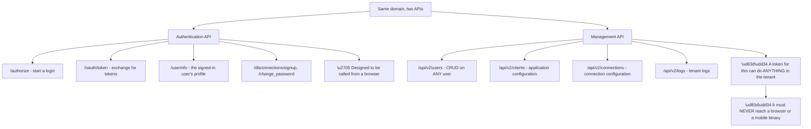
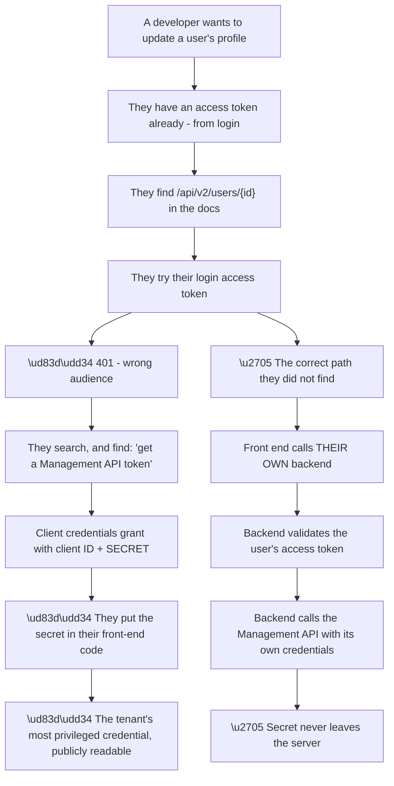
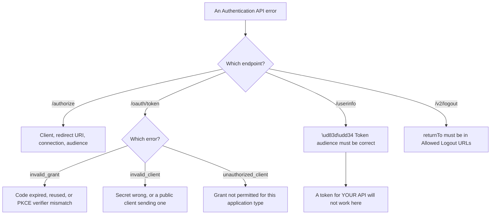
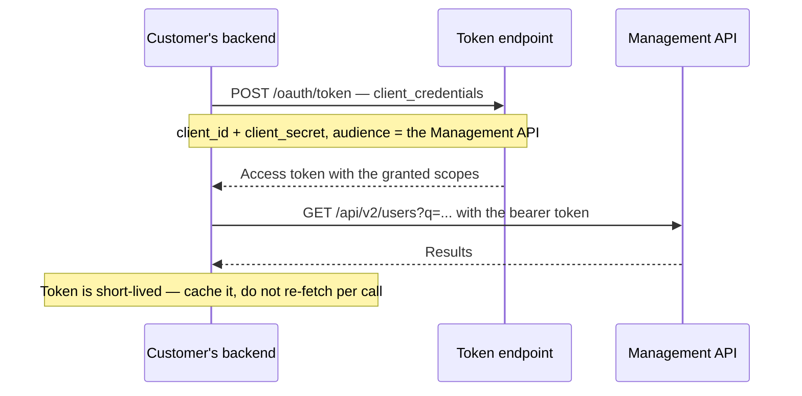
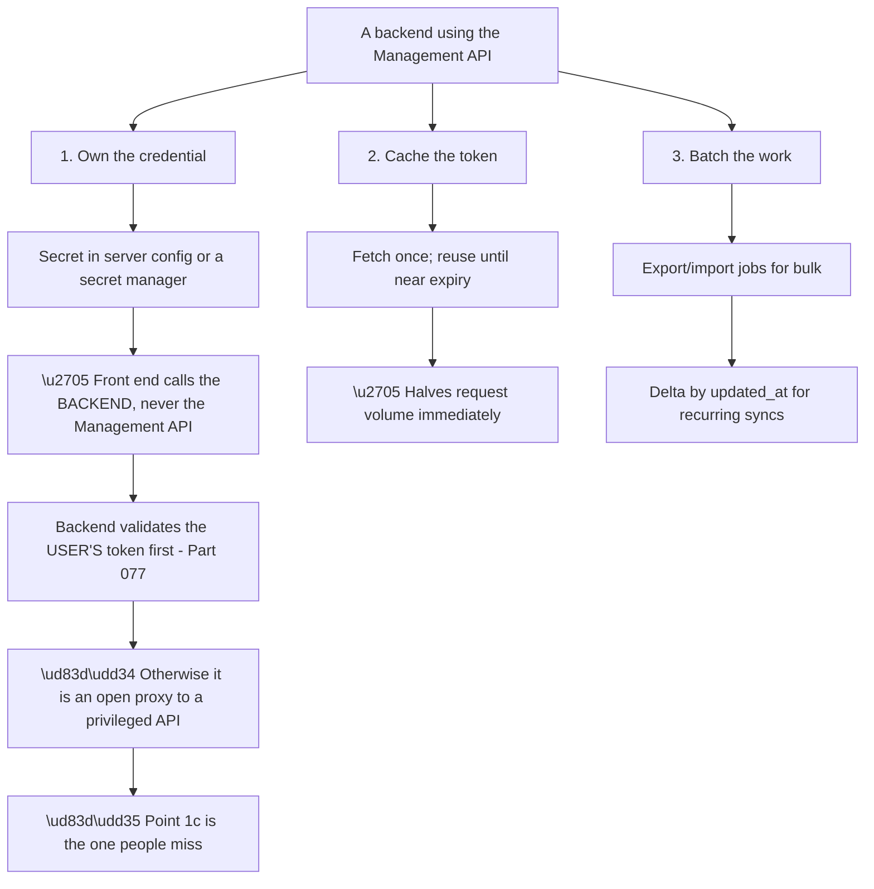
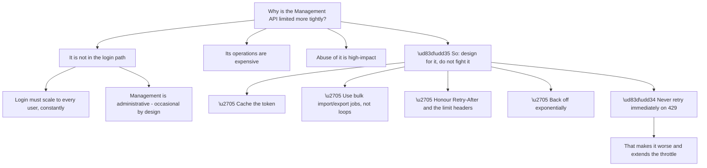
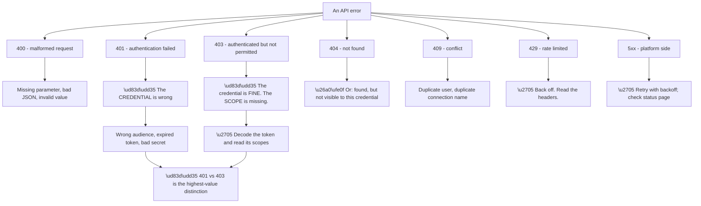
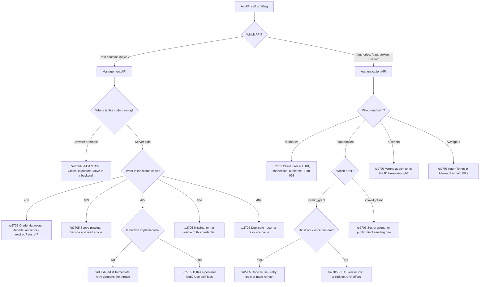

# Part 106 - Management API versus Authentication API

> Section goal: Separate the two APIs cleanly — what each is for, how each is authenticated, and why confusing them is both the most common developer mistake here and a genuine security risk.

Covers index item **106**. Maps to JD signals: *Auth0*, *APIs*, *OAuth 2.0*, *authentication and authorization*, *security*, *troubleshooting complex technical issues*, *developer support*.

---

## 1. Start From Zero: Two APIs, Two Purposes

The platform exposes two entirely different APIs on the same domain, and **the distinction is not cosmetic.**

| | Authentication API | Management API |
|---|---|---|
| **Purpose** | Authenticate users, issue tokens | Configure the tenant, manage data |
| **Who calls it** | Applications, during login | Backends, scripts, administrators |
| **Typical endpoints** | `/authorize`, `/oauth/token`, `/userinfo` | `/api/v2/users`, `/api/v2/clients` |
| **Auth method** | Public flows, or client credentials | **A token for the Management API audience** |
| **Privilege** | Acts for one user | **Acts on the whole tenant** |
| **Safe in a browser?** | ✅ By design | 🔴 **Absolutely not** |
| **Rate limits** | Higher, login-scale | **Lower, deliberately** |

**Node R is the security rule.** A Management API token with broad scopes can read every user, change every configuration, and create administrative credentials. **It is the most privileged credential in the tenant**, and it belongs only in server-side code.

**The mental model that keeps them straight:** the Authentication API acts **as a user**; the Management API acts **as the tenant.** One is scoped to a person; the other is scoped to everything.

**A useful discriminator for reading a customer's code:** `/api/v2/` in a path means the Management API. **Seeing that path in front-end JavaScript is a finding to raise immediately**, regardless of what else the ticket is about.

> 💡 **Tie-in to your background:** you have troubleshooted REST APIs extensively. **Both of these are ordinary REST APIs** with ordinary failure modes — 401s, 403s, 429s, pagination — and the identity-specific part is mostly about which credential is appropriate where.

### 🔍 Plain-English deep-dive: how developers end up calling the Management API from a browser

The mistake is common enough to be worth understanding sympathetically, because **the path to it is entirely logical.**

**The path is logical at every step**, which is why intelligent developers take it. **The failure is that the documentation answer to "how do I get a Management API token" is technically correct and does not warn loudly enough about where that code may run.**

**So the support response should be sympathetic and unambiguous:** the pattern they built is a serious exposure, **and the correct pattern is not much more work.**

| What they need | Correct approach |
|---|---|
| Update the signed-in user's own metadata | Their backend, validating the user's token first |
| Read the signed-in user's profile | `/userinfo`, or claims already in the ID token |
| List users | Their backend, with a scoped Management token |
| Change tenant configuration | Server-side only, ideally via automation (Part 110) |
| Anything from a SPA or mobile app | **Via their own backend. Always.** |

**Row two is worth highlighting** because it converts many of these requests into no request at all: **the profile data the developer wants is frequently already in the ID token** they received at login. **No API call is needed**, which is faster, cheaper, and removes the exposure entirely.

**And there is a scoping point that softens the blow.** A Management API token can be issued with **only the scopes it needs** — `read:users` alone, rather than everything. **A backend that only reads users should hold a token that can only read users**, which bounds the damage if it leaks.

**Analogy:** being given a master key because you needed to get into one room. It works, and the correct answer was to ask the person who holds the keys to open that door for you. **Where it stops:** a master key can be handed back. A secret embedded in shipped front-end code is in every user's browser and every archived copy of the bundle.

---

## 2. Authentication API: The Endpoints That Matter

These are the endpoints a login flow actually touches, and their failures map onto Parts 056–078.

| Endpoint | Purpose | Common failure |
|---|---|---|
| `/authorize` | Begin authorization | `callback URL mismatch`, `unauthorized_client` |
| `/oauth/token` | Exchange code, refresh, client credentials | `invalid_grant`, `invalid_client` |
| `/userinfo` | Profile for the signed-in user | Requires an **opaque or correctly-scoped** token |
| `/oauth/revoke` | Revoke a refresh token | Wrong token type |
| `/v2/logout` | End the session | Logout URL not allowed |
| `/.well-known/openid-configuration` | Discovery | — |
| `/.well-known/jwks.json` | Signing keys | Key rotation handled here |
| `/dbconnections/signup` | Database signup | Connection not enabled |
| `/dbconnections/change_password` | Trigger a reset | Generic response by design |

**Node C3a is a genuinely confusing behaviour worth understanding.** `/userinfo` accepts a token issued for the platform's own userinfo audience. **An access token requested with your own API's audience will not work there** — and the developer's reasonable expectation is that "the access token" is one thing.

**The resolution is that they usually do not need `/userinfo` at all**: the ID token already contains the profile claims. **`/userinfo` exists mainly for cases where the ID token is not available or claims must be re-fetched fresh.**

**`invalid_grant` deserves a specific note** because it covers several distinct causes:

| `invalid_grant` cause | Signal |
|---|---|
| Authorization code expired | Delay between redirect and exchange |
| Code already used | **Retry logic, or a double-submitted form** |
| PKCE verifier mismatch | Verifier storage lost (Parts 059, 080) |
| Refresh token revoked or rotated | Reuse detection triggered |
| Redirect URI differs at exchange | Must match the one used at `/authorize` |

**Row two is the most common in practice** and is often self-inflicted: **an authorization code is single-use**, so any retry, refresh of the callback page, or duplicated request fails the second time. **The signature is that it works, then immediately fails, for the same login.**

---

## 3. Management API: Scopes, Tokens, and Patterns

The Management API is authenticated with an access token whose audience is the Management API itself, obtained via the client credentials grant (Part 062).

**The final note prevents a specific and common inefficiency.** A backend requesting a fresh Management token before every call **doubles its request volume and consumes rate limit unnecessarily.** The token is valid for a period; **caching it until shortly before expiry is the correct pattern.**

**Scopes are the primary safety control:**

| Scope | Grants |
|---|---|
| `read:users` | Read user records |
| `update:users` | Modify users |
| `create:users` | Create users |
| `delete:users` | **Destructive** |
| `read:logs` | Tenant logs |
| `read:clients` / `update:clients` | Application configuration |
| `read:connections` / `update:connections` | Connection configuration |

**Least privilege is meaningful here**, not ceremonial. **A backend that only reads users should hold `read:users` and nothing else** — so a leaked token cannot delete anything, cannot read logs, and cannot reconfigure applications.

**Three patterns worth recognising in customer code:**

| Pattern | Verdict |
|---|---|
| One machine-to-machine app per service, minimally scoped | ✅ Correct |
| One M2M app with all scopes, shared by everything | ⚠️ Works; poor blast radius |
| Management token in front-end code | 🔴 **Critical** |
| Token re-fetched per API call | ⚠️ Wasteful; hits rate limits |
| Per-user loop over `/api/v2/users` | ⚠️ Use bulk jobs (Part 105) |

### 🔍 Plain-English deep-dive: the three things a customer's backend should do instead

Most Management API problems dissolve into three patterns. **Being able to state them concisely turns a long diagnostic conversation into a short design one.**

**Node R marks the subtle failure in an otherwise correct architecture.** A backend that holds the credential properly, **but exposes an endpoint that calls the Management API without validating who is asking**, is an **open proxy to a privileged API.** The secret never leaves the server and the exposure is just as complete.

| Backend endpoint | Safe? |
|---|---|
| `GET /api/me` — validates the caller's token, returns only their own profile | ✅ |
| `GET /api/users/{id}` — no token validation | 🔴 Anyone can read any user |
| `GET /api/users/{id}` — validates, but does not check **which** user | 🔴 Any authenticated user reads any other |
| `PATCH /api/me/metadata` — validates and scopes to the caller | ✅ |
| `POST /api/admin/*` — validates the caller **and their role** | ✅ |

**Rows two and three are the same class of bug as Part 104's cross-tenant exposure**, arriving through a different door: **authenticating the caller is not the same as authorising the operation.** A validated token proves who is asking; it does not establish that they may act on the resource they named.

**The rule to give customers:** every backend endpoint that reaches the Management API must answer three questions — **who is calling, are they allowed to perform this operation, and are they allowed to perform it on this resource.** Skipping the third is the commonest and least visible mistake.

**And point two has a measurable benefit worth quoting.** Token caching alone typically halves a backend's request count against the platform, **which is often the entire fix for a rate-limiting complaint** — no redesign required.

**Analogy:** a concierge who holds the master key so guests never touch it. That is correct — and useless if the concierge opens any room anyone names without checking who they are and whether it is their room. **Where it stops:** a concierge recognises faces. Code has to be told to check, on every request.

---

## 4. Rate Limits and Bulk Operations

The Management API is deliberately rate-limited more tightly than the Authentication API, and understanding why prevents a category of design mistake.

**Node P5 is worth stating plainly** because it is a common self-inflicted escalation: a script that retries immediately on a 429 **increases the request rate exactly when it should decrease it**, deepening the throttle and lengthening the outage.

**The correct handling** is to read the rate limit headers, honour `Retry-After` if present, and back off exponentially with jitter. **This is ordinary REST hygiene**, and it is the answer to most "the Management API is unreliable" tickets.

**The design-level answer to "I need to process all my users"** is almost always a bulk job rather than iteration:

| Task | Wrong | Right |
|---|---|---|
| Read all users | Loop `/api/v2/users` | **Export job** |
| Update many users | Loop `PATCH` | **Import job**, or batched with backoff |
| Find one user | Loop and filter | **Search with a query** |
| Nightly sync | Full loop every night | **Delta by `updated_at`** |

**The last row is the most valuable optimisation** and rarely the customer's first design. **Syncing only users changed since the last run** reduces a nightly job from hours to seconds and removes the rate limit problem entirely.

### 🔍 Plain-English deep-dive: reading API errors as a support engineer

Both APIs return standard HTTP status codes, and **the status code plus the error body locate the fault precisely** — which makes this one of the faster diagnostic surfaces in the whole product.

**Node R is the distinction to internalise.** **401 means the credential itself is wrong** — wrong audience, expired, malformed, bad secret. **403 means the credential is valid and simply lacks the scope.**

**They point at completely different fixes**, and conflating them wastes time:

| Code | What is broken | What to check |
|---|---|---|
| **401** | The token | Audience, expiry, signature, client secret |
| **403** | The scopes | Decode the token; read `scope` |

**The single fastest step on either is to decode the token**, which answers both questions at once — audience, expiry, and granted scopes are all visible. **Asking a developer to decode their token before describing the problem often resolves it without further correspondence.**

**Node C404a is worth knowing** because it is a deliberate behaviour rather than a bug: some resources return 404 rather than 403 when the credential lacks visibility, **so that the existence of a resource is not disclosed to an unauthorised caller.** A 404 that "should be a 403" is often this, and it is the same enumeration-resistance principle as Parts 099 and 102.

**And 429 handling is the one place where the customer's own code determines whether a limit is a nuisance or an outage.** Correct backoff makes throttling nearly invisible; immediate retry turns it into a sustained failure.

**Analogy:** a doorman who either does not recognise your pass at all, or recognises it and tells you it does not open this door. Different problems, different fixes, and looking at the pass answers both. **Where it stops:** a doorman might explain. An API returns a code, and the token has to be read.

---

## 5. Failure Modes

| # | Failure mode | Symptom | Root cause | First check |
|---|---|---|---|---|
| 1 | Management token in front-end | **Critical exposure** | Wrong architecture | Is `/api/v2/` in client code? |
| 2 | Login token sent to Management API | 401 | Wrong audience | Decode the token |
| 3 | Missing scope | 403 | Token valid, scope absent | Read the token's `scope` |
| 4 | Token re-fetched per call | Rate limits, slow | No caching | Is the token cached? |
| 5 | Per-user loop | 429s, hours, partial | Wrong pattern | Use bulk jobs |
| 6 | Immediate retry on 429 | Sustained throttle | Bad backoff | Is `Retry-After` honoured? |
| 7 | `invalid_grant` on code reuse | Works once, then fails | Codes are single-use | Retry logic or page refresh? |
| 8 | PKCE verifier lost | `invalid_grant` | Storage across requests | Parts 059, 080 |
| 9 | `/userinfo` with an API token | 401 | Wrong audience | Is the ID token sufficient? |
| 10 | Logout `returnTo` rejected | Logout fails | Not in Allowed Logout URLs | Compare exactly |
| 11 | Over-scoped M2M application | Large blast radius | No least privilege | Which scopes are granted? |
| 12 | 404 that should be 403 | Confusing diagnosis | Enumeration resistance | Does the credential have visibility? |
| 13 | Full nightly sync | Slow, throttled | No delta | Filter by `updated_at` |
| 14 | Secret rotated, not updated | Total failure, dated | Credential lifecycle | When was it rotated? |

---

## 6. Troubleshooting Decision Tree: API Problems

### Worked example

A developer reports that their user-management dashboard "randomly fails" — sometimes it loads all users, sometimes it shows an error, and it has become worse as they have grown.

**Node B: `/api/v2/users` — the Management API.** Node M0: **it runs in their React front end.**

**That stops the ticket.** Before anything else, this is a **critical security exposure**: their Management API client secret is in shipped front-end code, readable by any user of their application, and the token it obtains can read every user and modify every configuration in the tenant.

**The security response comes first**, and it is specific: rotate the secret immediately, remove it from the code, and treat it as compromised — **assume it has been read, because a shipped bundle is public.**

**Only then the original symptom.** The dashboard iterates users page by page, requesting a fresh token per page. **As their user count grew, the number of requests grew, and they began hitting rate limits** — which is why it became worse with growth and why it looked random.

**Three findings, in priority order:**

**Critical:** the secret is exposed. Rotate and re-architect.
**Design:** the front end must call their own backend, which holds the credential.
**Efficiency:** the backend should cache the token and use a bulk export job rather than paged iteration.

**The communication matters here**, because the developer asked about intermittent failures and is receiving a security incident. **Leading with blame would be counterproductive** — the path they took was logical, the documentation answer was technically correct, and the correct pattern is not much more work.

**The framing that works:** *"the intermittent failures are rate limiting, and while looking at it I found something more urgent that I want to flag straight away — let me explain both, and the fix addresses them together."*

**What made this findable in one step:** **checking where the code runs before looking at the error.** `/api/v2/` in a path plus a browser context is a complete finding on its own, and it takes seconds.

---

## 7. Lab: Use Both APIs Correctly

**Purpose.** Exercise both APIs, experience 401 versus 403 directly, and build the token-caching and bulk-job patterns.

**Prerequisites.**
- The free tenant from Part 097 with several test users
- A local backend (any language) and a local JWT decoder
- **Never** use an employer or customer tenant

**Steps.**

1. **Create a Machine-to-Machine application** authorised for the Management API with **only `read:users`.**
2. **Obtain a token** via client credentials from your local backend. **Decode it** — record the audience and the `scope` claim.
3. **Call `GET /api/v2/users`.** Confirm success.
4. **Call `DELETE /api/v2/users/{id}`.** **Record the status code.** Confirm it is 403, not 401, and explain the difference in writing.
5. **Use a login access token** against `/api/v2/users`. **Record the status code.** Confirm 401 and explain why.
6. **Add `update:users`** and confirm the change in the decoded token's `scope`.
7. **Time two approaches:** re-fetching a token before every call versus caching it. **Record the difference** over twenty calls.
8. **Loop over users deliberately** until you see a 429. **Record the rate limit headers.**
9. **Implement exponential backoff** and confirm recovery.
10. **Run a bulk export job** instead and **compare the time and request count.**
11. **Call `/userinfo`** with an ID token, then with an API access token. **Record both outcomes.**
12. **Deliberately reuse an authorization code** at `/oauth/token`. **Record the exact error.**
13. **Write a one-page API guidance note** for a customer: which API for what, where credentials may live, and the caching and bulk patterns.

**Expected evidence.**
- A decoded Management token showing audience and scopes
- A 403 and a 401 side by side, with your written explanation
- Timing comparison for cached versus per-call tokens
- Rate limit headers from a real 429
- Bulk export versus loop comparison
- `invalid_grant` from a reused code
- Your customer guidance note

**Validation rubric.**

| Criterion | Pass |
|---|---|
| Separation | You can state which API for which purpose instantly |
| Security | You can explain why a Management token must never reach a browser |
| 401 vs 403 | You can explain the distinction and what to check for each |
| Caching | You can explain why per-call tokens waste rate limit |
| Bulk | You can explain when to use jobs instead of loops |
| Backoff | You can explain why immediate retry worsens throttling |
| Safety | Free tier, fictional users, minimal scopes, everything deleted |

**Cleanup and privacy.** Delete the M2M application — **and note that deleting it is what revokes its credential.** Delete test users and any export files. **Never grant broad Management scopes in a lab you will not clean up**, and never place a Management credential in any client-side code, even experimentally.

---

## 8. JD Mapping

| JD signal | How this Part addresses it |
|---|---|
| Auth0 product knowledge | Both APIs, their scope model, and their limits |
| APIs | REST semantics, status codes, pagination, bulk jobs |
| OAuth 2.0 | Client credentials, audiences, scopes |
| Security | Credential placement and least privilege |
| Troubleshooting complex technical issues | Fourteen failure modes and an API-first decision tree |
| Developer support | Recognising a common, sympathetic architectural mistake |
| Customer-facing communication | Delivering a security finding without blame |

---

## 9. Candidate Honesty Note

- **Production experience:** REST API troubleshooting — status codes, authentication failures, rate limiting, pagination.
- **Production experience:** raising security findings with customers constructively rather than accusatorially.
- **Lab experience:** exercising both APIs, comparing 401 and 403 directly, and implementing caching and backoff, as above.
- **Learned architecture:** the scope model, bulk job patterns, and delta synchronisation.
- **No direct experience:** supporting production Management API integrations at scale.
- **How to say it:** *"Both of these are ordinary REST APIs, which is comfortable territory. What I made sure to internalise is the security boundary — a Management token is the most privileged credential in the tenant, and the path a developer takes to accidentally putting it in front-end code is completely logical, so it needs handling sympathetically rather than as carelessness. I haven't supported this in production."*

---

## 10. Official Source Anchors

| Source | Why | Accessed |
|---|---|---|
| Auth0 Docs — Authentication API reference | Endpoint semantics and errors | Accessed **26 August 2026** |
| Auth0 Docs — Management API reference | Endpoints and scopes | Accessed **26 August 2026** |
| Auth0 Docs — Get Management API access tokens | The client credentials pattern | Accessed **26 August 2026** |
| Auth0 Docs — Rate limits | Limits, headers, and backoff | Accessed **26 August 2026** |
| RFC 6749 §4.4 — Client Credentials Grant | The standards basis | Accessed **26 August 2026** |
| RFC 6750 — Bearer Token Usage | 401 versus 403 semantics | Accessed **26 August 2026** |

> **Revalidate:** rate limits, available scopes, and endpoint behaviour change. Re-check current documentation before quoting specific limits.

---

## ⭐ Likely Interview Questions for This Section

### Q1. "What's the difference between the Authentication API and the Management API?"

> *Model answer:* Purpose and privilege. The Authentication API authenticates users and issues tokens — `/authorize`, `/oauth/token`, `/userinfo` — and it is designed to be called from a browser. The Management API configures the tenant and manages data — users, applications, connections, logs — and a token for it can do essentially anything in the tenant. So the model I hold is that the Authentication API acts as a user and the Management API acts as the tenant. The practical discriminator when reading code is that `/api/v2/` in a path means the Management API, and seeing that in front-end JavaScript is a finding I would raise immediately regardless of what the ticket was about.

### Q2. "A developer has their Management API secret in their React app. How do you handle it?"

> *Model answer:* As a security incident, immediately, and sympathetically. First the containment: the secret is in shipped front-end code, so it is public — rotate it now and assume it has been read. Then the architecture: their front end should call their own backend, the backend validates the user's access token, and the backend calls the Management API with its own credentials, which never leave the server. What I would not do is lead with blame, because the path they took is entirely logical — they had an access token, it did not work, the documentation told them how to get a Management token, and nothing shouted loudly enough about where that code may run. I would also check whether they need the API at all, since the profile data developers usually want is already in the ID token.

### Q3. "What's the difference between a 401 and a 403 from these APIs?"

> *Model answer:* A 401 means the credential itself is wrong — wrong audience, expired, malformed, or a bad client secret. A 403 means the credential is perfectly valid and simply lacks the scope for that operation. They point at completely different fixes, so conflating them wastes time. The fastest step for either is to decode the token, because audience, expiry, and granted scopes are all visible in one look, which answers both questions at once. There is one wrinkle worth knowing: some resources return 404 rather than 403 when a credential lacks visibility, deliberately, so that the existence of a resource is not disclosed to an unauthorised caller — so a 404 that "should be a 403" is often enumeration resistance rather than a bug.

### Q4. "A customer's script keeps getting rate limited. What do you look at?"

> *Model answer:* Three things in order. Whether they are re-fetching a Management token before every call, which doubles request volume for no benefit — the token is valid for a period and should be cached until shortly before expiry. Whether they are looping per user, which is the wrong pattern entirely; bulk export and import jobs do in one operation what a loop does in thousands. And whether they honour the rate limit headers and `Retry-After`, because a script that retries immediately on a 429 increases the request rate exactly when it should decrease it, deepening the throttle and turning a nuisance into a sustained outage. For recurring syncs I would also suggest a delta by `updated_at` rather than a full pass, which usually takes a nightly job from hours to seconds.

### Q5. "A developer gets `invalid_grant` at the token endpoint. What are the possibilities?"

> *Model answer:* Several, and one signal separates them. If it worked once and then immediately failed for the same login, that is code reuse — authorization codes are single-use, so retry logic, a refreshed callback page, or a double-submitted request fails the second time. If it never works, then it is either the PKCE verifier being lost between the authorize request and the exchange, which is a storage problem across two requests, or the redirect URI at the token exchange not matching the one used at authorize. For refresh tokens, `invalid_grant` can mean the token was revoked or that rotation reuse detection triggered. So my first question is whether it succeeds once, because that splits the space cleanly.

### Q6. "Why is the Management API rate limited more tightly than the Authentication API?"

> *Model answer:* Because it is not in the login path. Authentication has to scale to every user signing in constantly, so its limits are set accordingly. Management operations are administrative and occasional by design — configuring a tenant, running a report, syncing users — and they are individually more expensive and higher impact if abused. So the limits reflect the intended usage rather than being an arbitrary constraint. The practical implication is to design for it rather than fight it: cache tokens, use bulk jobs instead of loops, filter by `updated_at` for recurring syncs, and back off exponentially with jitter. Most "the Management API is unreliable" tickets are actually a per-user loop with no backoff.

### Q7. "A developer says `/userinfo` returns 401 with a valid token. Explain."

> *Model answer:* The audience is wrong. `/userinfo` accepts a token issued for the platform's own userinfo audience, and if they requested an access token with their own API's audience, that token is not valid there — even though it is a perfectly valid token. The developer's reasonable expectation is that "the access token" is one thing, and it is not; audience is what a token is *for*. The more useful answer is usually that they do not need `/userinfo` at all, because the ID token they already received contains the profile claims. `/userinfo` matters mainly when the ID token is unavailable or the claims need re-fetching fresh, so the fix is often to delete the call rather than to fix it.

### Q8. "How would you advise a customer on Management API credentials?"

> *Model answer:* Server-side only, one machine-to-machine application per service, and minimum scopes on each. Least privilege is meaningful here rather than ceremonial — a backend that only reads users should hold `read:users` and nothing else, so a leaked token cannot delete anything, read logs, or reconfigure applications. I would avoid a single all-scopes application shared by everything, because the blast radius of that credential is the entire tenant. I would also treat the secret's rotation like any other credential lifecycle item, with a reminder and an owner, since a rotated secret that was not updated produces a total, sudden, dated failure — the same signature as the certificate and secret expiries elsewhere in this stack.

---

## 🧠 30-Second Memory Hooks

- **Authentication API acts as a user. Management API acts as the tenant.**
- **`/api/v2/` in a path = Management API.** In front-end code = critical finding.
- **A Management token is the most privileged credential in the tenant.**
- **401 = the credential is wrong. 403 = the scope is missing.**
- **Decode the token** — it answers both at once.
- **404 may be enumeration resistance, not a missing resource.**
- **Cache the Management token.** Do not re-fetch per call.
- **Bulk jobs, not per-user loops.**
- **Delta by `updated_at` for recurring syncs.**
- **Never retry immediately on 429.** Backoff with jitter.
- **`invalid_grant` that worked once = code reuse.**
- **`/userinfo` needs its own audience** — and the ID token is usually enough.
- **One M2M app per service, minimum scopes.**

---

## ✅ Completion Checklist

- [ ] I can state which API serves which purpose instantly
- [ ] I can explain why a Management token must never reach a browser
- [ ] I can explain the 401 versus 403 distinction and what to check for each
- [ ] I can explain why token caching matters for rate limits
- [ ] I can recognise a per-user loop and recommend bulk jobs
- [ ] I can explain correct 429 handling
- [ ] I can diagnose `invalid_grant` from whether it worked once
- [ ] I can explain the `/userinfo` audience confusion
- [ ] I can advise on least-privilege scoping
- [ ] I have completed the lab, including a real 429 with headers
- [ ] I can deliver a security finding without blaming the developer

*Next suggested section:* **[Part 107 - Tenant Logs, Event Codes, and Log Streams](Part-107-tenant-logs-event-codes-and-log-streams.md)** — the evidence source this entire group keeps pointing at, and how to read it fluently.
