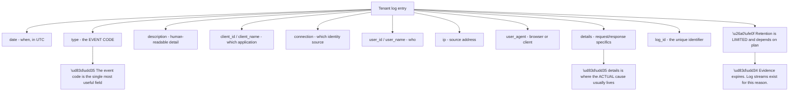
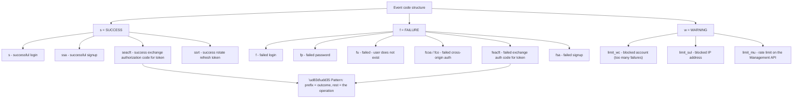
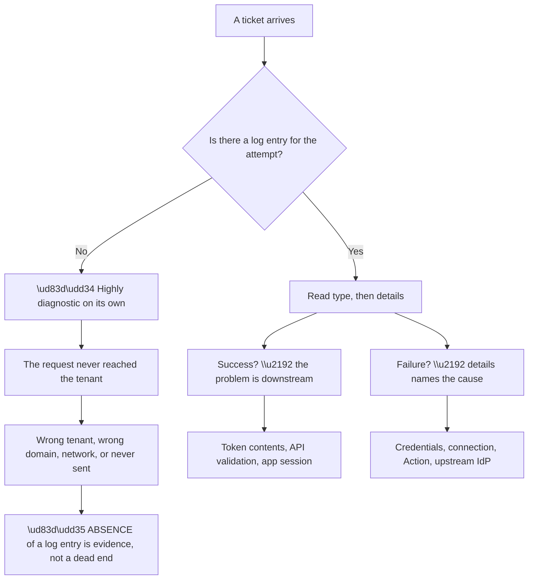
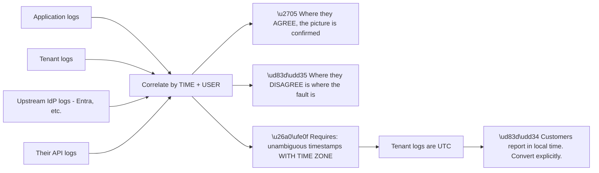
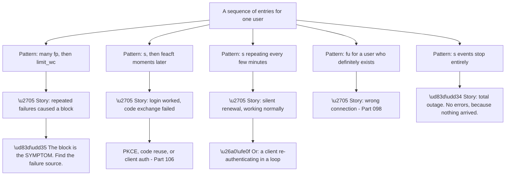
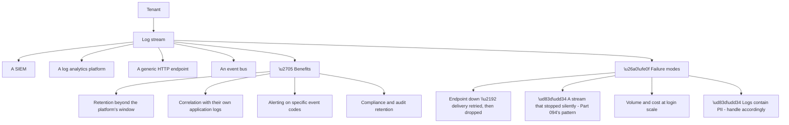
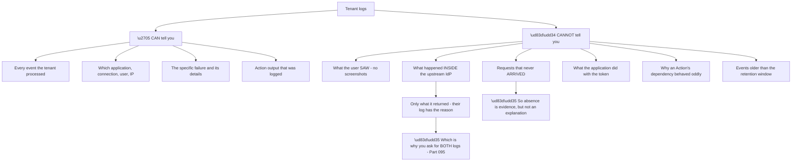
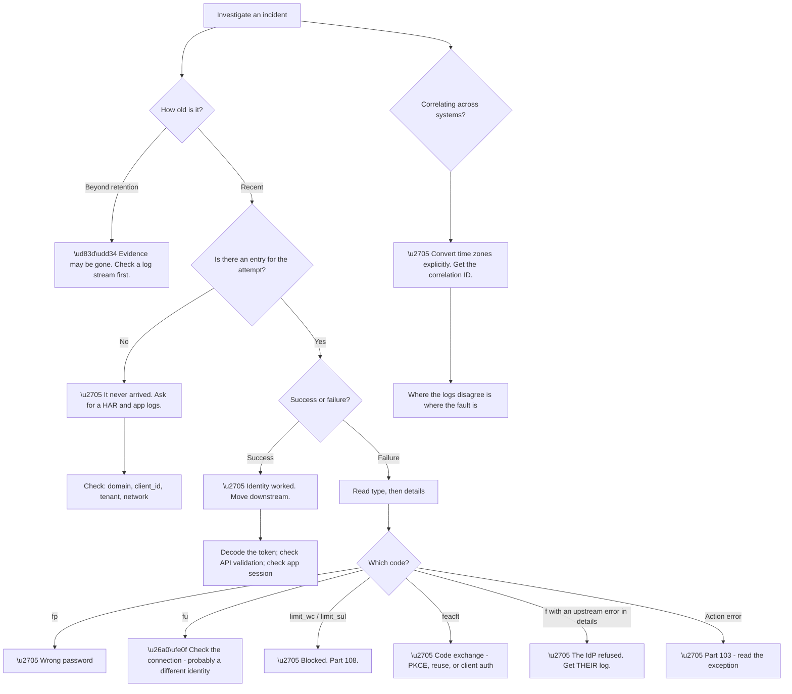

# Part 107 - Tenant Logs, Event Codes, and Log Streams

> Section goal: Become fluent in the evidence source that every previous Part in this group has pointed at — what the logs contain, how to read event codes, and how to get them off the platform before they expire.

Covers index item **107**. Maps to JD signals: *Auth0*, *troubleshooting complex technical issues*, *root cause analysis*, *debugging tools*, *APIs*, *observability*, *customer-facing communication*.

---

## 1. Start From Zero: What the Tenant Log Is

Every meaningful event in the tenant produces a log entry — successful logins, failed logins, token exchanges, Action executions, API calls, configuration changes. **It is the authoritative record of what actually happened.**

**Node R2 deserves emphasis** because it is frequently skipped. The `description` field is a summary; **the `details` object contains the specifics** — the error returned by an upstream provider, the Action's exception, the exact parameters of a request. **Reading only the description misses the cause on a large share of tickets.**

**Node W1 is the operational constraint that shapes practice.** Log retention is finite. **A customer investigating something from six weeks ago may find the evidence is simply gone**, which is why streaming logs to their own system (§4) is a genuine production requirement rather than a nice-to-have.

**The practical consequence for support:** on any ticket where the incident is more than a few days old, **establishing whether the logs still exist comes before planning the investigation.**

> 💡 **Tie-in to your background:** log analysis and correlating events across systems is core escalation work. **This is the same skill applied to a new schema** — and the discipline of reading structured detail rather than summary text transfers directly.

### 🔍 Plain-English deep-dive: reading event codes fluently

Event codes are short, cryptic, and highly informative once the pattern is visible. **Learning the pattern is faster than memorising the list.**

**Node R is the shortcut.** Once you know that `s` means success, `f` means failure, and the remainder abbreviates the operation, **most codes decode themselves** — `seacft` is "success exchange authorization code for token," `feacft` is the failure of the same thing.

**A working subset worth knowing without lookup:**

| Code | Meaning | Points at |
|---|---|---|
| `s` | Successful login | — |
| `f` | Failed login | Credentials, or upstream |
| `fp` | Failed — wrong password | The user |
| `fu` | Failed — user does not exist | Wrong connection, or not provisioned |
| `feacft` | Failed code exchange | PKCE, code reuse, client auth (Part 106) |
| `ssrt` / `fsrt` | Refresh token rotation | Reuse detection |
| `limit_wc` | Account blocked | Brute force protection (Part 108) |
| `limit_sul` | IP blocked | Suspicious traffic |
| `fsa` | Failed signup | Validation, or duplicate |
| `sapi` / `fapi` | Management API call | Part 106 |
| `sepft` / `fepft` | Passwordless token exchange | Delivery or expiry |
| `gd_*` | Guardian / MFA events | Part 108 |

**Two codes are especially diagnostic**, and worth recognising instantly:

**`fu` — user does not exist —** frequently means the user is on a *different connection* (Part 098), not that they are absent. **It is the log-level signature of the duplicate-identity problem.**

**`limit_wc` — account blocked —** explains a user who insists their password is correct. **It usually is**; the account is blocked from repeated failures, often from a stale cached credential elsewhere (Part 108).

**Analogy:** a ledger with a shorthand notation. Once you know the notation, entries read at a glance instead of requiring a key each time. **Where it stops:** shorthand compresses; the `details` field is where the full account lives, and skipping it means reading the index instead of the chapter.

---

## 2. What the Logs Answer

Almost every question this group has raised is answerable from the log, and knowing which field answers which question is the practical skill.

| Question | Field |
|---|---|
| Did the attempt reach the tenant at all? | Presence of an entry |
| Which application? | `client_id` / `client_name` |
| Which connection? | `connection` |
| Which user? | `user_id` — **read the prefix** (Part 105) |
| What failed? | `type` + `details` |
| From where? | `ip`, and geolocation |
| What client? | `user_agent` |
| Did an Action run? | Action execution entries and `console.log` output |
| What did the upstream IdP return? | `details` |

**Node R is the point most often missed.** When a customer reports a failure and **no log entry exists for it**, that is a strong, specific finding: **the request never arrived.** It eliminates every tenant-side cause at once and points at domain configuration, client configuration, or the network.

**And it is worth stating to the customer explicitly**, because it redirects their investigation productively: *"we have no record of that attempt reaching your tenant at all, which suggests it failed before it got to us — let's check what your application actually sent."*

**Node Y1 is equally valuable.** A **successful** login entry when the user reports failure means the identity layer worked. **The problem is in the token, the API's validation, or the application's own session handling** — which is the Part 098 "failed at the API" reasoning arriving from the log side.

---

## 3. Correlating Across Systems

Group I established that identity problems span systems. **Correlation is how the logs become useful across them.**

**Node R2 is the correlation principle from Part 095**, and it applies precisely here. **Two logs telling the same story confirm; the point where they diverge locates the fault.**

**Node W2 is a mundane but genuinely costly problem.** Tenant logs are in UTC; customers report incidents in local time; Entra sign-in logs may be in another zone again. **A mismatch of hours means comparing unrelated events**, and concluding wrongly.

**The habit worth building:** **always state and convert time zones explicitly** when requesting or comparing evidence. *"Your report says 09:14 IST, which is 03:44 UTC — I'm looking at that window in the tenant log."*

**The identifiers that make correlation possible:**

| Identifier | Where |
|---|---|
| `log_id` | Tenant log — unique per entry |
| Correlation ID | Entra sign-in log (Part 091) |
| Request ID | Often in API responses |
| `user_id` | Links entries for one user |
| Session identifier | Links entries within one session |

**Asking for the correlation ID up front** (Part 095) is what makes cross-system correlation fast rather than approximate — **it turns "around 9am" into a single, unambiguous record.**

### 🔍 Plain-English deep-dive: reading a log as a sequence, not a list

The most valuable log skill is not decoding a single entry — it is **seeing the story that several entries tell together.**

**Node P5a is the pattern only visible as a sequence.** A total outage where requests never reach the tenant produces **no error entries at all** — just an absence of successes. **Looking at a list of errors shows nothing wrong**, which is precisely why absence-based alerting matters (§4).

| What you are looking for | How to see it |
|---|---|
| A block's cause | Entries **before** the block |
| A partial outage | Success **rate**, not success presence |
| A total outage | **Absence** of success events |
| A loop | The same event repeating at a fixed interval |
| Two sources | `ip` and `user_agent` **across** entries |
| A regression's start | The **first** occurrence, not the latest |

**The last row is a habit worth building deliberately.** The instinct is to open the most recent failure; **the informative entry is the first one**, because it sits next to whatever changed. **Sorting ascending from the reported start time is often the single most productive action** on a regression.

**And row four — a fixed interval — is a strong signal of automation rather than a human.** People do not retry every thirty seconds for two days. **A regular cadence means a script, a background client, or a health check**, and that reframes the investigation immediately (§6).

**One practical technique:** filter to a single `user_id` and read every entry for the incident window in order, **including successes.** Successes between failures are as informative as the failures — they prove the credential and the path work, which narrows the cause sharply.

**Analogy:** a security log read as a timeline rather than a list of alarms. The alarms tell you something happened; the timeline tells you what led to it and what was still working in between. **Where it stops:** a timeline shows sequence, not intent — it can show a script retrying, not who configured it.

---

## 4. Log Streams: Getting Evidence Off the Platform

Log retention is limited, so production tenants stream logs to an external system.

**Node F2 is the recurring pattern, appearing for the third time** (SCIM quarantine in Part 094, provisioning in general, and now log streams). **A push-based delivery that stops produces silence, and silence looks like "nothing happened."**

**The mitigation is the same:** monitor that events are arriving, and alert on their absence. **A log stream that nobody checks is a log stream nobody will notice failing** — usually discovered during an incident, when the evidence is needed and missing.

**Node F4 is a compliance point worth raising proactively.** Tenant logs contain email addresses, IP addresses, user agents, and user identifiers. **Streaming them to another system extends the scope of that personal data**, which has retention, access-control, and jurisdictional implications the customer's privacy team should be aware of.

**Node B3 is the highest-value use** and worth recommending specifically:

| Alert on | Detects |
|---|---|
| Spike in `f` / `fp` | Credential stuffing (Part 108) |
| Spike in `limit_wc` | Attack, or a broken integration re-trying |
| Any `fsrt` (refresh reuse) | Possible token theft |
| Absence of `s` events | **Total outage** |
| Spike in `feacft` | A broken deployment |
| Management API `fapi` | Broken automation |

**The fourth row is the one most often absent** and the most valuable. **Alerting on the *absence* of successful logins** detects a total outage faster than any error-based alert, because a complete failure may produce no errors at all if requests are not arriving.

### 🔍 Plain-English deep-dive: what the logs cannot tell you

Fluency includes knowing the boundaries. **Several common questions are not answerable from the tenant log**, and knowing that prevents wasted searching.

**Node R restates a nuance worth being careful about.** The absence of an entry tells you the request did not arrive — **it does not tell you why.** That requires the client side: a HAR (Part 102), the application's own logs, or the network path.

**Node R2 is the argument for the two-log discipline.** The tenant log records **what the upstream IdP returned**; the upstream IdP's log records **why it returned that.** A Conditional Access block appears here as a failure and there as a named policy (Part 091).

| Question | Log that answers it |
|---|---|
| Did the request arrive? | **Tenant** |
| What did we do with it? | **Tenant** |
| Why did the IdP refuse? | **The IdP's** |
| What did the app send? | **HAR / app logs** |
| What did the API do with the token? | **Their API logs** |
| What did the user experience? | **Ask the user** |

**Every row has a different owner**, which is why an evidence request should name all of the relevant ones at once (Part 095) rather than discovering the gap after two round-trips.

**And there is a limit worth setting expectations about early:** the logs record what the platform saw. **They are not a substitute for the customer instrumenting their own application** — and a customer who relies entirely on tenant logs for application-level questions will keep hitting this boundary.

**Analogy:** a building's entry log. It shows who came in, when, and whether they were refused — not what they did inside, not who turned back at the car park, and not why the pass system rejected them if the reader belongs to another company. **Where it stops:** a security guard remembers context. A log has only the fields it was designed with.

---

## 5. Failure Modes

| # | Failure mode | Symptom | Root cause | First check |
|---|---|---|---|---|
| 1 | Reading `description` only | Cause missed | The detail is in `details` | Expand the entry |
| 2 | No entry for the attempt | Investigation stalls | Request never arrived | **This is evidence** |
| 3 | Time zone mismatch | Wrong events compared | Logs are UTC | Convert explicitly |
| 4 | Retention expired | Evidence gone | Limited window | How old is the incident? |
| 5 | No log stream | Nothing beyond the window | Not configured | Recommend one |
| 6 | Stream stopped silently | Gap discovered during an incident | Push failure | Monitor arrival |
| 7 | `fu` misread | "User doesn't exist" taken literally | Different connection | Read the `user_id` prefix |
| 8 | `limit_wc` misread | "Password is correct" dispute | Account blocked | Part 108 |
| 9 | Success entry ignored | Looking in the wrong layer | Identity worked | Move downstream |
| 10 | PII in streamed logs | Compliance exposure | Personal data extended | Was privacy consulted? |
| 11 | No correlation ID requested | Slow cross-system work | Approximate matching | Ask for it up front |
| 12 | Secrets logged by an Action | Credentials in logs | `console.log` of a token | Part 103 |
| 13 | No absence alerting | Outage detected late | Error-based alerts only | Alert on missing `s` |
| 14 | Volume and cost | Unexpected bill | Login-scale volume | Filter what is streamed |

---

## 6. Troubleshooting Decision Tree: Using the Logs

### Worked example

A customer reports that a specific user "cannot log in, and says the password is definitely correct." The user is adamant and has been trying for two days.

**Node C: entries exist** — many of them.

**Node D: failures.** Node E: the codes tell the story in sequence.

**Reading the pattern rather than a single entry:** dozens of `fp` (failed password) events, then a `limit_wc` (account blocked), then a period of `limit_wc` on every attempt.

**So the account is blocked**, which explains the current failures. **But the blocking is the symptom** — the question is what produced dozens of password failures.

**Reading the `ip` and `user_agent` fields across the failures** shows two distinct sources. One matches the user's own browser, recently, with a handful of attempts. **The other is a different IP and a non-browser user agent, generating attempts continuously.**

**That second source is a mail client on the user's phone**, configured months ago with their old password, retrying automatically every few minutes.

**Everything now fits.** The user's password is correct. Their manual attempts fail because the account is blocked. **The account is blocked because a forgotten background client has been failing continuously since they last changed their password.**

**The fix has two halves**, and only doing one guarantees recurrence: unblock the account, **and remove or update the stale client.** Unblocking alone means the background client re-blocks it within minutes.

**What made it findable:** reading the log as a **pattern over time** rather than examining the most recent entry. **The `ip` and `user_agent` fields distinguishing two sources was the decisive observation**, and neither appears in the description text — it required expanding entries and comparing.

**The write-up point:** *"my password is correct"* combined with `limit_wc` is a recognisable shape, **and the cause is very often a stale cached credential somewhere the user has forgotten about** — a mail client, a saved password on another device, or a script.

---

## 7. Lab: Read the Logs Fluently

**Purpose.** Generate a wide range of log events deliberately, learn to read codes without a reference, and set up a stream.

**Prerequisites.**
- The free tenant from Part 097, with several connections and applications
- A local endpoint that can receive HTTP POSTs (for the stream)
- **Never** use an employer or customer tenant

**Steps.**

1. **Generate a successful login.** Find it in the log. **Record the code and expand `details`.**
2. **Fail a login with a wrong password.** Record the code.
3. **Attempt a login for a non-existent user.** Record the code and compare it to step 2.
4. **Fail repeatedly** until the account is blocked. **Record the transition** from `fp` to `limit_wc`.
5. **Compare `ip` and `user_agent`** across your entries. Note how they would distinguish sources.
6. **Trigger a code exchange failure** by reusing an authorization code. Record the code.
7. **Write an Action that logs** and confirm the output appears. **Then confirm you did not log anything sensitive.**
8. **Make an Action throw.** Find the exception in the log.
9. **Call the Management API** successfully and then with a missing scope. **Find both entries.**
10. **Build your own event-code reference** from what you observed, grouped by prefix — do not copy the documentation list.
11. **Configure a log stream** to your local endpoint. **Confirm events arrive.**
12. **Stop your endpoint**, generate events, restart it. **Record what was and was not delivered** — this is failure mode 6.
13. **Write the alerting recommendations** you would give a customer, including absence-based alerting.

**Expected evidence.**
- At least eight distinct event codes, captured with `details`
- The `fp` → `limit_wc` transition
- An `ip` / `user_agent` comparison showing two sources
- Action log output and an exception
- Your own event-code reference, written from observation
- A working stream, and evidence of a delivery gap
- Your alerting recommendations

**Validation rubric.**

| Criterion | Pass |
|---|---|
| Code fluency | You can decode unfamiliar codes from the prefix pattern |
| `details` | You always expand it rather than reading the summary |
| Absence | You can explain why a missing entry is evidence |
| Correlation | You convert time zones explicitly and ask for correlation IDs |
| Streams | You can explain retention, silent failure, and PII |
| Alerting | You can name absence-based alerting and why it matters |
| Safety | Free tier, fictional users, nothing sensitive logged |

**Cleanup and privacy.** Delete the log stream, the test applications, and all test users. **Delete anything your local endpoint stored** — it contains log data with user identifiers and IP addresses. **Never configure a stream from an employer or customer tenant to a personal endpoint**, and never copy production log entries into notes.

---

## 8. JD Mapping

| JD signal | How this Part addresses it |
|---|---|
| Auth0 product knowledge | Logs, event codes, streams |
| Troubleshooting complex technical issues | Fourteen failure modes and a log-first decision tree |
| Root cause analysis | Reading patterns over time rather than single entries |
| Debugging tools | The primary evidence source for the whole product |
| APIs | Log retrieval and streaming |
| Observability | Retention, alerting, absence detection |
| Customer-facing communication | Explaining what logs can and cannot show |

---

## 9. Candidate Honesty Note

- **Production experience:** log analysis, event correlation across systems, and reading patterns over time to find causes.
- **Production experience:** distinguishing symptom from cause in log data — the blocked-account pattern is a shape I have seen in other forms.
- **Lab experience:** generating a wide range of events deliberately, building my own code reference, and configuring a stream with a delivery gap, as above.
- **Learned architecture:** retention limits, streaming destinations, and absence-based alerting.
- **No direct experience:** working a production log stream at scale or handling a real retention-expiry situation.
- **How to say it:** *"Log analysis is the closest thing to my day job in this whole product. The schema and codes were new, so I generated the events myself and built my own reference from observation rather than memorising a list. The habits transfer directly — expand the detail rather than reading the summary, read patterns over time, and treat an absent entry as evidence rather than a dead end."*

---

## 10. Official Source Anchors

| Source | Why | Accessed |
|---|---|---|
| Auth0 Docs — Log event type codes | The authoritative code list | Accessed **26 August 2026** |
| Auth0 Docs — View log data | Fields, filtering, retrieval | Accessed **26 August 2026** |
| Auth0 Docs — Log retention | Retention windows by plan | Accessed **26 August 2026** |
| Auth0 Docs — Log streams | Destinations, delivery, failure behaviour | Accessed **26 August 2026** |
| Auth0 Docs — Management API `/api/v2/logs` | Programmatic retrieval and pagination | Accessed **26 August 2026** |
| Microsoft Learn — Entra sign-in logs | The upstream half of correlation | Accessed **26 August 2026** |

> **Revalidate:** event codes are added over time and retention windows vary by plan and change. Re-check the current code list before interview rather than relying on a memorised subset.

---

## ⭐ Likely Interview Questions for This Section

### Q1. "What's in a tenant log entry and which field matters most?"

> *Model answer:* Each entry has a timestamp in UTC, an event type code, a human-readable description, the application, the connection, the user, the source IP, the user agent, and a details object. The event code is the fastest route to understanding what happened, but the field I would emphasise is `details`, because that is where the actual cause usually lives — the error an upstream identity provider returned, an Action's exception, the specific parameters of a request. The description is a summary, and reading only the summary misses the cause on a lot of tickets. So my habit is to expand every entry rather than scan the list.

### Q2. "How do you read event codes without looking them up?"

> *Model answer:* There is a pattern: the prefix carries the outcome and the rest abbreviates the operation. `s` is success, `f` is failure, and warnings and limits have their own forms. So `seacft` is success exchanging an authorization code for a token, and `feacft` is the failure of the same thing — once you see that, most codes decode themselves. The subset I would know cold is `s` and `f` for login, `fp` for wrong password, `fu` for user not found, `feacft` for code exchange failures, `limit_wc` for a blocked account, and `limit_sul` for a blocked IP. Two of those are especially worth recognising: `fu` usually means the user is on a different connection rather than genuinely absent, and `limit_wc` explains the user who insists their password is correct — because it usually is.

### Q3. "There's no log entry for a reported failure. What does that tell you?"

> *Model answer:* Quite a lot, actually — it is evidence rather than a dead end. It means the request never reached the tenant, which eliminates every tenant-side cause at once: connections, Actions, credentials, policy, all irrelevant if nothing arrived. So the investigation moves to the client side: the wrong domain configured, the wrong tenant, the wrong client ID, a network or firewall issue, or the application never actually sending the request. I would say that to the customer explicitly, because it redirects their effort productively — and I would ask for a HAR and their application logs, since the tenant log by definition cannot explain something it never saw.

### Q4. "A user insists their password is correct but cannot log in. Walk me through the logs."

> *Model answer:* I would read the pattern over time rather than the most recent entry. The shape I would expect is many `fp` events, then a `limit_wc` where the account was blocked, then `limit_wc` on every subsequent attempt. That means the current failures are the block, and the block is the symptom — the question is what produced dozens of password failures. Then I would compare the `ip` and `user_agent` fields across the failures, because they usually reveal two distinct sources: the user's own browser with a few attempts, and something else retrying continuously. That something else is typically a mail client or saved credential on another device with an old password. The fix has two halves — unblock, and remove the stale client — because unblocking alone means it re-blocks within minutes.

### Q5. "Why do customers need log streams?"

> *Model answer:* Because retention on the platform is limited, so evidence expires — and a customer investigating something from six weeks ago may find it is simply gone. Streaming to their own system gives them retention on their terms, correlation with their own application logs, alerting on specific event codes, and whatever their compliance regime requires. There are two things I would flag when recommending it. First, streams fail silently: if the destination is unavailable, delivery is retried and eventually dropped, and nobody notices until they need the data — so monitoring that events are arriving matters as much as configuring the stream. Second, logs contain personal data — email addresses, IPs, user agents — so streaming them extends the scope of that data, which their privacy team should be aware of.

### Q6. "What alert would you recommend that customers usually do not have?"

> *Model answer:* An alert on the *absence* of successful logins. Everyone alerts on errors, and error-based alerting misses the worst case — a total outage where requests are not arriving at all produces no errors, so nothing fires. Alerting when the rate of successful login events drops to zero, or below a threshold for the time of day, catches that faster than anything else. Beyond that I would suggest alerting on a spike in failed passwords, which indicates credential stuffing, on any refresh token reuse detection, which may indicate token theft, and on repeated account blocks, which can be either an attack or a broken integration retrying. Those four cover most of what a tenant actually needs to know about urgently.

### Q7. "What can't the logs tell you?"

> *Model answer:* Four things worth knowing so you do not waste time searching. What the user actually saw — there are no screenshots, and the user-visible error is deliberately vague anyway. Requests that never arrived — absence is evidence, but it is not an explanation, so the client side is needed for that. What happened *inside* an upstream identity provider — the tenant log records what the IdP returned, not why, so a Conditional Access block appears as a failure here and as a named policy in their sign-in log. And what the application did with the token afterwards, which is in their own logs. That is exactly why an evidence request should name both logs and a HAR at once rather than discovering the gap after two round-trips.

### Q8. "How do you correlate tenant logs with other systems?"

> *Model answer:* By time and user, with the time zone stated explicitly — tenant logs are UTC, customers report in local time, and an upstream identity provider's log may be in a third zone, so a mismatch of hours means comparing unrelated events and concluding wrongly. I would convert out loud in the ticket: "your report says 09:14 IST, which is 03:44 UTC, and I am looking at that window." Where identifiers exist I use them — the `log_id` here, the correlation ID from an Entra sign-in log — because that turns "around nine" into a single unambiguous record. And the principle is that where two logs agree the picture is confirmed, and the point where they disagree is where the fault is.

---

## 🧠 30-Second Memory Hooks

- **The tenant log is the authoritative record of what happened.**
- **Expand `details`.** The description is a summary; the cause is in the detail.
- **Codes: `s` = success, `f` = failure.** The rest abbreviates the operation.
- **`fu` usually means a different connection, not a missing user.**
- **`limit_wc` explains "my password IS correct."**
- **`feacft` = code exchange failure** — PKCE, reuse, or client auth.
- **No log entry = the request never arrived.** That is evidence.
- **A success entry means identity worked.** Move downstream.
- **Logs are UTC.** Convert time zones explicitly, out loud.
- **Retention is limited.** Streams exist for this.
- **Streams fail silently.** Monitor arrival.
- **Alert on the ABSENCE of successful logins.**
- **Read patterns over time; compare `ip` and `user_agent`.**
- **Logs contain PII.** Streaming extends its scope.

---

## ✅ Completion Checklist

- [ ] I can name the key fields and explain which carries the cause
- [ ] I can decode an unfamiliar event code from its prefix
- [ ] I know the diagnostic subset without lookup
- [ ] I can explain why an absent entry is evidence
- [ ] I can explain what a success entry rules out
- [ ] I can read a log as a pattern over time
- [ ] I can explain retention, streams, and silent stream failure
- [ ] I can recommend absence-based alerting and justify it
- [ ] I can name what logs cannot answer and who owns those answers
- [ ] I have completed the lab and built my own code reference
- [ ] I can state honestly what transfers from my experience and what was new

*Next suggested section:* **[Part 108 - Attack Protection, Bot Detection, and Adaptive MFA](Part-108-attack-protection-bot-detection-and-adaptive-mfa.md)** — the defences that generate several of the event codes just covered, and the friction trade-offs they resolve.
