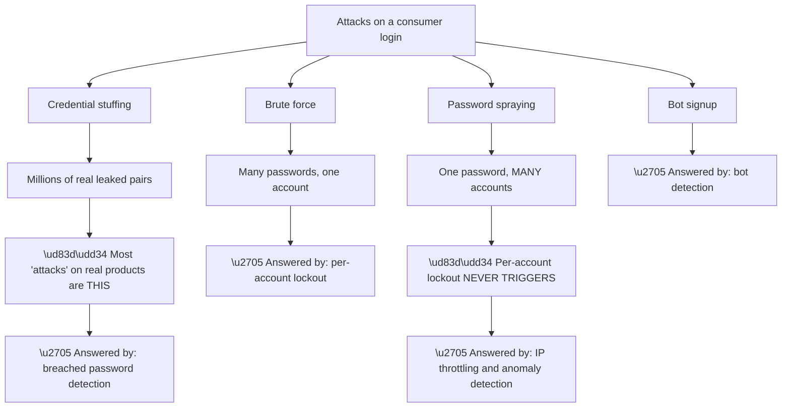
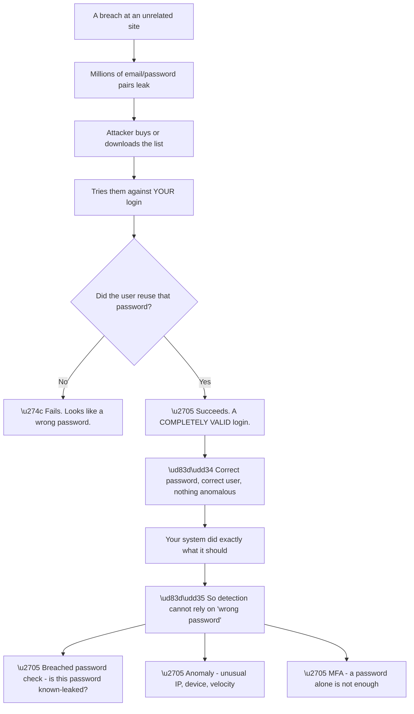
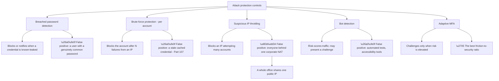
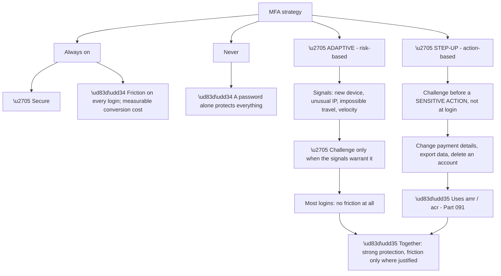
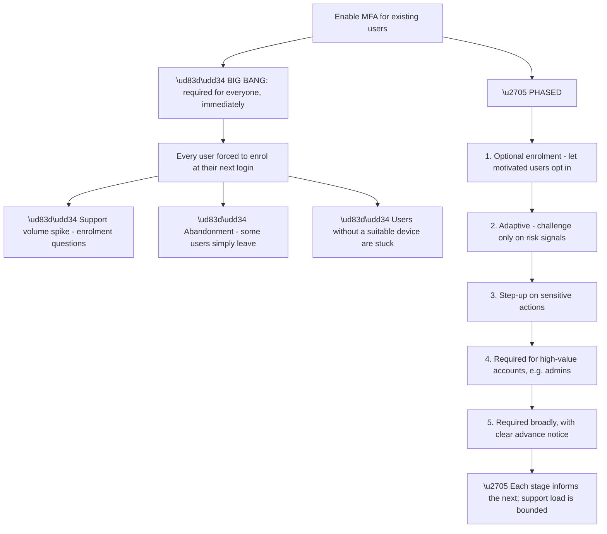
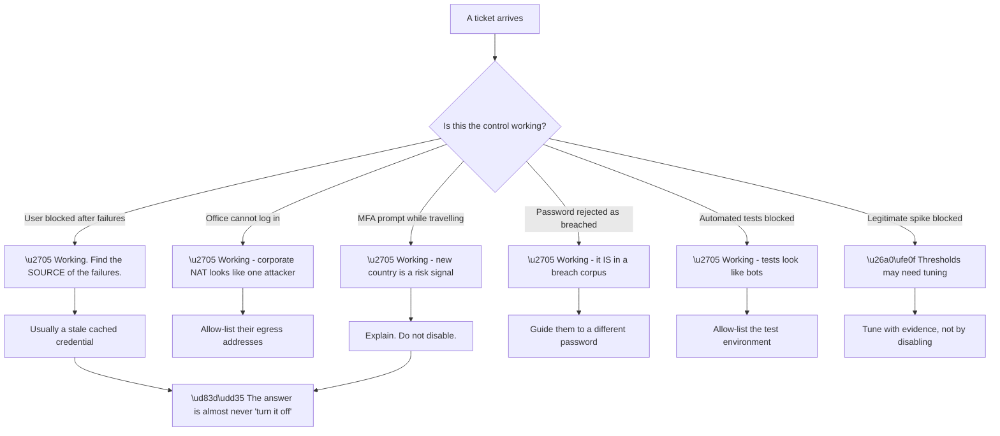
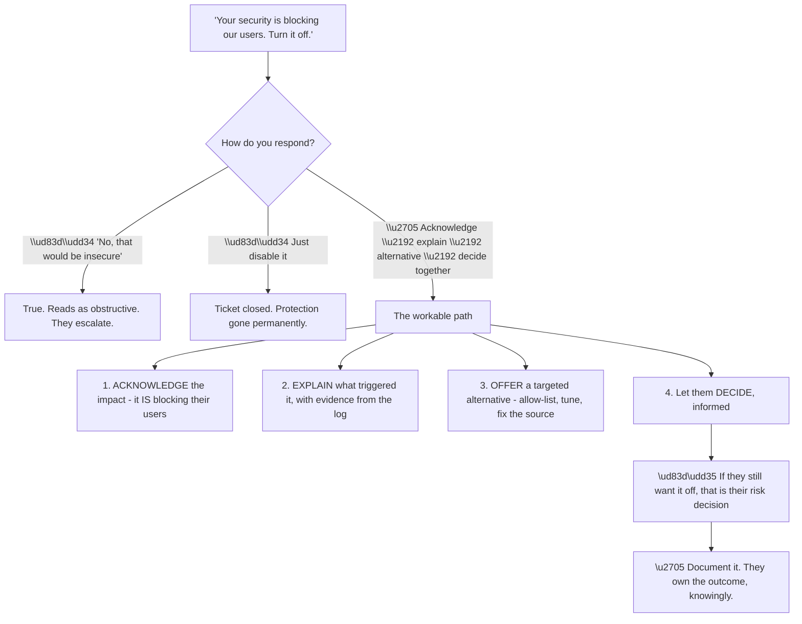
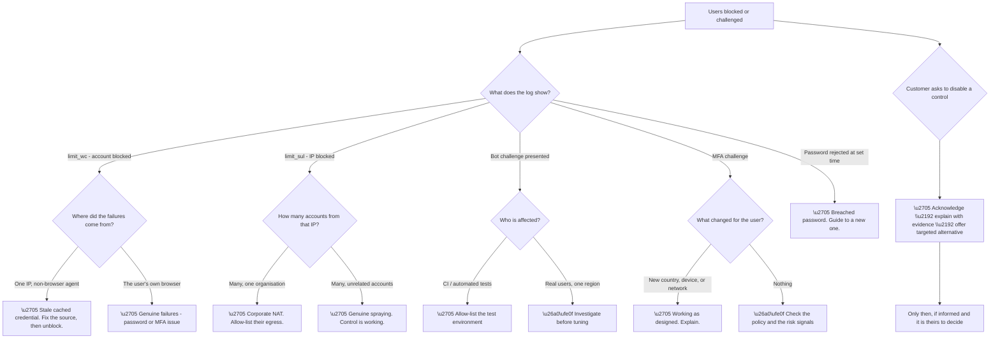

# Part 108 - Attack Protection, Bot Detection, and Adaptive MFA

> Section goal: Understand the defences that sit around authentication — what each attack actually looks like, which control answers it, and how to apply friction where the risk is rather than everywhere.

Covers index item **108**. Maps to JD signals: *Auth0*, *security*, *authentication and authorization*, *customer identity*, *troubleshooting complex technical issues*, *customer-facing communication*.

---

## 1. Start From Zero: The Four Attacks That Matter

Authentication defences make sense only against the attacks they answer. **Four attacks account for the overwhelming majority of real traffic against a consumer login.**

| Attack | Method | What it exploits |
|---|---|---|
| **Credential stuffing** | Try known username/password pairs from breaches | **Password reuse** |
| **Brute force** | Try many passwords against one account | Weak passwords |
| **Password spraying** | Try one common password across many accounts | **Lockout thresholds being per-account** |
| **Bot signup / abuse** | Automated account creation | Free tiers, promotions, spam |

**Node PS2 is the insight that explains why several controls are needed rather than one.** Password spraying is designed to defeat per-account lockout: **one attempt per account, spread across thousands of accounts, never triggers a per-account threshold.** Only controls that look across accounts — IP-based throttling, anomaly detection — can see it.

**Node CS2 is the practical reality.** In consumer products, **credential stuffing dominates.** The passwords being tried are real, correct passwords — just for a different site — which means the attacker's success rate is a function of **how many of your users reused a password that has since leaked.**

**And that is why breached-password detection is disproportionately valuable** (Part 099): it addresses the actual mechanism rather than the symptoms.

| Control | Stuffing | Brute force | Spraying | Bots |
|---|---|---|---|---|
| Breached password detection | ✅✅ | ⚠️ | ⚠️ | — |
| Per-account brute force protection | ⚠️ | ✅✅ | ❌ | — |
| IP throttling | ✅ | ✅ | ✅✅ | ✅ |
| Bot detection | ✅ | ✅ | ✅ | ✅✅ |
| MFA | ✅✅ | ✅✅ | ✅✅ | ⚠️ |

**The MFA row is worth noting:** it defeats all three password attacks, **because a correct password alone is no longer sufficient.** That is why adaptive MFA (§3) is the strongest single control — and why the friction question is the one that has to be solved.

> 💡 **Tie-in to your background:** you have supported enterprise security scenarios and worked with firewalls, proxies, and network-level protections. **The reasoning is the same** — identify the attack shape, then choose the control that sees it — applied at the authentication layer.

### 🔍 Plain-English deep-dive: why credential stuffing is a *your users* problem, not a *your product* problem

Credential stuffing is uncomfortable to discuss with customers because **nothing about their system is broken.**

**Node Y2 is the point to make clearly to a customer:** a successful credential-stuffing login is **indistinguishable from a legitimate one** by any credential-based check. The password is right. The user exists. **Nothing failed.**

**Which is why the three controls in the bottom row are the answer**, and why they work at different layers:

| Control | What it detects |
|---|---|
| **Breached password detection** | That this specific credential is known to be compromised |
| **Anomaly detection** | That the *context* is unusual — IP, device, velocity, geography |
| **MFA** | That possession of the password is insufficient |

**Breached-password detection is uniquely valuable** because it can act **at the moment of use**, before any harm occurs — and it can also act proactively at password *set* time, refusing a password that is already known to be leaked.

**The uncomfortable customer conversation** is that the vulnerability lives in user behaviour they cannot control. **The framing that works** is not "your users are careless" but *"password reuse is universal, so the defences that matter are the ones that do not depend on users behaving differently."*

**And there is a metric worth suggesting:** a sudden rise in **failed** logins is credential stuffing that is *not working* — which is reassuring. **A rise in successful logins from unusual contexts is stuffing that is working**, and that is the one to alert on (Part 107).

**Analogy:** someone trying a bunch of keys collected from other buildings. Most fail. The ones that work do so because a resident used the same key in two places — the lock is not faulty, and no lock can tell a duplicated key from the original. **Where it stops:** you could rekey the building. You cannot change what your users did on another site, only whether their key alone is enough to get in.

---

## 2. The Protection Controls

Each control answers a specific attack shape, and each has a characteristic false-positive pattern.

**Node S2a is the false positive that generates the most support tickets**, and it is worth anticipating. **An entire corporate office shares one public IP address**, so normal login activity from a large organisation can resemble an attack from a single source. **B2B products hit this constantly.**

**The mitigation is an allow-list** of the customer's known egress addresses — which requires knowing them, and which changes when their network does (Part 095's Mumbai example, in reverse).

**Node BF2 is the false positive from Part 107's worked example:** a stale cached credential retrying in the background triggers per-account protection repeatedly. **The user is legitimate, the protection is working correctly, and the outcome is a locked-out user.**

| Control | Characteristic false positive | Mitigation |
|---|---|---|
| Breached password | Genuinely common password | Guide to a better one |
| Per-account brute force | **Stale cached credential** | Find and fix the client |
| IP throttling | **Corporate NAT** | Allow-list known egress |
| Bot detection | Automated tests, accessibility tooling | Allow-list, or exempt paths |
| Adaptive MFA | Travelling users, new devices | Expected — explain it |

**The last row is important to frame correctly with customers.** An adaptive MFA challenge for a user logging in from a new country **is the control working**, not failing. **A customer reporting it as a bug needs the explanation, not a configuration change.**

**Notification versus blocking** is a configuration choice worth understanding: several controls can either **block** the attempt or **notify** an administrator or the user. **Starting in notification mode** is a legitimate rollout strategy — it reveals the false-positive rate before anyone is blocked, and it is the same reasoning as Conditional Access report-only mode (Part 091).

---

## 3. Adaptive MFA and Step-Up

MFA resolves the friction argument from Part 102 — **if it is applied selectively.**

**Node SU is often overlooked and is frequently the better answer.** Rather than deciding whether to challenge at login, **challenge at the moment something valuable is at stake.** The user experiences one prompt, at a point where it makes obvious sense to them — which also means they are less likely to abandon.

**The mechanism was established in Part 091:** the application reads `amr` to see how the user authenticated, and if a stronger assurance is required, **sends them back to authenticate again with a stronger requirement.** The connection must pass `amr` through, or the check silently fails open.

**MFA factor choice** matters and is worth advising on:

| Factor | Strength | Notes |
|---|---|---|
| **Passkey / WebAuthn** | **Strongest** | Phishing-resistant; origin-bound (Part 100) |
| Authenticator app (TOTP) | Strong | No delivery dependency |
| Push notification | Strong | ⚠️ **MFA fatigue** attacks |
| Email code | Moderate | As strong as their email |
| **SMS** | **Weakest** | **SIM swap**; still better than nothing |

**The push-notification caveat deserves naming.** **MFA fatigue** — sending repeated push prompts until an exhausted or confused user approves one — is a real and effective attack. **Number matching and context display** mitigate it, and recommending them is worthwhile.

**Recovery is the weak link**, as Part 100 established: **however strong the factors, an account is only as secure as its recovery path.** Recovery via email means the account's real security is the email account's security, and that should be a conscious decision rather than a default.

### 🔍 Plain-English deep-dive: rolling out MFA to an existing user base

Enabling MFA on a live consumer product is where security intent meets operational reality, and **doing it badly generates more damage than the risk it addresses.**

**Node B4 is the one that is easy to overlook and hardest to resolve.** A consumer base includes people with **no smartphone, a shared device, or no reliable mobile signal** — and a mandatory app-based factor excludes them entirely. **Offering more than one factor type is not a convenience; it is an accessibility requirement.**

| Stage | What it reveals |
|---|---|
| Optional enrolment | Real enrolment friction, at low stakes |
| Adaptive | The false-positive rate of the risk signals |
| Step-up | Whether `amr` survives the whole path |
| High-value accounts first | Enrolment support load, at small scale |
| Broad requirement | — by now, informed by four stages |

**Stage four is the highest value-per-effort step** and is often sufficient on its own for a while: **administrators and privileged users are a small population and the highest-value target**, so requiring MFA there buys most of the risk reduction for a fraction of the disruption.

**Two operational details worth planning before any stage:**

**Enrolment recovery.** Users will lose devices. **A defined, verified recovery route must exist before enrolment is required**, or the first lost phone becomes an unplanned support crisis.

**Communication.** Users who are unexpectedly asked for a second factor **frequently believe it is a phishing attempt** — which is a healthy instinct. **Advance notice through a channel they already trust** prevents a wave of "is this real?" contacts and, worse, users who dismiss a legitimate prompt.

**And the metric to watch during rollout** is not enrolment rate but **completion rate of logins**. A drop there is abandonment, and it is the signal to slow down rather than push forward.

**Analogy:** adding a second lock to every door in a building. Doing it overnight means everyone arrives to a door they cannot open and no one to ask. Doing it floor by floor, with notice and a locksmith on hand, achieves the same security with none of the crisis. **Where it stops:** a locksmith can let someone in. An identity system can only follow the recovery path it was given in advance.

---

## 4. When Protection Causes the Ticket

A significant share of tickets in this area are **the controls working correctly and someone experiencing it as a failure.**

**Node R is the position to hold**, and it is the "always secure, always on" value (Part 096) in practice. **Disabling a control to resolve a ticket removes the protection permanently to fix a temporary inconvenience.**

**The productive alternatives, in order of preference:**

| Instead of disabling | Do this |
|---|---|
| Turn off brute force protection | Find and fix the stale credential |
| Turn off IP throttling | Allow-list the customer's known egress |
| Turn off adaptive MFA | Explain the signal; tune thresholds if genuinely wrong |
| Turn off bot detection | Exempt the test environment specifically |
| Lower the breached-password check | Help the user choose a different password |

**Every row replaces a permanent removal with a targeted exception**, which is both safer and usually faster.

**Where tuning is genuinely warranted**, it should be evidence-based: **the log data (Part 107) shows the false-positive rate**, and a threshold changed on evidence is defensible in a way that one changed on a single complaint is not.

### 🔍 Plain-English deep-dive: explaining security friction to a frustrated customer

These conversations are difficult because the customer is annoyed, the system is behaving correctly, and **being right is not the same as being useful.**

**Node G1 matters more than it looks.** A customer whose users cannot log in has a real problem, **and leading with the security argument implicitly denies that.** Acknowledging the impact first makes everything after it land differently.

**Node G2 is where the evidence does the work.** *"The block was triggered by 340 failed attempts from a single IP over four minutes"* changes the conversation from a policy dispute to a factual one — **and it usually surfaces the actual cause**, which is often something they can fix.

**Node G5 is the honest boundary.** Where a control is configurable and the customer, fully informed, still wants it disabled, **that is their risk decision to make.** The role is to ensure it is informed, not to prevent it — and to document it, so the decision is traceable if it matters later.

**What must not be conceded** is anything that is not theirs to decide, or anything that weakens security for other tenants. **"I can't do that, and here is what I can do"** is a complete and appropriate answer in those cases.

**One phrase that consistently helps:** *"let me find out what actually triggered it, because if it is what I suspect, there is a fix that keeps you protected and unblocks your users today."* **It commits to their outcome without conceding the control**, and it is usually true.

**Analogy:** a fire door that keeps swinging shut in a busy corridor. The answer is not to wedge it open permanently, and it is also not to lecture people about fire safety while they struggle with trolleys. It is to find out why it is being used as a thoroughfare and fix that. **Where it stops:** a wedged door is visibly wrong. A disabled security control looks exactly like a working one until the day it matters.

---

## 5. Failure Modes

| # | Failure mode | Symptom | Root cause | First check |
|---|---|---|---|---|
| 1 | Stale cached credential | Account repeatedly blocked | Background client with an old password | Compare `ip` / `user_agent` |
| 2 | Corporate NAT | Whole office blocked | Many accounts, one IP | Is it one source IP? |
| 3 | Automated tests blocked | CI failures | Tests resemble bots | Allow-list the environment |
| 4 | MFA on travel | "It's asking for MFA again" | Risk signal — working correctly | Explain; do not disable |
| 5 | Breached password rejected | "My password is fine" | It is in a breach corpus | Guide to a new one |
| 6 | MFA fatigue | Unauthorised approval | Repeated push prompts | Enable number matching |
| 7 | SMS as primary factor | Account takeover | SIM swap | Recommend stronger factors |
| 8 | Weak recovery path | Strong MFA, weak recovery | Email-based recovery | What is the recovery route? |
| 9 | Spraying undetected | Slow compromise | Per-account lockout never fires | Is IP throttling on? |
| 10 | Control disabled to close a ticket | Permanent exposure | Wrong resolution | Was an alternative offered? |
| 11 | `amr` lost through federation | Step-up silently fails open | Claim not passed through | Does `amr` arrive downstream? |
| 12 | Thresholds tuned on one complaint | Weakened without evidence | No data | What does the log show? |
| 13 | Notification mode never reviewed | False sense of protection | Notifying, not blocking | Which mode is it in? |
| 14 | Bot detection on an API path | Legitimate integrations blocked | Wrong scope | Which paths are protected? |

---

## 6. Troubleshooting Decision Tree: Protection Problems

### Worked example

A B2B customer escalates: **an entire client organisation — around 200 people — cannot log in.** It started this morning. Their own users elsewhere are fine.

**Node B: the log shows `limit_sul`** — the IP address is blocked.

**Node D: how many accounts from that IP?** Around 200, all belonging to one organisation, all within a short window.

**Node D1: corporate NAT.** The organisation's entire office egresses through one public address, so **200 people arriving at work and logging in within twenty minutes looks, from a single-IP perspective, exactly like an attack.**

**Why today?** The organisation migrated to a new internet breakout overnight. **Their previous egress address was allow-listed; the new one is not.**

**The control is working exactly as designed.** It is seeing many accounts from one source in a short window, which is the signature of password spraying — and it cannot know that this source is a legitimate office.

**The immediate fix** is to allow-list the new egress range, which unblocks them within minutes.

**Three write-up points, in increasing value:**

**First:** this will recur whenever their network changes. **A process linking network changes to the allow-list is the prevention.**

**Second:** it is worth asking whether IP-based allow-listing is the right long-term approach for a large B2B customer, or whether **the organisation should be on an enterprise connection** (Part 101) where their own IdP handles authentication and the volume never reaches the throttle.

**Third, and most useful:** this is precisely the mirror of Part 095's Mumbai example — **the same network change, causing opposite symptoms at two different layers.** There, a new egress broke a Conditional Access named-location policy; here, it broke an IP allow-list. **A network change is a recognised trigger for identity failures across multiple layers**, and asking "has anything changed on your network?" belongs in the standard question set.

**What made it fast:** the population — one organisation, all at once, others fine. **That shape is a single shared attribute**, and a shared egress IP is the most common one.

---

## 7. Lab: Trigger and Tune Protections

**Purpose.** Experience each control from both sides — as a defender and as a blocked user — and practise the customer conversation.

**Prerequisites.**
- The free tenant from Part 097 with test users
- A local script that can generate login attempts
- **Never** run this against an employer or customer tenant, and never against any tenant you do not own

**Steps.**

1. **Enable breached password detection.** Attempt to set a well-known weak password on a test user. **Record what happens and the exact wording.**
2. **Enable brute force protection.** Fail a single account repeatedly until blocked. **Find `limit_wc` in the log** (Part 107).
3. **Record the user experience** of being blocked — the message is deliberately vague.
4. **Unblock the account** and note how.
5. **Simulate a stale client:** run a script attempting the same account with a wrong password every thirty seconds. **Observe the account re-block after unblocking.** This is failure mode 1.
6. **Enable suspicious IP throttling.** Attempt logins across many accounts from one source. **Find `limit_sul`.**
7. **Compare the two blocks** — per-account versus per-IP — and write down which attack each answers.
8. **Enable bot detection.** Observe what a scripted request encounters versus a browser.
9. **Enable adaptive MFA.** Log in normally, then from a different network or device. **Record whether the challenge appears.**
10. **Enrol a TOTP factor** and complete a challenge.
11. **Switch a control to notification mode** and confirm it logs without blocking. **Explain in writing why this is a good rollout strategy.**
12. **Write the customer conversation** for the §6 scenario, using the four-step structure: acknowledge, explain with evidence, offer an alternative, let them decide.

**Expected evidence.**
- A rejected breached password, with wording
- `limit_wc` and `limit_sul` entries side by side
- Evidence of an account re-blocking due to a simulated stale client
- A bot detection challenge observed
- An adaptive MFA challenge from a changed context
- A control in notification mode, logging without blocking
- Your written customer conversation

**Validation rubric.**

| Criterion | Pass |
|---|---|
| Attack shapes | You can name four attacks and which control answers each |
| Spraying | You can explain why per-account lockout does not see it |
| Stuffing | You can explain why a successful stuffing login looks legitimate |
| False positives | You can name each control's characteristic false positive |
| Adaptive vs step-up | You can explain both and when each fits |
| Conversation | You can run the four-step structure without conceding the control |
| Safety | Your own tenant only, fictional users, everything reverted |

**Cleanup and privacy.** Unblock all accounts, revert every control to its default, and delete test users and scripts. **Never generate login attempts against a tenant you do not own** — that is indistinguishable from an attack and may breach terms of service and law. **Keep everything inside your own free tenant.**

---

## 8. JD Mapping

| JD signal | How this Part addresses it |
|---|---|
| Auth0 product knowledge | Attack protection, bot detection, adaptive MFA |
| Security | Attack shapes and matched controls |
| Authentication and authorization | MFA factors, step-up, `amr` |
| Customer identity | The friction-versus-security resolution |
| Troubleshooting complex technical issues | Fourteen failure modes and a log-first tree |
| Customer-facing communication | The four-step conversation for security friction |
| Root cause analysis | Population shape identifying a shared egress IP |

---

## 9. Candidate Honesty Note

- **Production experience:** enterprise security support, network-level protections, and explaining correct-but-unwelcome system behaviour to customers.
- **Production experience:** identifying causes from population shape — the "one organisation, all at once" pattern.
- **Lab experience:** triggering each control, observing both blocks, simulating a stale client, and practising the customer conversation, as above.
- **Learned architecture:** breach-corpus detection, MFA fatigue mitigations, and adaptive risk signalling.
- **No direct experience:** tuning attack protection for a production consumer tenant, or handling a live credential-stuffing incident.
- **How to say it:** *"The reasoning here is familiar from security support — identify the attack shape, then pick the control that can actually see it. I've triggered each protection in my own tenant to see both sides, including simulating the stale-credential loop that repeatedly re-blocks an account. What I'd want to be careful about is that most of these tickets are the control working correctly, and the answer is almost never to turn it off."*

---

## 10. Official Source Anchors

| Source | Why | Accessed |
|---|---|---|
| Auth0 Docs — Attack Protection | Brute force, suspicious IP throttling, breached passwords | Accessed **26 August 2026** |
| Auth0 Docs — Bot Detection | How it scores and challenges | Accessed **26 August 2026** |
| Auth0 Docs — Adaptive MFA | Risk signals and policy | Accessed **26 August 2026** |
| Auth0 Docs — Multi-factor authentication factors | Factor options and enrolment | Accessed **26 August 2026** |
| OWASP — Credential Stuffing Prevention Cheat Sheet | Attack mechanics and defences | Accessed **26 August 2026** |
| NIST SP 800-63B — Digital Identity Guidelines | Authenticator assurance and SMS guidance | Accessed **26 August 2026** |

> **Revalidate:** thresholds, default behaviours, and available risk signals change. Re-check the current documentation before advising on specific settings.

---

## ⭐ Likely Interview Questions for This Section

### Q1. "What attacks does a consumer login actually face?"

> *Model answer:* Four, and they need different controls. Credential stuffing is trying known email and password pairs from other sites' breaches, and it dominates in practice because password reuse is universal. Brute force is many passwords against one account, which per-account lockout handles. Password spraying is one common password across many accounts, and it is specifically designed to defeat per-account lockout — one attempt per account never trips a per-account threshold, so only IP-level throttling and anomaly detection can see it. And bot signup abuse targets free tiers and promotions. The reason to know the shapes is that a control only helps against the attacks it can actually observe, and spraying is the clearest example of a control being blind by construction.

### Q2. "Why is credential stuffing so hard to detect?"

> *Model answer:* Because a successful attempt is indistinguishable from a legitimate login by any credential-based check. The password is correct, the user exists, nothing failed — the system did exactly what it should. The credential is valid; it just leaked from somewhere else. So detection has to come from three other places: breached-password detection, which asks whether this specific credential is known to be compromised; anomaly detection, which looks at context like IP, device, and velocity; and MFA, which makes the password alone insufficient. Breached-password detection is the most valuable because it acts at the moment of use and can also refuse a known-leaked password at set time. And it is worth noting the metric distinction — a spike in failed logins is stuffing that is not working, whereas successful logins from unusual contexts are stuffing that is.

### Q3. "An entire office cannot log in. What's your first hypothesis?"

> *Model answer:* Suspicious IP throttling triggered by their corporate NAT. An office egresses through one public address, so a couple of hundred people arriving at work and logging in within twenty minutes looks, from a single-IP perspective, exactly like password spraying — many accounts, one source, short window. The control cannot know that source is a legitimate office. I would confirm from the log by checking for `limit_sul` and counting distinct accounts from that IP. The usual trigger is a network change: their previous egress was allow-listed and a new breakout has a different address. The immediate fix is allow-listing the new range, and the prevention is a process linking network changes to that list.

### Q4. "A user is repeatedly locked out and insists their password is correct. What's happening?"

> *Model answer:* It usually is correct. The lockout is almost always driven by a stale cached credential somewhere they have forgotten — a mail client on a phone, a saved password on another device, or a script — retrying automatically with an old password every few minutes. Reading the log as a pattern rather than a single entry shows it: many failed password events, then a block, and comparing the IP and user agent fields across the failures reveals two distinct sources, one of which is not a browser. The fix has two halves, and doing only one guarantees recurrence — unblock the account, and find and fix the stale client, because unblocking alone means it re-blocks within minutes.

### Q5. "A customer asks you to turn off a security control. How do you handle it?"

> *Model answer:* With four steps. Acknowledge the impact first, because their users genuinely cannot log in and leading with the security argument implicitly denies that. Explain what actually triggered it, with evidence from the log — "the block followed 340 failed attempts from one IP over four minutes" changes it from a policy dispute to a factual one and usually surfaces a cause they can fix. Offer a targeted alternative: allow-list their egress, exempt the test environment, fix the stale credential, tune a threshold on evidence. Then let them decide, informed. If the control is theirs to configure and they still want it off, that is their risk decision and I would document it. What I would not do is either flatly refuse without an alternative, which leaves them blocked, or quietly disable it, which removes protection permanently to fix a temporary problem.

### Q6. "What's the difference between adaptive MFA and step-up authentication?"

> *Model answer:* Adaptive MFA decides at login whether to challenge, based on risk signals — a new device, an unusual IP, impossible travel, unusual velocity — so most logins have no friction at all and the challenge appears when the signals warrant it. Step-up decides at the moment of a sensitive action instead: changing payment details, exporting data, deleting an account. Step-up is often the better answer and is frequently overlooked, because the user gets one prompt at a point where it obviously makes sense to them, which also makes them less likely to abandon. The mechanism is the `amr` claim — the application reads how the user authenticated and, if it needs stronger assurance, sends them back with a stronger requirement. The thing to verify is that `amr` survives any federation hop, because if it is lost in the middle the check silently fails open.

### Q7. "Which MFA factors would you recommend, and which would you caution about?"

> *Model answer:* Passkeys or WebAuthn first, because they are phishing-resistant by construction — the credential is bound to the origin and never leaves the device. Then an authenticator app with time-based codes, which has no delivery dependency. Push notifications are strong but carry MFA fatigue risk, where an attacker sends repeated prompts until a tired or confused user approves one, so number matching and context display matter. Email codes are only as strong as the email account. SMS is the weakest widely-deployed factor because of SIM swap, though it is still much better than nothing for some populations, and I would name the risk rather than just recommending against it. And whatever the factors, I would ask about the recovery path, because an account is only as secure as its weakest route back in.

### Q8. "How do you decide whether a protection ticket is a bug or the control working?"

> *Model answer:* By looking at what triggered it in the log and asking whether the trigger was reasonable. A user blocked after dozens of failed attempts, an office blocked when two hundred accounts hit from one IP, an MFA challenge after someone logs in from a new country, a password rejected because it is genuinely in a breach corpus — all of those are the control doing precisely its job, and the answer is to fix the underlying trigger or add a targeted exception, not to disable it. Where I would consider tuning is if the log shows a genuine false-positive rate — legitimate traffic being blocked repeatedly with no attack signature — and even then I would tune on the evidence rather than on a single complaint. Notification mode is useful here, because it reveals what would have been blocked before anything is.

---

## 🧠 30-Second Memory Hooks

- **Four attacks: stuffing · brute force · spraying · bots.**
- **Spraying defeats per-account lockout by design.** Only IP-level controls see it.
- **Credential stuffing dominates**, and a successful attempt looks completely legitimate.
- **Breached-password detection addresses the mechanism, not the symptom.**
- **False positives: stale credential · corporate NAT · CI tests · travelling users.**
- **`limit_wc` = account blocked. `limit_sul` = IP blocked.**
- **Repeated lockout = a stale cached credential.** Fix the source, then unblock.
- **Whole office blocked = corporate NAT.** Allow-list the egress.
- **Adaptive MFA = risk at login. Step-up = risk at the action.**
- **Step-up needs `amr` to survive federation** or it fails open.
- **Passkeys strongest. SMS weakest. Push = MFA fatigue → number matching.**
- **Recovery is the weakest link, whatever the factors.**
- **Notification mode first** — same reasoning as report-only Conditional Access.
- **The answer is almost never "turn it off."**
- **Acknowledge → explain with evidence → offer an alternative → let them decide.**

---

## ✅ Completion Checklist

- [ ] I can name four attacks and the control that answers each
- [ ] I can explain why spraying defeats per-account lockout
- [ ] I can explain why successful credential stuffing is indistinguishable from a real login
- [ ] I can name each control's characteristic false positive
- [ ] I can recognise the stale-credential lockout loop
- [ ] I can recognise the corporate NAT block from the population shape
- [ ] I can explain adaptive MFA versus step-up and the `amr` dependency
- [ ] I can advise on factors, including MFA fatigue and SIM swap
- [ ] I can run the four-step conversation without conceding the control
- [ ] I have completed the lab in my own tenant and reverted everything
- [ ] I can state honestly what transfers from my experience and what was new

*Next suggested section:* **[Part 109 - Fine-Grained Authorization and Identity for AI Agents](Part-109-fine-grained-authorization-and-identity-for-ai-agents.md)** — the two newest product areas: permissions beyond roles, and identity for autonomous agents acting on a user's behalf.
