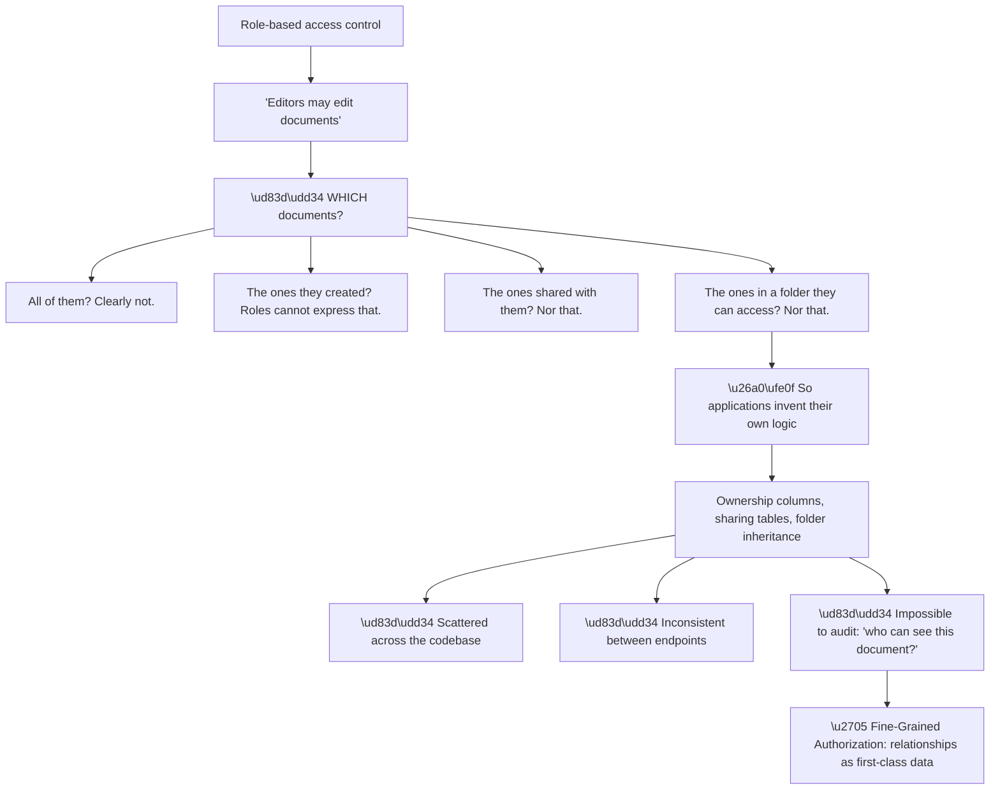
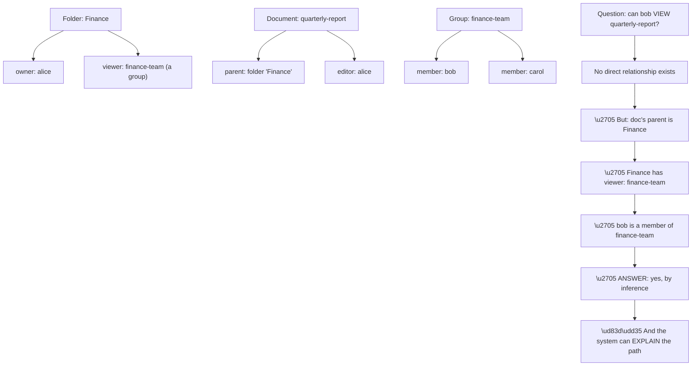
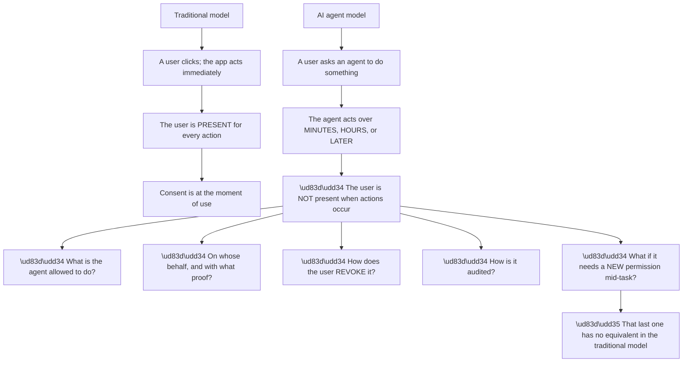
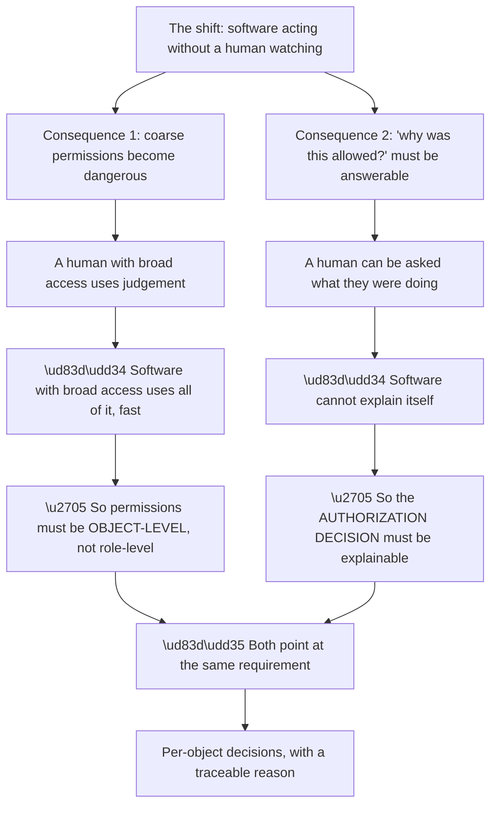
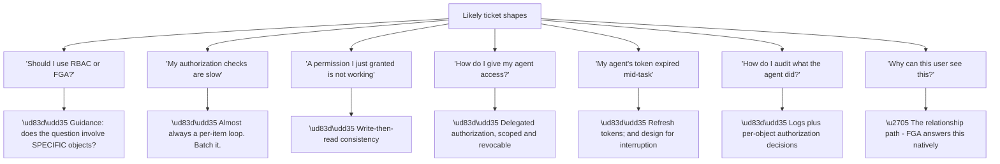
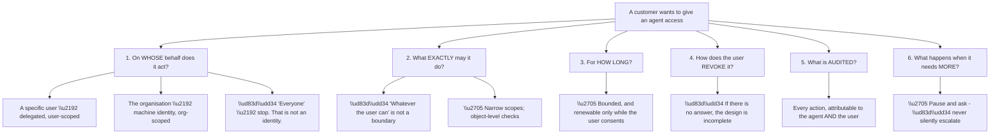
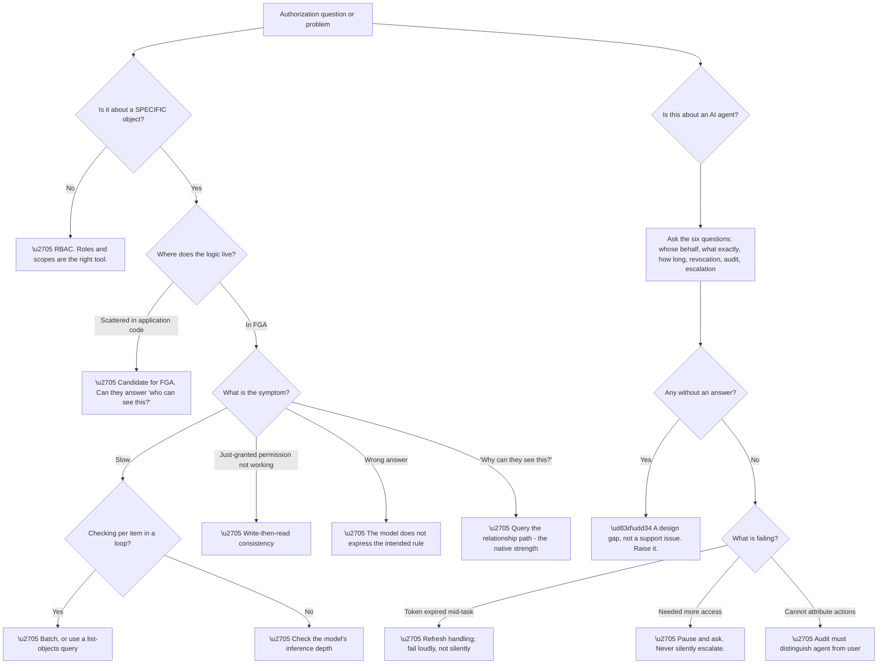

# Part 109 - Fine-Grained Authorization and Identity for AI Agents

> Section goal: Cover the two newest Auth0 product areas — authorization that goes beyond roles, and identity for autonomous agents acting on a user's behalf — and understand why both exist now.

Covers index item **109**. Maps to JD signals: *Auth0*, *authorization*, *APIs*, *AI*, *security*, *architecture guidance*, *troubleshooting complex technical issues*.

---

## 1. Start From Zero: Where Roles Stop Working

Part 098 covered scopes and RBAC. **Roles answer "what kind of thing may this user do." They cannot answer "which specific things."**

**Node W4 is the requirement that eventually forces the change.** *"Who can access this document, and why?"* is a question every organisation eventually needs to answer — for support, for compliance, for incident response — **and an application with authorization logic scattered across dozens of endpoints cannot answer it at all.**

**Fine-Grained Authorization (FGA) stores relationships as data** and answers questions against them. Instead of *"does this user have the editor role?"* the question becomes *"is this user an editor **of this document**?"* — and the answer may come through ownership, sharing, group membership, or folder inheritance, all evaluated consistently.

| Model | Expresses | Example |
|---|---|---|
| **RBAC** | What kind of action | "Editors may edit" |
| **ABAC** | Attribute conditions | "Only during business hours" |
| **ReBAC** | **Relationships** | "Jo is an editor **of doc-42**" |

**FGA is relationship-based**, and the shift is from asking about the *user* to asking about the *user-and-object pair.*

> 💡 **Tie-in to your background:** you have worked with SQL and permissions models. **FGA is essentially a purpose-built relationship store with an inference engine** — the underlying reasoning is familiar; the reason it exists as a separate service is that doing it correctly and fast at scale is genuinely hard.

### 🔍 Plain-English deep-dive: relationships, inheritance, and the question that matters

The power of a relationship model comes from **inference** — permissions that follow from other relationships rather than being stated directly.

**Node R is the capability that distinguishes this from application code.** The system can not only answer *yes*, it can **show the chain of relationships that produced the answer** — document, to folder, to group, to member.

**That is transformative for support**, and it is worth appreciating why: *"why can this person see this?"* becomes a query with a traceable answer, rather than a code review across several services.

| Question | RBAC answer | FGA answer |
|---|---|---|
| Can Bob edit this? | Is Bob an editor? | Is Bob an editor **of this object**? |
| Why can Bob see this? | ⚠️ Read the code | ✅ **The relationship path** |
| Who can see this document? | ⚠️ Impossible in general | ✅ **Query it** |
| What can Bob see? | ⚠️ Enumerate everything | ✅ **Query it** |

**Rows three and four are the ones that were previously unanswerable**, and both are common real requirements — the first for access reviews and incident response, the second for building a "your items" view efficiently.

**The cost of the model is real and worth naming:**

| Consideration | Detail |
|---|---|
| **Latency** | An authorization check is now a service call |
| **Consistency** | A relationship written now must be visible to the next check |
| **Modelling** | The authorization model must be designed deliberately |
| **Data volume** | Relationships scale with objects, not users |
| **Operational dependency** | Authorization becomes a service that must be available |

**The latency row is the one developers ask about first**, and the honest answer is that checks are designed to be fast and can be batched, **but it is a network call where previously there was a database join.** Applications that check authorization in a loop over a list need the batched or list-objects style query rather than N individual checks — **the same per-item-loop mistake as Parts 105 and 106, in a third setting.**

**The consistency row matters for a specific, recognisable bug:** a user is granted access and immediately cannot use it. **Write-then-read consistency has to be considered deliberately**, and most systems of this kind offer a way to request a strongly-consistent read when it matters.

**Analogy:** a library that records who may borrow what, including rules like "anyone in the history department may borrow anything on the history shelves." Asking whether someone may borrow a specific book is answered by following relationships, and the librarian can explain which rule applied. **Where it stops:** a librarian can use judgement about an unusual case. A relationship engine answers only what the model expresses, which is why modelling it correctly is the real work.

---

## 2. Identity for AI Agents

The second new area addresses a genuinely new problem: **software that acts autonomously on a user's behalf.**

**Node R identifies what is genuinely new.** In a traditional application, needing a new permission means prompting the user, who is right there. **An agent discovering mid-task that it needs additional access has no user to ask** — and the design question is whether it pauses and waits, fails, or proceeds without.

**The existing OAuth machinery covers more of this than people expect**, which is worth knowing because it prevents the assumption that everything here is unprecedented:

| Requirement | Existing mechanism |
|---|---|
| Act on a user's behalf | **Delegated authorization** — the core of OAuth (Part 056) |
| Bounded permissions | **Scopes** (Part 058) |
| Long-running access | **Refresh tokens** (Part 069) |
| Revocation | **Token revocation** |
| Audit | **Token issuance and use logging** |
| Machine identity | **Client credentials** (Part 062) |

**Six of six have an OAuth answer**, which reframes the problem usefully: **agent identity is largely an application of delegated authorization, with new constraints around duration, autonomy, and scale.**

**What genuinely changes:**

| Change | Why it matters |
|---|---|
| **Duration** | An agent may hold access for far longer than a session |
| **Absence** | No user present to consent to anything new |
| **Volume** | An agent may make thousands of calls |
| **Chaining** | Agents calling other agents or tools |
| **Explainability** | "Why did it do that?" must be answerable |

**The chaining row is the hardest.** When agent A invokes tool B which calls service C, **the authorization question is whether C should honour a request that originated with a user two hops away** — and whether the user's consent extended that far. **This is delegation depth**, and it is where the model strains.

**And it is exactly where FGA and agent identity connect**: an agent acting on a user's behalf should be constrained to **what that user can access**, evaluated per object, not merely to a coarse scope. **The two product areas are complementary by design.**

### 🔍 Plain-English deep-dive: why these two product areas appeared at the same time

Fine-grained authorization and agent identity are not adjacent by coincidence. **The same shift makes both necessary**, and seeing that makes each easier to reason about.

**Node C1b is the asymmetry that matters.** A person granted access to "all customer records" reads a handful and stops, because they have a task and judgement. **An agent granted the same access may traverse everything**, at speed, without noticing that it has gone beyond what was intended — and without anyone watching.

| Property | Human with broad access | Agent with broad access |
|---|---|---|
| Uses all of it? | Rarely | ⚠️ Potentially |
| Notices something odd? | Usually | ❌ No |
| Can be asked afterwards? | ✅ | ❌ |
| Rate of action | Human | **Machine** |
| Stops when confused | ✅ | ❌ Continues |

**Every row argues for narrower, object-level permissions** rather than role-level ones — which is precisely what FGA provides and what roles cannot.

**Node C2c is the second half.** When something goes wrong and an agent accessed something it should not have, **"why was that allowed?" needs an answer** — and an answer that lives in application code across several services is not an answer at all. **A relationship path is.**

**So the practical guidance for a customer building agents** is a single sentence worth remembering: **give the agent object-level permissions derived from what its principal can access, and make sure every decision is explainable afterwards.** That is FGA and agent identity working together rather than as two separate products.

**And it explains why both areas are prominent now** rather than five years ago: **unattended software at scale is the thing that broke the old assumptions**, and both products are responses to the same change.

**Analogy:** giving a very fast, very literal assistant the keys to the filing room. A person would fetch one file; the assistant may index the entire room before anyone notices, and cannot afterwards explain why it thought that was in scope. **Where it stops:** an assistant can be trained to use judgement. Software applies exactly the permissions it holds, which is why the permissions have to be the judgement.

---

## 3. What Support Questions Look Like Here

Both areas are newer, so tickets skew toward **architecture guidance** rather than debugging (Part 096's ticket type two).

**Node T1a is the guidance question**, and it has a clean discriminator: **does the authorization decision depend on a specific object?**

| Question | Model |
|---|---|
| "May admins access the admin panel?" | ✅ RBAC — no specific object |
| "May Jo edit **document 42**?" | ✅ FGA — object-specific |
| "May this user export data?" | ✅ RBAC |
| "May this user see **this customer record**?" | ✅ FGA |
| "May this user act during business hours?" | ABAC-style condition |

**A hybrid is normal and correct**, and worth saying so: RBAC for coarse capabilities, FGA for object-level decisions. **Suggesting a customer replace RBAC wholesale is usually wrong** — the two answer different questions.

**Node T2a is the recurring performance answer.** An application checking authorization inside a loop over fifty items makes fifty calls. **Batched checks or a list-objects query does it in one** — and recognising the loop is the fast, high-value observation, exactly as with the Management API (Part 106) and user operations (Part 105).

**Node T5a is agent-specific and worth thinking about carefully.** An agent running for hours will encounter token expiry mid-task. **Refresh tokens handle the mechanics**, but the design question is what happens if refresh fails — **an agent that silently stops halfway through a task is worse than one that fails loudly**, because the user believes it completed.

### 🔍 Plain-English deep-dive: the questions to ask about an agent before anything else

Agent identity is new enough that customers frequently have not thought through the boundaries. **A small set of questions surfaces the design gaps quickly.**

**Node Q1c is the answer that should stop the conversation.** An agent acting "on behalf of everyone" has no principal, **so nothing can be scoped, audited, or revoked meaningfully.** It is a shared super-user by another name, and it is worth saying so plainly.

**Node Q2a is the most common under-specification.** *"It can do whatever the user can"* sounds reasonable and is not a boundary — **users can do a great deal, and an agent operating unattended with the full range of a user's authority is a much larger risk than the user themselves**, because it acts faster, at scale, without judgement, and without noticing that something has gone wrong.

**The principle to apply is least privilege with intent:** an agent booking meetings needs calendar write access, **not the user's entire capability set.**

**Node Q4a is the question that most often has no answer**, and it is a genuine design gap rather than a detail. **A user who granted an agent access must be able to withdraw it** — visibly, in a place they can find, with immediate effect. **If revocation requires contacting support, the design is incomplete.**

**Node Q6a is the design decision with the largest consequences.** An agent that discovers mid-task that it needs more access has three options: **pause and ask, fail cleanly, or proceed without.** The third is unacceptable; the second is safe; **the first is best but requires the product to support asynchronous consent** — notifying the user, holding state, and resuming.

**And there is a transparency requirement that goes beyond authorization:** actions taken by an agent should be **distinguishable in audit trails from actions taken by the user directly.** *"Jo deleted this"* and *"Jo's agent deleted this"* are different facts, and conflating them makes incident investigation much harder.

**Analogy:** giving someone power of attorney. You would specify what for, for how long, how to revoke it, and what they must come back to you about. Signing an unbounded, permanent, unrevocable one and hoping for the best would be extraordinary. **Where it stops:** an attorney exercises judgement and can be asked. An agent does what its instructions and permissions allow, at machine speed, without pausing to wonder.

---

## 4. Failure Modes

| # | Failure mode | Symptom | Root cause | First check |
|---|---|---|---|---|
| 1 | RBAC used for object-level decisions | Authorization logic scattered in code | Wrong model | Does it depend on a specific object? |
| 2 | Per-item authorization loop | Slow endpoints | N calls instead of one | Is it batched? |
| 3 | Write-then-read consistency | New permission not effective | Eventual consistency | Is a consistent read available? |
| 4 | Authorization model under-designed | Wrong answers, hard to change | Modelling skipped | Was the model reviewed? |
| 5 | Authorization service unavailable | Requests fail | New operational dependency | What is the failure behaviour? |
| 6 | Agent with unbounded scope | Excessive risk | "Whatever the user can" | What exactly may it do? |
| 7 | Agent with no revocation path | Cannot withdraw access | Design gap | How does the user revoke? |
| 8 | Agent token expiry mid-task | Silent partial completion | No refresh handling | Does it fail loudly? |
| 9 | Agent actions indistinguishable | Audit ambiguity | Not attributed separately | Can you tell agent from user? |
| 10 | Silent privilege escalation | Agent proceeds without consent | Wrong design choice | What happens when it needs more? |
| 11 | Delegation chaining unbounded | Consent stretched too far | Multi-hop agents | How deep does authority travel? |
| 12 | Agent acting "for everyone" | No principal | Not an identity | **Stop and redesign** |

---

## 5. Troubleshooting Decision Tree: Authorization and Agents

### Worked example

A customer asks: *"our document-sharing feature is slow, and our compliance team wants a report of who can access each document. Can you help?"*

**Two requests, one root cause.**

**The performance question first.** Their list endpoint returns fifty documents and **checks authorization for each one individually** — fifty round trips. **Node D1: a per-item loop**, and the answer is a batched check or a list-objects query, which is one call.

**But the compliance question is the more interesting one**, and it explains the first.

**Their authorization logic is in application code**, spread across several services: an ownership column here, a sharing table there, folder inheritance implemented in one service and not another. **They cannot produce the report** because there is no single place that knows the answer.

**So the two problems share a cause:** authorization is implemented ad hoc rather than modelled. **The loop exists because each check has to be computed individually; the report is impossible because no system holds the relationships.**

**The guidance, rather than a fix:**

**Short term:** batch the checks to resolve the performance symptom.

**Medium term:** model the authorization relationships explicitly, which makes both the batched query and the compliance report natural rather than difficult.

**And the honest framing:** this is **architecture guidance, not debugging** (Part 096, ticket type two). The right response is not a configuration change but **helping them see that two symptoms share a cause**, and letting them decide whether to address it.

**What made this a good interaction:** connecting two apparently unrelated requests. **A customer who asks about performance and compliance in the same message is often describing one underlying problem twice**, and noticing that is worth more than answering either question well.

---

## 6. Lab: Model Authorization and Reason About Agents

**Purpose.** Build a small relationship model, experience inference, and produce a design review checklist for agent access.

**Prerequisites.**
- A free FGA/authorization sandbox, or the modelling playground in the documentation
- Pen and paper is genuinely sufficient for the agent portion
- **Never** model real customer data — use fictional objects

**Steps.**

1. **Write an authorization model** for a document system with users, groups, folders, and documents. Define relations: owner, editor, viewer, parent, member.
2. **Express inheritance:** a viewer of a folder is a viewer of documents inside it.
3. **Add relationship tuples:** a user owns a document, a group views a folder, a user is a member of that group.
4. **Query whether the group member can view the document.** **Confirm the answer is yes by inference**, with no direct tuple.
5. **Ask the system to explain the path.** **Record it.** This is §1's key capability.
6. **Query "who can view this document?"** and record the result.
7. **Query "what can this user view?"** and record it.
8. **Write both queries as SQL** against a hypothetical schema. **Compare the complexity** — this is the argument for the model.
9. **Remove one tuple** and re-run the query. Confirm the answer changes and the path differs.
10. **For the agent portion:** write out the six questions from §3 and answer them for a concrete scenario — an agent that books meetings on a user's behalf.
11. **Identify which answers are uncomfortable** in your scenario. Those are the design gaps.
12. **Write a one-page agent access review checklist** you could give a customer.

**Expected evidence.**
- Your authorization model, with relations and inheritance
- Tuples, and a query answered by inference
- The explained relationship path
- Both reverse queries with results
- The SQL comparison, with your complexity note
- Six answered questions for a concrete agent scenario
- Your agent access review checklist

**Validation rubric.**

| Criterion | Pass |
|---|---|
| Model choice | You can state when RBAC suffices and when FGA is needed |
| Inference | You can explain how an answer arises without a direct relationship |
| Explainability | You can explain why the path matters for support |
| Reverse queries | You can explain why they were previously unanswerable |
| Costs | You can name latency, consistency, and modelling honestly |
| Agents | You can ask the six questions and spot a design gap |
| Safety | Fictional objects only, no real customer data |

**Cleanup and privacy.** Delete the model and any sandbox data. **Use entirely fictional objects and users** — do not model a real customer's document structure, even anonymised, since access structures are themselves sensitive. **Never connect an authorization sandbox to real data.**

---

## 7. JD Mapping

| JD signal | How this Part addresses it |
|---|---|
| Auth0 product knowledge | The two newest product areas |
| Authorization | Relationship-based access control in depth |
| APIs | Batched checks and reverse queries |
| AI | Agent identity, delegation, and consent |
| Security | Least privilege for autonomous software |
| Architecture guidance | The dominant ticket type here |
| Troubleshooting complex technical issues | Twelve failure modes and a model-first tree |

---

## 8. Candidate Honesty Note

- **Production experience:** SQL and permissions modelling; recognising per-item loops as a performance cause.
- **Production experience:** AI-adjacent work — Copilot support and AI certifications — which gives real context for the agent discussion.
- **Lab experience:** building a relationship model, observing inference and explanation, and reasoning through an agent design review, as above.
- **Learned architecture:** ReBAC semantics, consistency trade-offs, and delegation depth.
- **No direct experience:** running FGA in production or supporting a production agent deployment.
- **How to say it:** *"These are the newest areas and I'd be honest that nobody has years of production experience with agent identity. What I bring is the underlying reasoning — relationship modelling is familiar from data work, and delegated authorization is just OAuth applied to a longer-lived, unattended principal. I've built a small model to see inference and explanation working, and I've thought through the six questions I'd ask before granting an agent any access."*

---

## 9. Official Source Anchors

| Source | Why | Accessed |
|---|---|---|
| Auth0 Docs — Fine-Grained Authorization | The product area and model | Accessed **26 August 2026** |
| Auth0 Docs — Auth0 for AI Agents | Agent identity and delegation | Accessed **26 August 2026** |
| OpenFGA documentation | The open modelling language and semantics | Accessed **26 August 2026** |
| Google — Zanzibar paper | The academic basis for relationship-based authorization | Accessed **26 August 2026** |
| RFC 6749 — OAuth 2.0 | Delegated authorization, which underpins agent access | Accessed **26 August 2026** |
| OWASP — Broken Access Control | Why object-level checks matter | Accessed **26 August 2026** |

> **Revalidate:** these are the fastest-changing areas in the product. **Re-check both documentation sets immediately before interview** — capabilities and terminology here may have moved since this was written.

---

## ⭐ Likely Interview Questions for This Section

### Q1. "When do roles stop being enough?"

> *Model answer:* When the authorization decision depends on a specific object. Roles answer what kind of thing a user may do — "editors may edit documents" — but not which documents. The moment you need "may Jo edit document 42," where the answer might come from ownership, sharing, group membership, or folder inheritance, roles cannot express it, so applications invent their own logic: ownership columns, sharing tables, inheritance implemented per service. That scatters authorization across the codebase, makes it inconsistent between endpoints, and — the part that eventually forces the change — makes "who can access this document, and why?" unanswerable. Fine-grained authorization stores relationships as data and evaluates them consistently, so that question becomes a query.

### Q2. "What does relationship-based authorization give you that code doesn't?"

> *Model answer:* Three things. Consistency, because every check evaluates the same model rather than each endpoint implementing its own interpretation. Explainability — the system can show the chain of relationships that produced an answer, so "why can this person see this?" has a traceable answer rather than requiring a code review across services. And reverse queries: "who can see this document" and "what can this user see" are both directly answerable, and both were effectively impossible before. Those two reverse queries are common real requirements — the first for access reviews and incident response, the second for efficiently building a "your items" view. The costs are real too: an authorization check becomes a service call rather than a database join, consistency has to be considered, and the model has to be designed deliberately.

### Q3. "A customer's authorization checks are slow. What do you suspect?"

> *Model answer:* A per-item loop. An endpoint returning fifty items that checks authorization for each one individually makes fifty calls where a batched check or a list-objects query does it in one. It is the same shape as looping the Management API per user, or fetching a token per call — the same mistake in a third setting, which is why I now look for it first on any "this is slow" report. If it is already batched, then I would look at the model itself, because deep inference chains cost more to evaluate than shallow ones, and a model with unnecessary nesting can be simplified. I would also check whether they are requesting strongly-consistent reads everywhere when eventual consistency would do.

### Q4. "A permission was just granted but isn't working. Why?"

> *Model answer:* Write-then-read consistency. The relationship was written, but the check that immediately followed may not have seen it yet, because these systems are typically eventually consistent by default for performance. It resolves on its own within a short window, so the signature is that it works on retry — which also distinguishes it from a genuinely wrong model. Most systems of this kind offer a way to request a strongly-consistent read for cases where it matters, such as immediately after a grant in a user-facing flow, and the guidance is to use it selectively rather than everywhere, since it costs more. It is the same reasoning as directory replication lag in Active Directory — transient and self-resolving means consistency; persistent means something else.

### Q5. "How would you advise a customer building an AI agent that acts on user data?"

> *Model answer:* I would ask six questions before anything technical. On whose behalf does it act — a specific user, or the organisation? What exactly may it do, because "whatever the user can" is not a boundary; an agent operating unattended with a user's full authority is a much larger risk than the user, since it acts faster, at scale, without judgement. For how long? How does the user revoke it — and if there is no answer to that, the design is incomplete rather than the question being premature. What is audited, and can agent actions be distinguished from the user's own? And what happens when it needs more access mid-task, where the only acceptable answers are pause and ask, or fail cleanly — never proceed silently. Most of the mechanics are ordinary delegated authorization; what is new is the duration, the absence of the user, and the scale.

### Q6. "What's genuinely new about agent identity versus normal OAuth?"

> *Model answer:* Less than people assume, and the differences that exist are real. Acting on a user's behalf with bounded permissions is exactly what OAuth was designed for — scopes bound it, refresh tokens sustain it, revocation ends it, and token logging audits it. What changes is duration, because an agent may hold access far longer than a session; absence, because there is no user present to consent to anything new; volume, because an agent may make thousands of calls; and chaining, where agent A invokes tool B which calls service C and the question becomes whether the user's consent extended two hops away. That last one is where the model strains most. It is also where fine-grained authorization helps, because an agent should be constrained to what that specific user can access per object, not just to a coarse scope.

### Q7. "How do you decide between RBAC and FGA for a customer?"

> *Model answer:* One question: does the decision depend on a specific object? "May admins access the admin panel" is RBAC — there is no object. "May Jo edit document 42" is FGA. "May this user export data" is RBAC; "may this user see this customer record" is FGA. And a hybrid is normal and correct — RBAC for coarse capabilities, FGA for object-level decisions — so I would specifically not suggest replacing RBAC wholesale, because they answer different questions. The signal that a customer needs FGA even if they have not said so is when they cannot answer "who can access this?" — that means the logic is scattered, and it usually shows up as a compliance request rather than as a technical one.

### Q8. "How would you handle a question you don't have production experience with?"

> *Model answer:* By being straightforward about it and reasoning from what I do know, rather than either bluffing or deflecting. Agent identity is new enough that nobody has years of production experience with it, so the honest position is a strong one. I would say what the underlying mechanisms are — delegated authorization, scopes, refresh, revocation — because those are well understood, and identify what genuinely changes: duration, absence of the user, volume, chaining. Then I would say what I have actually done, which is model it in a lab and think through the design questions, and what I would want to verify against current documentation, because these areas change quickly. Being clear about the boundary between what I know, what I have reasoned to, and what I would check is more useful to a customer than confident vagueness.

---

## 🧠 30-Second Memory Hooks

- **RBAC = what kind of action. FGA = which specific object.**
- **The discriminator: does the decision depend on a specific object?**
- **Hybrid is normal.** RBAC for capabilities, FGA for objects.
- **FGA's superpower: the relationship PATH.** "Why can they see this?"
- **Reverse queries — who can see this, what can they see — were previously impossible.**
- **Costs: latency, consistency, modelling, a new dependency.**
- **Slow checks = a per-item loop.** Third appearance of that mistake.
- **Just-granted-not-working = write-then-read consistency.**
- **Agent identity is mostly delegated authorization** — OAuth already answers six of six.
- **What is new: duration · absence · volume · chaining · explainability.**
- **Six questions: whose behalf · what exactly · how long · revocation · audit · escalation.**
- **"Whatever the user can" is not a boundary.**
- **No revocation path = incomplete design.**
- **Needing more mid-task: pause and ask, or fail cleanly. Never silently.**
- **Audit must distinguish "Jo did this" from "Jo's agent did this."**

---

## ✅ Completion Checklist

- [ ] I can explain where roles stop working
- [ ] I can explain relationship-based authorization and inference
- [ ] I can explain why the relationship path matters for support
- [ ] I can name the two reverse queries and why they were previously impossible
- [ ] I can name FGA's costs honestly
- [ ] I can recognise a per-item authorization loop
- [ ] I can explain write-then-read consistency
- [ ] I can ask the six agent questions and spot a design gap
- [ ] I can explain what OAuth already answers and what is genuinely new
- [ ] I have completed the lab, including the SQL comparison
- [ ] I can answer a question outside my experience honestly and usefully

*Next suggested section:* **[Part 110 - Rate Limits, Quotas, Deployment Automation, and Production Readiness](Part-110-rate-limits-quotas-deployment-automation-and-production-readiness.md)** — closing Group J with what separates a working integration from a production-ready one.
