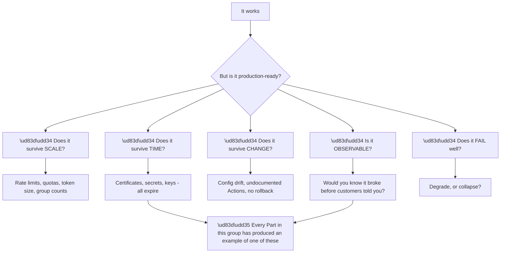
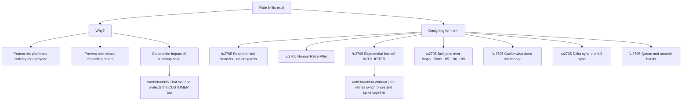
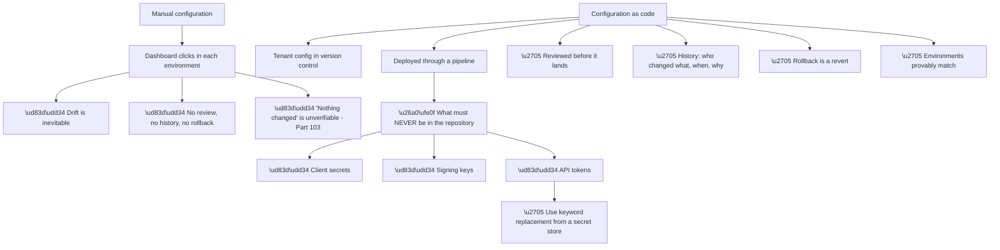
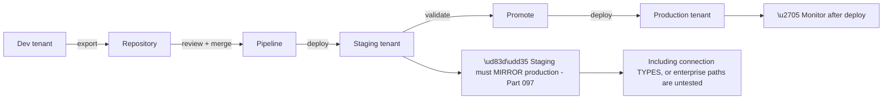
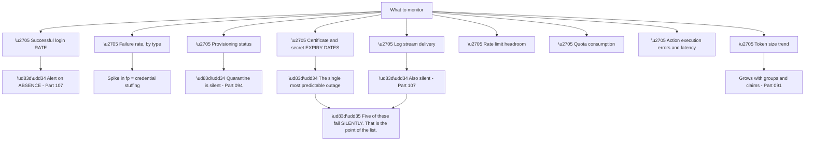
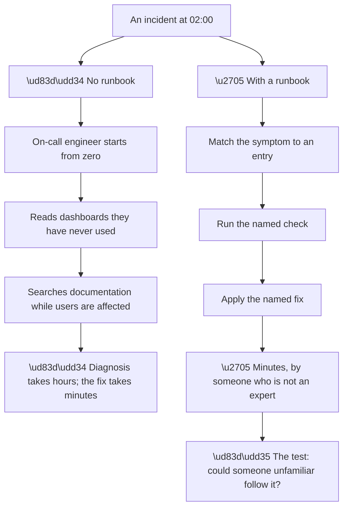
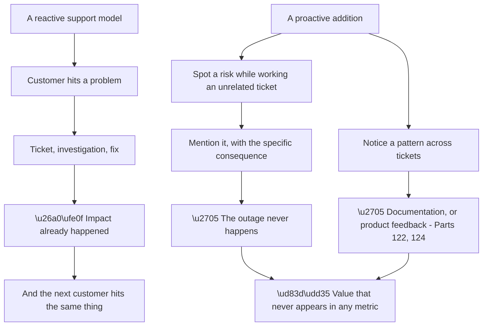
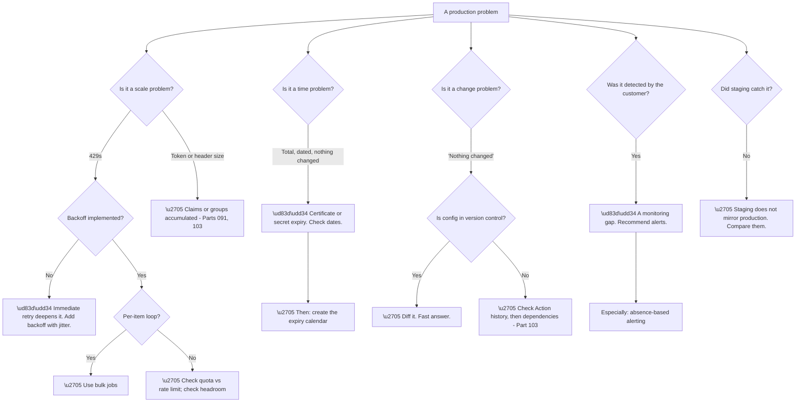

# Part 110 - Rate Limits, Quotas, Deployment Automation, and Production Readiness

> Section goal: Close Group J with what separates a working integration from a production-ready one — limits, automation, monitoring, and the checklist that catches problems before customers do.

Covers index item **110**. Maps to JD signals: *Auth0*, *APIs*, *deployment*, *observability*, *troubleshooting complex technical issues*, *customer-facing communication*, *proactivity*.

---

## 1. Start From Zero: Working Is Not Production-Ready

An integration that works in development can fail in production for reasons that have nothing to do with correctness.

**Node R is a fair summary of Group J.** Certificate rollover (Part 101), client secret expiry (Part 093), silent provisioning quarantine (Part 094), rate limits (Part 106), token size (Part 091), untracked Action changes (Part 103) — **every one is a failure of scale, time, change, observability, or graceful degradation** rather than of correctness.

**Which makes production readiness a checkable property**, not a vague aspiration, and gives this Part its purpose: **turning that list into something a customer can act on before it costs them.**

> 💡 **Tie-in to your background:** production readiness review is escalation work — you have seen what fails at scale and under time pressure. **The specific limits are new; the instinct for "what happens when this is ten times bigger and a year older" transfers completely.**

### 🔍 Plain-English deep-dive: designing for limits rather than discovering them

Rate limits are frequently treated as an obstacle. **Treating them as a design input produces better systems**, and the reasoning is worth being able to explain.

**Node W3a is the reframing worth offering a customer.** A runaway script without limits does not stop — **it runs until it exhausts something, and the customer's own bill or data integrity is what suffers.** Limits are a circuit breaker that protects them as much as the platform.

**Node D3a is a genuine engineering detail that catches people out.** Retries without jitter **synchronise**: many clients backing off by the same amount retry simultaneously, producing a spike precisely when the system is recovering. **Random jitter spreads them**, and it is a one-line change with a disproportionate effect.

| Practice | Effect |
|---|---|
| Read limit headers | Know the actual remaining budget |
| Honour `Retry-After` | Retry when it will succeed |
| **Backoff with jitter** | **Avoid synchronised retry storms** |
| Bulk jobs | Orders of magnitude fewer requests |
| Cache tokens and static data | Halves typical volume (Part 106) |
| Delta sync | Hours become seconds |
| Queue bursts | Smooths spikes into the budget |

**Two limit families behave differently and are worth separating:**

**Management API limits** are tighter, because it is administrative (Part 106). **Authentication limits** are higher, because they must serve every login — **but they are not infinite**, and a credential-stuffing attack or a misbehaving client can consume them.

**Quotas differ from rate limits** and the distinction matters for planning: a rate limit is **requests per unit time**; a quota is a **total** — active users, machine-to-machine tokens, organisations. **Exceeding a rate limit throttles; exceeding a quota may block or bill**, and customers plan for the first while being surprised by the second.

**Analogy:** a road with a speed limit and a bridge with a weight limit. Speeding gets you stopped temporarily; overloading the bridge is a different kind of problem entirely. **Where it stops:** a driver sees both signs. Quotas are frequently invisible until crossed, which is why monitoring them is a deliberate act.

---

## 2. Deployment Automation and Configuration as Code

Part 097 established environment separation; **automation is what keeps environments aligned.**

**Node M4 is the recurring cost of manual configuration.** When a customer says nothing changed, **manual configuration makes that unverifiable** — and Part 103 established that Actions in particular are frequently deployed straight from a dashboard with no record.

**Configuration as code makes "what changed?" a git question**, which converts a slow investigation into a fast one.

**Node W4 is the practical caution.** Exported tenant configuration contains placeholders where secrets belong, **and the export/import tooling supports substituting them from a secret store.** Committing a configuration file with a real secret in it is a real and easily-made mistake.

| What to version | What to inject at deploy |
|---|---|
| Application definitions | Client secrets |
| Connection settings | Connection credentials |
| Actions | API keys used by Actions |
| Rules and policies | Signing keys |
| Email templates | — |
| Organisations | — |

**The rollout pattern worth recommending:**

**Node V1 restates Part 097's most-missed requirement.** Staging without enterprise connections **never tests the enterprise login path**, which is exactly the path most likely to break and most expensive when it does.

---

## 3. Monitoring and Alerting

Every group so far has produced silent failures. **Monitoring is what converts them into notifications.**

**Node R is the argument for the whole section.** Five of the nine items — provisioning quarantine, stream delivery, certificate expiry, quota consumption, and token size growth — **produce no error until they produce an outage.** Nobody reports them, because there is nothing to report until it is too late.

**The expiry monitor in M5 is the highest value-per-effort item in this entire guide.** Certificate rollover, client secret expiry, SCIM token expiry, and TLS certificates have caused failures in Parts 088, 092, 093, 094, and 101. **A single calendar with dates and owners prevents all of them.**

**A practical monitoring starter set:**

| Alert | Threshold | Detects |
|---|---|---|
| Successful logins = 0 | Any window during expected traffic | **Total outage** |
| Login success rate drop | > 20% below baseline | Partial outage |
| Failed password spike | > 5× baseline | Credential stuffing |
| Refresh token reuse | **Any occurrence** | Possible token theft |
| Provisioning last success | > 2 hours | Quarantine |
| Log stream last delivery | > 15 minutes | Stream failure |
| Any credential expiring | < 30 days | **Scheduled outage, prevented** |
| Rate limit remaining | < 20% | Impending throttle |
| Action error rate | > 1% | Dependency or code problem |

**Row four is worth setting at "any occurrence"** rather than a rate: **refresh token reuse detection firing means a token was used twice**, which is either a client bug or theft. **Both warrant a look.**

### 🔍 Plain-English deep-dive: the runbook, and why it is worth more than the fix

A runbook converts diagnosis into lookup. **Under pressure, at 2am, that difference is most of the outage duration.**

**Node V is the quality bar**, and it is the one most runbooks fail. **A runbook written by the person who already knows the answer tends to assume the knowledge that makes it unnecessary.** The test is whether someone unfamiliar can follow it successfully — which means testing it, not just writing it.

**The four-field structure that works:**

| Field | Content |
|---|---|
| **Symptom** | What the reporter actually says, in their words |
| **Check** | The one command, query, or page that confirms it |
| **Fix** | The specific action, with any prerequisite named |
| **Prevention** | Why it happened and what stops the next one |

**The symptom field must use the reporter's language**, not the diagnosis. **"Users say login is broken" finds the entry; "expired SAML signing certificate" does not**, because at 2am nobody knows that yet — that is the thing they are trying to determine.

**And the prevention field is what keeps the runbook shrinking.** Every entry that includes a prevention step is a candidate for deletion once the prevention is implemented. **A runbook that only grows is documenting accumulated fragility**; one that shrinks is documenting improvement.

**Five entries are enough to start**, and they are the same five for almost any tenant: **certificate or secret expiry, provisioning stopped, rate limiting, total outage, and enterprise connection failure.** Those cover the great majority of what actually happens.

**One more property worth building in:** each entry should say **when to escalate and to whom.** A runbook that leads someone confidently through three steps and then abandons them is worse than none — **the exit route matters as much as the procedure.**

**Analogy:** an emergency procedure card. Its value is not that it contains knowledge experts lack — it is that it works for whoever is actually present, at the worst possible moment, without them needing to think clearly. **Where it stops:** a card cannot cover the unanticipated, which is why the escalation line is part of the procedure rather than an admission of failure.

---

## 4. The Production Readiness Checklist

Everything in Group J, as a reviewable list.

```mermaid
flowchart TD
    C["Production readiness"] --> D["\ud83d\udd35 Domain and tenant"]
    D --> D1["Custom domain configured - Part 097"]
    D --> D2["Environments separated"]
    D --> D3["Region correct for data residency"]
    C --> A["\ud83d\udd35 Applications and APIs"]
    A --> A1["Correct application types - Part 098"]
    A --> A2["Callback, logout, CORS URLs complete"]
    A --> A3["RS256; audience requested; scopes minimal"]
    C --> CN["\ud83d\udd35 Connections"]
    CN --> CN1["Own social credentials, not development keys - Part 100"]
    CN --> CN2["Metadata URLs, not manual certificates - Part 101"]
    CN --> CN3["All domains mapped"]
    CN --> CN4["Stable identifiers everywhere"]
    C --> S["\ud83d\udd35 Security"]
    S --> S1["Attack protection enabled - Part 108"]
    S --> S2["MFA strategy defined"]
    S --> S3["Session and token lifetimes deliberate"]
    C --> O["\ud83d\udd35 Operations"]
    O --> O1["Config as code with a pipeline"]
    O --> O2["Monitoring and alerting in place"]
    O --> O3["Expiry calendar with owners"]
    O --> O4["Runbook for common failures"]
```

**The full checklist, as something you could actually send:**

| # | Item | Part |
|---|---|---|
| 1 | Custom domain configured and DNS documented as load-bearing | 097 |
| 2 | Separate tenants per environment; staging mirrors production | 097 |
| 3 | Region correct for data residency (**cannot be changed**) | 097 |
| 4 | Application types correct; grants minimal | 098 |
| 5 | Callback, logout, and CORS URLs complete for every environment | 098 |
| 6 | APIs use RS256; clients request `audience`; scopes minimal | 098 |
| 7 | Custom database avoided where import mode suffices | 099 |
| 8 | Own social provider credentials, not development keys | 100 |
| 9 | Email treated as optional; Apple name captured on first login | 100 |
| 10 | Enterprise connections use metadata URLs | 101 |
| 11 | NameID / identifiers immutable everywhere | 101 |
| 12 | All customer domains mapped for routing | 101 |
| 13 | Universal Login used; customisation minimal | 102 |
| 14 | Actions version-controlled; external calls bounded and handled | 103 |
| 15 | Entitlements in `app_metadata`, never `user_metadata` | 103/105 |
| 16 | APIs scope every query by organisation | 104 |
| 17 | Account linking requires proof of control | 105 |
| 18 | Management credentials server-side, minimally scoped | 106 |
| 19 | Bulk jobs instead of per-item loops | 105/106/109 |
| 20 | Log stream configured, with delivery monitored | 107 |
| 21 | Attack protection enabled and tuned on evidence | 108 |
| 22 | MFA strategy defined; recovery path designed | 108 |
| 23 | Configuration as code with review and rollback | 110 |
| 24 | Monitoring including **absence-based** alerts | 110 |
| 25 | **Expiry calendar with named owners** | 110 |
| 26 | Runbook for the top five failure modes | 110 |

**Item 25 prevents more outages than any other single item**, and item 24 detects the ones that remain.

### 🔍 Plain-English deep-dive: proactive support, and why a readiness review is worth doing unasked

Most of this guide has been reactive. **The highest-value thing a support engineer does is often prevent the ticket**, and a readiness review is the concrete form of that.

**Node V is honest about the difficulty:** prevented outages are invisible. **No ticket records the incident that did not happen**, which is why proactive work needs deliberate effort rather than being driven by the queue.

**The opportunities are concrete and cheap:**

| While working on... | Also check |
|---|---|
| Any social connection ticket | **Development keys** |
| Any enterprise connection | **Metadata URL vs manual; expiry owner** |
| Any Action question | **Error handling on external calls** |
| Any user-data question | **Which metadata store** |
| Any B2B question | **Organisation-scoped queries** |
| Any performance question | **Per-item loops** |
| Any "nothing changed" | **Expiry dates** |

**Every row takes seconds** while you are already in the tenant, and each has caused a real outage somewhere in this guide.

**The way to raise it matters**, because unsolicited advice can read as criticism. **Attach it to the ticket you are already solving**, keep it short, and state the consequence concretely:

> *"Separately — I noticed your Google connection is using development keys. That works, but it shares rate limits with other tenants and shows a vendor name on the consent screen, so it is worth registering your own before you scale up. Happy to point you at the steps if useful."*

**Three properties make that land:** it is factual, it names the specific consequence, and it offers help without insisting. **It also demonstrates that you looked at their configuration rather than only at their error**, which builds confidence for every subsequent interaction.

**And the largest-scale version of this** is noticing that several customers hit the same thing. **That is a documentation gap or a product gap** (Parts 122, 124), and reporting it is the difference between fixing one ticket and removing a category.

**Analogy:** a surveyor who is there to inspect the roof and mentions that the boiler is out of certification. Nobody asked, it takes thirty seconds, and it prevents a much worse call in February. **Where it stops:** a surveyor can only report. Whether the customer acts on it is theirs.

---

## 5. Failure Modes

| # | Failure mode | Symptom | Root cause | First check |
|---|---|---|---|---|
| 1 | No backoff | Sustained throttling | Immediate retry | Is `Retry-After` honoured? |
| 2 | No jitter | Synchronised retry spikes | Uniform backoff | Is jitter applied? |
| 3 | Per-item loops | Slow, throttled | Wrong pattern | Bulk job available? |
| 4 | Quota exceeded | Blocked or billed unexpectedly | Quota ≠ rate limit | Is quota monitored? |
| 5 | Manual configuration | Drift; unverifiable change history | No automation | Is config in version control? |
| 6 | Secret committed | Credential exposure | Config exported with secrets | Are placeholders used? |
| 7 | Staging differs | Untested paths fail on release | Configuration drift | Do connection types match? |
| 8 | No absence alerting | Outage found by customers | Error-based alerts only | Is there a zero-success alert? |
| 9 | No expiry calendar | Predictable dated outage | Nobody owns the date | Who owns each expiry? |
| 10 | Provisioning unmonitored | Silent multi-week gap | Quarantine (Part 094) | Last successful sync? |
| 11 | Stream unmonitored | Evidence missing when needed | Silent delivery failure | Last delivery? |
| 12 | Token size growth | Header limits reached over time | Claims accumulate | Is size trended? |
| 13 | No runbook | Slow response under pressure | Nothing written down | Is there one? |
| 14 | Load testing against production | Self-inflicted throttle | Wrong environment | **Test against staging** |

---

## 6. Troubleshooting Decision Tree: Production Problems

### Worked example

A customer's production login broke for three hours overnight. It has been resolved by re-uploading a certificate. **They ask what they should do differently.**

**That question is the ticket** — the incident is over, and the value is entirely in the answer.

**The immediate cause** was an enterprise connection's manually-uploaded signing certificate expiring after the upstream IdP rolled over.

**But three separate failures produced a three-hour outage**, and separating them is what makes the answer useful:

**Failure one — prevention.** The connection used a manual certificate rather than a metadata URL. **A metadata URL would have made the rollover invisible** (Part 101).

**Failure two — detection.** Nobody was alerted. **The outage was discovered when users complained in the morning**, hours after it began. **Absence-based alerting would have caught it within minutes**, and at 2am someone could have acted.

**Failure three — response.** There was no runbook, so **the on-call engineer spent most of the three hours identifying the problem** rather than fixing it. **The fix itself took ten minutes.**

**The recommendation is therefore three items, not one:**

| Layer | Recommendation | Effect |
|---|---|---|
| Prevention | Metadata URL, and an expiry calendar for anything manual | The outage does not happen |
| Detection | Alert on zero successful logins | Three hours becomes minutes |
| Response | Runbook for the top five failures | Diagnosis becomes lookup |

**And a fourth, the most valuable:** this incident **exposed a class of risk, not a single fault.** The same three failures apply to their client secrets, their SCIM token, and their TLS certificates. **A readiness review across all of them turns one incident into a systemic improvement.**

**What made this a good response:** answering the question they asked rather than the one that was resolved. **"What should we do differently?" is an invitation to be proactive**, and treating it as a real question — with layered, specific answers — is worth far more than closing the ticket.

---

## 7. Lab: Run a Production Readiness Review

**Purpose.** Turn Group J into a working artefact: a review you could run against a real tenant, and a runbook you could hand over.

**Prerequisites.**
- The free tenant from Part 097, configured through Parts 098–109
- **Never** run this against an employer or customer tenant

**Steps.**

1. **Take the 26-item checklist** from §4 and assess your own lab tenant against every item. **Record pass, fail, or not applicable.**
2. **For every fail, write the specific consequence** — not "should use metadata URL" but "will fail totally on their next rollover, roughly annually."
3. **Build an expiry inventory:** every certificate, secret, and token in your tenant, with its expiry date. **Note how many you had to hunt for.**
4. **Export your tenant configuration** using the deployment tooling. **Confirm secrets appear as placeholders, not values.**
5. **Commit it to a local repository.** Make a configuration change in the dashboard, re-export, and **diff it.** Record how clearly the change appears.
6. **Write the alerting set** from §3 as specific rules, with thresholds.
7. **Deliberately break something** — disable a connection — and confirm which alert would have fired.
8. **Write a runbook** for five failure modes: certificate expiry, secret expiry, provisioning quarantine, rate limiting, and a total outage. **Each entry: symptom, check, fix, prevention.**
9. **Test the runbook** by having someone unfamiliar follow one entry, or by following it yourself after a break.
10. **Write the proactive observation** you would send a customer about your own tenant's worst finding, in the §4 style.
11. **Review the whole of Group J** and note which Parts you would revisit before interview.

**Expected evidence.**
- A completed 26-item assessment with consequences written out
- An expiry inventory with dates and owners
- An exported configuration with placeholder secrets, in version control
- A meaningful diff from a dashboard change
- Your alerting rules with thresholds
- A five-entry runbook, tested
- Your proactive observation, written as you would send it

**Validation rubric.**

| Criterion | Pass |
|---|---|
| Limits | You can explain rate limits versus quotas and design for both |
| Jitter | You can explain synchronised retries |
| Automation | You can explain drift, review, rollback, and secret handling |
| Monitoring | You can name the silent failures and the absence alert |
| Expiry | You can produce an inventory and say why it matters most |
| Runbook | Yours is usable by someone else under pressure |
| Proactivity | You can raise a finding without it reading as criticism |
| Safety | Your own tenant, no employer or customer systems |

**Cleanup and privacy.** Delete the tenant if finished, and **delete the exported configuration** — even with placeholders it documents a tenant's structure. **Never export an employer or customer tenant's configuration to a personal repository**, and never run a readiness review against a tenant you do not own.

---

## 8. JD Mapping

| JD signal | How this Part addresses it |
|---|---|
| Auth0 product knowledge | Limits, quotas, deployment tooling, readiness |
| APIs | Rate limit handling and bulk patterns |
| Deployment | Configuration as code and environment promotion |
| Observability | Monitoring, alerting, absence detection |
| Troubleshooting complex technical issues | Fourteen failure modes and a layered decision tree |
| Proactivity | Readiness review and unsolicited findings |
| Customer-facing communication | Layered recommendations after an incident |

---

## 9. Candidate Honesty Note

- **Production experience:** production readiness thinking from escalation work — what fails at scale, under time, and under change.
- **Production experience:** post-incident recommendations separated into prevention, detection, and response.
- **Lab experience:** running the readiness checklist against my own tenant, building an expiry inventory, and writing a tested runbook, as above.
- **Learned architecture:** the specific limits, quotas, and deployment tooling of this platform.
- **No direct experience:** running production readiness reviews for paying customers on this platform.
- **How to say it:** *"The instinct is the transferable part — asking what happens when this is ten times bigger and a year older. The specific limits and tooling I've learned and applied to my own tenant, including building the expiry inventory, which I think is the single highest-value item because so many of the outages in this product are certificates and secrets running out on a predictable date."*

---

## 10. Official Source Anchors

| Source | Why | Accessed |
|---|---|---|
| Auth0 Docs — Rate limits | Limits, headers, and policies | Accessed **26 August 2026** |
| Auth0 Docs — Deploy CLI tool | Configuration as code and keyword replacement | Accessed **26 August 2026** |
| Auth0 Docs — Deployment best practices | Environment promotion | Accessed **26 August 2026** |
| Auth0 Docs — Monitoring and log streams | Observability surface | Accessed **26 August 2026** |
| Auth0 Docs — Pre-launch and production checklist | The vendor's own readiness guidance | Accessed **26 August 2026** |
| AWS Architecture Blog — Exponential backoff and jitter | Why jitter matters | Accessed **26 August 2026** |

> **Revalidate:** rate limits, quotas, and deployment tooling change. **Re-check the current documentation and the vendor's own production checklist before interview**, and compare it against the one built here.

---

## ⭐ Likely Interview Questions for This Section

### Q1. "What makes an integration production-ready rather than just working?"

> *Model answer:* Five properties. Does it survive scale — rate limits, quotas, token size, group counts? Does it survive time — certificates, secrets, and keys all expire? Does it survive change — is configuration drifting, are Actions tracked, is there a rollback? Is it observable — would they know it broke before customers told them? And does it fail well — degrade or collapse? What strikes me looking back over this product is that essentially every failure mode I have studied is one of those five rather than a correctness bug. Certificate rollover, secret expiry, silent provisioning quarantine, rate limiting, token size growth, untracked Action changes — all scale, time, change, observability, or graceful degradation.

### Q2. "How should a customer handle rate limits?"

> *Model answer:* By designing for them rather than discovering them. Read the limit headers rather than guessing, honour `Retry-After`, and back off exponentially with jitter — the jitter matters because without it many clients retry at the same moment and produce a spike exactly when the system is recovering. Structurally, use bulk import and export jobs rather than per-item loops, cache tokens and static data, and use delta synchronisation rather than full passes for recurring work. I would also separate rate limits from quotas when explaining, because customers plan for the first and get surprised by the second — a rate limit is requests per unit time and throttles you, a quota is a total like active users or organisations and may block or bill you.

### Q3. "Why does configuration as code matter here?"

> *Model answer:* Because manual configuration makes "nothing changed" unverifiable, and that phrase appears in a large share of tickets. With configuration in version control, "what changed?" is a diff — fast and definitive. It also gives review before a change lands, history of who changed what and why, and rollback as a revert rather than an attempt to remember the previous state. And it is what keeps environments genuinely aligned, because manually maintaining three tenants guarantees drift. The one caution is secrets: exported configuration uses placeholders and the tooling substitutes real values from a secret store at deploy time, so committing a file with a live client secret is an easy and serious mistake to make.

### Q4. "What would you tell a customer to monitor?"

> *Model answer:* I would start with the ones that fail silently, because those are the ones nobody reports. Alert on the absence of successful logins, which catches a total outage where no errors are generated because nothing is arriving. Alert on provisioning last-success, because quarantine is silent and can run for weeks. Alert on log stream delivery, which also fails silently and is discovered when evidence is needed and missing. Alert on anything expiring within thirty days. And monitor quota consumption and token size trend, both of which grow gradually until they cross a threshold. Then the noisier ones: failed password spikes for credential stuffing, and any refresh token reuse detection, which I would set at any occurrence rather than a rate because it means a token was used twice.

### Q5. "Which single item prevents the most outages?"

> *Model answer:* An expiry calendar with named owners. Across everything I have studied here, certificate and secret expiry has caused failures in LDAPS, in AD FS federation, in SAML enterprise connections, in OIDC client secrets, in SCIM provisioning tokens, and in custom domain TLS. Every one of them is total, sudden, correlated with a date, and preceded by no configuration change — and every one is entirely predictable months in advance. A single list of every certificate, secret, and token with its expiry date and an owner prevents all of them. It costs an hour to build and it is the item customers most often do not have, usually because each credential was created by a different person at a different time.

### Q6. "A customer had a three-hour outage from an expired certificate. What do you recommend?"

> *Model answer:* Three things, because three separate failures produced those three hours. Prevention: the connection used a manually uploaded certificate instead of a metadata URL, so the rollover broke it — with metadata it would have been invisible. Detection: nobody was alerted, and it was found when users complained in the morning, so an absence-based alert on successful logins would have turned three hours into minutes. Response: there was no runbook, so most of the three hours was spent identifying the problem rather than fixing it, and the fix took ten minutes. And then the fourth and most valuable point: this exposed a class of risk rather than one fault, because the same three gaps apply to their client secrets, their SCIM token, and their TLS certificates — so a readiness review across all of them turns one incident into a systemic improvement.

### Q7. "How do you raise something a customer didn't ask about?"

> *Model answer:* Attach it to the ticket I am already solving, keep it short, and name the specific consequence rather than the general principle. Something like: "separately, I noticed your Google connection is using development keys — that works, but it shares rate limits with other tenants and shows a vendor name on the consent screen, so it is worth registering your own before you scale up; happy to point you at the steps." Three things make that land: it is factual rather than judgemental, it names the concrete consequence, and it offers help without insisting. It also shows I looked at their configuration rather than only at their error, which builds confidence for every interaction afterwards. The honest difficulty is that prevented outages are invisible — no ticket records the incident that did not happen — so this needs deliberate effort rather than being driven by the queue.

### Q8. "What's on your production readiness checklist?"

> *Model answer:* I would group it. Domain and tenant: custom domain configured, environments separated with staging genuinely mirroring production including connection types, and the region correct for data residency since that cannot be changed. Applications: correct types, complete callback and CORS URLs for every environment, RS256, audience requested, minimal scopes. Connections: own social credentials rather than development keys, metadata URLs rather than manual certificates, all customer domains mapped, and immutable identifiers everywhere. Security: attack protection on, an MFA strategy with a designed recovery path, deliberate session and token lifetimes. And operations: configuration as code with review and rollback, monitoring including absence-based alerts, an expiry calendar with owners, and a runbook for the top five failures. If I had to pick two, it would be the expiry calendar and the absence alert — one prevents the most outages, the other detects the ones that remain.

---

## 🧠 30-Second Memory Hooks

- **Production readiness = survives scale, time, change; is observable; fails gracefully.**
- **Rate limit = requests per time. Quota = a total.** Different failures.
- **Backoff WITH JITTER** — without it, retries synchronise.
- **Bulk jobs, not per-item loops.** Fourth appearance.
- **Config as code makes "nothing changed" a diff.**
- **Never commit secrets — use placeholders and a secret store.**
- **Staging must mirror production, including connection types.**
- **Five things fail silently: provisioning · streams · expiry · quotas · token growth.**
- **Alert on the ABSENCE of successful logins.**
- **The expiry calendar prevents more outages than anything else.**
- **Runbook turns diagnosis into lookup.**
- **After an incident: prevention · detection · response — three answers, not one.**
- **Proactive findings: attach to the current ticket, name the consequence, offer help.**
- **Prevented outages are invisible.** Do it deliberately.

---

## ✅ Completion Checklist

- [ ] I can name the five properties of production readiness
- [ ] I can explain rate limits versus quotas
- [ ] I can explain why jitter matters in backoff
- [ ] I can explain configuration as code and secret handling
- [ ] I can name the five silent failure modes
- [ ] I can justify absence-based alerting
- [ ] I can explain why the expiry calendar is the highest-value item
- [ ] I can separate prevention, detection, and response after an incident
- [ ] I can raise a proactive finding without it reading as criticism
- [ ] I have run the readiness review against my own tenant
- [ ] I have written and tested a five-entry runbook
- [ ] I can state honestly what transfers from my experience and what was new

*Next suggested section:* **[Part 111 - The Identity Troubleshooting Method](Part-111-the-identity-troubleshooting-method.md)** — Group K begins: the consolidated method that turns everything in Groups B through J into a repeatable diagnostic process.
