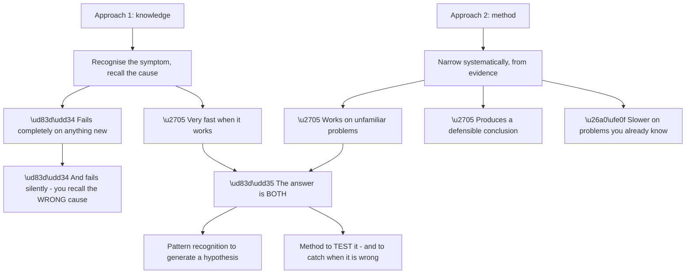
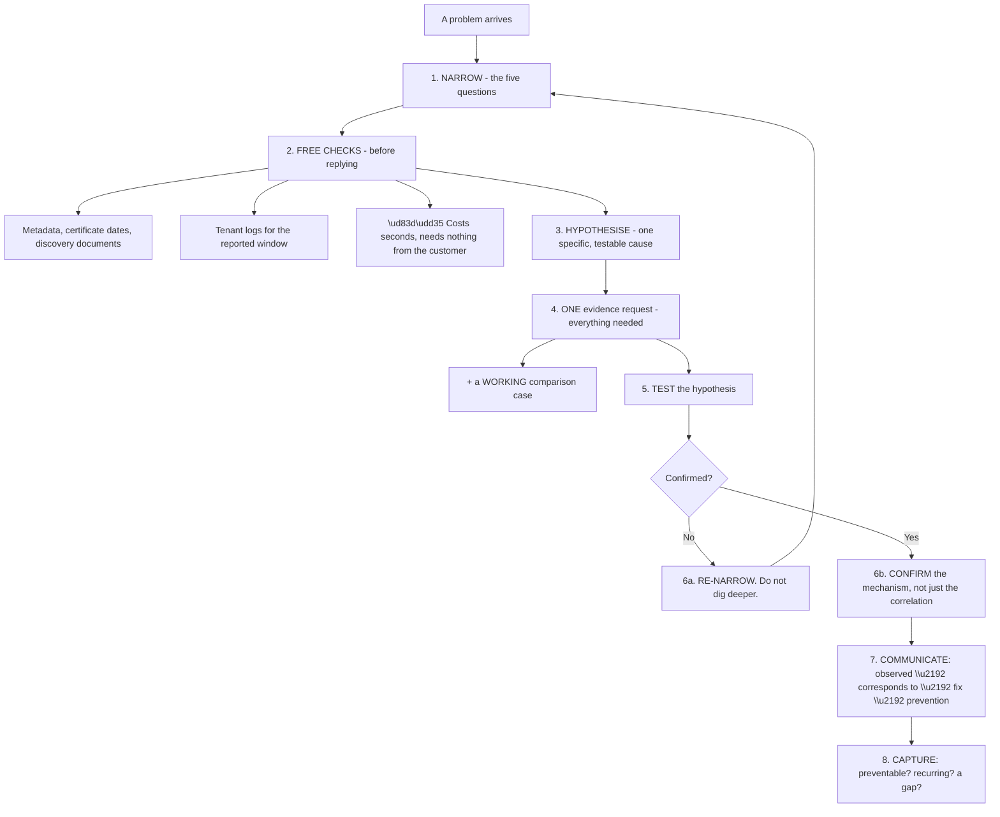
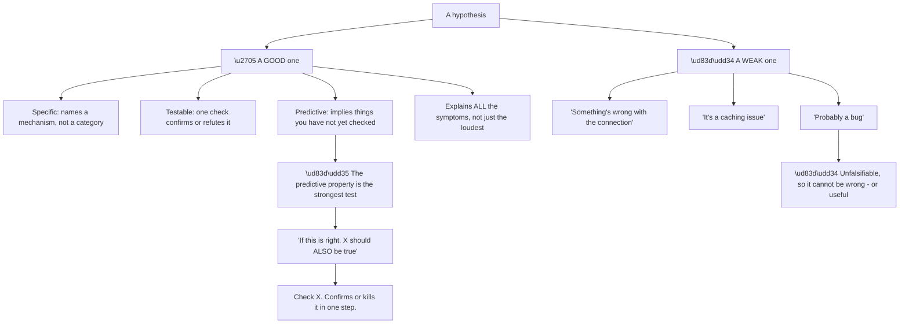
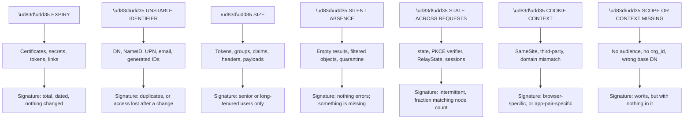
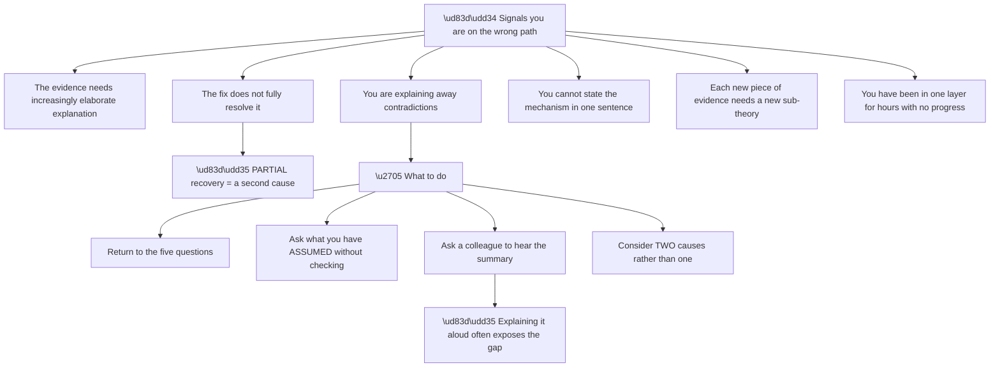
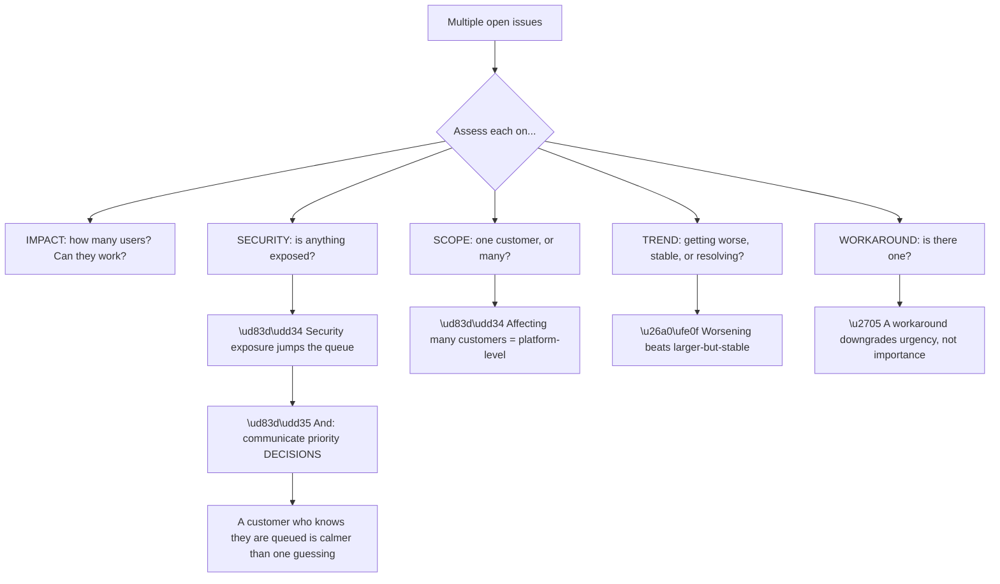
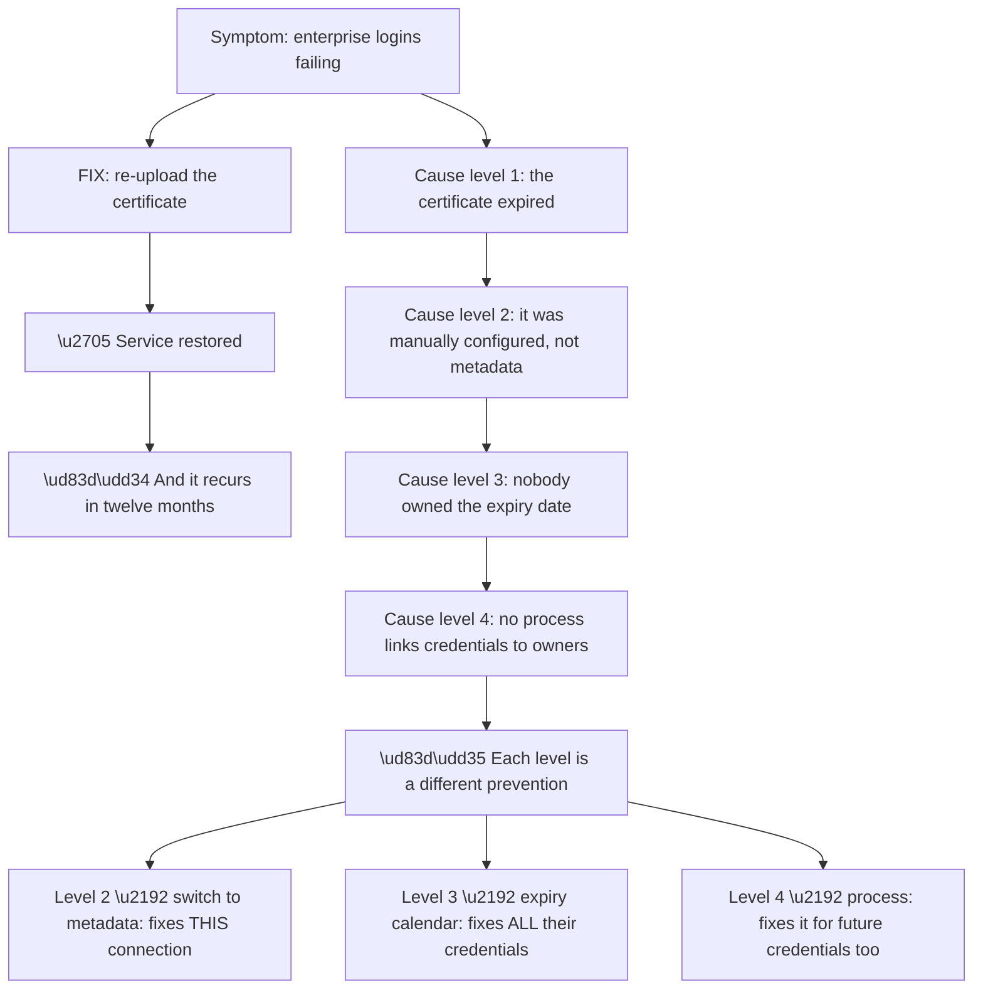
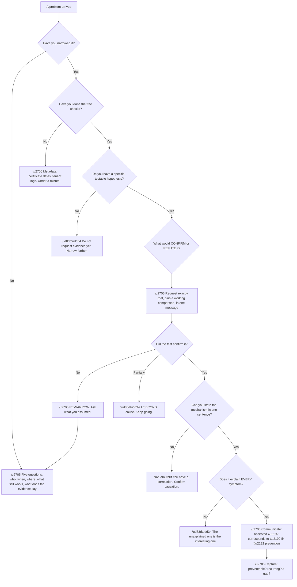

# Part 111 - The Identity Troubleshooting Method

> Section goal: Consolidate everything from Groups B through J into one repeatable diagnostic method — a small set of questions and moves that works on any identity problem, including ones you have never seen.

Covers index item **111**. Maps to JD signals: *troubleshooting complex technical issues*, *root cause analysis*, *authentication and authorization*, *customer-facing communication*, *prioritisation*.

---

## 1. Start From Zero: Why a Method Beats Knowledge

You cannot memorise every failure mode. **This guide has documented over two hundred**, and a real queue will produce ones that are not in it.

**What transfers is the method** — a way of narrowing that works regardless of whether you have seen the specific failure before.

**Node K4 is the danger of pure pattern matching**, and it is worth being wary of specifically. **A confident wrong diagnosis costs more than no diagnosis** — it sends the customer down a wrong path, consumes their time, and damages trust when it fails.

**The discipline that prevents it:** treat recognition as a **hypothesis**, and confirm it before acting. **One confirming check is usually cheap**, and it converts a guess into a finding.

> 💡 **Tie-in to your background:** as a Support Escalation Engineer handling critical situations, this is your existing craft. **The method below is largely a formalisation of what you already do** — and being able to articulate it explicitly is itself an interview asset.

### 🔍 Plain-English deep-dive: the five questions, and what each eliminates

Five questions, asked before investigating, narrow almost any identity problem to a layer.

```mermaid
flowchart TD
    Q1["1. WHO is affected?"] --> Q1a["Everyone \\u2192 infrastructure, credential, certificate"]
    Q1 --> Q1b["One user \\u2192 that account, device, or clock"]
    Q1 --> Q1c["A group \\u2192 structure, scope, policy, connection"]
    Q1 --> Q1d["Only new users \\u2192 provisioning, or a policy change"]
    Q1 --> Q1e["Only senior staff \\u2192 SIZE - tokens, groups, claims"]
    Q1 --> Q1f["One browser \\u2192 cookies"]
    Q1 --> Q1g["One network \\u2192 DNS, IP policy, egress"]
    Q2["2. WHEN did it start?"] --> Q2a["A date, nothing changed \\u2192 EXPIRY"]
    Q2 --> Q2b["After a change \\u2192 that change"]
    Q2 --> Q2c["Never worked \\u2192 configuration, not regression"]
    Q2 --> Q2d["Intermittent \\u2192 load, replication, risk, or a loop"]
    Q3["3. WHERE does it fail?"] --> Q3a["Before the IdP \\u2192 routing, domain, client"]
    Q3 --> Q3b["At the IdP \\u2192 credentials, policy, certificates"]
    Q3 --> Q3c["After login \\u2192 claims, mapping, session"]
    Q3 --> Q3d["At the API \\u2192 the token was ISSUED. Decode it."]
    Q4["4. What STILL works?"] --> Q4a["Locates the boundary"]
    Q5["5. What does the EVIDENCE say?"] --> Q5a["Not what anyone believes is configured"]
```

**Question three is the one this guide has added most to.** *Where* a flow fails eliminates everything upstream of that point, and the four positions have almost no causes in common.

**Node Q3d in particular** is worth internalising: **a failure at the API proves authorization succeeded.** Client, redirect URI, grant, connection, credentials, policy — all confirmed working. **One observation, six families eliminated.**

| Question | What it eliminates |
|---|---|
| Who | Everything that cannot produce that population |
| When | Regressions if it never worked; changes if nothing changed |
| **Where** | **Everything upstream of the failure point** |
| What still works | Everything shared with the working path |
| What the evidence says | Everything the customer believes but cannot show |

**Question five deserves its own emphasis** because it is the most frequently violated. **Customers describe their configuration from memory, and memory is frequently wrong** — the domain they think an application uses, the claim they think is being sent, the scope they think was requested. **Evidence beats belief every time**, and the evidence is usually cheap to get.

**Question four is the underused one.** *"What still works?"* locates the boundary of the fault, and customers can answer it instantly. **In Part 092's example, internal sign-ins working proved AD FS and Entra were healthy** and placed the fault at one consumer.

**Analogy:** a diagnostic conversation before any test is ordered — who is affected, when it started, where it hurts, what still functions normally, and what the measurements actually show rather than what the patient assumes. **Where it stops:** a patient reports sensation directly. A customer reports only what their tooling made visible, which is why question five has to be asked deliberately.

---

## 2. The Method, Step by Step

**Step two is the one most often skipped and the cheapest.** Fetching a discovery document, checking certificate validity dates, and reading the tenant log for the reported window **require nothing from the customer and take under a minute** — and they frequently find the cause outright or eliminate the most likely hypothesis before you have replied.

**Step six-a is a discipline rather than an instruction.** When a hypothesis fails a good confirming test, **the instinct is to keep digging where you started**, because you have already invested there. **That instinct is usually wrong.** Return to the narrowing questions and check whether an answer was weighted incorrectly.

**Step six-b distinguishes a good diagnosis from a lucky one.** Finding a correlation is not the same as understanding the mechanism. **"The certificate expired at 09:12 and failures began at 09:14"** is a mechanism. **"They deployed on Tuesday and it broke on Tuesday"** is a correlation that may or may not be causal — and confirming which is worth one more step.

**Step eight is what separates support engineers from ticket closers**, and Parts 122 and 124 develop it: **was this preventable, will it recur for others, and does it indicate a documentation or product gap?**

---

## 3. Hypothesis Discipline

The quality of a diagnosis depends on the quality of the hypothesis being tested.

**Node R is the most efficient technique in this Part.** A good hypothesis makes **predictions beyond the observed symptom**, and testing a prediction is faster and more decisive than gathering more of the same evidence.

**Worked illustration:** *"the connection uses a manually-configured certificate that expired."* That predicts: the failure began at a specific time, **other connections are unaffected**, the IdP's published metadata now shows a different certificate, and **the customer's own internal logins still work.** Four predictions, each cheap to check, and **any one of them failing kills the hypothesis immediately.**

**Node G4 is the discipline that catches partial diagnoses.** A hypothesis explaining the main symptom but not a secondary detail is **incomplete, and the unexplained detail is usually the interesting part.**

| Symptom set | Weak hypothesis | Strong hypothesis |
|---|---|---|
| "Fails for some users, started Tuesday" | "Something changed Tuesday" | "Tuesday's group restructure removed nested assignment for those users" |
| "Slow and intermittent" | "Performance issue" | "Unindexed query exceeding the sandbox limit under peak load" |
| "Works then stops after an hour" | "Session problem" | "Silent renewal blocked by third-party cookie policy on Safari" |

**Each strong hypothesis names a mechanism**, and each is refutable by one check — which is precisely what makes them useful.

---

## 4. The Common Patterns

Across Groups B through J, a small number of patterns account for most failures. **Recognising the pattern is often faster than recalling the technology.**

**Seven patterns cover the great majority of this guide**, and each has a single detecting question:

| Pattern | The question |
|---|---|
| Expiry | *"What are the certificate and secret dates?"* |
| Unstable identifier | *"What does it match users on?"* |
| Size | *"Is it only senior or long-tenured users?"* |
| Silent absence | *"When did you last see this work?"* |
| State across requests | *"Does it fail for a consistent fraction?"* |
| Cookie context | *"Which browsers, and which application pairs?"* |
| Missing scope/context | *"What is actually in the token?"* |

**Thinking in patterns transfers to systems you have never seen.** A support engineer who has never touched a particular identity provider can still ask *"what does it match users on?"* — **and find an unstable-identifier bug in it.**

### 🔍 Plain-English deep-dive: knowing when you are wrong

The hardest skill is recognising a failing investigation early. **Sunk cost makes people continue down a path long after the evidence stopped supporting it.**

**Node S2 is the clearest warning sign.** Good hypotheses accommodate evidence naturally. **Needing to explain why a piece of evidence does not count** is a strong signal that the hypothesis is wrong rather than the evidence.

**Node S3a is worth stating separately** because it is so often mishandled: **a fix that improves things without fully resolving them means there is more than one cause.** Part 089's example had two — a DNS problem and a missing SPN — and stopping after the first would have left a real problem in place.

**Node A2 is the most productive question** when stuck. **Assumptions made early and never checked** are where wrong investigations start: *"they're using the custom domain"*, *"the connection is enabled"*, *"the claim is being sent."* **Each of those has been the actual cause somewhere in this guide.**

| Assumption worth checking | Where it was the cause |
|---|---|
| "They're on the custom domain" | Part 102 — SSO between application pairs |
| "The connection is enabled for that app" | Part 097 — works in one app, not another |
| "The claim is being sent" | Part 093 — empty profile |
| "Nothing changed" | Part 103 — Action version history |
| "It's random" | Part 099 — a time window, not randomness |
| "The user exists" | Part 098 — a different connection |

**Node A3a is genuinely effective and cheap.** Explaining an investigation aloud forces it into a linear narrative, **and the gap usually becomes obvious in the telling** — often before the colleague has said anything.

**And node A4 is the possibility most often overlooked.** The method assumes one cause because that is usually true; **when the evidence resists a single explanation, the answer may be two independent causes** interacting.

**Analogy:** a search that keeps almost fitting. Each new detail needs a slightly more elaborate story to accommodate it. At some point the honest move is to go back to the start rather than add another epicycle. **Where it stops:** a person can decide to start over. An investigation with time pressure and an anxious customer needs an explicit rule to permit it.

---

## 5. Prioritisation Under Load

A real queue means several problems at once, and **the method includes deciding what to work on.**

**Node P1 is non-negotiable.** A Management API secret in front-end code (Part 106) or cross-tenant data exposure (Part 104) **takes precedence over an outage**, because the exposure continues to accumulate risk while an outage is merely painful.

**Node P3 is a real judgement call worth being able to justify:** a problem affecting fifty users and worsening will overtake one affecting five hundred and stable. **Trajectory matters as much as magnitude.**

**Node R1 is the communication point.** A customer waiting without information assumes they have been forgotten. **A brief acknowledgement with an honest expectation** — *"I'm working a production outage for another customer and will be with you within the hour"* — **costs nothing and prevents escalation.**

### 🔍 Plain-English deep-dive: the difference between a fix and a root cause

Most tickets end when the symptom stops. **A root cause is a different thing**, and confusing them is why the same problem returns.

**Node R is the useful framing.** There is no single "the" root cause — **there is a chain, and each level supports a different scope of prevention.** Choosing which level to stop at is a judgement about proportion.

| Stop at | Prevents | Cost to the customer |
|---|---|---|
| The fix | Nothing | Minutes |
| Level 2 | This connection recurring | Minutes |
| Level 3 | Every credential expiry | An hour |
| Level 4 | Future credentials too | A process change |

**Level three is usually the right place to stop** for a support interaction: **broad enough to be genuinely valuable, cheap enough that the customer will actually do it.** Recommending a process change for a single certificate expiry is disproportionate and tends to be ignored.

**But naming the higher levels is still worth doing**, briefly, because it tells the customer the recommendation is considered rather than reflexive — and because a customer who has had three of these may recognise that level four is now warranted.

**The technique that finds the chain** is simply asking *why* repeatedly, stopping when the answer becomes something outside the customer's control or disproportionate to act on. **"Why did it expire?" → "because it was manual" → "why was it manual?" → "because metadata was not published" → "why did nobody track the date?"** Four questions, four levels.

**And the discipline it enforces** is worth the effort: **a fix with no stated cause is a ticket that will return**, and stating the cause makes the prevention obvious rather than something you have to invent separately.

**Analogy:** a leak fixed by replacing a washer. Correct, and the next washer fails in a year. Asking why it failed — pressure too high, water too hard, nobody servicing anything — gives you four different repairs at four different scopes. **Where it stops:** you cannot fix the water hardness, so the useful level is the one you can act on.

---

## 6. Failure Modes of the Method

| # | Failure mode | Symptom | Fix |
|---|---|---|---|
| 1 | Investigating before narrowing | Hours in the wrong layer | Ask the five questions first |
| 2 | Pattern-matching without confirming | Confident wrong diagnosis | Treat recognition as a hypothesis |
| 3 | Skipping the free checks | Waiting for what you could fetch | Metadata and logs before replying |
| 4 | Multiple evidence round-trips | Days of latency | One complete request |
| 5 | No working comparison | Analysis instead of comparison | Always ask for both |
| 6 | Weak hypothesis | Cannot be tested | Name a mechanism |
| 7 | Ignoring an unexplained detail | Partial diagnosis | Explain **all** symptoms |
| 8 | Continuing after disconfirmation | Sunk-cost digging | Re-narrow |
| 9 | Correlation taken as mechanism | Wrong root cause | Confirm the mechanism |
| 10 | Stopping at partial recovery | Second cause left in place | Partial fix = another cause |
| 11 | Unchecked assumptions | Wrong path from the start | Ask what you assumed |
| 12 | No prioritisation | Wrong thing worked first | Impact, scope, trend, workaround, security |
| 13 | Silent queueing | Escalation | Communicate priority decisions |
| 14 | No capture | The team relearns it | Was it preventable? |

---

## 7. Troubleshooting Decision Tree: The Method Itself

### Worked example

A ticket: *"Login is broken for our EU customers. Started yesterday. Urgent."*

**Narrowing, in the first reply.** Who: EU users. When: yesterday. Where: they see an error at the login page. What still works: US and APAC users are fine.

**The population is geographic**, which is unusual and immediately informative — **very few identity mechanisms partition by geography.** Candidates: a regional network path, a location-based policy, a regional provider issue, or something correlated with geography rather than caused by it.

**Free checks while waiting.** The tenant's metadata is valid, certificates are in date. **Expiry eliminated.** The tenant log shows failures from EU addresses and successes elsewhere — **confirming the population and proving requests are arriving.**

**Hypothesis.** Something introduced yesterday applies to EU traffic specifically. **Prediction: it should be visible in the tenant log's failure detail**, and it should correlate with a change made yesterday.

**Evidence request** asks for one failing EU user and one working US user, both with timestamps, and what changed yesterday.

**The answer.** Yesterday they deployed an Action that calls a geolocation-based compliance API. **It works for most traffic and times out for EU addresses**, because the provider routes EU requests to a different endpoint that they had not allow-listed.

**And the Action has no error handling** (Part 103), so a timeout throws and blocks the login.

**Two causes, one visible.** The provider's regional routing, and the Action's fail-closed-by-accident behaviour. **Fixing only the allow-list leaves the second in place**, and the next dependency problem produces the same outage.

**The recommendation is therefore layered:** allow-list the endpoint to restore service now; add error handling so a dependency failure degrades rather than blocks; and decide deliberately whether that call should fail open or closed.

**What made it fast:** treating **geography as a strong clue** rather than incidental. **A population that partitions by region points at a small set of mechanisms**, and running through them took one question.

---

## 8. Lab: Build and Test Your Method

**Purpose.** Turn this into a usable artefact and prove it works on problems you have not memorised.

**Prerequisites.**
- Groups B–J completed
- No systems required

**Steps.**

1. **Write the five questions from memory**, with at least four answers each and where each points. Check against §1.
2. **Write the seven patterns** and their detecting questions, from memory. Check against §4.
3. **Build a one-page method card:** five questions, seven patterns, free checks, evidence request template, and the four-element communication structure.
4. **Write fifteen one-line symptom descriptions** drawn from Parts 011–110. **Shuffle them.**
5. **Route each using only the card.** Time yourself. **Target: under thirty seconds each.**
6. **Score honestly.** Any miss or slow case is a gap in the card, not in your memory.
7. **Revise the card.**
8. **Write three deliberately ambiguous scenarios** where two hypotheses fit. For each, write **the one check that discriminates.**
9. **Practise the disconfirmation move:** take one scenario, assume your first hypothesis fails, and write what you would do next.
10. **Write your prioritisation rule** as a sentence you could say aloud.
11. **Practise the whole method aloud** on the §7 example, without notes.

**Expected evidence.**
- The five questions and seven patterns, written from memory then corrected
- A one-page method card
- Fifteen scenarios with routing and timings
- Three ambiguous scenarios with discriminating checks
- A written disconfirmation walkthrough
- Your prioritisation rule
- A timed spoken walkthrough

**Validation rubric.**

| Criterion | Pass |
|---|---|
| Five questions | Instant recall, with implications |
| Seven patterns | Instant recall, with detecting questions |
| Where it fails | You use it to eliminate whole families |
| Hypothesis quality | Yours name mechanisms and make predictions |
| Disconfirmation | You re-narrow rather than dig |
| Partial recovery | You treat it as a second cause |
| Prioritisation | You can justify an ordering out loud |
| Speed | Fifteen scenarios routed in under eight minutes |

**Cleanup and privacy.** No systems are touched. **Use only synthetic scenarios** — do not reconstruct real employer or customer incidents in your notes, even anonymised. **Describe the method; invent the examples.**

---

## 9. JD Mapping

| JD signal | How this Part addresses it |
|---|---|
| Troubleshooting complex technical issues | The consolidated method |
| Root cause analysis | Hypothesis discipline and mechanism confirmation |
| Authentication and authorization | Applied across every layer covered so far |
| Prioritisation | Impact, scope, trend, workaround, security |
| Customer-facing communication | Evidence requests and priority communication |
| Continuous improvement | Capture as a final step |

---

## 10. Candidate Honesty Note

- **Production experience:** this is the core of escalation work — narrowing, hypothesis testing, evidence discipline, prioritisation under load.
- **Production experience:** recognising when an investigation is failing and restarting it rather than pushing on.
- **Lab experience:** formalising the method into a card and testing it against fifteen synthetic scenarios, as above.
- **Learned architecture:** the seven identity-specific patterns and the layers they map to.
- **No direct experience:** applying this on a live developer support queue for this product.
- **How to say it:** *"The method is what I already do — narrow before investigating, make the hypothesis specific enough to be wrong, ask for everything in one request with a working comparison, and re-narrow rather than dig when the test fails. What I've added is the identity-specific patterns, because those are what let you generate a good hypothesis quickly in a domain that's new to me."*

---

## 11. Official Source Anchors

| Source | Why | Accessed |
|---|---|---|
| Auth0 Docs — Troubleshooting overview | Vendor-side diagnostic guidance | Accessed **26 August 2026** |
| Auth0 Docs — Tenant logs and event codes | The primary evidence source | Accessed **26 August 2026** |
| Microsoft Learn — Sign-in logs and correlation IDs | Upstream evidence | Accessed **26 August 2026** |
| Okta Developer Forum — `devforum.okta.com` | Real reported symptoms | Accessed **26 August 2026** |
| RFC 6749 / OpenID Connect Core | The protocol layer being diagnosed | Accessed **26 August 2026** |

> **Revalidate:** log formats and tooling change; the method does not. Re-check where the evidence lives before interview, not how to reason about it.

---

## ⭐ Likely Interview Questions for This Section

### Q1. "Walk me through how you approach an identity problem you've never seen."

> *Model answer:* Five questions before I investigate anything. Who is affected — everyone, one user, a group, only new users, only senior staff, one browser, one network? When did it start — a specific date with no change, after a change, never worked, or intermittent? Where does it fail — before the identity provider, at it, after login, or at the API? What still works? And what does the evidence actually say, rather than what anyone believes is configured? Those five narrow it to a layer before I have opened a log. Then I do the free checks — metadata, certificate dates, tenant logs for that window — which need nothing from the customer and take under a minute. Only then do I form a hypothesis and ask for evidence, once, completely.

### Q2. "Why is 'where does it fail' such a useful question?"

> *Model answer:* Because it eliminates everything upstream in one step, and the four positions share almost no causes. If it fails before reaching the identity provider, it is routing, domain, or client configuration. At the provider, it is credentials, policy, or certificates. After login with the wrong data, it is claims and mapping. And at the API, the most valuable case, it proves authorization succeeded — client, redirect URI, grant type, connection, credentials, and policy are all confirmed working by that one observation. Six families eliminated. It is also the question customers most often leave out, because "it's not working" feels complete to them, so asking it explicitly is frequently the difference between a day of investigation and ten minutes.

### Q3. "What makes a good hypothesis?"

> *Model answer:* Four things. It names a mechanism rather than a category — "a manually configured certificate expired," not "something's wrong with the connection." It is testable by a single check. It makes predictions beyond the symptom you started with, which is the strongest property, because testing a prediction is faster and more decisive than gathering more of the same evidence. And it explains every symptom, not just the loudest one. A hypothesis that explains the main problem but not a secondary detail is incomplete, and the unexplained detail is usually the interesting part. The counter-example is "probably a bug," which cannot be wrong and therefore cannot be useful.

### Q4. "How do you know when you're on the wrong track?"

> *Model answer:* Several signals. The clearest is finding myself explaining away evidence — good hypotheses accommodate evidence naturally, so needing to argue why something does not count means the hypothesis is wrong rather than the evidence. Others: each new piece of evidence needs a new sub-theory, I cannot state the mechanism in one sentence, or I have been in one layer for hours with no progress. When that happens I go back to the five questions and specifically ask what I assumed without checking — "they're on the custom domain," "the connection is enabled," "the claim is being sent" have each been the actual cause. And explaining it aloud to someone is remarkably effective; the gap usually becomes obvious in the telling, often before they respond.

### Q5. "A fix improves things but doesn't fully resolve the issue. What does that mean?"

> *Model answer:* That there is more than one cause, and stopping there leaves a real problem in place. It is one of the most reliable signals in troubleshooting and one of the easiest to ignore, because a partial recovery feels like progress and the pressure to close is real. I have seen the shape in a case where fixing a DNS misconfiguration restored an application but not a page behind it, and the second cause was a missing service principal name — one underlying change, two distinct symptoms at two layers. So my rule is that partial recovery means keep going, and I would say that to the customer explicitly rather than declaring success on the improvement.

### Q6. "What patterns recur across identity problems?"

> *Model answer:* Seven cover most of what I have studied. Expiry — certificates, secrets, tokens, links — signature is total, dated, nothing changed. Unstable identifiers — distinguished names, SAML NameID, UPN, email — signature is duplicates or access lost after a change. Size — tokens, groups, claims, headers — signature is senior and long-tenured users only. Silent absence — empty LDAP results, filtered sync objects, provisioning quarantine — signature is that nothing errors and something is missing. State across requests — `state`, PKCE verifiers, RelayState — signature is a consistent failing fraction. Cookie context — browser-specific or application-pair-specific. And missing scope or context — no audience, no organisation — signature is that it works but with nothing in it. Each has one detecting question, and thinking in patterns transfers to systems I have never seen.

### Q7. "How do you prioritise when several things are broken?"

> *Model answer:* Impact, scope, trend, workaround, and security. Security exposure jumps the queue outright — a credential in front-end code or cross-tenant data exposure takes precedence over an outage, because exposure keeps accumulating risk while an outage is merely painful. Scope matters next: something affecting many customers is platform-level and outranks a single-customer problem. Trend is a real judgement call — fifty users and worsening will overtake five hundred and stable. And a workaround downgrades urgency without downgrading importance. The part people forget is communicating the decision: a customer who knows they are queued and roughly when to expect me is far calmer than one who is guessing, and it costs one sentence.

### Q8. "What do you do after the problem is solved?"

> *Model answer:* Three things. Give the prevention alongside the fix, because otherwise predictable failures like certificate expiry simply recur on a schedule. Ask whether this will affect other customers, because if so it belongs in documentation or product feedback rather than only in a closed ticket. And capture what made it hard to diagnose, because that is often the more valuable finding — a silent provisioning quarantine with no alerting is a real product gap even though the individual ticket was resolved by rotating a token. I would also separate prevention, detection, and response when writing it up, because an outage usually reflects failures in all three, and a customer asking "what should we do differently" deserves three answers rather than one.

---

## 🧠 30-Second Memory Hooks

- **Method beats knowledge.** Recognition generates a hypothesis; method tests it.
- **Five questions: who · when · where · what still works · what does the evidence say.**
- **"Where it fails" eliminates everything upstream.**
- **Failed at the API = authorization succeeded.**
- **Free checks before replying: metadata · certificate dates · tenant logs.**
- **Hypotheses must name a mechanism and make predictions.**
- **Test a prediction, not more of the same evidence.**
- **Seven patterns: expiry · identifier · size · silent absence · state · cookies · missing context.**
- **Explaining away evidence = the hypothesis is wrong.**
- **Partial recovery = a second cause.**
- **Ask what you assumed without checking.**
- **Disconfirmed? Re-narrow. Do not dig.**
- **Prioritise: impact · scope · trend · workaround · security. Security jumps the queue.**
- **Communicate priority decisions.**
- **Capture: preventable? recurring? a gap?**

---

## ✅ Completion Checklist

- [ ] I can recall the five questions and what each eliminates
- [ ] I can recall the seven patterns and their detecting questions
- [ ] I know the free checks and do them before replying
- [ ] My hypotheses name mechanisms and make testable predictions
- [ ] I recognise the signals of a failing investigation
- [ ] I treat partial recovery as a second cause
- [ ] I re-narrow rather than dig after disconfirmation
- [ ] I can justify a prioritisation decision out loud
- [ ] I capture prevention and recurrence after resolution
- [ ] I have built and tested my method card against fifteen scenarios
- [ ] I can walk through the whole method aloud without notes

*Next suggested section:* **[Part 112 - The Evidence Kit: HAR, Logs, Tokens, and Timelines](Part-112-the-evidence-kit-har-logs-tokens-and-timelines.md)** — the artefacts the method depends on: what each shows, how to request them, and how to handle them safely.
