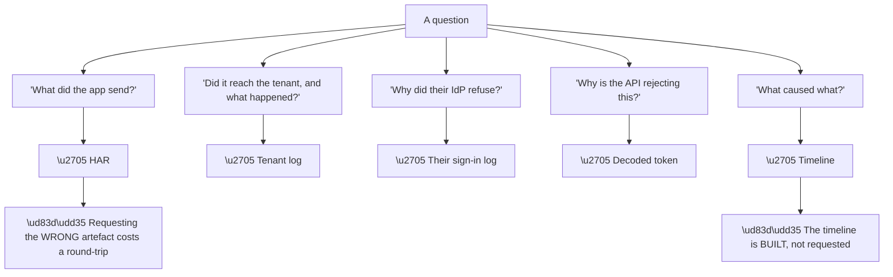
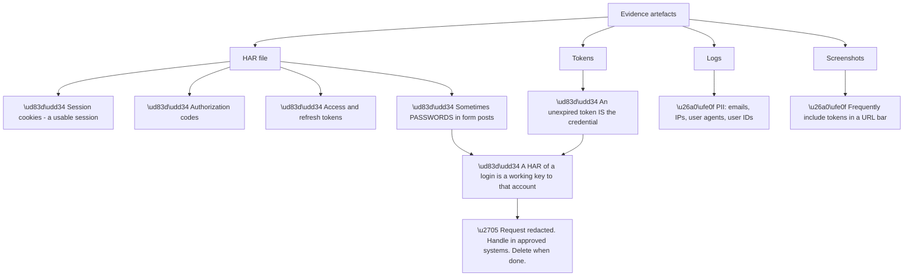
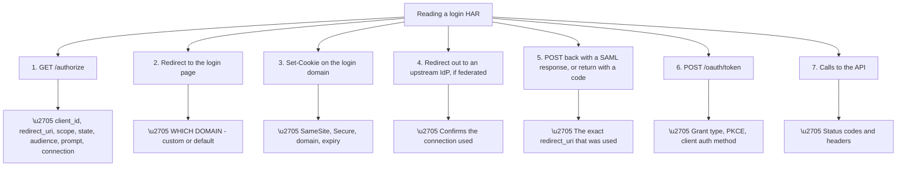
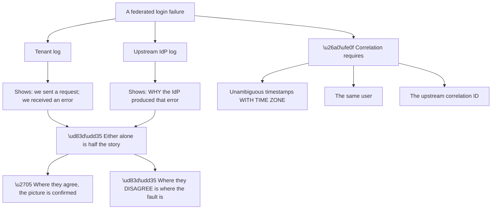
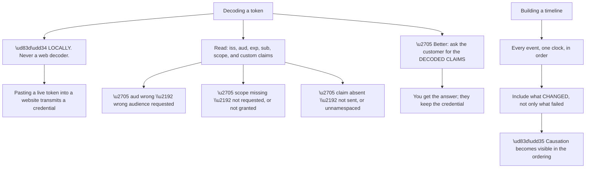
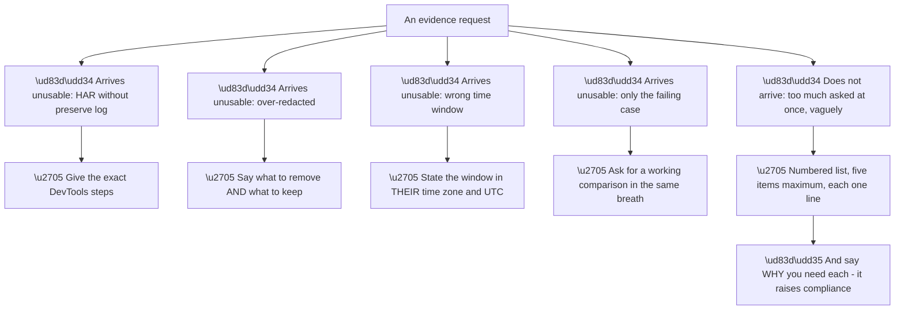
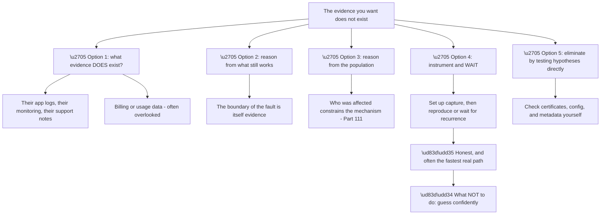
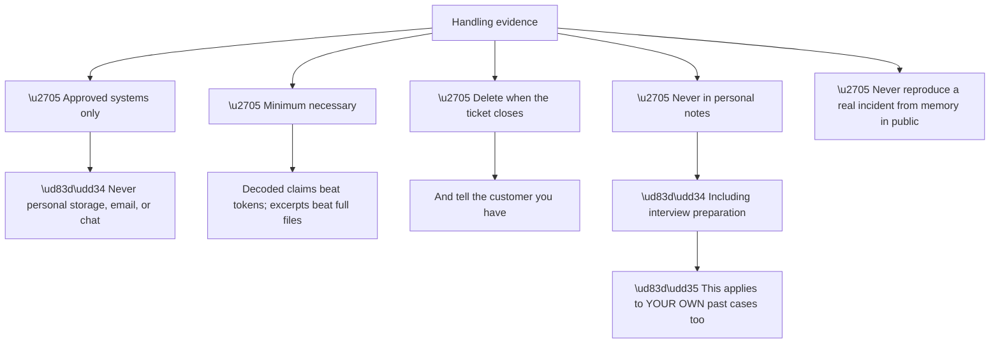
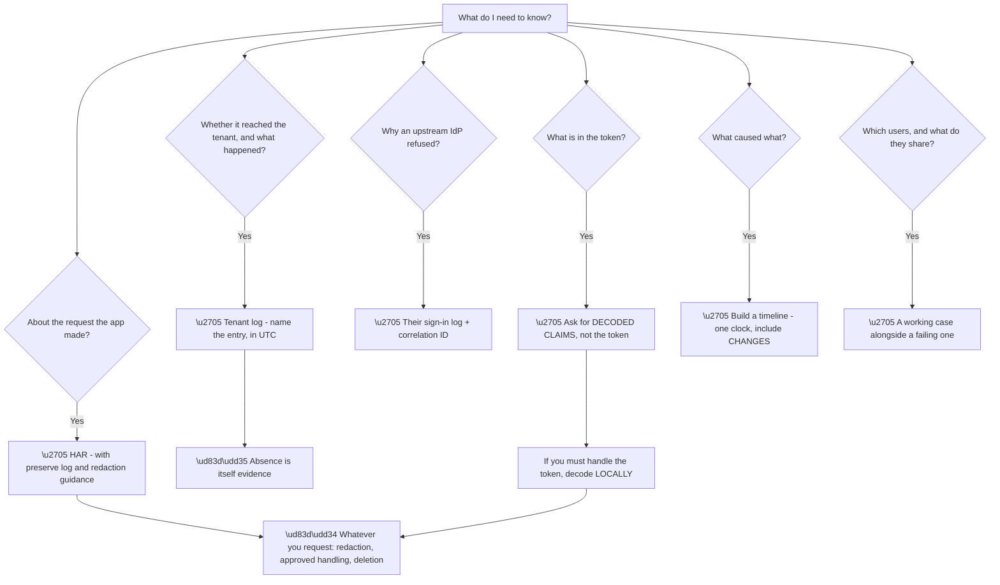

# Part 112 - The Evidence Kit: HAR, Logs, Tokens, and Timelines

> Section goal: Master the artefacts the method depends on — what each one actually shows, how to request them so they arrive usable, and how to handle them without creating a security incident of your own.

Covers index item **112**. Maps to JD signals: *debugging tools*, *troubleshooting complex technical issues*, *HTTP and browser*, *security*, *customer-facing communication*, *data handling*.

---

## 1. Start From Zero: Five Artefacts, Five Questions

Almost every identity investigation is answered by one of five artefacts. **Knowing which one answers which question is what makes an evidence request precise.**

| Artefact | Answers |
|---|---|
| **HAR** | What did the browser actually send and receive? |
| **Tenant log** | What did the identity platform do, and why? |
| **Upstream IdP log** | Why did the customer's own IdP decide that? |
| **Decoded token** | What is actually in it? |
| **Timeline** | In what order did these things happen? |

**Node R2 distinguishes the timeline from the rest.** The others are collected; **the timeline is constructed by you** from the others, and it is where causation becomes visible rather than merely correlation.

**Node R is the practical cost of imprecision.** Asking for "logs" when you need a HAR produces the wrong thing and a day's delay. **Naming the artefact and what you want to see in it** avoids that.

> 💡 **Tie-in to your background:** HAR analysis, Wireshark, Fiddler, and log correlation are all on your CV. **This Part is your existing toolkit applied to identity flows** — the artefacts are familiar, and only the fields you care about are new.

### 🔍 Plain-English deep-dive: every one of these is a live credential

Before technique, the safety rule — **because these artefacts are more dangerous than they look.**

**Node R is the fact to hold onto.** A HAR captured during a login **can be replayed** — the session cookie works, the refresh token works, and if the login form posted credentials, the password is in there in plain text.

**Which produces three obligations**, and they are not optional:

| Obligation | Practice |
|---|---|
| **Ask for redaction** | In the same sentence as the request, with guidance |
| **Handle properly** | Approved systems only — never personal storage, never chat |
| **Delete when done** | And say so, so the customer knows |

**The redaction ask must include guidance**, because "please redact" alone produces either an unredacted file or an over-redacted useless one. **Naming what to remove and what to keep** is what makes it work:

> Please remove the values of any `Authorization` headers, `Cookie` headers, and anything named `access_token`, `id_token`, `refresh_token`, or `code`. **Keep the request URLs, the query parameters other than those, the status codes, and the timings** — those are what I need.

**That distinction is important**, because the diagnostic value is almost entirely in **URLs, parameters, status codes, and timings** — not in the token values themselves (Part 102).

**One case where the token is needed:** when the question is specifically *what is in the token*. **Then ask for the decoded claims, not the token** — the customer decodes it locally and sends the payload. **You get the answer without the credential.**

**Analogy:** asking someone to photograph their door lock so you can diagnose a jam. Useful — and a photograph of the key is not what you asked for and creates a risk that outlives the ticket. **Where it stops:** a photograph of a key is hard to use. A token in a text file is directly usable by anyone who reads it.

---

## 2. The HAR File

A HAR records every HTTP request and response a browser made, and **for redirect-based authentication it shows the entire flow** (Part 102).

**Seven steps, and each answers a question** that would otherwise require a round-trip:

| Question | Step |
|---|---|
| Is `prompt=login` being sent? | 1 |
| Was an `audience` requested? | 1 |
| Which domain is this application on? | 2 |
| Are cookies set with the right attributes? | 3 |
| Which connection was used? | 4 |
| Does the redirect URI match what is configured? | 5 |
| Is PKCE actually in use? | 6 |
| Is the API returning 401 or 403? | 7 |

**The most common reason a HAR arrives unusable** is worth pre-empting in the request: **"preserve log" was not enabled**, so the redirects cleared the capture and only the final page remains. **A HAR that starts at the callback has lost everything diagnostic.**

**The instruction to give:**

> In DevTools, open the **Network** tab, tick **Preserve log**, then reproduce the problem from the very beginning — starting before you click sign in. Then right-click and **Save all as HAR**.

**Two further reading tips** that repay the effort:

**Read the timings.** A slow step is visible, and Part 103's Action latency shows up here as a slow `/authorize` or a slow callback.

**Read the status codes in sequence.** A 302 chain that ends somewhere unexpected shows a redirect problem immediately, **and the final destination is often the whole answer.**

---

## 3. Logs: Tenant and Upstream

Part 107 covered tenant logs in depth. **The point here is the discipline of getting both.**

**Node R2 is the correlation principle**, and node C3 is what makes it precise. **Asking for the upstream correlation ID converts "around 9am" into a single record**, and it is the single highest-value item in an evidence request for a federated problem (Part 095).

**The time zone issue is mundane and expensive.** Tenant logs are UTC; the customer reports in local time; the upstream log may be in a third zone. **State the conversion explicitly in the ticket** — *"09:14 IST is 03:44 UTC, which is the window I am looking at"* — because a silent mismatch means comparing unrelated events and reaching a confident wrong conclusion.

**What to ask for, precisely:**

| Instead of | Ask for |
|---|---|
| "Send me your logs" | "The tenant log entry for the failed attempt at 03:44 UTC for user X" |
| "Check Entra" | "The Entra sign-in log entry and its correlation ID for that attempt" |
| "Any errors?" | "One failing attempt and one successful one, at the same time" |

**Every row is more specific and produces a usable answer first time**, which is worth more than the effort of phrasing it.

---

## 4. Tokens and Timelines

**Tokens** answer questions about contents; **timelines** answer questions about causation.

**Node T3 is the practice worth adopting as a default.** For almost every token question, **the decoded payload answers it and the token itself is unnecessary.** Asking for the claims rather than the token gets the same diagnostic value with none of the credential risk.

**Node TL2 is what makes a timeline more than a log extract.** A timeline containing only failures shows *when* things broke; **a timeline that also includes deployments, configuration changes, certificate dates, and upstream announcements shows *why*.**

**A worked timeline shape:**

| Time (UTC) | Event | Source |
|---|---|---|
| 08:00 Mon | Customer deployed release 4.2 | Their release log |
| 09:12 Tue | IdP signing certificate rolled over | IdP metadata |
| 09:14 Tue | First login failure | Tenant log |
| 09:14 Tue | Signature validation error | Tenant log detail |
| 11:30 Tue | Customer reports the issue | Ticket |

**The ordering does the work.** The deployment is a day earlier and unrelated; **the certificate rollover is two minutes before the first failure**, which is a mechanism rather than a coincidence.

**And the two-minute gap is itself informative** — it is the kind of detail that turns a plausible story into a confirmed one, and it is only visible with a single clock.

### 🔍 Plain-English deep-dive: asking for evidence so it arrives usable

Most failed evidence requests fail for predictable reasons. **Anticipating them in the request is the difference between one round-trip and three.**

**Node P4 is the item most often omitted and most often decisive.** A working case alongside a failing one **turns diagnosis into comparison**, and the list of candidate differences between two users or two applications is short.

**Node R2 is a small technique with a real effect.** Saying *why* each item is needed **raises the chance of getting it and improves its quality** — a customer who knows you need the timings will not strip them, and one who knows you need the request parameters will not redact them along with the tokens.

**A complete request, as a template:**

> To pin this down I need five things — most should take a few minutes:
>
> 1. **The exact time** of one failed attempt, with the **time zone**, and the **user's email**. *(So I can find the right log entry.)*
> 2. **The correlation ID** from your Entra sign-in log for that attempt. *(That is the key into their side of the flow.)*
> 3. **One user it works for**, at roughly the same time. *(Comparing a working and failing case is usually the fastest route.)*
> 4. **A HAR of the failing sign-in.** In DevTools, Network tab, tick **Preserve log**, reproduce from before you click sign in, then Save all as HAR. **Please remove the values of `Authorization` and `Cookie` headers and anything named `access_token`, `id_token`, `refresh_token`, or `code`** — but **keep the URLs, other parameters, status codes, and timings**, which is what I actually need.
> 5. **Whether this affects all users or a subset** — and if a subset, what they have in common. *(That usually tells me which layer to look at.)*

**Five items, each with a reason, one of them a comparison case, and redaction guidance built in.** That is the shape that works.

**One more consideration:** if the customer cannot redact, **do not accept an unredacted file into an inappropriate channel.** Offer a secure upload path, or ask them to describe the specific fields instead. **The convenience of receiving it is not worth mishandling credentials**, and offering the alternative keeps the ticket moving.

**Analogy:** asking a witness for a statement. Vague questions get vague answers; specific questions with a stated reason get precise ones, and asking what they *did* see alongside what they did not is what makes the account usable. **Where it stops:** a witness can be asked again cheaply. Every follow-up evidence request costs about a day.

### 🔍 Plain-English deep-dive: what to do when the evidence does not exist

Sometimes the artefact you need is unavailable — retention expired, the customer cannot reproduce it, or nobody captured anything. **That is a common situation, not a dead end.**

**Node O4 is the option people resist** because it feels like an admission of failure, and it is frequently the right answer. **"I cannot determine this from what we have; let us set up capture so the next occurrence gives us a definitive answer"** is honest, professional, and usually faster than days of speculation.

**And it comes with a concrete deliverable:** telling the customer exactly what to enable — a log stream, preserve-log capture, additional application logging — **means the next occurrence is diagnosed in minutes rather than repeating this conversation.**

| Situation | Best option |
|---|---|
| Retention expired, incident over | Instrument for recurrence |
| Cannot reproduce | Population and boundary reasoning |
| Customer has no logging | Instrument, and recommend a log stream |
| Intermittent, rare | Instrument and wait |
| Happening now | **Capture immediately — do not lose it** |

**The last row is a real risk during a live incident.** **Evidence is being generated right now and will expire**, so capturing it comes before analysing it. **"Before we go further, please export the log for the last hour"** preserves the ability to diagnose even if the incident resolves itself.

**Node R is the boundary that matters most.** With incomplete evidence, **a confident guess is worse than an honest gap** — it sends the customer down a wrong path, consumes their effort, and damages trust when it fails. **"Based on what we have, the most likely explanation is X, and here is what would confirm it"** conveys the same working hypothesis without overstating it.

**Analogy:** an investigator arriving after the scene has been cleaned. You work from what remains, from who was present, and from what is still in place — and if that is not enough, you say so and arrange to be there next time, rather than inventing a narrative that fits. **Where it stops:** a scene can sometimes be reconstructed. A log that has aged out is simply gone.

---

## 5. Handling and Retention

Evidence handling is a discipline, and getting it wrong is a security incident of your own making.

**Node R is directly relevant to interview preparation**, and worth being explicit about. **Describing a real customer's incident in detail in an interview is a data handling failure**, however anonymised it feels.

**The correct approach** is to describe the **method and the shape** of a problem without identifying details: *"I've handled cases where a certificate rollover broke one downstream consumer while everything else kept working"* is instructive and carries no customer data. **Naming the customer, the product, or specifics is not.**

| Acceptable | Not acceptable |
|---|---|
| The method you used | The customer's name |
| The class of problem | Their specific configuration |
| What you learned | Log excerpts or screenshots |
| A synthetic example | A real reconstructed one |

**And the same rule governs your own lab artefacts.** Every lab in this guide has said to delete captures and tokens — **not because lab data is sensitive, but because the habit is what protects you when the data is real.**

---

## 6. Failure Modes

| # | Failure mode | Symptom | Root cause | Fix |
|---|---|---|---|---|
| 1 | HAR without preserve log | Only the last page captured | Redirects cleared it | Give exact steps |
| 2 | Over-redacted HAR | Unusable | "Redact" without guidance | Say what to keep |
| 3 | Unredacted HAR received | **Credentials in the ticket** | No redaction asked | Always ask; offer a secure path |
| 4 | Token pasted into a web decoder | **Credential transmitted** | Convenience | Decode locally, or ask for claims |
| 5 | Wrong time window | Unrelated events compared | Time zone mismatch | State both zones |
| 6 | Only the failing case | Analysis instead of comparison | Not asked | Always request a working case |
| 7 | "Send me your logs" | Wrong artefact arrives | Vague request | Name the artefact and the entry |
| 8 | Missing correlation ID | Slow cross-system work | Not asked up front | Ask in the first message |
| 9 | Timeline without changes | When, but not why | Only failures included | Include deployments and expiry dates |
| 10 | Evidence in personal storage | Data handling failure | Convenience | Approved systems only |
| 11 | Evidence retained after closure | Unnecessary exposure | No deletion step | Delete and confirm |
| 12 | Real case detail in notes | Data handling failure | Habit | Method and shape only |
| 13 | Too many items requested | Nothing arrives | Overwhelming request | Five items, each one line |
| 14 | No reason given per item | Poor-quality evidence | Compliance without understanding | Say why each is needed |

---

## 7. Troubleshooting Decision Tree: Choosing the Artefact

### Worked example

A customer reports intermittent login failures. They have already sent "the logs" — a screenshot of their application's console showing a generic error.

**That artefact answers nothing** (Part 102): the message is deliberately vague and identical for a dozen causes.

**Choosing correctly.** The question is *where* it fails, so the artefact is a **HAR** — plus the **tenant log** to confirm whether requests are arriving.

**The request, in one message:** the exact time and time zone of one failure, the affected user, a HAR with preserve-log instructions and redaction guidance, one working comparison, and whether it affects a subset.

**What arrives.** A properly captured HAR and two timestamps.

**Reading the HAR** shows the flow completing normally — authorize, login, callback with a code — and then **the token exchange returning 400 with `invalid_grant`.**

**But only sometimes.** The working comparison shows the same flow succeeding.

**The difference is in the timings.** In the failing case, **the gap between the callback and the token exchange is over a minute**; in the working case it is under a second.

**Building the timeline** makes it clear: their front end receives the code, then makes an analytics call that occasionally hangs, **and only then exchanges the code.** When the analytics call is slow, the authorization code has expired by the time it is used.

**Nothing is wrong with the identity flow.** The code is short-lived by design (Part 106), and their ordering makes expiry possible.

**The fix** is to exchange the code first and do analytics afterwards.

**Three points worth noting about the evidence work:**

**The screenshot they volunteered was worthless**, and gently redirecting to the right artefact was the whole first step.

**The timings were the answer**, and they are exactly what over-zealous redaction removes — **which is why the request said what to keep.**

**The working comparison was decisive.** Without it, a one-minute gap looks unremarkable; **alongside a sub-second one, it is the entire finding.**

---

## 8. Lab: Build Your Evidence Kit

**Purpose.** Capture each artefact yourself, learn what each reveals, and build reusable request templates.

**Prerequisites.**
- The free tenant and test client from Groups J
- Browser DevTools and a **local** JWT decoder
- **Never** capture evidence from an employer or customer system

**Steps.**

1. **Capture a HAR of a successful login** with preserve log enabled. **Identify all seven steps from §2.**
2. **Capture one without preserve log.** **Compare what is missing** — this is failure mode 1.
3. **Redact your HAR** following your own guidance. **Confirm it is still diagnostically useful** — that URLs, parameters, status codes, and timings survive.
4. **Over-redact deliberately** — strip parameters too — and confirm it becomes useless.
5. **Break something** (a wrong callback URL) and capture the HAR. **Find the failure in it.**
6. **Find the same event in the tenant log.** **Compare what each artefact tells you.**
7. **Decode a token locally.** Record the claims. **Then write down why you would ask a customer for the claims rather than the token.**
8. **Build a timeline** for a deliberately induced failure, including your own configuration change. **Confirm the ordering shows causation.**
9. **Write your evidence request template**, five items with reasons and redaction guidance.
10. **Test it on someone** — give them the template and see whether they produce a usable HAR without further questions.
11. **Write your handling rules:** where evidence lives, how long, and what you would say to a customer about deletion.
12. **Write three sentences** describing a real past incident from your own experience **in the method-and-shape style**, containing no identifying detail. **Check them against §5.**

**Expected evidence.**
- Two HARs, with and without preserve log
- A usefully redacted HAR and an over-redacted one
- A failure identified in both a HAR and the tenant log
- Locally decoded claims, with your written reasoning
- A timeline showing causation
- Your tested evidence request template
- Your handling rules
- Three anonymised sentences about a real incident

**Validation rubric.**

| Criterion | Pass |
|---|---|
| Artefact selection | You can name the right artefact for any question |
| HAR fluency | You can read a login flow end to end |
| Redaction | You can specify what to remove and what to keep |
| Token safety | You ask for claims, and decode locally when you must |
| Timeline | You include changes, not just failures |
| Request quality | Yours produces usable evidence first time |
| Handling | You can state your rules, including for your own past cases |
| Safety | Nothing captured from employer or customer systems |

**Cleanup and privacy.** **Delete every HAR and every token** captured in this lab. **Never capture a HAR from an employer or customer system for practice**, and never store one outside approved systems. **The habit is the point** — lab discipline is what protects real data later.

---

## 9. JD Mapping

| JD signal | How this Part addresses it |
|---|---|
| Debugging tools | HAR, DevTools, log analysis, token decoding |
| HTTP and browser | Reading a full redirect-based flow |
| Troubleshooting complex technical issues | Artefact selection and timeline construction |
| Security | Credential handling and redaction |
| Customer-facing communication | Evidence requests that work first time |
| Data handling | Retention, approved systems, and anonymisation |

---

## 10. Candidate Honesty Note

- **Production experience:** HAR analysis, Wireshark, Fiddler, Network Monitor, and cross-system log correlation.
- **Production experience:** customer data handling discipline in an enterprise support environment.
- **Lab experience:** capturing each artefact, testing redaction guidance, and building a request template that produces usable evidence first time, as above.
- **Learned architecture:** which artefact answers which identity-specific question, and the seven-step HAR read.
- **No direct experience:** handling evidence for this product's customers.
- **How to say it:** *"Evidence gathering is the most transferable part of my background — HAR analysis and log correlation are things I do routinely. What I've worked on specifically is the request itself: naming the artefact, giving the DevTools steps, saying what to redact and what to keep, and always asking for a working comparison. That turns three round-trips into one."*

---

## 11. Official Source Anchors

| Source | Why | Accessed |
|---|---|---|
| W3C — HAR specification | The file format | Accessed **26 August 2026** |
| Chrome DevTools — Network reference | Capture and preserve log | Accessed **26 August 2026** |
| Auth0 Docs — Generate and analyse HAR files | Vendor guidance including redaction | Accessed **26 August 2026** |
| Auth0 Docs — View log data | Tenant log fields | Accessed **26 August 2026** |
| Microsoft Learn — Sign-in logs and correlation IDs | Upstream correlation | Accessed **26 August 2026** |
| RFC 7519 — JSON Web Token | Claim semantics for decoding | Accessed **26 August 2026** |

> **Revalidate:** DevTools UI labels change between browser versions. Re-check the capture steps before giving them to a customer.

---

## ⭐ Likely Interview Questions for This Section

### Q1. "What evidence do you ask for on a login failure, and why?"

> *Model answer:* It depends on the question, and naming the artefact precisely is what stops a wasted round-trip. If I need to know what the application actually sent, that is a HAR. If I need to know whether it reached the platform and what happened, that is the tenant log. If an upstream identity provider refused, I need their sign-in log and the correlation ID. If an API is rejecting a token, I need the decoded claims. And if I need to establish causation, I build a timeline from the others. In practice for a login failure I would ask for five things in one message: the exact time with time zone, the user, the upstream correlation ID, a HAR with capture instructions and redaction guidance, and — the one people forget — a user it works for at the same time.

### Q2. "Why is a working comparison case so valuable?"

> *Model answer:* Because it turns diagnosis into comparison, and the list of candidate differences between two users or two applications is short — same connection, same domain, same groups, same guest status, created at the same time. Without it you are analysing one failing case in isolation and every hypothesis is possible. With it, the difference is either the cause or points straight at it. I saw the value of this in a case with intermittent token exchange failures: a one-minute gap between the callback and the token exchange looks unremarkable on its own, but alongside a working case with a sub-second gap it was the entire finding — an analytics call running before the exchange and letting the authorization code expire.

### Q3. "How do you ask for a HAR safely?"

> *Model answer:* With capture instructions and specific redaction guidance in the same message. The capture instruction matters because the most common reason a HAR arrives unusable is that preserve log was not enabled, so the redirects cleared everything and only the final page remains — a HAR that starts at the callback has lost all the diagnostic content. The redaction guidance has to say what to remove *and* what to keep: remove the values of Authorization and Cookie headers and anything named access token, ID token, refresh token, or code — but keep the URLs, the other parameters, the status codes, and the timings, because that is where the answer actually is. Saying only "please redact" gets either an unredacted file or a useless one.

### Q4. "Why does it matter that a HAR contains credentials?"

> *Model answer:* Because a HAR of a login can be replayed — the session cookie is a working session, the refresh token still works, and if the login form posted credentials, the password is in there in plain text. So it is not a log file, it is a working key to that account, and it creates a risk that outlives the ticket if it is mishandled. That produces three obligations: ask for redaction with guidance, handle it only in approved systems rather than personal storage or chat, and delete it when the ticket closes and say so. If a customer cannot redact, I would offer a secure upload path or ask them to describe the specific fields rather than accept an unredacted file into an inappropriate channel.

### Q5. "How do you handle tokens as evidence?"

> *Model answer:* I ask for the decoded claims rather than the token itself, because for almost every question the payload is the answer and the token is unnecessary — I get the diagnostic value and they keep the credential. If I do need to handle a token, I decode it locally, never in a web-based decoder, because pasting a live token into a website transmits a working credential to a third party. The claims I am usually reading are the audience, which tells me whether the right resource was requested; the scope, which tells me whether permissions were granted; the expiry; and any custom claims, where absence often means it was not namespaced or not configured.

### Q6. "What makes a timeline useful rather than just a log extract?"

> *Model answer:* Including what changed, not only what failed. A timeline of failures tells you when things broke; a timeline that also includes deployments, configuration changes, certificate validity dates, and upstream provider announcements shows why. And it has to be on a single clock, because tenant logs are UTC, customers report in local time, and upstream logs may be in a third zone — a silent mismatch means comparing unrelated events and reaching a confident wrong conclusion. The value shows in the gaps: a deployment a day earlier is probably unrelated, whereas a certificate rolling over two minutes before the first failure is a mechanism rather than a coincidence.

### Q7. "How do you handle customer evidence responsibly?"

> *Model answer:* Approved systems only, minimum necessary, delete when done and say so. Minimum necessary means decoded claims rather than tokens and excerpts rather than whole files where that is sufficient. Never personal storage, personal email, or chat, because those are outside the controls the customer's data is supposed to be under. And the part people overlook: this applies to my own past cases too. Describing a real customer's incident in detail — even anonymised — in notes or in an interview is a data handling failure. What is acceptable is the method and the shape of the problem: "I've handled cases where a certificate rollover broke one downstream consumer while everything else kept working" teaches the same thing and carries no customer data.

### Q8. "A customer sends a screenshot of an error. What do you do?"

> *Model answer:* Redirect gently to the right artefact, because a login error screenshot is nearly worthless — the message is deliberately vague and identical for a dozen different causes, since specificity would leak information about which accounts exist. So I would thank them, explain briefly that the visible message is intentionally non-specific, and ask for what actually carries the information: the tenant log entry for that attempt, and a HAR if the question is what their application sent. If the error screen shows a correlation or tracking identifier, that is genuinely useful and I would ask for it — it turns a vague report into a precise log lookup. I would also suggest they tell their own users to include that identifier when reporting, which improves the quality of every ticket that follows.

---

## 🧠 30-Second Memory Hooks

- **Five artefacts: HAR · tenant log · upstream log · decoded token · timeline.**
- **The timeline is BUILT, not requested.**
- **Every artefact is a live credential.** A login HAR can be replayed.
- **Ask for redaction — and say what to KEEP.**
- **The value is in URLs, parameters, status codes, and timings.**
- **HAR needs "preserve log"** or it starts at the callback and is useless.
- **Seven-step HAR read: authorize → login domain → cookie → IdP → callback → token → API.**
- **Ask for decoded claims, not the token.** Decode locally if you must.
- **Both logs, one clock, time zones stated.**
- **Ask for the upstream correlation ID in the first message.**
- **Always request a working comparison case.**
- **Five items, one line each, with a reason for each.**
- **Approved systems. Minimum necessary. Delete and confirm.**
- **Method and shape, never customer detail — including in interviews.**

---

## ✅ Completion Checklist

- [ ] I can name the right artefact for any diagnostic question
- [ ] I can read a login HAR end to end
- [ ] I can give capture instructions that produce a usable HAR
- [ ] I can specify redaction that preserves diagnostic value
- [ ] I ask for decoded claims rather than tokens
- [ ] I build timelines that include changes, not just failures
- [ ] I always request a working comparison case
- [ ] My evidence request is five items with reasons
- [ ] I can state my handling and retention rules
- [ ] I can describe a real incident with method and shape only
- [ ] I have built and tested my request template

*Next suggested section:* **[Part 113 - Login and Callback Failure Decision Trees](Part-113-login-and-callback-failure-decision-trees.md)** — the first of two consolidated decision trees, covering everything that goes wrong between clicking sign in and arriving back at the application.
