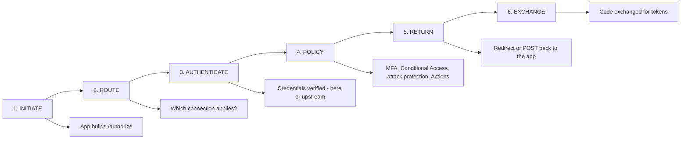
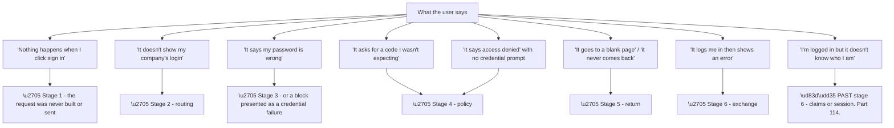
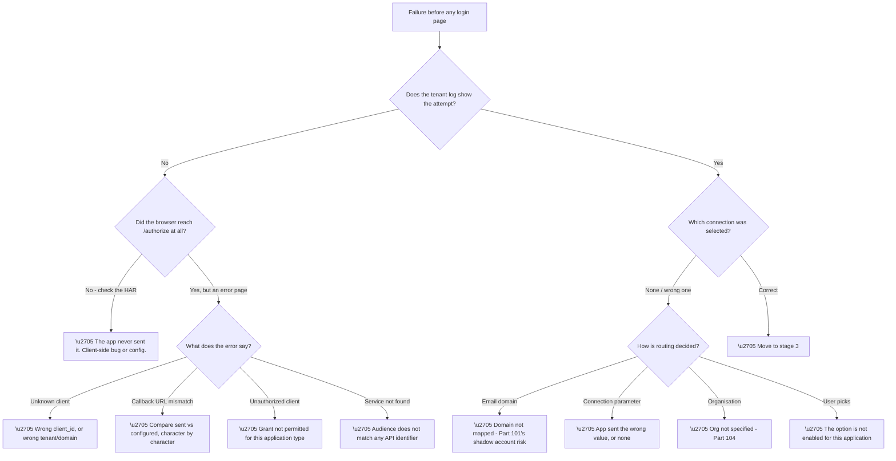
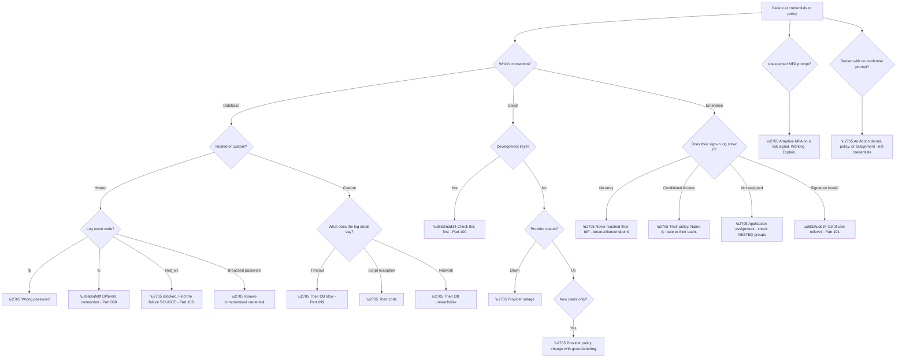
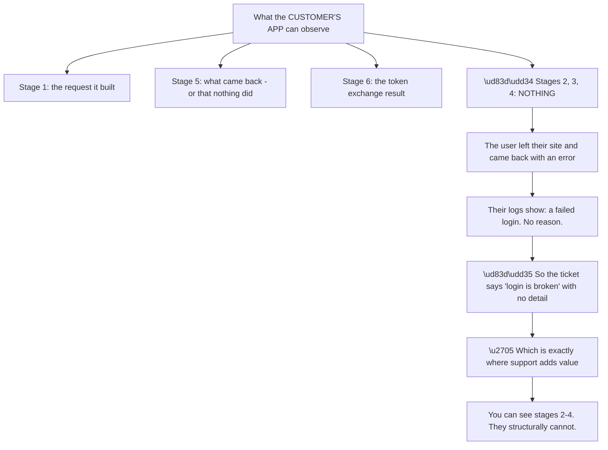
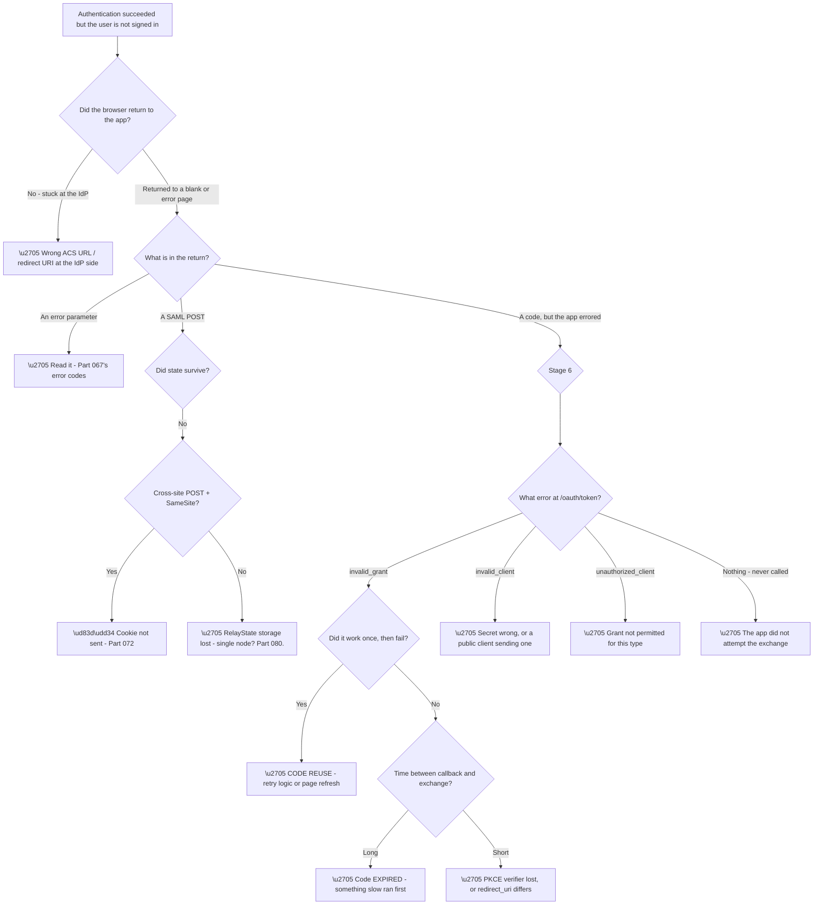
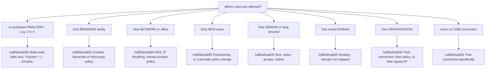
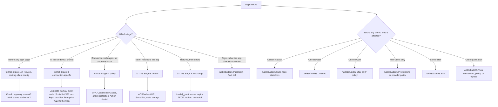

# Part 113 - Login and Callback Failure Decision Trees

> Section goal: Consolidate everything that can go wrong between clicking "sign in" and arriving back at the application into decision trees you can run from memory under pressure.

Covers index item **113**. Maps to JD signals: *troubleshooting complex technical issues*, *OAuth 2.0 and OIDC*, *SAML*, *web and browser*, *root cause analysis*, *debugging tools*.

---

## 1. Start From Zero: The Six Stages of a Login

Every login — consumer, social, or enterprise — passes through the same six stages. **Locating the failure at a stage eliminates everything before and after it.**

**The stages have distinct symptoms**, which is what makes the model useful:

| Stage | Symptom when it fails |
|---|---|
| **1. Initiate** | Error before any login page appears |
| **2. Route** | Wrong login option, or none; user falls through |
| **3. Authenticate** | Credential rejected, or upstream error |
| **4. Policy** | Blocked, or unexpectedly challenged |
| **5. Return** | Never arrives back; or arrives and state is lost |
| **6. Exchange** | Login "works" then errors at the last moment |

**Stage six is the one users describe most confusingly** — *"it logs me in and then fails"* — because from their perspective authentication completed. **It did; the token exchange did not.**

> 💡 **Tie-in to your background:** this is the same discipline as isolating a failure to a layer in a network stack. **Establish where it breaks, and everything upstream is proven working.**

### 🔍 Plain-English deep-dive: locating the stage from the user's description alone

Users do not know what a stage is. **But their description usually identifies one**, and learning the mapping saves a round-trip.

**Node D8 is worth separating explicitly** because it sounds like a login failure and is not. **The login completed and the tokens were issued** — what failed is claims, mapping, or the application's session handling, which is Part 114's territory.

**Node D3 carries a caution.** *"My password is wrong"* is not reliably stage three. **A blocked account (Part 108), a Conditional Access denial (Part 091), or an Action denial (Part 103) can all present as a generic credential failure**, because error messages are deliberately vague (Part 102).

| User says | Could be |
|---|---|
| "Wrong password" | Stage 3 credentials, **or** stage 4 block |
| "Access denied" | Stage 4 — policy, assignment, or Action |
| "Blank page" | Stage 5 — redirect or POST problem |
| "Logs in then errors" | Stage 6 — exchange |
| "Logged in but no data" | **Past login** — Part 114 |

**Which is why the log confirms the stage** rather than the description. **The description generates a hypothesis; the log tests it** (Part 111).

**Analogy:** a passenger describing where a journey went wrong — the car would not start, they took a wrong turn, they were stopped at a checkpoint, or they arrived and could not get in. Each description points at a different part of the journey, even though the passenger does not know the route. **Where it stops:** the passenger may misdescribe a checkpoint as a breakdown, which is why you check the route rather than trusting the account.

---

## 2. Stages 1–2: Initiate and Route

**Node C1 is where the absence of a log entry is decisive** (Part 107): if `/authorize` was never reached, **the fault is entirely client-side** and the HAR is the artefact.

**Node D1a is the highest-consequence routing failure** because it is silent: **an unmapped corporate domain falls through to self-signup**, and the user creates a password account rather than federating (Part 101).

**Node D1d is the fastest check in this whole tree.** Connections are enabled per application (Part 097), **so a missing login option is usually enablement rather than anything complex** — and it takes seconds to confirm.

---

## 3. Stages 3–4: Authenticate and Policy

**Node C1b is the log-level signature of the duplicate-identity problem** (Part 098): `fu` frequently means **a different connection**, not a missing user.

**Node D1 is placed first deliberately.** Development keys explain such a broad symptom set — intermittent failures, unexpected branding, scale-related problems — that **checking takes seconds and eliminates a lot** (Part 100).

**Node E1 is the two-log discipline** (Part 095): **no entry in the upstream log means the request never arrived**, which points at tenant ID, client ID, or endpoint rather than at anything the customer's IdP did.

**Node G1 is worth separating** because it is diagnostically clean: **a denial with no credential prompt cannot be a credential problem.** The user never got the chance to be wrong.

### 🔍 Plain-English deep-dive: the stages a customer cannot see

Stages three and four happen largely **outside the customer's application**, and that asymmetry shapes how these tickets arrive.

**Node R1 is the reframing worth carrying into every one of these tickets.** The customer is not being unhelpful when they cannot say what went wrong — **the information is structurally unavailable to them.** Three of six stages happen on infrastructure they do not own.

| Stage | Customer can see | You can see |
|---|---|---|
| 1. Initiate | ✅ Their own code | ✅ Via HAR |
| 2. Route | ❌ | ✅ Tenant log |
| 3. Authenticate | ❌ | ✅ Tenant log + upstream |
| 4. Policy | ❌ | ✅ Tenant log + upstream |
| 5. Return | ✅ What arrived | ✅ Via HAR |
| 6. Exchange | ✅ Their error | ✅ Tenant log |

**Two consequences follow.** First, **a first reply that names what happened in stages 2–4 is immediately valuable** — it tells the customer something they could not have found. Second, **their description of stages 2–4 is guesswork** and should be treated as such, however confidently offered.

**And there is a proactive move worth making** on any customer with recurring login tickets: **give them visibility.** A log stream (Part 107) surfaces stages two through four in their own tooling, which turns a category of escalations into self-service.

**One phrasing that lands well** in the first reply: *"your application only sees a generic failure here, which is expected — the detail lives in the tenant log, and I can see that this attempt was blocked by X."* **It removes any suggestion they should have found it themselves**, and it explains why the next such ticket will also need you.

**Analogy:** a traveller who left the building, was turned away at a checkpoint out of sight, and returned saying only that it did not work. The receptionist inside cannot know what happened at the checkpoint; someone with access to the checkpoint log can, in seconds. **Where it stops:** the checkpoint log records the decision, not the traveller's experience of it, so the two accounts still have to be reconciled.

---

## 4. Stages 5–6: Return and Exchange

The last two stages produce the most confusing symptoms, because **authentication has visibly succeeded.**

**Node E1a is the SameSite failure** (Part 072), and its signature is distinctive: **SAML responses arrive as cross-site form POSTs**, so a `SameSite=Lax` cookie is not sent — producing "state lost" symptoms that vary by browser.

**Node E1b is the storage failure** (Part 080): request state stored in process memory on a multi-node deployment **fails for a fraction of logins equal to one minus one-over-the-node-count.** Four nodes, three in four fail.

**Node D2c is the timing failure from Part 112's worked example** — a slow operation between callback and exchange letting the authorization code expire. **The HAR timings are what reveal it.**

**Node D5 is easy to miss and quick to check.** If the HAR shows a callback with a code and **no subsequent POST to the token endpoint**, the application simply did not attempt the exchange — a client-side error, an exception, or a routing problem in their code.

### 🔍 Plain-English deep-dive: the failures that only some users see

A large share of login tickets affect a subset, and **the shape of the subset identifies the mechanism** faster than any log.

**Node S1a is the most mathematically satisfying diagnosis in the guide.** A failure rate that is a clean fraction — a half, two thirds, three quarters — **is almost certainly load-balanced state loss**, and the fraction tells you the node count.

**It also explains why it is invisible in development**, where there is one node and the failure rate is zero.

| Reported rate | Likely nodes |
|---|---|
| ~50% | 2 |
| ~67% | 3 |
| ~75% | 4 |
| ~90% | 10 |

**Node S2a is the browser split**, and it is worth asking about routinely because customers rarely volunteer it. **"Does it affect all browsers?"** is one question that cleanly separates cookie problems from everything else.

**Node S7a is B2B-specific** and has three candidate mechanisms — their connection, their policy, or their shared egress IP (Part 108). **All three produce "one organisation, all at once"**, and distinguishing them takes one look at the log.

**The technique to build:** before opening any log, **ask what the affected users have in common.** Customers can usually answer immediately, and the answer frequently identifies the mechanism outright.

**Analogy:** an epidemiologist asking who fell ill rather than examining each patient. The pattern of who was affected — by location, by time, by what they shared — identifies the source faster than individual investigation. **Where it stops:** the pattern names a mechanism, not the specific fault, so you still confirm it.

---

## 5. Failure Modes

| # | Failure mode | Stage | Signature |
|---|---|---|---|
| 1 | Request never sent | 1 | No log entry; HAR shows nothing |
| 2 | Callback URL mismatch | 1 | Named error at `/authorize` |
| 3 | Wrong application type | 1 | `unauthorized_client` |
| 4 | Domain not mapped | 2 | Falls through to signup |
| 5 | Connection not enabled | 2 | Login option absent |
| 6 | Organisation not specified | 2 | No `org_id`, no roles |
| 7 | Account blocked | 3/4 | `limit_wc` |
| 8 | Different connection | 3 | `fu` for an existing user |
| 9 | Custom DB timeout | 3 | Intermittent, load-correlated |
| 10 | Development keys | 3 | Social, intermittent, vendor branding |
| 11 | Conditional Access | 4 | Named policy in their sign-in log |
| 12 | Not assigned | 4 | Their log says so; check nesting |
| 13 | Certificate rollover | 3/4 | Total, dated, signature invalid |
| 14 | SameSite drop | 5 | Browser-specific state loss |
| 15 | Multi-node state loss | 5 | **A consistent fraction** |
| 16 | Code reuse | 6 | Works once, then `invalid_grant` |
| 17 | Code expiry | 6 | Long gap in the HAR timings |
| 18 | PKCE verifier lost | 6 | `invalid_grant`, never works |
| 19 | Exchange never attempted | 6 | No token POST in the HAR |

---

## 6. The Consolidated Tree

### Worked example

A customer reports: *"About half our users get an error after signing in. The other half are fine. It's random which."*

**The population is the clue.** *"About half"* is a clean fraction — **node P1.**

**Confirming the stage.** The users authenticate successfully — they see the login page, enter credentials, and get an error **after** returning. **Stage 5 or 6.**

**The HAR settles it.** The callback arrives with a code, the application POSTs to the token endpoint, and the response is `invalid_grant`.

**Node D2d: PKCE verifier lost.** Their SPA stores the code verifier in memory, and **their deployment routes the callback through a different instance** — a load balancer without session affinity, in front of a server-side rendering layer.

**Fifty percent means two nodes**, which the customer confirms.

**Why it is "random"** from their side: it depends which instance handles the callback, which is effectively arbitrary per request. **It is not random; it is a coin flip.**

**The fix** is to store the verifier where both nodes can reach it — session storage tied to the browser, or a shared store keyed by state.

**Two write-up points:**

**First, this is the same failure as OAuth `state` and SAML `RelayState`** (Parts 065, 080) — **one pattern, three protocols.** Naming it as a pattern helps the customer recognise it elsewhere.

**Second, it was invisible in development** because development runs one instance. **Any state stored per-process is a latent multi-node bug**, and it is worth a broader look at what else they store that way.

**What made it fast:** treating **"about half"** as a measurement rather than a vague description. **Clean fractions are diagnostic**, and asking "is it closer to a half, two thirds, or three quarters?" is a legitimate and revealing question.

---

## 7. Lab: Break Every Stage

**Purpose.** Induce a failure at each of the six stages, capture the evidence, and confirm you can identify the stage from the symptom alone.

**Prerequisites.**
- The free tenant and test client from Group J
- DevTools and a local JWT decoder
- **Never** use an employer or customer tenant

**Steps.**

1. **Stage 1:** send a wrong `client_id`. Record the error and whether a log entry appears.
2. **Stage 1:** send a mismatched `redirect_uri`. Record the exact error text.
3. **Stage 2:** disable a connection for the application. **Confirm the option disappears** rather than erroring.
4. **Stage 2:** attempt a login with an email on an unmapped domain. **Record what the user sees.**
5. **Stage 3:** fail a password repeatedly until blocked. Record the codes in sequence.
6. **Stage 4:** enable a policy or Action that denies. **Record what the user sees** and compare it to step 5 — confirm they are indistinguishable.
7. **Stage 5:** change the callback URL after login begins so the return fails. Capture the HAR.
8. **Stage 5:** simulate state loss by clearing storage between authorize and callback. Record the error.
9. **Stage 6:** exchange the same authorization code twice. Record `invalid_grant`.
10. **Stage 6:** delay the exchange past code expiry. **Compare the error to step 9** — note that they are the same error with different causes.
11. **For each of the ten**, write the one-line user description you would expect, and check whether it maps to the right stage in §1.
12. **Build your six-stage card** with the symptoms, the discriminating checks, and the population shapes from §4.

**Expected evidence.**
- Ten induced failures with their errors and log entries
- Two indistinguishable user-facing errors from different stages
- Two `invalid_grant` errors with different causes
- HARs for the stage 5 and 6 failures
- Your six-stage card

**Validation rubric.**

| Criterion | Pass |
|---|---|
| Stage model | You can name six stages and their symptoms |
| Mapping | You can map a user's description to a likely stage |
| Ambiguity | You know which descriptions are unreliable |
| `invalid_grant` | You can distinguish reuse, expiry, and PKCE |
| Population | You can read a clean fraction as node count |
| Evidence | You know which artefact confirms each stage |
| Safety | Your own tenant, everything deleted |

**Cleanup and privacy.** Delete all test applications, connections, and users; unblock accounts and revert policies. **Delete every HAR and token.** Never induce failures against a tenant you do not own.

---

## 8. JD Mapping

| JD signal | How this Part addresses it |
|---|---|
| Troubleshooting complex technical issues | Six-stage model and consolidated trees |
| OAuth 2.0 and OIDC | Authorize, callback, and exchange failures |
| SAML | POST binding, RelayState, ACS URL |
| Web and browser | Cookies, SameSite, redirects |
| Root cause analysis | Population shape as a diagnostic |
| Debugging tools | HAR and log evidence per stage |

---

## 9. Candidate Honesty Note

- **Production experience:** isolating failures to a layer, and reading population shape as a diagnostic signal.
- **Production experience:** HAR-based diagnosis of multi-step web flows.
- **Lab experience:** inducing a failure at every stage and confirming the symptom-to-stage mapping, as above.
- **Learned architecture:** the identity-specific failure modes at each stage.
- **No direct experience:** running these trees on a live queue for this product.
- **How to say it:** *"The six-stage model is how I hold this — locate the stage and everything before it is proven working. What I built deliberately was inducing a failure at each stage so I know what the user actually sees, including the cases where two very different causes produce an identical message."*

---

## 10. Official Source Anchors

| Source | Why | Accessed |
|---|---|---|
| RFC 6749 §4.1 and §5.2 | Authorization code flow and error codes | Accessed **26 August 2026** |
| RFC 7636 — PKCE | Verifier and challenge semantics | Accessed **26 August 2026** |
| OpenID Connect Core | Authentication request and response | Accessed **26 August 2026** |
| OASIS — SAML 2.0 Bindings | HTTP POST binding and RelayState | Accessed **26 August 2026** |
| Auth0 Docs — Log event type codes | Stage-level evidence | Accessed **26 August 2026** |
| MDN — SameSite cookies | Cross-site POST behaviour | Accessed **26 August 2026** |

> **Revalidate:** error strings and log codes change; the stage model does not. Re-check exact error wording before quoting it.

---

## ⭐ Likely Interview Questions for This Section

### Q1. "How do you structure a login failure investigation?"

> *Model answer:* By locating the failure at one of six stages: initiate, route, authenticate, policy, return, and exchange. Each has a distinct symptom, and identifying the stage eliminates everything before and after it. Initiate fails before any login page appears. Route fails when the wrong connection is chosen or none is. Authenticate is the credential check. Policy is MFA, Conditional Access, attack protection, or an Action denial. Return is the redirect or POST back to the application. And exchange is the token call, which produces the confusing "it logs me in and then fails" description. There is also a seventh case that sounds like a login failure and is not — signed in but the application does not know who they are, which is claims or session rather than login.

### Q2. "A user says 'my password is wrong' but insists it isn't. What do you consider?"

> *Model answer:* That the description is unreliable at this stage, because error messages are deliberately vague to resist enumeration. A blocked account, a Conditional Access denial, an application assignment problem, or an Action denial can all present as a generic credential failure. So I would not treat "wrong password" as stage three until the log confirms it. The log distinguishes them cleanly — a failed password event, an account-blocked event, or a policy denial look identical to the user and completely different in the log. And if the account is blocked, that is the symptom rather than the cause, so the next question is what generated the failures, which is usually a stale cached credential retrying in the background.

### Q3. "What does a failure rate of 'about three quarters' tell you?"

> *Model answer:* Multi-node state loss, almost certainly, with four nodes. If something is stored per-process between the authorize request and the callback — the OAuth `state`, the PKCE verifier, or SAML RelayState — and the callback lands on a different instance, it fails. The failure rate is one minus one over the node count, so a half means two nodes, two thirds means three, three quarters means four. It is also invisible in development, where there is one instance and the rate is zero, which is why it reaches production. So when a customer says "about half" or "roughly three quarters," I treat that as a measurement rather than a vague description, and asking them to pin it down more precisely is a legitimate and revealing question.

### Q4. "`invalid_grant` at the token endpoint — what are the causes?"

> *Model answer:* Four, and one question separates them. If it worked once and then immediately failed for the same login, that is code reuse — authorization codes are single-use, so retry logic, a refreshed callback page, or a double-submitted request fails the second time. If it never works, then it is either the PKCE verifier being lost between requests, or the redirect URI at the exchange differing from the one used at authorize. And the fourth is code expiry, which shows up in the HAR timings as a long gap between the callback and the exchange — usually because something slow runs first, like an analytics call. The HAR is what distinguishes expiry from the others, because only it shows the elapsed time.

### Q5. "Users report a blank page after signing in. Where do you look?"

> *Model answer:* Stage five — the return. The three candidates are the redirect or ACS URL being wrong at the identity provider's side, so the response goes somewhere unexpected; a SameSite cookie problem, because a SAML response arrives as a cross-site form POST and a Lax cookie is not sent, which produces state-lost symptoms that vary by browser; or the application's request state being lost, which is the multi-node problem. The HAR settles it quickly — it shows where the response actually went, whether cookies were sent, and what the application did next. And if the browsers affected are Safari and Firefox but not Chrome, that is close to conclusive for the cookie explanation.

### Q6. "Why is 'who is affected' more useful than the error message here?"

> *Model answer:* Because error messages at the login stage are deliberately vague and shared across many causes, while the population shape frequently identifies the mechanism outright. A clean fraction is node-based state loss. One browser family is cookies. One network or office is DNS, IP throttling, or a named-location policy. Only new users is provisioning or a provider policy change with grandfathering. Only senior and long-tenured staff is a size limit. One email domain is routing. One organisation is their connection, their policy, or their shared egress IP. Customers can answer the population question immediately, and it costs nothing, whereas the error message often costs a round-trip and tells you less.

### Q7. "How would you tell whether an application even attempted the token exchange?"

> *Model answer:* The HAR. If the callback arrives with a code and there is no subsequent POST to the token endpoint, the application never attempted it — a client-side exception, a routing problem in their code, or an error handler swallowing it. That is worth checking early because it looks identical to an exchange failure from the user's side, and the fix is entirely in their code rather than in any configuration. It also means there will be no corresponding entry in the tenant log for the exchange, which is a second confirming signal — absence of an entry is evidence, as long as you know which entry you expected to see.

### Q8. "Two of your induced failures produced identical user-facing errors. Why does that matter?"

> *Model answer:* Because it means the user's description cannot distinguish them, so the log has to. A wrong password and a policy denial look the same to the user by design, since a more specific message would leak whether the account exists or whether the password was correct. The practical consequence for support is that a screenshot of the error is nearly worthless as evidence, and the first thing to ask for is the tenant log entry or the correlation identifier shown on the error screen. It also means I should be careful about accepting a user's characterisation — "it says my password is wrong" is what the screen said, not necessarily what happened.

---

## 🧠 30-Second Memory Hooks

- **Six stages: initiate · route · authenticate · policy · return · exchange.**
- **"Signed in but it doesn't know me" is PAST login** — Part 114.
- **"Wrong password" may be stage 3 or a stage 4 block.** The log decides.
- **No log entry = never reached the tenant.** The HAR is the artefact.
- **Missing login option = connection not enabled for that application.**
- **Unmapped domain = silent fall-through to signup.**
- **`fu` = probably a different connection.**
- **Social failing? Check development keys first.**
- **Enterprise? Get their log. No entry = never arrived.**
- **Blank page = ACS/redirect URI, SameSite, or state storage.**
- **`invalid_grant`: worked once = reuse; long HAR gap = expiry; never = PKCE or redirect mismatch.**
- **No token POST in the HAR = the app never tried.**
- **A clean fraction = multi-node state loss.** Fraction gives the node count.
- **Ask what the affected users have in common, before opening any log.**

---

## ✅ Completion Checklist

- [ ] I can name the six stages and their symptoms
- [ ] I can map a user's description to a likely stage
- [ ] I know which descriptions are unreliable and why
- [ ] I can run the stage 1–2 tree from memory
- [ ] I can run the stage 3–4 tree by connection type
- [ ] I can distinguish all four causes of `invalid_grant`
- [ ] I can read a clean failure fraction as a node count
- [ ] I can name the population shapes and what each implies
- [ ] I know which artefact confirms each stage
- [ ] I have induced a failure at every stage in my own tenant
- [ ] I have built my six-stage card

*Next suggested section:* **[Part 114 - Token, API, and Authorization Failure Decision Trees](Part-114-token-api-and-authorization-failure-decision-trees.md)** — everything that goes wrong after login succeeds: tokens, claims, APIs, and permissions.
