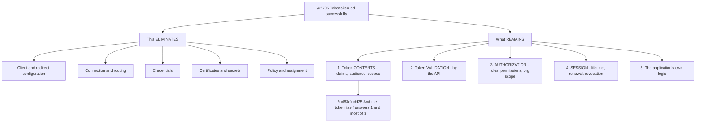
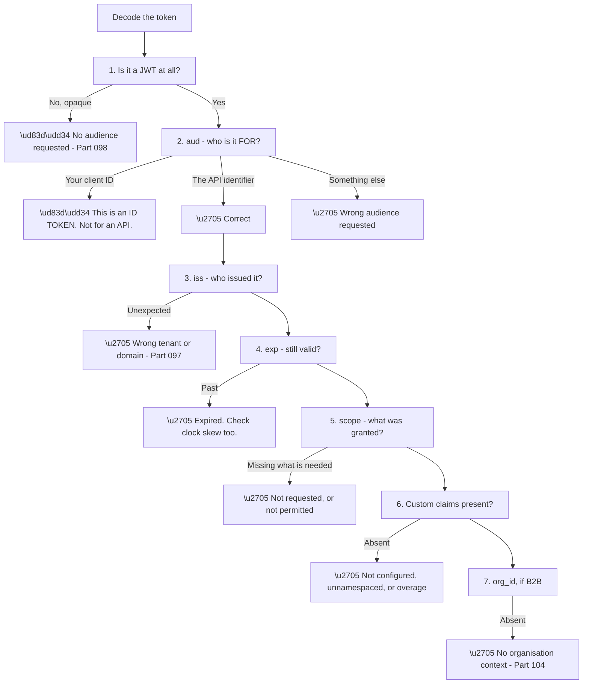
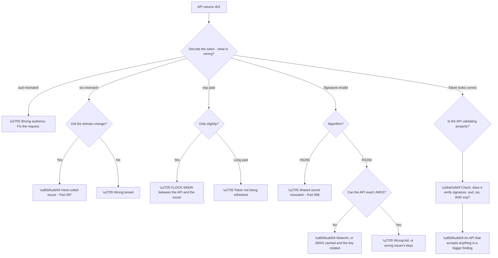
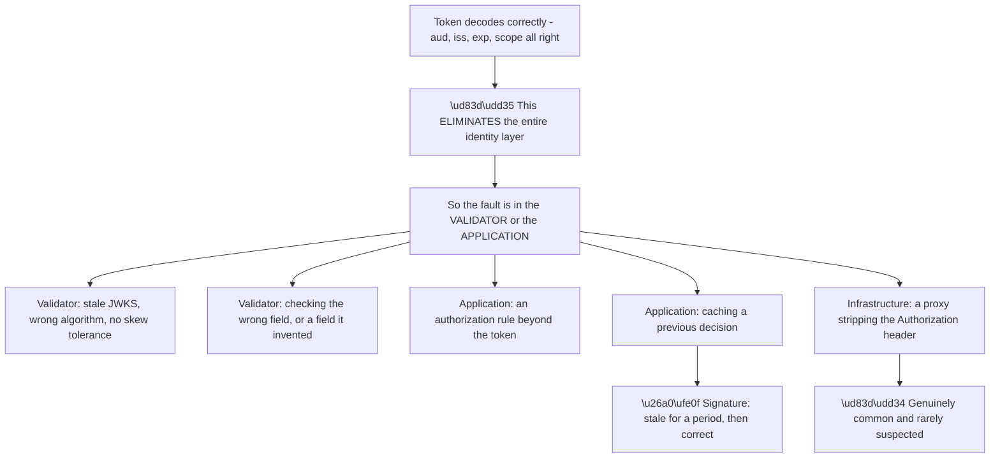
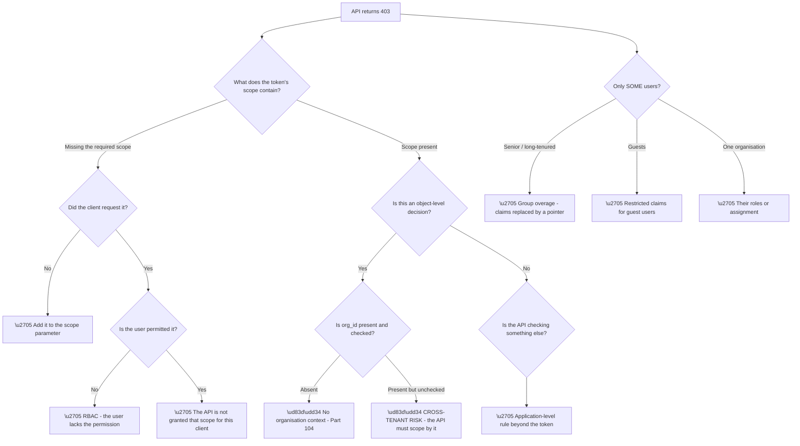
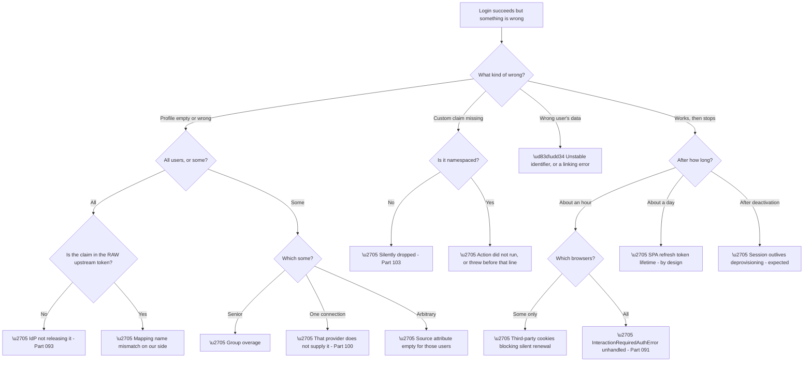
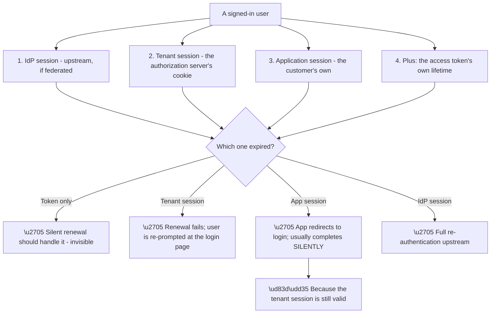
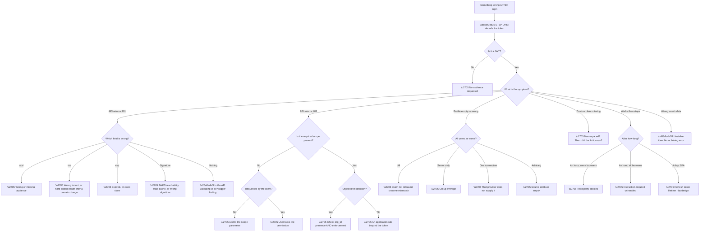

# Part 114 - Token, API, and Authorization Failure Decision Trees

> Section goal: Cover everything that goes wrong *after* login succeeds — token contents, claims, API validation, permissions, and sessions — where the identity layer has done its job and the failure is downstream.

Covers index item **114**. Maps to JD signals: *troubleshooting complex technical issues*, *OAuth 2.0 and OIDC*, *APIs*, *authorization*, *root cause analysis*, *debugging tools*.

---

## 1. Start From Zero: Login Succeeded, So What Is Left?

Part 113 ended at the token exchange. **Everything from here assumes tokens were issued successfully**, which eliminates a large space of causes in one step.

**Node D is the practical shortcut for this entire Part.** **Decode the token first.** It shows the audience, the scopes, the claims, the expiry, and the issuer — **which answers or narrows most questions here before any other step.**

**The five remaining areas have distinct symptoms:**

| Area | Symptom |
|---|---|
| Token contents | Profile empty or wrong; API rejects |
| Token validation | 401 from the API |
| Authorization | 403 from the API |
| Session | Works, then stops after a period |
| Application logic | Inconsistent with what the token says |

**The 401/403 split is the single most useful distinction** in this Part (Part 106): **401 means the credential is wrong; 403 means it is valid and lacks permission.**

> 💡 **Tie-in to your background:** this is REST API troubleshooting with an identity layer attached. **Status codes, headers, and payloads are familiar ground**, and the identity-specific part is mostly knowing which claim to look at.

### 🔍 Plain-English deep-dive: reading a token as a diagnostic instrument

A token is not just a credential — **it is a complete record of what the authorization server decided**, and reading it in a fixed order answers questions efficiently.

**Seven checks, in order, and each eliminates cleanly.** The ordering is deliberate: **cheapest and most eliminating first.**

**Node C1a is the most common single finding.** An opaque token means **no `audience` parameter was requested**, so it was issued for the userinfo endpoint rather than for the customer's API. **The developer has a valid token that is valid for something else.**

**Node C2a is the second most common.** An `aud` equal to the client ID means **an ID token is being sent to an API** — and if the API accepts it, that is itself a finding, because it means audience is not being validated (Part 077).

| What you see | What it means |
|---|---|
| Not a JWT | No audience requested |
| `aud` = client ID | An ID token, sent to an API |
| `aud` = something else | Wrong audience requested |
| `iss` unexpected | Wrong tenant or domain |
| `exp` past | Expired — or clocks differ |
| `scope` short | Not requested, or not permitted |
| Claim absent | Not configured, unnamespaced, or overage |
| No `org_id` | No organisation context |

**Every row is readable in seconds from a decoded payload**, which is why asking a customer for their decoded claims (Part 112) is so productive — **they send eight lines and it usually contains the answer.**

**Analogy:** a ticket that states the event, the venue, the date, and the seat. Being refused entry is almost always explained by reading it — wrong venue, wrong date, wrong section. **Where it stops:** a ticket cannot tell you the door staff are checking the wrong field, which is why validation is a separate question.

---

## 2. Token Validation Failures (401)

A 401 from an API means **the API rejected the credential itself.**

**Node B3a is a real and frequently-missed cause.** A token rejected as expired **only slightly** past its time usually means **the API's clock differs from the issuer's.** Validators should allow a small skew tolerance, and one that allows none rejects otherwise-valid tokens intermittently.

**Node B4c is the JWKS caching failure.** APIs cache the signing keys for performance; **when the issuer rotates keys, a stale cache means the new `kid` is unknown.** A correctly-implemented validator re-fetches on an unknown `kid`; one that caches indefinitely fails until it restarts.

**The signature is distinctive:** total failure, no configuration change, **and resolved by restarting the API** — which is why customers often report it as a mysterious self-healing problem.

**Node B5b is the finding worth raising even when it is not the reported problem.** If a token that should be rejected is accepted, **the API is not validating properly**, and that is a security issue regardless of what the ticket was about.

| Validation step | Consequence of omitting it |
|---|---|
| Signature | **Anyone can forge a token** |
| `aud` | Tokens for other APIs are accepted |
| `iss` | Tokens from other issuers are accepted |
| `exp` | Expired tokens work forever |
| `nonce` (ID tokens) | Replay is possible |

**Row one is catastrophic and does happen**, usually via a library used in "decode" mode rather than "verify" mode — **the difference between reading a token and checking it.**

### 🔍 Plain-English deep-dive: when the token is right and the failure is real

A correct token that still fails is **the most informative outcome in this Part**, because it eliminates everything the authorization server controls.

**Node R5a deserves attention because it is so rarely considered.** Reverse proxies, API gateways, and load balancers **can strip or rewrite the `Authorization` header** — and the API then sees no credential at all, returning 401 for a token that was perfectly valid when sent.

**The distinguishing test is simple:** call the API **directly**, bypassing the proxy, with the same token. **If it works, the proxy is the problem** and nothing about the token or the validator is at fault.

| Symptom | Likely cause |
|---|---|
| Works direct, fails through the proxy | **Header stripped or rewritten** |
| Fails everywhere with a correct token | Validator |
| Correct for a while, then wrong | **Cached decision or cached keys** |
| Correct token, 403 not 401 | Application-level rule |
| Intermittent across instances | One instance misconfigured |

**Row five is worth checking explicitly** on any "sometimes it works" report: **a fleet where one instance has stale configuration or a different clock** produces failures proportional to that instance's share of traffic — which is the Part 113 clean-fraction signature appearing on the API side.

**Node R2 covers a subtler validator fault:** an API checking a claim that does not exist, or checking the wrong one. **An API requiring a custom claim that was never configured rejects every token**, and the token looks perfect because the claim it wants was never supposed to be there.

**The general principle is worth stating to customers:** **a correct token failing validation is a validator or infrastructure problem, not an identity problem** — and saying so early redirects their investigation to where the fault actually is, rather than leaving them re-checking their identity configuration.

**Analogy:** a valid passport refused at a desk. The document is fine, so the fault is with the reader, the checker's rules, or something that happened between you and the desk. **Where it stops:** a person can be asked what they objected to. An API returns a status code, so bypassing the intermediary is how you find out.

---

## 3. Authorization Failures (403)

A 403 means **the credential is valid and lacks permission** — a completely different investigation.

**Node C2 is the scope-versus-permission intersection** (Part 098): **the effective grant is what the client asked for AND what the user is permitted.** A user with a permission the client did not request gets a token without it — correctly.

**Node F1 is group overage** (Part 091), and its signature is unmistakable: **authorization failing for senior and long-tenured staff only**, because those are the people with the most group memberships. **The `groups` claim is replaced by a pointer, and code reading it directly finds nothing.**

**Node D1b is the most serious finding in this Part.** An API that receives `org_id` and does not scope its queries by it **can expose one business customer's data to another** (Part 104). **Even if the reported problem is something else**, this deserves immediate attention.

**The 403 diagnostic order:**

| Order | Check |
|---|---|
| 1 | Is the scope in the token? |
| 2 | Did the client request it? |
| 3 | Is the user permitted it? |
| 4 | Is `org_id` present? |
| 5 | Is the API scoping by `org_id`? |
| 6 | Is there an application rule beyond the token? |

---

## 4. Claims, Profile, and Session Failures

The remaining failures produce no HTTP error at all — **the system works and the data is wrong.**

**Node C is the split that organises claim problems** (Parts 093, 101): **all users means configuration; some users means data.**

**Node D1 is the Action-specific silent failure** (Part 103): an unnamespaced custom claim is **dropped without any error**, so the Action ran successfully and the claim is simply absent.

**Node F1a is the browser-split diagnosis** (Parts 091, 097): **hourly logout affecting Safari and Firefox but not Chrome** is third-party cookie blocking, and the fix is a custom domain or refresh-token-based renewal rather than anything in the identity configuration.

**Node F3 is the honest-conversation case** (Part 093): **existing sessions outlive deprovisioning**, and the mitigations are shorter sessions, SCIM, and explicit revocation — not a defect to fix.

### 🔍 Plain-English deep-dive: three sessions, and whose clock is running

"Logged out too soon" and "still logged in too long" are the same question asked from two directions, and **answering either requires knowing which of three sessions is in play.**

**Node A3a explains a behaviour customers frequently misread as a bug.** An application session expiring produces a redirect to the login page **that completes without any user interaction**, because the tenant session is still valid — the user sees a brief flicker and stays signed in. **That is single sign-on working**, not a failed logout.

**And the inverse confuses them equally:** clearing the application's session **does not sign the user out**, because the tenant session persists. **A "logout" that only clears the local session is a very common implementation gap** — the user clicks sign out, clicks sign in, and is immediately back in without a prompt.

| Complaint | Which session |
|---|---|
| "Logged out after an hour" | Token, with renewal failing |
| "Have to sign in every day" | Tenant session, or SPA refresh lifetime |
| "Sign out doesn't work" | **Only the app session was cleared** |
| "Still signed in after we disabled them" | All of them — nothing revokes retroactively |
| "Signed in again without a prompt" | ✅ SSO working |

**Row three is worth checking on any logout complaint.** A complete sign-out has to end the **tenant** session too, via the logout endpoint — and if the user should also be signed out upstream, that is a third step which is frequently unreliable (Part 085).

**The diagnostic question that separates them all** is short: **"do they get a login page, a brief flicker, or nothing at all?"** A prompt means the tenant session ended; a flicker means only the application session did; nothing means the token renewed silently.

**Analogy:** a building pass, a floor pass, and a desk booking, each with its own expiry. Being asked to show something again tells you which one lapsed — and handing back only the desk booking does not stop you being in the building. **Where it stops:** a person can be escorted out. Sessions expire on their own schedule unless something explicitly ends them.

---

## 5. Failure Modes

| # | Failure mode | Signal | Part |
|---|---|---|---|
| 1 | No audience requested | Opaque token | 098 |
| 2 | ID token sent to an API | `aud` = client ID | 091 |
| 3 | Wrong audience | `aud` mismatch | 098 |
| 4 | Hard-coded issuer | 401 after a domain change | 097 |
| 5 | Clock skew | Expired "only just" | — |
| 6 | Stale JWKS cache | Total 401s; fixed by restart | 076 |
| 7 | Decode instead of verify | **Forged tokens accepted** | 077 |
| 8 | Missing `aud` validation | Other APIs' tokens accepted | 077 |
| 9 | Scope not requested | 403; scope absent from token | 098 |
| 10 | Permission not assigned | 403; client requested it | 098 |
| 11 | Group overage | 403 for senior staff only | 091 |
| 12 | `org_id` absent | No roles at all | 104 |
| 13 | `org_id` not enforced | **Cross-tenant exposure** | 104 |
| 14 | Claim not released | Empty profile, all users | 093 |
| 15 | Claim name mismatch | Empty despite being sent | 093 |
| 16 | Unnamespaced custom claim | Silently dropped | 103 |
| 17 | Provider omits a field | Empty for one connection | 100 |
| 18 | Third-party cookies | Hourly logout, some browsers | 091 |
| 19 | Interaction-required unhandled | Hourly logout, all browsers | 091 |
| 20 | Session outlives deprovisioning | Expected behaviour | 093 |

---

## 6. The Consolidated Tree

### Worked example

A customer reports: *"Our API started returning 401 for everyone this morning. We didn't deploy anything. It's been happening for two hours."*

**Node B: decode a token.** It looks entirely correct — right audience, right issuer, not expired, valid-looking signature.

**Node E: which field is wrong?** None of them, according to the token.

**Node E4 is the remaining branch: signature validation.** The token is signed with `RS256` and carries a `kid` in its header.

**Checking JWKS.** The tenant's JWKS endpoint currently publishes **two keys**, one of them new. **The `kid` in the failing tokens matches the new one.**

**And the customer's API has a cached copy of JWKS from before the rotation** — it knows only the old key, so it cannot verify the new signature and returns 401.

**Their validator caches JWKS indefinitely** rather than re-fetching when it encounters an unknown `kid`.

**So nothing changed on their side, and nothing broke on ours.** A routine, correct key rotation occurred, and their validator was not built to handle it.

**Two predictions confirm the hypothesis** before recommending anything: **restarting their API should fix it immediately** (it clears the cache), and **any instance that has restarted since the rotation should already be working.** Both hold — and the second explains why they saw a partial failure earlier that they had dismissed.

**The immediate fix** is a restart. **The actual fix** is a validator that re-fetches JWKS on an unknown `kid`, with a sensible rate limit to avoid being driven to fetch repeatedly by invalid tokens.

**Two write-up points:**

**First, this is the same shape as manual certificate configuration** (Part 101): **a static copy of something the issuer rotates.** JWKS with `kid` exists precisely to make rotation safe, and caching indefinitely opts out of that.

**Second, "restarting fixes it" was a clue that was available early** and had been dismissed as coincidence. **A problem that resolves on restart and returns is almost always cached state.**

**What made it findable:** decoding the token, finding nothing wrong, and **treating that as informative rather than a dead end.** A correct token failing validation points at the validator.

---

## 7. Lab: Break Every Post-Login Failure

**Purpose.** Induce each category of post-login failure, confirm the token-first method, and build the consolidated card.

**Prerequisites.**
- The free tenant, test client, and local API from Group J
- A local JWT decoder
- **Never** use an employer or customer tenant

**Steps.**

1. **Request a token with no `audience`.** Confirm it is opaque and your API rejects it.
2. **Send an ID token to your API.** **Record whether your API rejects it** — if it accepts, fix your validator and note why that matters.
3. **Request the wrong audience.** Compare the 401 to step 1.
4. **Hard-code the issuer** in your API, then change the token's issuer. Confirm the 401.
5. **Set your API's clock forward** slightly and confirm a valid token is rejected. **Then add skew tolerance** and confirm it passes.
6. **Cache JWKS in your API and do not refresh it.** Rotate or simulate a new `kid`. **Reproduce §6's scenario.** Confirm restart fixes it.
7. **Fix the validator** to re-fetch on unknown `kid`, and confirm resilience.
8. **Request fewer scopes than the API needs.** Confirm 403 and read the token's `scope`.
9. **Assign the user a permission the client does not request.** Confirm it is absent from the token.
10. **Write an Action adding an unnamespaced claim.** Confirm it is dropped silently.
11. **Log in without an organisation context** (if using Organizations) and confirm roles are absent.
12. **Build your post-login card:** decode-first, the seven token checks, the 401 tree, the 403 tree, and the claim/session split.

**Expected evidence.**
- An opaque token and a JWT for the same flow
- Your API's behaviour with an ID token — and your validator's fix if needed
- A clock-skew rejection, then a pass with tolerance
- A reproduced stale-JWKS failure, and the fixed validator
- A 403 with the token's `scope` shown
- An unnamespaced claim silently dropped
- Your post-login card

**Validation rubric.**

| Criterion | Pass |
|---|---|
| Decode first | It is your automatic first step |
| Seven checks | You can run them in order from memory |
| 401 vs 403 | You never conflate them |
| Validator quality | You can name the five validation steps |
| Stale JWKS | You can recognise the restart-fixes-it signature |
| Claims split | All users versus some users, instantly |
| Session | You can distinguish the three hourly-logout causes |
| Safety | Your own tenant, tokens decoded locally, everything deleted |

**Cleanup and privacy.** Delete test applications, APIs, users, and Actions. **Delete every token** — decode locally only. Never point a lab API at a real tenant's tokens, and never paste a token into a web decoder.

---

## 8. JD Mapping

| JD signal | How this Part addresses it |
|---|---|
| Troubleshooting complex technical issues | The full post-login failure space |
| OAuth 2.0 and OIDC | Token contents, validation, and scopes |
| APIs | 401 versus 403, validation quality, JWKS |
| Authorization | RBAC, org scope, group overage |
| Root cause analysis | Correct token + failing validation = validator |
| Debugging tools | Token decoding as the primary instrument |

---

## 9. Candidate Honesty Note

- **Production experience:** REST API troubleshooting, including authentication and authorization failures and caching-related bugs.
- **Production experience:** recognising "restart fixes it" as a cached-state signature.
- **Lab experience:** inducing every post-login failure category, including building and then fixing a deliberately fragile validator, as above.
- **Learned architecture:** JWKS rotation semantics, group overage, and organisation scoping.
- **No direct experience:** supporting production API integrations for this product's customers.
- **How to say it:** *"Post-login problems are where my API background helps most. The habit I've built is decoding the token first, because it answers most of these in seconds — and when the token is entirely correct and validation still fails, that is informative rather than a dead end, because it points at the validator."*

---

## 10. Official Source Anchors

| Source | Why | Accessed |
|---|---|---|
| RFC 7519 — JSON Web Token | Claims and validation | Accessed **26 August 2026** |
| RFC 7517 — JSON Web Key | JWKS and `kid` semantics | Accessed **26 August 2026** |
| RFC 6750 — Bearer Token Usage | 401 versus 403 semantics | Accessed **26 August 2026** |
| RFC 9068 — JWT Profile for Access Tokens | Access token validation requirements | Accessed **26 August 2026** |
| OpenID Connect Core §3.1.3.7 | ID token validation steps | Accessed **26 August 2026** |
| Auth0 Docs — Validate access tokens | Practical validation guidance | Accessed **26 August 2026** |

> **Revalidate:** the RFCs are stable. Vendor guidance on token formats and validation libraries changes — re-check before recommending a specific approach.

---

## ⭐ Likely Interview Questions for This Section

### Q1. "An API returns 401. What's your first step?"

> *Model answer:* Decode the token, because it answers or narrows most of these in seconds. I read it in a fixed order: is it a JWT at all — if it is opaque, no audience was requested and it was issued for the userinfo endpoint rather than their API. Then the audience — if it equals the client ID, an ID token is being sent to an API, and if the API accepts that, it is not validating audience, which is a bigger finding than the ticket. Then the issuer, which catches a hard-coded value after a domain change. Then expiry, where "only just expired" points at clock skew. Then the signature, where the usual causes are JWKS reachability or a stale key cache. And if everything in the token is correct, that is informative rather than a dead end — it points at the validator.

### Q2. "What's the difference between 401 and 403 here?"

> *Model answer:* A 401 means the credential itself is wrong — wrong audience, wrong issuer, expired, or a signature that will not verify. A 403 means the credential is completely valid and simply lacks permission. They point at entirely different investigations, and conflating them wastes time. For a 403 I check the scope in the token first: if the required scope is missing, was it requested by the client, and if it was, is the user actually permitted it — because the effective grant is the intersection of what the client asked for and what the user is allowed. If the scope is present and it is still failing, then it is an object-level decision, and the next question is whether the organisation context is present and, crucially, whether the API is enforcing it.

### Q3. "A customer's API started returning 401 for everyone, with no deployment. What do you suspect?"

> *Model answer:* A stale JWKS cache after a key rotation. Their validator caches the signing keys for performance, the issuer rotated keys as it routinely does, and the new key ID is unknown to the cached copy — so signature verification fails for every new token. The distinctive signature is that restarting their API fixes it immediately, because that clears the cache, and any instance that has already restarted is working. Customers often notice the restart behaviour early and dismiss it as coincidence, but a problem that resolves on restart and returns is almost always cached state. The real fix is a validator that re-fetches JWKS when it encounters an unknown key ID, rate-limited so invalid tokens cannot drive repeated fetches.

### Q4. "How would you tell whether a customer's API is validating tokens properly?"

> *Model answer:* By testing what it rejects. It should verify the signature, the audience, the issuer, and expiry — and for ID tokens, the nonce. The test that matters most is sending it an ID token or a token for a different audience and confirming it is refused. If it accepts one, audience is not being checked, which means any token from that issuer works against their API. The worst case is a library used in decode mode rather than verify mode, which reads a token without checking the signature at all — that means anyone can forge one. I would raise that immediately even if it is not the reported problem, because it is a security issue rather than a bug.

### Q5. "Authorization fails only for senior staff. What is it?"

> *Model answer:* Group overage. When a user has more group memberships than the token can carry, the groups claim is replaced by a pointer to a Graph endpoint the application is expected to call, and code reading groups directly finds nothing. The reason it selects for senior and long-tenured people is simply that they have accumulated the most memberships over time. I would confirm by decoding a working user's token and an affected user's token side by side — the presence of the overage indicator is definitive. The fix is either handling overage properly, or reducing what is emitted by using application roles or a filtered group set rather than every group, which is better practice anyway.

### Q6. "Login succeeds but the profile is empty. How do you narrow it?"

> *Model answer:* By asking whether it affects all users or only some, because that splits the cause immediately. All users means configuration — either the identity provider is not releasing the claim, or it is releasing it under a name the mapping does not expect. Some users means data or provider-specific behaviour: the source attribute is empty for those individuals, or they are on a connection that does not supply that field at all, which is common with social providers where email is not guaranteed. If the affected users are specifically senior, that is overage. And if it is a custom claim added by an Action, the first check is whether it is namespaced, because an unnamespaced claim is silently dropped with no error anywhere.

### Q7. "Users get logged out after about an hour. What are the possibilities?"

> *Model answer:* Three, and one question separates them. If it affects only some browsers — typically Safari and Firefox — that is third-party cookie blocking preventing silent renewal through a hidden iframe, and the fix is a custom domain or refresh-token-based renewal rather than anything in the identity configuration. If it affects all browsers, the likely cause is the application not handling the interaction-required error, so instead of falling back to an interactive prompt it just fails, and the user experiences a silent logout. And if it is a single-page application logging out after about a day rather than an hour, that is the deliberately short refresh token lifetime for SPAs, which is a security control rather than a bug.

### Q8. "What's the most serious thing you might find in a post-login investigation?"

> *Model answer:* An API that receives an organisation identifier and does not scope its queries by it, because that can expose one business customer's data to another. It is the most damaging bug class in B2B software and it is invisible in testing when every test user belongs to one organisation, since the scoped and unscoped queries return identical results. The second most serious is a validator that does not verify signatures, because that means tokens can be forged. Both are worth raising immediately even when the reported problem is something else — and I would frame them as findings with evidence rather than as criticism, because in both cases the code looks entirely reasonable to someone who has not been thinking about the failure mode.

---

## 🧠 30-Second Memory Hooks

- **Tokens issued = client, connection, credentials, certificates, and policy all proven.**
- **STEP ONE: decode the token.**
- **Seven checks: JWT? · `aud` · `iss` · `exp` · `scope` · custom claims · `org_id`.**
- **Opaque token = no audience requested.**
- **`aud` = client ID → an ID token sent to an API.**
- **401 = the credential. 403 = the permission.**
- **"Only just expired" = clock skew.**
- **Total 401s, fixed by restart = stale JWKS cache.**
- **Validate: signature · `aud` · `iss` · `exp` · `nonce`.** Decode ≠ verify.
- **403: is the scope in the token? Did the client ask? Is the user permitted?**
- **403 for senior staff = group overage.**
- **No `org_id` = no roles. `org_id` unenforced = cross-tenant exposure.**
- **Empty profile: all users = config; some = data or provider.**
- **Unnamespaced custom claim = silently dropped.**
- **Hourly logout: some browsers = cookies; all browsers = interaction-required unhandled.**

---

## ✅ Completion Checklist

- [ ] I decode the token as an automatic first step
- [ ] I can run the seven token checks in order from memory
- [ ] I never conflate 401 and 403
- [ ] I can name the five validation steps an API must perform
- [ ] I can recognise the stale-JWKS signature
- [ ] I can run the 403 diagnostic order
- [ ] I can split empty-profile causes by population
- [ ] I can distinguish the three hourly-logout causes
- [ ] I know the two most serious findings and would raise them unprompted
- [ ] I have induced every post-login failure category in my own tenant
- [ ] I have built my post-login card

*Next suggested section:* **[Part 115 - Root Cause Analysis Techniques and Write-Ups](Part-115-root-cause-analysis-techniques-and-write-ups.md)** — turning a diagnosis into a written analysis that survives review and prevents recurrence.
