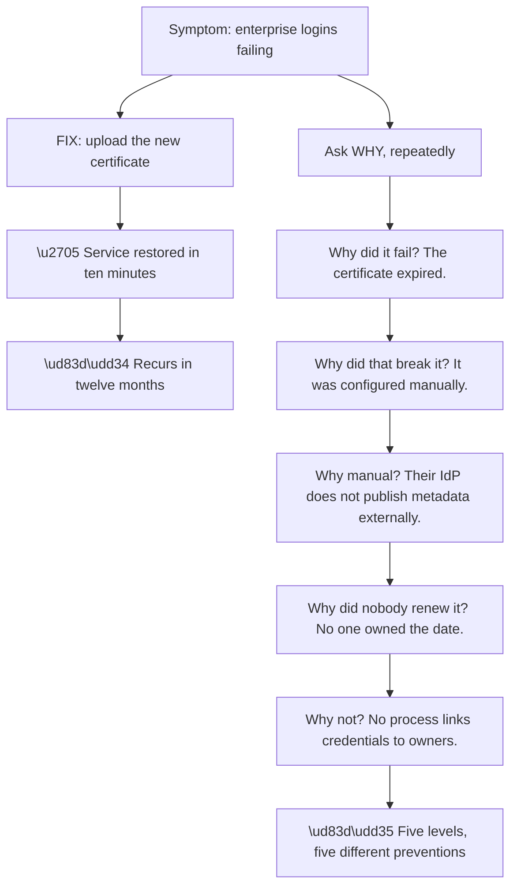
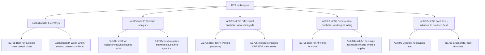
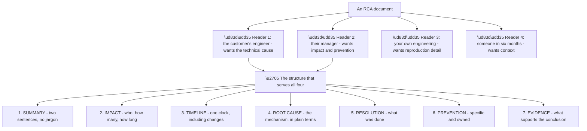
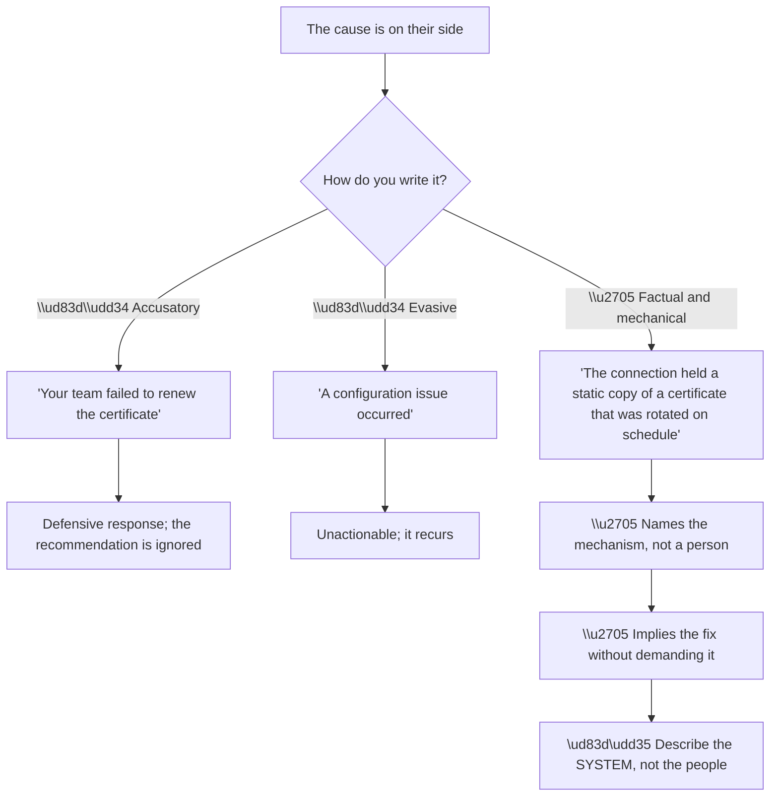
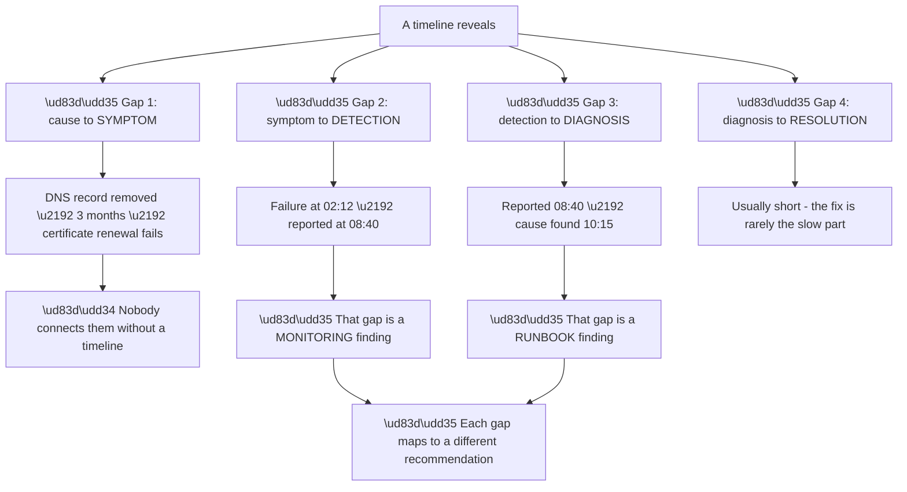
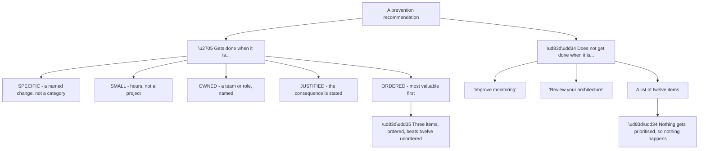
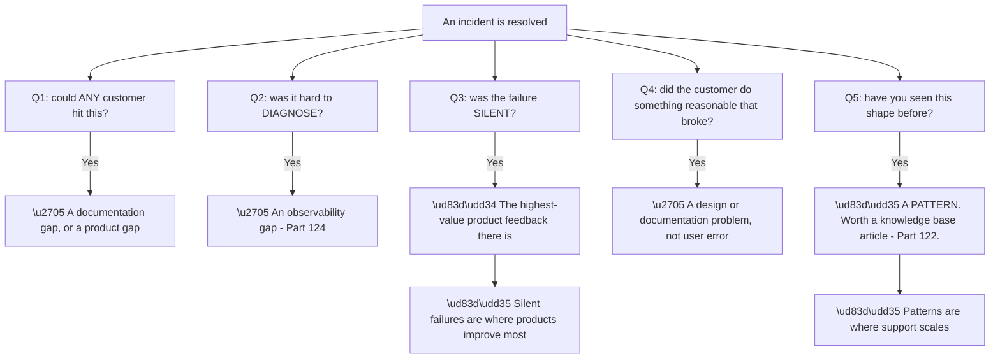
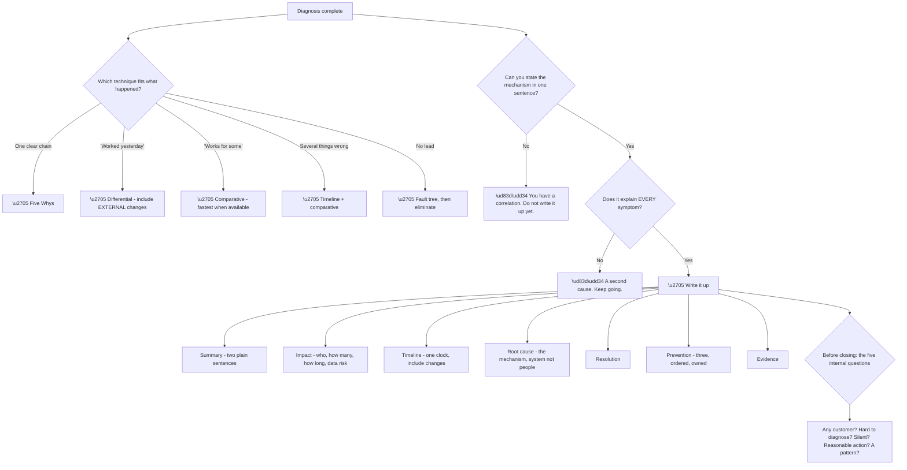

# Part 115 - Root Cause Analysis Techniques and Write-Ups

> Section goal: Turn a diagnosis into a written analysis that survives scrutiny, tells the customer what to do, and prevents the same problem recurring — for them and for everyone else.

Covers index item **115**. Maps to JD signals: *root cause analysis*, *troubleshooting complex technical issues*, *customer-facing communication*, *technical writing*, *cross-functional collaboration*, *proactivity*.

---

## 1. Start From Zero: What a Root Cause Actually Is

A fix stops the symptom. **A root cause explains why the symptom was possible**, and the distinction determines whether the problem returns.

**Node R restates Part 111's chain**, and the practical point is that **there is no single "the" root cause** — there is a chain, and each level supports a different scope of prevention.

**The judgement is where to stop**, and it is a judgement about proportion:

| Stop at | Prevents | Proportionate when |
|---|---|---|
| The fix | Nothing | Never, as a final answer |
| "Certificate expired" | Nothing | Never — it is the symptom restated |
| "Manually configured" | This connection recurring | Almost always worth stating |
| "Nobody owned the date" | **All their credential expiries** | Usually the right stopping point |
| "No process" | Future credentials too | After a repeat, or on request |

**Row four is usually correct for a support write-up:** **broad enough to be genuinely valuable, cheap enough that the customer will act on it.** Recommending a process overhaul for one certificate is disproportionate and gets ignored.

**Row two is worth calling out as a trap.** *"The certificate expired"* feels like a root cause and is a restatement of the symptom. **Certificates expiring is normal and expected**; the cause is why the expiry was not handled.

> 💡 **Tie-in to your background:** RCA is explicitly on your CV, and CRITSIT work demands it. **The techniques here are ones you already use** — what this Part adds is the identity-specific chains and a written format.

### 🔍 Plain-English deep-dive: the techniques, and when each one fits

Several RCA techniques exist. **They are not interchangeable**, and picking the wrong one produces a shallow analysis.

**Node T4b deserves the emphasis** because it is under-used relative to its power. **When a working case exists alongside a failing one, comparison beats analysis** — the candidate differences are few, and one of them is the cause (Part 112).

**Node T3b is the extension people miss.** *"What changed?"* usually gets scoped to the customer's own systems, and **the answer is frequently outside them**: an upstream provider's API, a certificate rollover at a partner, a browser update, a policy change at an identity provider. **Part 103's dependency change was exactly this.**

| Situation | Technique |
|---|---|
| Single clear chain | Five Whys |
| "What caused what?" | Timeline |
| "It worked yesterday" | Differential — **including external changes** |
| "It works for some" | **Comparative** |
| No lead at all | Fault tree |
| Several things wrong | **Timeline plus comparative** |

**The last row matters** because multi-cause incidents defeat Five Whys — **the technique assumes a chain, and two independent causes are not a chain.** Part 089's DNS-plus-SPN example needed a timeline to separate them.

**And there is a discipline that applies to all five:** **confirm the mechanism, not just the correlation** (Part 111). *"Both happened on Tuesday"* is a lead; *"the rollover completed at 09:12 and the first failure was at 09:14"* is a mechanism.

**Analogy:** different diagnostic instruments for different presentations. A chain of symptoms suits one approach, a comparison between two similar patients suits another, and an unexplained presentation with no lead suits systematically enumerating possibilities. **Where it stops:** the instrument narrows; it does not confirm, which is why the mechanism still has to be demonstrated.

---

## 2. The Write-Up Structure

A root cause analysis has to serve several readers at once, and **structure is what makes that possible.**

**Node S1 is the hardest section and the most important.** A summary that a non-specialist can read and understand is what gets the document read at all. **If it needs jargon, it is not a summary.**

**A worked example of each section:**

| Section | Example |
|---|---|
| **Summary** | *"Enterprise sign-in failed for one customer for three hours because their identity provider's signing certificate was replaced on schedule and our connection held a manually-uploaded copy of the old one."* |
| **Impact** | *"Approximately 200 users at one organisation, 02:12–05:20 UTC. No other customers affected. No data was at risk."* |
| **Timeline** | Table, UTC, including the rollover and the first failure |
| **Root cause** | *"The connection was configured with a static certificate rather than the provider's metadata URL, so a routine rotation was not picked up."* |
| **Resolution** | *"The current certificate was uploaded at 05:18 and service resumed at 05:20."* |
| **Prevention** | *"Reconfigure the connection to use the metadata URL. Separately, we recommend an inventory of every certificate, secret, and token with an owner and expiry date."* |
| **Evidence** | Log entries, metadata showing both certificates, timestamps |

**Section two — impact — is what determines how the document is received.** *"No data was at risk"* is a sentence a manager reads first, **and omitting it invites the question.**

**Section six must be specific and owned.** *"Improve monitoring"* is not a prevention; **"add an alert when successful logins drop to zero, owned by the platform team"** is.

---

## 3. Writing About Causes on the Customer's Side

Most identity root causes are the customer's — their certificate, their code, their policy, their group restructure. **How that is written determines whether it is acted on or disputed.**

**Node R is the principle.** *"The connection held a static copy"* and *"your team forgot"* describe the same event. **The first is a property of the configuration; the second is a property of a person** — and only the first leads anywhere useful.

| Instead of | Write |
|---|---|
| "Your team didn't renew it" | "The connection held a static certificate" |
| "The developer made a mistake" | "The code assumed the field was always present" |
| "You should have monitored this" | "The failure produced no alert, so it was detected by users" |
| "This is working as designed" | "This is expected behaviour; here is what would change it" |
| "Not our issue" | "The cause is upstream — here is the specific evidence to give them" |

**Every replacement is more useful as well as more diplomatic**, which is the point: **the diplomatic version is also the more actionable one**, because it names something changeable.

**Where the cause is genuinely on your side**, the same principle applies in reverse: **state it plainly and early.** Burying a platform-side cause in section four of a long document reads as evasion, whichever way it was intended.

### 🔍 Plain-English deep-dive: the timeline that shows a gap

Timelines are the most under-used RCA artefact, and their particular strength is **making gaps visible** — the distance between a cause and its symptom.

**Node R is why a timeline is worth building even when the cause is already known.** The four gaps **map directly onto the prevention, detection, and response layers** from §4 — and measuring them turns vague recommendations into evidenced ones.

| Gap | What it measures | Recommendation it justifies |
|---|---|---|
| Cause → symptom | Latency of the failure | Prevention |
| **Symptom → detection** | **How long nobody knew** | **Monitoring** |
| **Detection → diagnosis** | **How long to understand it** | **Runbook** |
| Diagnosis → resolution | How long to fix | Usually already short |

**Rows two and three are where the time actually goes**, and quantifying them is far more persuasive than asserting that monitoring would help. **"Six hours passed before anyone knew, and ninety-five minutes before the cause was identified; the fix took eight minutes"** makes the case by itself.

**Gap one is the one that defeats investigation** when it is long. Part 097's removed DNS record broke a certificate renewal **three months later**, so "what changed yesterday" found nothing. **A timeline extending back over the full renewal period is what surfaces it.**

**The practical rule that follows:** **set the timeline's start based on the mechanism, not on the report.** For certificates, that means the whole validity period. For provisioning, the last successful sync. For a dependency, whenever its provider last announced a change.

**Analogy:** an incident chart with times marked. The clinical detail matters, and so does how long each stage took — because a delay between onset and recognition is a different problem from a delay between recognition and treatment, and they have different remedies. **Where it stops:** a chart records what was noticed, so an unnoticed onset leaves a gap you have to reconstruct.

---

## 4. Prevention That Actually Gets Done

Most preventions in RCA documents are never implemented. **The ones that are share properties worth copying.**

**Node R is the practical rule.** **Three ordered recommendations get one or two done; twelve get none.** If more exist, name the top three and offer the rest separately.

**The three-layer structure from Part 110 works well** and is easy to write:

| Layer | Question |
|---|---|
| **Prevention** | What stops it happening? |
| **Detection** | What tells you sooner? |
| **Response** | What makes the fix faster? |

**An incident usually reflects a gap in all three**, and separating them makes the recommendations obviously non-overlapping rather than a list of similar-sounding items.

**And it lets the customer choose by cost.** Prevention may be a configuration change; detection may be an alert; response may be a runbook entry. **Different teams, different effort, and any one of them reduces the next occurrence.**

### 🔍 Plain-English deep-dive: from one customer's incident to everyone's improvement

The highest-value RCA output is not the customer document. **It is what the incident tells you about the product and the documentation.**

**Node A3 is worth arguing for internally.** A failure that produces **no error, no alert, and no log entry** is the worst kind, because it is discovered late and by the customer. **SCIM quarantine, sync filtering, log stream delivery, and unnamespaced claims are all in this category** — and each is a legitimate product feedback item, not merely a support annoyance.

**Node A4 is the reframing that matters most.** When a customer did something entirely reasonable and it broke, **calling it user error is both inaccurate and unhelpful.** Part 106's developer who put a Management API secret in front-end code followed a logical path where every step made sense; **the gap was that nothing warned them.**

| Question | Output | Where it goes |
|---|---|---|
| Any customer could hit it | Documentation or product | Part 124 |
| Hard to diagnose | Observability feedback | Part 124 |
| **Silent failure** | **Product feedback** | Part 124 |
| Reasonable action broke | Design feedback | Part 124 |
| **A recognised pattern** | **Knowledge base article** | Part 122 |

**Node A5 is where support scales.** A pattern seen three times **will be seen thirty more**, and turning it into an article converts thirty investigations into thirty lookups — **and possibly into zero, if it becomes a documentation fix.**

**The discipline that makes this happen** is asking the five questions **before closing**, while the detail is fresh. **After the ticket is closed, the context evaporates**, and a note written a week later is markedly less useful.

**Analogy:** a repair engineer who fixes the machine and also files a note that this model's belt fails at eighteen months. The individual repair helps one customer; the note changes the maintenance schedule for all of them. **Where it stops:** the note only helps if it reaches whoever sets the schedule, which is why the routing matters as much as the observation.**

---

## 5. Failure Modes

| # | Failure mode | Symptom | Fix |
|---|---|---|---|
| 1 | Symptom stated as cause | "The certificate expired" | Ask why the expiry was not handled |
| 2 | Stopping at the fix | It recurs | Always state a cause and a prevention |
| 3 | Five Whys on a multi-cause incident | An incomplete story | Use a timeline |
| 4 | Correlation as mechanism | Wrong cause | Demonstrate the mechanism |
| 5 | Ignoring external changes | "Nothing changed" accepted | Include upstream dependencies |
| 6 | No working comparison used | Slow analysis | Compare when one exists |
| 7 | Jargon in the summary | Nobody reads it | Two plain sentences |
| 8 | Impact section missing | Manager asks anyway | Always include scope and data risk |
| 9 | Accusatory language | Defensiveness; ignored | Describe the system |
| 10 | Vague prevention | Never implemented | Specific, small, owned |
| 11 | Twelve recommendations | Nothing prioritised | Three, ordered |
| 12 | No detection or response layer | Only prevention considered | Use all three layers |
| 13 | No internal feedback | The product does not improve | Ask the five questions |
| 14 | Written after the context faded | Weak and vague | Capture before closing |

---

## 6. Troubleshooting Decision Tree: Choosing and Writing the RCA

### Worked example

An incident is resolved: a customer's users could not sign in for ninety minutes because an Action calling an external enrichment API threw an unhandled exception when the API returned an unexpected `null`.

**Technique selection.** *"It worked yesterday"* suggests differential — **and the change was outside their estate**, which is exactly node B2's extension. **A timeline confirms the sequence.**

**The mechanism, in one sentence:** *"The enrichment provider began returning `null` for a field that was previously either present or absent, and the Action read that field without a guard, so the exception propagated and blocked the login."*

**Does it explain every symptom?** It explains the timing and the totality. **But not why it affected only about 5% of logins** — and that unexplained detail is the interesting one (Part 111).

**Following it.** The provider returns `null` **only for certain input conditions** — specific geographies. **So it is not intermittent; it is a population.** That completes the explanation.

**The write-up:**

**Summary** — two sentences, no jargon: *"Sign-in failed for around 5% of users for ninety minutes. A third-party service the customer's login code calls changed the shape of its response, and the code was not written to handle the new form."*

**Impact** — approximately 5% of sign-in attempts, ninety minutes, one customer, no data at risk.

**Timeline** — one clock, including the provider's change and the first failure.

**Root cause** — described as a system property: *"the Action read a field from an external response without guarding against a null value, and the failure path had no error handling, so a dependency change became a login outage."* **No person named.**

**Prevention, three items, ordered:**

1. **Guard the field access and wrap the external call**, deciding fail-open or fail-closed deliberately. *(Prevention — hours of work.)*
2. **Log the external call's outcome**, so the next dependency change is visible in minutes rather than after ninety. *(Detection.)*
3. **Add the Action to version control** with review, so login-path changes are tracked. *(Response and prevention — a process change.)*

**And the five internal questions.** Could any customer hit this? **Yes** — any Action calling an external API without error handling. **Was it hard to diagnose?** Yes, because the Action logged nothing about the call. **Was the failure silent?** Partially — logins failed loudly, but the *cause* was invisible.

**So the internal outputs are:** a knowledge base article on defensive Action patterns, and product feedback that **Action external-call failures could surface more clearly.**

**What made this a good RCA:** pursuing the unexplained 5% rather than accepting a story that mostly fit. **The nearly-complete explanation was wrong in an important way** — it implied intermittency where there was a population, which would have led to different and less effective recommendations.

---

## 7. Lab: Write Three Root Cause Analyses

**Purpose.** Practise the technique selection, the structure, and the language — and test whether your write-ups are actually readable.

**Prerequisites.**
- Parts 111–114 completed
- No systems required

**Steps.**

1. **Pick three incidents from this guide** with different shapes: one single-chain (certificate expiry), one multi-cause (Part 089's DNS plus SPN), and one population-based (Part 099's unindexed query).
2. **For each, name the technique** you would use and why.
3. **Write the mechanism in one sentence** for each. **If you cannot, that is the finding.**
4. **Check each explains every symptom.** Note any it does not.
5. **Write a full seven-section RCA** for one of them.
6. **Test the summary:** give it to someone non-technical and ask what happened. **If they cannot say, rewrite it.**
7. **Rewrite three accusatory sentences** into system-describing ones, using §3's table.
8. **Write three ordered preventions** for each incident, using the prevention/detection/response layers.
9. **Check each prevention** against §4: specific, small, owned, justified.
10. **Answer the five internal questions** for each incident and write the resulting internal output.
11. **Build your RCA template** — the seven sections with prompts, as something you would actually use.

**Expected evidence.**
- Three incidents with technique choices and one-sentence mechanisms
- One complete seven-section RCA
- A summary tested on a non-technical reader
- Three rewritten sentences
- Nine preventions, layered and ordered
- Five internal-question answers per incident
- Your reusable RCA template

**Validation rubric.**

| Criterion | Pass |
|---|---|
| Technique fit | You can justify each choice |
| Mechanism | One sentence, no hedging |
| Completeness | Every symptom explained, or the gap named |
| Summary | A non-technical reader understands it |
| Language | System-describing, not person-blaming |
| Prevention | Specific, small, owned, three items |
| Layers | Prevention, detection, and response all present |
| Internal output | You produce something beyond the customer document |

**Cleanup and privacy.** No systems are touched. **Use only incidents from this guide or synthetic ones** — do not write up a real employer or customer incident, even anonymised, and do not retain any real case detail in these artefacts.

---

## 8. JD Mapping

| JD signal | How this Part addresses it |
|---|---|
| Root cause analysis | Techniques, chains, and mechanism confirmation |
| Troubleshooting complex technical issues | Turning a diagnosis into an explanation |
| Customer-facing communication | Structure, language, and readability |
| Technical writing | The seven-section format |
| Cross-functional collaboration | Internal feedback routing |
| Proactivity | Pattern recognition into documentation |

---

## 9. Candidate Honesty Note

- **Production experience:** RCA is explicitly part of my role — I write these for business-critical escalations and CRITSITs.
- **Production experience:** communicating causes that sit on the customer's side without damaging the relationship.
- **Lab experience:** practising technique selection and the seven-section structure against this guide's incidents, as above.
- **Learned architecture:** the identity-specific causal chains and the five internal questions.
- **No direct experience:** writing RCAs for this product's customers.
- **How to say it:** *"RCA is core to what I do now. What I've worked on for this domain is the specific causal chains — because the technique is the same, but knowing that 'the certificate expired' is a restatement of the symptom rather than a cause is domain knowledge. I've also made a habit of the internal questions: could any customer hit this, was it silent, is it a pattern."*

---

## 10. Official Source Anchors

| Source | Why | Accessed |
|---|---|---|
| Auth0 Docs — Tenant logs and event codes | The evidence base for identity RCAs | Accessed **26 August 2026** |
| Microsoft Learn — Sign-in logs | Upstream evidence | Accessed **26 August 2026** |
| Google SRE Book — Postmortem Culture | Blameless postmortem principles | Accessed **26 August 2026** |
| NIST SP 800-61 — Computer Security Incident Handling Guide | Structure for incidents with a security dimension | Accessed **26 August 2026** |
| Okta Developer Forum — `devforum.okta.com` | Recurring patterns worth documenting | Accessed **26 August 2026** |

> **Revalidate:** the techniques are stable. Re-check where the evidence lives before interview, not how to structure the analysis.

---

## ⭐ Likely Interview Questions for This Section

### Q1. "What's the difference between a fix and a root cause?"

> *Model answer:* A fix stops the symptom; a root cause explains why the symptom was possible. If a certificate expired and I upload a new one, service is restored and it recurs in twelve months. Asking why repeatedly produces a chain: it expired, it was manually configured rather than following metadata, their provider does not publish metadata externally, nobody owned the expiry date, and there is no process linking credentials to owners. Each level supports a different scope of prevention, so there is no single root cause — there is a chain and a judgement about where to stop. For a support write-up I usually stop at "nobody owned the date," because that is broad enough to be valuable and cheap enough that the customer will actually do it.

### Q2. "Which RCA technique do you use?"

> *Model answer:* It depends on the shape of what happened, and picking wrongly produces a shallow analysis. Five Whys works for a single clear causal chain and fails when several causes combined, because it assumes a chain. A timeline is best for establishing what caused what, and it reveals gaps — a cause and a symptom separated by three months is only visible on a timeline. Differential analysis suits "it worked yesterday," and the extension people miss is including changes outside the customer's own estate, since a provider changing an API is a change they did not make. Comparative analysis — working case against failing case — is the fastest technique whenever a working case exists. And a fault tree suits having no lead at all: enumerate what could produce this, then eliminate.

### Q3. "How do you write up a cause that's on the customer's side?"

> *Model answer:* By describing the system rather than the people. "The connection held a static copy of a certificate that was rotated on schedule" and "your team forgot to renew the certificate" describe the same event, but the first is a property of the configuration and the second is a property of a person. Only the first leads anywhere useful, and the accusatory version reliably produces defensiveness and gets the recommendation ignored. The same applies to code — "the code assumed the field was always present" rather than "the developer made a mistake." What I find is that the diplomatic phrasing is also the more actionable one, because it names something changeable. And where the cause is on our side, the same principle in reverse: state it plainly and early, because burying it reads as evasion.

### Q4. "What makes a prevention recommendation actually get implemented?"

> *Model answer:* Being specific, small, owned, justified, and ordered. "Improve monitoring" is not a prevention; "add an alert when successful logins drop to zero, owned by the platform team" is. Small matters because a recommendation that reads as a project gets deferred indefinitely. And ordering matters more than completeness — three ordered recommendations get one or two done, twelve unordered get none, because nothing is prioritised. I structure them in three layers: prevention, which stops it happening; detection, which tells you sooner; and response, which makes the fix faster. An incident usually reflects a gap in all three, and separating them means the recommendations are obviously non-overlapping and the customer can pick by cost.

### Q5. "You've written an analysis that explains most of the symptoms. Is that good enough?"

> *Model answer:* No, and the unexplained part is usually the interesting one. I had exactly this in a case where an Action failed because a third-party API started returning null for a field — that explained the timing and the totality, but not why only about five percent of logins were affected. Following that showed the provider returned null only for certain geographies, so it was not intermittent, it was a population. That mattered, because "intermittent" and "a specific population" lead to different recommendations. So my rule is that if the explanation does not account for every symptom, I keep going, and I would not write it up until it does — because a nearly-complete explanation can be wrong in a way that changes the advice.

### Q6. "What structure do you use for an RCA document?"

> *Model answer:* Seven sections, because the document has several readers at once. Summary — two sentences, no jargon, because if it needs jargon it is not a summary and nobody past the first reader will get through it. Impact — who, how many, how long, and explicitly whether data was at risk, because that is the sentence a manager reads first and omitting it invites the question. Timeline, on one clock, including what changed and not only what failed. Root cause, stated as a mechanism in plain terms and describing the system rather than people. Resolution. Prevention, three items, ordered and owned. And evidence, so the conclusion is checkable rather than asserted.

### Q7. "What do you do with an RCA beyond sending it to the customer?"

> *Model answer:* Ask five internal questions before closing, while the detail is fresh. Could any customer hit this — if so it is a documentation or product gap. Was it hard to diagnose — that is observability feedback. Was the failure silent — that is the highest-value product feedback there is, because silent failures are found late and by customers. Did the customer do something entirely reasonable that broke — that is a design problem, not user error. And have I seen this shape before — if so it is a pattern worth a knowledge base article, which turns thirty future investigations into thirty lookups. The timing matters: after the ticket closes the context evaporates, and a note written a week later is markedly weaker.

### Q8. "Give an example of a root cause that wasn't where the error pointed."

> *Model answer:* A customer had about a third of their users failing enterprise sign-in with a clear error saying the user was not assigned to the application. The obvious action was to assign them. But "about a third" was the more interesting clue — assignment is per user or per group, so a partial population meant a group boundary. It turned out a licensing project two weeks earlier had restructured groups and removed one nested group from the group the application was assigned to. Everyone whose assignment came through that nesting lost access silently. The useful finding was not the fix but that assignment via nested groups is fragile because it is invisible — the impact does not appear anywhere near the group being edited, so nobody making that change could have predicted it.

---

## 🧠 30-Second Memory Hooks

- **A fix stops the symptom. A cause explains why it was possible.**
- **"The certificate expired" is the symptom restated.** Ask why it was not handled.
- **There is no single root cause — there is a chain.** Choose where to stop by proportion.
- **Techniques: Five Whys · timeline · differential · comparative · fault tree.**
- **Comparative is fastest when a working case exists.**
- **"What changed?" includes changes outside their estate.**
- **Five Whys fails on multi-cause incidents.** Use a timeline.
- **Confirm the mechanism, not the correlation.**
- **Seven sections: summary · impact · timeline · cause · resolution · prevention · evidence.**
- **Summary in two plain sentences, or nobody reads it.**
- **Impact must state whether data was at risk.**
- **Describe the system, not the people.**
- **Three ordered preventions beat twelve.**
- **Layers: prevention · detection · response.**
- **Five internal questions before closing.** Silent failures are the best product feedback.

---

## ✅ Completion Checklist

- [ ] I can distinguish a fix, a symptom restated, and a cause
- [ ] I can choose an RCA technique by the shape of the incident
- [ ] I confirm mechanisms rather than correlations
- [ ] I keep going until every symptom is explained
- [ ] I can write a summary a non-technical reader understands
- [ ] I always include impact and data risk
- [ ] I describe systems rather than people
- [ ] My preventions are specific, small, owned, and ordered
- [ ] I use the prevention/detection/response layers
- [ ] I ask the five internal questions before closing
- [ ] I have written a full RCA and tested its summary

*Next suggested section:* **[Part 116 - Reproduction Strategy and Sandbox Design](Part-116-reproduction-strategy-and-sandbox-design.md)** — how to reproduce a problem safely and minimally, which is what turns a plausible diagnosis into a proven one.
