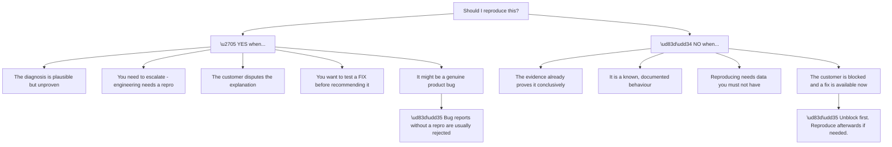
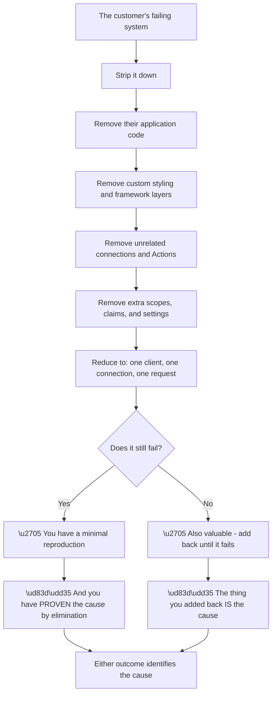
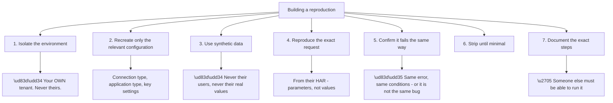
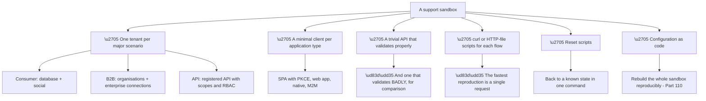
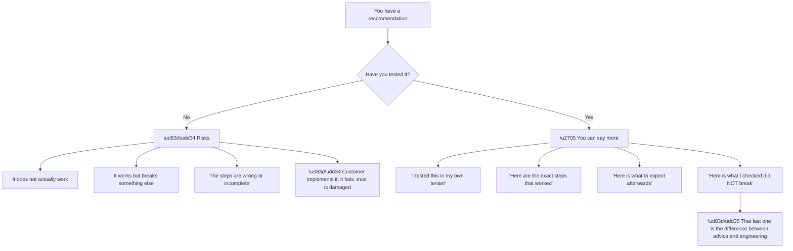
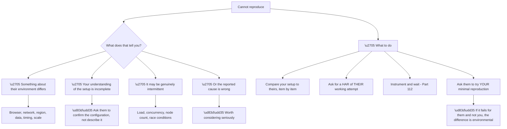
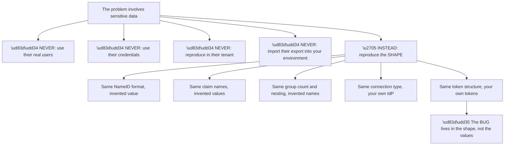
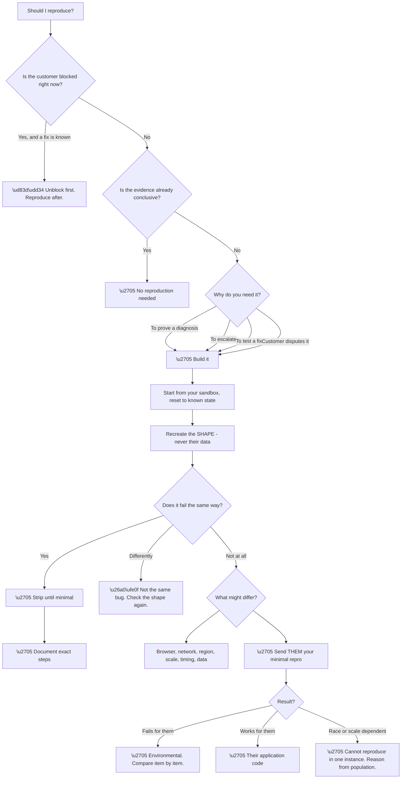

# Part 116 - Reproduction Strategy and Sandbox Design

> Section goal: Learn to reproduce a problem safely, minimally, and quickly — because a reproduction is what turns a plausible diagnosis into a proven one, and what an engineering team actually needs.

Covers index item **116**. Maps to JD signals: *troubleshooting complex technical issues*, *root cause analysis*, *debugging tools*, *cross-functional collaboration*, *security*, *developer support*.

---

## 1. Start From Zero: Why Reproduce At All

A reproduction is not always necessary. **Knowing when it is — and when it is a waste of time — is the first skill.**

**Node N4a is the prioritisation point.** A customer in a production outage needs to be unblocked; **reproducing while they wait is the wrong order.** Fix, then reproduce if the cause is still uncertain or if it needs escalating.

**Node R is why reproduction matters for escalation** (Part 117): **an engineering team cannot act on a description.** A reproduction turns "customers report X" into something a developer can run, and it is usually the difference between a bug being investigated and being closed as insufficient information.

**Node Y4 is under-used.** Testing a recommendation before giving it **prevents recommending something that does not work** — which is both embarrassing and costly in trust.

> 💡 **Tie-in to your background:** escalation work depends on this. **Producing a reproduction is how you get engineering to act**, and it is a skill you have already exercised, just against different systems.

### 🔍 Plain-English deep-dive: minimal reproduction, and why smaller is better

The goal is not to recreate the customer's system. **It is to find the smallest thing that still fails.**

**Node R is the property that makes this efficient.** **Both outcomes are informative.** If the stripped-down version still fails, the cause is in what remains. If it stops failing, the cause is in what was removed — **and adding components back one at a time finds it precisely.**

**That is bisection**, and it is the fastest general debugging technique there is: **each step halves the remaining space** regardless of how large it started.

| Reproduction size | Value |
|---|---|
| The customer's whole system | ❌ Cannot isolate anything |
| Their app with logging added | ⚠️ Better, still noisy |
| A Quickstart plus their configuration | ✅ Good |
| **A single request with curl** | ✅✅ **Best — nothing left to blame** |

**The bottom row is the ideal.** A reproduction that is one HTTP request **has no framework, no application code, and no ambiguity** — if it fails, the cause is unambiguously in the request or the platform.

**And it connects to Part 096's ticket shape:** *"the Quickstart worked, then I changed X."* **That customer has already done the bisection for you** — they have a known-good baseline and a single delta, which is the ideal debugging position. **Eliciting that framing deliberately** when it is not offered is one of the highest-value questions in developer support.

**Analogy:** finding a fault in a string of lights by unplugging half and seeing whether the problem persists. Each test halves the search regardless of how many bulbs there are. **Where it stops:** lights are independent; software components interact, so occasionally removing something changes behaviour for reasons unrelated to the fault.

---

## 2. Building the Reproduction

**Node S1a is a hard rule.** **Never reproduce in a customer's tenant.** It changes their configuration, generates events in their logs, may affect their real users, and confuses subsequent investigation. **Even read-only exploration should be minimal and disclosed.**

**Node S3a is the second hard rule.** Reproducing with a customer's actual user data **imports their personal data into your environment**, which is a data handling failure regardless of intent (Part 112). **Synthetic data with the same shape** is what you need — the same NameID format, the same claim names, the same group count, with invented values.

**Node S5a is the check people skip.** A reproduction that fails **differently** is not a reproduction of their problem. **Matching the exact error and conditions** is what makes it evidence rather than a coincidence.

**What to recreate versus what to invent:**

| Recreate faithfully | Invent |
|---|---|
| Connection type and protocol | Names, domains, emails |
| Application type and grant | Client IDs and secrets |
| Claim **names** and formats | Claim **values** |
| Scope and audience structure | Actual audience URIs |
| Group counts and nesting depth | Group names |
| Timing and sequence | — |
| Browser and version | — |

**The "shape not values" principle** runs through the whole table: **a NameID that is transient reproduces the bug; the customer's actual NameID value is irrelevant and must not be used.**

---

## 3. Sandbox Design

A reusable sandbox makes reproduction fast. **Building one once pays back on every subsequent ticket.**

**Node C3a is a genuinely useful addition** that people do not think of: **a deliberately weak validator** lets you demonstrate what a customer's API is doing wrong. **Showing that an ID token is accepted where it should be rejected** is far more persuasive than describing it.

**Node C5a matters more than it looks.** A sandbox that accumulates state from previous reproductions **produces confusing results** — a leftover Action, an enabled connection, a modified setting. **Resetting to a known state before each reproduction** removes an entire category of self-inflicted confusion.

**Node C6a is what makes the sandbox durable.** A hand-built sandbox degrades and eventually gets abandoned. **One defined as code can be rebuilt in minutes**, shared with colleagues, and versioned as the product changes.

| Sandbox property | Why |
|---|---|
| Separate from personal experimentation | Known state |
| Fictional data throughout | Safe, always |
| Scripted flows | Seconds to reproduce |
| Reset capability | No leftover state |
| Defined as code | Rebuildable and shareable |
| Documented | Usable by colleagues |

### 🔍 Plain-English deep-dive: reproducing a fix, not just a bug

Reproduction is usually discussed as proving a problem. **Its other use — proving a solution — is at least as valuable and far less practised.**

**Node V is the property worth aiming for.** Anyone can suggest a change; **saying what you verified was unaffected** is what makes a recommendation trustworthy — and it is exactly what a customer under pressure needs before touching production.

| Recommendation quality | What it sounds like |
|---|---|
| Untested | "You could try switching to a metadata URL" |
| Tested | "I switched a connection to metadata in my tenant and confirmed logins still work" |
| **Tested with side effects checked** | "…and confirmed existing sessions were unaffected and the claim mapping still applies" |

**The third row is what prevents the follow-up ticket**, because the most common outcome of an untested recommendation is not that it fails outright — it is that it works and **something adjacent stops working**, which the customer then reports as a new problem caused by your advice.

**Two recommendations in this guide particularly warrant testing before giving:**

**Switching a connection's configuration** — does it invalidate sessions, does claim mapping survive, do existing users still resolve? **Testing takes ten minutes and the customer is changing production.**

**Changing a session or token lifetime** — the effect is delayed and population-wide, so a mistake surfaces hours later across every user (Part 097's blast-radius reasoning).

**And there is a phrasing that carries the testing without sounding boastful:** *"I ran this in a test tenant first — the steps below worked and existing sessions were unaffected."* **One sentence, and it changes how the recommendation is received.**

**Analogy:** a mechanic who tries the repair on a bench unit before doing it on your car, and tells you what else they checked while they were in there. **Where it stops:** a bench unit is not your car, so the test reduces risk rather than eliminating it — which is worth saying too.

---

## 4. When You Cannot Reproduce

Failing to reproduce is common and is **not a failure** — it is a finding, and often a valuable one.

**Node A4a is the strongest move available** when reproduction fails, and it is under-used. **Sending the customer your minimal reproduction and asking them to run it** produces a decisive result either way:

| Result | Meaning |
|---|---|
| Fails for them, works for you | **Environmental** — browser, network, region, tenant setting |
| Works for them too | **Their application** — the difference is in their code |
| Fails for both | ✅ You have a shared reproduction |

**All three outcomes advance the investigation**, and the second is particularly valuable because it **narrows to their code without any accusation** — the minimal case works, so the difference is in what they added.

**Node W4a deserves genuine consideration** rather than being dismissed. **If a hypothesis cannot be reproduced under matched conditions, it may simply be wrong** — and returning to the narrowing questions (Part 111) is more productive than trying harder to reproduce something that does not happen.

**Node W3a covers the genuinely hard case.** Race conditions, load-dependent timeouts, and node-count-dependent state loss **do not reproduce in a single-instance sandbox by construction** (Part 113). **Recognising that class early** saves hours of futile attempts — and the fix is to reason from the population shape instead.

### 🔍 Plain-English deep-dive: reproducing safely when the data is sensitive

Many identity problems involve real users, real organisations, and real credentials. **Reproducing them safely is a discipline, not an inconvenience.**

**Node R is the insight that makes safe reproduction possible.** Almost every bug in this guide **depends on structure rather than content**: a transient NameID format, an unnamespaced claim name, a group count above a threshold, a missing audience parameter. **None requires the customer's actual data.**

| Bug | Depends on | Needs their data? |
|---|---|---|
| Transient NameID duplicates | The **format** | ❌ |
| Group overage | The **count** | ❌ |
| Unnamespaced claim dropped | The **name** | ❌ |
| Opaque token | The **absent parameter** | ❌ |
| Cross-tenant exposure | The **query structure** | ❌ |
| PKCE verifier lost | The **storage pattern** | ❌ |

**Six for six**, which is a strong argument that requesting production data for reproduction is almost never necessary — **and where it feels necessary, that is usually a sign the shape has not been fully identified yet.**

**The exception worth naming:** data-dependent bugs where a specific value triggers behaviour — an unusual character in an email address, an exceptionally long field. **Even then, ask for the *characteristic*, not the value:** *"does it contain a plus sign, an apostrophe, or non-Latin characters?"* rather than *"send me the address."*

**And there is a professional benefit to this discipline** beyond compliance: **a reproduction built from shape is inherently shareable.** It can go into a bug report, a knowledge base article, or a colleague's hands without any data handling concerns at all (Parts 117, 122).

**Analogy:** an engineer reproducing a structural failure with a test rig rather than the actual bridge. The rig has none of the original's specifics and reproduces the failure precisely, because the failure was a property of the geometry. **Where it stops:** if the failure depended on a specific material flaw, the rig will not show it — which is when you need the characteristic, not a replica.

---

## 5. Failure Modes

| # | Failure mode | Symptom | Fix |
|---|---|---|---|
| 1 | Reproducing while the customer is blocked | Delayed resolution | Unblock first |
| 2 | Reproducing in their tenant | Changed configuration, polluted logs | Your own tenant, always |
| 3 | Using their real data | **Data handling failure** | Reproduce the shape |
| 4 | Reproduction too large | Cannot isolate | Strip until minimal |
| 5 | Fails differently | Not the same bug | Match the exact error |
| 6 | Undocumented steps | Nobody else can run it | Write exact steps |
| 7 | Sandbox with leftover state | Confusing results | Reset before each use |
| 8 | Trying to reproduce a race condition | Hours wasted | Recognise the class; reason from population |
| 9 | Not sending the repro to the customer | Missed decisive test | Ask them to run yours |
| 10 | Treating non-reproduction as failure | Investigation stalls | It is a finding |
| 11 | Not testing the recommended fix | Recommending something that fails | Test before recommending |
| 12 | Sandbox not maintained | Degrades, gets abandoned | Define it as code |

---

## 6. Troubleshooting Decision Tree: Reproduction Strategy

### Worked example

A customer reports that SAML logins occasionally create duplicate users. **Their diagnosis: "a bug in your SAML handling."**

**Should we reproduce?** Yes — **the diagnosis is disputed, and if it is a product bug it needs escalating with a reproduction** (Part 117).

**Building it.** Their configuration shape: a SAML enterprise connection, persistent NameID format, specific claim names. **Recreating that in the sandbox against a test IdP, with invented values throughout.**

**Result: no duplicates.** Twenty logins, one user.

**Non-reproduction is a finding.** Something differs.

**Comparing item by item.** The one difference is that **their IdP is configured to send the NameID in a different format than they described** — they said persistent; the actual assertion says unspecified with a value that varies.

**Confirming from evidence rather than description** (Part 111's fifth question): their raw assertion, decoded, shows the value differing between logins.

**Reproducing again with that shape** — unspecified format, varying value — **produces duplicates immediately.** Three logins, three users.

**So the bug is real and it is not in the product.** The platform correctly treats a different NameID as a different user; **their IdP is not sending a stable one.**

**The reproduction is what makes this defensible.** Without it, this is one party's word against another's. **With it, there is a demonstration**: same configuration, stable NameID, one user; same configuration, varying NameID, three users.

**And the reproduction is shareable**, because it contains no customer data — **it can go straight into the response, and into a knowledge base article** on NameID stability (Part 122).

**What made it work:** treating the initial non-reproduction as informative rather than as a failure, **and confirming the configuration from the raw assertion rather than from the customer's description.** They believed they had configured persistent NameID; the evidence said otherwise, and they were not being careless — the IdP's setting did not do what its label suggested.

---

## 7. Lab: Build Your Sandbox and Practise Reproduction

**Purpose.** Build a reusable sandbox and practise the full reproduction cycle, including the case where reproduction fails.

**Prerequisites.**
- The free tenants from Groups I and J
- A local client, a local API, and a shell with `curl`
- **Never** reproduce anything in an employer or customer tenant

**Steps.**

1. **Build a sandbox tenant** with: a database connection, a social connection, one SAML enterprise connection to your Entra tenant, one API with scopes, and one organisation.
2. **Create a minimal client for each application type** — SPA with PKCE, regular web app, and machine-to-machine.
3. **Write `curl` scripts** for: an authorization code exchange, a client credentials request, a Management API call, and a userinfo call.
4. **Write a reset script** that removes users, Actions, and modified settings, returning to a known state.
5. **Export the whole sandbox as configuration** and store it in version control (Part 110).
6. **Reproduce three bugs from this guide**, from shape only:
   - Transient NameID producing duplicates
   - An unnamespaced custom claim being dropped
   - A missing `audience` producing an opaque token
7. **For each, strip to the minimum** that still fails, and document the exact steps.
8. **Confirm each reproduction contains no real data** and could be shared publicly.
9. **Attempt to reproduce a race condition** — for example, multi-node state loss. **Confirm you cannot in a single instance**, and write down why.
10. **Write a "please try this" message** you would send a customer with a minimal reproduction, with clear instructions.
11. **Build a deliberately weak API validator** that accepts an ID token, and demonstrate the problem against it.
12. **Time yourself** rebuilding the sandbox from configuration. **Target: minutes.**

**Expected evidence.**
- A sandbox tenant defined as code, with a reset script
- `curl` scripts for four flows
- Three documented minimal reproductions, shareable
- A written explanation of why a race condition cannot be reproduced single-instance
- A customer-facing "please try this" message
- A weak validator demonstrating an accepted ID token
- A timed sandbox rebuild

**Validation rubric.**

| Criterion | Pass |
|---|---|
| When to reproduce | You can state when it is and is not worth it |
| Safety | Your own tenant, synthetic data, always |
| Shape not values | Your reproductions contain no customer data |
| Minimality | Each is as small as it can be and still fail |
| Documentation | A colleague could run yours unaided |
| Non-reproduction | You treat it as a finding and know the next moves |
| Sandbox | Rebuildable from code in minutes |

**Cleanup and privacy.** Keep the sandbox if it is useful; **delete every test user and token when finished with a reproduction.** **Never reproduce with customer data**, never in a customer tenant, and never retain an export derived from a real environment.

---

## 8. JD Mapping

| JD signal | How this Part addresses it |
|---|---|
| Troubleshooting complex technical issues | Bisection and minimal reproduction |
| Root cause analysis | Proving a diagnosis rather than asserting it |
| Debugging tools | `curl`, sandboxes, deliberate weak validators |
| Cross-functional collaboration | Reproductions that engineering can act on |
| Security | Reproducing shape rather than data |
| Developer support | Sending the customer a minimal case |

---

## 9. Candidate Honesty Note

- **Production experience:** producing reproductions to get engineering to act on escalations, and testing fixes before recommending them.
- **Production experience:** treating a failed reproduction as a finding rather than a dead end.
- **Lab experience:** building a scripted, resettable sandbox and reproducing three of this guide's bugs from shape alone, as above.
- **Learned architecture:** which identity bugs are shape-dependent and therefore safely reproducible.
- **No direct experience:** maintaining a support sandbox for this product in a live queue.
- **How to say it:** *"Reproduction is how escalations actually move — engineering cannot act on a description. What I've made sure of for this domain is that almost every bug here depends on shape rather than data: a NameID format, a claim name, a group count. So reproductions can be built entirely from synthetic data, which also makes them shareable in a bug report or an article."*

---

## 10. Official Source Anchors

| Source | Why | Accessed |
|---|---|---|
| Auth0 Docs — Quickstarts | The minimal known-good baseline | Accessed **26 August 2026** |
| Auth0 Docs — Deploy CLI tool | Sandbox as configuration | Accessed **26 August 2026** |
| Auth0 Docs — Authentication API reference | Building `curl` reproductions | Accessed **26 August 2026** |
| OASIS — SAML 2.0 Core §8.3 | NameID formats for shape reproduction | Accessed **26 August 2026** |
| RFC 7636 — PKCE | Verifier behaviour for reproduction | Accessed **26 August 2026** |

> **Revalidate:** Quickstart contents and CLI behaviour change. Re-check before relying on a specific baseline.

---

## ⭐ Likely Interview Questions for This Section

### Q1. "When do you reproduce a problem, and when don't you?"

> *Model answer:* I reproduce when the diagnosis is plausible but unproven, when I need to escalate — because an engineering team cannot act on a description and a bug report without a reproduction usually gets closed — when the customer disputes the explanation, when I want to test a fix before recommending it, or when it might be a genuine product bug. I do not reproduce when the evidence is already conclusive, when it is known documented behaviour, or when reproducing would need data I should not have. And the important prioritisation point: if the customer is blocked right now and a fix is known, unblock them first and reproduce afterwards if the cause is still uncertain.

### Q2. "What makes a good reproduction?"

> *Model answer:* Minimality. The goal is not to recreate their system but to find the smallest thing that still fails — ideally a single HTTP request with curl, because that has no framework, no application code, and nothing left to blame. I get there by stripping components away, and both outcomes are informative: if the stripped version still fails, the cause is in what remains, and if it stops failing, the cause is in what I removed, so adding things back one at a time finds it. That is bisection, and each step halves the search space regardless of how large it started. The other property is that someone else must be able to run it from my written steps, otherwise it is not useful for escalation.

### Q3. "How do you reproduce a problem involving sensitive customer data?"

> *Model answer:* By reproducing the shape rather than the values, and that turns out to be almost always sufficient. Nearly every identity bug depends on structure rather than content — a transient NameID format, an unnamespaced claim name, a group count above a threshold, a missing audience parameter, a query without an organisation filter. None of those needs the customer's actual data. So I recreate the format, the names, the counts, and the sequence with entirely invented values. That is not just a compliance benefit: a reproduction built from shape is inherently shareable, so it can go straight into a bug report or a knowledge base article with no data handling concerns. If it feels like I need their real data, that usually means I have not fully identified the shape yet.

### Q4. "You can't reproduce it. What now?"

> *Model answer:* Non-reproduction is a finding, not a failure. It tells me something about their environment differs — browser, network, region, data, timing, or scale — or that my understanding of their setup is incomplete, or that it is genuinely intermittent, or that the reported cause is simply wrong, which is worth taking seriously. The strongest next move is under-used: send them my minimal reproduction and ask them to run it. All three outcomes advance things. If it fails for them and not me, the difference is environmental. If it works for them too, the difference is in their application code, which narrows it without any accusation. And if it fails for both of us, I now have a shared reproduction.

### Q5. "Which problems can't be reproduced in a sandbox?"

> *Model answer:* Anything depending on concurrency, scale, or node count. Multi-node state loss — where the PKCE verifier or OAuth state is stored per-process and the callback lands elsewhere — cannot reproduce in a single instance by construction, because there is only one process. Load-dependent timeouts, like a database query that is fast against small data and exceeds a limit under production volume, are the same. Recognising that class early saves hours of futile attempts, and the alternative is to reason from the population shape instead — a clean failure fraction tells you the node count without needing to reproduce it at all.

### Q6. "Why does a bug report need a reproduction?"

> *Model answer:* Because engineering cannot act on a description, and a report without one is usually closed as insufficient information — not out of unhelpfulness, but because they cannot investigate what they cannot observe. A reproduction turns "customers report duplicates" into something a developer runs in two minutes and sees for themselves. It also protects against a wrong diagnosis: in a case I worked through, a customer was certain the product had a SAML bug producing duplicate users, and the reproduction from their described configuration produced no duplicates at all. Comparing item by item showed their identity provider was sending an unstable NameID despite the setting suggesting otherwise, so the demonstration resolved a dispute that would otherwise have been one party's word against another's.

### Q7. "What would you put in a support sandbox?"

> *Model answer:* A tenant with the main scenarios covered — a database connection, a social connection, one enterprise connection, an API with scopes, and an organisation — plus a minimal client for each application type: single-page with PKCE, regular web, and machine-to-machine. Then curl scripts for the common flows, so the fastest reproduction is one command. A reset script, because leftover state from a previous reproduction produces confusing results. And the whole thing defined as configuration in version control, so it can be rebuilt in minutes and shared with colleagues rather than degrading and being abandoned. One addition people do not think of: a deliberately weak API validator that accepts an ID token, so I can demonstrate what a customer's API is doing wrong rather than describing it.

### Q8. "How would you ask a customer to run your reproduction?"

> *Model answer:* With exact steps, an explanation of what I expect to happen, and what to tell me either way — because the value is in the result regardless of which way it goes. Something like: "I have built a minimal version of this against my own test tenant and it does not reproduce, which is useful information. Could you run these three commands against yours and tell me what you see? If it fails for you, the difference is environmental and I will compare our configurations item by item. If it works, then the difference is somewhere in your application, and we can narrow it from there." Framing both outcomes as progress matters, because otherwise it can read as an attempt to shift the problem onto them.

---

## 🧠 30-Second Memory Hooks

- **Unblock first. Reproduce afterwards.**
- **Reproduce to prove, to escalate, to test a fix, or to settle a dispute.**
- **Smallest thing that still fails.** Ideally one `curl` request.
- **Both bisection outcomes are informative.**
- **"The Quickstart worked, then I changed X"** = the customer already bisected it.
- **Never in their tenant. Never with their data.**
- **Reproduce the SHAPE — format, names, counts, sequence.**
- **A shape-based reproduction is shareable.**
- **Fails differently = not the same bug.**
- **Non-reproduction is a finding.**
- **Send them your minimal repro** — all three outcomes advance it.
- **Race and scale bugs cannot reproduce single-instance.** Reason from population.
- **Sandbox: scripted, resettable, defined as code.**
- **A weak validator demonstrates what a customer's API is doing wrong.**

---

## ✅ Completion Checklist

- [ ] I can state when reproduction is and is not worth it
- [ ] I unblock before reproducing
- [ ] I build minimal reproductions by bisection
- [ ] I never reproduce in a customer tenant or with customer data
- [ ] I reproduce shape rather than values
- [ ] I confirm the failure matches exactly
- [ ] I document steps a colleague could follow
- [ ] I treat non-reproduction as a finding and know the next moves
- [ ] I recognise bugs that cannot reproduce single-instance
- [ ] I have built a scripted, resettable, code-defined sandbox
- [ ] I have three shareable reproductions built from shape alone

*Next suggested section:* **[Part 117 - Escalation Packets, Bug Reports, and Engineering Collaboration](Part-117-escalation-packets-bug-reports-and-engineering-collaboration.md)** — what to send, to whom, and in what form, so that an escalation actually moves.
