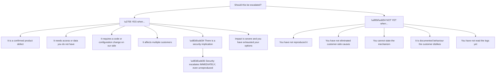
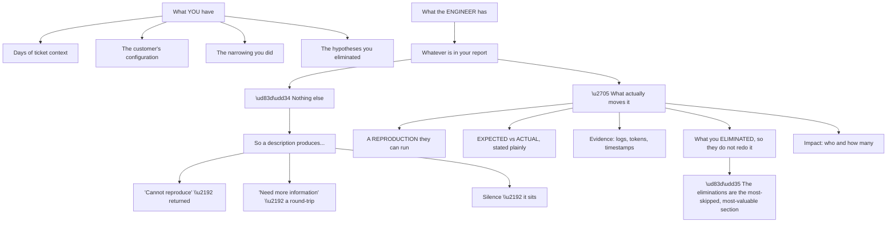
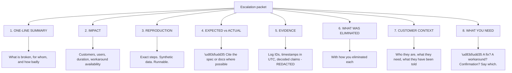
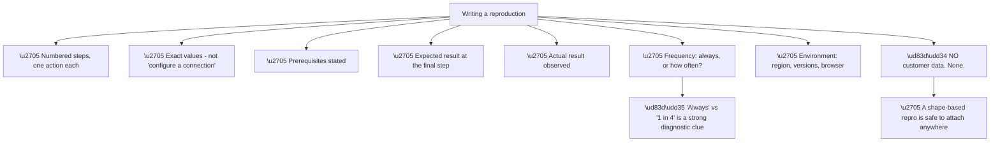
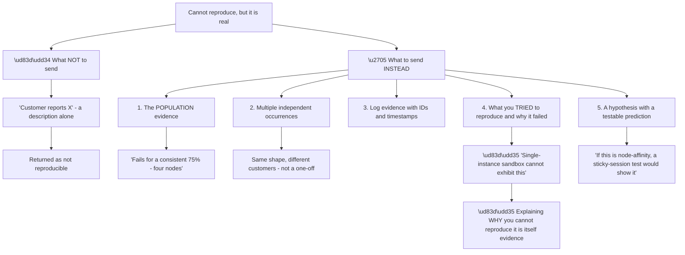
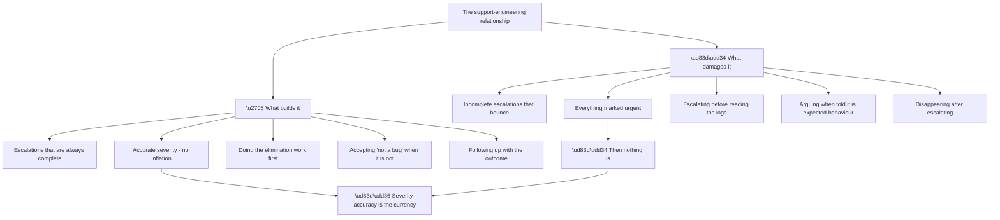
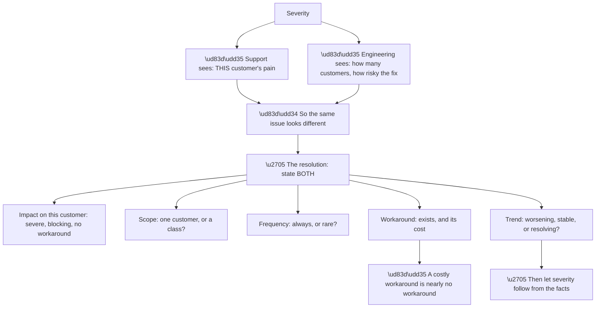
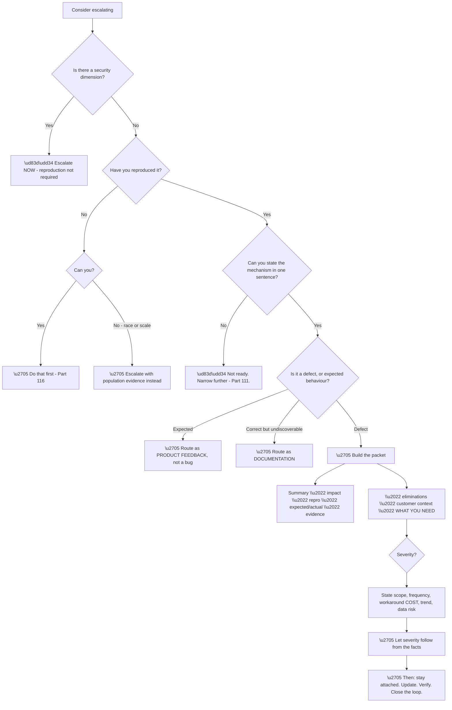

# Part 117 - Escalation Packets, Bug Reports, and Engineering Collaboration

> Section goal: Learn what to send, to whom, and in what form so that an escalation actually moves — and how to work with engineering as a colleague rather than a queue.

Covers index item **117**. Maps to JD signals: *cross-functional collaboration*, *troubleshooting complex technical issues*, *technical writing*, *customer-facing communication*, *prioritisation*, *root cause analysis*.

---

## 1. Start From Zero: When to Escalate

Escalating too early wastes engineering time; escalating too late leaves a customer suffering. **The decision has clear criteria.**

**Node R is the exception to every other rule.** A suspected security issue — cross-tenant exposure, a credential leak, a validation bypass — **escalates immediately, without waiting for a reproduction.** The cost of delay is unbounded; the cost of a false alarm is a short conversation.

**Node N1 is the most common premature escalation** and the one that most damages the support-engineering relationship. **An unreproduced report cannot be investigated**, so it is either returned or sits unactioned, and both outcomes cost more than reproducing would have (Part 116).

**Node N4 deserves care.** "Working as designed" is often true and is not a reason to dismiss the customer — **but it is a reason to route it as product feedback rather than as a defect** (Part 124). Those go to different places and have different timelines.

| Route | For |
|---|---|
| **Bug** | A confirmed defect with a reproduction |
| **Product feedback** | Documented behaviour that should change |
| **Documentation** | Correct behaviour that is not discoverable |
| **Security** | Anything with an exposure dimension |
| **Nothing** | Customer-side causes you have resolved |

> 💡 **Tie-in to your background:** escalating to engineering with sufficient evidence is core escalation work, and **you already know the difference between a report that moves and one that bounces.**

### 🔍 Plain-English deep-dive: what an engineer needs, and why descriptions fail

An escalation is a handover, and **the receiving engineer has none of the context you have accumulated.**

**Node R is the section that distinguishes a good escalation.** Listing what you have already ruled out **stops an engineer repeating a day of your work** — and it also demonstrates that the escalation is considered rather than reflexive.

| Section | Why it matters |
|---|---|
| Reproduction | Without it, they cannot start |
| Expected vs actual | Defines what "fixed" means |
| Evidence | Lets them verify independently |
| **Eliminations** | **Stops duplicated effort** |
| Impact | Informs prioritisation |
| Customer context | Informs urgency and communication |

**Node W1 is the most common outcome of a weak report**, and it is worth understanding without resentment: **an engineer who cannot reproduce something genuinely cannot investigate it.** Returning it is the correct action on their part.

**Which reframes the effort usefully:** the work of building a reproduction is not bureaucracy, **it is the thing that makes the escalation viable at all.**

**Analogy:** handing over a case to a colleague who was not in any of the meetings. Everything obvious to you is invisible to them, and the handover document is the entire basis for what they do next. **Where it stops:** a colleague can ask. An escalation queue may not ask for days, so the document has to anticipate the questions.

---

## 2. The Escalation Packet

A complete packet has eight sections. **Missing any one of them predictably causes a round-trip.**

**Node S8a is the section most often omitted**, and its absence causes real delay. **An escalation that does not say what is being asked for** leaves the engineer guessing between "confirm this is a bug," "give me a workaround," and "fix this urgently" — which are three very different requests.

**Node S4a is what makes a defect claim defensible.** *"The spec says the `aud` claim must be validated; we accept tokens where it does not match"* is a defect. *"I think it should work differently"* is an opinion. **Citing the specification or the documentation** converts the second into the first.

**Node S7a is genuinely useful to engineering** and is often withheld out of misplaced neutrality. **Knowing that the customer is mid-migration, or has an executive escalation open, or has been told a fix is coming** changes how engineering sequences their work — and they cannot factor in what they do not know.

**A worked one-line summary**, since it is the hardest part:

> *"SAML connections configured with a metadata URL do not pick up a rotated signing certificate until the connection is manually saved; affects any customer whose IdP rotates certificates; one customer had a 90-minute outage."*

**One sentence containing: what, the condition, the scope, and the impact.** That is what gets read.

---

## 3. Writing the Reproduction for an Engineer

Part 116 built the reproduction. **Writing it for someone else has its own requirements.**

**Node W6a is worth capturing explicitly.** A reproduction that fails **every time** and one that fails **one time in four** point at different mechanisms — the second suggests a race, a node count, or a timing dependency (Part 113). **Stating the frequency is free and diagnostic.**

**Node W2 is what separates a runnable reproduction from a description.** *"Configure a SAML connection"* is not a step; **"create a SAML connection with NameID format `urn:oasis:names:tc:SAML:2.0:nameid-format:transient`"** is.

**A reproduction template:**

| Field | Content |
|---|---|
| Prerequisites | Tenant type, connection type, application type |
| Steps | Numbered, one action each, with exact values |
| Expected | What should happen, with a citation if possible |
| Actual | What does happen |
| Frequency | Always / N in M |
| Environment | Region, SDK versions, browser and version |
| Evidence | Log IDs and timestamps for the reproduction itself |

**The final row is a small addition with real value:** **evidence from *your own* reproduction**, not the customer's, is entirely shareable and lets the engineer confirm they are seeing the same thing.

### 🔍 Plain-English deep-dive: escalating something you cannot reproduce

Some genuine defects cannot be reproduced by design — race conditions, scale dependencies, region-specific behaviour. **Escalating those requires a different kind of packet**, and doing it well is a distinct skill.

**Node R is the move that keeps the packet credible.** "Cannot reproduce" without explanation reads as insufficient effort; **"cannot reproduce because a single-instance sandbox cannot exhibit node-affinity behaviour by construction"** reads as analysis, and it tells the engineer what environment *would* exhibit it.

| Element | What it substitutes for |
|---|---|
| Population evidence | The reproduction's determinism |
| Multiple occurrences | Confirmation it is not a one-off |
| Log IDs across instances | Direct observation |
| Why reproduction fails | Demonstrates it was attempted properly |
| **A testable prediction** | **Gives the engineer a next step** |

**Node G5a is the most valuable element** and the least common. **Handing an engineer a specific test rather than an open problem** — *"if this is node affinity, running with sticky sessions disabled should reproduce it"* — gives them something to do in minutes rather than a mystery to schedule.

**Node G2a is worth gathering deliberately.** A single customer report is dismissible; **the same shape from two or three unrelated customers is a pattern**, and it changes both the credibility and the priority. **Searching your own past tickets for the shape before escalating** frequently finds them.

**And there is an honest framing that works well:** *"I have not been able to reproduce this in a sandbox, and I do not think it can be reproduced single-instance — here is the population evidence, three independent occurrences, and the specific test I think would confirm it."* **That is a stronger packet than many reproducible ones**, because it demonstrates the reasoning rather than just the outcome.

**Analogy:** reporting an intermittent fault to a manufacturer with a maintenance log showing it happens under load, three other owners reporting the same, and a specific test rig condition you believe would show it — rather than saying it makes a noise sometimes. **Where it stops:** they still have to build the rig, which is why the specific test matters more than the volume of evidence.

---

## 4. Working With Engineering

Escalation is a relationship, not a transaction. **How you engage determines how your next escalation is received.**

**Node V is the point that matters most over time.** **Severity accuracy is what makes urgency mean something.** A support engineer whose "urgent" is reliably urgent gets a fast response; one who marks everything urgent gets treated as noise, **and the genuine emergency suffers for it.**

**Node G4 is a discipline worth naming.** When engineering says something is expected behaviour and they are right, **accepting it and routing it as product feedback** is more effective than arguing — and it preserves credibility for the cases where they are wrong.

**Node B5 is a real and avoidable failure.** Escalating and then not following up **leaves the customer without updates and the engineer without context on urgency changes.** Staying attached to an escalation — providing updates, answering questions, confirming the fix — **is part of owning it** (Part 096's "build and own it").

**A practical division of responsibility:**

| Support owns | Engineering owns |
|---|---|
| The customer relationship | The code |
| Evidence and reproduction | The diagnosis at code level |
| Impact assessment | The fix |
| Communication cadence | Technical feasibility |
| Verifying the fix with the customer | Regression risk |
| Closing the loop | — |

**The last row is support's alone** and is frequently dropped: **confirming with the customer that the fix worked**, and updating any documentation or knowledge base article that resulted.

### 🔍 Plain-English deep-dive: severity, urgency, and honest inflation

Severity is where support and engineering most often disagree, and **the disagreement is usually about different things being measured.**

**Node V is the technique.** **Do not argue about the label; supply the facts that determine it.** An escalation stating scope, frequency, workaround cost, and trend **lets severity be derived rather than asserted** — and derived severity is much harder to dispute.

| Factor | Raises severity | Lowers it |
|---|---|---|
| Scope | Many customers, or a whole class | One customer, unusual configuration |
| Frequency | Always | Rare, specific conditions |
| Workaround | None, or very costly | Simple and cheap |
| Trend | Worsening | Stable or resolving |
| Data risk | **Any exposure** | None |
| Blocking | Cannot work at all | Degraded but usable |

**Row five overrides everything else.** **Any data exposure dimension makes it severe regardless of scope or frequency** — a single-customer, once-only cross-tenant leak is more urgent than a widespread cosmetic bug.

**Node R5 is the nuance most often lost.** *"There is a workaround"* is used to reduce severity, and **the workaround's cost matters**: manually re-linking users for every login, or restarting a service hourly, is technically a workaround and practically an ongoing outage. **Stating the cost prevents it being used to dismiss the issue.**

**And the honest position on inflation:** it is tempting under customer pressure, and **it is a short-term gain for a long-term loss.** The support engineer whose severity assessments are trusted is materially more effective than one who has to argue each time — **and that trust is built by occasionally marking something *lower* than the customer wants**, which is the harder half.

**Analogy:** triage in a busy department. Arguing about a category helps nobody; describing the presentation accurately lets the category follow. And someone who marks everything as critical is not helping their patients — they are removing the system's ability to distinguish. **Where it stops:** triage sees the patient directly. An escalation is read remotely, so the description has to carry everything.

---

## 5. Failure Modes

| # | Failure mode | Symptom | Fix |
|---|---|---|---|
| 1 | Escalating without a reproduction | Returned as not reproducible | Reproduce first (Part 116) |
| 2 | Escalating before reading the logs | Avoidable round-trip | Do the free checks |
| 3 | No "what I need" section | Engineer guesses the ask | State it explicitly |
| 4 | No eliminations listed | Duplicated work | List what you ruled out and how |
| 5 | Opinion presented as defect | Dismissed | Cite spec or documentation |
| 6 | Severity inflated | Urgency loses meaning | Supply facts; let severity follow |
| 7 | Workaround cost omitted | Severity wrongly reduced | State what the workaround costs |
| 8 | Customer context withheld | Poor sequencing | Share it; engineering needs it |
| 9 | Customer data in the packet | **Data handling failure** | Shape-based repro only |
| 10 | Disappearing after escalating | Customer left without updates | Stay attached |
| 11 | Arguing about "expected behaviour" | Credibility spent | Accept and route as feedback |
| 12 | Not verifying the fix | Regressions reach the customer | Confirm with them |
| 13 | Loop not closed | Documentation never updated | Update after resolution |
| 14 | Wrong route | Sits in the wrong queue | Bug vs feedback vs docs vs security |

---

## 6. Troubleshooting Decision Tree: Escalation

### Worked example

A customer reports that enabling a specific attack protection setting causes legitimate logins to fail for users behind a particular type of corporate proxy.

**Node B: no security exposure** — this is a false positive, not a leak.

**Node C: can it be reproduced?** Yes, with the shape: **the same setting, a client presenting the same header pattern the proxy adds.** No customer data required.

**Node D: mechanism in one sentence?** *"The protection treats a specific proxy-added header pattern as a bot signature, so legitimate traffic from that proxy family is challenged."*

**Node E: defect or expected?** **Genuinely arguable**, which is important to acknowledge in the packet rather than assert past. It is a false positive in a heuristic control, which is neither clearly a bug nor clearly correct.

**The packet:**

**Summary:** *"Bot detection challenges legitimate logins from clients behind [proxy family], because of a header pattern that proxy adds; affects any customer whose users sit behind it; one customer has ~400 affected users."*

**Impact:** 400 users, one customer confirmed, likely a class. **Workaround exists — disabling the protection — but its cost is losing bot protection entirely**, which is stated explicitly so it is not used to reduce severity.

**Reproduction:** exact steps with the header pattern, synthetic throughout, fails **every time** — which is stated because always-fails and sometimes-fails point at different mechanisms.

**Evidence:** log IDs from **the reproduction**, not the customer's tenant, so it is fully shareable.

**Eliminated:** not credentials (they succeed with the setting off), not the connection (other connections affected equally), not the network (reproduced from a different network), not the users (affects all users behind that proxy).

**Customer context:** mid-rollout to a large enterprise; **they were told a resolution path would be provided this week.**

**What is needed:** *"Confirmation of whether this is expected heuristic behaviour, and if so, whether an allow-list mechanism exists or could exist. If it is unintended, a fix."*

**That final section is what makes the packet actionable.** It gives engineering a specific decision to make rather than an open-ended investigation.

**And the honest framing about it being arguable** is worth more than confidence would be: **presenting a debatable case as a certain defect risks the whole packet being dismissed**, whereas naming the ambiguity invites the judgement you actually want.

---

## 7. Lab: Write Three Escalation Packets

**Purpose.** Practise the packet format, the severity discipline, and the routing decision.

**Prerequisites.**
- Parts 111–116 completed, including a working sandbox
- **No real customer cases** — use this guide's scenarios

**Steps.**

1. **Choose three scenarios** from this guide with different routes: one clear defect, one expected-behaviour case, and one security-dimension case.
2. **For each, decide the route** — bug, product feedback, documentation, or security — and write one sentence justifying it.
3. **Write a one-line summary** for each: what, condition, scope, impact.
4. **Write a full packet** for the defect, all eight sections.
5. **Build the reproduction** in your sandbox and write it in the template form from §3, with exact values.
6. **Confirm it contains no customer data** and could be attached publicly.
7. **Write the eliminations section**, stating how each was eliminated.
8. **Write the severity facts** — scope, frequency, workaround cost, trend, data risk — **without asserting a severity label.**
9. **Write the "what I need" section** as a specific decision or action.
10. **For the expected-behaviour case**, write the product feedback framing instead, and note how it differs.
11. **For the security case**, write what you would send immediately, before any reproduction.
12. **Write your follow-up plan:** update cadence, verification, and loop closure.

**Expected evidence.**
- Three routing decisions with justifications
- Three one-line summaries
- One complete eight-section packet
- A runnable reproduction with no customer data
- An eliminations section
- Severity facts without a label
- A product feedback framing
- An immediate security escalation draft
- A follow-up plan

**Validation rubric.**

| Criterion | Pass |
|---|---|
| Routing | You choose correctly between four destinations |
| Summary | One sentence with what, condition, scope, impact |
| Reproduction | Runnable by someone else, no customer data |
| Eliminations | Present, with method |
| Expected vs actual | Cited where possible |
| Severity | Facts supplied; label derived |
| The ask | Specific and decidable |
| Follow-up | You stay attached |

**Cleanup and privacy.** **Use only this guide's scenarios or synthetic ones.** Do not write a packet based on a real employer or customer case, even anonymised. **Delete any evidence generated during reproduction** once the exercise is complete.

---

## 8. JD Mapping

| JD signal | How this Part addresses it |
|---|---|
| Cross-functional collaboration | The support-engineering relationship |
| Troubleshooting complex technical issues | Escalation as the end of the diagnostic path |
| Technical writing | The eight-section packet |
| Customer-facing communication | Context sharing and follow-up |
| Prioritisation | Severity from facts rather than assertion |
| Root cause analysis | Eliminations and mechanism statements |

---

## 9. Candidate Honesty Note

- **Production experience:** escalating to engineering and product teams on business-critical issues, with evidence packets and reproductions.
- **Production experience:** severity discipline and staying attached to an escalation through to verification.
- **Lab experience:** building packets for this guide's scenarios, including the routing decision and the severity-from-facts approach, as above.
- **Learned architecture:** the four routing destinations and what belongs in each.
- **No direct experience:** escalating within this company's engineering process.
- **How to say it:** *"Escalation is a large part of my current role. The habits I'd bring are always reproducing first, listing what I've eliminated so nobody redoes it, stating what I actually need rather than just reporting, and supplying the facts that determine severity rather than asserting a label. And staying attached afterwards — escalating and disappearing leaves the customer without updates and engineering without context."*

---

## 10. Official Source Anchors

| Source | Why | Accessed |
|---|---|---|
| Auth0 Docs — Support and troubleshooting | The vendor-side escalation surface | Accessed **26 August 2026** |
| Okta Developer Forum — `devforum.okta.com` | Community reports and their quality | Accessed **26 August 2026** |
| Google SRE Book — Incident Management | Roles and handover discipline | Accessed **26 August 2026** |
| Relevant RFCs and OIDC specifications | Citing expected behaviour in defect claims | Accessed **26 August 2026** |

> **Revalidate:** internal escalation processes differ by organisation. Treat this Part as principles rather than procedure, and learn the actual process on joining.

---

## ⭐ Likely Interview Questions for This Section

### Q1. "When do you escalate to engineering?"

> *Model answer:* When it is a confirmed product defect with a reproduction, when it needs access or data I do not have, when it requires a change on our side, when it affects multiple customers, or when impact is severe and I have exhausted my options. And immediately, without waiting for a reproduction, if there is any security dimension — cross-tenant exposure, a credential leak, a validation bypass — because the cost of delay there is unbounded and the cost of a false alarm is a short conversation. What I would not do is escalate before I have reproduced it, before I have read the logs, or when I cannot state the mechanism in one sentence, because those get returned and cost more than doing the work would have.

### Q2. "What goes into an escalation packet?"

> *Model answer:* Eight sections. A one-line summary containing what, the condition, the scope, and the impact. Impact in detail — customers, users, duration, and whether a workaround exists. A reproduction with exact steps and synthetic data. Expected versus actual, citing the specification or documentation where possible. Evidence with log IDs and timestamps in UTC. What I eliminated and how. Customer context. And — the section most often omitted — what I actually need: a fix, a workaround, or just confirmation that this is expected. Without that last one, the engineer has to guess between three very different requests.

### Q3. "Why does listing what you eliminated matter?"

> *Model answer:* Because it stops an engineer repeating a day of my work. If I have confirmed it is not credentials because it succeeds with the setting off, not the connection because other connections are affected equally, and not the network because I reproduced it from elsewhere, saying so means they start where I finished. It also signals that the escalation is considered rather than reflexive, which affects how it is received. It is the most-skipped section and one of the most valuable, and it costs about four lines to write.

### Q4. "How do you handle severity disagreements with engineering?"

> *Model answer:* By not arguing about the label and instead supplying the facts that determine it. Support sees this customer's pain; engineering sees how many customers are affected and how risky a fix is — so the same issue genuinely looks different from each side. If I state the scope, the frequency, the workaround and specifically its cost, the trend, and whether there is any data risk, severity follows from the facts and is much harder to dispute. The nuance I would be careful about is workaround cost: "there is a workaround" gets used to reduce severity, and a workaround that means manually re-linking users on every login is practically an ongoing outage rather than a mitigation.

### Q5. "What's the risk of inflating severity?"

> *Model answer:* That urgency stops meaning anything. If everything I escalate is marked urgent, then nothing I escalate is, and the genuine emergency suffers for it — my assessments get treated as noise. Severity accuracy is really the currency of the support-engineering relationship, and it is built partly by occasionally marking something *lower* than the customer wants, which is the harder half. It is tempting under customer pressure and it is a short-term gain for a long-term loss. A support engineer whose severity is trusted gets a fast response without having to argue for it each time.

### Q6. "Engineering says it's working as designed. What do you do?"

> *Model answer:* If they are right, accept it and route it differently rather than arguing. It becomes product feedback if the behaviour should change, or a documentation item if the behaviour is correct but undiscoverable — those go to different places with different timelines, and neither is the same as a bug. Accepting it preserves credibility for the cases where they are wrong, which matters. What I would still do is go back to the customer with a real explanation rather than "working as designed," which is often literally true and reliably sounds dismissive — the better framing is that this is expected behaviour, here is why, and here is what could change the outcome if they need one.

### Q7. "What happens after you escalate?"

> *Model answer:* I stay attached. That means giving the customer an update cadence and keeping to it even when there is nothing new, answering engineering's questions promptly because a stalled question stalls the whole thing, updating the escalation if impact or urgency changes, verifying the fix with the customer when it arrives, and closing the loop — updating any documentation or knowledge base article that came out of it. Escalating and then disappearing is a real failure mode: the customer is left without updates and engineering has no visibility into whether it has got worse. Owning it end to end includes the part after the handover.

### Q8. "How do you write a reproduction an engineer can actually run?"

> *Model answer:* Numbered steps with one action each and exact values — "create a SAML connection with NameID format transient" rather than "configure a connection." Prerequisites stated, expected result at the final step, actual result observed, and the frequency, because always-fails and one-in-four point at different mechanisms and stating it is free. Environment details: region, SDK versions, browser and version. And no customer data at all, which is achievable because nearly every identity bug depends on shape rather than values — a format, a claim name, a count. I would also attach log IDs from my own reproduction rather than the customer's, so the whole packet is shareable without any handling concerns.

---

## 🧠 30-Second Memory Hooks

- **Security escalates immediately — no reproduction required.**
- **Everything else: reproduce first, or it bounces.**
- **Four routes: bug · product feedback · documentation · security.**
- **Eight sections; the missing one is usually "what I need."**
- **List what you ELIMINATED, and how.**
- **Cite the spec** — that turns an opinion into a defect claim.
- **Share customer context** — engineering cannot sequence what it cannot see.
- **State severity FACTS; let the label follow.**
- **Workaround cost matters.** A costly workaround is nearly none.
- **Any data exposure overrides scope and frequency.**
- **Severity accuracy is the currency.** Inflation destroys it.
- **Frequency in the repro: "always" vs "1 in 4" is diagnostic.**
- **No customer data in a packet — shape-based repros are shareable.**
- **Stay attached: update, verify, close the loop.**

---

## ✅ Completion Checklist

- [ ] I can state when to escalate and when not to
- [ ] I escalate security issues immediately, unreproduced
- [ ] I route correctly between bug, feedback, documentation, and security
- [ ] My packets have all eight sections
- [ ] I always include what I eliminated and how
- [ ] I cite specifications when claiming a defect
- [ ] I supply severity facts rather than asserting a label
- [ ] I state the workaround's cost
- [ ] My reproductions contain no customer data
- [ ] I stay attached through verification and loop closure
- [ ] I have written three packets across three routes

*Next suggested section:* **[Part 118 - End-to-End Case Capstone](Part-118-end-to-end-case-capstone.md)** — a single complex case worked from first report to closed loop, applying everything in Group K at once.
