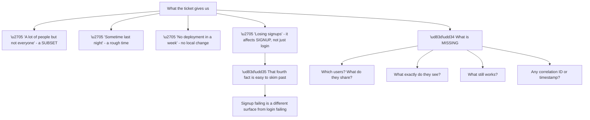
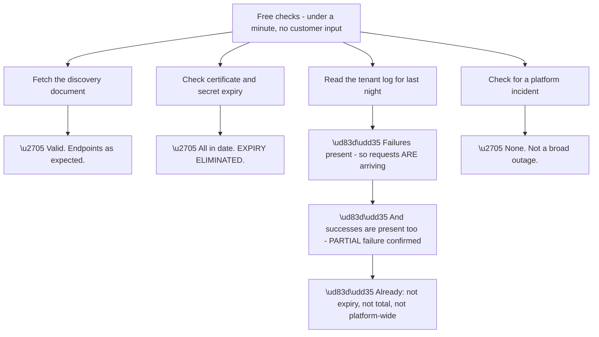
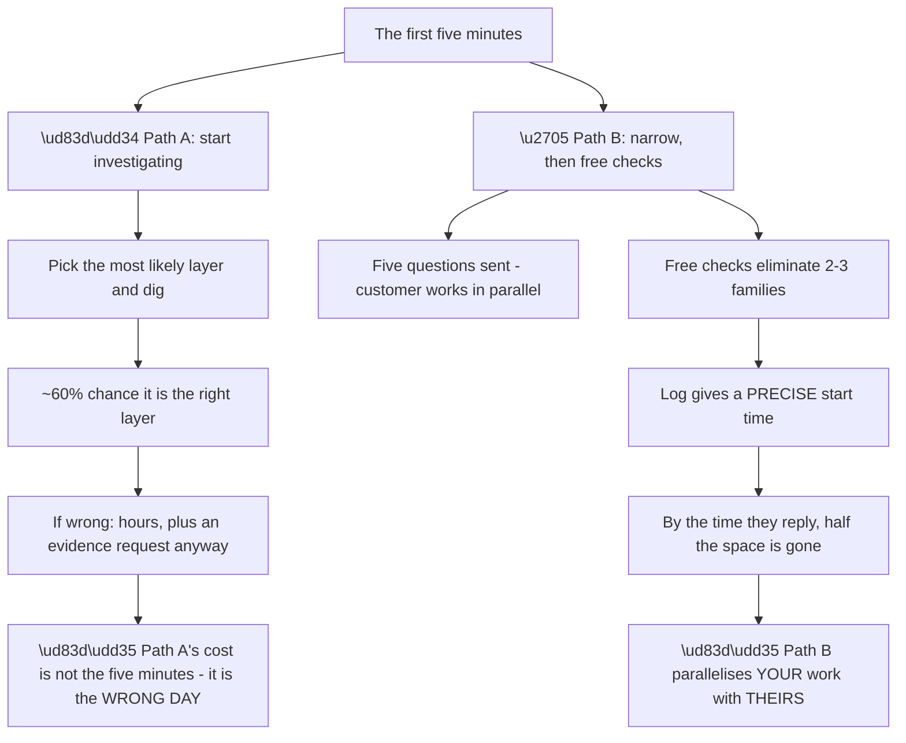
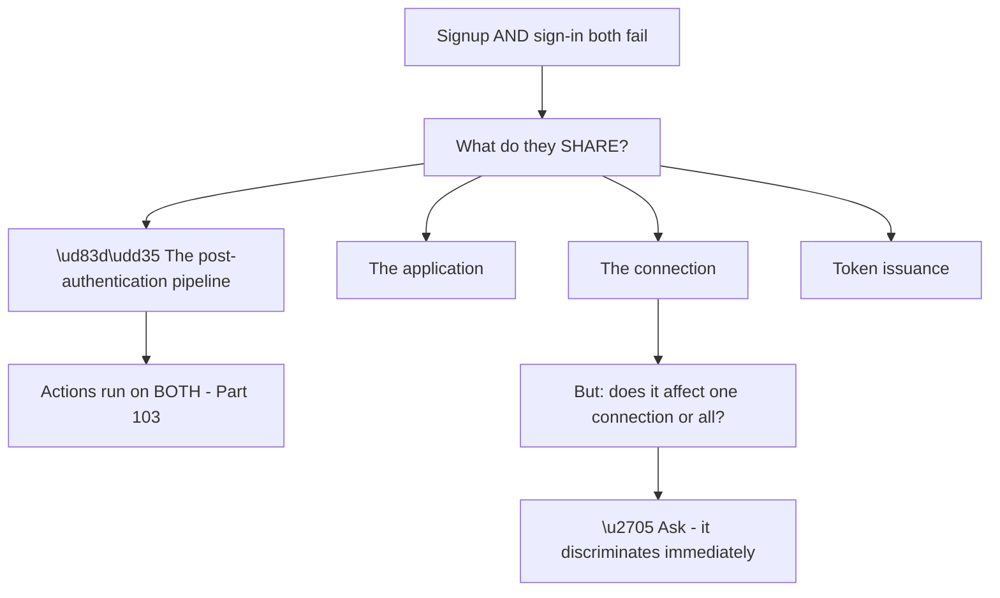
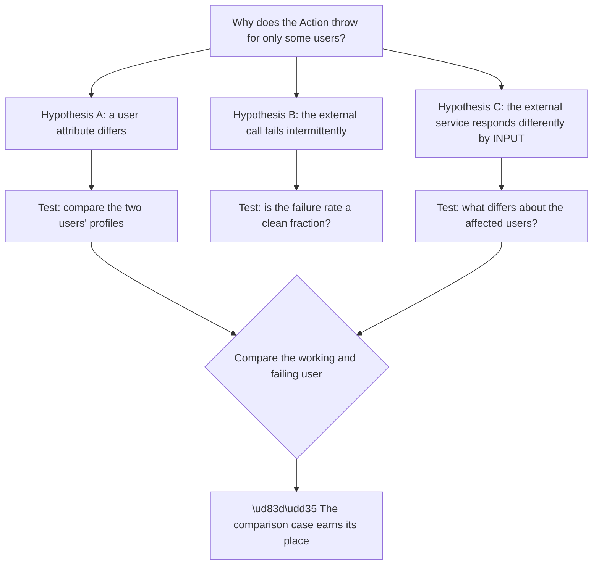
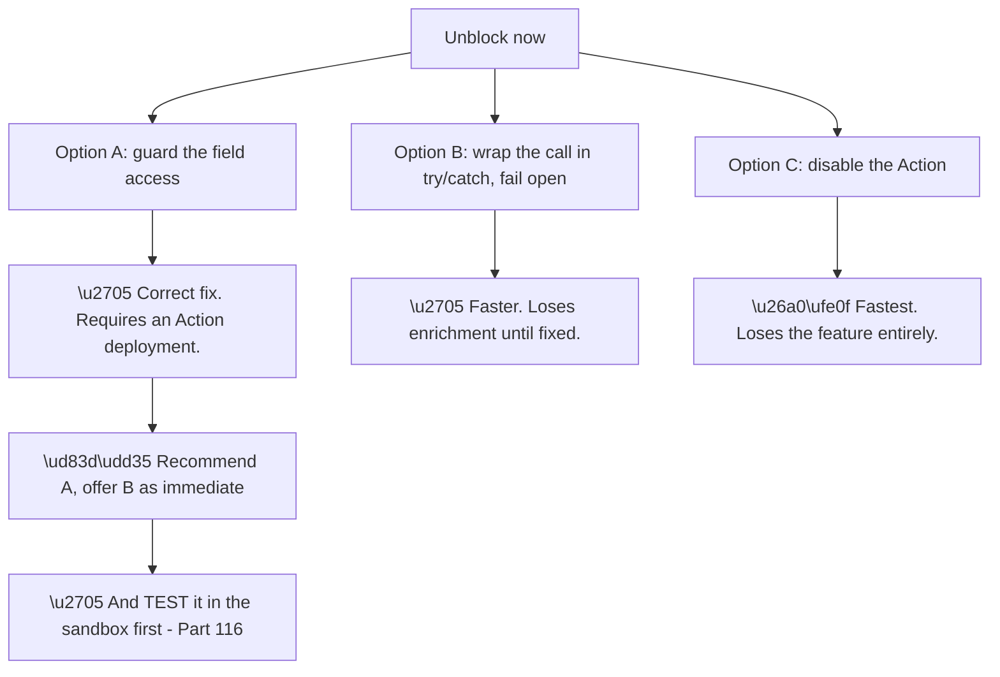
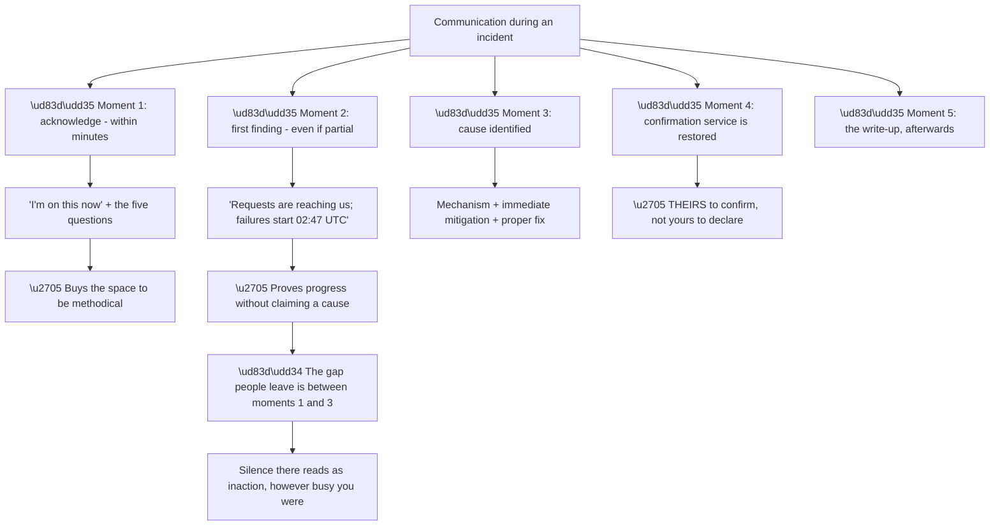
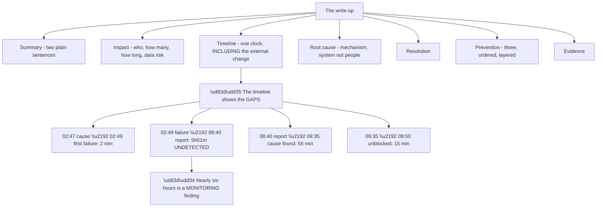
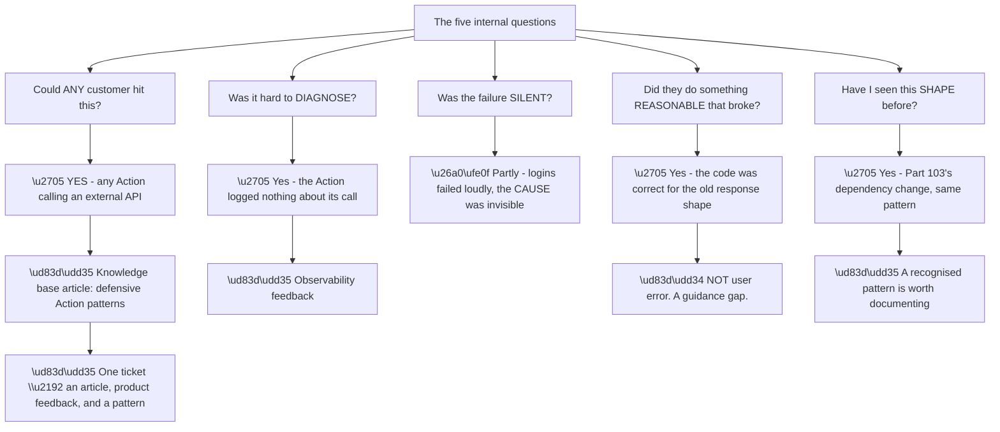
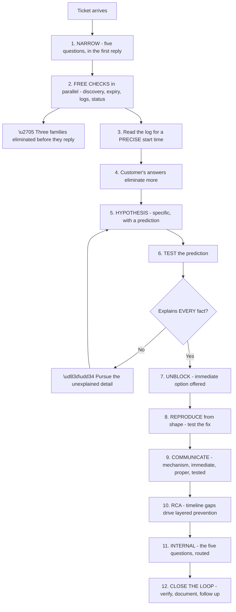

# Part 118 - End-to-End Case Capstone

> Section goal: Work one genuinely complex case from first report to closed loop, applying every technique in Group K at once — so the method becomes a rehearsed sequence rather than a checklist.

Covers index item **118**. Maps to JD signals: *troubleshooting complex technical issues*, *root cause analysis*, *customer-facing communication*, *cross-functional collaboration*, *prioritisation*, *proactivity*.

---

## 1. The Case: First Contact

> **Ticket #48210 — Priority: Urgent**
>
> *"Our customers can't log in. This started sometime last night. It's affecting a lot of people but not everyone. We haven't deployed anything in a week. We're losing signups and our support queue is filling up. Please help urgently."*

**Everything about this is typical**, including how little it contains. **Four facts and no technical detail.**

**Node N1 is the detail worth catching early.** *"Losing signups"* suggests the **signup** path specifically, which narrows differently from a general login failure — **new users cannot complete registration**, which is a distinct population (Part 111).

**The first move is not to investigate.** It is the five questions, plus the free checks, in parallel (Part 111).

> 💡 **Tie-in to your background:** this is a critical-situation opening. **The temptation under urgency is to start looking at things; the discipline is to narrow first**, because the wrong layer costs a day you do not have.

---

## 2. Narrowing and Free Checks

**The first reply, sent within minutes:**

> Thanks — I'm on this now. While I start looking, five quick things will let me narrow it fast:
>
> 1. **One affected user's email and the approximate time** they tried, **with your time zone.**
> 2. **One user it works for**, ideally around the same time.
> 3. **What do affected users actually see** — an error at your site, or at the login page?
> 4. **Does it affect all browsers**, or have you noticed a pattern?
> 5. **Is it signup, sign-in, or both?**
>
> I'm already checking your tenant configuration and logs from my side.

**Five items, each one line, each with an obvious purpose** (Part 112).

**Meanwhile, the free checks** (Part 111):

**Node R is real progress before the customer has replied.** **Three families eliminated in under a minute**, and the partial-failure pattern is confirmed rather than assumed.

**Reading the log more carefully** shows something the summary would have missed: **the failures are concentrated in a particular event code**, and they begin at a specific time — **02:47 UTC**, not spread through the night.

**A precise start time is a significant finding.** *"Sometime last night"* has become a two-minute window, **and anything that changed at 02:47 is now a candidate.**

### 🔍 Plain-English deep-dive: what the first five minutes are actually worth

The opening of a case disproportionately determines its duration. **Quantifying that makes the discipline easier to hold under pressure.**

**Node R2 is the property that makes Path B faster even when Path A guesses correctly.** The customer takes fifteen to thirty minutes to answer regardless; **that time is either used or wasted.** Sending the questions first means both sides work simultaneously.

| Minute | Path A | Path B |
|---|---|---|
| 0–5 | Reading configuration | **Questions sent; free checks running** |
| 5–20 | Investigating a guessed layer | Log read; precise start time found |
| 20–30 | Still investigating | **Answers arrive; two families eliminated** |
| 30–60 | Requesting evidence, belatedly | Hypothesis formed and tested |

**By minute thirty the two paths are an hour apart**, and Path A has still not asked for the comparison case it will need.

**The precise-start-time finding deserves separate emphasis** because of what it enabled here. **"Sometime last night" is unsearchable; 02:47 UTC is a query** — and it made an *external* provider change findable, which nobody would have thought to look for otherwise (Part 115's differential analysis).

**The general rule:** **the log almost always knows the start time more precisely than the customer does.** Extracting it early is cheap and it reframes every subsequent question.

**And one caution about the urgency itself:** a customer writing "urgent" is describing their experience accurately, and **matching their urgency with visible speed — a reply within minutes — buys the space to be methodical.** Silence for thirty minutes while narrowing properly reads as inaction, however productive it was.

**Analogy:** a triage nurse who takes observations and sends bloods before deciding what is wrong, rather than examining one system thoroughly on a hunch. The tests run while the assessment continues. **Where it stops:** bloods come back on their own schedule; a customer's answers depend on how clearly you asked.

---

## 3. The Customer's Answers

Replies arrive within twenty minutes:

| Question | Answer |
|---|---|
| Affected user and time | `test.user@example.org`, ~08:30 IST |
| Working user | `other.user@example.org`, same time |
| What they see | "Something went wrong" at the login page |
| Browsers | "All of them, we checked three" |
| Signup or sign-in | **"Both. Signup fails at the last step."** |

**Two of these are immediately valuable.**

**"All browsers"** eliminates the cookie family (Parts 072, 091) — **which was a strong candidate given the partial failure.**

**"Both, and signup fails at the last step"** is the more interesting one. **Signup and sign-in sharing a failure, at the end of the flow**, points at something they have in common **after** authentication succeeds.

**Node W3a is the leading hypothesis**, and it fits every fact so far: **an Action runs on both signup and login, runs after authentication, and would produce a failure at the last step in both flows.**

**But it is a hypothesis, and hypotheses make predictions** (Part 111). **If an Action is throwing, the tenant log will show the exception.**

**Checking.** The failing entries contain an Action error — **an unhandled exception, with a stack reference to a line reading a field from an HTTP response.**

**Hypothesis confirmed at the mechanism level**, not merely correlated.

---

## 4. But Why Only Some Users?

**The Action explanation is incomplete**, and Part 111's discipline says the unexplained detail is the interesting one.

**If an Action throws unconditionally, everyone fails.** Some users succeed. **So the Action fails conditionally.**

**Node R1 is why the working comparison was requested in the first message** (Part 112). **Without it, this step would require another round-trip.**

**Comparing the two profiles:** same connection, same application, same signup date, same groups. **One difference: the affected user's profile has no `email_verified` value set, while the working user's is `true`.**

**Reading the Action's code** — which the customer provides on request — confirms it: the Action calls an enrichment API, passing the verification status, **and reads a field from the response that the provider returns only when the status is supplied.**

**And Part 111's rule about external changes applies** (differential analysis including things outside their estate). **The provider changed their response shape at 02:47 UTC**, returning `null` rather than omitting the field when the input is absent — **a change that is backwards-compatible for anyone handling `null` and fatal for anyone not.**

**Everything now fits:**

| Fact | Explanation |
|---|---|
| Started 02:47 UTC | The provider's change |
| No deployment in a week | True — the change was external |
| Some users only | Those without `email_verified` set |
| Signup and sign-in both | The Action runs on both |
| All browsers | Server-side, so browser-independent |
| Fails at the last step | The Action runs after authentication |

**Six facts, one mechanism, nothing unexplained.** That is the standard for stopping (Part 115).

---

## 5. Unblock, Then Prove

**Part 116's rule: unblock first.**

**Node R1 is the discipline that makes the recommendation trustworthy.** Reproducing the shape in the sandbox — an Action reading a field that is `null` — **confirms the guard resolves it and that nothing adjacent breaks.**

**The reproduction is built from shape only** (Part 116): a test Action, a mock endpoint returning `null`, synthetic users. **No customer data, and therefore shareable.**

**The message to the customer:**

> **Cause identified.** Your post-login Action calls [enrichment provider], and at 02:47 UTC that provider changed its response so a field returns `null` rather than being absent. Your Action reads that field without a guard, so it throws — and because there is no error handling, the exception blocks the login. It affects only users whose `email_verified` is unset, because that is the input condition that triggers the new response.
>
> **To unblock now:** wrapping the call in a try/catch that lets the login proceed will restore service immediately. You lose the enrichment until the proper fix ships.
>
> **The fix:** guard the field access. I reproduced this in a test tenant and confirmed the guard resolves it, and that existing sessions and your claim mapping are unaffected.
>
> Happy to look over the change before you deploy it if that helps.

**Four properties make this land** (Parts 095, 115): **it names the mechanism, it separates immediate from proper, it says it was tested, and it offers help without insisting.**

### 🔍 Plain-English deep-dive: communicating during, not only after

A seven-hour incident contains several communication moments, and **most of them happen before you have an answer.**

**Node R1 is the failure worth avoiding deliberately.** Between acknowledging and having an answer there may be an hour of genuine work, **and from the customer's side that is indistinguishable from nothing happening.** A single line — *"still working; I can see the failures start at 02:47 UTC and requests are reaching us, so I'm looking at what changed then"* — costs nothing and changes the experience entirely.

| Moment | Say | Do not say |
|---|---|---|
| Acknowledge | "I'm on this now, here's what I need" | Nothing for twenty minutes |
| Partial finding | **What you have established** | A guess presented as a cause |
| Cause | Mechanism, immediate, proper, tested | Only the proper fix |
| Restored | Ask them to confirm | "It's fixed" |
| After | The write-up | Silence |

**Node M4a matters more than it looks.** **Declaring an incident resolved is the customer's call, not yours** — you can say the cause is addressed and the mitigation is in place, and **they confirm their users can work.** Getting that wrong once, and having them discover it is still broken, costs disproportionate trust.

**Node M2b is the technique for the hard middle.** **Report findings, not guesses.** *"Requests are reaching us and failures start at 02:47"* is a fact that demonstrates progress; *"I think it might be a certificate"* is a guess that will need retracting.

**And there is a cadence question worth settling early:** *"I'll update you every thirty minutes even if there's nothing new."* **Setting the expectation removes the customer's need to chase**, which removes interruptions and makes you faster.

**Analogy:** a repair where the engineer disappears under the floor for an hour. Whether they were working the whole time or not is unknowable from above, which is why the occasional word matters more than its content. **Where it stops:** a word is not progress, so it has to be paired with actual findings or it becomes noise.

---

## 6. The Root Cause Analysis

**Written after service is restored** (Part 115).

**Node P1 is where the recommendations come from** (Part 115's gap analysis): **the fix took fifteen minutes and the outage took seven hours**, because nobody knew for nearly six of them.

**The three preventions, layered and ordered:**

| Layer | Recommendation | Effort |
|---|---|---|
| **Prevention** | Guard external field access; wrap calls with an explicit fail-open/fail-closed decision | Hours |
| **Detection** | Alert when successful logins drop below a baseline | An hour |
| **Response** | Log external call outcomes in Actions, so the next dependency change is visible in minutes | An hour |

**And a fourth, offered separately** so it does not dilute the three: **put Actions in version control with review**, since login-path code deployed from a dashboard has no history and no rollback (Part 103).

**The root cause section, written as a system property:**

> *"The Action read a field from an external response without guarding against a null value, and the external call had no error handling, so a change in a third-party response shape became a login outage. The Action also emitted no telemetry about the call, so the cause was not visible in the logs until the exception itself was examined."*

**No person is named**, and the second sentence turns the diagnosis difficulty into a finding rather than a complaint.

### 🔍 Plain-English deep-dive: closing the loop, and what this case is worth beyond the ticket

The ticket is resolved. **The remaining value is in what the incident reveals about the product and the pattern** (Part 115's five questions).

**Node A4a is the framing that matters most**, and it is the one most easily got wrong. **The customer's code was correct for the response shape that existed when it was written.** Calling this a coding error is both inaccurate and unhelpful — **the gap is that nothing in the guidance made the fragility obvious.**

| Output | Destination |
|---|---|
| Defensive Action patterns article | Knowledge base (Part 122) |
| Action external-call observability | Product feedback (Part 124) |
| "External dependency changed" as a diagnostic pattern | Team knowledge |
| Absence-based alerting recommendation | Customer-facing guidance |

**Four outputs from one ticket**, and none of them is the fix — **which is the point.** The fix helped one customer for one incident; **the article and the feedback help everyone who has not hit it yet.**

**And there is a self-directed output too.** This case exercised every technique in Group K: narrowing, free checks, evidence requests with a comparison, hypothesis prediction, pursuing the unexplained detail, unblock-before-prove, shape-based reproduction, timeline gap analysis, layered prevention, and internal routing. **Noticing which step was hardest is worth recording** — for most people it is either resisting the urge to investigate before narrowing, or stopping at a nearly-complete explanation.

**Analogy:** a surgeon reviewing an operation afterwards \u2014 not to second-guess the outcome, which was fine, but to note what took longest and why, and whether the instrument tray was laid out well. **Where it stops:** the review only helps if it changes something, which is why the outputs need destinations rather than just being observed.

---

## 7. The Complete Sequence

**Twelve steps**, and the case above ran through all of them in about ninety minutes of active work.

**The steps that most affected the outcome:**

| Step | Why it mattered here |
|---|---|
| **1 — narrowing first** | The five questions eliminated cookies and located the surface |
| **2 — free checks** | Expiry eliminated before the customer replied |
| **3 — precise start time** | "Last night" became 02:47, making the external change findable |
| **5–6 — prediction** | The Action hypothesis predicted a log exception, which confirmed it |
| **H1 — the unexplained detail** | "Why only some users" completed the mechanism |
| **8 — test the fix** | Made the recommendation trustworthy |
| **11 — internal routing** | Turned one fix into an article and product feedback |

**Step H1 is the one most often skipped under pressure**, and it was decisive: **the Action explanation was 80% right and would have produced worse recommendations** — treating it as intermittent rather than population-based would have suggested retries rather than a guard.

---

## 8. Failure Modes of the Whole Sequence

| # | Failure mode | What would have happened here |
|---|---|---|
| 1 | Investigating before narrowing | Hours on cookies, which "all browsers" eliminated free |
| 2 | Skipping free checks | Certificate expiry chased for an hour |
| 3 | Accepting "last night" | The external change at 02:47 never found |
| 4 | Not asking for a comparison case | An extra round-trip to find `email_verified` |
| 5 | Stopping at "an Action is throwing" | Wrong recommendations — retries, not a guard |
| 6 | Proving before unblocking | Extra hours of outage |
| 7 | Recommending untested | Risk of a fix that does not work |
| 8 | Naming the developer in the RCA | Defensiveness; recommendation ignored |
| 9 | Only recommending prevention | The six-hour detection gap unaddressed |
| 10 | Twelve recommendations | None implemented |
| 11 | No internal routing | The next customer hits the same thing |
| 12 | Not verifying the fix | A regression reaching production |

---

## 9. Lab: Work Two Cases End to End

**Purpose.** Rehearse the full sequence until it is automatic, on cases you have not seen worked.

**Prerequisites.**
- Parts 111–117 completed, with a method card and a sandbox
- **Synthetic cases only**

**Steps.**

1. **Write two case openings** in the style of §1 — vague, urgent, four facts. Base them on failure modes from Groups I and J you have **not** seen worked in this Part.
2. **Set them aside for a day**, so you approach them fresh.
3. **For case one, write the first reply** — five questions, one line each, within five minutes.
4. **List the free checks** and what each would eliminate.
5. **Invent plausible customer answers**, including one that eliminates a family.
6. **Form a hypothesis with a prediction.** Write the prediction down before testing it.
7. **Deliberately make it incomplete** — leave one fact unexplained — and then pursue it.
8. **Write the unblock message**, separating immediate from proper.
9. **Build the reproduction in your sandbox**, from shape only.
10. **Write the RCA** with a timeline that shows the four gaps.
11. **Write three layered preventions.**
12. **Answer the five internal questions** and name the destinations.
13. **Repeat for case two, timed.** Target: under sixty minutes for the full sequence.
14. **Note which step was hardest** and add a prompt to your method card.

**Expected evidence.**
- Two case openings
- Two complete worked sequences
- Predictions written before testing
- Two reproductions built from shape
- Two RCAs with gap analysis
- Six layered preventions
- Internal routing for both
- A timed run and a note on your hardest step

**Validation rubric.**

| Criterion | Pass |
|---|---|
| Narrowing first | You do not investigate before asking |
| Free checks | You know what they eliminate |
| Evidence request | Five items, comparison case included |
| Prediction | Written before testing |
| Completeness | You pursue the unexplained fact |
| Unblock first | Before proving |
| Tested recommendation | You reproduce before advising |
| RCA gaps | Your timeline shows all four |
| Internal routing | You produce outputs beyond the fix |
| Speed | Full sequence under an hour |

**Cleanup and privacy.** **Use only synthetic cases.** Do not base a capstone case on a real employer or customer incident, even heavily disguised. **Delete all sandbox artefacts** when finished.

---

## 10. JD Mapping

| JD signal | How this Part addresses it |
|---|---|
| Troubleshooting complex technical issues | The full sequence, applied |
| Root cause analysis | Mechanism, completeness, gap analysis |
| Customer-facing communication | First reply, unblock message, RCA |
| Cross-functional collaboration | Internal routing of findings |
| Prioritisation | Unblock before prove |
| Proactivity | One ticket into an article and product feedback |

---

## 11. Candidate Honesty Note

- **Production experience:** working complex escalations end to end under time pressure, including customer communication and post-incident analysis.
- **Production experience:** the specific discipline of unblocking before completing the investigation.
- **Lab experience:** rehearsing the full twelve-step sequence on synthetic cases, timed, as above.
- **Learned architecture:** the identity-specific narrowing questions and patterns that make step one fast.
- **No direct experience:** running this sequence on live tickets for this product.
- **How to say it:** *"The sequence is what I already do on escalations. What I rehearsed for this domain is the front of it — the five questions and the free checks — because that is where domain knowledge makes the difference between narrowing in five minutes and investigating for a day. The step I have to be most deliberate about is not stopping at an explanation that fits most of the facts."*

---

## 12. Official Source Anchors

| Source | Why | Accessed |
|---|---|---|
| Auth0 Docs — Tenant logs and event codes | Evidence at every step | Accessed **26 August 2026** |
| Auth0 Docs — Actions and error handling | The mechanism in this case | Accessed **26 August 2026** |
| Auth0 Docs — Monitoring and log streams | The detection recommendation | Accessed **26 August 2026** |
| Google SRE Book — Postmortem Culture | Blameless analysis and gap measurement | Accessed **26 August 2026** |
| Okta Developer Forum — `devforum.okta.com` | Realistic case openings | Accessed **26 August 2026** |

> **Revalidate:** the sequence is stable; the evidence locations are not. Re-check before interview.

---

## ⭐ Likely Interview Questions for This Section

### Q1. "Walk me through how you'd handle an urgent 'customers can't log in' ticket."

> *Model answer:* I would send five narrowing questions within minutes rather than starting to investigate — one affected user with a time and time zone, one user it works for, what they actually see, whether it affects all browsers, and whether it is signup, sign-in, or both. While waiting I would do the free checks: fetch the discovery document, check certificate and secret expiry, read the tenant log for the reported window, and check for a platform incident. That takes under a minute and typically eliminates two or three families before the customer replies. The log usually gives me a precise start time, which turns "sometime last night" into a two-minute window — and anything that changed in that window becomes a candidate, including things outside their systems.

### Q2. "Why ask for a working user as well as a failing one?"

> *Model answer:* Because it turns diagnosis into comparison, and the candidate differences between two users are few. In the case I worked through, the failure was in an Action that threw for some users and not others, and comparing the two profiles showed a single difference — one had a verification status set and one did not — which turned out to be the input condition that triggered the third-party's new response shape. Without the comparison that would have been another round-trip, and a round-trip is about a day. It costs the customer nothing to provide, which is why I put it in the first message rather than asking later.

### Q3. "You have an explanation that fits most of the facts. What now?"

> *Model answer:* Keep going, because the unexplained fact is usually the important one. In this case "an Action is throwing" explained the timing, the surface, and the browser-independence, but not why only some users were affected — and if I had stopped there, I would have treated it as intermittent and recommended retry logic, when it was actually population-based and needed a guard on a field. So the recommendation would have been wrong in a way that would not have fixed it. My rule is that an explanation that accounts for most symptoms is a hypothesis that is partly wrong, not one that is mostly right.

### Q4. "The customer is losing money. Do you complete the investigation first?"

> *Model answer:* No — unblock first, then prove. Once I understand the mechanism well enough to offer a safe immediate mitigation, I offer it, and I separate it clearly from the proper fix so they know what they are trading. In this case that was wrapping the external call so the login proceeds without the enrichment, versus guarding the field properly. Completing an investigation while a customer bleeds signups is the wrong order. What I would still do before recommending anything is reproduce the fix in my own sandbox, because a recommendation that does not work costs more trust than a few extra minutes does — and I would say I tested it, which changes how it is received.

### Q5. "How do you write up a cause that's in the customer's own code?"

> *Model answer:* As a property of the system rather than of a person. "The Action read a field from an external response without guarding against a null value, and the call had no error handling, so a change in a third-party response shape became a login outage" — no developer named, and it points at something changeable. The framing that matters most is that their code was correct for the response shape that existed when it was written, so calling it a coding error is both inaccurate and unhelpful. The gap is that nothing made the fragility obvious. I would also include a second sentence noting that the Action emitted no telemetry about the call, because that turns the diagnosis difficulty into a finding rather than a complaint.

### Q6. "What do timeline gaps tell you?"

> *Model answer:* Where the time actually went, which drives the recommendations. In this case the cause was at 02:47, the first failure two minutes later, the report at 08:40, the cause identified at 09:35, and service restored fifteen minutes after that. So a seven-hour outage contained a fifteen-minute fix — nearly six hours were undetected and fifty-five minutes were diagnosis. That makes the case for monitoring and for logging external call outcomes by itself, far better than asserting that monitoring would help. Each gap maps to a different layer: cause-to-symptom is prevention, symptom-to-detection is monitoring, detection-to-diagnosis is runbooks and observability, and diagnosis-to-fix is usually already short.

### Q7. "What's the value of this ticket beyond fixing the customer's problem?"

> *Model answer:* Three outputs, and none of them is the fix. Any customer with an Action calling an external API could hit this, so it is a knowledge base article on defensive Action patterns. It was hard to diagnose because the Action logged nothing about its external call, which is observability product feedback. And it is the same shape as a dependency change I have seen before, which makes it a recognised pattern worth naming for the team. The fix helped one customer once; the article and the feedback help everyone who has not hit it yet. I would do that thinking before closing, while the context is fresh, because a week later the detail has evaporated and the note is much weaker.

### Q8. "Which step in that sequence do you find hardest?"

> *Model answer:* Two, honestly. The first is resisting the urge to investigate before narrowing — under urgency it feels productive to start looking at things, and it is usually the most expensive minute of the ticket. The second, and the one I have to be most deliberate about, is not stopping at an explanation that fits most of the facts. When you have something that accounts for the timing and the surface and the customer is waiting, closing the remaining gap feels optional and it is not, because a partly-wrong explanation produces confidently-wrong recommendations. I have added prompts for both to my own method card rather than relying on remembering under pressure.

---

## 🧠 30-Second Memory Hooks

- **Narrow before investigating — even under urgency. Especially under urgency.**
- **Free checks in parallel: discovery · expiry · logs · status.**
- **Turn "last night" into a precise start time from the log.**
- **Ask for the working comparison in the FIRST message.**
- **Hypotheses make predictions. Test the prediction.**
- **An explanation that fits most facts is partly wrong.**
- **Unblock first, prove second.**
- **Separate the immediate mitigation from the proper fix.**
- **Test the recommendation before giving it — and say you did.**
- **Timeline gaps drive layered prevention.**
- **Describe the system, not the people.**
- **Three ordered preventions; a fourth offered separately.**
- **Five internal questions before closing.**
- **One ticket → an article, product feedback, and a pattern.**

---

## ✅ Completion Checklist

- [ ] I narrow before investigating, even under urgency
- [ ] I run free checks in parallel with the first reply
- [ ] My first reply is five one-line questions including a comparison case
- [ ] I extract a precise start time from the log
- [ ] I write predictions before testing them
- [ ] I pursue the unexplained fact rather than stopping
- [ ] I unblock before completing the investigation
- [ ] I test recommendations in a sandbox before giving them
- [ ] My RCA timeline shows all four gaps
- [ ] I write three ordered, layered preventions
- [ ] I answer the five internal questions and route the outputs
- [ ] I have worked two synthetic cases end to end, timed

*Next suggested section:* **[Part 119 - Ticket Lifecycle, Prioritisation, and Context-Switching](Part-119-ticket-lifecycle-prioritisation-and-context-switching.md)** — Group L begins: the operational side of support, where several cases like this one run at once.
