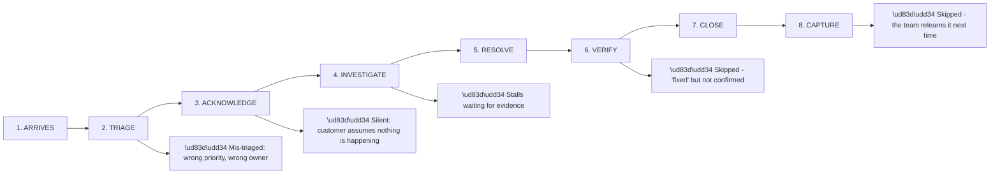
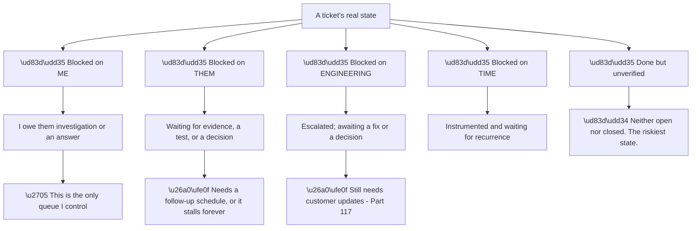
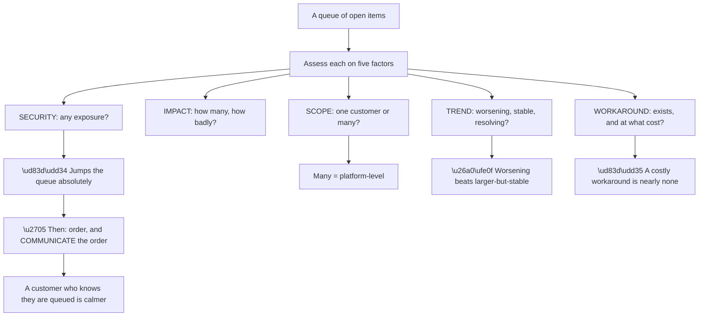
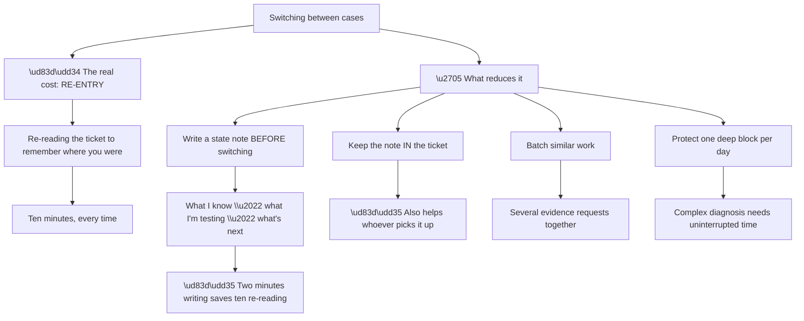
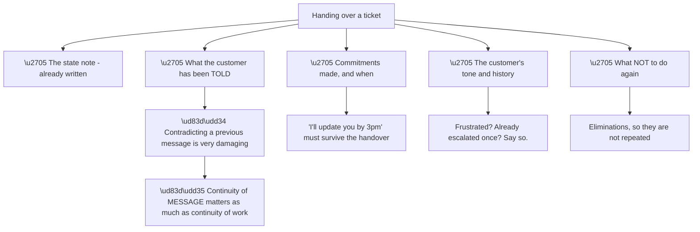
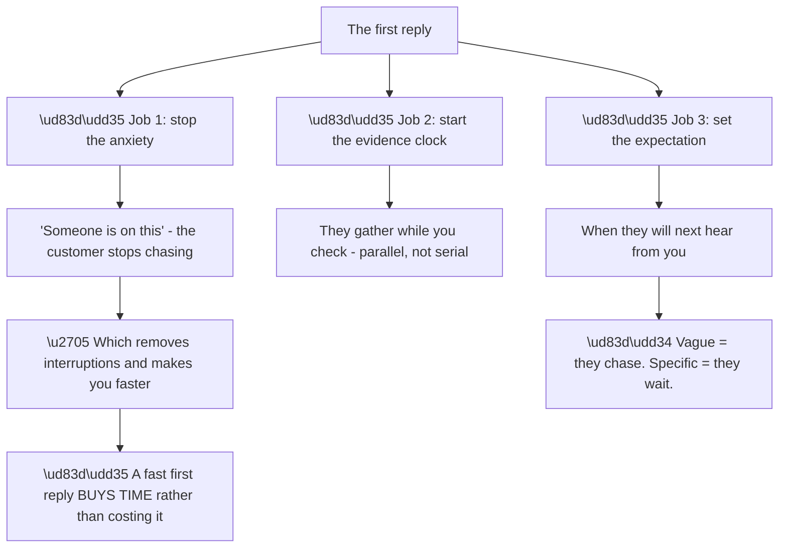
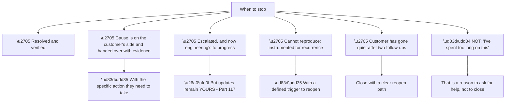
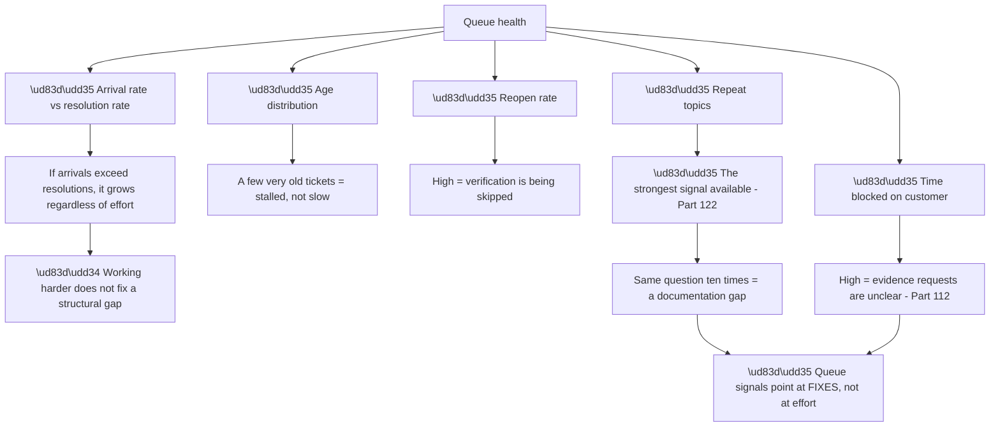
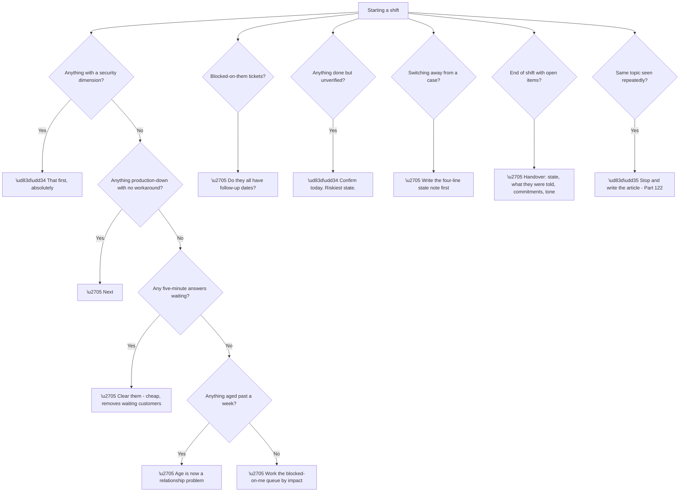

# Part 119 - Ticket Lifecycle, Prioritisation, and Context-Switching

> Section goal: Move from solving one problem to running a queue — how a ticket progresses, how to decide what to work on, and how to switch between cases without losing the thread.

Covers index item **119**. Maps to JD signals: *prioritisation*, *customer-facing communication*, *troubleshooting complex technical issues*, *time management*, *support operations*, *collaboration*.

---

## 1. Start From Zero: The Lifecycle of a Ticket

Every ticket passes through the same stages, and **each has a distinct failure mode.**

**Stages six and eight are the most commonly skipped**, and both cost more than they save.

**Skipping verification** means closing a ticket the customer will reopen — **and reopened tickets are worse than open ones**, because the customer has now had their expectation broken.

**Skipping capture** means the next person investigates from scratch (Part 115).

| Stage | The question it answers |
|---|---|
| Triage | How urgent, and whose is it? |
| Acknowledge | Does the customer know it is being worked? |
| Investigate | What is actually wrong? |
| Resolve | What unblocks them? |
| **Verify** | **Did it actually work for them?** |
| Close | Is there anything outstanding? |
| **Capture** | **Will this help anyone else?** |

> 💡 **Tie-in to your background:** you have owned business-critical escalations end to end. **The lifecycle is familiar; what changes here is volume** — a developer support queue has more concurrent items than an escalation caseload.

### 🔍 Plain-English deep-dive: the states a ticket is actually in

Formal statuses rarely capture what matters operationally: **who is blocked, and on what.**

**Node S1b is the operational insight.** **Only the "blocked on me" queue is under your control**, and it is the one to work through. Everything else needs a *schedule*, not attention.

**Node S2b is the stall that quietly consumes a queue.** A ticket waiting on a customer with no follow-up date **sits indefinitely** — the customer forgets, and it ages until someone escalates about the age rather than the problem.

**The discipline is a follow-up date on every "blocked on them" ticket.** Not a chase — a scheduled check.

| State | What it needs |
|---|---|
| Blocked on me | **Work** |
| Blocked on them | A follow-up date |
| Blocked on engineering | An update cadence for the customer |
| Blocked on time | A recurrence check |
| **Done but unverified** | **Confirmation, today** |

**Node S5a is genuinely risky** because it *feels* finished. **A fix delivered but not confirmed is a ticket that may reopen**, and reopening after closure damages trust more than the original problem did.

**Analogy:** a task list where most items are actually waiting on someone else. Working the list top to bottom is inefficient; separating what you can act on from what needs a reminder is what makes it manageable. **Where it stops:** a reminder assumes someone will respond. Some tickets need a decision about when to stop waiting.

---

## 2. Triage and Prioritisation

Part 111 gave the factors. **This is applying them across a queue rather than to one item.**

**Node O1 is the operational half of prioritisation** and is frequently neglected. **Deciding correctly and not telling anyone produces the same experience as deciding badly** — the deprioritised customer escalates, which costs more time than the update would have.

**A practical ordering heuristic:**

| Order | Category |
|---|---|
| 1 | Anything with a security dimension |
| 2 | Production down, no workaround |
| 3 | Production degraded, or a costly workaround |
| 4 | Multiple customers affected |
| 5 | Blocked development, with a deadline |
| 6 | Blocked development, no deadline |
| 7 | Questions and guidance |
| 8 | Follow-ups and capture |

**Row eight looks like it can always be deferred, and that is the trap.** Capture always loses to anything urgent, **so it never happens unless it is scheduled deliberately** — which is why Part 123 treats it as an operational practice rather than good intentions.

**Two adjustments worth making consciously:**

**Age.** A low-priority ticket that has been open for three weeks **has become a relationship problem** even if it is still technically low priority.

**Cheapness.** A five-minute answer sitting behind a four-hour investigation **should usually go first**, because clearing it costs almost nothing and removes a waiting customer.

---

## 3. Context-Switching

Working several cases at once is the reality, and **the cost is in re-entry, not in the switch itself.**

**Node R is the arithmetic that justifies the habit.** **A two-minute state note saves roughly ten minutes of re-entry**, and on a day with six switches that is close to an hour.

**The note format that works:**

> **State:** confirmed requests reach the tenant; failures start 02:47 UTC; certificate expiry eliminated.
> **Testing:** whether an Action is throwing — checking the log detail.
> **Next:** if confirmed, compare the working and failing user profiles.
> **Waiting on:** nothing.

**Four lines**, and re-entry becomes reading rather than reconstructing.

**Node M2a is the second benefit** and is worth the small effort: **a state note in the ticket lets a colleague take it over** — during handover, at end of shift, or if you are pulled to an incident. **A ticket only you can resume is a single point of failure.**

**Node M4a deserves protection.** Complex diagnosis (Part 118) **needs a continuous block**; done in six-minute fragments between interruptions, it takes far longer and produces worse conclusions.

| Work type | Needs |
|---|---|
| Complex diagnosis | **Uninterrupted block** |
| Evidence requests | Batched |
| Follow-ups | Batched |
| Quick answers | Fill gaps |
| Capture and documentation | **Scheduled, or never** |

---

## 4. Handover and Continuity

Tickets outlive shifts, and **handover quality determines whether the customer notices.**

**Node R is the point customers actually experience.** **Being told something different by the second person is worse than a delay** — it suggests nobody is in control, and it reopens settled questions.

**Node H3a is a specific and avoidable failure.** A commitment made before a handover **is still a commitment**, and missing it because "that was the other person" is not visible to the customer as anything other than a broken promise.

**Node H4a is often omitted as if it were gossip.** It is not: **a customer who has already escalated once, or who is under pressure from their own management, needs different handling** — and withholding that from a colleague sets them up to misjudge the tone.

### 🔍 Plain-English deep-dive: the acknowledgement, and what the first reply is really doing

The first reply looks like a formality. **It is doing three things at once**, and getting it wrong makes everything afterwards harder.

**Node R is the counterintuitive part.** Under pressure the first reply feels like an interruption to the real work. **It is the opposite** — it stops the chasing, starts the customer gathering evidence, and buys the space to be methodical.

| First reply quality | What follows |
|---|---|
| None for 30 minutes | Chase message; possibly an escalation |
| "Looking into it" | Chase message in an hour |
| **Questions + expectation** | **Evidence arrives; they wait** |

**Row three does three jobs in about ninety seconds of writing**, which is a very good return.

**Node J3b is the specific detail that prevents chasing.** *"I'll come back to you"* leaves them guessing and they will check in; *"I'll update you within the hour even if I don't have an answer yet"* **removes the need.** The "even if I don't have an answer" clause matters — without it, silence at the hour mark is a broken commitment.

**And there is a version for the case where you already know the answer:** answer it immediately and completely. **A first reply that resolves the ticket is the best possible outcome**, and the instinct to acknowledge first and answer later is worth resisting when the answer is available now.

**One caution:** a fast acknowledgement that promises more than is realistic **is worse than a slower honest one.** *"We'll have this fixed within the hour"* on something you have not diagnosed sets up a failure that costs more than the delay would have.

**Analogy:** a receptionist who tells you someone is coming and roughly when. The wait is the same length; the experience is entirely different, and you stop asking. **Where it stops:** the reassurance has to be true, or the second wait is much worse than the first.

---

## 5. Knowing When to Stop

Not every ticket resolves, and **recognising the endpoints is a skill.**

**Node S6a is the distinction that matters.** **Time spent is not a resolution.** A ticket that has consumed a day without progress needs **a second opinion or an escalation**, not a closure — and asking a colleague to hear the summary frequently exposes the gap in minutes (Part 111).

**Node S4a is what makes "cannot reproduce" a legitimate stopping point rather than a failure** (Part 112): **instrumented, with a defined trigger, and the customer knows what to send when it recurs.** That is a real outcome.

**Node S5a needs care in the wording.** A customer who has gone quiet may have solved it, may have given up, or may be busy. **Closing with a warm, clear reopen path** — *"I'll close this for now; just reply and it reopens with all the context"* — **is not a dismissal.**

### 🔍 Plain-English deep-dive: the queue as a system, not a list

Managing a queue well is different from working tickets well, and **the difference is thinking about flow rather than items.**

**Node R is the reframing worth carrying.** **Queue metrics are diagnostic, not just descriptive.** A high proportion of time blocked on customers points at unclear evidence requests; a high reopen rate points at skipped verification; repeated topics point at a documentation gap.

| Signal | Likely cause | Fix |
|---|---|---|
| Growing backlog | Structural capacity gap | Deflection, automation, staffing |
| A few very old tickets | Stalled, not slow | Follow-up discipline |
| High reopen rate | Verification skipped | Confirm before closing |
| **Repeat topics** | **Documentation gap** | **Article (Part 122)** |
| Long blocked-on-customer time | Unclear requests | Better templates (Part 112) |
| Many escalations returned | Incomplete packets | Reproduce first (Part 117) |

**Row four is the highest-leverage row in the table.** **Ten tickets on the same topic is ten investigations that could have been one article** — and noticing the repetition requires looking at the queue as a whole rather than item by item.

**Node M1b is worth stating plainly** because effort is the instinctive response to a growing queue: **if arrivals structurally exceed resolutions, working harder delays the problem rather than solving it.** The answers are deflection, automation, or capacity — all of which need the pattern to be visible first.

**And there is an individual version of this** worth applying to your own work: **reviewing your own last twenty tickets for repeated topics** takes twenty minutes and frequently identifies one article that would have prevented several of them.

**Analogy:** a road that is congested. Driving faster does not help; the useful questions are how many cars are joining, where they are stopping, and whether some of them needed to be on the road at all. **Where it stops:** roads have visible queues. A support backlog looks the same at any depth until someone measures it.

---

## 6. Failure Modes

| # | Failure mode | Symptom | Fix |
|---|---|---|---|
| 1 | Silent acknowledgement gap | Customer escalates | Reply within minutes |
| 2 | Mis-triage | Wrong thing worked first | Five factors, then order |
| 3 | Priority not communicated | Deprioritised customer escalates | Say where they are |
| 4 | No follow-up date | Tickets stall indefinitely | Date on every blocked-on-them item |
| 5 | Verification skipped | Reopened tickets | Confirm with the customer |
| 6 | Capture skipped | Team relearns it | Schedule it |
| 7 | No state note | Ten minutes re-entry each switch | Two-minute note |
| 8 | Diagnosis in fragments | Slower, worse conclusions | Protect a deep block |
| 9 | Handover without message history | Contradictory answers | Include what they were told |
| 10 | Commitment lost in handover | Broken promise | Carry commitments explicitly |
| 11 | Closing due to time spent | Unresolved, customer abandoned | Ask for help instead |
| 12 | Closing a quiet customer coldly | Reads as dismissal | Warm close, clear reopen path |
| 13 | Working harder on a growing queue | Backlog grows anyway | Look for structural causes |
| 14 | Not noticing repeat topics | Repeated investigations | Review your own recent tickets |

---

## 7. Troubleshooting Decision Tree: Running the Queue

### Worked example

A shift begins with eleven open items:

| # | Item | Notes |
|---|---|---|
| 1 | Production login failure, no workaround | Arrived 20 minutes ago |
| 2 | Developer question about PKCE | Arrived yesterday |
| 3 | Enterprise connection setup, day three | Blocked on the customer |
| 4 | "Management API secret in our React app" | Mentioned in passing on another ticket |
| 5 | Slow API responses | Two days old |
| 6 | Escalated bug, awaiting engineering | Customer expecting an update today |
| 7 | Fix delivered Friday, unconfirmed | — |
| 8–11 | Four questions, all similar | About callback URL mismatches |

**Item four goes first**, despite being mentioned in passing rather than raised as a ticket. **A Management API secret in front-end code is an active exposure** (Part 106), and exposure accumulates while everything else merely hurts. **It is not the loudest item and it is the most urgent.**

**Item one is second** — production down, no workaround, and recent. **Acknowledge within minutes with the five questions** (Part 118), then run the free checks while waiting.

**Item six is third and takes two minutes.** An update was promised today; **an escalation with no news still needs a message** (Part 117), and delivering it costs nothing while preventing an escalation about the escalation.

**Item seven is fourth and takes one minute.** **Done-but-unverified is the riskiest state** — confirming it either closes cleanly or surfaces a regression before the customer complains about it.

**Items eight to eleven are fifth, and they are the most interesting.** Four similar questions **is a pattern, not four tickets** (Part 122). Answering the first properly and reusing it handles all four in the time of one — **and it identifies a documentation gap worth raising.**

**Item two, the PKCE question, is sixth.** A quick answer, and it removes a waiting customer.

**Item five, the slow API, is seventh** — two days old, real but not blocking.

**Item three needs no work at all**, only a check: **is there a follow-up date?** If not, set one.

**What the ordering demonstrates:**

| Principle | Applied |
|---|---|
| Security first | Item 4, mentioned in passing |
| Impact and trend | Item 1 |
| **Cheap items early** | Items 6, 7 — three minutes total |
| **Patterns over items** | Items 8–11 as one piece of work |
| Blocked items need dates, not attention | Item 3 |

**The two-minute items going early is deliberate**, and it is the least intuitive part: **clearing them removes four waiting customers for almost no cost**, and it prevents the follow-up messages that would otherwise interrupt the deep work on item one.

---

## 8. Lab: Run a Simulated Queue

**Purpose.** Practise triage, state notes, and pattern recognition under realistic conditions.

**Prerequisites.**
- Parts 111–118 completed
- No systems required

**Steps.**

1. **Write twelve synthetic tickets** across the categories in §2, including one security item, one production outage, one done-but-unverified, and three on the same topic.
2. **Triage them** using the five factors. Write your order and a one-line justification each.
3. **Check your order** against §7. Note any differences and why.
4. **Write the first reply** for the top three, timed — target under three minutes each.
5. **Write a four-line state note** for the production item after "twenty minutes of work."
6. **Simulate an interruption**, then use your note to re-enter. **Time the re-entry.**
7. **Write a handover** for the production item: state, what they were told, commitments, tone.
8. **Write the message** to a customer whose ticket you are deprioritising.
9. **Write the warm close** for a customer who has gone quiet.
10. **Identify the pattern** in your three similar tickets and write the article outline.
11. **Review your own last twenty real interactions** — at work, in any context — for repeated topics. **Note what you find without recording any detail.**
12. **Build your queue card:** the ordering heuristic, the state note format, and the handover checklist.

**Expected evidence.**
- Twelve tickets with a justified order
- Three timed first replies
- A state note and a timed re-entry
- A handover document
- A deprioritisation message and a warm close
- A pattern identified with an article outline
- Your queue card

**Validation rubric.**

| Criterion | Pass |
|---|---|
| Security first | Absolutely, even when quiet |
| Cheap items early | You clear two-minute items before deep work |
| Patterns | You treat similar tickets as one piece of work |
| State notes | Four lines; re-entry under two minutes |
| Handover | Includes message history and commitments |
| Communication | You tell deprioritised customers where they are |
| Stopping | You distinguish "stuck" from "spent too long" |

**Cleanup and privacy.** **Use synthetic tickets only.** For step 11, note the *pattern* without recording any case detail — **no customer names, no specifics** (Part 112).

---

## 9. JD Mapping

| JD signal | How this Part addresses it |
|---|---|
| Prioritisation | Five factors applied across a queue |
| Customer-facing communication | Acknowledgement, priority updates, warm closes |
| Time management | Context-switching cost and state notes |
| Support operations | Lifecycle, handover, queue signals |
| Collaboration | Handover quality and asking for help |
| Proactivity | Pattern recognition into documentation |

---

## 10. Candidate Honesty Note

- **Production experience:** owning concurrent business-critical escalations, prioritising under pressure, and handing over cleanly.
- **Production experience:** recognising when to ask for help rather than continuing alone.
- **Lab experience:** running a simulated queue, timing state-note re-entry, and practising deprioritisation messages, as above.
- **Learned architecture:** treating queue signals as diagnostic rather than descriptive.
- **No direct experience:** running a high-volume developer support queue.
- **How to say it:** *"Escalation work is lower volume and higher depth than a developer queue, so the concurrency is what I'd be adapting to. The habits transfer — security first, communicate the priority decision, write a state note before switching, and never close without verifying. What I'd want to build faster is spotting when four tickets are actually one article."*

---

## 11. Official Source Anchors

| Source | Why | Accessed |
|---|---|---|
| Okta Developer Forum — `devforum.okta.com` | Realistic ticket mix and recurring topics | Accessed **26 August 2026** |
| Auth0 Docs — Support | Ticket channels and expectations | Accessed **26 August 2026** |
| Google SRE Book — Incident Management | Handover and role clarity | Accessed **26 August 2026** |

> **Revalidate:** support processes and tooling are organisation-specific. Treat this as principles; learn the actual process on joining.

---

## ⭐ Likely Interview Questions for This Section

### Q1. "You have ten open tickets. How do you decide what to work on?"

> *Model answer:* Five factors, with one override. Anything with a security dimension goes first absolutely — an exposed credential or a data leak keeps accumulating risk while everything else merely hurts, and it is often mentioned in passing rather than raised as a ticket, so it does not announce itself. Then production down with no workaround, weighted by scope and trend, because something worsening will overtake something larger but stable. And I would look at workaround *cost*, since a workaround that means manual intervention on every login is practically no workaround. Two adjustments I make consciously: clear the two-minute items early, because that removes waiting customers almost free and prevents interruptions later; and treat a ticket aged past a week as a relationship problem regardless of its technical priority.

### Q2. "How do you handle deprioritising a customer?"

> *Model answer:* By telling them. Deciding correctly and saying nothing produces the same experience as deciding badly — the customer assumes they have been forgotten and escalates, which costs more time than the update would have. So a short honest message: I am working a production outage for another customer, here is when I expect to be with you, and here is anything you can usefully do meanwhile. Setting an expectation removes their need to chase, which removes interruptions and makes me faster overall. What I would not do is give an optimistic time to make the message easier, because missing it converts a manageable wait into a broken commitment.

### Q3. "What's the cost of context-switching, and how do you manage it?"

> *Model answer:* The cost is in re-entry rather than the switch itself — roughly ten minutes re-reading a ticket to remember where I was. The fix is a two-minute state note written before switching: what I know, what I am testing, what is next, and what I am waiting on. Four lines, and re-entry becomes reading rather than reconstructing. The second benefit is that the note lives in the ticket, so a colleague can take it over during a handover or if I am pulled onto an incident — a ticket only I can resume is a single point of failure. I also try to protect one uninterrupted block for complex diagnosis, because that kind of work done in six-minute fragments takes far longer and reaches worse conclusions.

### Q4. "What goes into a handover?"

> *Model answer:* The state note, obviously, but also three things that are easy to omit. What the customer has already been told, because being given a different answer by the second person is worse than a delay — it suggests nobody is in control and reopens settled questions. Any commitments made and when, because "I'll update you by three" survives the handover even though the person does not. And the customer's tone and history: whether they have already escalated once, or are under pressure from their own management. That last one sometimes feels like gossip and it is not — withholding it sets up the next person to misjudge the tone entirely.

### Q5. "When do you stop working a ticket?"

> *Model answer:* When it is resolved and verified; when the cause is on the customer's side and I have handed it over with specific evidence and a specific action; when it is escalated and now engineering's to progress, though updates remain mine; when I cannot reproduce it but have instrumented for recurrence with a defined trigger to reopen; or when the customer has gone quiet after two follow-ups, which I would close warmly with a clear reopen path. What is not a reason to stop is having spent a long time on it — that is a reason to ask for help or escalate. Asking a colleague to hear the summary often exposes the gap in minutes, because explaining it aloud forces it into a narrative.

### Q6. "You notice four tickets about the same thing. What do you do?"

> *Model answer:* Treat it as one piece of work rather than four. Answer the first properly, reuse it for the rest, and — more importantly — recognise it as a documentation gap. Four tickets on callback URL mismatches means the guidance is not reaching people at the point they need it, and writing one article can prevent the next forty. That is the highest-leverage signal a queue produces, and it only shows up if you look at the queue as a whole rather than item by item. I would also review my own recent interactions periodically for repeated topics, which takes twenty minutes and usually identifies at least one article that would have saved several investigations.

### Q7. "The backlog is growing despite everyone working hard. What does that tell you?"

> *Model answer:* That it is structural rather than an effort problem. If arrivals exceed resolutions consistently, working harder delays the growth rather than reversing it — the answers are deflection through documentation, automation, or capacity, and all of those need the pattern to be visible first. I would also look at the shape rather than just the size: a few very old tickets means stalled rather than slow, which is a follow-up discipline problem. A high reopen rate means verification is being skipped. A lot of time blocked on customers means evidence requests are unclear. And escalations coming back means packets are incomplete. Each of those points at a specific fix rather than at more effort.

### Q8. "What's the riskiest state a ticket can be in?"

> *Model answer:* Done but unverified. It feels finished, so it drops out of attention, and if the fix did not work the customer discovers it themselves and reopens — which is worse than it having stayed open, because their expectation has now been broken. So confirming with the customer is a same-day task rather than a nice-to-have. The related discipline is not declaring an incident resolved myself: I can say the cause is addressed and the mitigation is in place, and they confirm their users can actually work. Getting that wrong once, and having them find it is still broken, costs disproportionate trust.

---

## 🧠 30-Second Memory Hooks

- **Eight stages; verification and capture are the ones skipped.**
- **Real states: blocked on me · them · engineering · time · done-but-unverified.**
- **Only "blocked on me" is a queue. The rest need schedules.**
- **Every blocked-on-them ticket needs a follow-up date.**
- **Done-but-unverified is the riskiest state.**
- **Security jumps the queue absolutely — even when mentioned in passing.**
- **Clear two-minute items early.**
- **Communicate the priority decision, or it reads as neglect.**
- **A four-line state note saves ten minutes of re-entry.**
- **Protect one uninterrupted block for complex diagnosis.**
- **Handover carries: state · what they were told · commitments · tone.**
- **"Spent too long" = ask for help, not close.**
- **Four similar tickets = one article.**
- **Queue signals are diagnostic: reopens, age, blocked time, repeats.**

---

## ✅ Completion Checklist

- [ ] I can name the eight lifecycle stages and the two most skipped
- [ ] I separate blocked-on-me from everything else
- [ ] I put a follow-up date on every blocked-on-them ticket
- [ ] I confirm before closing
- [ ] I put security first even when it arrives quietly
- [ ] I clear cheap items early
- [ ] I communicate priority decisions
- [ ] I write a state note before switching
- [ ] My handovers include message history and commitments
- [ ] I distinguish stuck from spent-too-long
- [ ] I recognise repeat topics as documentation gaps
- [ ] I have run a simulated queue and built my queue card

*Next suggested section:* **[Part 120 - Technical and Non-Technical Communication](Part-120-technical-and-non-technical-communication.md)** — writing for developers, for administrators, and for executives, and knowing which one you are talking to.
