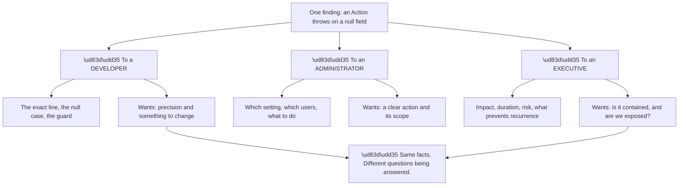
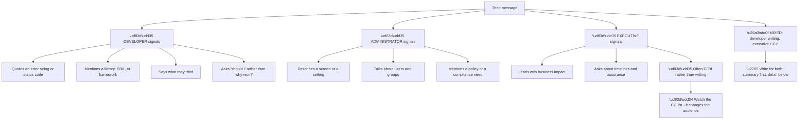
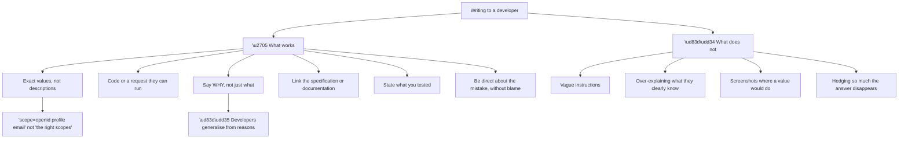
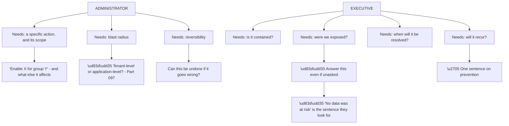
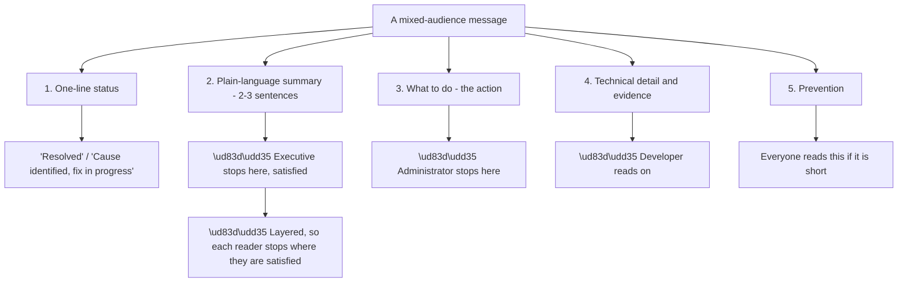
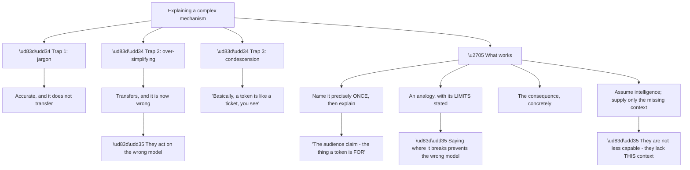
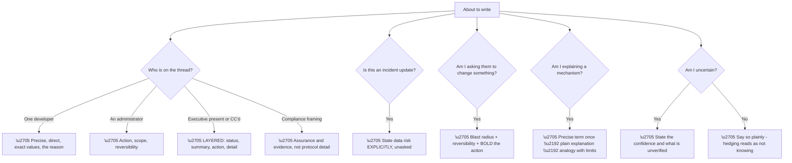

# Part 120 - Technical and Non-Technical Communication

> Section goal: Learn to write for developers, administrators, and executives — and to recognise which one you are actually talking to, because the same information needs three different shapes.

Covers index item **120**. Maps to JD signals: *customer-facing communication*, *technical writing*, *developer support*, *cross-functional collaboration*, *troubleshooting complex technical issues*.

---

## 1. Start From Zero: Three Audiences, Three Needs

The same finding needs three different presentations, and **using the wrong one wastes the message.**

**Node R is the framing.** **You are not simplifying for one audience and elaborating for another** — you are answering different questions. A developer wants to know what to change; an executive wants to know whether they are exposed. **Both are technical questions; they are just not the same one.**

**Getting it wrong in either direction fails:**

| Mistake | Result |
|---|---|
| Code detail to an executive | They cannot assess risk; they ask again |
| High-level summary to a developer | They cannot act; they ask for specifics |
| Jargon to an administrator | They implement the wrong thing |
| Over-simplifying to a developer | Reads as condescending |

**The last row is worth naming.** **Developers notice being talked down to**, and it damages credibility quickly. **Precision is a form of respect** in that audience.

> 💡 **Tie-in to your background:** enterprise support means writing for all three already — engineers, IT administrators, and executives during a CRITSIT. **The audiences are the same; only the technical content changes.**

### 🔍 Plain-English deep-dive: identifying the audience from what they wrote

You rarely get told who you are talking to. **Their message identifies them reliably.**

**Node R is a practical habit.** **The CC list is audience information.** A ticket that acquires an executive recipient mid-thread has changed audience, **and continuing in the same register misses the new reader entirely.**

**Node X1 is the answer to the mixed case**, which is common: **lead with a plain-language summary, then the technical detail below.** The executive reads the first paragraph; the developer reads on. **Nobody is served badly.**

| Signal | Audience | Adjust by |
|---|---|---|
| Error strings and code | Developer | Precision, specifics |
| Screens and settings | Administrator | Actions and scope |
| Impact and timelines | Executive | Summary, risk, containment |
| Executive CC'd | Mixed | **Summary first, detail below** |
| "Is this the right approach?" | Developer, guidance | Trade-offs, not instructions |
| "Our compliance team asks…" | Administrator or executive | Assurance and evidence |

**The last row is worth recognising.** A compliance-framed question **is asking for assurance, not a technical explanation** — and answering it with protocol detail, however accurate, does not address what was asked.

**Analogy:** the same news delivered to a specialist, a manager, and a family member. The facts are identical; what each needs to *do* with them is completely different, and delivering the wrong version helps nobody. **Where it stops:** in person you adjust as you go from their reaction. In writing you only get one attempt, so the structure has to serve everyone at once.

---

## 2. Writing for Developers

Developer communication has its own conventions, and **matching them signals competence.**

**Node W3a is the highest-value convention.** **A developer given a reason can apply it elsewhere**; one given only an instruction cannot. *"Add the `audience` parameter"* fixes one call; *"an access token is always issued for a specific audience, and without one you get a token for the userinfo endpoint"* **prevents the next five questions.**

**Node W6 needs the balance stated.** Developers generally prefer directness — **"this is sending an ID token where an access token is required"** is clearer and better received than an elaborately softened version. **Blame-free is not the same as vague** (Part 115).

**Node B4 is a real failure.** Excessive hedging — *"it might possibly be related to what could be a configuration issue"* — **leaves the reader unsure whether you know.** State the confidence level explicitly instead: **"I'm confident this is X; the one thing I haven't verified is Y."**

**A developer-facing reply that works:**

> Your authorization request doesn't include an `audience` parameter, so the access token you're getting is issued for the `/userinfo` endpoint rather than for your API — that's why your API rejects it. If you decode it you'll see it isn't a JWT at all.
>
> Adding `audience=https://api.yourproduct.com` to the `/authorize` request will give you a JWT with the right `aud`. I tested this against a copy of your configuration in my own tenant.
>
> The underlying rule is that an access token is always *for* something specific — that's what `aud` means — which is also why an ID token can't be used against an API.

**Three paragraphs: the cause with evidence, the fix with confirmation, and the generalisable reason.**

---

## 3. Writing for Administrators and Executives

Both need less technical detail, **for different reasons.**

**Node E2a is the single most useful habit for executive communication.** **State the data-risk position explicitly, unprompted**, in any incident communication. If you do not, it will be asked — **and being asked is worse than volunteering it**, because it suggests it had not been considered.

**Node A2a is the administrator equivalent.** An administrator asked to change a setting **needs to know what else it affects** (Part 097's blast radius) — a tenant-level change made with application-level intent is a common and avoidable incident.

**Node A3a is frequently omitted and always wanted.** *"This is reversible"* or *"note that this cannot be undone"* **changes how carefully someone approaches a change**, and administrators are the people who will be blamed if it goes wrong.

**An executive-facing update:**

> **Summary:** sign-in was failing for approximately 400 of your users between 02:49 and 09:50 UTC today. Service is restored.
>
> **Cause:** a third-party service your login process calls changed its response format overnight, and the integration code was not written to handle the new form.
>
> **Data risk:** none. No data was accessed or exposed; the failure prevented sign-in rather than allowing it.
>
> **Prevention:** three changes, the most important being an alert that would have detected this within minutes rather than six hours. Detail is in the full analysis attached.

**Four short paragraphs**, and the third is the one that gets read twice.

---

## 4. Structure That Serves Everyone

Most real messages have a mixed audience, and **structure resolves it.**

**Node R is the principle: layering, not compromise.** **A message written for the average of three audiences serves none of them**; one layered so each can stop where they are satisfied serves all three.

**The ordering matters and is the opposite of how technical people naturally write.** The instinct is to build up to the conclusion; **the effective structure states the conclusion first** and supports it afterwards.

| Position | Content | Who reads it |
|---|---|---|
| First line | Status | Everyone |
| Paragraph 1 | Plain summary | Everyone; executives stop here |
| Paragraph 2 | The action | Administrators stop here |
| Paragraph 3+ | Technical detail | Developers |
| Last | Prevention | Everyone, if short |

**A practical formatting note:** **bold the action.** In a long message, the one thing the reader must *do* should be visually findable without re-reading — and this is the single cheapest improvement to a technical message.

### 🔍 Plain-English deep-dive: explaining something complicated without dumbing it down

The hard case is explaining a genuinely technical mechanism to someone who lacks the background **without being condescending or inaccurate.**

**Node R is the attitude that makes the difference.** **The reader is not less intelligent; they simply have not spent time in this domain.** Writing from that assumption produces explanations that are precise and respectful at once, and readers detect the difference immediately.

**Node W1a is a specific and effective technique.** **Name the real term once, then explain it** — *"the `aud` claim, which is what a token is issued *for*"*. That gives the reader the vocabulary to search, to read documentation, and to talk to their own engineers, **rather than leaving them with only a metaphor.**

**Node W2a is the technique this entire guide uses.** An analogy with **its limits stated** transfers understanding without installing a wrong model — *"like a ticket for a specific event; where it stops is that a ticket can be checked at the door, whereas a token has to carry its own proof."*

| Technique | Why it works |
|---|---|
| Precise term once, then plain explanation | Gives vocabulary and understanding |
| Analogy with stated limits | Transfers without misleading |
| Concrete consequence | Makes it matter |
| Assume intelligence | Avoids condescension |
| One idea per sentence | Reduces load without simplifying |

**The last row is a writing technique rather than a content one**, and it is the most reliable: **complexity in technical writing usually comes from packed sentences rather than hard ideas.** Splitting them reduces difficulty without removing any accuracy.

**And there is a check worth applying:** **could the reader now explain it back, roughly, to a colleague?** If not, the explanation has not landed regardless of how accurate it was.

**Analogy:** a specialist explaining a diagnosis to a patient. The good ones name the actual condition, explain what it means in ordinary terms, say what happens next, and do not pretend it is simpler than it is. **Where it stops:** a patient can ask follow-up questions in the room. Written communication has to anticipate them.

### 🔍 Plain-English deep-dive: writing when English is not everyone's first language

Support is global, and **a large share of readers are working in their second or third language.** Writing for that is a specific skill, and it improves clarity for everyone.

```mermaid
flowchart TD
    W["Writing for a global audience"] --> H["\ud83d\udd34 What causes trouble"]
    H --> H1["Idioms - 'ballpark', 'down the line', 'circle back'"]
    H --> H2["Phrasal verbs - 'roll out', 'spin up', 'knock out'"]
    H --> H3["Negative questions - 'you don't have X, do you?'"]
    H3 --> H3a["\ud83d\udd34 'Yes' means opposite things in different languages"]
    H --> H4["Sarcasm and understatement"]
    H --> H5["Long sentences with several clauses"]
    W --> G["\u2705 What helps everyone"]
    G --> G1["Short sentences, one idea each"]
    G --> G2["Direct verbs - 'deploy' not 'roll out'"]
    G --> G3["Positive questions - 'do you have X?'"]
    G --> G4["Numbered steps for anything sequential"]
    G --> G5["Repeat the noun rather than using 'it'"]
    G5 --> G5a["\ud83d\udd35 Ambiguous pronouns are the commonest confusion"]
```

**Node G5a is the most useful single technique.** *"Update the connection and then restart it"* — restart what, the connection or the service? **Repeating the noun costs three words and removes the ambiguity entirely**, and native speakers benefit too.

**Node H3a is worth knowing specifically** because it produces confidently wrong answers. In some languages, answering "yes" to *"you don't have MFA enabled, do you?"* **confirms the negative**; in English it does the opposite. **Asking positively — "do you have MFA enabled?" — removes the ambiguity.**

| Avoid | Use |
|---|---|
| "Let's circle back on that" | "I will follow up on Thursday" |
| "Spin up a test tenant" | "Create a test tenant" |
| "You don't use SAML, do you?" | "Do you use SAML?" |
| "That should be fine" | "That will work" — or "I have not tested that" |
| "It needs updating" | "The connection needs updating" |

**Row four is a precision issue as much as a language one.** *"Should be fine"* is ambiguous in any language — **it conflates confidence with permission**, and the reader cannot tell which is meant.

**And there is a broader point worth holding:** none of this is simplification. **Every one of these changes makes the writing clearer for a native speaker too**, which is why style guides recommend them generally rather than as an accommodation.

**One thing to be careful about:** **do not assume limited English means limited technical ability.** A developer writing in imperfect English may be considerably more expert than you are — **adjusting the language while keeping the technical register is correct; dropping both is condescending.**

**Analogy:** signage designed to work for visitors as well as residents — clear symbols, short words, no local slang. It does not serve residents worse; it serves everyone better. **Where it stops:** signage cannot answer a follow-up question, which is why the writing has to anticipate ambiguity rather than rely on clarification.

---

## 5. Failure Modes

| # | Failure mode | Symptom | Fix |
|---|---|---|---|
| 1 | Wrong audience assumed | Message misses entirely | Read the signals; check the CC list |
| 2 | Executive CC ignored | Escalation about communication | Summary first when the audience is mixed |
| 3 | Vague instructions to a developer | Follow-up asking for specifics | Exact values |
| 4 | Over-explaining to a developer | Reads as condescending | Assume competence |
| 5 | Jargon to an administrator | Wrong thing implemented | Name once, then explain |
| 6 | No blast radius given | Unintended wider change | State tenant vs application scope |
| 7 | Reversibility not mentioned | Anxious or reckless change | Say whether it can be undone |
| 8 | Data risk not stated | Asked anyway; looks unconsidered | Volunteer it |
| 9 | Conclusion buried | Not read | Conclusion first |
| 10 | Action not findable | Missed | **Bold the action** |
| 11 | Excessive hedging | Reader unsure you know | State confidence explicitly |
| 12 | Analogy without limits | Wrong model adopted | Say where it breaks |
| 13 | No generalisable reason | The next five questions follow | Explain why |
| 14 | Packed sentences | Reads as complex | One idea per sentence |

---

## 6. Troubleshooting Decision Tree: Choosing the Register

### Worked example

A ticket has been running for two days with a developer. This morning **their VP of Engineering is added to the thread** with: *"Can someone tell me where we are on this?"*

**The audience has changed mid-thread**, and continuing in the previous register would answer nobody's question.

**What the developer still needs:** the technical state and what to do next.
**What the VP needs:** are we contained, were we exposed, when is it fixed, will it recur.

**The layered reply:**

> **Status: cause identified, fix ready to deploy.**
>
> Sign-in has been failing for a subset of your users since Tuesday night. The cause is a third-party service your login process calls, which changed its response format — the integration code was not written to handle the new form, and the resulting error blocks sign-in. **No data was at risk at any point:** the failure prevented access rather than granting it.
>
> **The change needed:** guard the field access in your Post Login Action (line 34) so a null value is handled, and wrap the external call so a future dependency change degrades rather than blocks. I have tested both against a copy of your configuration and confirmed sessions and claim mapping are unaffected.
>
> **Technical detail:** the provider now returns `null` for `verification_status` rather than omitting the field when the input is absent. The Action reads `response.verification_status.level` directly, so the null throws. That is why only users without `email_verified` set are affected — they are the ones producing the input condition.
>
> **Preventing recurrence:** the most valuable change is an alert when successful sign-ins drop below baseline, which would have detected this within minutes rather than the six hours it took. Two further recommendations are in the full analysis.

**Reading it as each audience:**

| Reader | Where they stop | Do they have what they need? |
|---|---|---|
| VP | End of paragraph two | ✅ Contained, no exposure, cause known |
| Manager | End of paragraph three | ✅ Plus the action and that it was tested |
| Developer | Paragraph four | ✅ The line, the mechanism, the population |
| Everyone | Last paragraph | ✅ Prevention, one sentence |

**Three deliberate choices:**

**Data risk stated unprompted**, in the paragraph the VP will definitely read.

**The action bolded**, so it is findable without re-reading.

**The population explanation kept in the technical paragraph** — the VP does not need it, and the developer very much does.

**What would have failed:** replying in the previous technical register, which leaves the VP to ask again; or switching entirely to a summary, which abandons the developer mid-investigation. **Layering serves both without compromise.**

---

## 7. Lab: Write the Same Finding Three Ways

**Purpose.** Build the habit of matching register to audience, and test whether your writing actually lands.

**Prerequisites.**
- Parts 111–119 completed
- Ideally, a reader who is not technical

**Steps.**

1. **Take one finding** from this guide — the transient NameID duplicate problem works well.
2. **Write it for a developer:** exact values, the mechanism, the fix, the generalisable reason. **Maximum 150 words.**
3. **Write it for an administrator:** the action, its scope, and whether it is reversible. **Maximum 100 words.**
4. **Write it for an executive:** impact, containment, data risk, prevention. **Maximum 80 words.**
5. **Write the layered version** that serves all three in one message.
6. **Test the executive version** on a non-technical reader. **Ask them what happened and what needs to be done.** If they cannot say, rewrite.
7. **Test the developer version** on someone technical. **Ask whether anything is missing.**
8. **Rewrite three hedged sentences** from your own past writing into confident ones with explicit uncertainty.
9. **Write an analogy** for a token audience, **with its limits stated.**
10. **Take a packed sentence** and split it into one idea per sentence. Compare readability.
11. **Write an incident update** that states data risk unprompted.
12. **Build your communication card:** audience signals, the layered structure, and the phrases you will reuse.

**Expected evidence.**
- Three versions of one finding, within word limits
- A layered version
- Feedback from a non-technical reader
- Feedback from a technical reader
- Three rewritten hedged sentences
- An analogy with stated limits
- A split-sentence comparison
- Your communication card

**Validation rubric.**

| Criterion | Pass |
|---|---|
| Audience identification | You can read the signals from a message |
| Developer register | Exact, direct, with a reason |
| Administrator register | Action, scope, reversibility |
| Executive register | Impact, containment, data risk, prevention |
| Layering | Each reader can stop where satisfied |
| Testing | A non-technical reader understood the executive version |
| Confidence | You state it rather than hedging |
| Analogies | Limits stated |

**Cleanup and privacy.** **Use only this guide's findings or synthetic ones.** Do not use a real customer's incident, even anonymised, and **do not share any real past writing containing customer detail** with your test readers.

---

## 8. JD Mapping

| JD signal | How this Part addresses it |
|---|---|
| Customer-facing communication | Three registers and the layered structure |
| Technical writing | Precision, structure, and readability |
| Developer support | Developer conventions specifically |
| Cross-functional collaboration | Writing for mixed audiences |
| Troubleshooting complex technical issues | Explaining mechanisms accurately |

---

## 9. Candidate Honesty Note

- **Production experience:** writing for engineers, IT administrators, and executives, including during CRITSITs where all three are on one thread.
- **Production experience:** CSAT of 4.75+ enterprise and 4.85+ SMB, which reflects communication as much as technical resolution.
- **Lab experience:** deliberately writing one finding three ways and testing comprehension with real readers, as above.
- **Learned architecture:** developer-specific conventions and the layered structure for mixed audiences.
- **No direct experience:** developer-facing written support at volume for this product.
- **How to say it:** *"Writing for mixed audiences is something I do routinely — CRITSITs put engineers and executives on the same thread. What's newer is the developer register specifically: more precision, exact values, and always giving the reason rather than just the instruction, because developers generalise from reasons and that prevents the next five questions."*

---

## 10. Official Source Anchors

| Source | Why | Accessed |
|---|---|---|
| Auth0 Docs | A model of developer-facing technical writing | Accessed **26 August 2026** |
| Okta Developer Forum — `devforum.okta.com` | How developers phrase questions and expect answers | Accessed **26 August 2026** |
| Google Developer Documentation Style Guide | Conventions for technical writing | Accessed **26 August 2026** |
| Plain English Campaign guidance | Structuring for non-specialist readers | Accessed **26 August 2026** |

> **Revalidate:** style conventions are stable; product terminology is not. Re-check current product names before writing anything customer-facing.

---

## ⭐ Likely Interview Questions for This Section

### Q1. "How do you adjust how you write for different audiences?"

> *Model answer:* By recognising that they are asking different questions rather than needing different amounts of detail. A developer wants to know what to change, so they need exact values, the mechanism, and ideally the reason — because developers generalise from reasons, and giving one prevents the next several questions. An administrator wants a specific action, its blast radius, and whether it is reversible, because they are the person who will be blamed if it goes wrong. An executive wants to know whether it is contained, whether there was any data exposure, when it will be resolved, and whether it will recur. All three are technical questions; they are just not the same one, and answering the wrong one wastes the message.

### Q2. "How do you know which audience you're writing to?"

> *Model answer:* Their message tells you. Quoting an error string, naming a library, or saying what they already tried is a developer. Describing a screen or a setting, or talking about users and groups, is an administrator. Leading with business impact or asking about timelines and assurance is an executive. And the CC list is audience information — a thread that acquires an executive recipient mid-way has changed audience, and continuing in the previous register misses the new reader entirely. When it is mixed, which is common, I layer it: status line, plain summary, the action, then technical detail, so each reader can stop where they are satisfied.

### Q3. "What do developers specifically want from a support reply?"

> *Model answer:* Precision and a reason. Exact values rather than descriptions — `scope=openid profile email` rather than "the right scopes." Something they can run. Directness about what is wrong, without elaborate softening, because blame-free is not the same as vague. Links to the specification or documentation so they can verify. And crucially, the underlying reason: "add the audience parameter" fixes one call, whereas "an access token is always issued for a specific audience, and without one you get a token for userinfo" prevents the next five questions. What does not work is over-explaining things they clearly know, which reads as condescending and costs credibility quickly.

### Q4. "What's the one sentence executives always want in an incident update?"

> *Model answer:* Whether data was at risk — and I would state it explicitly even when nobody asked. If it is not there, it will be asked, and being asked is worse than volunteering it because it suggests it had not been considered. So in any incident communication I include something like "no data was accessed or exposed; the failure prevented sign-in rather than granting it," placed in the paragraph the executive will definitely read. The other three things they need are containment, expected resolution, and one sentence on prevention. Four short paragraphs covers it, and the data-risk one is the paragraph that gets read twice.

### Q5. "How do you explain something complex without dumbing it down?"

> *Model answer:* By assuming the reader is intelligent and simply lacks this particular context, which is almost always true. The technique that works is naming the real term precisely once and then explaining it — "the `aud` claim, which is what a token is issued *for*" — because that gives them vocabulary they can search and use with their own engineers rather than leaving them with only a metaphor. Then an analogy with its limits stated, because an unbounded analogy installs a wrong model that they then act on. And one idea per sentence: most difficulty in technical writing comes from packed sentences rather than hard ideas, so splitting them reduces load without removing accuracy. The check I apply is whether they could now explain it back roughly to a colleague.

### Q6. "Is there a risk in being too careful with your language?"

> *Model answer:* Yes — excessive hedging leaves the reader unsure whether you actually know. "It might possibly be related to what could be a configuration issue" contains no information and undermines confidence. The better approach is to state the confidence level explicitly: "I'm confident this is the cause; the one thing I haven't verified is whether it also affects your staging tenant." That is honest about uncertainty without being vague about what I do know. The same applies to directness generally — with developers especially, a clear statement of what is wrong is better received than a heavily softened one, as long as it describes the system rather than the person.

### Q7. "What would you include when asking an administrator to change a setting?"

> *Model answer:* Three things beyond the change itself. The blast radius, because tenant-level and application-level settings look similar in an interface and a tenant-level change made with application-level intent is a common and avoidable incident. Whether it is reversible, which changes how carefully they approach it and is almost always wanted and rarely offered. And the specific scope — which users or which application — so they are not guessing. I would also bold the action, because in a long message the one thing the reader must actually do should be findable without re-reading. That single formatting habit is probably the cheapest improvement available to a technical message.

### Q8. "An executive is added to a long technical thread. What do you do?"

> *Model answer:* Switch to a layered structure rather than either continuing technically or abandoning the developer. Status line first, then a plain-language summary with the data-risk position stated, then the bolded action and confirmation that it was tested, then the technical detail for the developer, then one line on prevention. Read as an executive, the first two paragraphs answer everything they asked. Read as a developer, the technical paragraph continues where we left off. Neither is served worse than before. The failure modes are replying in the previous register, which leaves the executive to ask again, or switching entirely to a summary, which abandons the developer mid-investigation.

---

## 🧠 30-Second Memory Hooks

- **Three audiences ask three different questions, not three detail levels.**
- **Developer: exact values, direct, and the REASON.**
- **Administrator: action, blast radius, reversibility.**
- **Executive: contained? exposed? when? will it recur?**
- **"No data was at risk" — state it unprompted.**
- **Read the signals; watch the CC list.**
- **Mixed audience → LAYER it. Each reader stops where satisfied.**
- **Conclusion first, support afterwards.**
- **Bold the action.**
- **Hedging reads as not knowing.** State confidence explicitly.
- **Name the real term once, then explain it.**
- **Analogies must state their limits.**
- **One idea per sentence.**
- **Reasons prevent the next five questions.**

---

## ✅ Completion Checklist

- [ ] I can identify the audience from their message and the CC list
- [ ] I write to developers with exact values and the reason
- [ ] I give administrators scope and reversibility
- [ ] I answer the executive's four questions
- [ ] I state data risk unprompted in incident updates
- [ ] I layer mixed-audience messages
- [ ] I put the conclusion first and bold the action
- [ ] I state confidence rather than hedging
- [ ] My analogies state their limits
- [ ] I have written one finding three ways and tested comprehension

*Next suggested section:* **[Part 121 - Difficult Conversations, De-escalation, and Incident Communication](Part-121-difficult-conversations-de-escalation-and-incident-communication.md)** — what to say when the customer is angry, the news is bad, or the answer is no.
