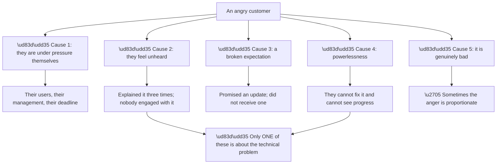
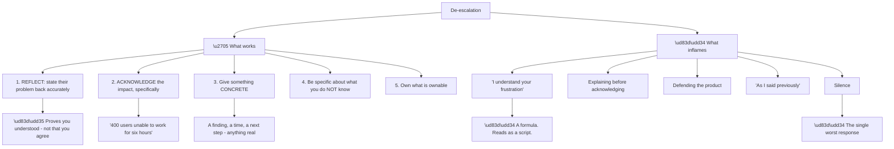
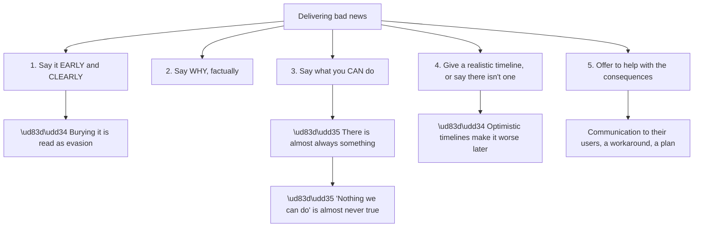
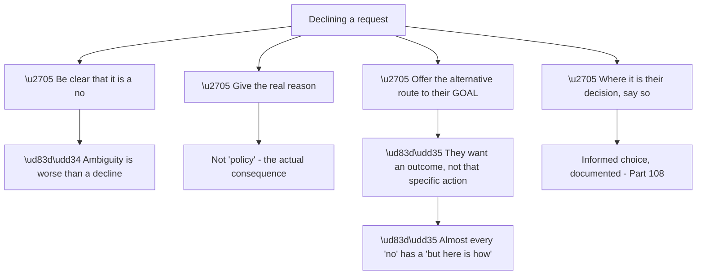
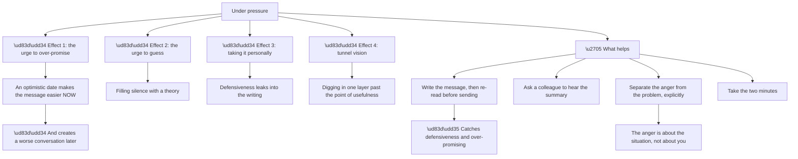
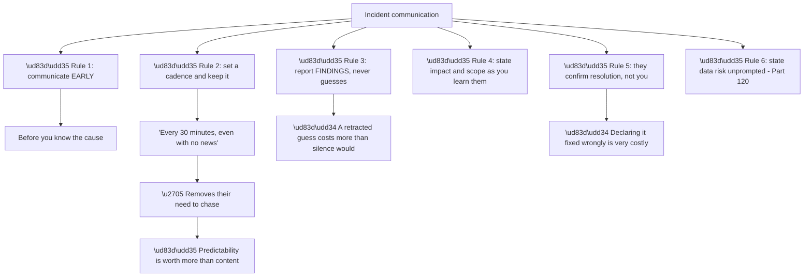
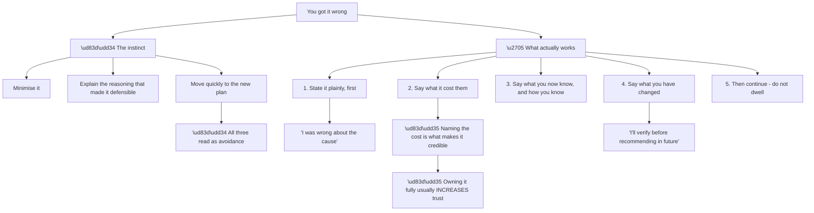
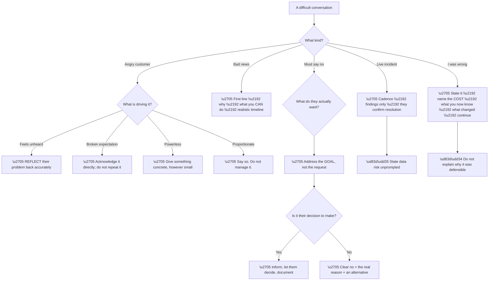

# Part 121 - Difficult Conversations, De-escalation, and Incident Communication

> Section goal: Learn what to say when the customer is angry, the news is bad, or the answer is no — and how to communicate during an incident when you do not yet have answers.

Covers index item **121**. Maps to JD signals: *customer-facing communication*, *de-escalation*, *incident management*, *cross-functional collaboration*, *prioritisation*, *resilience*.

---

## 1. Start From Zero: Why Customers Get Angry

Anger in support is almost never about the person receiving it, and **understanding what is actually driving it changes how you respond.**

**Node R is the observation that makes de-escalation possible.** **Four of the five causes are not technical**, so fixing the technical problem faster does not address them — **and continuing to send technical updates to someone who feels unheard makes it worse.**

**Node C5a deserves respect rather than technique.** Sometimes the anger is **entirely proportionate** — a customer whose product has been down for six hours and who was told twice it was fixed **is right to be angry.** Treating proportionate anger as something to manage is itself insulting.

| Driver | What actually helps |
|---|---|
| Under pressure | Speed, and something they can tell their people |
| **Feels unheard** | **Reflect back what they said, accurately** |
| Broken expectation | Acknowledge it directly; do not repeat it |
| Powerlessness | Visible progress, however small |
| Genuinely bad | Acknowledge; do not manage |

**Row two is the highest-yield single move**, and it is covered in §2.

> 💡 **Tie-in to your background:** CRITSIT work means difficult conversations under pressure are familiar. **CSAT of 4.75+ enterprise suggests this is a strength**, and it is worth being able to describe *what you actually do* rather than just citing the number.

### 🔍 Plain-English deep-dive: the moves that de-escalate, and the ones that inflame

De-escalation is a small set of concrete moves. **They are learnable and they work; the instinctive responses mostly do not.**

**Node W1a is the most effective move available**, and it is under-used because it feels like it does nothing. **Stating the problem back accurately proves you understood it** — which addresses the "feels unheard" driver directly, and it costs one sentence.

**It must be accurate rather than generic.** *"So you're seeing about 400 users blocked since 2am, and the second fix we suggested didn't hold"* **demonstrates listening**; *"I understand you're having login issues"* demonstrates nothing.

**Node B1a is worth naming explicitly** because it is taught as a de-escalation phrase and has become recognisable as a script. **"I understand your frustration" signals that a formula is being applied**, which is the opposite of being heard. **Describing the actual situation does the same job genuinely.**

**Node B2 is the ordering error.** Explaining the cause before acknowledging the impact **reads as deflection**, even when the explanation is correct and helpful. **Acknowledge, then explain** — the same two facts land completely differently in that order.

**Node B5a is the worst response** and the most common under pressure, because a difficult message is unpleasant to write. **Silence confirms every negative interpretation the customer has**, and each hour of it makes the eventual message harder.

| Instead of | Say |
|---|---|
| "I understand your frustration" | "Six hours with 400 users blocked is a serious impact" |
| "As I said previously…" | "To confirm where we are…" |
| "That's expected behaviour" | "That's how it currently works, and here's what could change it" |
| "There's nothing I can do" | "I can't change X; here's what I can do" |
| Silence while investigating | "No answer yet; here's what I've established" |

**Analogy:** someone reporting a serious problem who is met with a sympathetic noise and a policy statement. The problem may be handled correctly and they will still leave feeling dismissed, because nobody demonstrated they had understood it. **Where it stops:** in person, tone carries some of the acknowledgement. In writing, it has to be explicit or it is absent.

---

## 2. Delivering Bad News

Some news is genuinely bad: it will not be fixed soon, it is working as designed, or the cause is theirs.

**Node S1a is the ordering rule.** Bad news placed after three paragraphs of context **reads as an attempt to soften it**, and customers notice. **State it in the first line**, then explain.

**Node S4a is where good intentions cause damage.** An optimistic timeline given to make a difficult message easier **converts one disappointment into two** — and the second is worse, because a commitment was broken.

**"I don't have a timeline yet, and I'll tell you as soon as I do"** is unwelcome and honest, and it survives contact with reality.

**Node S3a is the part that separates a useful message from a merely accurate one.** Even when the answer is no:

| Situation | What you can still do |
|---|---|
| Not fixable soon | A workaround, and a realistic date |
| Working as designed | Explain what *would* change the outcome |
| Cause is theirs | Precise evidence they can act on |
| Feature does not exist | Route it as product feedback, and say so |
| Cannot share information | Explain the constraint, offer what you can |

**Every row leaves them with something**, which is the difference between a difficult message and an abandonment.

**And "working as designed" needs the treatment from Part 095.** It is often literally true and it **reliably sounds dismissive.** *"That's how it currently works, here's why, and here's what could change the outcome for you"* says the same thing and leaves them with options.

---

## 3. Saying No

Some requests must be declined — insecure workarounds, information you cannot share, commitments you cannot make.

**Node N3a is the reframing that makes most declines workable.** A customer asking to disable certificate validation **does not want weaker security** — they want to be unblocked. **Addressing the goal rather than the request** usually finds a route.

**Node N1a is worth stating.** A soft, ambiguous decline that the customer reads as a maybe **produces a worse conversation later** when they discover it was a no. **Clear and kind beats vague and gentle.**

**Node N4a is the boundary from Part 108.** Where something is genuinely the customer's decision to make — a configurable control, an accepted risk — **the role is to ensure the decision is informed, not to prevent it.** Documenting it protects both parties.

**What must never be conceded:**

| Request | Response |
|---|---|
| Disable TLS or certificate validation | ❌ Never. Offer the secure route. |
| Skip token validation | ❌ Never. |
| Share another customer's information | ❌ Never. |
| Bypass a security control we operate | ❌ Never. |
| Commit to a date you do not control | ❌ Never. |
| Confirm something you have not verified | ❌ Never. |

**The last two are the ones that erode under pressure**, and both cause more damage than the refusal would have. **A date you cannot keep and a confirmation you cannot support both fail publicly and later.**

### 🔍 Plain-English deep-dive: staying steady when the pressure is on you

Difficult conversations are usually discussed from the customer's side. **The engineer's own state affects the outcome as much as the technique does.**

**Node M1a is the single most effective habit** and the easiest to skip. **Re-reading a message before sending catches both over-promising and defensiveness**, which are the two failures that cost most — and under pressure both feel reasonable while writing and obvious on a second read.

| Under pressure you write | On re-reading you notice |
|---|---|
| "We should have this fixed shortly" | You do not know that |
| "As I explained earlier…" | Defensive |
| "This is likely a caching issue" | A guess |
| "That's not something we support" | No alternative offered |
| "I'll get back to you" | No time given |

**Node M3a is worth holding onto genuinely rather than as a coping phrase.** **A customer's anger is about their situation** — their users, their management, their deadline. **Reading it as a personal attack produces defensiveness**, and defensiveness is visible in writing even when the words are polite.

**Node M4 is the practical version.** **Two minutes between reading an angry message and replying** is almost always available, and it materially changes the reply. **The pressure to respond instantly is usually self-imposed** — a considered reply two minutes later is better than an immediate defensive one.

**And there is a longer-run point about sustainability.** Difficult conversations are draining, and **an engineer who is depleted makes worse judgements** — over-promising, guessing, and tunnel vision all increase. **Recognising that state and asking for support is professional rather than weak**, and it is the same reasoning as asking for help on a stuck ticket (Part 119).

**Analogy:** a clinician after a difficult consultation who takes a moment before the next one. Not indulgence — the next patient gets better care for it. **Where it stops:** the moment has to be actually taken, and under load it is the first thing dropped.

---

## 4. Incident Communication

During an incident you must communicate **before you have answers**, which is a distinct skill.

**Node V is the counterintuitive finding.** **A customer receiving a predictable update saying "no change yet" is calmer than one receiving occasional detailed updates at unpredictable intervals.** Predictability removes the anxiety; content does not.

**Node R3a is the discipline that holds under pressure.** The urge to offer a theory is strong when the customer is waiting. **A retracted guess costs more than the silence would have**, because it makes every subsequent statement provisional in their mind.

**The distinction to hold:** *"requests are reaching us and failures start at 02:47 UTC"* is a **finding**. *"It might be a certificate"* is a **guess.** The first demonstrates progress safely; the second creates a debt.

**A cadence message with no news:**

> No change to report yet. What I've established: requests are reaching us normally, the failures began at 02:47 UTC, and certificate expiry is ruled out. I'm currently examining what changed at that time. Next update within 30 minutes.

**Four sentences: honest, specific, demonstrably progressing, and predictable.**

### 🔍 Plain-English deep-dive: when the customer is right and you were wrong

The hardest conversation is **admitting an error** — a wrong diagnosis, a fix that broke something, a missed commitment.

**Node R is consistently true and consistently surprising.** **A clean, complete admission of error usually strengthens a relationship**, because it demonstrates that what you say can be relied on — including when it is unfavourable to you.

**Node G2a is the element most often omitted.** *"I was wrong"* is incomplete; **"I was wrong, and that cost you two hours"** is what makes it land. Acknowledging the cost is what distinguishes an apology from a formality.

**Node B2 is the instinct to resist most.** Explaining why the wrong conclusion was reasonable **is defensible and it reads as excuse-making**, particularly in the same message as the admission. **If the reasoning is genuinely useful — because it prevents a recurrence — it belongs in a later message**, not this one.

| Element | Example |
|---|---|
| Plain statement | "I was wrong about the cause." |
| **The cost** | **"That cost you about two hours."** |
| What you now know | "The actual cause is X; here's the evidence." |
| What changed | "I'll reproduce before recommending in future." |
| Continue | "Here's the plan from here." |

**Node G5 matters too.** **Over-apologising shifts the burden onto the customer** to reassure you, which is not their job during their own incident. **State it once, completely, and move on.**

**And the same applies to a missed commitment.** *"I said I'd update you by three and I didn't — that was my error. Here's where we are."* **One sentence, owned, then continue.** Explaining why you were busy does not help them.

**Analogy:** a professional who tells you plainly that their earlier assessment was wrong, what it cost you, and what they now believe — versus one who quietly revises their position and hopes you did not notice. Only one of those is someone you would use again. **Where it stops:** trust rebuilt this way still needs subsequent accuracy; the admission buys a chance, not a reset.

---

## 5. Failure Modes

| # | Failure mode | Symptom | Fix |
|---|---|---|---|
| 1 | Explaining before acknowledging | Reads as deflection | Acknowledge, then explain |
| 2 | Formula phrases | Reads as a script | Describe the actual situation |
| 3 | Silence while investigating | Anger escalates | Cadence with findings |
| 4 | Guessing to fill silence | Retraction; credibility lost | Report findings only |
| 5 | Bad news buried | Read as evasion | First line |
| 6 | Optimistic timeline | Two disappointments | Realistic, or none |
| 7 | "Nothing we can do" | Abandonment | Offer what you can |
| 8 | "Working as designed" | Dismissive | Explain what would change it |
| 9 | Ambiguous decline | Worse conversation later | Clear and kind |
| 10 | Declining without an alternative | Customer blocked | Address the goal |
| 11 | Committing to a date you do not control | Broken commitment | Never |
| 12 | Declaring resolution yourself | Trust damage if wrong | They confirm |
| 13 | Minimising an error | Reads as avoidance | State it, name the cost |
| 14 | Over-apologising | Burden shifts to them | Once, completely, move on |
| 15 | Treating proportionate anger as a problem | Insulting | Acknowledge that it is warranted |

---

## 6. Troubleshooting Decision Tree: Difficult Conversations

### Worked example

Day three of an incident. The customer writes:

> *"This is completely unacceptable. You told us on Monday this was fixed. It wasn't. You told us yesterday you'd update us by 4pm. You didn't. We have customers cancelling. I want to speak to someone senior."*

**Three separate things**, and conflating them would fail.

**Two broken commitments — both true.** A wrongly-declared fix and a missed update. **These are not perceptions to manage; they are facts to own.**

**A genuine business impact:** customers cancelling.

**An escalation request**, which is legitimate and should not be resisted.

**What not to do:** lead with the technical update. **Every commitment failure must be addressed first**, or nothing after it will be read.

**The reply:**

> You're right on both counts, and I'm sorry. We said on Monday this was resolved when it wasn't — we didn't verify it with you before declaring it, and that was our error. And I committed to an update by 4pm yesterday and didn't send one. Both of those made a bad situation worse.
>
> **Where we actually are:** the cause is confirmed — [specific mechanism] — and I've reproduced it in a test environment, which is why I'm confident this time rather than hoping. The fix is [specific], and I've tested that it resolves it without affecting your sessions or claim mapping.
>
> **What I'm committing to now:** I'll update you at 11:00 and 15:00 today, whether or not there is news. I won't tell you this is resolved — I'll tell you when the fix is deployed and ask you to confirm your users can work.
>
> On escalation: I've asked [name/role] to join this thread, and they'll be across the history. That's reasonable given where we are.
>
> I know customers cancelling is the part that actually matters. If a written summary would help you communicate internally, I can have one to you within the hour.

**Reading the structure:**

| Element | Where |
|---|---|
| **Own both failures, first, without excuse** | Paragraph 1 |
| Name what it cost | "made a bad situation worse" |
| **Findings, not guesses** — and why confidence differs now | Paragraph 2 |
| **A specific, keepable cadence** | Paragraph 3 |
| **They confirm resolution, not us** | Paragraph 3 |
| Escalation accepted, not resisted | Paragraph 4 |
| Acknowledge the real impact; offer help with it | Paragraph 5 |

**Three choices that matter most:**

**No explanation of why the Monday call was defensible.** It may well have been; **saying so now would read as excuse-making** and would undermine the apology.

**"I'm confident this time rather than hoping"** — naming the difference **directly addresses why they should believe this one**, which is the actual question behind their message.

**The last paragraph** acknowledges that cancellations, not the technical fix, are what they are dealing with — **and offers something useful for that specific problem.**

**What made this work:** treating the broken commitments as the primary content. **The technical progress was real and would have been ignored** had it come first.

---

## 7. Lab: Practise the Hard Messages

**Purpose.** Write the difficult messages before you need them, so the structure is available under pressure.

**Prerequisites.**
- Parts 111–120 completed
- **Synthetic scenarios only**

**Steps.**

1. **Write the angry-customer message** from §6 in your own words, then write your reply.
2. **Check your reply** against the seven structural elements. Note any you omitted.
3. **Write a bad-news message:** no fix for at least a month, no workaround. **Include what you can still do.**
4. **Write a "working as designed" message** that does not use that phrase.
5. **Write three declines:** an insecure workaround, information you cannot share, and a date you do not control. **Each with an alternative.**
6. **Write four incident cadence messages** at 30-minute intervals — the first two with no new findings. **Confirm none contains a guess.**
7. **Write an error admission:** a wrong diagnosis that cost the customer two hours. **Name the cost. Do not justify.**
8. **Write a missed-commitment admission** in one sentence.
9. **Rewrite five formula phrases** from the §1 table into genuine ones.
10. **Read each message aloud.** Anything that sounds like a script gets rewritten.
11. **Have someone read the angry-customer reply** and tell you how it lands.
12. **Build your difficult-conversation card:** de-escalation moves, the bad-news structure, the decline structure, incident rules, and the error-admission elements.

**Expected evidence.**
- An angry-customer exchange with structural check
- A bad-news message with alternatives
- A "working as designed" message avoiding the phrase
- Three declines with alternatives
- Four cadence messages, guess-free
- An error admission naming the cost
- A one-sentence missed-commitment admission
- Five rewritten phrases
- Feedback from a reader
- Your card

**Validation rubric.**

| Criterion | Pass |
|---|---|
| Acknowledge first | Always before explaining |
| No formulas | Nothing sounds scripted |
| Bad news early | First line |
| Realistic timelines | Or none, honestly |
| Declines | Clear, reasoned, with an alternative |
| Incident cadence | Predictable, findings only |
| Error admission | States the cost, no justification |
| Reads well aloud | No script detectable |

**Cleanup and privacy.** **Synthetic scenarios only.** Do not reconstruct a real difficult conversation with a real customer, and **do not share real past correspondence** with your test reader.

---

## 8. JD Mapping

| JD signal | How this Part addresses it |
|---|---|
| Customer-facing communication | The hardest cases, with structures |
| De-escalation | Concrete moves and what inflames |
| Incident management | Cadence, findings-only, resolution confirmation |
| Cross-functional collaboration | Accepting escalation gracefully |
| Prioritisation | Commitment discipline |
| Resilience | Owning errors cleanly |

---

## 9. Candidate Honesty Note

- **Production experience:** difficult conversations during CRITSITs, including delivering bad news and handling escalation requests.
- **Production experience:** CSAT of 4.75+ enterprise and 4.85+ SMB, with 100+ recognitions — evidence that this is a strength rather than an assertion.
- **Lab experience:** writing the hard messages deliberately and testing how they land, as above.
- **Learned architecture:** the specific de-escalation moves and the error-admission structure.
- **No direct experience:** these conversations in this product's context.
- **How to say it:** *"This is the part of support I'd point to most confidently. What I'd describe rather than just citing CSAT is what I actually do: acknowledge before explaining, reflect their problem back accurately rather than using a formula, keep a cadence during incidents even with no news, report findings and never guesses, and own errors plainly including what they cost."*

---

## 10. Official Source Anchors

| Source | Why | Accessed |
|---|---|---|
| Google SRE Book — Incident Management | Communication roles and cadence | Accessed **26 August 2026** |
| Atlassian — Incident communication guidance | Status updates during unresolved incidents | Accessed **26 August 2026** |
| Okta — company values | "Love our customers" as an operating principle | Accessed **26 August 2026** |

> **Revalidate:** communication principles are stable. Organisation-specific escalation paths are not — learn them on joining.

---

## ⭐ Likely Interview Questions for This Section

### Q1. "A customer is furious. What do you do first?"

> *Model answer:* Reflect their problem back accurately, before explaining anything. Most anger in support is not about the technical problem — it is being under pressure themselves, feeling unheard, a broken expectation, or powerlessness. Only one of those is fixed by technical progress. Stating their situation back specifically — "400 users blocked since 2am and the second fix didn't hold" — proves I understood, which addresses the commonest driver directly and costs one sentence. What I avoid is "I understand your frustration," because it is a recognisable formula and signals that a script is being applied rather than that anyone listened. And I would explain only after acknowledging, because the same two facts in the other order read as deflection.

### Q2. "How do you deliver news the customer won't want?"

> *Model answer:* Say it in the first line. Bad news placed after three paragraphs of context reads as an attempt to soften it, and customers notice. Then the reason, factually. Then what I can still do, because "nothing we can do" is almost never true — there is usually a workaround, an explanation of what would change the outcome, or a route to product feedback. Then a realistic timeline, or an honest statement that I don't have one yet. That last part matters: an optimistic date given to make the message easier converts one disappointment into two, and the second is worse because a commitment was broken.

### Q3. "How do you say no?"

> *Model answer:* Clearly, with the real reason, and with an alternative route to what they actually want. A soft ambiguous decline the customer reads as a maybe produces a much worse conversation later. The reframing that makes most declines workable is that they want an outcome, not that specific action — someone asking to disable certificate validation does not want weaker security, they want to be unblocked, so addressing the goal usually finds a route. Where it is genuinely their decision to make, on a control they configure, my job is to ensure the decision is informed rather than to prevent it, and to document it. What I would never concede is disabling security controls we operate, sharing another customer's information, committing to a date I don't control, or confirming something I haven't verified.

### Q4. "How do you communicate during an incident when you don't have answers?"

> *Model answer:* Set a cadence and keep it, and report findings rather than guesses. The counterintuitive part is that predictability matters more than content — a customer getting a reliable update saying "no change yet" is calmer than one getting occasional detailed updates at unpredictable intervals, because predictability removes the need to chase. So I'd say "I'll update you every thirty minutes whether or not there's news" and then do it. Each update contains what I've established — requests are arriving, failures start at 02:47, certificate expiry ruled out — which demonstrates progress honestly. What I won't do is offer a theory to fill the silence, because a retracted guess makes everything I say afterwards provisional in their mind.

### Q5. "You got the diagnosis wrong and it cost the customer time. What do you say?"

> *Model answer:* State it plainly first, name what it cost, say what I now know and how I know it, say what I've changed, and then continue. The element most often left out is the cost — "I was wrong" is incomplete, whereas "I was wrong, and that cost you two hours" is what makes it credible. What I'd deliberately avoid is explaining why the wrong conclusion was reasonable at the time; it may well have been, and in the same message it reads as excuse-making. If that reasoning genuinely prevents a recurrence it belongs in a later message. And I'd state it once and move on rather than over-apologising, because that shifts the burden onto the customer to reassure me, which isn't their job during their own incident.

### Q6. "A customer says the anger is justified. Is it?"

> *Model answer:* Sometimes, and treating proportionate anger as something to manage is itself insulting. A customer whose product has been down for six hours and who was told twice it was fixed is right to be angry, and the correct response is to say so — acknowledge that the reaction is warranted rather than applying de-escalation technique to it. That distinction matters because customers can tell when they are being handled. Where the anger comes from a broken expectation on our side, the only thing that helps is owning it completely and then not repeating it, since a second broken commitment after an apology is much more damaging than the first.

### Q7. "A customer demands escalation. How do you respond?"

> *Model answer:* Accept it rather than resisting it, and say so plainly. Resisting an escalation request confirms the customer's suspicion that they are not being taken seriously, and it costs far more than the escalation would. So I would bring in the right person, tell the customer I have done it, and make sure that person has the full history so the customer does not have to repeat themselves — which is the thing that most inflames these situations. I would also treat the request as information: a customer asking for someone senior usually means either they do not believe progress is happening or they need to show their own management that they have pushed. Both are addressable, and neither is about me personally.

### Q8. "What's the worst thing you can do during a difficult ticket?"

> *Model answer:* Go silent. It is the most common failure under pressure, because a difficult message is unpleasant to write and there is always something more productive-feeling to do. But silence confirms every negative interpretation the customer already has, and each hour of it makes the eventual message harder to write and worse to receive. The second worst is guessing to fill the silence, which trades a short-term comfort for a retraction that makes everything subsequent provisional. The honest middle is a short update containing what I have actually established — that is neither silence nor speculation, and it takes about a minute.

---

## 🧠 30-Second Memory Hooks

- **Four of five anger drivers are not technical.**
- **Reflect their problem back accurately** — the highest-yield single move.
- **"I understand your frustration" is a recognisable script.** Describe the actual situation.
- **Acknowledge, THEN explain.** The reverse order reads as deflection.
- **Silence is the worst response.**
- **Bad news in the first line.**
- **Optimistic timelines create a second, worse disappointment.**
- **"Nothing we can do" is almost never true.**
- **Say no clearly, with the real reason and an alternative.**
- **They want an outcome, not that specific action.**
- **Incident cadence beats content.** Findings, never guesses.
- **They confirm resolution, not you.**
- **Error admission: state it, NAME THE COST, what you now know, what changed, continue.**
- **Do not explain why the error was defensible.**
- **Proportionate anger deserves agreement, not technique.**

---

## ✅ Completion Checklist

- [ ] I can name the five drivers of customer anger
- [ ] I reflect the problem back before explaining
- [ ] I avoid formula phrases
- [ ] I put bad news in the first line
- [ ] I give realistic timelines or none
- [ ] I always offer something I can do
- [ ] I decline clearly, with a reason and an alternative
- [ ] I keep an incident cadence and report findings only
- [ ] I let the customer confirm resolution
- [ ] I admit errors plainly and name what they cost
- [ ] I accept escalation requests gracefully
- [ ] I have written and tested the hard messages

*Next suggested section:* **[Part 122 - Knowledge Base, Deflection, and Community Contribution](Part-122-knowledge-base-deflection-and-community-contribution.md)** — turning repeated answers into content that prevents the question being asked.
