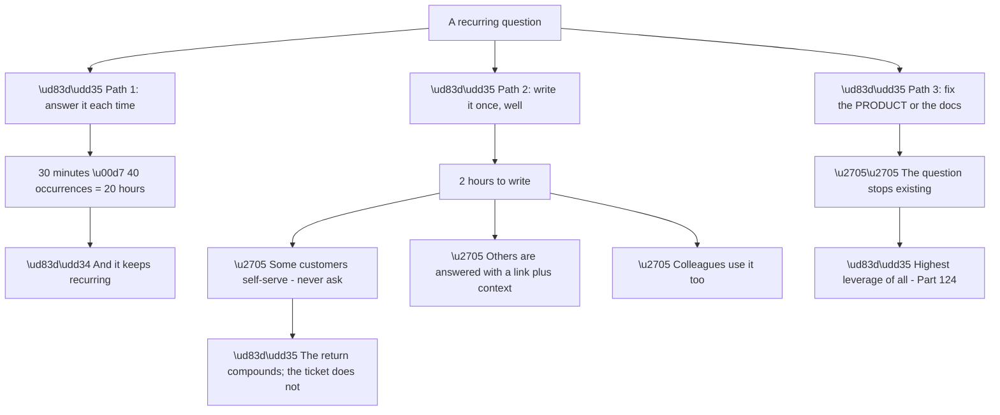
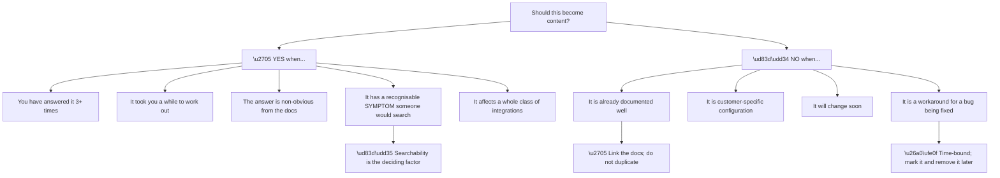
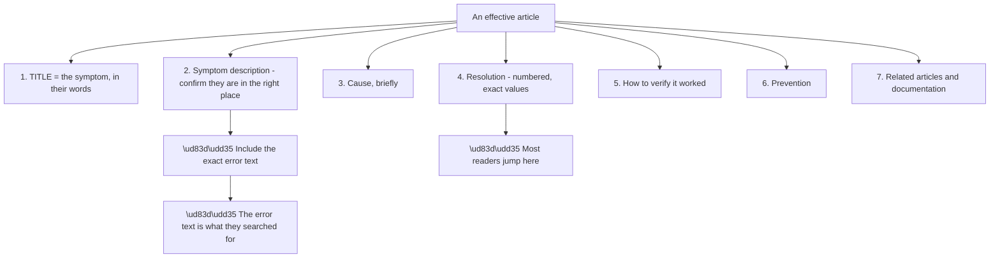
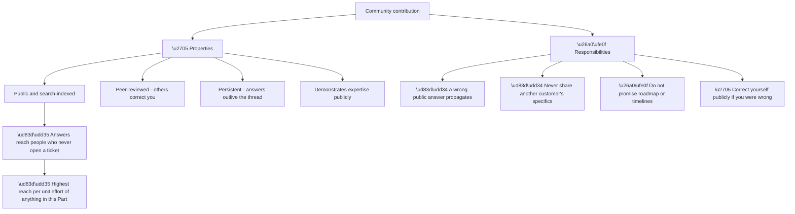
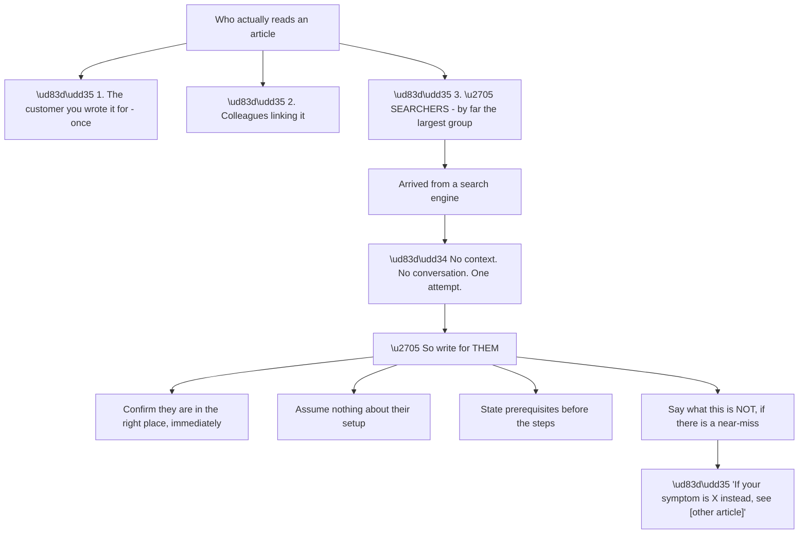
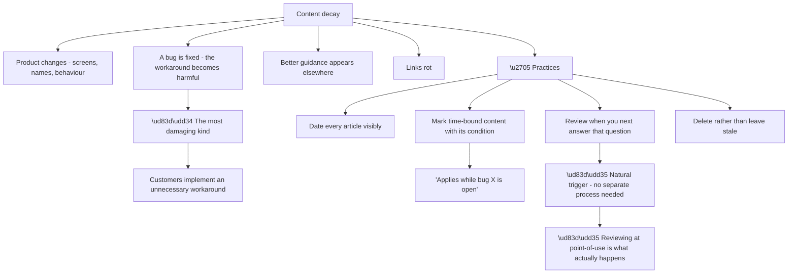
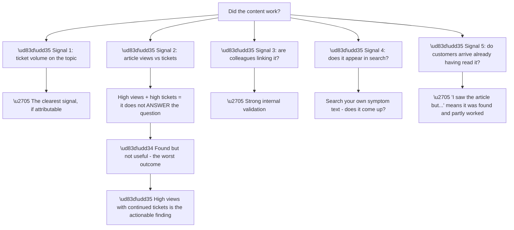
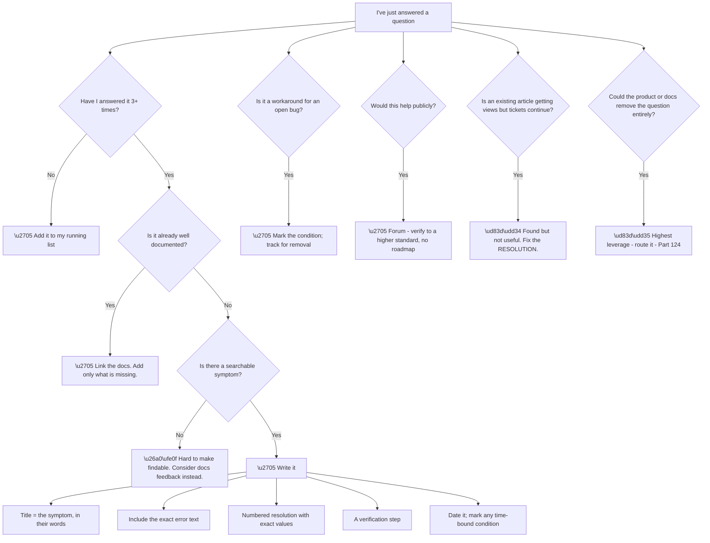

# Part 122 - Knowledge Base, Deflection, and Community Contribution

> Section goal: Turn repeated answers into content that prevents the question being asked — the single highest-leverage activity available to a support engineer.

Covers index item **122**. Maps to JD signals: *proactivity*, *technical writing*, *support operations*, *cross-functional collaboration*, *customer-facing communication*, *continuous improvement*.

---

## 1. Start From Zero: Why Deflection Is the Highest Leverage Work

Answering a ticket helps one customer once. **Writing the answer well helps everyone who has not asked yet.**

**Node R2 is the ceiling.** An article deflects a question; **a product or documentation fix removes it.** Both are worth doing, and recognising which is available matters.

**Node P2c is worth stating** because "just send them a link" has a bad reputation, deservedly when done badly. **A link plus the specific application to their situation** is better than a bespoke answer, not worse — it gives them the general principle *and* the specific fix.

| Response | Customer experience |
|---|---|
| Bespoke answer only | Solves today; they ask again in a different form |
| **Link alone** | ❌ Reads as dismissal |
| **Link + their specific case** | ✅ Solves today and next time |

**Row two is the failure to avoid**, and it is why deflection is sometimes resisted. **The article is a tool, not a replacement for engagement.**

> 💡 **Tie-in to your background:** ODSP SME and 100+ recognitions suggest you already do this — **knowledge sharing is usually what SME recognition reflects.** Being able to describe the practice rather than the title is what makes it credible.

### 🔍 Plain-English deep-dive: recognising what is worth writing

Not every answer deserves an article. **Writing the wrong ones wastes effort and clutters the knowledge base.**

**Node Y4a is the deciding factor and the most useful test.** **An article nobody can find is an article nobody reads.** The question to ask is: **what would the customer type into a search box?** — and if the answer is a symptom, the article's title should be that symptom.

| Title style | Findability |
|---|---|
| "Understanding SAML NameID formats" | ❌ Nobody searches this |
| **"Duplicate users are created on every SAML login"** | ✅ **The actual symptom** |
| "Configuring enterprise connections" | ❌ Too broad |
| **"Enterprise login fails after our IdP rotated its certificate"** | ✅ |

**Rows two and four are written from the customer's position**, in their words, describing what they are experiencing. **That is the single most important choice in knowledge base writing.**

**Node N1a prevents a common waste.** **Duplicating existing documentation creates a second source that will drift out of date**, and the customer now has two answers that eventually disagree. **Link it, and add only what is missing.**

**Node N4a is the maintenance trap.** A workaround article for a bug that gets fixed **becomes actively harmful** — customers implement an unnecessary workaround. **Mark it with the condition and remove it when resolved**, which requires someone to be tracking that.

**Analogy:** signposting a building. The sign that helps is the one at the point of confusion, saying what the lost person is looking for — not a comprehensive directory in the lobby that names things by their official titles. **Where it stops:** signs do not go out of date quietly. Articles do, and a wrong sign is worse than none.

---

## 2. Writing an Article That Works

Knowledge base articles have a structure that serves a searching, frustrated reader.

**Node S2a is a specific, high-value technique.** **Including the exact error string** — even if it is ugly — **makes the article findable by the thing the customer actually has in front of them.** They search the error; the article contains the error; it appears.

**Node S4a reflects how these are actually read.** Nobody reads a knowledge base article as prose — **they scan for the numbered steps.** So the resolution must be findable at a glance and complete on its own, without requiring the earlier sections.

**What makes the resolution section work:**

| Property | Why |
|---|---|
| Numbered | Sequence is unambiguous |
| One action per step | No missed sub-steps |
| Exact values | No interpretation needed |
| Where to click or what to send | Removes hunting |
| **Verification step** | They know it worked |
| No prerequisites hidden mid-list | Stated up front |

**The verification step is the most-omitted and most-valued.** *"You should now see the claim in the decoded token"* **tells the reader they are done** — without it, they finish uncertain and may raise a ticket anyway.

**Two things that reliably reduce an article's usefulness:**

**Assumed context.** An article that starts mid-scenario **fails the reader who arrived from a search engine** with none of the surrounding knowledge.

**Product-team vocabulary.** Writing in the internal name for something **makes it unfindable**, because customers search the term they were given in an error or a screen.

---

## 3. Community Contribution

The developer forum at `devforum.okta.com` is a public, searchable knowledge base built by everyone. **Contributing there has different properties from an internal article.**

**Node P1a is the reach argument.** A forum answer **is found by search engines**, so it reaches developers who would never open a ticket — including those evaluating the product. **The reach per unit effort exceeds any internal artefact.**

**Node R1 is the corresponding responsibility.** A wrong public answer **propagates and is cited**, and correcting it later reaches fewer people than the original. **Verify before answering publicly**, to a higher standard than a private reply where a correction reaches everyone who saw it.

**Node R3 is a boundary worth holding firmly.** **Speculating publicly about roadmap or timelines creates commitments nobody made**, and it is quoted back later.

**What makes a good forum answer:**

| Element | Why |
|---|---|
| Answer the actual question first | They may stop there |
| Explain the reason | Others reading learn the principle |
| A runnable example | Directly usable |
| Link the authoritative documentation | Verifiable, and survives your answer |
| Note what you did not verify | Honest, and invites correction |
| Follow up if they reply | Threads with resolution are more useful |

**The last row matters for the archive.** **A thread ending in "did that work?" with no reply is much less useful** to the next searcher than one ending in confirmation.

### 🔍 Plain-English deep-dive: writing for the searcher who is not your customer

A knowledge base article's main audience is **not the person who asked.** It is dozens of people who will arrive from a search engine months later, with none of the context.

**Node W4a is the most-omitted and most-appreciated element.** **A searcher landing on a near-miss article** wastes their time and often follows the steps anyway. **One line disambiguating from the adjacent problem** rescues them, and it costs nothing.

| Element | What it does for a searcher |
|---|---|
| Symptom stated first | Confirms they are in the right place |
| Exact error text | Matches what they pasted |
| **Disambiguation line** | **Rescues near-misses** |
| Prerequisites up front | Prevents starting and failing midway |
| No assumed context | Works without the conversation |
| Verification step | They know they are done |

**Node R3b is the constraint that governs the writing.** **There is no conversation** — no chance to clarify, no follow-up question, no adjustment based on their reaction. **Everything the reader needs must be present**, which is a higher bar than a ticket reply.

**Node W2 is where articles most commonly fail.** An article written straight from a ticket **carries the ticket's assumptions** — the customer's connection type, their application type, their configuration — without stating them. **A searcher with a different setup follows the steps and they do not work.**

**The test to apply before publishing:** **read it as someone who arrived from a search with only the error message.** Does it confirm they are in the right place? Does it tell them what setup it assumes? Can they follow it without asking anything?

**And it changes what you write in the ticket too.** Answering with the article's structure in mind — symptom, cause, numbered fix, verification — **produces a reply that is already most of an article**, which removes the friction of writing it up later.

**Analogy:** a recipe written for someone who has never been in your kitchen. Naming the pan, stating the oven temperature, and saying what it should look like when it is done — because they cannot ask, and "cook until ready" helps only the person who was standing next to you. **Where it stops:** a recipe cannot see the result. An article cannot see whether the reader's setup matched its assumptions, which is why stating them matters.

---

## 4. Maintenance

Content decays, and **stale content is worse than none** because it is trusted.

**Node P3a is the practice that works**, because scheduled review processes are the first thing dropped under load. **Reviewing an article at the moment you reach for it** costs seconds and happens naturally — **and if it is out of date, you have found out at exactly the moment it mattered.**

**Node P4 is the harder discipline.** **Deleting an article feels like destroying work**, and leaving a wrong one causes active harm. **A knowledge base that only grows becomes untrustworthy**, and untrusted content is unused content.

**Node P2a is what makes time-bound content safe.** *"This workaround applies while [bug reference] is open"* **gives a removal condition**, so it can be retired confidently rather than lingering out of uncertainty.

### 🔍 Plain-English deep-dive: measuring whether it worked

Deflection is claimed more often than measured. **Knowing whether an article actually helped changes what you write next.**

**Node S2b is the most useful diagnostic in this Part.** **An article being found and not resolving the question** is worse than one nobody finds, because the customer has spent effort and still needs help — **and it points at a specific fix.**

| Views | Tickets | Meaning |
|---|---|---|
| Low | High | ❌ **Not findable** — fix the title and error text |
| High | High | ❌ **Found, not useful** — fix the resolution section |
| High | Low | ✅ Working |
| Low | Low | ⚠️ Question may have stopped occurring |

**Rows one and two need completely different fixes**, and conflating them wastes the effort. **Not findable is a title problem; found-but-useless is a content problem.**

**Node S5a is a signal worth listening for specifically.** *"I read the article but I'm still stuck"* **is a gift** — it tells you exactly where the article stops being sufficient, and updating it there is the highest-value edit available.

**And there is a low-tech measurement worth doing personally:** **search your own article's symptom text** the way a customer would, in a search engine and in the product's own search. **If it does not appear in the first few results, it does not exist** regardless of its quality.

**The individual version of the whole practice:** **keep a running list of questions you answer more than twice.** It costs nothing, it accumulates, and it is the input to everything in this Part — most people do not do it and consequently never notice their own repetition.

**Analogy:** a well-placed sign that people still walk past the turning. The sign exists and is being seen; something about it is not doing its job, and that is a different problem from having no sign. **Where it stops:** you can watch people walk past a sign. Article failure is invisible unless you look for the pattern in the tickets that follow.

---

## 5. Failure Modes

| # | Failure mode | Symptom | Fix |
|---|---|---|---|
| 1 | Writing before it recurs | Effort on a one-off | Wait for three occurrences |
| 2 | Title in product vocabulary | Not findable | Title = the symptom, in their words |
| 3 | Error text omitted | Not findable | Include the exact string |
| 4 | Duplicating documentation | Two sources that drift | Link it; add only what is missing |
| 5 | Link sent without context | Reads as dismissal | Link **plus** their specific case |
| 6 | Resolution not scannable | Reader gives up | Numbered, exact values |
| 7 | No verification step | Reader unsure; raises a ticket anyway | "You should now see…" |
| 8 | Assumed context | Search-arrivals lost | Start from zero |
| 9 | Stale workaround | Unnecessary changes implemented | Mark the condition; remove it |
| 10 | Wrong public answer | Propagates and is cited | Verify to a higher standard |
| 11 | Roadmap speculation | Commitments nobody made | Never |
| 12 | No follow-up on a thread | Less useful archive | Confirm resolution |
| 13 | High views, high tickets | Found but not useful | Fix the resolution section |
| 14 | Never deleting | Knowledge base untrusted | Delete stale content |
| 15 | Not tracking your own repeats | Repetition never noticed | Keep a running list |

---

## 6. Troubleshooting Decision Tree: Content Decisions

### Worked example

Over three weeks, five tickets arrive with variations of the same problem: **users signing in through a social connection lose their existing account data.**

**Node B: five occurrences — well past the threshold.**

**Node C: is it documented?** The identity model is documented — each connection is a separate identity — **but not from the symptom's direction.** A customer experiencing "my data disappeared" would not find it.

**Node D: is there a searchable symptom?** Yes, and the customers have supplied it in their own words: *"my purchase history is gone," "it created a second account," "it says I already have an account."*

**Writing it:**

**Title:** **"Users report their data is missing after signing in with Google (or another social provider)"** — the symptom, in their words, naming the common case.

**Symptom section:** the three phrasings above, verbatim, **so any of them matches a search.**

**Cause, briefly:** each connection produces a separate identity; the same person using a password one time and a social provider another has two accounts. **Not a fault — the platform cannot safely assume two identities are the same person.**

**Resolution, numbered:** how to confirm which connection each login used from the tenant log; how to identify the duplicate; how to link them safely with verified evidence; **and explicitly why linking on unverified email is unsafe.**

**Verification:** *"After linking, the user's `identities` array should contain both entries and their original data should be visible."*

**Prevention:** show the last-used login method at the login page — **the cheapest fix and the one that prevents most of these before they happen.**

**Related:** links to the identity model documentation and account linking documentation, **rather than restating them.**

**Three weeks later**, the article has good views and **tickets have dropped but not stopped.** The remaining ones say: *"I read the article but I don't know which of our two accounts to keep."*

**That is node H1 — found but not fully useful**, and it is a precise finding. **The article covers how to link and not how to choose the primary**, which is the decision the customer is actually stuck on (Part 105).

**Adding that section** — how to decide which identity becomes primary, and what happens to the other's metadata and external references — **stops the remainder.**

**And the higher-leverage observation:** five tickets on this in three weeks suggests **the login page not showing the last-used method is a widespread product gap.** That goes to product feedback (Part 124), because **an article deflects the question and a product change removes it.**

---

## 7. Lab: Write, Publish, and Measure

**Purpose.** Produce real content, test its findability, and build the habit of tracking repetition.

**Prerequisites.**
- Parts 111–121 completed
- A place to publish, or a personal document store

**Steps.**

1. **Start a running list** of questions you have answered more than twice — in any context, work or otherwise. **Note topics only, no case detail.**
2. **From this guide, choose three recurring problems** to write about.
3. **For each, write the title as the symptom** in a customer's words. **Write three alternative titles and pick the most searchable.**
4. **Write one full article** using the seven-section structure.
5. **Include the exact error text** a customer would see and search.
6. **Write the resolution as numbered steps with exact values** and a verification step.
7. **Test findability:** give a colleague the symptom and ask them to search for your article's title text. **Did they find it?**
8. **Test usefulness:** ask someone to follow the resolution steps without your help. **Note where they hesitate** — that is where the article is thin.
9. **Rewrite based on both tests.**
10. **Write a forum-style answer** for a second problem: answer, reason, runnable example, documentation link, and what you did not verify.
11. **Take an existing article** — from this guide's material — and write the removal condition it would need if it were a workaround.
12. **Build your content card:** the write-or-not test, the seven sections, the findability test, and the views-versus-tickets diagnostic.

**Expected evidence.**
- A running list of repeated topics
- Three symptom-based titles with alternatives
- One full seven-section article
- Findability test result
- Usefulness test result with hesitation points noted
- A rewritten version
- A forum-style answer
- A removal condition for a time-bound article
- Your content card

**Validation rubric.**

| Criterion | Pass |
|---|---|
| Write-or-not | You can justify writing or not writing |
| Title | The symptom, in the customer's words |
| Findability | A colleague found it from the symptom alone |
| Scannable resolution | Numbered, exact, complete on its own |
| Verification | Present, and unambiguous |
| No duplication | You link documentation rather than restating |
| Public standard | Your forum answer is verified and roadmap-free |
| Measurement | You can diagnose views-versus-tickets |

**Cleanup and privacy.** **Use only this guide's material or synthetic examples.** Do not write an article based on a real customer's case, and **keep your running list to topics only** — no names, no configurations, no case detail (Part 112).

---

## 8. JD Mapping

| JD signal | How this Part addresses it |
|---|---|
| Proactivity | Turning answers into prevention |
| Technical writing | Article structure and findability |
| Support operations | Deflection and measurement |
| Cross-functional collaboration | Routing to documentation and product |
| Customer-facing communication | Link-plus-context rather than link-only |
| Continuous improvement | Maintenance and measurement |

---

## 9. Candidate Honesty Note

- **Production experience:** SME recognition and 100+ recognitions, which typically reflect knowledge sharing and helping colleagues rather than individual ticket volume.
- **Production experience:** recognising recurring questions and answering them once for reuse.
- **Lab experience:** writing symptom-titled articles and testing both findability and usefulness with real readers, as above.
- **Learned architecture:** the views-versus-tickets diagnostic and the maintenance discipline.
- **No direct experience:** contributing to this product's public developer forum.
- **How to say it:** *"The SME recognition came largely from knowledge sharing — writing things down so the team did not solve the same problem repeatedly. What I've thought about more deliberately for this role is findability: an article titled in product vocabulary is invisible, and one titled with the customer's own symptom is the one that gets found. And the views-versus-tickets signal, because found-but-not-useful is a different problem from not-findable."*

---

## 10. Official Source Anchors

| Source | Why | Accessed |
|---|---|---|
| Okta Developer Forum — `devforum.okta.com` | The public community surface | Accessed **26 August 2026** |
| Auth0 Docs | The documentation an article should link rather than duplicate | Accessed **26 August 2026** |
| Google Developer Documentation Style Guide | Structure and clarity conventions | Accessed **26 August 2026** |

> **Revalidate:** documentation structure and community platform change. Re-check what exists before writing something that duplicates it.

---

## ⭐ Likely Interview Questions for This Section

### Q1. "When is a question worth writing up?"

> *Model answer:* When I have answered it three or more times, when it took a while to work out, when the answer is not obvious from the existing documentation, and — the deciding factor — when there is a recognisable symptom someone would actually search for. Findability is what determines whether the effort pays back, because an article nobody can find is an article nobody reads. I would not write it if it is already well documented, because duplicating creates a second source that drifts out of date and eventually contradicts the first; I would link it and add only what is missing. And I would be careful with workaround articles for open bugs, because when the bug is fixed the article becomes actively harmful.

### Q2. "What makes a knowledge base article findable?"

> *Model answer:* Titling it with the symptom in the customer's own words rather than in product vocabulary. "Understanding SAML NameID formats" is invisible because nobody searches that; "Duplicate users are created on every SAML login" is what someone actually types. The second technique is including the exact error text, however ugly, because that is the string the customer has in front of them and pastes into a search box. And I would test it rather than assume — give a colleague the symptom, ask them to find the article, and if they cannot, the title is wrong regardless of how good the content is.

### Q3. "An article gets lots of views and the tickets keep coming. What does that mean?"

> *Model answer:* That it is found but not useful, which is the worst outcome because the customer has spent effort and still needs help. It is also a precise finding, and it needs a different fix from an article nobody finds — low views with high tickets is a title problem, high views with high tickets is a content problem, specifically in the resolution section. The signal I listen for is customers saying "I read the article but I'm still stuck," because that tells me exactly where it stops being sufficient. In one case I worked through, an article on duplicate accounts covered how to link them but not how to decide which one to keep, which was the actual decision the customer was stuck on.

### Q4. "Isn't sending a link to an article dismissive?"

> *Model answer:* A link alone is, and that is why deflection has a bad reputation. A link plus the specific application to their situation is better than a bespoke answer, not worse — they get the general principle and the specific fix, so they can handle the next variation themselves. So the pattern I would use is: here is what is happening in your case, here is the change to make, and here is the article that explains the underlying model if it is useful. The article supports the engagement rather than replacing it. Where I would not use one at all is when their case has a wrinkle the article does not cover, because then it genuinely does not answer their question.

### Q5. "What's different about answering publicly on a developer forum?"

> *Model answer:* The reach and the responsibility both increase. A forum answer is search-indexed, so it reaches developers who would never open a ticket, including people evaluating the product — the reach per unit effort exceeds anything internal. But a wrong public answer propagates and gets cited, and correcting it later reaches far fewer people than the original did, so I would verify to a higher standard than for a private reply. I would also never speculate about roadmap or timelines publicly, because that creates commitments nobody made and gets quoted back. And I would follow up on the thread, because a thread ending in "did that work?" with no reply is much less useful to the next person searching than one ending in confirmation.

### Q6. "How do you stop a knowledge base going stale?"

> *Model answer:* Review at the point of use rather than on a schedule, because scheduled review is the first thing dropped under load. Every time I reach for an article to send to a customer, I read it first — that costs seconds, happens naturally, and if it is out of date I have found out at exactly the moment it mattered. Beyond that: date everything visibly, mark time-bound content with its removal condition so it can be retired confidently, and actually delete stale articles rather than leaving them. That last one is the hardest discipline, because deleting feels like destroying work — but a knowledge base that only grows becomes untrusted, and untrusted content is unused content.

### Q7. "What's higher leverage than writing an article?"

> *Model answer:* Changing the product or the documentation so the question stops existing. An article deflects a question; a product change removes it. In the duplicate-accounts case I mentioned, the article helps people who have already hit the problem — but showing the last-used login method on the login page prevents most of them from hitting it at all, and that is a product change rather than a content one. So the question I ask after writing an article is whether the underlying need could be removed instead, and if so I route it as product feedback. The article is still worth writing, because product changes take time and people are hitting it now.

### Q8. "How would you know if you're repeating yourself?"

> *Model answer:* By keeping a running list of questions I answer more than twice. It sounds trivial and most people do not do it, which is exactly why they never notice their own repetition — each individual answer feels like a one-off. The list costs nothing, accumulates passively, and is the input to everything else: it tells me what to write, and it surfaces patterns that are worth raising as documentation or product gaps. I would also review my own recent tickets periodically for repeated topics, which takes about twenty minutes and usually identifies at least one article that would have prevented several investigations.

---

## 🧠 30-Second Memory Hooks

- **Answering helps one customer once. Writing helps everyone who hasn't asked.**
- **Product or docs fix > article > repeated answers.**
- **Write it after the third occurrence.**
- **Title = the symptom, in the customer's words.**
- **Include the exact error text** — that is what they search.
- **Link documentation; never duplicate it.**
- **Link alone is dismissive. Link plus their case is better than bespoke.**
- **Resolution: numbered, exact values, complete on its own.**
- **Always include a verification step.**
- **Low views + high tickets = not findable. High views + high tickets = not useful.**
- **"I read the article but…" tells you exactly where it stops.**
- **Review at point of use, not on a schedule.**
- **Delete stale content. A growing-only knowledge base is untrusted.**
- **Public answers: verify harder, no roadmap, follow up.**
- **Keep a running list of what you repeat.**

---

## ✅ Completion Checklist

- [ ] I keep a running list of repeated questions
- [ ] I can justify writing or not writing an article
- [ ] I title articles with the customer's symptom
- [ ] I include exact error text
- [ ] I link documentation rather than duplicating it
- [ ] I send links with context, never alone
- [ ] My resolutions are numbered with exact values and a verification step
- [ ] I can diagnose views-versus-tickets
- [ ] I review articles at the point of use
- [ ] I delete stale content
- [ ] I verify to a higher standard before answering publicly
- [ ] I route product-removable questions as feedback

*Next suggested section:* **[Part 123 - Support Metrics and Operational Improvement](Part-123-support-metrics-and-operational-improvement.md)** — what gets measured in support, what those numbers actually mean, and how to improve them without gaming them.
