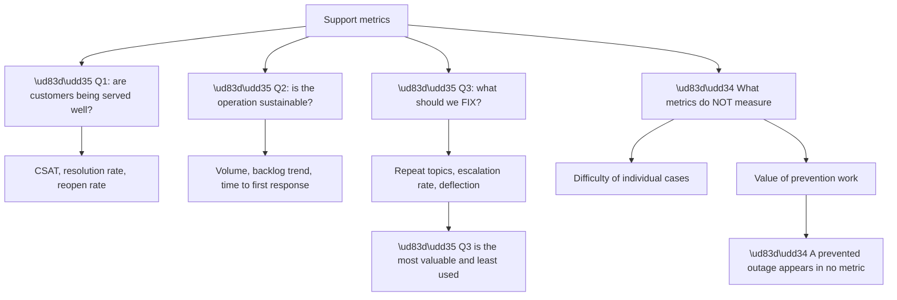
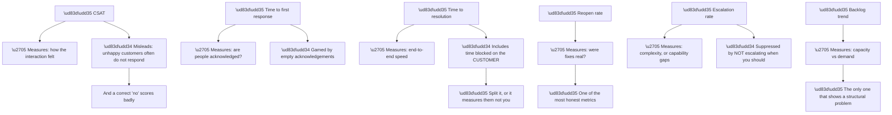
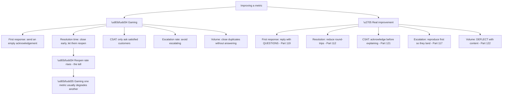
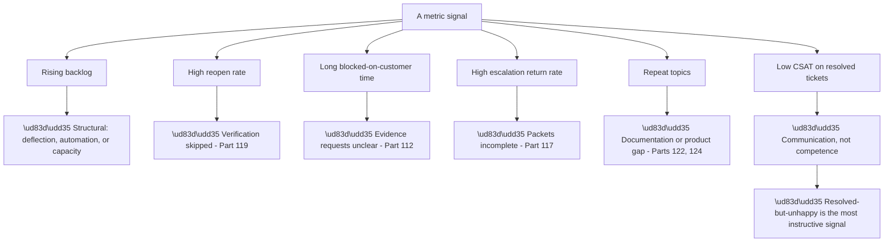
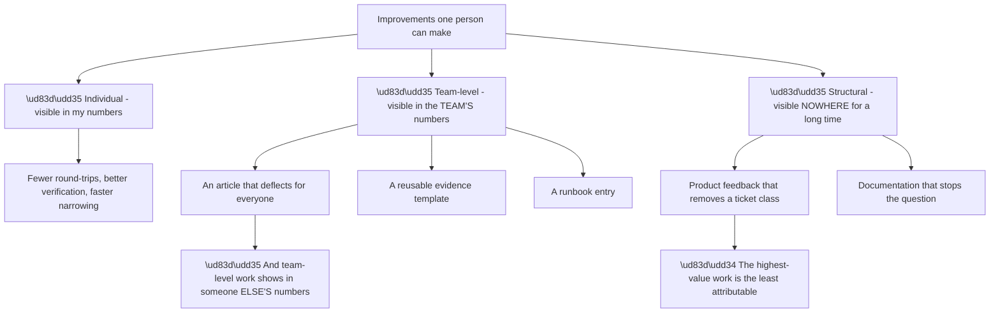
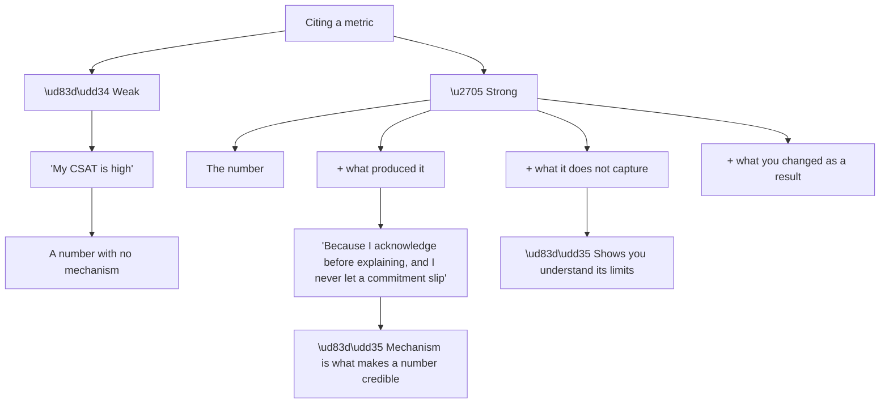
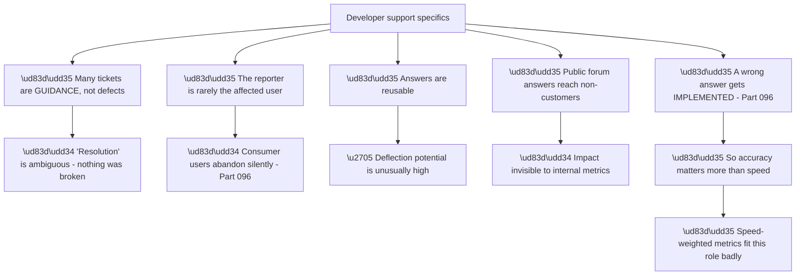
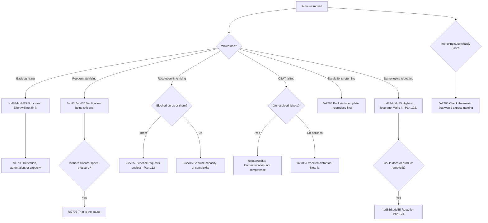

# Part 123 - Support Metrics and Operational Improvement

> Section goal: Understand what support measures, what those numbers actually mean, and how to improve them genuinely rather than by gaming them.

Covers index item **123**. Maps to JD signals: *support operations*, *continuous improvement*, *prioritisation*, *cross-functional collaboration*, *customer-facing communication*, *data analysis*.

---

## 1. Start From Zero: What Gets Measured and Why

Support metrics exist to answer three questions, and **most confusion comes from using a metric to answer the wrong one.**

**Node R is the framing worth adopting.** **Most metric discussion is about Q1 and Q2 — performance and capacity — while Q3 is where the improvement actually is.** Repeat topics, escalation rates, and deflection tell you what to change; CSAT tells you how you are doing at not changing it.

**Node W2a is the honest limitation** (Part 110): **prevention is invisible.** No metric records the outage that did not happen, the ticket that was never raised because an article existed, or the security issue found before it was exploited. **Anyone optimising purely for measured output will underinvest in exactly this.**

| Metric answers | Does not answer |
|---|---|
| How satisfied customers were | How hard the problems were |
| How fast we responded | Whether the answer was right |
| How many we closed | Whether they stayed closed |
| How big the backlog is | Whether it is the right work |
| — | **What we prevented** |

> 💡 **Tie-in to your background:** a strong customer-satisfaction record is compelling evidence. **What makes it credible in interview is explaining what produced it** rather than citing it — the behaviours from Parts 119–121, not the score.

### 🔍 Plain-English deep-dive: what each metric actually tells you

Every common support metric has a legitimate use and a way it misleads. **Knowing both is what makes them useful.**

**Node M4b makes reopen rate worth watching closely.** **It is hard to game and it measures something real** — whether a fix actually worked. A rising reopen rate means verification is being skipped (Part 119), and it usually accompanies pressure on closure speed.

**Node M3c is a genuine measurement flaw.** Time to resolution **includes time waiting for the customer**, so a fast engineer with slow customers looks worse than a slow one with responsive customers. **Splitting into "time blocked on us" and "time blocked on them"** makes it meaningful — and the second number is itself diagnostic, because long blocked-on-them time points at unclear evidence requests (Part 112).

**Node M1c is the CSAT distortion worth naming.** **A correct decline scores badly.** Telling a customer that disabling certificate validation is not something you will help with is the right answer and will not be rated well, **which means CSAT quietly penalises the behaviour the values require** (Part 096).

| Metric | Watch for |
|---|---|
| CSAT | Response bias; correct "no"s penalised |
| First response | Empty acknowledgements |
| Resolution time | Blocked-on-customer time included |
| **Reopen rate** | ✅ **Honest; watch it rise under closure pressure** |
| Escalation rate | Suppression by under-escalating |
| **Backlog trend** | ✅ **The structural signal** |

**Analogy:** measuring a hospital by waiting times alone. The number is real and improving it can be achieved by seeing easy cases first, discharging early, or not admitting complex ones. **Where it stops:** a hospital has clinical outcomes to check against. Support often has only the metrics, which is why knowing how each distorts matters.

---

## 2. Improving Genuinely Versus Gaming

Every metric can be improved dishonestly, and **the dishonest route is usually easier.**

**Node D is the useful structural property.** **Gaming is detectable** because metrics interact: closing early raises reopens, avoiding escalation raises resolution time and lowers satisfaction, empty acknowledgements do not change resolution time at all.

**Looking at metrics as a set rather than individually** is what exposes it — **and it is why a single metric target is more dangerous than a balanced view.**

| Gamed metric | The metric that exposes it |
|---|---|
| First response | Resolution time unchanged |
| Resolution time | **Reopen rate rises** |
| Escalation rate | Resolution time rises; CSAT falls |
| Volume closed | Reopens and repeat contacts rise |
| CSAT | Response rate falls |

**The genuine improvements in node R are all things covered earlier in this guide**, which is worth noticing: **the practices that produce good outcomes are the same ones that produce good metrics**, provided the metrics are read as a set.

**One improvement lever stands out:** **reducing round-trips** (Part 112). It improves resolution time, satisfaction, and effective capacity simultaneously, **because each avoided round-trip removes roughly a day of elapsed time** — and it is achieved by writing better evidence requests rather than by working faster.

---

## 3. Finding What to Improve

Metrics are most useful as a **diagnostic**, pointing at what to change (Part 119).

**Node R is worth investigating whenever it appears.** **A ticket that was resolved correctly and rated poorly** is almost always about communication — tone, delay, being told something different by two people, or a correct answer delivered dismissively (Part 121).

**That is a fixable and specific finding**, and far more actionable than a general instruction to improve satisfaction.

**Node S5a is the highest-leverage row**, as Part 122 established: **repeat topics are the clearest improvement signal a queue produces**, and they only appear when the queue is examined as a whole.

**A practical monthly review**, which is enough:

| Question | Look at |
|---|---|
| What did I answer more than twice? | My running list |
| What reopened, and why? | Reopened tickets |
| Where did round-trips happen? | Blocked-on-customer time |
| Which escalations came back? | Returned packets |
| Which resolved tickets scored badly? | The correspondence |
| What is trending up? | Volume by topic |

**Twenty minutes**, and it produces a specific list of things to change rather than a general intention to do better.

### 🔍 Plain-English deep-dive: improving the operation, not just your own numbers

Individual metrics measure an individual. **Some of the most valuable improvements are things one person cannot show in their own numbers at all.**

**Node R2 is the practical tension**, and it is worth naming honestly. **An article you write improves your colleagues' resolution times, not yours** — you already knew the answer. **A purely individually-measured system quietly discourages exactly the work that helps most.**

| Improvement | Whose numbers improve |
|---|---|
| Better evidence requests | Mine |
| Verifying before closing | Mine — by looking worse briefly |
| **An article** | **My colleagues'** |
| A runbook entry | Whoever is on call |
| **Product feedback** | **Nobody's, for months** |

**Row two is worth noting** because it is counterintuitive: **verifying before closing makes resolution time look worse** while making reopen rate look better. **An engineer optimising for the visible number would stop verifying**, which is precisely the wrong outcome.

**Node R is the reason to do this work deliberately** rather than expecting the system to pull you toward it. **Structural improvements — a product change that removes a ticket class — take months to show and never attribute cleanly**, and they are the highest-value contribution available.

**The practical response** is to keep your own record of it: **what you wrote, what it deflected, what you routed, and what changed as a result** (Part 124's outcome follow-up). **That record is what makes it discussable in a review or an interview**, since no dashboard will surface it.

**And there is a team-health version of the same idea.** A team where everyone optimises individual numbers **produces no shared assets** — no articles, no runbooks, no templates — and each person solves the same problems privately. **Noticing that pattern is itself a finding worth raising.**

**Analogy:** a workshop where everyone is measured on jobs completed. Nobody sharpens the shared tools, writes up the tricky repair, or fixes the layout — all of which would help everyone and none of which appears in anyone's count. **Where it stops:** tools visibly blunt. Missing knowledge does not, so it has to be tracked deliberately.

---

## 4. Metrics in Interview and Self-Assessment

Numbers are evidence, and **evidence needs interpretation to be persuasive.**

**Node R is the interview-relevant point.** **A number alone invites doubt; a number with a mechanism invites belief.** *"A high score, because I acknowledge before explaining and I never miss a commitment I've made"* **is a claim someone can evaluate.**

**Node S3a is a strong signal of judgement.** Saying *"CSAT under-represents the tickets where I had to decline something, because a correct no rarely rates well"* **demonstrates that you understand the metric rather than just achieving it** — and it is a more sophisticated answer than the number itself.

**The self-assessment version** is worth doing honestly:

| Ask yourself | Because |
|---|---|
| Which of my tickets reopened? | The honest quality signal |
| Where did I need more than one round-trip? | Evidence request quality |
| Which escalations came back? | Packet completeness |
| What did I answer repeatedly? | Deflection opportunity |
| Where did I go silent? | The commonest communication failure |

**The last row is the one worth being most honest about**, because silence under pressure is nearly universal (Part 121) and it is invisible in every metric.

### 🔍 Plain-English deep-dive: the metrics that would matter for this role specifically

Developer support has different dynamics from IT-facing support, and **some standard metrics fit poorly.**

**Node D5a is the most important adjustment.** In IT-facing support a poor answer is usually noted and not acted on; **a developer given a poor answer writes it into their application and ships it.** **Accuracy therefore outranks speed here in a way it does not everywhere**, and metrics weighted toward speed pull in the wrong direction.

**Node D1a is a real measurement awkwardness.** A large share of developer tickets are *"is this the right approach?"* (Part 096) — **nothing is broken, so "resolution time" measures how long a conversation took**, which is not the same thing at all.

| Standard metric | Fit for developer support |
|---|---|
| Time to first response | ✅ Good |
| Time to resolution | ⚠️ Ambiguous for guidance tickets |
| **Reopen rate** | ✅ Good — and honest |
| CSAT | ⚠️ Response bias; guidance rates differently |
| Volume closed | ❌ Poor — rewards speed over accuracy |
| **Deflection / repeat topics** | ✅✅ **Unusually valuable here** |
| Forum contribution | ✅ Real impact, poorly measured |

**Row six is where the leverage is.** Because developer answers are highly reusable, **the ratio of repeated questions to unique ones is a better health signal here than in most support contexts** — and driving it down through content has an unusually large effect.

**Node D2a is the honest gap.** **The affected users never appear in any metric**, because consumers abandon silently rather than complaining. So a login problem affecting thousands of end users **shows up as one ticket from one developer** — which means ticket counts systematically under-represent impact in this domain.

**The implication for prioritisation** (Part 119): **impact must be assessed from the described end-user effect**, not from ticket volume. **One developer reporting a signup failure may represent far more harm than ten developers asking configuration questions.**

**Analogy:** measuring a bridge inspector by inspections completed. It is measurable and it rewards speed over thoroughness, and the thing that actually matters — a failure that did not happen — appears in no count. **Where it stops:** bridges eventually announce a missed problem. A support metric may never surface a wrong answer that was quietly implemented.

---

## 5. Failure Modes

| # | Failure mode | Symptom | Fix |
|---|---|---|---|
| 1 | Single-metric targets | Gaming | Read metrics as a set |
| 2 | Empty acknowledgements | First response good, nothing improves | Reply with questions |
| 3 | Closing early | Reopen rate rises | Verify before closing |
| 4 | Under-escalating | Resolution time rises, CSAT falls | Escalate when criteria are met |
| 5 | Resolution time uncorrected | Measures the customer, not you | Split blocked-on-us and blocked-on-them |
| 6 | CSAT response bias unacknowledged | Overstated performance | Note it when citing |
| 7 | Correct declines penalised | Values-aligned behaviour discouraged | Name the distortion |
| 8 | Ignoring repeat topics | Highest-leverage signal missed | Monthly review |
| 9 | Resolved-but-unhappy not investigated | Communication issue persists | Read the correspondence |
| 10 | Prevention undervalued | Underinvestment | Recognise it is unmeasured |
| 11 | Speed-weighted in developer support | Accuracy suffers | Accuracy outranks speed here |
| 12 | Ticket count as impact | End users invisible | Assess described end-user impact |
| 13 | Citing a number without a mechanism | Unpersuasive | Number + what produced it |
| 14 | No self-review | No improvement | Twenty minutes monthly |

---

## 6. Troubleshooting Decision Tree: Reading Metrics

### Worked example

A monthly review shows: **average resolution time down 18%, reopen rate up from 4% to 11%, CSAT down slightly.**

**Node H: improving suspiciously fast**, and node C: **reopen rate rising.**

**Reading them as a set rather than individually** makes the picture clear: **resolution time fell because tickets are being closed before verification**, and roughly one in nine is coming back.

**Confirming it.** The reopened tickets share a shape — closed with a fix delivered, reopened within days with *"this didn't work"* or *"it's happening again."* **Node C1: there has been closure-speed pressure**, introduced the previous month.

**The apparent improvement is a real degradation:**

| Metric | Appears | Actually |
|---|---|---|
| Resolution time −18% | ✅ Better | ❌ Measures the first attempt only |
| Reopen rate 4% → 11% | ❌ Worse | ❌ The real signal |
| CSAT slightly down | ❌ Worse | ❌ Customers experiencing a false resolution |

**And the true resolution time is worse**, not better — a reopened ticket's total elapsed time includes the first cycle, the customer's discovery that it failed, and the second cycle. **Measuring only the first close hides that.**

**The fix is not a metric change but a practice one** (Part 119): **verify before closing.** Confirm with the customer that it worked, rather than closing on delivery of the fix.

**The recommendation with the numbers attached:**

> Resolution time has improved 18%, and reopen rate has risen from 4% to 11% over the same period. Those are the same event: tickets are being closed on delivery rather than on confirmation, so the first close is fast and roughly one in nine returns. Total elapsed time for a reopened ticket is worse than if it had stayed open, and the customer experiences a false resolution, which is where the CSAT movement is coming from. Recommend measuring resolution at confirmed close and adding verification as a required step.

**What made this readable:** **looking at three metrics together.** Any one of them alone supports a wrong conclusion — resolution time alone says things improved; reopen rate alone says quality dropped without saying why; CSAT alone says nothing actionable. **The interaction is the finding.**

---

## 7. Lab: Build Your Own Review

**Purpose.** Build the self-review habit and the ability to read metrics as a set.

**Prerequisites.**
- Parts 111–122 completed
- **No real metric data** — use synthetic figures

**Steps.**

1. **Write out the six common metrics**, and for each, what it measures and one way it misleads. Check against §1.
2. **For each, write how it would be gamed** and which other metric would expose it.
3. **Create a synthetic monthly set** with a hidden problem — for example, the §6 pattern.
4. **Set it aside**, then read it fresh and see whether you spot the interaction.
5. **Write the finding** as you would present it, with the numbers attached.
6. **Write the six self-review questions** from §3 and answer them honestly about your own recent work — **topics only, no case detail.**
7. **Identify one thing you would change** based on your answers.
8. **Write your CSAT-style claim** as you would say it in interview: the number, the mechanism, the limitation, and what you changed.
9. **Write the developer-support adjustment**: which standard metrics fit poorly here and why.
10. **Write the impact-assessment note:** why ticket count under-represents impact when end users abandon silently.
11. **Build your metrics card:** what each measures, how each misleads, the gaming-detection pairs, and the six review questions.

**Expected evidence.**
- Six metrics with meaning and distortion
- Gaming methods and their detection pairs
- A synthetic set with a hidden interaction, and your reading of it
- A written finding with numbers
- Six honest self-review answers
- One identified change
- Your interview-ready metric claim
- Your metrics card

**Validation rubric.**

| Criterion | Pass |
|---|---|
| Meaning and distortion | You can state both for each metric |
| Gaming detection | You know which metric exposes which |
| Reading as a set | You spot interactions rather than single movements |
| Diagnostic use | You map a signal to a specific practice change |
| Self-review | Honest, including where you went silent |
| Interview framing | Number, mechanism, limitation, change |
| Developer-support fit | You can explain why speed-weighting misfits |

**Cleanup and privacy.** **Use synthetic figures only.** Do not use real employer metric data, and **keep self-review answers to topics and behaviours** — no customer names, no case detail (Part 112).

---

## 8. JD Mapping

| JD signal | How this Part addresses it |
|---|---|
| Support operations | What is measured and what it means |
| Continuous improvement | Metrics as a diagnostic |
| Prioritisation | Impact assessment beyond ticket count |
| Cross-functional collaboration | Routing repeat topics to docs and product |
| Customer-facing communication | Resolved-but-unhappy as a communication signal |
| Data analysis | Reading metrics as an interacting set |

---

## 9. Candidate Honesty Note

- **Production experience:** a strong customer-satisfaction record, sustained — and able to explain the behaviours behind it.
- **Production experience:** working within a metric-driven support organisation and recognising where measures distort.
- **Lab experience:** building synthetic metric sets and practising reading interactions rather than single movements, as above.
- **Learned architecture:** the developer-support-specific fit issues, particularly speed versus accuracy.
- **No direct experience:** owning support metrics or driving an operational improvement programme.
- **How to say it:** *"I'd rather explain what produced the CSAT than cite it — acknowledging before explaining, never letting a commitment slip, and verifying before closing. I'd also note what it does not capture: a correct decline rarely rates well, so the metric quietly penalises exactly the behaviour the values require. What I find most useful is reading metrics as a set, because a single one moving usually supports a wrong conclusion."*

---

## 10. Official Source Anchors

| Source | Why | Accessed |
|---|---|---|
| Google SRE Book — Service Level Objectives | Metric design and the risks of single targets | Accessed **26 August 2026** |
| Okta — company values | "Drive what's next" as continuous improvement | Accessed **26 August 2026** |
| Okta Developer Forum — `devforum.okta.com` | Repeat-topic patterns in practice | Accessed **26 August 2026** |

> **Revalidate:** metric definitions are organisation-specific. Learn the actual definitions on joining rather than assuming.

---

## ⭐ Likely Interview Questions for This Section

### Q1. "What support metrics do you pay attention to, and why?"

> *Model answer:* Reopen rate above most, because it is hard to game and it measures something real — whether the fix actually worked. A rising reopen rate almost always means verification is being skipped, and it usually accompanies pressure on closure speed. Then backlog trend, because it is the only metric that shows a structural problem: if arrivals exceed resolutions consistently, working harder delays the growth rather than reversing it. And repeat topics, which is the highest-leverage signal a queue produces — ten tickets on one subject is ten investigations that could have been one article. I would read all of them as a set rather than individually, because a single metric moving usually supports a wrong conclusion.

### Q2. "How would you improve resolution time?"

> *Model answer:* By reducing round-trips, which is the honest lever — each avoided round-trip removes roughly a day of elapsed time, and it is achieved by writing better evidence requests rather than by working faster. Asking for everything in one message, including a working comparison case, and giving capture instructions so the artefact arrives usable first time. I would also want the metric split into time blocked on us and time blocked on the customer, because unsplit it partly measures how responsive the customer is rather than how good we are — and the blocked-on-them number is itself diagnostic, since a high one points at unclear requests. What I would not do is close before verification, which improves the number and raises reopens.

### Q3. "How do you spot when a metric is being gamed?"

> *Model answer:* By looking at the metric that would move in the opposite direction. Gaming rarely stays contained: closing early improves resolution time and raises reopen rate; empty acknowledgements improve first response and leave resolution time unchanged; avoiding escalation lowers escalation rate and raises resolution time while lowering satisfaction. So the tell is an improvement in one number with a degradation in a related one. I saw exactly that shape in a review where resolution time fell 18% while reopens went from 4% to 11% — those were the same event, and reading either alone would have supported a wrong conclusion.

### Q4. "What are the limitations of CSAT?"

> *Model answer:* Two significant ones. Response bias: unhappy customers frequently do not respond at all, so the score can overstate performance, and it moves for reasons unrelated to the interaction. And more importantly, a correct decline rates badly. Telling a customer that disabling certificate validation is not something I will help with is the right answer and will not score well — which means the metric quietly penalises exactly the behaviour the values require. So I would cite the number with that caveat rather than as an unqualified achievement. It also does not capture difficulty at all: a hard case handled well and an easy case handled well look identical.

### Q5. "What does support measurement miss entirely?"

> *Model answer:* Prevention. No metric records the outage that did not happen because someone spotted an expiring certificate, or the ticket that was never raised because an article existed, or the security exposure found while working on something unrelated. That means anyone optimising purely for measured output will systematically underinvest in the highest-value work, which is a real risk rather than a philosophical point. It is also why proactive work needs to be deliberate rather than driven by the queue — the queue never asks for it. The honest position is to do it anyway and be able to describe it, since the number will not.

### Q6. "Do standard support metrics fit developer support well?"

> *Model answer:* Some do and some fit badly. Time to first response and reopen rate translate well. Time to resolution is ambiguous, because a large share of developer tickets are guidance rather than defects — nothing is broken, so the metric measures how long a conversation took. Volume closed fits poorly, because it rewards speed over accuracy, and accuracy matters more here than in IT-facing support: a developer given a poor answer writes it into their application and ships it, whereas an administrator given one usually just notes it. And ticket count under-represents impact badly, because consumer end users abandon silently rather than complaining — one developer reporting a signup failure may represent thousands of affected people.

### Q7. "A ticket was resolved correctly and rated poorly. What do you do?"

> *Model answer:* Read the correspondence, because resolved-but-unhappy is almost always about communication rather than competence — tone, a delay, being told different things by two people, or a correct answer delivered dismissively. That makes it one of the most instructive signals available, because it points at something specific and fixable rather than at a general instruction to do better. The commonest cause I would look for is a gap where I went quiet while investigating, since silence is the single worst response and it is invisible in every other metric. The other frequent one is explaining before acknowledging, which reads as deflection even when the explanation is correct.

### Q8. "How would you present a metric problem to a manager?"

> *Model answer:* With the numbers, the interaction between them, and the practice change rather than a metric change. For the resolution-time-and-reopens example: resolution time improved 18% and reopens went from 4% to 11% over the same period, those are the same event because tickets are being closed on delivery rather than on confirmation, total elapsed time for a reopened ticket is actually worse than if it had stayed open, and the customer experiences a false resolution which is where the satisfaction movement comes from. Then the recommendation: measure resolution at confirmed close, and make verification a required step. Presenting it that way keeps it about the practice rather than sounding like an objection to being measured.

---

## 🧠 30-Second Memory Hooks

- **Three questions: served well? sustainable? what to fix?** The third is the valuable one.
- **Prevention appears in no metric.**
- **Reopen rate is the most honest metric.**
- **Backlog trend is the only structural signal.**
- **Resolution time includes blocked-on-customer.** Split it.
- **CSAT: response bias, and a correct "no" scores badly.**
- **Gaming one metric degrades another.** Read them as a set.
- **Round-trip reduction improves speed, satisfaction, and capacity at once.**
- **Repeat topics = the highest-leverage signal.**
- **Resolved-but-unhappy = communication, not competence.**
- **Developer support: accuracy outranks speed** — poor answers get shipped.
- **Ticket count under-represents impact; end users abandon silently.**
- **Cite a number WITH its mechanism and its limitation.**
- **Twenty minutes monthly beats any dashboard.**

---

## ✅ Completion Checklist

- [ ] I can state what each common metric measures and how it misleads
- [ ] I know which metric exposes gaming of which
- [ ] I read metrics as an interacting set
- [ ] I can map a metric signal to a specific practice change
- [ ] I understand why prevention is unmeasured
- [ ] I can explain why speed-weighting misfits developer support
- [ ] I assess impact from end-user effect, not ticket count
- [ ] I cite numbers with mechanism and limitation
- [ ] I do an honest monthly self-review
- [ ] I have built a synthetic set and read the interaction correctly

*Next suggested section:* **[Part 124 - Cross-Functional Collaboration and Product Feedback](Part-124-cross-functional-collaboration-and-product-feedback.md)** — turning support findings into product and documentation change, and working effectively with the teams that own them.
