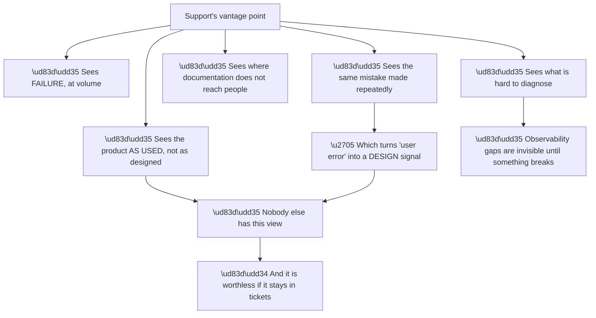
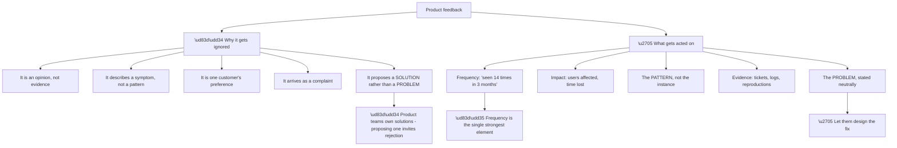
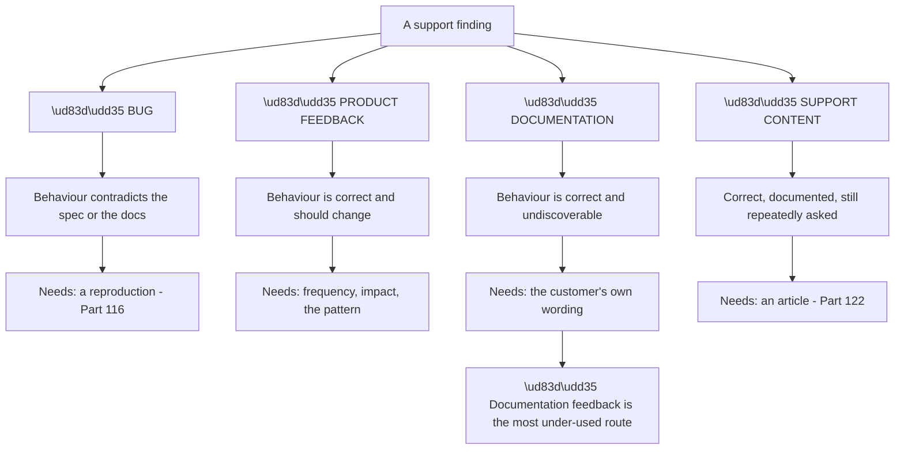
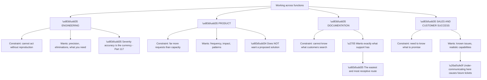
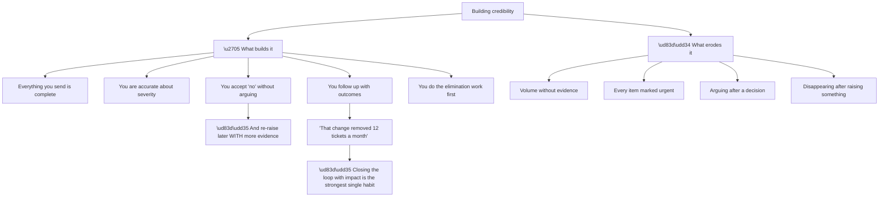
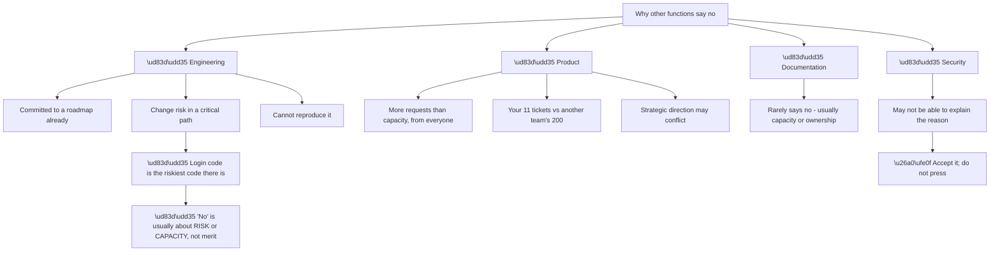
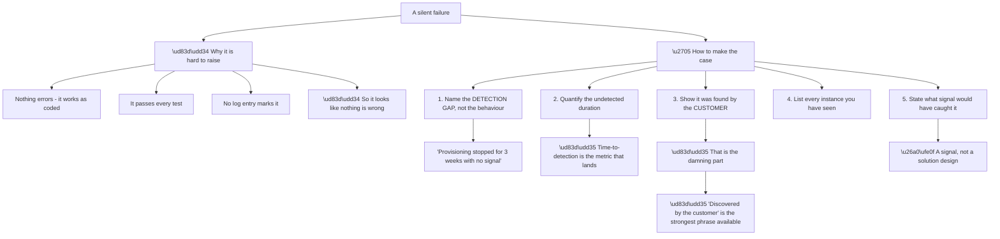
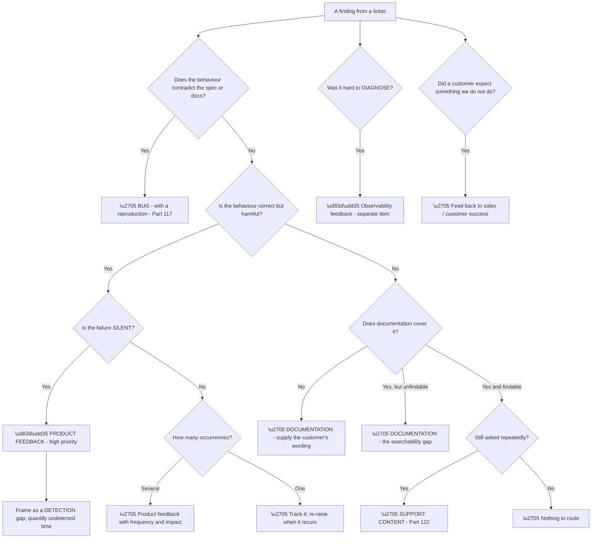

# Part 124 - Cross-Functional Collaboration and Product Feedback

> Section goal: Turn support findings into product and documentation change — and work effectively with the teams who own those changes, who have their own priorities and constraints.

Covers index item **124**. Maps to JD signals: *cross-functional collaboration*, *proactivity*, *technical writing*, *customer-facing communication*, *continuous improvement*, *root cause analysis*.

---

## 1. Start From Zero: Why Support Sees What Others Cannot

Support occupies a position no other function does, **and that position produces information nobody else has.**

**Node V3a is the reframing that makes support feedback valuable rather than complaining.** **One customer making a mistake is user error; twenty making the same mistake is a design signal** — the affordance is wrong, the documentation is unfindable, or the safe path is not the obvious one.

**Node V5a is the finding type most likely to be missed by everyone else.** **How hard something is to diagnose is invisible until something breaks**, and only support experiences it. A silent provisioning quarantine (Part 094) works perfectly in every test and fails invisibly in production — **nobody but support would ever notice.**

**Node R1 is the whole point of this Part.** **Information that stays in closed tickets helps nobody.** The value is entirely in the routing.

| Support sees | Which nobody else sees |
|---|---|
| The product as actually used | Design assumed otherwise |
| Repeated identical mistakes | Each looks individual from inside |
| Where documentation fails to reach | Documentation looks complete |
| **How hard things are to diagnose** | **Invisible until it breaks** |
| Which failures are silent | Tested paths all produce errors |

> 💡 **Tie-in to your background:** you have escalated to engineering and product teams and worked in Technical Advisor and Aspire Leadership programmes — **both are structurally about carrying information between functions.**

### 🔍 Plain-English deep-dive: what makes feedback get acted on

Most product feedback from support is ignored, and **the reasons are consistent enough to design around.**

**Node R is the practical priority.** **Frequency converts an anecdote into a pattern**, and it is the element most often missing. *"Customers find this confusing"* is dismissible; **"fourteen tickets in three months, averaging ninety minutes each"** is not.

**Node I5a is the mistake well-intentioned people make most.** **Proposing a specific solution invites a debate about the solution** rather than agreement about the problem — and product teams reasonably own that decision, so a proposal reads as encroachment.

**"Here is a problem, with evidence and frequency"** is harder to reject than **"you should add a setting for X."**

| Weak feedback | Strong feedback |
|---|---|
| "Customers find connections confusing" | "14 tickets in 3 months where the connection was not enabled for the application; average 90 minutes each" |
| "You should add a warning here" | "Developers place Management API secrets in front-end code; 6 occurrences; the documentation path leads there logically" |
| "The docs are bad" | "This symptom is not searchable from the customer's wording; here are the 8 phrasings they used" |
| "This is a bug" | "This behaviour is documented and surprises people consistently — 11 occurrences" |

**Row two illustrates node A5a well:** it names the problem, the frequency, **and the reason it happens** — without proposing a fix. **The product team can see the path and decide what to do about it.**

**Analogy:** a field engineer reporting that a particular part fails in service. "It's a bad design" is dismissible; "seventeen failures in six months, all in the same conditions, here are the units" is not — and it does not tell the designers how to redesign it. **Where it stops:** the field engineer may know the fix. Offering it as an observation rather than a requirement is what keeps it welcome.

---

## 2. The Four Destinations

Support findings go to four different places, **and sending one to the wrong destination wastes it** (Part 117).

**Node R is worth acting on.** **Documentation feedback is cheap to act on, fast to ship, and frequently sufficient** — and support is uniquely positioned to supply the missing ingredient: **the words customers actually use.**

**A documentation team cannot know that customers search "my data disappeared"** rather than "identity linking." **Support can, because it is in the tickets.**

| Finding | Destination | The distinguishing question |
|---|---|---|
| Contradicts the spec | Bug | Can you cite the expected behaviour? |
| Correct but harmful | Product feedback | Is it working as designed? |
| Correct but unfindable | Documentation | Does the documentation exist? |
| Correct, documented, still asked | Support content | Is it findable in the customer's words? |
| Hard to diagnose | Product feedback (observability) | Would you have found it faster with better signals? |
| Silent failure | **Product feedback, high priority** | Does anything alert? |

**The last two rows are the ones support is uniquely qualified to raise** and the ones most often left unraised, because they do not feel like defects.

---

## 3. Working With Other Functions

Each function has its own constraints, **and understanding them makes collaboration easier.**

**Node D2a is the under-used opportunity.** **Documentation teams actively want the information support has** and rarely receive it — the customer's phrasings, the questions the documentation does not answer, the places people give up. **It is the lowest-friction route available.**

**Node S2a is worth naming** because the link is not obvious: **what sales promises becomes what support explains.** A capability oversold creates tickets months later from customers expecting something the product does not do — **and support is the function best placed to notice and correct the pattern.**

**Node P1 deserves empathy rather than frustration.** **Product teams receive far more requests than they can act on**, from sales, customers, engineering, leadership, and support. **A well-evidenced piece of feedback competes well; a complaint does not** — and the difference is entirely in the preparation.

**How to make each collaboration work:**

| Function | Give them |
|---|---|
| Engineering | Reproduction, eliminations, and the specific ask |
| Product | Frequency, impact, the pattern, no proposed solution |
| Documentation | **The customer's own words**, and where they gave up |
| Sales / Customer Success | Known issues and realistic capability statements |

---

## 4. Being a Useful Colleague

Cross-functional work is a long relationship, and **credibility compounds.**

**Node G4a is the habit that most changes how future feedback is received.** **Telling a product or documentation team what their change achieved** — measured, specifically — makes the next piece of feedback from you materially more welcome.

**It is also almost never done.** Feedback is raised, acted on, and the person who raised it moves on. **Reporting the outcome takes two minutes and is disproportionately valuable.**

**Node G3a is a nuance worth holding.** Accepting a "no" **is not the same as abandoning it.** A rejected item that recurs can be re-raised **with the additional evidence that has accumulated** — and that is a stronger position than arguing at the time, because the frequency has grown.

| Instead of | Do |
|---|---|
| Arguing when rejected | Accept; track; re-raise with more evidence |
| Raising ten items | Raise the two with the best evidence |
| Marking everything urgent | Reserve it, so it means something |
| Going quiet after raising | Follow up with the outcome |
| Complaining about the product | Evidence the pattern |

**Row two is a discipline worth applying.** **Two well-evidenced items get more attention than ten thin ones** — and the ten make the two harder to see.

### 🔍 Plain-English deep-dive: understanding the constraints you are pushing against

Collaboration improves markedly when you understand **why the other function says no**, because most refusals are structural rather than dismissive.

**Node E2a is worth genuine respect.** **Authentication code is among the riskiest to change** — a regression there does not degrade a feature, it locks everyone out or lets the wrong people in. **A conservative response to a change in that path is good engineering**, not obstruction.

**Node P2 is the comparison your feedback is actually being weighed against.** Eleven tickets feels substantial from inside your own queue; **it competes with items affecting far larger populations.** Knowing that reframes a rejection from dismissal to arithmetic — **and it suggests the useful response is to strengthen the evidence rather than to argue.**

| Constraint | Useful response |
|---|---|
| Roadmap committed | Track; re-raise at planning time |
| **Change risk** | **Emphasise detection over behaviour change** |
| Cannot reproduce | Supply population evidence (Part 117) |
| Capacity | Strengthen the evidence; wait |
| Strategic conflict | Understand the direction; reframe |
| Security cannot explain | **Accept it** |

**Row two is a genuinely useful reframing.** **A detection improvement — a warning, an alert, a status field — carries far less risk than a behaviour change**, so proposing the detection gap rather than the behaviour is both more likely to be accepted and usually what the customer actually needed.

**Node S1a is a boundary to respect.** **Security teams sometimes cannot explain a refusal**, and pressing for a reason is unproductive and occasionally inappropriate. **Accepting it gracefully is the correct professional response.**

**And there is a timing insight worth using:** **roadmap and planning cycles are when tracked items get considered.** An item rejected in month two and re-raised with accumulated evidence just before planning **is in the right place at the right time** — a far better strategy than raising it repeatedly in between.

**Analogy:** requesting a change from a team already committed for the quarter who carry the risk if it goes wrong. Understanding both constraints turns the request from a demand into a proposal timed to when it can actually be considered. **Where it stops:** knowing the constraint does not remove it — it just stops you spending credibility pushing against something immovable.

---

### 🔍 Plain-English deep-dive: making the case for a silent failure

**Silent failures are the highest-value product feedback support can give**, and they are the hardest to argue for — because from inside the product, nothing is broken.

**Node R is the phrase that changes the conversation.** **"This was discovered by the customer, three weeks after it started"** is difficult to dismiss, because it describes an outcome nobody would defend — **and it reframes the issue from behaviour to detection.**

**Node E1a is the framing move.** Arguing that the *behaviour* is wrong invites debate — quarantining a failing provisioning job is defensible. **Arguing that the *silence* is wrong is much harder to contest:** whatever the behaviour, the customer should have known.

**The silent failures identified across this guide**, each of which is legitimate feedback:

| Silent failure | Undetected until |
|---|---|
| SCIM provisioning quarantine (094) | Someone counts missing new starters |
| Sync filter excluding objects (092) | A user cannot sign in |
| Log stream delivery stopped (107) | Evidence is needed and missing |
| Unnamespaced claim dropped (103) | An application misbehaves |
| Certificate expiry approaching (101) | It expires |
| Transient NameID duplicating users (101) | Someone notices the user count |
| Token size approaching a limit (091) | Senior staff cannot sign in |

**Seven, and every one was found by a customer** in the scenarios described. **That list itself is a strong piece of feedback** — not seven separate items but a pattern: **the product produces several failures that generate no signal until they cause harm.**

**Node E5a keeps it welcome.** **Say what signal would have caught it — an alert, a status field, a log entry — rather than designing the feature.** *"Anything that would have told them within an hour rather than three weeks"* leaves the design where it belongs.

**And there is a version of this argument that lands particularly well:** **compare time-to-detection against time-to-fix.** In Part 118's case, the fix took fifteen minutes and detection took nearly six hours. **A product change that moves detection from hours to minutes is worth more than one that makes the fix faster**, and that comparison is concrete enough to prioritise against.

**Analogy:** a warning light that does not exist. The engine is not faulty — it just fails without telling anyone, and the driver finds out when the car stops. Arguing about whether the failure mode is acceptable is a long conversation; arguing that there should be a light is a short one. **Where it stops:** a light needs somewhere to be seen. The equivalent question for software is where the signal surfaces, which is a design decision for someone else.

---

## 5. Failure Modes

| # | Failure mode | Symptom | Fix |
|---|---|---|---|
| 1 | Findings stay in tickets | Nothing improves | Route them |
| 2 | Opinion without evidence | Ignored | Frequency and impact |
| 3 | Instance not pattern | Dismissed as one customer | Count occurrences |
| 4 | Proposing a solution | Debate about the solution | State the problem |
| 5 | Wrong destination | Sits unactioned | Four-destination test |
| 6 | Documentation route unused | Cheap wins missed | Supply the customer's words |
| 7 | Complaint framing | Defensive response | Neutral, evidenced |
| 8 | Ten thin items | The good ones are lost | Raise the best two |
| 9 | Everything urgent | Urgency loses meaning | Reserve it |
| 10 | Arguing after rejection | Credibility spent | Accept; re-raise with more |
| 11 | No follow-up | Next feedback less welcome | Report the outcome |
| 12 | Silent failure not raised | Highest-value gap persists | Frame as a detection gap |
| 13 | Sales expectation gap ignored | Future ticket volume | Feed back capability reality |
| 14 | Not tracking rejected items | Evidence never accumulates | Keep the list |

---

## 6. Troubleshooting Decision Tree: Routing a Finding

### Puttng it together: a worked example

A quarterly review of your own tickets identifies a pattern: **eleven tickets in three months where enterprise SSO stopped working because a certificate expired on a manually-configured connection.**

**Node B: does it contradict the spec?** No — **certificate expiry is correct behaviour**, and a manually-configured connection holding a static certificate is doing exactly what it was told.

**Node C: correct but harmful?** Yes. Every one of the eleven was a **total outage** for that customer's enterprise users.

**Node D: is the failure silent?** **Partly, and this is the important part.** The failure itself is loud — logins stop. **But the approach of the expiry is completely silent**: nothing warns anyone in the weeks before, and nobody discovers it until it happens.

**So it routes as product feedback, framed as a detection gap.**

**The submission:**

> **Pattern:** enterprise SSO outages caused by signing certificate expiry on manually-configured connections.
>
> **Frequency:** 11 occurrences across 9 customers in 3 months, from my tickets alone.
>
> **Impact:** each was a total outage for that customer's enterprise users. Median duration 2.5 hours; longest 7 hours. Median time to *detection* 90 minutes — in every case it was discovered by the customer's users rather than by any monitoring.
>
> **What happens:** the connection holds a static certificate. The upstream IdP rotates on schedule, correctly. Nothing on either side signals the approaching expiry, so the first indication is a total failure.
>
> **The detection gap:** the expiry date is known in advance — it is in the certificate. Nothing surfaces it.
>
> **What would have helped:** any signal in the weeks before expiry. I am not proposing a specific mechanism.
>
> **Evidence:** ticket references attached, with timestamps and durations.

**Six elements**, and each does specific work:

| Element | Why it lands |
|---|---|
| Frequency | Pattern, not anecdote |
| **Impact with durations** | Quantified harm |
| **"Discovered by the customer"** | **The hardest part to defend** |
| Mechanism | Shows it is understood, not just complained about |
| **Detection gap framing** | Not arguing the behaviour is wrong |
| No proposed solution | Leaves design where it belongs |

**And there are two secondary routes from the same finding:**

**Documentation** — the guidance does not make the manual-versus-metadata trade-off's consequence vivid enough. **Supplying the customer phrasings from those eleven tickets is exactly what a documentation team cannot generate themselves.**

**Support content** — an article titled with the symptom (Part 122), which helps immediately while any product change is considered.

**Then the follow-up, three months later**, which is the part almost nobody does: *"since the expiry warning shipped, I have had zero tickets of this type — previously about four a month."* **Two minutes, and it makes every subsequent submission from you more welcome.**

---

## 7. Lab: Route and Submit

**Purpose.** Practise the routing decision and write submissions that would actually be acted on.

**Prerequisites.**
- Parts 111–123 completed
- **Use this guide's findings only**

**Steps.**

1. **List ten findings** from this guide — one per Group where possible.
2. **Route each** using the four destinations. Write one line justifying each.
3. **Identify which are silent failures** and mark them as high-priority product feedback.
4. **Choose the strongest** and write a full product feedback submission with all six elements from §6.
5. **Check it proposes no solution.** Rewrite if it does.
6. **Write a documentation submission** for a different finding, including **five phrasings a customer would actually search.**
7. **Write a bug report** for a third, with a reproduction reference (Part 117).
8. **Write the silent-failure list** from §4 as a single pattern submission rather than seven items.
9. **Write a follow-up message** reporting the outcome of a change, with a number.
10. **Write a sales-feedback note:** a capability customers expect that the product does not have.
11. **Practise the rejection response:** write what you would say to a "no", and what you would track for a future re-raise.
12. **Build your feedback card:** the four destinations, the six submission elements, and the silent-failure framing.

**Expected evidence.**
- Ten findings routed with justifications
- A full product feedback submission
- A documentation submission with customer phrasings
- A bug report
- A single-pattern silent-failure submission
- An outcome follow-up with a number
- A sales-feedback note
- A rejection response and tracking plan
- Your feedback card

**Validation rubric.**

| Criterion | Pass |
|---|---|
| Routing | You choose correctly between four destinations |
| Frequency | Every submission quantifies occurrences |
| Impact | Quantified, with durations or user counts |
| No solution proposed | Problem stated, design left open |
| Silent failures | Framed as detection gaps |
| Documentation | Supplies the customer's own words |
| Follow-up | You report outcomes with numbers |
| Rejection | You accept and track rather than argue |

**Cleanup and privacy.** **Use this guide's findings or synthetic ones.** Do not submit or draft feedback based on a real employer or customer case, and **keep any personal pattern list to topics only** (Part 112).

---

## 8. JD Mapping

| JD signal | How this Part addresses it |
|---|---|
| Cross-functional collaboration | Four functions and their constraints |
| Proactivity | Routing findings rather than closing tickets |
| Technical writing | Submissions that get acted on |
| Customer-facing communication | Feeding capability reality to sales |
| Continuous improvement | Closing the loop with outcomes |
| Root cause analysis | Patterns rather than instances |

---

## 9. Candidate Honesty Note

- **Production experience:** escalating to engineering and product teams; Technical Advisor and Aspire Leadership programmes, both of which are about carrying information across functions.
- **Production experience:** recognising repeated patterns rather than treating each ticket as isolated.
- **Lab experience:** routing this guide's findings across four destinations and writing submissions with the six elements, as above.
- **Learned architecture:** the silent-failure framing and the detection-gap argument.
- **No direct experience:** submitting product feedback in this company's process.
- **How to say it:** *"The thing I'd want to bring is the routing discipline — a finding that stays in a closed ticket helps nobody, and the four destinations need different things. The framing I find most useful is for silent failures: arguing the behaviour is wrong invites debate, whereas arguing that the customer discovered it three weeks later is very hard to defend. And I'd close the loop with outcomes, because almost nobody does and it makes the next submission much more welcome."*

---

## 10. Official Source Anchors

| Source | Why | Accessed |
|---|---|---|
| Okta — company values | "Drive what's next" and "Build and own it" | Accessed **26 August 2026** |
| Auth0 Docs | The documentation surface feedback would improve | Accessed **26 August 2026** |
| Okta Developer Forum — `devforum.okta.com` | Where patterns become visible publicly | Accessed **26 August 2026** |
| Google SRE Book — Postmortem Culture | Blameless framing for systemic findings | Accessed **26 August 2026** |

> **Revalidate:** internal feedback processes are organisation-specific. Learn the actual routes on joining.

---

## ⭐ Likely Interview Questions for This Section

### Q1. "What does support see that other functions don't?"

> *Model answer:* The product as actually used rather than as designed, failure at volume, and — the most valuable one — the same mistake made repeatedly. That last one matters because one customer making a mistake is user error, and twenty making the same mistake is a design signal: the affordance is wrong, the documentation is unfindable, or the safe path is not the obvious one. Support also sees how hard things are to diagnose, which is invisible to everyone else because it only surfaces when something breaks. And it sees which failures are silent, which is the highest-value finding of all, because a failure that produces no error passes every test and looks fine from inside the product.

### Q2. "What makes product feedback get acted on?"

> *Model answer:* Frequency, above everything. "Customers find this confusing" is dismissible; "fourteen tickets in three months, averaging ninety minutes each" is not. Then quantified impact — users affected, duration, whether they were blocked. Then the pattern rather than the instance, with evidence attached. And the thing I would deliberately not do is propose a solution, because product teams own that decision and a proposal invites a debate about the solution rather than agreement about the problem. Stating the problem neutrally with evidence is harder to reject than "you should add a setting for X."

### Q3. "How do you decide where a finding should go?"

> *Model answer:* Four destinations, with a distinguishing question for each. If the behaviour contradicts the specification or the documentation, it is a bug and needs a reproduction. If it is correct but harmful, it is product feedback and needs frequency and impact. If it is correct but not discoverable, it is documentation — and that is the most under-used route, because it is cheap, fast, and support has the one thing documentation teams cannot generate themselves: the words customers actually search. And if it is correct, documented, findable, and still asked repeatedly, it is support content — an article. Sending something to the wrong destination usually means it sits unactioned.

### Q4. "How would you argue for fixing a silent failure?"

> *Model answer:* By framing it as a detection gap rather than a behaviour problem. Arguing that the behaviour is wrong invites debate — quarantining a failing provisioning job after repeated errors is defensible. Arguing that the silence is wrong is much harder to contest, because whatever the behaviour, the customer should have known. So I would quantify the undetected duration, and lead with the fact that it was discovered by the customer rather than by any monitoring — that phrase is the strongest one available, because nobody wants to defend it. Then say what signal would have helped, without designing the feature. And I would compare time-to-detection against time-to-fix, because a change that moves detection from hours to minutes is often worth more than one that speeds the fix.

### Q5. "Your feedback gets rejected. What do you do?"

> *Model answer:* Accept it without arguing, and track it. Arguing at the time spends credibility for very little, and product teams receive far more requests than they can act on, so a rejection is often about capacity rather than disagreement. But accepting is not the same as abandoning — I would keep the item on a list and re-raise it when the evidence has grown, which is a stronger position than the original submission because the frequency has increased. The thing that makes this work over time is being accurate: if the items I raise are consistently well-evidenced and I do not argue when told no, the ones I do push on get taken more seriously.

### Q6. "What's the habit that most improves cross-functional relationships?"

> *Model answer:* Closing the loop with outcomes, and almost nobody does it. Telling a product or documentation team what their change actually achieved — "since that shipped I've had zero tickets of this type, previously about four a month" — takes two minutes and makes every subsequent submission from me materially more welcome. It also gives them something they usually lack, which is evidence that their work had an effect. The related habit is severity accuracy: reserving urgency so it means something, because marking everything urgent means nothing is, and that erodes fastest with the people you most need to trust you.

### Q7. "How do you work with sales or customer success?"

> *Model answer:* By feeding back the reality of what the product does, because what gets promised becomes what support explains. A capability oversold creates tickets months later from customers expecting something that does not exist, and support is the function best placed to notice that pattern and correct it. So I would share known issues and realistic capability statements proactively rather than waiting to be asked. It is easy to frame that as complaining about sales, and it is not — they cannot know what customers discover in month three, and telling them is genuinely useful to both sides.

### Q8. "Give an example of turning support findings into a change."

> *Model answer:* A pattern I would raise is enterprise SSO outages from certificate expiry on manually configured connections. Individually each is a ticket; together, eleven occurrences across nine customers in three months is a pattern. The submission would carry the frequency, the impact with actual durations, the mechanism — the connection holds a static certificate, the identity provider rotates correctly, and nothing signals the approaching expiry — and the framing that in every case it was discovered by the customer's users rather than by monitoring. Then what would have helped, stated as a signal rather than a design. And I would route two secondary items from the same finding: documentation, supplying the phrasings customers used, and a support article titled with the symptom so it helps immediately while anything else is considered.

---

## 🧠 30-Second Memory Hooks

- **Support's view is unique — and worthless if it stays in tickets.**
- **One mistake is user error. Twenty is a design signal.**
- **Frequency is the strongest element.** Quantify occurrences.
- **State the PROBLEM; never propose the solution.**
- **Four destinations: bug · product · documentation · support content.**
- **Documentation is the cheapest, fastest, most receptive route.**
- **Supply the customer's own words** — nobody else has them.
- **Silent failures = highest value.** Frame as a DETECTION gap.
- **"Discovered by the customer" is the hardest phrase to defend.**
- **Compare time-to-detection with time-to-fix.**
- **Two well-evidenced items beat ten thin ones.**
- **Accept a "no"; track it; re-raise with more evidence.**
- **Close the loop with an outcome and a number.**
- **What sales promises becomes what support explains.**

---

## ✅ Completion Checklist

- [ ] I route findings rather than closing tickets
- [ ] Every submission carries frequency and quantified impact
- [ ] I state problems and leave solutions to product
- [ ] I can choose correctly between the four destinations
- [ ] I use the documentation route and supply customer phrasings
- [ ] I frame silent failures as detection gaps
- [ ] I lead with "discovered by the customer" where true
- [ ] I raise few, well-evidenced items
- [ ] I accept rejections and track them for re-raising
- [ ] I close the loop with outcomes and numbers
- [ ] I feed capability reality back to sales

*Next suggested section:* **[Part 125 - AI-Assisted Support: Safe Workflows and Guardrails](Part-125-ai-assisted-support-safe-workflows-and-guardrails.md)** — using AI tools in support work responsibly, including where they help, where they mislead, and what must never go into them.
