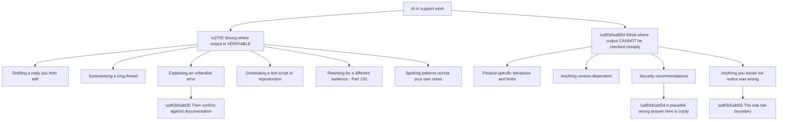
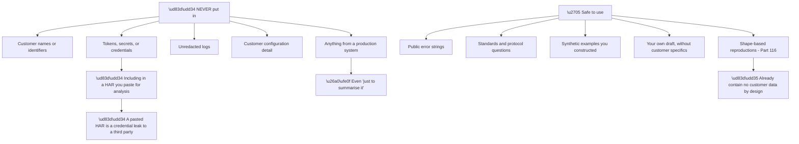
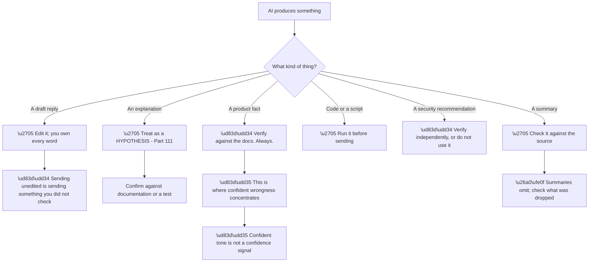
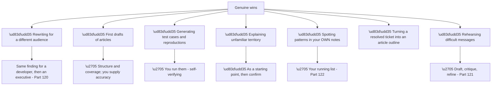
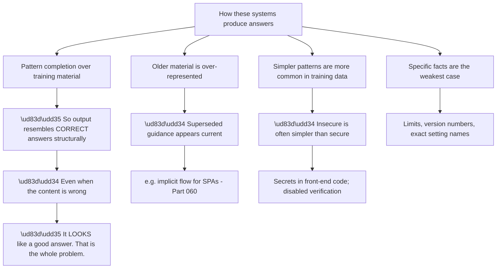
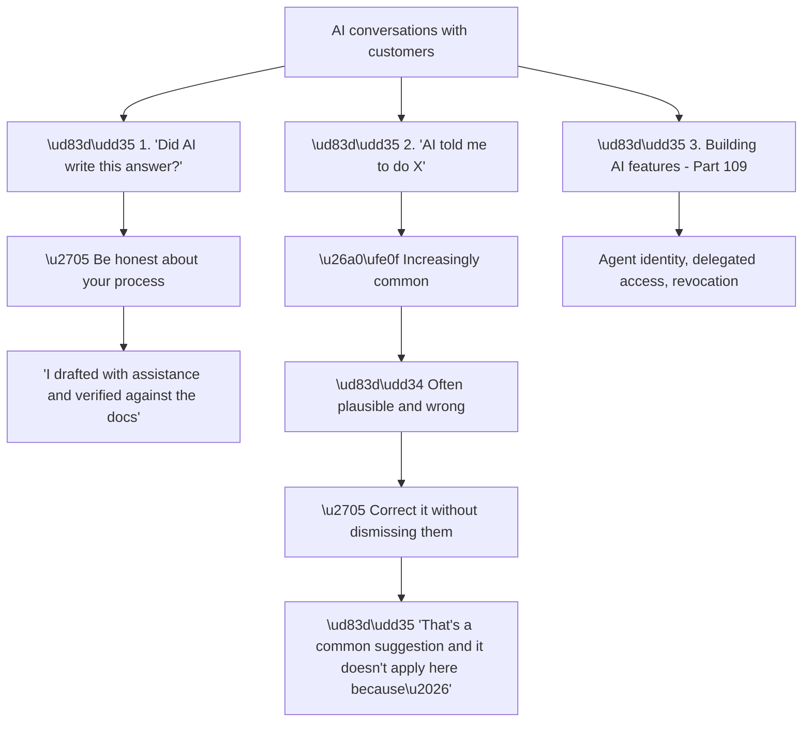
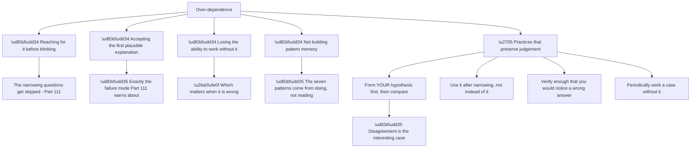
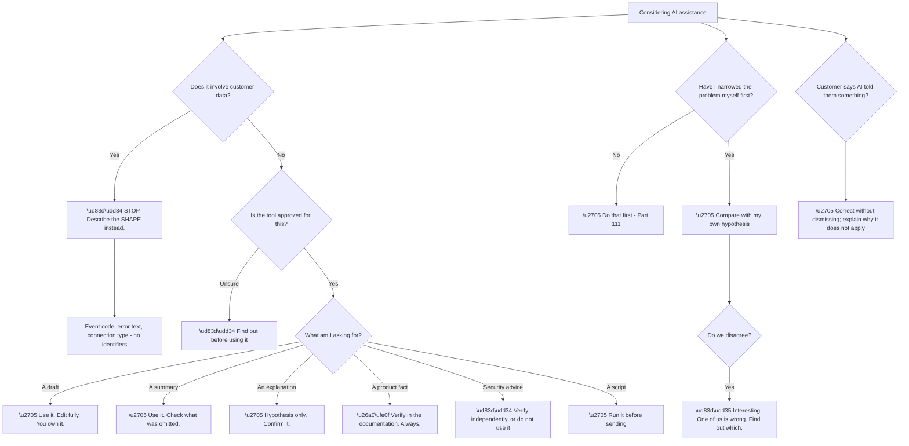

# Part 125 - AI-Assisted Support: Safe Workflows and Guardrails

> Section goal: Use AI tools in support work responsibly — where they genuinely help, where they mislead in ways that matter, and what must never be put into them.

Covers index item **125**. Maps to JD signals: *AI*, *security*, *data handling*, *customer-facing communication*, *troubleshooting complex technical issues*, *continuous improvement*.

---

## 1. Start From Zero: Where AI Helps and Where It Does Not

AI assistance is genuinely useful in support and genuinely dangerous in specific ways. **The distinction is not about capability — it is about verifiability.**

**Node B4a is the boundary that matters.** **AI is safe where you would immediately notice a wrong answer** and unsafe where you would not — which means its usefulness is highest in areas you already understand, and lowest in areas you do not.

**That is the opposite of how it is often used**, and it is the single most important thing to internalise.

**Node B3a deserves separate weight.** A plausible-sounding but wrong security recommendation **gets implemented** in developer support (Part 096), and the damage is not recoverable by a follow-up correction.

| Task | Safe? | Because |
|---|---|---|
| Draft a reply | ✅ | You edit and own it |
| Summarise a thread | ✅ | You can check against the thread |
| Explain a standard error | ✅ | Verifiable against a specification |
| **State a product limit** | ❌ | **Confidently wrong is common** |
| **Recommend a security approach** | ❌ | **Wrong answers get shipped** |
| Write a reproduction script | ✅ | You run it |
| Rewrite for another audience | ✅ | You read the result |

> 💡 **Tie-in to your background:** you hold relevant AI certifications and have supported Copilot. **You are unusually well placed to speak about AI in support credibly** — including about its limits, which is what makes it credible.

### 🔍 Plain-English deep-dive: what must never go in

Data handling with AI tools is the area where a well-meaning mistake causes real harm, and **the rules are simple and absolute.**

**Node N2a is the specific failure to guard against.** A HAR is exactly the kind of large, structured artefact that feels natural to paste for analysis — **and it contains session cookies, authorization codes, and often tokens** (Part 112). **Pasting one into an external tool transmits live credentials outside the organisation.**

**Node N5a covers the rationalisation.** *"Just to summarise it"* feels harmless and is not — **the data has left, regardless of the purpose.** The intent does not change the exposure.

**Node A5a is the useful consequence of Part 116's discipline.** **A shape-based reproduction contains no customer data by construction**, which makes it safe to discuss with an AI tool, put in a bug report, or publish in an article. **One practice serves three purposes.**

| Instead of | Do |
|---|---|
| Pasting a HAR | Describe the shape: "a callback with a code, then a 400 on token exchange" |
| Pasting logs | Quote the event code and the error text only |
| Pasting a token | Describe the claims: "aud is the client ID, not the API" |
| Pasting configuration | State the type: "SAML connection, transient NameID" |
| Naming the customer | "A B2B customer with an Entra connection" |

**Every replacement preserves the diagnostic content** and removes the identifying content, **which is the same principle as reproducing from shape.**

**And there is an organisational dimension:** **approved tools differ from unapproved ones.** An organisation may run tooling with appropriate data agreements in place; **a personal account with a public service does not carry those.** Knowing which is which is part of the job, and assuming is not acceptable.

**Analogy:** discussing a case with an outside consultant. Describing the pattern is fine; handing over the file is not, regardless of how helpful they would be with it. **Where it stops:** a consultant is bound by an agreement. A tool used outside an approved arrangement is not, and the data does not come back.

---

## 2. The Verification Discipline

The core skill is **using AI output as a draft or a hypothesis, never as an answer.**

**Node R is the property that makes AI output specifically hazardous.** **The tone is uniformly confident regardless of accuracy** — there is no signal distinguishing a well-grounded answer from a fabricated one. **Human colleagues hedge when unsure; this does not.**

**Node D1a is the professional point.** **A reply sent unedited is a reply you did not check**, and you own it entirely once sent. The customer receives it as yours.

**Node D6a is the subtle summary failure.** Summaries are usually accurate about what they include and **silently omit** — a thread summary that drops the one message where the customer said something crucial is **accurate and misleading at once.**

| Output type | Verification |
|---|---|
| Draft reply | Edit fully; own every word |
| Explanation | Confirm against a specification |
| **Product fact** | **Documentation, always** |
| Script | Run it |
| **Security advice** | **Independently, or discard** |
| Summary | Check what was omitted |

**Rows three and five are the ones where discipline slips under time pressure**, and both are where a mistake is most costly.

---

## 3. Where AI Genuinely Helps in This Role

Used within the boundaries, there are real gains.

**Node H1a is the highest-value routine use.** Part 120 required writing one finding three ways; **producing the alternative registers quickly, then editing for accuracy, is a real time saving** on work that is otherwise tedious.

**Node H5a is under-used and safe.** **Your own notes about repeated topics** contain no customer data if kept properly (Part 122), **and pattern-finding across them is exactly what AI does well.**

**Node H3a is self-verifying by nature**, which is what makes it safe: **you run the script, and it either reproduces or does not.** No trust is required.

**Node H7a is a genuinely good use** that people do not think of: **drafting a difficult message, then asking for critique of its tone**, is a fast way to catch defensiveness or over-promising before sending (Part 121).

**The pattern across all of these:** **AI does the first pass on things where you can check the result**, and you do the thinking on things where you cannot.

### 🔍 Plain-English deep-dive: why wrong answers are *plausible* rather than obviously wrong

Understanding the failure mechanism makes the guardrails feel necessary rather than bureaucratic.

**Node R is why ordinary judgement fails here.** **A wrong answer from a person usually sounds uncertain or incomplete**; a wrong answer from these systems has the same shape and tone as a right one. **The usual heuristics for detecting a weak answer do not apply.**

**Node M2b and M3b explain the specific bias in this domain**, and it is worth knowing because it predicts what customers will arrive with:

| Bias | Produces |
|---|---|
| Older material over-represented | Implicit flow, deprecated endpoints, superseded advice |
| Simpler patterns more common | Secrets in front-end code, disabled verification |
| Specifics weakest | Fabricated settings, wrong limits, invented parameters |
| Confident tone always | No signal that any of the above happened |

**Every row points in the same direction: toward older and less secure patterns**, which is exactly the direction support should be pulling against (Part 096).

**Node M4a is worth a specific habit.** **Anything numeric or named — a rate limit, a maximum, an exact setting name, an endpoint path — is the weakest category** and should be verified as a reflex rather than a decision. **These are also the easiest things to check**, which makes the discipline cheap.

**And there is a reassuring corollary.** **The things it does well — restructuring, summarising, drafting, explaining well-established standards — are exactly the things where its strengths are real.** The guardrails are not a general suspicion; they are targeted at a known and predictable failure profile.

**Analogy:** a very fluent speaker who has read widely and remembers imperfectly. Excellent at explaining a well-known concept, at rephrasing something for a different listener, and at drafting. Unreliable on a specific figure or a recent change — and equally confident either way. **Where it stops:** with a person you eventually learn where their knowledge thins. Here the fluency is uniform, so the boundary has to be enforced by process.

---

## 4. Talking to Customers About AI

Customers increasingly ask about AI, and **there are two distinct conversations.**

**Node C2a is now a routine support scenario.** Customers arrive having asked an AI assistant, and **the suggestion is frequently plausible, confidently stated, and wrong** — often subtly, and often in the direction of insecurity, because insecure configurations are simpler and better represented in training data.

**Node R is the phrasing that works.** **Correcting without dismissing** matters, because the customer acted reasonably: *"that's a common suggestion, and it doesn't apply here because your application is a public client, which means it can't hold a secret."* **It corrects, explains, and does not make them feel foolish.**

**The specific pattern to watch for:** **AI-suggested workarounds that weaken security** — disabling certificate validation, relaxing issuer checks, using the implicit flow, embedding secrets. **These appear regularly, and Part 096's "always secure" value applies exactly.**

| Customer says | Likely issue |
|---|---|
| "AI said to use the implicit flow" | Outdated guidance |
| "AI said to disable verification" | Insecure workaround |
| "AI said this setting exists" | Fabricated |
| "AI said to put the secret in the front end" | Dangerous and common |
| "AI gave me this code" | May be plausible and wrong |

**Row three is worth naming separately.** **Fabricated settings and endpoints** are a recognisable failure mode, and a customer looking for something that does not exist can lose considerable time. **Confirming against the documentation resolves it quickly** and is worth doing before assuming a configuration error.

### 🔍 Plain-English deep-dive: keeping your own judgement sharp

The subtler risk is not a wrong answer — **it is gradual dependence that erodes the skills the role depends on.**

**Node P1a is the most valuable habit in this Part.** **Forming your own hypothesis before consulting, then comparing**, does three things: it preserves the skill, it surfaces disagreements worth investigating, **and it means you can evaluate the answer rather than only receive it.**

**When the two agree, confidence is genuinely higher.** When they disagree, **one of you is wrong and finding out which is the useful work.**

**Node D2a is the mechanism of the harm** and it connects directly to Part 111: **accepting a plausible explanation that fits most of the facts** is the failure mode that produces confidently wrong recommendations — and AI output is *unusually* plausible, which makes the trap deeper rather than shallower.

**Node D4a is the long-run cost.** **The seven patterns from Part 111 come from working through problems**, not from being told the answers. **An engineer who consistently outsources the narrowing does not accumulate the pattern memory** that makes them fast on the case where the tool is wrong.

| Practice | Preserves |
|---|---|
| Hypothesis first | Diagnostic reasoning |
| Compare, do not accept | Evaluation ability |
| Use after narrowing | The narrowing skill itself |
| Verify to a standard | The knowledge to verify with |
| Occasional unassisted cases | Independence |

**And there is a professional-identity point worth stating.** **What makes a support engineer valuable is judgement** — knowing which question to ask, recognising a pattern, knowing when an explanation is incomplete. **Tools make execution faster; they do not supply judgement**, and the engineer who has kept theirs is more valuable than before rather than less.

**Analogy:** a navigator who always uses the instrument. Faster, and their sense of the terrain quietly fades — which matters on the day the instrument is confidently wrong about a road that no longer exists. **Where it stops:** an instrument's errors are usually discoverable by looking out of the window. A wrong technical explanation may not be, until it has been implemented.

---

## 5. Failure Modes

| # | Failure mode | Symptom | Fix |
|---|---|---|---|
| 1 | Customer data pasted in | **Data handling breach** | Never; describe the shape |
| 2 | HAR pasted for analysis | **Credentials transmitted** | Describe the exchange |
| 3 | Unapproved tool used | Data outside agreements | Know which tools are approved |
| 4 | Product fact unverified | Confidently wrong answer sent | Documentation, always |
| 5 | Security advice unverified | Insecure configuration shipped | Verify independently or discard |
| 6 | Reply sent unedited | You own something you did not check | Edit fully |
| 7 | Summary trusted | Crucial detail omitted | Check what was dropped |
| 8 | Confident tone read as accuracy | Wrong answer accepted | Tone is not a signal |
| 9 | Used before narrowing | The method is skipped | Hypothesis first |
| 10 | First plausible answer accepted | Part 111's failure mode | Explain every fact |
| 11 | Customer's AI advice dismissed | They feel foolish | Correct without dismissing |
| 12 | Fabricated setting chased | Time lost | Confirm in the documentation |
| 13 | Dependence unnoticed | Skills erode | Occasional unassisted cases |
| 14 | Pattern memory not built | Slow when the tool is wrong | Do the narrowing yourself |

---

## 6. Troubleshooting Decision Tree: Safe AI Use

### Worked example

A developer writes:

> *"I asked an AI assistant and it said to set `verify_ssl` to false to fix our certificate error, and to use the implicit flow since our app is a SPA. I've done the first one and it works but my security team is asking questions. Can you confirm this is the right approach?"*

**Three things at once**, and the ordering matters.

**First: they have already implemented an insecure change**, which is now live. **That is the urgent item**, ahead of the flow question.

**Second: the advice they were given is plausible and outdated or wrong on both points.**

**Third: they came to check**, which is exactly right and should be acknowledged.

**Node F1: correct without dismissing.**

> Good instinct to check, and your security team is right to ask.
>
> **On certificate verification:** disabling it removes the protection against an interception attack — an attacker between your service and ours could present any certificate and you would accept it. The underlying error is almost always a missing intermediate certificate or a trust store that does not include the issuing CA. **Please re-enable verification**, and if you send me the exact error I'll identify which of those it is; it's usually a five-minute fix.
>
> **On the implicit flow:** that was standard guidance for single-page applications several years ago and is no longer recommended — it returns tokens in the URL fragment, where they can leak through browser history, referrers, and logs. The current approach for a SPA is authorization code with PKCE, which our SDK does by default. The AI suggestion likely reflects older material.
>
> Both of these are common suggestions and both were reasonable advice at one point, which is part of why they persist.

**Four properties make this work:**

| Property | Where |
|---|---|
| **Validates their checking** | First line |
| **Urgent item first**, with a clear instruction | Paragraph two |
| Explains the *reason*, not just the correction | Both paragraphs |
| **Offers the secure route to their actual goal** | "Send me the error" |
| Does not make them feel foolish | Last line |

**The last line is doing real work.** *"Both were reasonable advice at one point"* **is true and it removes the sting** — the developer is not careless, they received outdated guidance delivered confidently.

**And this is also product and documentation feedback** (Part 124): **if AI assistants are routinely recommending the implicit flow and disabling verification, customers will keep arriving with both.** That is a pattern worth documenting with a symptom-titled article (Part 122) — *"Should I disable certificate verification to fix this error?"* — because that is what they will search.

---

## 7. Lab: Build Safe Habits

**Purpose.** Establish the redaction reflex and the verification discipline before they are needed under pressure.

**Prerequisites.**
- Parts 111–124 completed
- **No real customer data at any point**

**Steps.**

1. **Write your never-paste list** from §1 in your own words. **Include the HAR case explicitly.**
2. **Take five artefacts** from your labs — a HAR, a log excerpt, a token, a configuration, a ticket description. **For each, write the shape-only description** you would use instead.
3. **Confirm each preserves the diagnostic content** and contains no identifiers.
4. **Take three questions** from this guide and answer each yourself first. **Write your answer before consulting anything.**
5. **Then consult an AI tool** and compare. **Note every disagreement.**
6. **For each disagreement, determine who was right** using the documentation. Record the result.
7. **Ask for a product-specific fact** you can verify. **Check it.** Record whether it was correct.
8. **Ask for a security recommendation** and evaluate it against Part 108's principles. **Note anything that would weaken security.**
9. **Draft a difficult message** (Part 121), then ask for a critique of its tone. **Note what it caught and what it missed.**
10. **Write the customer-facing correction** for an AI-suggested insecure workaround, using §6's structure.
11. **Work one full case from Part 118 without any assistance**, timed. **Note where you wanted to reach for it.**
12. **Build your AI card:** never-paste list, shape-description patterns, verification requirements by output type, and the hypothesis-first habit.

**Expected evidence.**
- Your never-paste list
- Five shape-only descriptions
- Three own-answers with comparisons and disagreement outcomes
- A verified product-fact result
- An evaluated security recommendation
- A tone critique with what it caught and missed
- A customer-facing correction
- A timed unassisted case with your notes
- Your AI card

**Validation rubric.**

| Criterion | Pass |
|---|---|
| Never-paste | Absolute, including HARs |
| Shape descriptions | Diagnostic content preserved, identifiers removed |
| Hypothesis first | You form yours before consulting |
| Disagreement | You investigate rather than defer |
| Product facts | You verify every one |
| Security | You verify independently or discard |
| Customer correction | Corrects without dismissing |
| Independence | You can work a case unassisted |

**Cleanup and privacy.** **No real customer data at any stage**, including in shape descriptions. **Delete any artefacts generated.** If using an AI tool for this lab, use one you are permitted to use, and **assume anything entered may be retained.**

---

## 8. JD Mapping

| JD signal | How this Part addresses it |
|---|---|
| AI | Practical use, limits, and customer conversations |
| Security | Data handling and insecure-suggestion correction |
| Data handling | The never-paste discipline |
| Customer-facing communication | Correcting without dismissing |
| Troubleshooting complex technical issues | Hypothesis-first and verification |
| Continuous improvement | Preserving judgement while gaining speed |

---

## 9. Candidate Honesty Note

- **Production experience:** supporting Copilot; relevant AI certifications — genuine grounding in how these systems behave and fail.
- **Production experience:** customer data handling discipline in an enterprise environment.
- **Lab experience:** building shape-only description patterns, testing hypothesis-first comparison, and evaluating AI security suggestions, as above.
- **Learned architecture:** the verifiability boundary and the dependence risk.
- **No direct experience:** using AI assistance in a live developer support queue.
- **How to say it:** *"I've supported Copilot and hold the AI certifications, so I'd say the useful thing I bring is knowing where these tools mislead. The boundary I use is verifiability — they're safe where I'd immediately notice a wrong answer and unsafe where I wouldn't, which means they help most in areas I already understand. And I form my own hypothesis before consulting, because the disagreements are the interesting cases and because the narrowing skill is the thing I'd be most reluctant to lose."*

---

## 10. Official Source Anchors

| Source | Why | Accessed |
|---|---|---|
| Auth0 Docs — Auth0 for AI Agents | The product's own AI surface (Part 109) | Accessed **26 August 2026** |
| Microsoft Learn — Responsible AI guidance | Verification and data handling principles | Accessed **26 August 2026** |
| OWASP — Top 10 for LLM Applications | Known failure modes of AI systems | Accessed **26 August 2026** |
| Okta — company values | "Always secure. Always on." applied to tooling | Accessed **26 August 2026** |

> **Revalidate:** AI tooling and organisational policy change rapidly. **Confirm current approved tools and data policy on joining**, and do not assume a previous employer's policy applies.

---

## ⭐ Likely Interview Questions for This Section

### Q1. "Where do you find AI useful in support work, and where not?"

> *Model answer:* The boundary I use is verifiability. It is safe where I would immediately notice a wrong answer — drafting a reply I then edit, summarising a thread I can check, generating a reproduction script I run, rewriting a finding for a different audience. It is unsafe where I would not notice: product-specific behaviour and limits, anything version-dependent, and especially security recommendations. Which means it helps most in areas I already understand and least in areas I do not, and that is the opposite of how people often use it. The property that makes it hazardous is that the tone is uniformly confident regardless of accuracy — a human colleague hedges when unsure, and this does not, so there is no signal to read.

### Q2. "What would you never put into an AI tool?"

> *Model answer:* Any customer data — names, identifiers, configuration, unredacted logs, and above all tokens or a HAR. A HAR is the specific one to guard against, because it is large and structured and feels natural to paste for analysis, and it contains session cookies, authorization codes, and often complete tokens. Pasting one transmits live credentials outside the organisation, and "just to summarise it" does not change that. What I do instead is describe the shape: "a callback arrives with a code, then the token exchange returns 400 invalid_grant" carries all the diagnostic content and no identifying content. It is the same discipline as building reproductions from shape rather than data, and one practice covers both.

### Q3. "A customer says an AI assistant told them to disable certificate verification. What do you do?"

> *Model answer:* Deal with the urgent part first — if they have already implemented it, that is a live security weakness and re-enabling it comes before any other discussion. Then correct without dismissing, because they acted reasonably and came to check, which is exactly right. I would explain the actual risk — that it removes the protection against an interception attack — and then offer the secure route to what they actually wanted, which is being unblocked: the underlying error is almost always a missing intermediate certificate or a trust store gap, and it is usually a five-minute fix. And I would note that the suggestion is common and was reasonable advice at one point, which is true and removes the sting. They are not careless; they received outdated guidance delivered confidently.

### Q4. "How do you avoid becoming dependent on it?"

> *Model answer:* By forming my own hypothesis before consulting, then comparing. That does three things: it preserves the diagnostic skill, it means I can evaluate the answer rather than only receive it, and the disagreements are the interesting cases — when we differ, one of us is wrong and finding out which is genuinely useful work. I also use it after narrowing rather than instead of narrowing, because the five questions are where the domain knowledge actually gets applied. And I would periodically work a case without it, because pattern memory comes from doing problems rather than being told answers, and that memory is what makes you fast on the case where the tool is confidently wrong.

### Q5. "What's the specific risk in developer support?"

> *Model answer:* That a wrong answer gets implemented. An IT administrator given poor advice usually notes it and does not act; a developer writes it into their application and ships it. So accuracy matters more here than in most support contexts, and an unverified product fact or security recommendation is not a small risk. The pattern I would watch for specifically is AI-suggested workarounds that weaken security — disabling verification, relaxing issuer checks, using the implicit flow, embedding secrets in front-end code. Those appear regularly, partly because insecure configurations are simpler and better represented in older material. And fabricated settings are their own problem: a customer looking for something that does not exist can lose a lot of time before anyone thinks to check the documentation.

### Q6. "Would you tell a customer you used AI to draft a reply?"

> *Model answer:* If asked, yes, honestly — something like "I drafted with assistance and verified everything against the documentation." What matters more than the disclosure is that it is true: I own every word of anything I send, so it has to be edited and checked rather than passed through. A reply sent unedited is a reply I did not check, and the customer receives it as mine regardless of how it was produced. I would be more careful with summaries than with drafts, actually, because summaries are usually accurate about what they include and silently omit — a thread summary that drops the one message where the customer said something crucial is accurate and misleading at the same time.

### Q7. "What's the failure mode you'd most want to avoid?"

> *Model answer:* Accepting the first plausible explanation, which is exactly the failure mode that produces confidently wrong diagnoses generally — and AI output is unusually plausible, so the trap is deeper rather than shallower. The discipline from troubleshooting applies directly: an explanation that fits most of the facts is partly wrong rather than mostly right, and the unexplained detail is usually the important one. So I treat an AI explanation as a hypothesis to test rather than an answer to relay, the same way I would treat my own pattern recognition. The second one I would guard against is verification slipping under time pressure, because product facts and security advice are exactly where I am most tempted to skip it and most costly to be wrong.

### Q8. "How do you think about AI changing this kind of role?"

> *Model answer:* It changes execution speed rather than what makes someone valuable. The judgement is the part that matters — knowing which question to ask first, recognising that a failure fraction of three quarters means four nodes, noticing that an explanation does not account for every fact, knowing when an answer is incomplete. Tools make drafting, summarising, and scripting faster, and none of them supply that. So I think an engineer who keeps their judgement sharp is more valuable than before rather than less, because they can move faster on the routine work and still be right on the case where the tool is wrong. The risk is the engineer who outsources the narrowing, because the pattern memory never accumulates and there is nothing to fall back on.

---

## 🧠 30-Second Memory Hooks

- **The boundary is VERIFIABILITY** — safe where you would notice a wrong answer.
- **Most useful in areas you already know. Least useful where you do not.**
- **Never paste: customer data, tokens, HARs, logs, configuration.**
- **A pasted HAR is a credential leak.**
- **"Just to summarise it" does not change the exposure.**
- **Describe the SHAPE instead** — same discipline as shape-based reproductions.
- **Confident tone is not a confidence signal.**
- **Product facts: verify in the documentation, always.**
- **Security advice: verify independently or discard.**
- **Summaries omit silently.** Check what was dropped.
- **Form your hypothesis FIRST, then compare.** Disagreements are the interesting case.
- **Customers arrive with plausible, insecure AI advice.** Correct without dismissing.
- **Fabricated settings waste real time.**
- **Judgement is the value. Tools speed execution, not thinking.**

---

## ✅ Completion Checklist

- [ ] I can state the verifiability boundary
- [ ] I have an absolute never-paste list, including HARs
- [ ] I describe shape rather than pasting artefacts
- [ ] I verify product facts against documentation, always
- [ ] I verify or discard security recommendations
- [ ] I edit and own every word I send
- [ ] I check what summaries omitted
- [ ] I form my own hypothesis before consulting
- [ ] I investigate disagreements rather than deferring
- [ ] I correct customers' AI advice without dismissing them
- [ ] I periodically work a case unassisted
- [ ] I know which tools are approved and do not assume

*Next suggested section:* **[Part 126 - Proactivity, Continuous Growth, and Culture Fit](Part-126-proactivity-continuous-growth-and-culture-fit.md)** — closing Group L with what makes someone valuable beyond their tickets, and how that maps to Okta's values.
