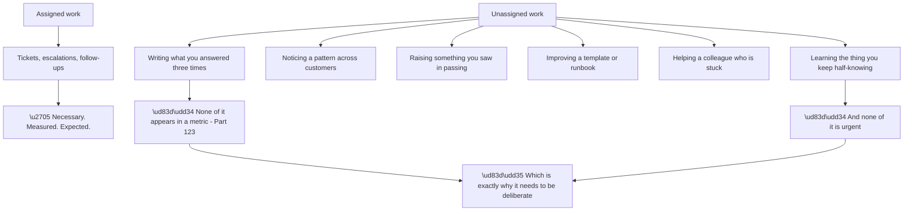
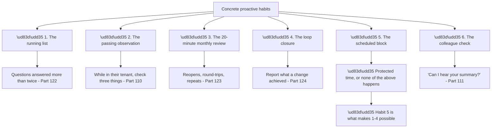
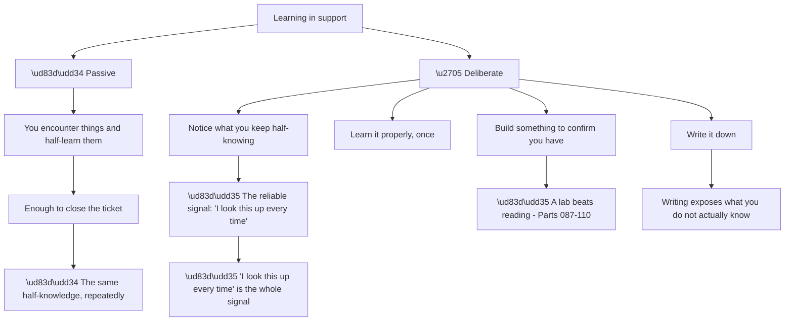
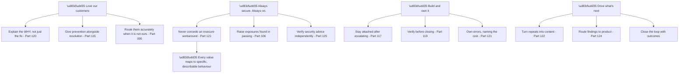
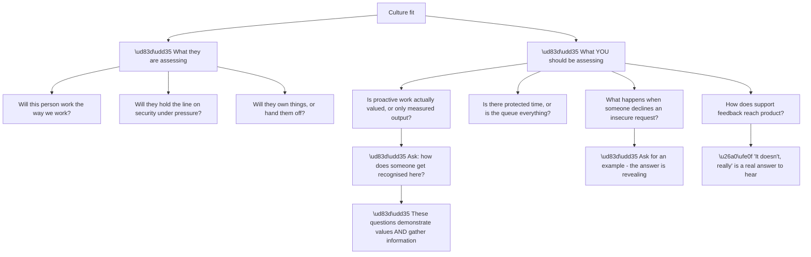
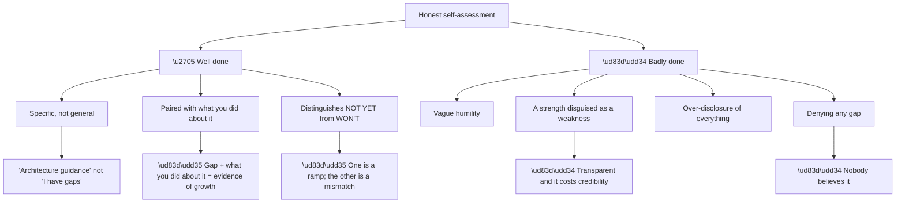
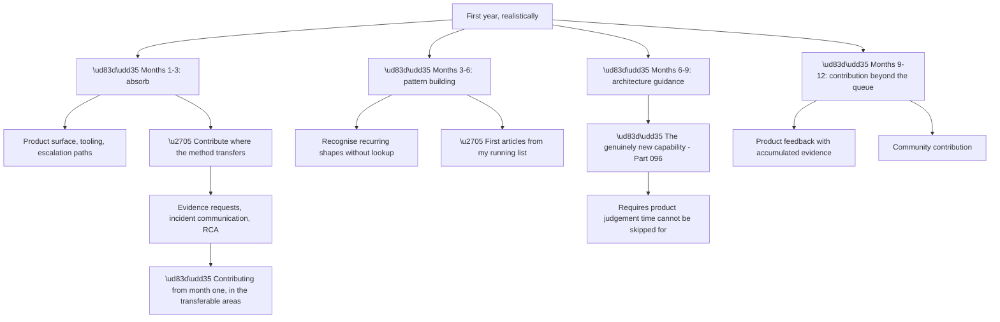
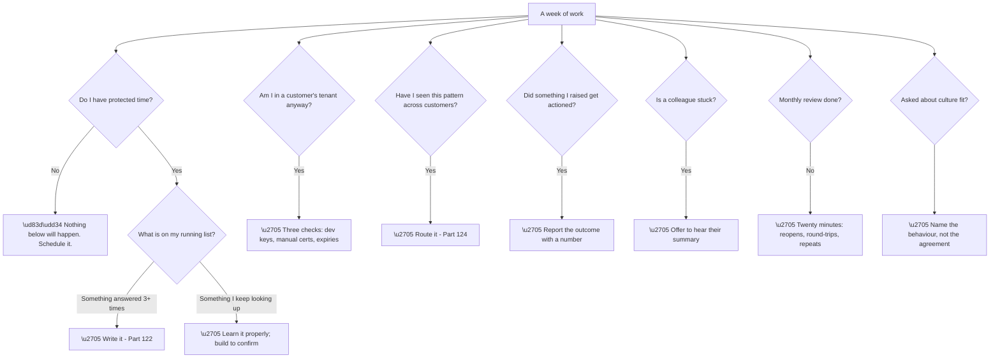

# Part 126 - Proactivity, Continuous Growth, and Culture Fit

> Section goal: Close Group L with what makes a support engineer valuable beyond their tickets — proactive contribution, deliberate learning, and genuine alignment with how Okta says it works.

Covers index item **126**. Maps to JD signals: *proactivity*, *continuous improvement*, *culture fit*, *cross-functional collaboration*, *customer-facing communication*, *ownership*.

---

## 1. Start From Zero: The Work Nobody Asks For

Every support engineer handles their queue. **What distinguishes people is what they do that nobody assigned.**

**Node R is the operational point.** **Unassigned work always loses to urgent work**, so it never happens by intention alone — it happens by scheduling, or not at all.

**Node P3 is the cheapest and most under-used.** **Noticing something while already in a customer's tenant** — development keys, a manual certificate, an over-scoped credential — **costs seconds and prevents a future outage** (Part 110).

| Proactive act | Cost | Value |
|---|---|---|
| Mention something noticed in passing | Seconds | A prevented outage |
| Write an article after the third repeat | 2 hours | Ongoing deflection |
| Route a pattern to product | 30 minutes | A removed ticket class |
| Improve a shared template | 30 minutes | Every colleague, every ticket |
| Learn something properly | Hours | Faster on every future case |

**Every row has a return exceeding its cost**, and every row is skippable indefinitely without anyone noticing.

> 💡 **Tie-in to your background:** ODSP SME, 100+ recognitions, Technical Advisor programme, Aspire Leadership Council — **these are all markers of unassigned work.** Nobody gets SME recognition for closing their own tickets.

### 🔍 Plain-English deep-dive: what proactivity actually looks like day to day

Proactivity is often described abstractly. **In practice it is a small number of concrete habits.**

**Node R is the enabling condition.** **Without protected time, the first four habits are good intentions** — the queue expands to fill whatever is available.

**A modest block — an hour or two a week — is enough** and is the difference between someone who intends to write things up and someone who does.

**Node H2a is the highest return per unit effort in this entire guide.** While already looking at a customer's tenant for an unrelated ticket, **three checks take under a minute**:

| Check | Prevents |
|---|---|
| Social connections on development keys? | Scale-related outage (Part 100) |
| Enterprise connections on manual certificates? | Annual outage (Part 101) |
| Anything expiring in the next 60 days? | The most predictable outage there is (Part 110) |

**Node H6a is the reciprocal habit** and is easy to overlook. **Offering to hear a colleague's summary** is how stuck investigations get unstuck (Part 111), and it is a small act that compounds across a team.

**Analogy:** a workshop where someone keeps the shared tools in order and writes up the awkward repairs. Nobody assigns it, it never appears in a job count, and the workshop is measurably better for it. **Where it stops:** it only happens if someone deliberately makes time, because there is always another job waiting.

---

## 2. Learning Deliberately

Support exposes you to enormous surface area, **and exposure is not the same as learning.**

**Node R is the most useful self-diagnostic available.** **Anything you look up repeatedly is something you have not learned**, and it is a precise, actionable list that most people never write down.

**Node D3a is why this guide is lab-driven throughout.** **Reading produces recognition; building produces knowledge**, and the difference shows immediately under questioning — recognition collapses when the question is asked slightly differently.

**Node D4a is the sharpest test.** **Writing an explanation exposes gaps that reading does not**, because prose forces the connections to be explicit. **The moment you cannot write the next sentence is the moment you found the gap.**

| Learning method | Produces |
|---|---|
| Reading | Recognition |
| Watching | Recognition |
| **Building a lab** | **Working knowledge** |
| **Writing an explanation** | **Exposed gaps, then knowledge** |
| Teaching someone | The strongest test |
| Answering a hard question | Applied knowledge |

**The last row is the support-specific advantage.** **A queue supplies hard questions continuously**, so the learning opportunity is built into the work — **provided you follow up on the ones you half-answered.**

**A practical habit:** **keep a second list, alongside the repeated-questions list, of things you did not fully understand.** Review it in the protected block. **Most entries take twenty minutes to close properly**, and each one removes a permanent lookup.

---

## 3. Okta's Values, Honestly Applied

Part 096 introduced the four values. **Culture fit means being able to describe them as behaviours you already exhibit**, not as statements you agree with.

**Node R is what makes a culture-fit answer credible.** **"I agree with always secure" is worthless; describing the moment you declined an insecure workaround and offered the secure route instead is evidence.**

**The value most likely to be tested** is the second, because it has a cost. **A developer under deadline pressure asking for a quick insecure fix is the concrete test**, and the answer that demonstrates the value is neither conceding nor refusing — **it is finding the secure route to what they actually need.**

**The value most easily claimed and least often demonstrated** is the fourth. **"Drive what's next" is not enthusiasm** — it is having actually written the article, routed the pattern, and reported the outcome.

| Value | The behaviour that evidences it |
|---|---|
| Love our customers | Prevention alongside the fix |
| **Always secure. Always on.** | **A specific declined workaround, with the alternative offered** |
| Build and own it | Staying attached; verifying; owning errors |
| **Drive what's next** | **Something you actually wrote or routed** |

### 🔍 Plain-English deep-dive: culture fit is mutual, and worth assessing in both directions

Culture-fit questions are usually treated as something to pass. **They are also information about whether the role suits you**, and treating them that way produces better answers.

**Node R is the useful property.** **Asking how proactive work is recognised, or how support feedback reaches product, simultaneously demonstrates that you care about those things and tells you whether they exist.** A question that does both is worth more than one that only does one.

| Question to ask | What the answer reveals |
|---|---|
| How does someone get recognised here? | Whether unassigned work is valued |
| Is there time for writing things up? | Whether deflection is realistic |
| What happens when someone says no to a customer? | Whether "always secure" is real |
| How does support feedback reach product? | Whether Part 124 is possible |
| What does a strong first year look like? | Whether the ramp expectation is realistic |

**Row three is the most revealing.** **An organisation where declining an insecure request is backed** operates the second value genuinely; **one where the customer's satisfaction always wins** does not, whatever the wording says. **The answer to that question is worth listening to carefully.**

**Node Y4a is worth being prepared for.** *"Honestly, that's something we're working on"* **is a legitimate and useful answer** — it tells you there is a gap, which is itself an opportunity if you are someone who does that work well.

**And there is a self-honesty dimension.** **A role where the metrics reward speed and the work rewards accuracy** (Part 123) is a tension you would live with daily. **Knowing whether it is present is worth more than getting the offer**, and asking about it signals maturity rather than reluctance.

**The framing that keeps it collaborative:** ask because you want to do the job well, **not as a test.** *"I'd want to keep writing things up — is there room for that, realistically?"* is a genuine question about how to succeed there.

**Analogy:** a candidate asking about the workshop's tools and whether anyone maintains them. It shows they intend to work there properly, and the answer tells them whether they can. **Where it stops:** you only get an honest answer if the question sounds like interest rather than inspection.

---

## 4. Honest Self-Assessment

Culture fit includes knowing what you are not good at, **and being able to say so without either defensiveness or excessive self-criticism.**

**Node R is the structure that works.** **A named gap plus the action taken demonstrates self-awareness and initiative simultaneously** — which is worth more than an unblemished claim nobody believes.

**For this role specifically**, the honest position is clear and consistent throughout this guide:

| Gap | What was done |
|---|---|
| No Okta or Auth0 production experience | Learned the platform, built labs, read the developer forum |
| OAuth/OIDC/SAML largely conceptual | Worked through the protocols with reproductions |
| JavaScript needs demonstrable proof | Built Actions, clients, and scripts |
| Developer-facing support is new | Studied developer conventions and evidence expectations |
| Consumer-scale CIAM patterns new | Studied the model; no production exposure |

**Node G3a is the distinction interviewers actually care about.** **"Not yet" with a demonstrated learning path is a ramp; "won't" is a mismatch** — and being clear which is which is more reassuring than claiming there are no gaps.

**Node B2a is worth avoiding deliberately.** **"I care too much" or "I'm a perfectionist" are transparent**, and they cost more credibility than an honest gap would.

### 🔍 Plain-English deep-dive: what growth looks like in the first year

Culture-fit conversations often turn to how you would ramp. **Having a concrete answer is unusual and effective.**

**Node R is the point worth making.** **The method transfers immediately** — narrowing, evidence discipline, incident communication, root cause analysis, difficult conversations. **Those do not require product knowledge**, so there is genuine contribution from the start rather than a dead period.

**Node M3b is the honest limitation.** **Architecture guidance — "should I do it this way?" — needs product judgement that accumulates from seeing many implementations succeed and fail.** No amount of preparation substitutes, and claiming otherwise would not survive contact with the work.

| Capability | Transfers immediately | Needs months |
|---|---|---|
| Narrowing and evidence discipline | ✅ | |
| Incident communication | ✅ | |
| Root cause analysis | ✅ | |
| Escalation packets | ✅ | |
| Protocol debugging | ✅ Mostly | |
| Product-specific diagnosis | | ⚠️ 3–6 |
| **Architecture guidance** | | ⚠️ **6–9** |
| Pattern recognition at speed | | ⚠️ 3–6 |

**Being able to state this split** demonstrates realistic self-assessment and gives an interviewer something concrete to evaluate — **which is more useful to them than confidence.**

**And there is a commitment worth making explicit:** **the running list, the monthly review, and the protected block start from week one**, because those are what convert exposure into pattern recognition. **The ramp is faster for someone doing that deliberately.**

**Analogy:** a clinician joining a new specialty. The examination skills, the history-taking, the communication under pressure all transfer on day one; the pattern recognition for that specialty's presentations takes cases. **Where it stops:** clinical training has a defined curriculum. Support pattern-building only happens if you deliberately review what you saw.

---

## 5. Failure Modes

| # | Failure mode | Symptom | Fix |
|---|---|---|---|
| 1 | Proactive work never scheduled | Good intentions only | Protected block |
| 2 | Passing observations not raised | Preventable outages | Three checks while in the tenant |
| 3 | Repeated lookups unnoticed | Permanent half-knowledge | The "I look this up every time" list |
| 4 | Learning by reading only | Recognition, not knowledge | Build a lab |
| 5 | Never writing it down | Gaps stay hidden | Writing exposes them |
| 6 | Values agreed, not evidenced | Unconvincing culture fit | Name the behaviour |
| 7 | Insecure workaround conceded | Values failure | Secure route to the same goal |
| 8 | "Drive what's next" claimed, not done | Hollow | Point at something written or routed |
| 9 | Vague self-assessment | Unhelpful | Specific gap + action taken |
| 10 | Strength as weakness | Transparent | Name a real gap |
| 11 | Denying gaps | Not believed | State them plainly |
| 12 | No ramp plan | Unconvincing | Concrete, with transfers named |
| 13 | Overclaiming product experience | Fails on the first specific question | Be exact |
| 14 | Not helping colleagues | Team assets never accumulate | Offer to hear their summary |

---

## 6. Troubleshooting Decision Tree: Being Valuable Beyond the Queue

### Worked example

An interviewer asks: *"What would you do in your first ninety days?"*

**A weak answer** lists learning activities — read the documentation, shadow colleagues, get familiar with the tooling. **True, generic, and it demonstrates nothing.**

**A strong answer separates what transfers from what does not:**

> **From week one I'd be contributing in the areas where the method transfers** — evidence requests, incident communication, root cause write-ups, escalation packets. Those don't need product depth; they need discipline, and that's what I bring from escalation work. Realistically I'd be slower on diagnosis because I won't have the pattern memory yet, so I'd expect to be paired or checked on product-specific conclusions for the first stretch.
>
> **Three habits from day one**, because these are what turn exposure into pattern recognition rather than repeated half-learning: a running list of questions I answer more than twice, a second list of things I keep looking up, and a protected block each week to actually close them. Without the block the first two are just good intentions.
>
> **By month three** I'd expect to recognise the recurring shapes without lookup, and to have written my first articles from that running list — that's the point where I stop being a net cost.
>
> **The thing I'd expect to take longest is architecture guidance** — "should I do it this way?" — because that needs judgement from seeing many implementations succeed and fail, and preparation doesn't substitute for it. I'd be careful about that specifically: giving a confident architectural answer without the grounding is exactly the kind of thing a developer implements and ships.
>
> **One habit I'd bring immediately** is the passing check — while I'm in a customer's tenant for something else, checking whether social connections are on development keys, whether enterprise connections use metadata URLs, and whether anything expires in the next sixty days. That's under a minute and it prevents the most predictable outages in this product.

**Five properties make this land:**

| Property | Where |
|---|---|
| **Separates transferable from new** | Paragraph 1 |
| Names a specific limitation honestly | "slower on diagnosis," "paired or checked" |
| **Concrete habits, not intentions** | Paragraph 2, including why the block matters |
| A specific milestone | "month three… net cost" |
| **Names the hardest thing and why** | Paragraph 4, with the risk |
| **Something valuable from day one** | Paragraph 5 |

**The fourth paragraph is doing the most work.** **Naming architecture guidance as the slowest capability, and explaining the specific risk of getting it wrong**, demonstrates judgement about the role — which is more reassuring than claiming readiness for everything.

**And the last paragraph gives the interviewer something concrete to picture.** **A specific, cheap, high-value habit** is more memorable than any general statement about proactivity, and it demonstrates product knowledge in passing.

---

## 7. Lab: Build Your Growth System

**Purpose.** Set up the habits before the job starts, so they are running rather than planned.

**Prerequisites.**
- Parts 111–125 completed
- A place to keep two lists

**Steps.**

1. **Start the repeated-questions list.** Seed it from this guide: what would you answer often?
2. **Start the lookup list.** Go through Groups B–J and note **everything you would still look up.** Be honest.
3. **Count the second list.** That number is your current knowledge gap, specifically.
4. **Pick the top five** and close them properly — build something for each, not just read.
5. **Schedule a weekly block.** Put it in a calendar. **Note what you would sacrifice for it.**
6. **Write the three passing checks** as a card you would actually use.
7. **For each of Okta's four values, write one behaviour you already exhibit**, with a specific instance — **from method and shape only, no customer detail** (Part 112).
8. **Write your honest gap list** with what you did about each.
9. **Write your ninety-day answer** using §6's structure. **Time it — target ninety seconds spoken.**
10. **Identify what transfers immediately and what takes months.** Write both lists.
11. **Practise the value answers aloud.** Anything that sounds like agreeing rather than describing gets rewritten.
12. **Build your growth card:** two lists, the weekly block, the three passing checks, and the value behaviours.

**Expected evidence.**
- A repeated-questions list
- A lookup list, with a count
- Five gaps closed by building
- A scheduled block, with the trade-off named
- A passing-checks card
- Four values with specific behaviours
- An honest gap list with actions
- A timed ninety-day answer
- Transfer and ramp lists
- Your growth card

**Validation rubric.**

| Criterion | Pass |
|---|---|
| Lists exist | Both, populated honestly |
| Gaps closed by building | Not by reading |
| Block scheduled | With a named trade-off |
| Passing checks | Under a minute, memorised |
| Values | Behaviours with instances, not agreement |
| Gaps | Specific, each with an action |
| Ninety-day answer | Under ninety seconds, concrete |
| Transfer split | Honest about what takes time |

**Cleanup and privacy.** **Value instances must be method-and-shape only** — no customer names, no case detail, no employer specifics beyond your own role (Part 112). **Keep both lists to topics only.**

---

## 8. JD Mapping

| JD signal | How this Part addresses it |
|---|---|
| Proactivity | Concrete habits and the enabling block |
| Continuous improvement | Deliberate learning, not exposure |
| Culture fit | Values as behaviours with instances |
| Cross-functional collaboration | Routing and loop closure as habits |
| Customer-facing communication | Prevention alongside resolution |
| Ownership | Staying attached; owning errors |

---

## 9. Candidate Honesty Note

- **Production experience:** SME recognition, 100+ recognitions, Technical Advisor programme, Aspire Leadership Council — **all markers of work nobody assigned.**
- **Production experience:** CSAT of 4.75+ enterprise and 4.85+ SMB sustained, with the behaviours behind it describable.
- **Lab experience:** building the two lists, closing gaps by construction, and preparing a concrete ramp plan, as above.
- **Learned architecture:** the four values as specific behaviours rather than statements.
- **No direct experience:** Okta or Auth0 in production; developer-facing support at volume; architecture guidance with product judgement.
- **How to say it:** *"The recognitions came from work nobody assigned — writing things up so the team didn't solve the same problem twice, and helping people who were stuck. What I'd bring from week one is the method: narrowing, evidence discipline, incident communication, RCA. What I'd be slower on is product-specific diagnosis, and the thing I'd expect to take longest is architecture guidance, because that needs judgement from seeing many implementations rather than preparation."*

---

## 10. Official Source Anchors

| Source | Why | Accessed |
|---|---|---|
| `okta.com` — company values | The four values, verbatim | Accessed **26 August 2026** |
| Okta Secure Identity Commitment | The security framing behind value two | Accessed **26 August 2026** |
| Okta for Good; Okta Ventures; Oktane | Wider corporate context | Accessed **26 August 2026** |
| Okta Developer Forum — `devforum.okta.com` | Where community contribution happens | Accessed **26 August 2026** |

> **Revalidate:** value wording and corporate initiatives change. **Re-check the exact wording the week before interview** — approximate quotes read as unprepared.

---

## ⭐ Likely Interview Questions for This Section

### Q1. "What do you do beyond handling your tickets?"

> *Model answer:* The habits that matter to me are small and concrete. I keep a running list of questions I answer more than twice, because that is the input to everything — it tells me what to write up and it surfaces patterns worth raising. I keep a second list of things I keep looking up, which is the most honest measure of my own gaps. I check a few things while I am already in a customer's environment for something else — whether social connections are on development keys, whether enterprise connections use metadata URLs, whether anything expires soon — which takes under a minute and prevents the most predictable outages. And I protect a block each week, because without it all of that is just good intentions that lose to the queue every time.

### Q2. "How do you keep learning in a role like this?"

> *Model answer:* Deliberately, because exposure is not learning. Support shows you enormous surface area and it is easy to half-learn things — enough to close the ticket, then look it up again next time. So the signal I use is "I look this up every time," which is a precise and actionable list most people never write down. Then I close those gaps by building something rather than reading, because reading produces recognition and building produces knowledge, and the difference shows the moment the question is asked slightly differently. And writing an explanation is the sharpest test — the moment you cannot write the next sentence is the moment you have found the gap.

### Q3. "Which of Okta's values resonates most, and why?"

> *Model answer:* "Always secure, always on," because it is the one with a cost. The others are easy to agree with; that one gets tested when a developer under deadline pressure asks for a quick insecure workaround — disable certificate verification, skip token validation. Conceding is easy and refusing without an alternative just leaves them blocked, so they do it anyway without telling you. The behaviour the value actually requires is finding the secure route to what they genuinely need, which is being unblocked. Usually the underlying problem is a missing intermediate certificate or a trust store gap and it is a five-minute fix once identified. Being firm and genuinely helpful at the same time is the test.

### Q4. "What are you not good at?"

> *Model answer:* Architecture guidance in this product specifically — the "should I do it this way?" tickets rather than the "this is broken" ones. Those need judgement from having seen many implementations succeed and fail, and preparation does not substitute for it. What makes it a real risk rather than just a gap is that in developer support a confident wrong architectural answer gets implemented and shipped, so I would be deliberately careful there and would want to be checked for a while. The broader gap is that I have no Okta or Auth0 production experience at all, which I would rather state plainly. What I have done about it is learn the platform properly, build labs across the whole surface, and read the developer forum to understand what the questions actually look like.

### Q5. "What would your first ninety days look like?"

> *Model answer:* Contributing from week one in the areas where the method transfers — evidence requests, incident communication, root cause write-ups, escalation packets. Those need discipline rather than product depth. I would expect to be slower on diagnosis because I will not have the pattern memory, so I would want product-specific conclusions checked for a while. Three habits from day one: the running list, the lookup list, and a protected weekly block, because those are what turn exposure into pattern recognition instead of repeated half-learning. By month three I would expect to recognise the recurring shapes without lookup and to have written my first articles. The thing I would expect to take longest is architecture guidance, for the reasons I mentioned.

### Q6. "How do you know if you're actually being proactive?"

> *Model answer:* By whether I can point at something. "Drive what's next" is easy to claim and it means having actually written the article, routed the pattern, or reported the outcome — not enthusiasm. So the test is whether there is an artefact: something written, something raised with evidence, a template improved, a colleague unstuck. The honest difficulty is that none of it appears in any metric — a prevented outage is invisible, and an article I write improves my colleagues' resolution times rather than mine. Which is exactly why it needs to be deliberate and scheduled, because a purely metric-driven approach quietly discourages the highest-value work.

### Q7. "You have no experience with our product. Why should we hire you?"

> *Model answer:* I would confirm that is accurate, because I would rather be straightforward. What I bring is five years of enterprise support and escalation work — owning business-critical escalations and CRITSITs, root cause analysis, engineering collaboration — which is exactly the shape of most of this role. And the technical substrate: Active Directory, LDAP, Entra ID, networking, TLS, HTTP, HAR analysis, JavaScript, SQL. Identity sits on all of that. What I have done deliberately is close the product gap as far as it can be closed without the job — worked through the protocols with reproductions, built labs across the platform, and read the developer forum. The part I genuinely cannot prepare is architecture judgement, and I would rather say that than discover it in month two.

### Q8. "How would you contribute to the team, not just your own queue?"

> *Model answer:* Mainly by writing things down and by making myself available when someone is stuck. The recognitions I have had came from that rather than from ticket volume — writing up the awkward cases so the team did not solve the same problem repeatedly, and offering to hear someone's summary when they had been in one layer too long, because explaining it aloud exposes the gap remarkably often. The other contribution is routing patterns rather than closing tickets: if I have seen something eleven times across nine customers, that is a product or documentation finding, and reporting the outcome afterwards is what makes the next one welcome. Team assets — articles, runbooks, templates — only accumulate if someone deliberately makes them, because nothing in the day asks for them.

---

## 🧠 30-Second Memory Hooks

- **Unassigned work always loses to urgent work.** Schedule it.
- **Six habits: running list · lookup list · passing checks · monthly review · loop closure · colleague check.**
- **The protected block is what makes the others possible.**
- **Three passing checks: dev keys · manual certificates · expiries in 60 days.**
- **"I look this up every time" is the whole learning signal.**
- **Reading gives recognition; building gives knowledge; writing exposes gaps.**
- **Values are behaviours with instances, not statements agreed with.**
- **"Always secure" is tested by the deadline-pressure workaround request.**
- **"Drive what's next" means an artefact, not enthusiasm.**
- **Gap + what you did about it = evidence of growth.**
- **Distinguish "not yet" from "won't."**
- **Method transfers week one. Architecture guidance takes months.**
- **Prevented outages appear in no metric.**
- **Team assets only exist if someone makes them.**

---

## ✅ Completion Checklist

- [ ] I keep a repeated-questions list and a lookup list
- [ ] I have closed my top gaps by building, not reading
- [ ] I have a protected weekly block, with a named trade-off
- [ ] I know the three passing checks and use them
- [ ] I can name a behaviour for each of the four values
- [ ] I can state my gaps specifically, each with an action
- [ ] I distinguish "not yet" from "won't"
- [ ] I have a concrete ninety-day answer under ninety seconds
- [ ] I can separate what transfers from what takes months
- [ ] I contribute team assets, not just closed tickets

*Next suggested section:* **[Part 127 - Miscellaneous and Deeper Topics: Landscape, Standards, and Trends](Part-127-miscellaneous-and-deeper-topics-landscape-standards-and-trends.md)** — Group M begins: the wider identity landscape, emerging standards, and where the field is going.
