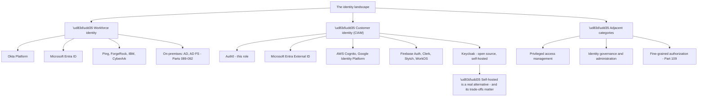
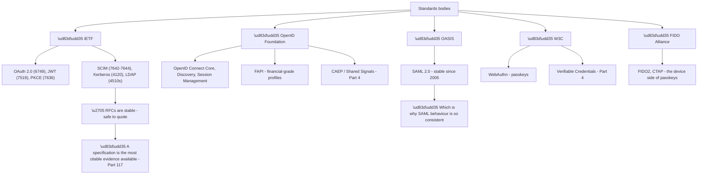
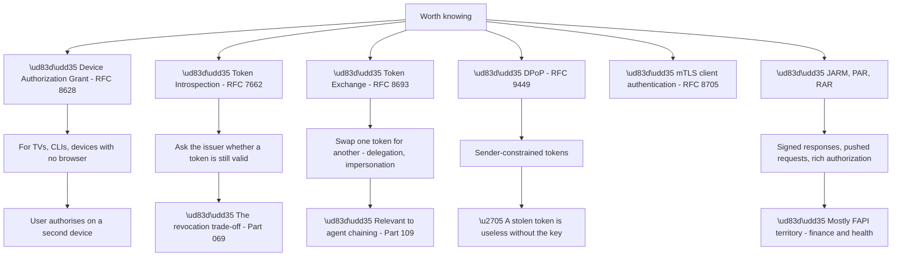
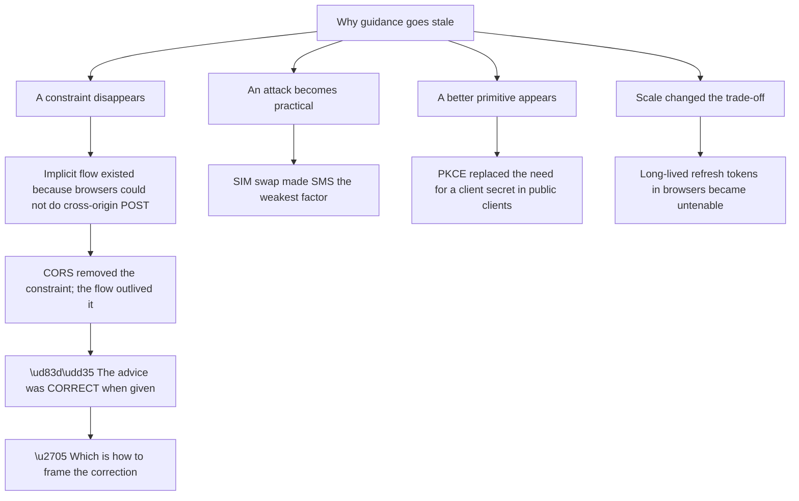
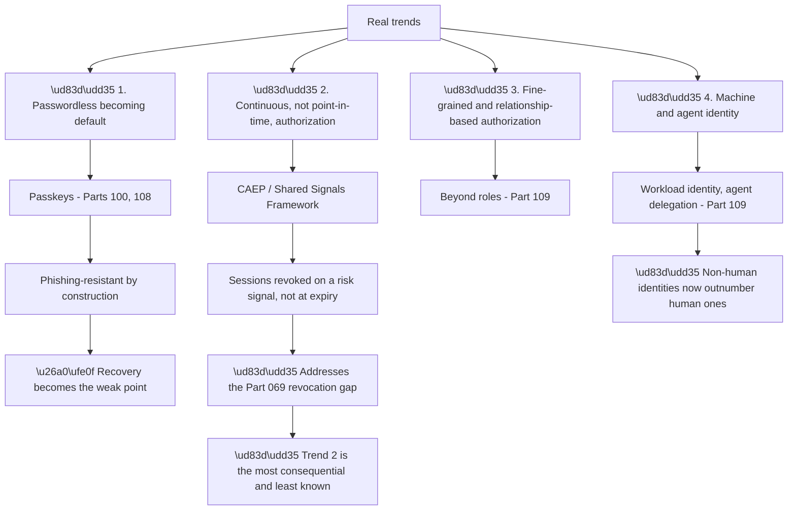
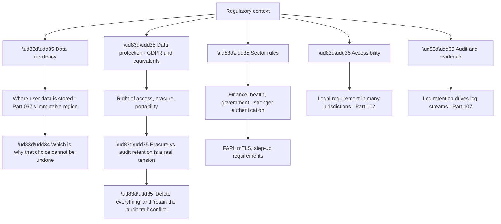
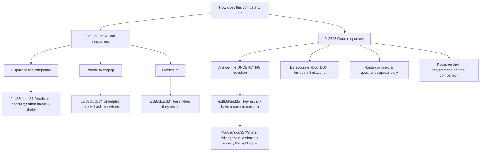
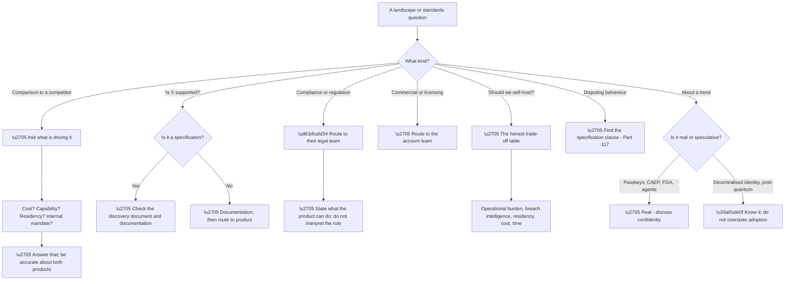

# Part 127 - Miscellaneous and Deeper Topics: Landscape, Standards, and Trends

> Section goal: Place everything learned so far in its wider context — the identity vendor landscape, the standards bodies that govern it, the specifications not yet covered, and where the field is genuinely heading.

Covers index item **127**. Maps to JD signals: *identity and access management*, *standards*, *industry awareness*, *architecture guidance*, *continuous improvement*, *customer-facing communication*.

---

## 1. Start From Zero: The Identity Landscape

Customers evaluate, migrate between, and combine identity products. **Knowing the landscape lets you understand their constraints rather than only their configuration.**

**Node R is worth understanding rather than dismissing.** **Keycloak and similar self-hosted options are a genuine choice** for organisations with data residency requirements, cost constraints at scale, or a preference for control — **and a customer weighing one is asking a legitimate question.**

**The honest comparison** is the one to be able to make:

| Dimension | Managed (Auth0) | Self-hosted (Keycloak) |
|---|---|---|
| Operational burden | Vendor | **You** |
| Upgrades and patching | Vendor | **You** |
| Breached-password intelligence | ✅ Included | ❌ Build it |
| Availability | Vendor SLA | Your infrastructure |
| Data residency | Region choice | **Complete control** |
| Cost at very high volume | Per-user | Infrastructure only |
| Time to production | Days | **Weeks to months** |

**Rows three and seven are the strongest arguments for managed**, and row five is the strongest for self-hosted. **Being able to state both sides credibly is more persuasive than advocacy**, and it is what a customer asking the question actually needs.

**Node C4 is worth knowing exists.** **A newer generation of developer-focused CIAM products** competes specifically on integration speed and developer experience — **and a customer comparing against them is comparing on that axis**, which is useful context for the conversation.

> 💡 **Tie-in to your background:** you have supported Microsoft identity products directly. **That is genuinely useful landscape knowledge** — you can speak about Entra from experience rather than from a comparison table, which is rare.

### 🔍 Plain-English deep-dive: the standards bodies and why they matter

Identity is unusually standards-driven, and **knowing which body owns what tells you how stable something is.**

**Node R is the practical value.** **Citing a specification converts an opinion into a defect claim** (Part 117) — *"RFC 6749 requires exact redirect URI matching"* is evidence in a way that *"I think it should work differently"* is not.

**Node A1a explains something you will have noticed.** **SAML has been stable since 2005**, which is why its failure modes are so consistent across every implementation — the specification has not moved, so the bugs are the same everywhere.

**OAuth and OIDC, by contrast, are still evolving**, which is why guidance changes and older material recommends superseded patterns (Part 125).

| Body | Owns | Stability |
|---|---|---|
| **IETF** | OAuth, JWT, SCIM, LDAP, Kerberos | Very high — RFCs |
| **OpenID Foundation** | OIDC, FAPI, Shared Signals | High, still extending |
| **OASIS** | SAML 2.0 | **Frozen since 2005** |
| **W3C** | WebAuthn, Verifiable Credentials | Evolving |
| **FIDO Alliance** | FIDO2, CTAP | Evolving |

**A practical habit worth having:** **when a customer disputes behaviour, find the specification clause.** It is usually short, unambiguous, and ends the discussion — and it works because neither party owns it.

**Analogy:** building regulations. Knowing which body issued which rule tells you how likely it is to change and how strongly you can rely on it in an argument. **Where it stops:** a regulation says what must happen, not what a specific product does — implementations differ within a specification, which is why the vendor documentation still matters.

---

## 2. Specifications Not Yet Covered

Several specifications appear in real conversations and have not been covered directly.

**Node S4b is the most significant of these for the future.** **DPoP makes a token useless to anyone who does not hold the corresponding private key**, which addresses the fundamental weakness of bearer tokens (Part 057) — **that possession equals authority.**

**Node S1b is the one you will actually see.** **The device authorization grant** is how a smart TV or a command-line tool authenticates: it shows a code, the user enters it on their phone, and the device polls until authorised. **It is increasingly common and its failure modes are distinctive** — expired codes, polling too fast, and the user completing on a different account than intended.

**Node S2b restates Part 069's trade-off.** **Introspection gives real-time revocation at the cost of a round-trip per validation**, which is exactly the trade a customer with a hard revocation requirement has to make (Part 094).

| Specification | When it comes up |
|---|---|
| Device grant | TVs, CLIs, IoT, kiosks |
| Introspection | Hard revocation requirements |
| Token exchange | Service-to-service delegation, agents |
| **DPoP** | **High-security APIs; the direction of travel** |
| mTLS client auth | Financial and regulated APIs |
| PAR / JARM / RAR | FAPI profiles |

**FAPI deserves a specific note.** **Financial-grade API profiles** tighten OAuth and OIDC considerably — mandatory PKCE, sender-constrained tokens, signed requests — and **a customer in finance or health may be required to meet them.** Recognising the acronym and knowing it means "a hardened profile" is usually sufficient.

### 🔍 Plain-English deep-dive: why specifications drift out of date in people's heads

Identity guidance changes, and **customers arrive with advice that was correct when they learned it.** Understanding why makes the correction kinder and more effective.

**Node R1 is the framing that works.** *"That was standard guidance several years ago and the constraint that justified it has gone"* **corrects without implying carelessness** — and it is true, which matters (Part 125).

| Superseded advice | Why it was right | Why it changed |
|---|---|---|
| Implicit flow for SPAs | No cross-origin POST | CORS |
| Client secret in every app | Confidential clients assumed | PKCE for public clients |
| SMS as a primary factor | Better than password alone | SIM swap became practical |
| Long refresh tokens everywhere | Sessions were server-side | Browser storage exposure |
| Passwords with forced rotation | Assumed compromise over time | Rotation drives weaker passwords |

**Every row is a case where the advice was sound and the world moved**, which is a much better story to tell a customer than one where they were wrong.

**Node D1a is worth knowing in detail** because it comes up often. **The implicit flow was not a mistake** — it solved a real browser limitation. **Explaining that makes the correction land**, because the developer understands *why* rather than just being told to change.

**The practical habit that follows:** **when correcting outdated guidance, say what changed.** It takes one clause, it is accurate, and it converts a correction into an explanation — which the developer can then apply elsewhere (Part 120's reason principle).

**And it applies to your own knowledge.** **Anything you learned more than a few years ago in this field deserves periodic re-checking**, because the same drift applies — which is why every Part in this guide carries a revalidation note.

**Analogy:** medical advice that was standard practice and has since been superseded by better evidence. The practitioner who says "that was right when you were told it, and here is what changed" is far more persuasive than one who implies the patient was misinformed. **Where it stops:** medical guidance is centrally revised. Technical advice persists in blog posts and training data indefinitely, so the correction has to be made repeatedly.

---

## 3. Where the Field Is Going

Four directions are genuinely underway rather than speculative.

**Node R is worth understanding properly.** **The Shared Signals Framework and CAEP address the structural weakness this guide has returned to repeatedly:** a token issued at time T remains valid regardless of what happens afterwards (Parts 069, 093, 094).

**Continuous access evaluation flips that.** When a risk signal occurs — a user is disabled, a device becomes non-compliant, a session is flagged — **the identity provider pushes a signal to relying parties, which revoke immediately.** It converts revocation from a polling problem into an event-driven one.

**Node T4b is a statement worth being able to make**, because it reframes what identity work is: **service accounts, workloads, containers, and now agents outnumber human identities in most organisations** — and they have no password to rotate, no MFA to enrol, and no user to consent.

| Trend | What it changes |
|---|---|
| Passkeys | Phishing becomes structurally harder |
| **Continuous evaluation** | **Revocation becomes real-time** |
| Fine-grained authorization | Permissions become object-level |
| Machine and agent identity | The majority of identities are not people |

**And two trends worth knowing but treating carefully:**

**Decentralised identity and verifiable credentials** — user-held credentials verifiable without contacting the issuer. **Genuine standards work at W3C, and adoption remains limited.** Worth knowing it exists; overstating its current relevance is a credibility risk.

**Post-quantum cryptography** — signature algorithms that survive quantum attack. **Relevant to JWT signing and TLS in due course**, and not yet an operational concern for most identity deployments. **Knowing the direction is enough.**

---

## 4. Regulatory and Compliance Context

Identity sits inside a regulatory environment that shapes customer requirements.

**Node RR is a genuine tension you will encounter.** **A right-to-erasure request and an audit retention obligation pull in opposite directions**, and the resolution is usually to erase personal data while retaining a non-identifying audit record. **It is not a support decision, and recognising it as a legal question rather than a technical one is the right response.**

**Node R1b explains Part 097's warning properly.** The tenant region is immutable **because data residency is frequently a legal requirement**, not a preference — and moving it would move regulated data.

**Node R5a is why log streams matter beyond convenience** (Part 107): **retention obligations frequently exceed platform retention**, so streaming to a system the customer controls is a compliance requirement rather than an optimisation.

**What support needs to know**, and where the boundary is:

| Know | Do not attempt |
|---|---|
| That these requirements exist | Interpreting the regulation |
| Which product features address them | Advising on compliance |
| That region choice is immutable | Assessing whether they are compliant |
| That erasure and audit conflict | Resolving that conflict for them |
| Where to route the question | — |

**"That's a question for your legal or compliance team, and here is what the product can do"** is the correct response — **helpful and appropriately bounded.**

### 🔍 Plain-English deep-dive: what to say when a customer asks about a competitor

Comparison questions arrive regularly, and **handling them well is a distinct skill.**

**Node R is the move that works.** **A comparison question almost always has a specific concern behind it** — cost at their scale, a capability they need, a migration they are considering, a mandate from their architecture team. **Asking what is driving it converts an unwinnable comparison into a solvable requirement.**

**Node B1a is worth avoiding on accuracy grounds as much as diplomatic ones.** **Disparaging a competitor usually involves saying something outdated or wrong**, and a customer who knows that product will notice — **which costs more credibility than the comparison was worth.**

| They ask | Likely underlying concern |
|---|---|
| "How does this compare to Cognito?" | Cost at scale, or AWS alignment |
| "Why not Keycloak?" | Cost, control, or data residency |
| "Entra External ID does this too" | Existing Microsoft commitment |
| "Team X uses Y" | Consolidation pressure internally |
| "Is this being deprecated?" | Risk of building on it |

**Every row is answerable factually** once you know which it is, **and none is answerable by comparison.**

**Node G2 is the credibility position.** **Being accurate about your own product's limitations** — that a managed service means less control, that per-user pricing scales differently from infrastructure — **makes everything else you say more believable.** A customer who has never heard you acknowledge a limitation discounts your positive claims.

**And there is a clean boundary:** **commercial and licensing questions go to the account team**, not because they are awkward but because support will get them wrong. **"I'll make sure the right person picks that up"** is the correct answer and is not a deflection.

**Analogy:** a specialist asked how their approach compares to another practice's. Running down the alternative is unbecoming and usually inaccurate; asking what specifically prompted the question is how you find out what they actually need. **Where it stops:** you can ask a patient directly. A customer comparing vendors may not want to say why, and pressing is counterproductive.

---

## 5. Failure Modes

| # | Failure mode | Symptom | Fix |
|---|---|---|---|
| 1 | Dismissing self-hosted options | Loses credibility | Know the honest trade-offs |
| 2 | Not knowing the standards bodies | Weaker defect claims | Cite the specification |
| 3 | Treating SAML as evolving | Wrong expectations | Frozen since 2005 |
| 4 | Treating OAuth as frozen | Outdated guidance repeated | Still evolving |
| 5 | Overstating decentralised identity | Credibility risk | Know it; do not oversell |
| 6 | Not recognising FAPI | Missed requirement | A hardened profile |
| 7 | Missing the device grant | Confused by TV/CLI flows | RFC 8628 |
| 8 | Not knowing DPoP | Missing the direction of travel | Sender-constrained tokens |
| 9 | Advising on compliance | **Out of scope, and risky** | Route to legal |
| 10 | Not knowing region is immutable | Bad onboarding advice | Data residency is legal |
| 11 | Disparaging competitors | Insecure and often inaccurate | Ask what is driving it |
| 12 | Refusing comparison questions | Unhelpful | Answer the underlying concern |
| 13 | Never acknowledging limitations | Positive claims discounted | Be accurate about both |
| 14 | Answering commercial questions | Wrong answers given | Route to the account team |

---

## 6. Troubleshooting Decision Tree: Landscape Questions

### Worked example

A customer's architecture team asks: *"We're being pushed to consolidate on Microsoft. Entra External ID does customer identity now. Why would we keep this?"*

**Node C: a comparison question**, and node C1: **the driver is an internal consolidation mandate**, which is stated openly.

**That is not really a product comparison** — it is a customer with internal pressure who needs either a defensible reason to stay or a realistic migration picture. **Both are legitimate outcomes, and pretending otherwise damages trust.**

**Asking what is driving it more precisely** reveals the shape: their Microsoft agreement makes Entra effectively free at their scale, and their architecture team values consolidation.

**The honest answer has three parts.**

**First, acknowledge the genuine case.** If they are heavily Microsoft-aligned and cost is the driver, **that is a real argument** and dismissing it would be transparent. **Saying so directly buys credibility for the rest.**

**Second, name what is specific to their situation.** They have eleven enterprise connections to customers using several different identity providers, a substantial set of Actions in their login pipeline, and a B2B organisation model. **The migration question is not "can Entra do customer identity" but "what does moving eleven enterprise connections and that extensibility actually involve"** — which is a concrete, answerable question rather than a comparison.

**Third, be accurate about limitations on both sides**, including yours. **A customer who has never heard you acknowledge a limitation discounts everything positive you say.**

**And route the commercial part.** Pricing at their scale, contract implications, and migration support **are account-team questions**, and answering them from support would produce wrong answers.

**What makes this work:** **treating it as a requirement question rather than a competitive one.** The architecture team's mandate is real, and **helping them understand the actual cost of the move — accurately, including where it is genuinely low — is more useful and more credible than advocacy.**

**And there is a support-specific value in it:** if they do migrate, **a customer who felt honestly advised speaks well of the product afterwards.** If they stay, they stay for a reason they can defend internally.

---

## 7. Lab: Map the Landscape

**Purpose.** Build the contextual knowledge that makes you credible beyond the product.

**Prerequisites.**
- Parts 001–126 completed
- **Public sources only**

**Steps.**

1. **List the identity products** in §1 from memory. Check against the Part, then verify each still exists and is current.
2. **For three CIAM alternatives**, write the honest trade-off against a managed platform. **Include at least one point in their favour each.**
3. **Map each specification you have encountered** to its standards body. Check against §1.
4. **Read one RFC you have not read** — RFC 8628 (device grant) is short and useful. **Summarise it in five sentences.**
5. **Read the DPoP abstract** and write why sender-constrained tokens matter, in two sentences.
6. **Find a specification clause** that would settle a dispute from this guide — exact redirect URI matching is a good one. **Note the RFC and section.**
7. **Write the four real trends** and, for each, one sentence on what it changes.
8. **Write the two trends to treat carefully** and why overstating them is a risk.
9. **Write your compliance boundary statement:** what you would say when asked a regulatory question.
10. **Write your competitor-question response**, using §6's structure.
11. **Write three limitations of the product you would acknowledge honestly**, and check they are accurate.
12. **Build your landscape card:** vendors, standards bodies, specifications by use case, trends, and boundaries.

**Expected evidence.**
- A vendor landscape from memory, corrected
- Three honest trade-off comparisons
- A specification-to-body map
- An RFC summary in five sentences
- A DPoP explanation in two
- A citable clause with its reference
- Four trends with consequences
- Two carefully-framed trends
- A compliance boundary statement
- A competitor response
- Three honest limitations
- Your landscape card

**Validation rubric.**

| Criterion | Pass |
|---|---|
| Landscape | You can name the main players in both categories |
| Trade-offs | Honest, including points against your own product |
| Standards bodies | You know who owns what and how stable it is |
| Specifications | You can name the right one for a use case |
| Trends | You separate real from speculative |
| Compliance | You know where your boundary is |
| Competitors | You ask what is driving the question |
| Limitations | You can name three accurately |

**Cleanup and privacy.** **Public sources only.** Do not reference an employer's or customer's vendor evaluations, and **do not repeat any non-public competitive information** you may have encountered elsewhere.

---

## 8. JD Mapping

| JD signal | How this Part addresses it |
|---|---|
| Identity and access management | The full landscape and its categories |
| Standards | Bodies, specifications, and citability |
| Industry awareness | Real trends versus speculation |
| Architecture guidance | Honest trade-offs including self-hosting |
| Customer-facing communication | Competitor and compliance boundaries |
| Continuous improvement | Knowing where the field is going |

---

## 9. Candidate Honesty Note

- **Production experience:** Microsoft identity products directly, which is genuine landscape knowledge rather than comparison-table familiarity.
- **Production experience:** working within regulatory constraints in an enterprise support context.
- **Lab experience:** mapping specifications to bodies, reading RFCs directly, and writing honest trade-off comparisons, as above.
- **Learned architecture:** the specifications not yet encountered in practice, and the real-versus-speculative trend split.
- **No direct experience:** evaluating or migrating between identity platforms; FAPI-profile deployments.
- **How to say it:** *"I've supported Microsoft identity products directly, so I can speak about Entra from experience rather than from a comparison sheet. The wider landscape I've mapped deliberately, including the honest case for self-hosting, because a customer asking that question deserves a real answer. And I'd be careful to separate real trends — passkeys, continuous evaluation, agent identity — from things like decentralised identity where overstating adoption would be a credibility risk."*

---

## 10. Official Source Anchors

| Source | Why | Accessed |
|---|---|---|
| RFC 8628 — Device Authorization Grant | Browserless device flows | Accessed **26 August 2026** |
| RFC 7662 — Token Introspection | Real-time validity checking | Accessed **26 August 2026** |
| RFC 8693 — Token Exchange | Delegation and impersonation | Accessed **26 August 2026** |
| RFC 9449 — DPoP | Sender-constrained tokens | Accessed **26 August 2026** |
| OpenID Foundation — Shared Signals and CAEP | Continuous access evaluation | Accessed **26 August 2026** |
| W3C — WebAuthn and Verifiable Credentials | Passkeys and decentralised identity | Accessed **26 August 2026** |
| OpenID Foundation — FAPI | Financial-grade profiles | Accessed **26 August 2026** |

> **Revalidate:** the vendor landscape and product names change frequently; specifications do not. **Re-check product names and positioning the week before interview**, and treat trend adoption claims as time-sensitive.

---

## ⭐ Likely Interview Questions for This Section

### Q1. "How would you describe the identity landscape?"

> *Model answer:* Two main categories with different buyers. Workforce identity — Okta Platform, Microsoft Entra ID, Ping, ForgeRock, and on-premises Active Directory and AD FS — serves an organisation's own employees, and IT buys it. Customer identity — Auth0, Entra External ID, Cognito, Google Identity Platform, and a newer generation of developer-focused products — serves an application's end users, and developers or product teams buy it. Then adjacent categories: privileged access management, identity governance, and fine-grained authorization as a distinct thing. And self-hosted options like Keycloak, which are a genuine choice for organisations with data residency requirements or cost constraints at scale, and worth being able to discuss honestly rather than dismissing.

### Q2. "A customer asks why they shouldn't self-host. What do you say?"

> *Model answer:* I would give the honest trade-off rather than advocacy, because a customer asking that question can tell the difference. Self-hosting gives complete control over data residency and costs infrastructure rather than per-user, which at very high volume can matter a lot. What they take on is the operational burden — availability, upgrades, patching, scaling — and they lose capabilities that are hard to rebuild, particularly breached-password intelligence, which needs current compromised-credential corpora that a single organisation cannot practically maintain. Time to production is also weeks to months rather than days. Being accurate about both sides makes the rest of what I say more believable; a customer who has never heard me acknowledge a limitation discounts my positive claims.

### Q3. "Which standards bodies matter, and why does it help to know?"

> *Model answer:* IETF owns OAuth, JWT, PKCE, SCIM, LDAP, and Kerberos — all RFCs, very stable and safe to quote. The OpenID Foundation owns OpenID Connect, FAPI, and the Shared Signals work. OASIS owns SAML 2.0, which has been frozen since 2005 — that is why SAML failure modes are so consistent across every implementation, because the specification has not moved. W3C owns WebAuthn and verifiable credentials, and the FIDO Alliance owns the device side of passkeys. Knowing this matters practically because citing a specification converts an opinion into a defect claim. "RFC 6749 requires exact redirect URI matching" is evidence in a way that "I think it should work differently" is not, and it works because neither party owns it.

### Q4. "What specifications should I know that we haven't covered?"

> *Model answer:* The device authorization grant, RFC 8628, is the one you actually encounter — it is how a smart TV or a CLI authenticates, showing a code the user enters on their phone while the device polls. Token introspection, 7662, lets you ask the issuer whether a token is still valid, which is the real-time revocation trade-off at the cost of a round-trip. Token exchange, 8693, for delegation between services and increasingly for agent chaining. And DPoP, RFC 9449, which is the most significant for the future: it makes a token useless without the corresponding private key, addressing the fundamental weakness of bearer tokens, which is that possession equals authority. Then FAPI, which is a hardened profile customers in finance or health may be required to meet.

### Q5. "Where is identity actually heading?"

> *Model answer:* Four things that are genuinely underway. Passwordless becoming the default through passkeys, which are phishing-resistant by construction — with the caveat that recovery becomes the weak point. Continuous access evaluation through the Shared Signals Framework, which is the most consequential and least known: it addresses the structural gap that a token issued at time T stays valid regardless of what happens afterwards, by pushing revocation signals to relying parties rather than waiting for expiry. Fine-grained, relationship-based authorization beyond roles. And machine and agent identity, which matters because non-human identities now outnumber human ones in most organisations. I would separate those from decentralised identity and post-quantum, which are real standards work with limited current adoption — worth knowing, and overstating them would be a credibility risk.

### Q6. "A customer asks a compliance question. What do you do?"

> *Model answer:* Route it, while being genuinely useful about the product side. I can say what the product does — that the tenant region is immutable because data residency is often a legal requirement, that log streams exist partly because retention obligations frequently exceed platform retention, that accessibility on a custom login page becomes their responsibility. What I would not do is interpret the regulation or assess whether they are compliant, because that is out of scope and getting it wrong is genuinely risky for them. The tension I would flag rather than resolve is between right-to-erasure and audit retention, which pull in opposite directions — the usual answer is erasing personal data while retaining a non-identifying audit record, but that is a decision for their legal team.

### Q7. "How do you handle a competitor comparison question?"

> *Model answer:* By asking what is driving it, because a comparison question almost always has a specific concern behind it — cost at their scale, a capability they need, an internal consolidation mandate, or a migration they are already considering. Answering the underlying concern is possible; answering the comparison generally is not. What I would avoid is disparaging the competitor, which reads as insecurity and usually involves saying something outdated that a customer who knows that product will notice. And I would route commercial and licensing questions to the account team — not because they are awkward, but because support will get them wrong.

### Q8. "Their architecture team wants to consolidate on Microsoft. How do you respond?"

> *Model answer:* By treating it as a requirement question rather than a competitive one, and by acknowledging the genuine case first — if they are heavily Microsoft-aligned and their agreement makes it effectively free at their scale, that is a real argument and dismissing it would be transparent. Then I would make the question concrete: the useful thing is not whether Entra can do customer identity, it is what moving their eleven enterprise connections, their Actions pipeline, and their organisation model actually involves. That is answerable. I would be accurate about limitations on both sides, and route the commercial part. If they migrate, a customer who felt honestly advised speaks well of the product afterwards; if they stay, they stay for a reason they can defend internally.

---

## 🧠 30-Second Memory Hooks

- **Two categories: workforce and customer identity. Different buyers, different products.**
- **Self-hosting is a real choice.** Know the honest trade-offs.
- **IETF = OAuth, JWT, SCIM, LDAP, Kerberos. OASIS = SAML. OIDF = OIDC, FAPI, CAEP. W3C = WebAuthn.**
- **SAML frozen since 2005** — which is why its bugs are identical everywhere.
- **OAuth still evolving** — which is why old guidance persists.
- **Cite the specification. It ends disputes because neither party owns it.**
- **Device grant (8628) for TVs and CLIs. Introspection (7662) for real-time revocation.**
- **DPoP (9449): a stolen token is useless without the key.**
- **FAPI = a hardened profile.** Finance and health.
- **Real trends: passkeys · continuous evaluation · fine-grained authz · agent identity.**
- **Careful: decentralised identity, post-quantum.**
- **Non-human identities now outnumber human ones.**
- **Compliance: state what the product does; route the interpretation.**
- **Competitor question → "what's driving it?"**
- **Acknowledge real limitations** — it makes everything else credible.

---

## ✅ Completion Checklist

- [ ] I can describe both identity categories and their main players
- [ ] I can give the honest self-hosting trade-off
- [ ] I know which body owns which specification and how stable each is
- [ ] I can cite a clause to settle a dispute
- [ ] I know the device grant, introspection, token exchange, and DPoP
- [ ] I can separate real trends from speculative ones
- [ ] I can explain continuous access evaluation and why it matters
- [ ] I know my compliance boundary and can state it
- [ ] I ask what is driving a competitor question
- [ ] I can name three honest limitations of the product
- [ ] I have built my landscape card

*Next suggested section:* **[Part 128 - Mock Interviews and Live Troubleshooting Drills](Part-128-mock-interviews-and-live-troubleshooting-drills.md)** — rehearsing under realistic conditions, including live problem-solving where you have to think aloud.
