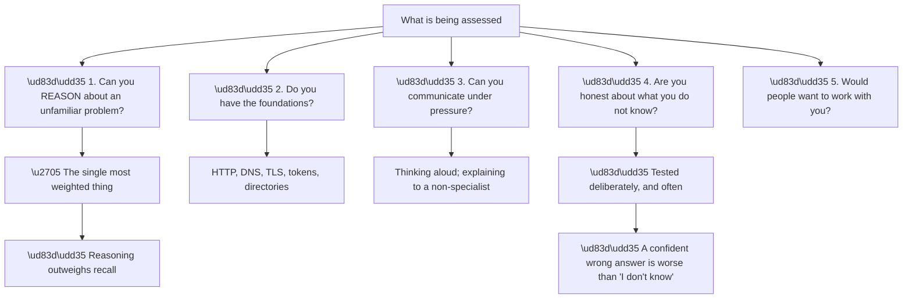
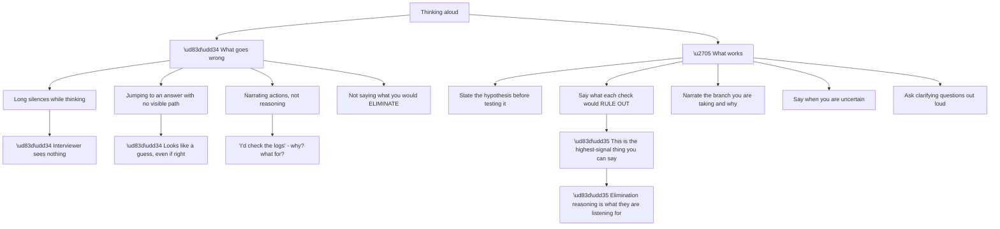
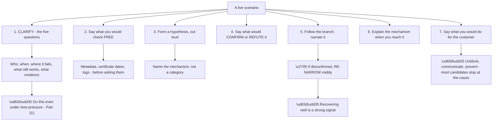
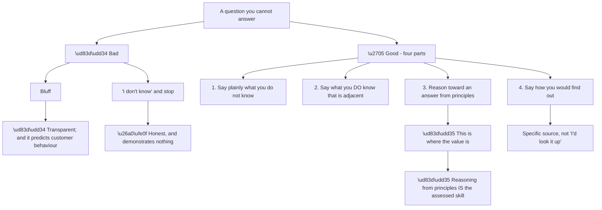
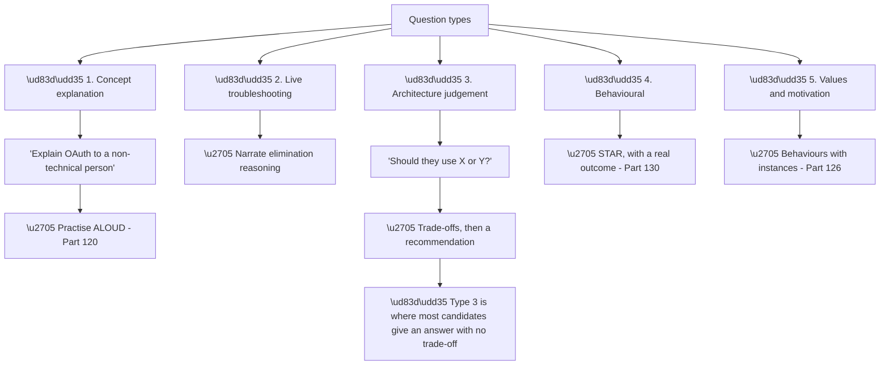
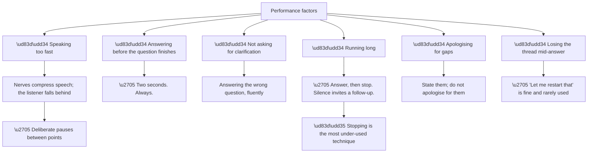
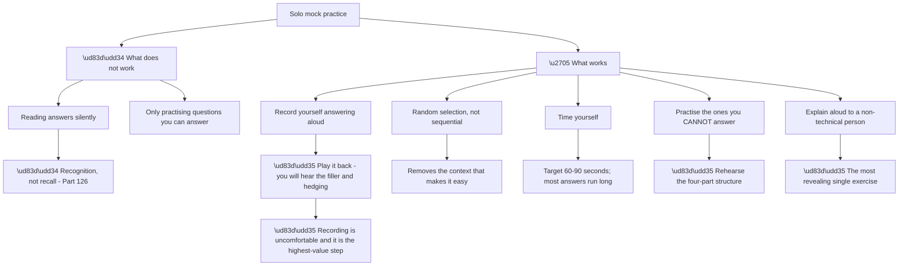
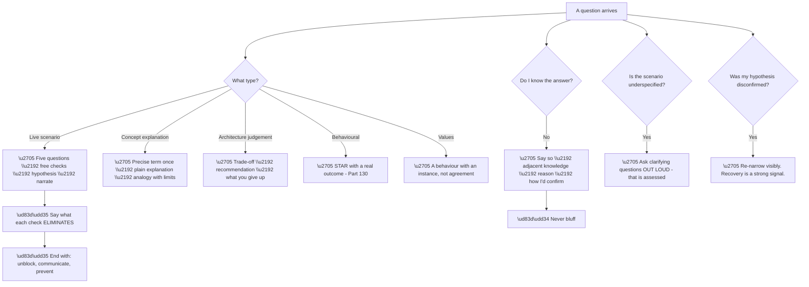

# Part 128 - Mock Interviews and Live Troubleshooting Drills

> Section goal: Rehearse under realistic conditions — including the live troubleshooting exercise where you must think aloud, and the moments where you do not know the answer.

Covers index item **128**. Maps to JD signals: *interview readiness*, *troubleshooting complex technical issues*, *customer-facing communication*, *problem-solving under pressure*, *self-assessment*.

---

## 1. Start From Zero: What Is Actually Being Assessed

Interviews test fewer things than they appear to, **and knowing which makes preparation far more efficient.**

**Node R is the reassurance and the instruction.** **Reasoning outweighs recall**, which means a candidate who narrows well and says "I'd check X because it would eliminate Y" **outperforms one who recites facts** — and it means preparation should focus on method rather than memorisation.

**Node R2 is worth internalising properly.** Interviewers ask questions you cannot answer **deliberately**, to see what you do. **Bluffing is transparent and it is a red flag** — it suggests the same behaviour with a customer, where a confident wrong answer gets implemented (Part 096).

| What they infer from | Signal |
|---|---|
| How you narrow | Whether you can work an unfamiliar problem |
| Which question you ask first | Domain judgement |
| **How you handle not knowing** | **Honesty and self-awareness** |
| How you explain something | Communication under pressure |
| Whether you ask clarifying questions | Whether you assume or check |

> 💡 **Tie-in to your background:** you have handled CRITSITs — **thinking clearly under pressure while being observed is something you have done for real**, which is exactly what a live exercise simulates.

### 🔍 Plain-English deep-dive: thinking aloud, which is a skill rather than a trait

Live troubleshooting exercises require narrating your reasoning, **and most people are bad at it initially because it is not how they normally think.**

**Node G2a is the single most valuable habit in a live exercise.** **Saying what a check would eliminate demonstrates that you understand the problem space**, not just that you know a tool exists.

**Compare:**

| Weak | Strong |
|---|---|
| "I'd look at the logs" | "I'd check whether there's a log entry at all — if there isn't, the request never arrived, which eliminates everything on our side" |
| "I'd check the token" | "I'd decode the token first, because it answers audience, scope, and expiry in one look" |
| "Maybe it's a certificate" | "Total failure on a date with no change points at expiry — I'd check the metadata dates, which costs seconds" |

**Every strong version names what the check buys**, which is the reasoning the interviewer is trying to see.

**Node B1a is worth managing deliberately.** **Silence while thinking is invisible**, so narrate the thinking itself: *"I'm trying to decide whether the population split matters more than the timing here — I think it does, because…"* **That is not filler; it is the assessed content.**

**Node G5 is under-used and specifically valuable.** **Asking clarifying questions demonstrates that you do not assume** — and in a deliberately underspecified scenario, **the questions you ask are more informative than the answer you reach.**

**Analogy:** an examiner watching someone solve a problem. They can see the answer at the end either way; the working is what tells them whether it will generalise. **Where it stops:** in an exam the working is written down. In an interview it only exists if you say it.

---

## 2. The Live Troubleshooting Drill

Expect a scenario, deliberately underspecified, with an interviewer playing the customer.

**Node P7a is the differentiator.** **Most candidates identify the cause and stop.** Saying what you would do next — unblock immediately, communicate the mechanism, recommend the prevention — **demonstrates that you understand the job rather than only the puzzle.**

**Node P5b is worth knowing because it feels like failure.** **An interviewer who disconfirms your hypothesis is usually testing recovery**, not catching you out. **Re-narrowing calmly and visibly is a better signal than being right first time**, because it is what the job actually requires.

**A drill in the shape you should expect:**

> *"A customer says their users can't log in. Started this morning. What do you do?"*

**A strong opening**, in about forty seconds:

> Five things first, and I'd ask them while starting my own checks. Who's affected — everyone, a subset, one office, only new users? When exactly — the log usually knows better than they do. Where does it fail — before the login page, at it, after returning, or at their API? What still works? And what evidence do they have — a correlation ID, a timestamp with time zone, and ideally one user it works for.
>
> While I wait, I'd do the free checks: fetch their discovery document, check certificate and secret expiry, and read the tenant log for that window. That's under a minute and it usually eliminates two or three families — especially expiry, which is the most common cause of a sudden total failure with no change.
>
> The log will also give me a precise start time, which turns "this morning" into a two-minute window and makes an external change findable.

**Everything in that answer is method**, and none of it requires knowing the answer.

---

## 3. Answering When You Do Not Know

This is tested deliberately, **and there is a structure that works.**

**Node R is the reframing.** **A question you cannot recall the answer to is an opportunity to demonstrate reasoning**, which is what they are weighting most heavily anyway.

**A worked example:**

> *"What's the maximum size of a JWT that can be sent in an HTTP header?"*
>
> I don't know a specific number, and I'd be cautious about one because it varies by server. What I do know is that the limit isn't in the JWT specification — it's imposed by whatever handles the request, and typical web servers default to something in the region of 8 kilobytes for total header size, configurable either way.
>
> The practical consequence is what matters: tokens grow with claims and group memberships, and when they exceed a header limit you get a 431 or a connection reset rather than a helpful error. The signature is that it affects long-tenured staff and managers first, because they've accumulated the most group memberships. That's the same failure family as Kerberos token bloat and group overage.
>
> I'd confirm the actual limit against the specific server's documentation rather than assume, because a proxy in front of it may impose a lower one.

**Four parts, and the value is in parts two and three** — the reasoning demonstrates more than the number would have.

| Part | Purpose |
|---|---|
| Say what you do not know | Honesty, immediately |
| Adjacent knowledge | Shows the territory is not unfamiliar |
| **Reason from principles** | **The assessed skill** |
| How you would find out | Specific, not vague |

---

## 4. Drill Categories

Five kinds of question, **each rewarding different preparation.**

**Node R is a common weakness.** **An architecture question answered with a recommendation and no trade-off** sounds either arbitrary or memorised. **Naming what you give up is what makes a recommendation credible** (Part 127).

**The structure for type three:**

> *"Should a single-page application use the implicit flow or authorization code with PKCE?"*
>
> Authorization code with PKCE. The reason implicit existed was that browsers couldn't do a cross-origin POST to the token endpoint, and CORS solved that — so the constraint that justified it is gone. Implicit returns tokens in the URL fragment, where they leak through browser history, referrer headers, and server logs, and there's no way to bind the response to the original request. PKCE gives you the code flow with a proof the requester is the same party that started it, without needing a client secret.
>
> What you give up is nothing meaningful now — it's one extra request. The only reason to see implicit today is legacy code or outdated guidance, which is common enough that I'd expect to correct it fairly often.

**Trade-off named, recommendation given, and the historical reason explained** — which demonstrates understanding rather than recall.

**For type one**, the test is genuinely different: **explaining well to a non-specialist is harder than explaining accurately** (Part 120), **and it must be practised aloud** because written fluency does not transfer.

### 🔍 Plain-English deep-dive: managing the physical and mental side

Interview performance is affected by things that have nothing to do with knowledge, **and most of them are manageable.**

**Node R is worth practising deliberately.** **Finishing an answer and stopping** feels abrupt from the inside and reads as confident from the outside. **Continuing past the answer** — adding qualifications, restating, drifting — **dilutes what was already good**, and it is what most nervous candidates do.

**Silence after an answer is not a problem to fill.** It usually means the interviewer is deciding what to ask next.

| Habit | Effect |
|---|---|
| **Two-second pause before answering** | Prevents answering the wrong question |
| Deliberate pauses between points | The listener keeps up |
| **Stopping when done** | Reads as confident |
| Stating gaps without apology | Reads as self-aware |
| "Let me restart that" | Recovers cleanly; rarely used |

**Node P2a is the cheapest improvement available.** **Two seconds before answering** costs nothing, prevents answering a question that had not finished, and reads as considered rather than reactive.

**Node P5a is a real distinction.** *"I haven't used Okta in production"* is a statement. *"I'm sorry, I haven't used Okta in production, I know that's a gap"* **converts a fact into an apology** and invites the interviewer to weight it more heavily than they otherwise would (Part 126).

**Node P6a is under-used and effective.** **"Let me restart that"** is entirely acceptable, takes three words, and produces a better answer than pushing through a sentence that has lost its structure. **Almost nobody does it**, which is part of why it works.

**And one practical point:** for a remote interview, **check the setup beforehand** — audio, camera, connection, and whether you can share a screen if a live exercise requires it. **A technical problem in the first two minutes costs composure**, and it is entirely preventable.

**Analogy:** a musician who has practised the piece and not the performance. The notes are there, and nerves change the tempo, the breathing, and the recovery from a slip. **Where it stops:** a musician can rehearse the whole performance. An interview's questions are unknown, which is why recoverable habits matter more than scripted answers.

---

### 🔍 Plain-English deep-dive: running a useful mock interview alone

Most people cannot arrange a realistic mock, **and solo practice works if it is structured.**

**Node R is worth pushing through.** **Recording yourself is unpleasant and it is where the improvement is** — you will hear hedging, filler, sentences that never finish, and answers that ran to three minutes when they felt like one.

**None of that is visible from the inside.**

**Node G5a is the exercise that finds the real gaps.** **Explaining a mechanism to someone non-technical exposes whether you understand it** (Part 126's writing test, spoken). **The moment you reach for jargon is the moment you found the gap.**

| Exercise | Reveals |
|---|---|
| **Recording and playback** | Filler, hedging, length |
| Random selection | Whether recall works without context |
| Timing | Whether answers run long |
| **Practising unknowns** | Whether the four-part structure is automatic |
| **Explaining to a non-specialist** | Whether you actually understand it |
| Live drill with a scenario | Whether narration is fluent |

**A workable solo routine:**

**Twenty minutes, three times a week.** Five questions chosen at random from Part 129, answered aloud and recorded. **Play back two.** One live scenario narrated end to end. **One concept explained to someone non-technical**, weekly.

**That is enough**, and it is more than most candidates do.

**Node G4a deserves specific rehearsal.** **The four-part structure for unknowns should be automatic**, because it is the moment where composure matters most. **Practising it on questions you genuinely cannot answer** — deliberately choosing them — **is what makes it available under pressure.**

**Analogy:** rehearsing a presentation by reading the slides versus standing up and delivering it to an empty room with a timer. Only one of them tells you that the third section takes twice as long as you thought. **Where it stops:** an empty room does not interrupt or ask a follow-up, which is why a real person, even briefly, is worth arranging if possible.

---

## 5. Failure Modes

| # | Failure mode | Symptom | Fix |
|---|---|---|---|
| 1 | Silence while thinking | Nothing visible to assess | Narrate the reasoning |
| 2 | Jumping to an answer | Looks like a guess | Show the path |
| 3 | Narrating actions, not reasoning | Low signal | Say what each check eliminates |
| 4 | Bluffing an unknown | **Red flag** | Four-part structure |
| 5 | "I don't know" and stopping | Demonstrates nothing | Reason from principles |
| 6 | No clarifying questions | Assumes rather than checks | Ask them aloud |
| 7 | Stopping at the cause | Misses the job | Unblock, communicate, prevent |
| 8 | Recommendation with no trade-off | Sounds arbitrary | Name what you give up |
| 9 | Practising silently | Recognition, not recall | Aloud, recorded |
| 10 | Sequential practice only | Context makes it easy | Random selection |
| 11 | Answers running long | Loses the interviewer | Time to 60–90 seconds |
| 12 | Never practising unknowns | Composure fails when it matters | Deliberately choose them |
| 13 | Jargon with a non-specialist | Explanation fails | Practise on a real person |
| 14 | Panicking when disconfirmed | Reads as fragility | Re-narrow visibly and calmly |

---

## 6. Troubleshooting Decision Tree: In the Room

### Worked example

An interviewer says:

> *"I'm a developer. My users are getting logged out about every hour and I don't know why. Go."*

**Deliberately underspecified**, and the clarifying questions are the assessed content.

**A strong response**, narrated:

> First, a few things that would narrow this quickly. Does it affect all browsers, or only some? Is it a single-page application or server-rendered? Are users prompted to log in again, or do they just find themselves signed out? And roughly an hour — is that consistent, or does it vary?
>
> I'm asking about browsers because if it's Safari and Firefox but not Chrome, that's almost certainly third-party cookie blocking preventing silent renewal, and the fix is a custom domain rather than anything in the identity configuration. If it's all browsers, that eliminates cookies and points at the application not handling the interaction-required error — so instead of falling back to an interactive prompt, it just fails, and the user experiences a silent logout.
>
> The single-page question matters because SPAs get deliberately short refresh token lifetimes, but that's typically about a day rather than an hour, so an hourly interval points more at access token lifetime with renewal failing.
>
> If they tell me it's all browsers and a SPA, my hypothesis would be unhandled interaction-required. I'd confirm by asking whether the browser console shows that error, and by looking at the tenant log for the renewal attempts.
>
> And once we found it — I'd unblock by explaining the fallback pattern, and the prevention I'd raise is that this also masks any Conditional Access change upstream, because the same error is how a new MFA requirement surfaces.

**Reading what it demonstrates:**

| Element | Signal |
|---|---|
| Clarifying questions first | Does not assume |
| **"I'm asking because…"** | **Elimination reasoning made visible** |
| Two branches with different causes | Structured problem space |
| A distinguishing detail (a day vs an hour) | Domain knowledge applied |
| A named hypothesis with confirmation | Method |
| **Unblock and prevention** | **Understands the job, not just the puzzle** |

**The second paragraph is doing the most work.** **Saying why each question is being asked** converts a list of questions into visible reasoning — which is exactly what is being assessed.

**And the last paragraph is what most candidates omit.** **Naming a prevention, and noting that the same symptom masks a different upstream cause**, demonstrates depth without needing to be prompted.

---

## 7. Lab: Run Your Own Mocks

**Purpose.** Build fluency under realistic conditions, including the parts that are uncomfortable.

**Prerequisites.**
- Parts 001–127 completed
- A recording device; ideally one willing non-technical person

**Steps.**

1. **Set up recording.** Any phone works. **Commit to playing back at least a third of what you record.**
2. **Choose five questions at random** from Part 129 or from any Part's question section. **Answer aloud, timed.**
3. **Play back two.** Note filler words, hedging, unfinished sentences, and length.
4. **Rewrite the two weakest** and re-record them.
5. **Deliberately choose three questions you cannot answer.** **Practise the four-part structure** on each.
6. **Run a live scenario:** take a failure mode from Groups I–J, have someone read it to you as a customer, and narrate end to end.
7. **Score yourself on narration:** did you say what each check would eliminate? Did you end with unblock, communicate, prevent?
8. **Explain one mechanism to a non-technical person** — OAuth, or why login might fail after a certificate rotation. **Ask them to explain it back.**
9. **Practise three architecture questions**, each with a named trade-off.
10. **Practise the disconfirmation recovery:** have someone tell you your hypothesis is wrong mid-answer, and re-narrow aloud.
11. **Time a full mock:** five questions and one scenario, thirty minutes.
12. **Build your drill card:** the five question types, the four-part unknown structure, and your narration checklist.

**Expected evidence.**
- Recordings, with at least a third played back
- Two rewritten and re-recorded answers
- Three unknowns answered with the four-part structure
- A narrated live scenario, scored
- A non-technical person explaining a mechanism back to you
- Three architecture answers with trade-offs
- A recovered disconfirmation
- A timed full mock
- Your drill card

**Validation rubric.**

| Criterion | Pass |
|---|---|
| Narration | You say what each check eliminates |
| Clarifying questions | Asked aloud, with reasons |
| Unknowns | Four-part structure is automatic |
| Length | 60–90 seconds typical |
| Trade-offs | Named on every architecture answer |
| Ending | Unblock, communicate, prevent |
| Recovery | Calm re-narrowing when disconfirmed |
| Non-technical explanation | They can explain it back |

**Cleanup and privacy.** **Use only this guide's scenarios or synthetic ones.** Do not rehearse using a real employer or customer incident (Part 112), and **delete recordings** when you have finished with them.

---

## 8. JD Mapping

| JD signal | How this Part addresses it |
|---|---|
| Interview readiness | Realistic rehearsal across five question types |
| Troubleshooting complex technical issues | Live narration of the method |
| Customer-facing communication | Explaining aloud to a non-specialist |
| Problem-solving under pressure | Disconfirmation recovery |
| Self-assessment | Handling unknowns honestly |

---

## 9. Candidate Honesty Note

- **Production experience:** thinking clearly under pressure while observed — CRITSITs are exactly this.
- **Production experience:** explaining technical findings to non-technical stakeholders in real time.
- **Lab experience:** recorded solo mocks, deliberate practice on unknowns, and non-technical explanation testing, as above.
- **Learned architecture:** the five question types and what each rewards.
- **No direct experience:** technical interviews for this specific role.
- **How to say it:** *"The live troubleshooting format suits how I already work — narrating reasoning while under observation is what a CRITSIT bridge call is. What I practised deliberately was the questions I can't answer, because that's where composure matters most and bluffing would be the worst possible signal."*

---

## 10. Official Source Anchors

| Source | Why | Accessed |
|---|---|---|
| Okta Developer Forum — `devforum.okta.com` | Realistic scenario material | Accessed **26 August 2026** |
| Auth0 Docs — Troubleshooting | The knowledge a live drill draws on | Accessed **26 August 2026** |
| This guide, Parts 111–118 | The method being narrated | — |

> **Revalidate:** interview formats vary. Treat this as preparation for the common shapes rather than a prediction of the process.

---

## ⭐ Likely Interview Questions for This Section

### Q1. "How do you approach a problem you've never seen?"

> *Model answer:* By narrowing before investigating. Five questions: who is affected — everyone, a subset, one office, only new users, only senior staff? When did it start, and does the log know more precisely than the customer does? Where does it fail — before the identity provider, at it, after returning, or at the API? What still works? And what does the evidence actually say rather than what anyone believes is configured. Those narrow it to a layer before I open a log. Then the free checks — metadata, certificate dates, tenant logs — which need nothing from the customer and usually eliminate two or three families. Only then a hypothesis, and I'd say out loud what would confirm or refute it.

### Q2. "What do you do when you don't know the answer?"

> *Model answer:* Say so, then reason. Four parts: state plainly what I don't know, say what I do know that's adjacent, reason toward an answer from principles, and say specifically how I'd confirm it. The reasoning is the valuable part, because that's the skill that transfers — recall isn't. What I wouldn't do is bluff, partly because it's transparent and partly because in developer support a confident wrong answer gets implemented and shipped, so the same behaviour that's a bad interview signal is a genuinely costly habit on the job.

### Q3. "Walk me through a live scenario. Users can't log in, started this morning."

> *Model answer:* I'd ask five things while starting my own checks: who's affected, the precise time — the log usually knows better than the customer — where it fails, what still works, and whether they have a correlation ID plus one user it works for. Meanwhile I'd fetch their discovery document, check certificate and secret expiry, and read the tenant log for that window. That's under a minute and it usually eliminates expiry, which is the commonest cause of sudden total failure with no change. The log also gives me a precise start time, which turns "this morning" into a two-minute window and makes an external change findable — a third-party API changing its response shape, for instance, which the customer wouldn't have thought to mention.

### Q4. "Why is it important to say what a check would eliminate?"

> *Model answer:* Because that's the reasoning, and it's what distinguishes understanding the problem space from knowing that a tool exists. "I'd look at the logs" says almost nothing; "I'd check whether there's a log entry at all, because if there isn't the request never arrived and that eliminates everything on our side" shows I know what the check buys. It's also how I actually work — the value of the free checks is precisely that they eliminate families cheaply. In a live exercise the interviewer can only assess what I say, so reasoning that stays internal is invisible, which is why narrating it matters as much as doing it.

### Q5. "Your hypothesis turns out to be wrong. What then?"

> *Model answer:* Re-narrow rather than dig, and do it visibly. The instinct is to keep looking where you started because you've already invested there, and it's usually wrong — a hypothesis that fails a good confirming test rarely improves with more effort in the same place. So I'd go back to the narrowing questions and specifically ask what I assumed without checking, because unchecked assumptions are where wrong investigations start. I'd also treat being disconfirmed as normal rather than a setback; recovering calmly is a better signal than being right first time, because the job produces disconfirmation constantly.

### Q6. "How would you explain OAuth to someone non-technical?"

> *Model answer:* I'd name the real term once and then explain it, so they have vocabulary they can use with their own engineers. Something like: OAuth is how you let one application do something on your behalf in another, without giving it your password. When you let a photo printing service reach your cloud storage, you're not handing over your storage password — you're sent to the storage provider, you approve a specific limited thing, and the printing service gets a token that only does that. The analogy is a hotel key card that opens your room and the gym and nothing else, and it expires. Where the analogy stops is that a key card is physical, so possession is the whole security — which is exactly the weakness tokens have too, and why things like sender-constrained tokens exist.

### Q7. "How have you prepared for this?"

> *Model answer:* Structurally rather than by reading. I worked the protocols properly with reproductions rather than just understanding them conceptually, built labs across the platform on free tiers, and read the developer forum to see what the questions actually look like rather than guessing. For the interview specifically I recorded myself answering aloud and played it back, which is uncomfortable and where the improvement is — you hear the hedging and the answers that ran to three minutes. I deliberately practised questions I couldn't answer, to make the structure automatic. And I explained mechanisms to a non-technical person and asked them to explain them back, which is the fastest way to find out whether you actually understand something.

### Q8. "What would you want to ask us?"

> *Model answer:* A few things that would tell me how to do the job well here. How does someone get recognised — whether writing things up and helping colleagues counts, or only measured output, because that determines whether the deflection work is realistic. What happens when someone declines a customer's request on security grounds, because that tells me whether "always secure" is operational or aspirational. How support findings reach product, since that's where the highest-leverage work goes. And what a strong first year looks like, so I can calibrate against my own expectation — which is contributing on method from week one and being slower on product-specific diagnosis for a few months.

---

## 🧠 30-Second Memory Hooks

- **Reasoning outweighs recall.** Method beats memorisation.
- **A confident wrong answer is worse than "I don't know."**
- **Say what each check ELIMINATES** — the highest-signal thing you can say.
- **Narrate the thinking, not the actions.**
- **Ask clarifying questions out loud, with reasons.**
- **End with unblock, communicate, prevent** — most candidates stop at the cause.
- **Unknowns: say so → adjacent → reason → how you'd confirm.**
- **Architecture answers need a named trade-off.**
- **Disconfirmed? Re-narrow visibly. Recovery is a strong signal.**
- **Record yourself. Play it back. It is where the improvement is.**
- **Practise randomly, not sequentially.**
- **60–90 seconds.** Most answers run long.
- **Deliberately practise what you cannot answer.**
- **Explain to a non-specialist and have them explain it back.**

---

## ✅ Completion Checklist

- [ ] I narrate reasoning, not actions
- [ ] I say what each check would eliminate
- [ ] I ask clarifying questions aloud, with reasons
- [ ] I end scenarios with unblock, communicate, prevent
- [ ] The four-part unknown structure is automatic
- [ ] Every architecture answer names a trade-off
- [ ] I recover calmly from disconfirmation
- [ ] I have recorded and played back my answers
- [ ] I practise randomly and timed
- [ ] I have explained a mechanism to a non-technical person successfully
- [ ] I have questions of my own prepared

*Next suggested section:* **[Part 129 - Interview Question Bank: 250+ Questions](Part-129-interview-question-bank-250-questions.md)** — the consolidated bank, organised by topic, for randomised drilling.
